**Volume 47. Artificial General Intelligence**

# Chapter 01. Foundations of AGI

## 01.00. What is Intelligence

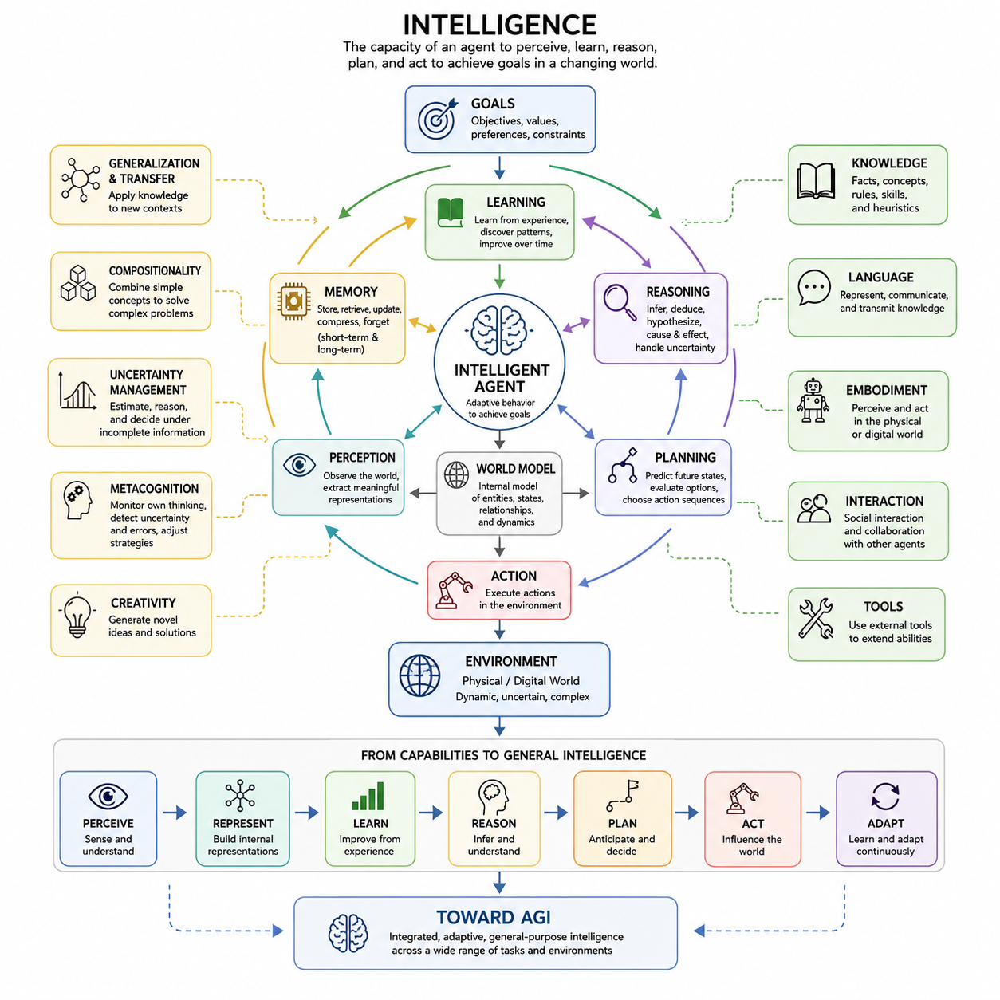{width="7.268055555555556in" height="7.268055555555556in"}

Intelligence can be understood as the capacity of an agent to acquire information, construct useful representations, learn from experience, reason about situations, and select actions that improve its ability to achieve goals. This definition deliberately extends beyond solving puzzles or producing correct answers. Intelligence concerns how effectively a system converts perception, knowledge, memory, and experience into adaptive behavior across changing environments.

A central characteristic of intelligence is adaptation. An intelligent agent cannot depend entirely on fixed responses because the world continuously presents unfamiliar states, incomplete information, and unexpected events. It must detect meaningful changes, revise internal assumptions, and modify its behavior. Adaptation therefore connects perception and learning with action, allowing accumulated experience to influence future decisions rather than merely recording the past.

Learning is one mechanism through which adaptation becomes possible. Experience provides observations, outcomes, errors, rewards, demonstrations, and interactions from which an intelligent system can extract regularities. Effective learning does more than memorize individual examples. It discovers structures that remain useful beyond the original training conditions, enabling knowledge acquired in one situation to support behavior in another situation with different details.

This ability leads to generalization, one of the most important distinctions between narrow competence and general intelligence. A system may perform exceptionally well on a predefined task while failing when the environment, objective, or representation changes. General intelligence requires transferable knowledge that can be recombined and applied to unfamiliar problems. For this reason, the AGI structure places generalization and transfer immediately after the foundational discussion of intelligence.

Perception provides another foundation. An intelligent agent must transform raw observations into representations that preserve information relevant to decisions. Humans integrate vision, hearing, touch, language, proprioception, and prior knowledge, while artificial systems may integrate images, text, audio, sensor streams, databases, or machine states. Intelligence depends not simply on receiving these signals but on interpreting relationships among them and constructing coherent descriptions of situations.

Memory allows intelligence to operate across time. Without memory, every observation would effectively become a new beginning. Short-term information supports immediate reasoning, while longer-term memory preserves knowledge, experiences, skills, relationships, and strategies. An intelligent system must also determine what should be stored, retrieved, updated, compressed, or forgotten. Memory is therefore an active computational resource rather than merely a passive archive of historical information.

Reasoning enables an agent to derive conclusions that are not explicitly contained in its immediate observations. It can combine facts, evaluate hypotheses, infer hidden causes, estimate consequences, compare alternatives, and detect inconsistencies. Reasoning may be logical, probabilistic, causal, neural, symbolic, or hybrid. For general intelligence, the important property is not commitment to one reasoning mechanism but the flexible selection and integration of mechanisms appropriate to different problems.

Planning extends reasoning into the future. Instead of responding only to the present state, an intelligent agent can represent possible future states and evaluate sequences of actions leading toward desired outcomes. Planning becomes increasingly important as tasks require long horizons, delayed rewards, resource constraints, or interactions with other agents. Intelligence therefore involves prediction not merely for knowing what may happen, but for deciding what should be done next.

Goals give intelligence direction. An agent may possess sophisticated perception and prediction yet behave ineffectively if it cannot connect those capabilities to objectives. Goal-directed intelligence evaluates states and actions relative to desired outcomes, constraints, priorities, and costs. In biological systems, goals may emerge from survival, motivation, social interaction, and learned preferences. Artificial agents receive or construct objectives through tasks, reward functions, instructions, policies, and higher-level plans.

Uncertainty is unavoidable because intelligent agents rarely possess complete knowledge of their environments. Observations may be noisy, future events uncertain, causal relationships partially known, and other agents unpredictable. Intelligence consequently requires calibrated decision-making under incomplete information. Rather than demanding certainty before acting, an intelligent system estimates possibilities, manages risk, gathers additional evidence when useful, and updates beliefs when observations contradict previous expectations.

An important perspective is that intelligence is relational rather than purely internal. Whether behavior appears intelligent depends partly on the environment, available resources, objectives, and time constraints. A strategy effective in one environment may fail in another. Intelligence can therefore be viewed as the ability of an agent to maintain effective interaction with a range of environments, especially when those environments contain novelty, uncertainty, complexity, and changing requirements.

Embodiment further emphasizes this interaction. For humans, animals, robots, and autonomous machines, intelligence develops through repeated perception-action cycles in which actions change the world and produce new observations. The agent learns not only what objects and events are, but what can be done with them and what consequences actions produce. This relationship explains why embodiment, world models, reasoning, planning, and control become closely connected when intelligence is considered from an AGI perspective.

A world model provides an internal basis for prediction and simulation. Instead of learning only direct mappings from inputs to outputs, an intelligent system can represent entities, states, relationships, dynamics, and possible transitions. Such representations allow the agent to ask implicitly what is happening, why it is happening, what may happen next, and how an intervention could change the outcome. World models therefore connect perception with reasoning, planning, causality, and action.

Language introduces another powerful dimension because it allows knowledge to be represented, communicated, recombined, and transmitted across individuals and generations. Modern language models demonstrate that large amounts of conceptual and procedural structure can emerge from learning statistical relationships in language. Yet linguistic competence alone does not define general intelligence. Robust AGI also requires grounding, persistent memory, adaptation, planning, interaction, and reliable action beyond static language prediction.

Intelligence should therefore not be reduced to a single algorithm, model architecture, benchmark score, or cognitive faculty. It is better understood as an integrated capability emerging from coordinated perception, representation, memory, learning, reasoning, prediction, planning, action, and self-monitoring. The broader AGI structure reflects this systems perspective by progressing from foundations toward core mechanisms, cognitive architectures, engineering, evaluation, real-world operation, and eventually unified intelligent agents.

Human intelligence illustrates how these capabilities can operate at different timescales. Fast perceptual and habitual processes handle familiar situations efficiently, while slower reasoning can become active when novelty, ambiguity, conflict, or danger increases. Memory supplies prior experience, attention allocates limited computational resources, and metacognitive processes can evaluate uncertainty or mistakes. General intelligence may therefore require dynamic allocation of computation rather than uniform processing of every situation.

Transfer is especially important because a generally intelligent system should reuse previous knowledge instead of relearning every task from the beginning. Concepts, skills, causal relationships, strategies, and representations learned in one domain should provide useful structure in another. Successful transfer requires identifying which aspects of previous experience remain invariant and which must be adapted. This capability turns accumulated experience into a reusable foundation for increasingly efficient future learning.

Another defining feature is compositionality. Intelligent systems can construct complex solutions by combining simpler concepts and skills. Knowledge about objects, space, causality, language, tools, social behavior, and physical dynamics can be reorganized according to the current problem. Such recombination greatly expands the number of situations an agent can address without requiring explicit training for every possible combination, making compositional representations particularly valuable for scalable general intelligence.

Metacognition adds the ability to reason about the agent\'s own cognitive processes. An intelligent system may estimate whether it knows something, recognize uncertainty, detect contradictions, evaluate the quality of a plan, or decide that additional information is required. This creates a feedback loop in which reasoning itself becomes subject to monitoring and adjustment. In AGI, such mechanisms may support reflection, error correction, strategy selection, continual learning, and eventually forms of controlled self-improvement.

Intelligence is consequently better viewed as a continuum of adaptive competence than as a binary property that a system either possesses or lacks. Different agents may exhibit different combinations of memory, reasoning, creativity, transfer, autonomy, social understanding, and physical competence. AGI research asks whether these capabilities can be integrated into systems whose competence remains effective across a sufficiently broad range of tasks and environments rather than within one carefully bounded domain.

The engineering challenge is therefore not simply to make individual components more powerful. A general intelligent agent must coordinate perception, memory, knowledge, reasoning, planning, learning, and action through continuous feedback. Information discovered by perception must update representations; representations must support prediction; predictions must guide plans; actions must test those plans; and resulting observations must modify future behavior. Intelligence emerges from this closed adaptive loop as much as from any individual model.

Ultimately, intelligence can be characterized as the capacity to build useful models of the world, learn from interaction, transfer knowledge across contexts, reason under uncertainty, anticipate consequences, pursue goals, and continually adapt behavior when reality differs from expectation. This broad conception provides the conceptual foundation for studying AGI, while later topics can separately examine human versus artificial intelligence, generalization, reasoning, learning, embodiment, world models, knowledge, representation, and their eventual integration.

## 01.01. Human vs Artificial Intelligence

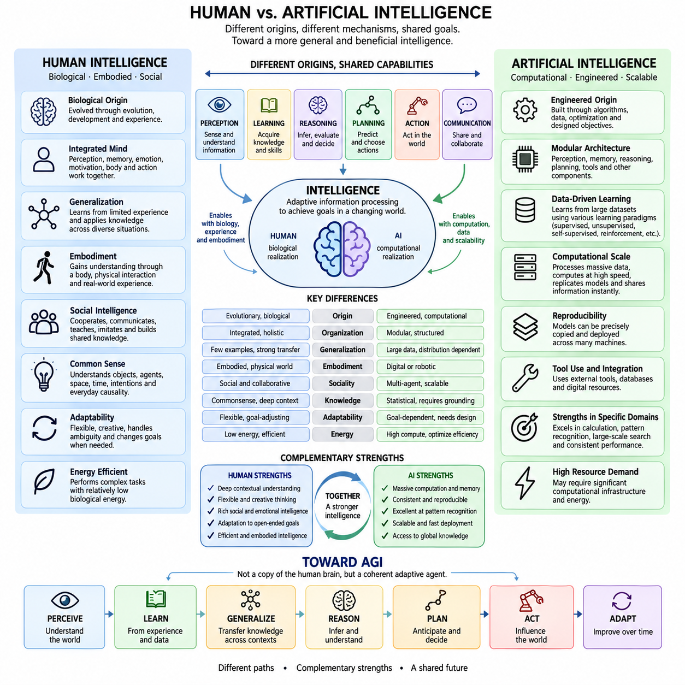{width="7.268055555555556in" height="7.268055555555556in"}

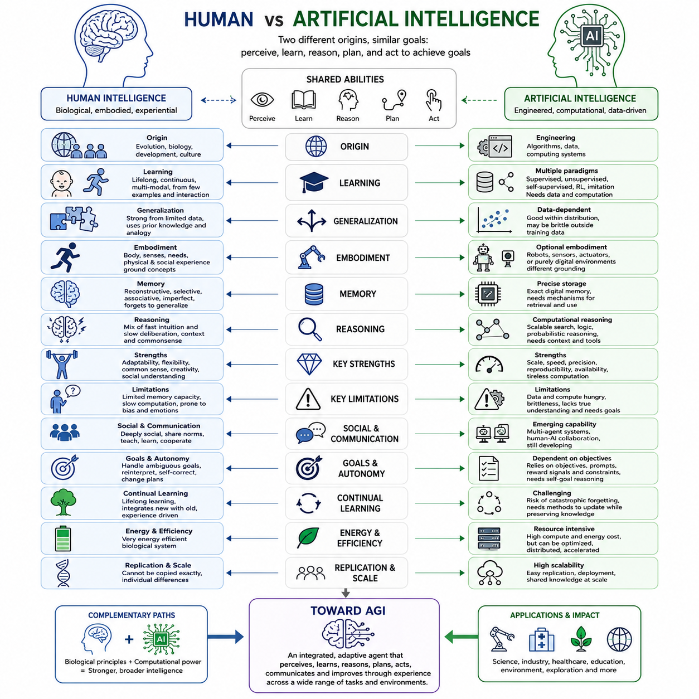{width="7.268055555555556in" height="7.268055555555556in"}

Human intelligence emerges from biological systems shaped by evolution, development, embodiment, social interaction, and continuous experience. Artificial intelligence is engineered through computational architectures, algorithms, data, optimization, and explicitly designed objectives. Both can perceive information, learn patterns, solve problems, and select actions, yet the mechanisms producing these abilities differ fundamentally in origin, organization, constraints, and interaction with the world.

The human brain operates as a massively parallel biological network whose cognition is inseparable from perception, memory, emotion, motivation, bodily regulation, and action. Human learning occurs continuously while an individual interacts with physical and social environments. Artificial intelligence typically separates these functions into computational components such as perception models, memory systems, reasoning modules, planners, policies, and external tools that engineers integrate into a larger architecture.

Humans demonstrate remarkable generalization from relatively limited experience. A person can learn a concept in one context, recognize analogous structures elsewhere, and combine previous knowledge to address unfamiliar situations. Modern AI can also generalize, especially after large-scale pretraining, but its reliability often depends strongly on the distribution represented by training data. Out-of-distribution situations can reveal brittle assumptions that were hidden during conventional evaluation.

Artificial intelligence has important advantages in computational scale. Machines can process enormous datasets, perform numerical operations at high speed, replicate learned parameters precisely, search large spaces, and communicate digital information without the biological limitations of human memory. Once trained, a model can often be duplicated across thousands of machines. Human knowledge, by contrast, must usually be transferred indirectly through language, demonstration, education, imitation, and cultural artifacts.

Human intelligence has advantages in adaptive integration. Perception, commonsense knowledge, physical experience, goals, social understanding, and contextual reasoning interact continuously. Humans routinely interpret incomplete situations using background knowledge that may never have been explicitly taught. Artificial systems often require carefully constructed representations, training distributions, prompts, retrieval mechanisms, tools, or environmental feedback to achieve comparable contextual flexibility across substantially different tasks.

Embodiment represents another major difference. Human cognition develops through a body that moves, senses, acts, experiences consequences, and maintains biological needs. Concepts such as distance, force, danger, balance, ownership, cooperation, and causality become connected to physical and social experience. Artificial intelligence may operate entirely in digital environments or become embodied through robots, autonomous vehicles, drones, sensors, and actuators, creating different forms of grounding and experience.

Human learning combines many learning paradigms naturally. People learn from direct instruction, observation, imitation, exploration, rewards, mistakes, language, social feedback, and self-generated goals without treating these mechanisms as completely separate systems. Artificial intelligence historically divides learning into supervised, unsupervised, self-supervised, reinforcement, imitation, and other paradigms. AGI research increasingly seeks architectures capable of combining these modes within persistent learning processes.

Memory also differs substantially. Human memory is reconstructive, selective, associative, and imperfect. Forgetting can remove details while preserving concepts and meaningful relationships. Artificial systems can store exact digital information, but possessing stored information does not guarantee intelligent retrieval or understanding. AGI therefore requires mechanisms that decide what information matters, how it should be represented, when it should be retrieved, and how retrieved knowledge should influence reasoning and action.

Humans reason with a mixture of deliberate and intuitive processes. Familiar situations may trigger rapid judgments, while unfamiliar or difficult problems can recruit slower analysis, mental simulation, comparison, and planning. Artificial intelligence similarly benefits from adaptive computation rather than applying maximum processing to every observation. Future general systems may allocate reasoning depth, memory retrieval, simulation, and planning according to novelty, uncertainty, risk, and expected value.

Energy efficiency reveals another striking contrast. The human brain performs perception, learning, control, memory, and reasoning with comparatively modest biological power consumption. Large artificial models may require substantial computational infrastructure during training and inference. AI nevertheless offers engineering advantages because computation can be specialized, distributed, accelerated, compressed, or selectively activated. Efficient intelligence therefore concerns not only capability but the allocation of computational resources according to task demands.

Humans possess strong commonsense expectations about objects, agents, space, time, intentions, and everyday causality. Much of this knowledge is accumulated through years of interaction and cultural learning rather than explicit formal instruction. Artificial systems can acquire extensive statistical and factual knowledge from large datasets, but statistical association does not automatically provide reliable causal understanding. Robust intelligence must distinguish correlation, prediction, intervention, and consequence when circumstances change.

Language highlights both similarities and differences. Humans use language as one component of a broader cognitive system grounded in perception, action, memory, social relationships, and shared environments. Large language models can acquire powerful linguistic representations from enormous text corpora and demonstrate reasoning-like capabilities through language. However, language competence alone does not guarantee persistent goals, grounded world understanding, autonomous learning, long-term memory, or reliable physical interaction.

Human intelligence is deeply social. People infer intentions, cooperate, compete, teach, imitate, negotiate, follow norms, and construct shared knowledge. Intelligence therefore develops within communities rather than exclusively inside individual brains. Artificial intelligence is increasingly entering similar multi-agent contexts through human-AI collaboration, AI agents, robotic teams, and interacting software systems. General intelligence may consequently require models of other agents as well as models of the physical environment.

Artificial intelligence differs from humans in reproducibility and scalability. Human cognitive abilities vary between individuals and cannot be copied exactly, whereas trained artificial models can be replicated and deployed across different hardware platforms. Multiple artificial agents may also share databases, models, tools, and retrieved information almost instantaneously. This creates the possibility of collective machine intelligence whose information-sharing mechanisms operate differently from biological societies.

Humans remain highly capable when goals are ambiguous. They can negotiate objectives, reinterpret instructions, infer unstated intentions, and abandon inappropriate plans when circumstances change. Artificial systems are often more dependent on the quality of their objective functions, prompts, reward signals, policies, or system constraints. A major AGI challenge is therefore developing agents that can reason about goals themselves rather than merely optimizing a fixed objective supplied externally.

Another difference concerns continual learning. Humans normally acquire new knowledge throughout life without repeatedly retraining the entire brain from a static dataset. New experiences modify existing knowledge while much previous competence remains available. Artificial neural systems can suffer catastrophic forgetting or require carefully managed updates. Continual learning for AGI must preserve useful knowledge while integrating new information, adapting to distribution changes, and correcting previously learned misconceptions.

Creativity demonstrates that intelligence involves more than reproduction of prior experience. Humans generate new explanations, tools, stories, strategies, designs, and scientific hypotheses by recombining existing concepts under new constraints. Generative AI can similarly produce novel combinations across text, images, code, and other representations. The deeper challenge is connecting generation with evaluation, experimentation, causal understanding, long-term objectives, and real-world feedback so that novelty becomes purposeful innovation.

Metacognition is another important capability. Humans can recognize confusion, estimate confidence, reconsider assumptions, seek assistance, and change strategies when progress fails. Artificial systems increasingly incorporate reflection, uncertainty estimation, verification, critique, and iterative reasoning mechanisms. For AGI, metacognition may become a control layer that determines when an agent should continue reasoning, retrieve knowledge, invoke tools, simulate alternatives, request assistance, or revise its internal model.

Neither human nor artificial intelligence should be treated as a single scalar quantity. Humans display uneven combinations of linguistic, spatial, mathematical, social, motor, creative, and practical abilities. Artificial systems also exhibit capability profiles that vary across domains. Comparing intelligence therefore requires examining generalization, adaptability, sample efficiency, reasoning, memory, autonomy, robustness, embodiment, social interaction, computational cost, and the range of environments in which competence remains effective.

The most productive path toward AGI may not require reproducing the human brain exactly. Biological intelligence provides important principles such as continual learning, hierarchical processing, predictive modeling, selective attention, memory consolidation, adaptive computation, embodiment, and perception-action feedback. Artificial systems can combine these principles with capabilities unavailable to biology, including exact digital memory, high-speed computation, global communication, scalable simulation, and large external knowledge stores.

Human and artificial intelligence can therefore be viewed as different implementations of adaptive information processing rather than as simple competitors on a single scale. Humans provide a demonstrated example of broadly capable embodied intelligence, while AI explores alternative computational mechanisms capable of exceeding biological limitations in selected dimensions. AGI research seeks to understand which principles are essential for general competence and which are merely consequences of biological implementation.

Ultimately, the comparison reveals that general intelligence depends less on matching humans' component by component than on integrating capabilities into a coherent adaptive agent. Such a system must perceive, remember, learn, generalize, reason, plan, act, communicate, manage uncertainty, and revise its behavior through experience. Understanding the complementary strengths and limitations of human and artificial intelligence therefore provides a foundation for designing systems that move from specialized AI toward increasingly general intelligence.

## 01.02. Generalization and Transfer

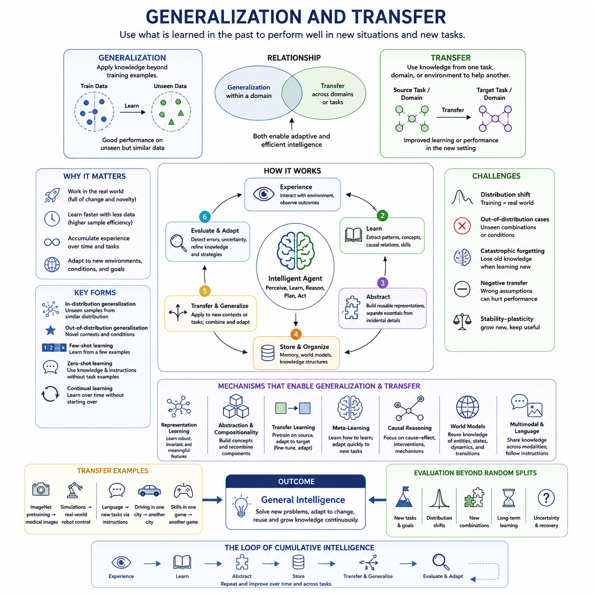{width="7.268055555555556in" height="7.268055555555556in"}

Generalization is the ability of an intelligent system to apply knowledge learned from previous experience to situations that were not encountered during training. A system that merely memorizes examples may perform well on familiar data but fail when conditions change. General intelligence therefore requires representations that capture reusable structures, relationships, and principles rather than reproducing specific observations.

Transfer extends this idea by allowing knowledge acquired in one task, environment, or domain to improve learning or performance in another. The transferred knowledge may include perceptual features, concepts, causal relationships, skills, strategies, policies, or abstract representations. Effective transfer reduces the need to learn every new problem from the beginning and transforms accumulated experience into a reusable resource for future intelligence.

Generalization and transfer are closely related but describe different aspects of adaptive intelligence. Generalization concerns whether learned knowledge remains valid beyond the examples from which it was acquired, while transfer concerns whether knowledge developed for one problem can contribute to solving another. Together they determine how effectively an intelligent agent can expand its competence as tasks, environments, and objectives change.

Machine learning traditionally evaluates generalization by separating training data from validation and test data. A model learns patterns from training examples and is expected to perform accurately on unseen samples drawn from a similar distribution. This form of generalization is essential, but AGI requires a broader capability because real environments frequently contain situations that differ substantially from the distributions represented during training.

Distribution shift occurs when the statistical properties of the operating environment differ from those encountered during learning. Changes may appear in sensors, objects, backgrounds, behaviors, goals, physical conditions, or relationships among variables. A robust intelligent system must determine which learned structures remain reliable and which assumptions should be revised rather than blindly applying previously successful patterns to a changed world.

Out-of-distribution generalization addresses this challenge more directly. Instead of assuming that future observations resemble training examples, the agent must handle novel combinations, unfamiliar contexts, and previously unseen conditions. This requires representations that separate essential structure from incidental correlations. Learning invariant relationships can therefore be more valuable for general intelligence than simply improving accuracy within a narrowly defined dataset.

Humans demonstrate powerful forms of generalization through abstraction. After encountering several examples, people can often extract concepts that apply to many different situations. Understanding the concept of a container, obstacle, tool, ownership, or cause does not require memorizing every possible instance. Abstract concepts compress experience into reusable structures, enabling reasoning about situations that differ significantly in their superficial appearance.

Compositionality strengthens this capability by allowing previously learned components to be recombined. An agent that separately understands objects, spatial relationships, actions, goals, and consequences can potentially construct representations of situations it has never observed exactly before. Instead of storing every possible configuration, intelligence can generate new combinations from reusable components, dramatically expanding the range of situations that can be handled.

Transfer learning provides a practical implementation of knowledge reuse in artificial intelligence. A model trained on a large source dataset can provide representations that are adapted to a smaller target task through fine-tuning or related methods. The transferred representation provides a useful starting point, reducing training requirements and often improving performance when target-domain data are limited. Large pretrained models demonstrate the scalability of this principle.

Positive transfer occurs when previous knowledge improves performance on a new task, but transfer is not always beneficial. Negative transfer can occur when inappropriate assumptions from the source domain interfere with learning in the target domain. General intelligence therefore requires more than simply reusing everything previously learned. An agent must estimate the relevance of prior knowledge and selectively preserve, modify, combine, or reject it according to the new context.

Few-shot and zero-shot capabilities represent important manifestations of generalization and transfer. Few-shot learning attempts to solve new problems from a small number of examples, while zero-shot behavior relies on existing representations and instructions without task-specific examples. These abilities are important for AGI because an agent operating in an open world cannot expect extensive labeled training data for every situation it may eventually encounter.

Meta-learning approaches the problem at a higher level by attempting to learn how to learn. Instead of optimizing only for performance on one fixed task, a meta-learning system extracts strategies that allow faster adaptation across families of tasks. Previous learning episodes become information about how future learning should occur. This can improve sample efficiency and help transform repeated adaptation into increasingly effective general learning behavior.

Continual learning connects transfer with time. An intelligent agent encounters a sequence of tasks and experiences rather than one static training dataset. New knowledge should extend existing competence without unnecessarily destroying previously useful capabilities. This creates the stability-plasticity problem: the system must remain plastic enough to learn new information while remaining stable enough to preserve valuable representations, skills, and memories.

Catastrophic forgetting illustrates the difficulty of this requirement in artificial neural systems. Updating a model for new tasks can modify parameters that supported earlier capabilities, causing previously learned knowledge to degrade. Continual intelligence therefore benefits from mechanisms such as memory replay, modular representations, parameter protection, knowledge consolidation, retrieval, and selective adaptation that preserve useful competence while incorporating new experience.

Representation learning is central to both generalization and transfer because the structure of internal representations determines what can be reused. Representations tied too closely to surface details may fail when appearance changes, while representations capturing objects, relationships, dynamics, semantics, or causal structure can remain useful across broader conditions. Good representations separate information that should remain stable from information that should adapt.

Causal knowledge can support particularly strong forms of transfer. Statistical correlations may disappear when environments change, but underlying causal mechanisms can remain stable across many conditions. An agent that understands how actions influence states and how variables affect one another can reason about interventions rather than merely extrapolating observed patterns. Causal representation is therefore closely connected to robust generalization and adaptable world models.

World models provide another mechanism for transferring structured knowledge. A world model can encode entities, states, relationships, dynamics, and possible transitions independently of a single immediate task. Different goals can then reuse the same underlying model for prediction, planning, simulation, and control. Instead of learning a completely separate policy for every objective, an agent can combine shared environmental knowledge with task-specific goals.

Embodied intelligence makes transfer especially challenging because physical environments contain continuous variation. Lighting, terrain, friction, object position, sensor noise, payload, weather, human behavior, and mechanical conditions may differ from previous experience. A robot that succeeds only under conditions closely matching its training environment has limited intelligence. General robotic intelligence requires robust perception and action across meaningful variations of the physical world.

Sim-to-real transfer illustrates this problem in robotics. Policies or models can be trained efficiently in simulation, but the simulated environment never perfectly reproduces physical reality. Differences in dynamics, sensors, materials, latency, and environmental complexity create a reality gap. Domain randomization, adaptation, robust representation learning, system identification, and real-world feedback can help transfer knowledge from simulated experience to physical operation.

Multimodal learning can improve generalization by connecting information across different forms of observation. Language can describe concepts that appear visually, actions can reveal physical properties, and sensory feedback can ground symbolic descriptions in interaction. When multiple modalities share representations, knowledge acquired through one modality may support another. Such cross-modal transfer can help create more coherent and reusable internal models of the world.

Language provides an especially powerful interface for transfer because instructions can specify new tasks without requiring complete retraining. A sufficiently capable agent may reuse existing perceptual, reasoning, and action skills while language defines a new objective or constraint. This changes task learning from parameter modification toward contextual adaptation, where previously acquired capabilities are dynamically composed according to descriptions of the current problem.

Generalization must also include goals and strategies rather than only perceptual recognition. An intelligent agent should recognize that a planning principle, exploration strategy, safety constraint, or problem-solving method learned in one context may remain useful elsewhere. Transfer at this level requires abstraction over tasks themselves, allowing the agent to identify common structures among apparently different problems and reuse previously successful reasoning procedures.

Evaluation of generalization should consequently extend beyond random test splits. Systems intended for general intelligence should be examined under novel tasks, distribution shifts, new combinations, changing environments, limited examples, long-term learning, and unexpected conditions. Evaluation should measure not only whether performance decreases, but whether the system can recognize uncertainty, adapt efficiently, recover competence, and preserve previously acquired knowledge.

Generalization and transfer ultimately determine whether intelligence accumulates or repeatedly starts over. A generally intelligent agent should transform experience into increasingly reusable representations, models, skills, and strategies. It should recognize what remains invariant, adapt what has changed, combine previous knowledge in new ways, and learn efficiently when existing knowledge is insufficient. These abilities form a central bridge between specialized task performance and AGI.

## 01.03. Reasoning and Planning

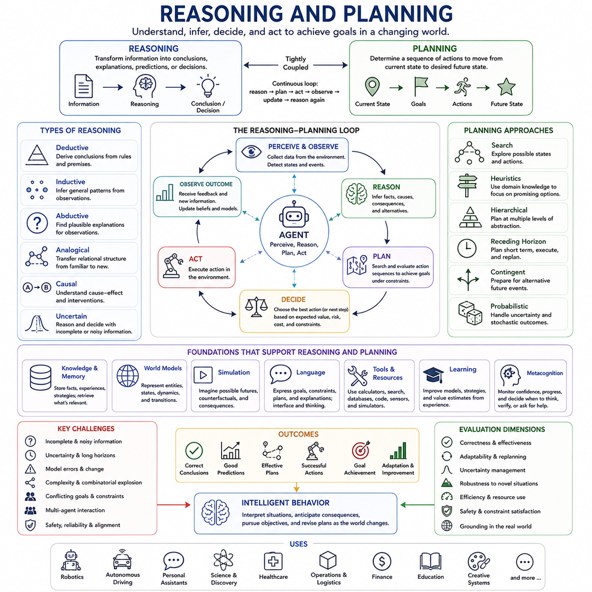{width="7.268055555555556in" height="7.268055555555556in"}

Reasoning is the capacity of an intelligent agent to transform available information into conclusions, explanations, predictions, or decisions that are not directly contained in its observations. It connects perception and knowledge with purposeful action by evaluating relationships among facts, hypotheses, constraints, and possible outcomes. For AGI, reasoning must remain useful across unfamiliar tasks rather than being restricted to one predefined problem domain.

Planning extends reasoning across time by determining how a sequence of actions can transform a current state into a desired future state. An agent must represent where it is, what it wants to achieve, which actions are available, and how those actions may change the environment. Planning therefore converts knowledge about states and transitions into organized behavior directed toward goals, constraints, safety requirements, and expected consequences.

Reasoning and planning form a tightly coupled cognitive process. Reasoning helps determine what is true, what may be causing an observed situation, and what consequences different choices could produce. Planning uses those conclusions to construct action sequences. During execution, new observations may invalidate previous assumptions, requiring additional reasoning and replanning. Intelligence therefore depends on a continuous loop rather than a single reasoning or planning operation.

Deductive reasoning derives conclusions from established premises and rules. If the premises are correct and the inference procedure is valid, the conclusion follows logically. This form of reasoning is valuable when an agent operates with explicit rules, constraints, mathematical relationships, or symbolic knowledge. However, real environments rarely provide complete and perfectly reliable premises, so general intelligence cannot depend exclusively on deduction.

Inductive reasoning moves from observations toward broader patterns, hypotheses, or general rules. An agent may observe repeated events and infer a regularity that can guide future prediction. Machine learning itself can be interpreted as a large-scale form of induction because models infer structures from examples. Inductive conclusions remain uncertain, making evaluation, confidence estimation, and continued updating important when new evidence becomes available.

Abductive reasoning seeks plausible explanations for observations. When an unexpected event occurs, an intelligent agent can generate hypotheses about what may have caused it and compare them against available evidence. This capability is essential for diagnosis, troubleshooting, scientific discovery, and autonomous systems. Abduction allows intelligence to reason backward from effects toward possible causes even when several explanations remain simultaneously possible.

Analogical reasoning transfers relational structure from a familiar problem to a new one. Instead of relying only on superficial similarity, a capable agent identifies common relationships among entities, actions, and consequences. Analogies can support rapid problem solving because previously successful reasoning patterns can be reused in unfamiliar situations. This connects reasoning directly with abstraction, generalization, compositionality, and transfer.

Causal reasoning goes beyond statistical association by representing how interventions may change outcomes. An agent that understands causal relationships can distinguish observing an event from actively producing it. This distinction becomes critical for planning because actions are interventions in the world. Reliable planning therefore benefits from models that represent not merely which states are correlated, but how actions and environmental processes generate state transitions.

Reasoning under uncertainty is necessary because observations, models, and predictions are rarely complete. An intelligent system may need to compare multiple hypotheses, estimate probabilities, evaluate confidence, and make decisions despite missing information. Probabilistic reasoning provides mechanisms for updating beliefs as evidence arrives. General intelligence must also recognize when uncertainty is sufficiently important that gathering additional information is preferable to immediately taking action.

Decision-making connects reasoning to preferences and objectives. Several actions may be physically possible, but their consequences can differ in value, risk, cost, time, energy, or safety. An intelligent agent therefore evaluates alternatives according to expected outcomes and constraints. This process may involve utility, reward, priorities, uncertainty, and long-term consequences, making decision-making an important bridge between reasoning and executable planning.

Planning can be represented as search through a space of possible states and actions. Starting from the current state, an agent considers alternative actions and estimates where they may lead. Exhaustive search quickly becomes impractical as the number of possibilities grows, so effective planning requires heuristics, abstraction, pruning, hierarchical decomposition, learned value estimates, or predictive models that concentrate computation on promising possibilities.

Hierarchical planning reduces complexity by organizing behavior at multiple levels of abstraction. A high-level plan may specify objectives such as reaching a destination, obtaining an object, or completing a mission, while lower levels determine concrete movements and control commands. This decomposition allows reasoning to focus on meaningful strategic choices without representing every physical action at the same level, supporting longer and more complicated tasks.

Long-horizon planning introduces additional difficulty because uncertainty accumulates as predictions extend further into the future. Small modeling errors can produce increasingly inaccurate forecasts, while unexpected events may invalidate distant parts of a plan. Intelligent agents therefore benefit from receding-horizon strategies in which near-term actions are planned in greater detail while distant objectives remain abstract and are repeatedly revised as new observations arrive.

World models provide an internal environment in which reasoning and planning can operate. A world model represents entities, states, relationships, dynamics, and possible transitions, enabling an agent to simulate potential futures before acting physically. Instead of learning only direct stimulus-response mappings, the agent can ask what might happen under alternative actions. Internal simulation therefore provides a foundation for prediction, counterfactual reasoning, planning, and safer decision-making.

Counterfactual reasoning considers situations that did not actually occur. An agent may ask what would have happened if a different action had been selected or how an undesirable outcome could have been avoided. Such reasoning supports learning from experience because actual outcomes can be compared with hypothetical alternatives. Counterfactuals also strengthen planning by allowing multiple possible futures to be evaluated before committing to irreversible actions.

Mental simulation generalizes this process by internally constructing possible sequences of events. Humans routinely imagine routes, conversations, physical actions, or consequences before executing them. Artificial agents can perform analogous computation using learned dynamics, simulators, search procedures, or generative world models. The usefulness of simulation depends on model accuracy, computational cost, uncertainty estimation, and the ability to focus simulation on decision-relevant possibilities.

Reactive behavior and deliberate planning should not be viewed as mutually exclusive. Familiar, predictable situations may be handled efficiently by learned policies or fast control loops without extensive deliberation. Novel, uncertain, dangerous, or strategically important situations may justify deeper reasoning and simulation. General intelligence therefore benefits from adaptive computation that determines when rapid response is sufficient and when additional reasoning resources should be activated.

This distinction is particularly important for embodied agents. A robot moving through a stable corridor may require only lightweight perception and local control, while an unexpected obstacle, localization failure, human interaction, or hazardous condition may trigger more expensive reasoning and replanning. Allocating computation according to novelty, uncertainty, risk, and task importance can improve both energy efficiency and responsiveness in physical intelligent systems.

Memory supports reasoning by providing relevant facts, experiences, strategies, and previous solutions. Retrieval allows an agent to avoid reconstructing knowledge that has already been acquired. However, useful reasoning requires selective retrieval because excessive irrelevant information can increase computational cost or introduce confusion. Memory systems for AGI must therefore identify contextually relevant knowledge and integrate it with current observations and active goals.

Language can function as both an interface and a medium for reasoning. Instructions specify goals and constraints, while linguistic representations can express intermediate concepts, hypotheses, plans, and explanations. Large language models demonstrate that complex reasoning patterns can emerge from language-based learning, but reliable planning requires grounding these representations in external states, persistent memory, tools, feedback, and verifiable consequences rather than relying solely on linguistic plausibility.

Tool use expands the reasoning capacity of an intelligent agent. Calculators, search systems, databases, simulators, code execution environments, sensors, and specialized models can provide capabilities that would be inefficient to reproduce internally. Intelligent tool use requires recognizing when external assistance is useful, selecting the appropriate tool, constructing a suitable request, interpreting the result, and integrating that information into subsequent reasoning and planning.

Multi-agent environments introduce another level of complexity because other agents possess their own goals, knowledge, and strategies. Planning may require predicting cooperation, competition, negotiation, communication, or interference. An intelligent agent must therefore reason not only about physical dynamics but also about the possible decisions of others. Shared planning can additionally distribute tasks, coordinate resources, and combine specialized capabilities across multiple humans, robots, or software agents.

Metacognition can supervise the reasoning and planning process itself. An agent should estimate whether its evidence is sufficient, whether a conclusion is reliable, whether a plan is progressing, and whether additional computation is worthwhile. It may decide to verify an assumption, retrieve more information, simulate another alternative, request assistance, or abandon a failing strategy. Such monitoring turns reasoning into an adaptive process rather than an uncontrolled sequence of computations.

Evaluation of reasoning and planning should extend beyond whether a final answer or action happens to be correct. A robust system should remain effective under incomplete information, changing goals, novel tasks, long horizons, conflicting constraints, and unexpected events. Evaluation should examine adaptation, consistency, uncertainty management, recovery from failure, computational efficiency, and whether plans remain grounded in the actual environment as execution proceeds.

Ultimately, reasoning allows an intelligent agent to understand relationships and consequences, while planning transforms that understanding into organized future action. General intelligence requires both capabilities to interact continuously with perception, memory, learning, world models, decision-making, action, and feedback. The resulting agent does not merely react to the present but can interpret situations, imagine alternatives, anticipate consequences, pursue goals, and revise its plans as the world changes.

## 01.04. Learning Paradigms Unification

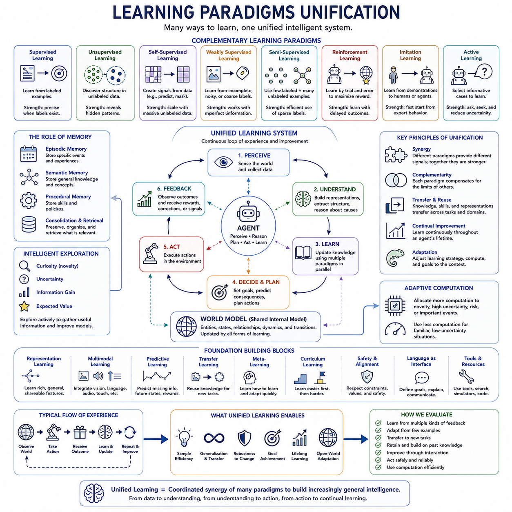{width="7.268055555555556in" height="7.268055555555556in"}

Learning paradigms describe the different ways an intelligent system acquires knowledge, representations, skills, and behavioral strategies from experience. Traditional artificial intelligence separates learning into supervised, unsupervised, self-supervised, reinforcement, imitation, and related approaches. General intelligence, however, requires these mechanisms to operate as complementary components of a unified learning process rather than as isolated techniques.

Supervised learning acquires mappings from inputs to desired outputs using labeled examples. It is highly effective when reliable labels are available and has supported major advances in classification, detection, recognition, prediction, and control. Its limitation for general intelligence is dependence on externally prepared targets. An autonomous agent operating continuously in the world cannot expect humans to label every object, state, action, relationship, or situation it encounters.

Unsupervised learning attempts to discover structure without explicit target labels. It can identify clusters, latent variables, statistical regularities, and lower-dimensional representations within observations. This ability is important because most information encountered by an intelligent agent is naturally unlabeled. Discovering structure independently allows experience itself to become a source of knowledge rather than requiring every learning signal to be manually specified.

Self-supervised learning constructs learning signals directly from the data. A system may predict masked information, future observations, missing components, transformations, or relationships among different views of the same environment. Because supervision is generated from the structure of experience, enormous quantities of unlabeled data can be used. Modern foundation models demonstrate how self-supervision can create broad representations before task-specific adaptation occurs.

Weakly supervised learning occupies the space between fully labeled and unlabeled learning. Training information may be incomplete, imprecise, noisy, indirect, or available only at a coarse level. Real-world intelligence frequently encounters exactly these conditions. An agent may know that an event was successful without knowing which individual action caused success, or receive approximate semantic information without precise labels for every observation.

Semi-supervised learning combines a relatively small amount of labeled data with a much larger quantity of unlabeled data. The labeled examples provide semantic anchors while the unlabeled observations reveal broader structure and variation. This paradigm is especially useful when data collection is inexpensive but expert annotation is costly. For AGI, it illustrates a broader principle: different levels of supervision should cooperate rather than define separate learning systems.

Reinforcement learning introduces action and consequence into learning. An agent interacts with an environment, receives observations and rewards, and learns policies that improve long-term outcomes. Unlike conventional supervised learning, the correct action is not necessarily provided directly. The agent must explore alternatives and connect delayed consequences with earlier decisions, making reinforcement learning particularly relevant to planning, control, autonomy, and embodied intelligence.

Imitation learning allows an agent to acquire behavior from demonstrations produced by humans or other agents. Instead of discovering every useful behavior through expensive trial and error, the learner can begin from examples of competent action. Demonstrations provide strong priors about promising regions of the behavioral space, while subsequent reinforcement, planning, or autonomous exploration can improve behavior beyond the original demonstrations.

Active learning changes the role of the learner by allowing it to influence which information should be acquired. Rather than passively accepting a fixed dataset, the system can identify uncertain or informative cases and request labels, observations, experiments, or demonstrations. This introduces information-seeking behavior into learning and connects learning with reasoning, uncertainty estimation, exploration, and decision-making.

Curriculum learning recognizes that the order of experience can affect learning efficiency. Difficult capabilities may emerge more reliably when simpler concepts or tasks establish useful foundations first. Biological learning naturally follows developmental sequences in which perception, motor skills, language, social understanding, and abstract reasoning build progressively. Artificial agents can similarly benefit from structured progression from simpler experiences toward increasingly complex tasks.

Transfer learning enables previously acquired representations and skills to support new tasks. Instead of constructing each capability independently, a unified learner should preserve reusable knowledge and adapt it when objectives or environments change. Transfer becomes especially important for AGI because the number of possible future tasks is effectively unlimited. Intelligence must therefore accumulate competence rather than repeatedly restart learning from an empty state.

Continual learning extends this principle across the lifetime of an agent. New experiences should modify existing knowledge without unnecessarily destroying previous capabilities. This creates the stability-plasticity problem: the learner must remain sufficiently plastic to adapt while sufficiently stable to preserve valuable knowledge. Memory replay, modular architectures, consolidation, retrieval, and selective parameter updates can help balance these competing requirements.

Meta-learning moves beyond acquiring individual skills toward learning how adaptation itself should occur. Experience across many tasks can reveal which representations, initialization strategies, exploration behaviors, or update mechanisms allow rapid learning. A meta-learning agent can therefore use previous learning episodes to improve future learning efficiency, potentially enabling few-shot adaptation to tasks that were not explicitly anticipated during initial training.

Multimodal learning integrates information from vision, language, audio, touch, proprioception, LiDAR, and other sensor channels. Different modalities provide complementary evidence about the same world. Language may provide semantic structure, vision may reveal appearance and geometry, and physical interaction may reveal mass, friction, or affordances. Unified intelligence should connect these signals within shared representations rather than learning each modality independently.

Predictive learning provides a common principle capable of linking several paradigms. An agent can learn by predicting missing information, future states, consequences of actions, rewards, or latent dynamics. Prediction errors then provide learning signals that refine internal representations. From this perspective, perception, self-supervised learning, world modeling, and action learning can all be understood partly as reducing errors between expected and observed outcomes.

World models offer a particularly important framework for learning unification. A world model attempts to represent entities, states, relationships, dynamics, and possible transitions within an environment. Self-supervised observation can learn perceptual structure, actions can reveal causal dynamics, reinforcement can identify valuable outcomes, and language can provide semantic knowledge. These learning signals can update different aspects of a shared internal model.

Representation learning is therefore central to unification. If every task constructs completely independent internal features, knowledge transfer becomes difficult and computationally inefficient. Shared representations allow information learned from one source to benefit another. Perception, language, action, memory, and prediction can contribute complementary constraints that produce representations containing semantic, spatial, temporal, physical, and causal information.

A unified learning architecture does not imply that every learning signal should be treated identically. Different signals provide different kinds of information and operate at different timescales. Supervision may provide precise semantic correction, self-supervision may supply continuous representation learning, reinforcement may communicate long-term value, and imitation may accelerate skill acquisition. Unification concerns coordination among these signals rather than eliminating their distinctions.

Learning can consequently be viewed as a multi-objective optimization process. An intelligent agent may simultaneously minimize prediction error, improve task performance, maximize expected reward, preserve previous knowledge, maintain safe behavior, and reduce uncertainty. These objectives can conflict, requiring mechanisms that dynamically balance them according to context. AGI therefore needs learning control as well as individual learning algorithms.

Memory provides continuity across learning paradigms. Experiences collected through interaction can later support self-supervised training, reinforcement updates, imitation, retrieval, reasoning, or planning. Episodic memory can preserve specific events, while semantic memory extracts more general knowledge and procedural memory preserves skills. Memory consolidation can transform repeated experiences into stable representations that remain available across future tasks and environments.

Exploration determines which experiences become available for learning. Random exploration may be inefficient or dangerous, especially in physical systems. Intelligent exploration can instead prioritize novelty, uncertainty, expected information gain, task relevance, or predicted value. This connects active learning and reinforcement learning with curiosity-driven behavior, world-model improvement, and autonomous experimentation, allowing the agent to participate in constructing its own training distribution.

Embodied agents make learning unification particularly important because perception and action cannot be separated cleanly. A robot observes the world, selects an action, changes the environment, receives new sensory information, and learns from the resulting transition. Demonstrations may initialize behavior, self-supervision may improve perception, reinforcement may optimize control, and world-model learning may predict consequences. All occur within the same perception-action loop.

Language can serve as an additional unifying layer. Instructions can define goals, demonstrations can be described linguistically, observations can be connected to semantic concepts, and feedback can explain success or failure. Language also enables knowledge acquired by other agents or humans to enter the learning process without direct physical experience. This creates a bridge between culturally accumulated knowledge and individually acquired sensorimotor experience.

Adaptive computation should also influence learning. Not every observation deserves the same computational effort or parameter update. Familiar and predictable situations may require little additional learning, whereas novelty, high uncertainty, failure, or unexpected state transitions may justify deeper processing and stronger updates. Such event-driven learning can improve computational efficiency while concentrating adaptation on experiences that provide substantial new information.

Safety and alignment introduce constraints on unified learning. An autonomous system should not maximize reward or exploration without considering unacceptable consequences. Learning objectives must coexist with safety boundaries, human preferences, operational constraints, and uncertainty-aware decision policies. General intelligence therefore requires mechanisms that determine not only how to learn efficiently, but also which behaviors should remain prohibited during exploration and adaptation.

Evaluation of unified learning should measure more than performance on a single static dataset. A capable system should learn from multiple forms of feedback, transfer knowledge between tasks, adapt from limited examples, retain earlier skills, integrate new modalities, recover from distribution shifts, and improve through interaction. Sample efficiency, continual adaptation, robustness, transfer, memory retention, and computational cost become important measures of learning quality.

Ultimately, learning-paradigm unification transforms learning from a collection of separate algorithms into a continuous adaptive process. A generally intelligent agent should learn from labels when available, discover structure when labels are absent, predict from experience, imitate useful behavior, explore uncertain situations, optimize consequences, transfer previous knowledge, and continually revise its world model. The objective is not one universal learning algorithm, but a coordinated architecture in which multiple learning mechanisms collectively build increasingly general intelligence.

## 01.05. Embodiment

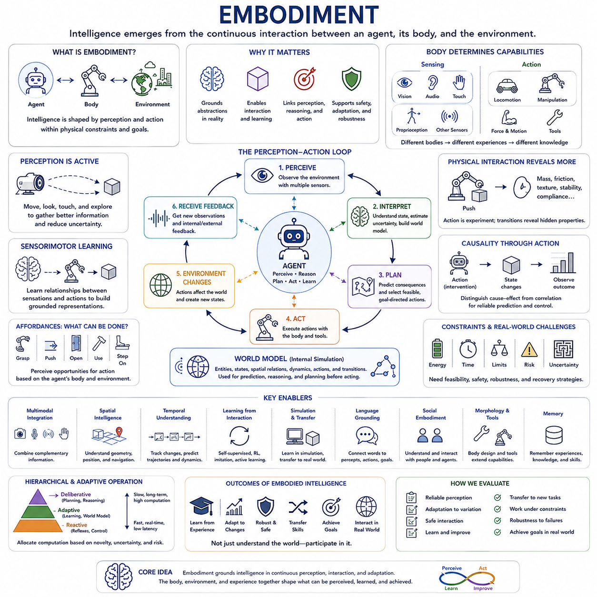{width="7.268055555555556in" height="7.268055555555556in"}

Embodiment describes the idea that intelligence is shaped by the continuous interaction between an agent, its body, and the environment. Intelligence is therefore not only computation performed on abstract information. Perception depends on how an agent senses the world, action depends on its physical capabilities, and learning emerges from the consequences of interaction. For AGI, embodiment connects cognition with situated experience.

A body determines which aspects of the environment an agent can observe and which actions it can perform. Cameras, eyes, microphones, tactile sensors, joints, wheels, hands, and other structures create different perceptual and action spaces. Intelligence develops within these constraints. The same environment can therefore produce very different internal representations depending on the sensing, mobility, manipulation, and computational capabilities available to an agent.

Embodied intelligence operates through a perception-action loop. The agent observes its environment, interprets the current state, selects an action, changes the world through that action, and receives new observations reflecting the consequences. This cycle repeats continuously. Perception and action are therefore mutually dependent processes rather than isolated modules, because actions determine which future observations become available for subsequent learning and reasoning.

Active perception illustrates this relationship clearly. An intelligent agent does not need to passively accept whatever information happens to arrive. It can move a camera, approach an object, change its viewpoint, touch a surface, manipulate an item, or explore an uncertain region to obtain better information. Perception thus becomes a goal-directed activity in which actions are deliberately selected to reduce uncertainty and improve understanding.

Sensorimotor learning develops representations from relationships between sensory observations and physical actions. A robot may learn that certain visual patterns correspond to reachable objects, that particular motor commands produce predictable movements, or that contact forces reveal physical properties. Such knowledge grounds abstract representations in interaction, allowing concepts to become connected with what the agent can perceive, predict, manipulate, and control.

Affordances describe action possibilities provided by the relationship between an agent and its environment. An object may be graspable, movable, traversable, pushable, openable, or usable as a tool depending on both its properties and the agent\'s capabilities. Affordance learning therefore shifts perception from simply identifying what something is toward understanding what can be done with it, providing an important connection between recognition and purposeful action.

Physical interaction also provides information that passive observation cannot easily reveal. Mass, friction, compliance, stability, resistance, texture, and mechanical constraints may become apparent only when an agent acts upon an object or surface. Embodied learning can therefore use action as an experiment. The resulting state transitions provide evidence about hidden properties and help the agent refine models of physical dynamics and causal relationships.

Causality becomes especially important in embodied intelligence because actions are interventions in the environment. When an agent pushes an object and observes movement, it receives evidence about how its action influenced the resulting state. Repeated interactions can help distinguish causal relationships from passive correlations. This enables more reliable prediction when the agent must reason about what will happen if it chooses a particular action.

A world model can organize embodied experience into internal representations of entities, states, spatial relationships, dynamics, actions, and possible transitions. Rather than reacting directly to sensor inputs, an embodied agent can use such a model to predict consequences before acting. The world model therefore becomes an internal simulation environment connecting perception, physical experience, reasoning, planning, control, and learning.

Spatial intelligence is a fundamental component of embodiment. An agent must understand where objects are located, how spaces are connected, which regions are reachable, and how its own body is positioned relative to the environment. Navigation requires representations of geometry, topology, motion, obstacles, and uncertainty. Manipulation similarly requires spatial relationships among the agent, objects, tools, targets, and surrounding structures.

Proprioception provides information about the agent\'s own physical state. Biological organisms sense joint position, muscle tension, balance, and body configuration, while robots use encoders, inertial sensors, force sensors, motor feedback, and state estimators. Combining proprioception with external perception allows an agent to distinguish changes caused by its own movement from changes occurring independently in the environment.

Embodiment also introduces physical constraints that intelligence must respect. Actions consume energy, require time, encounter mechanical limits, and may create irreversible consequences. A purely digital agent can often retry computations cheaply, whereas a physical robot may damage itself, nearby objects, or people through an incorrect action. Planning in embodied systems must therefore incorporate feasibility, safety, uncertainty, energy, and recovery strategies.

Real-time operation creates another important constraint. Physical environments continue changing while an agent reasons. A robot cannot always suspend interaction while performing unlimited computation. Perception, prediction, planning, and control must operate within deadlines determined by environmental dynamics. Embodied intelligence therefore benefits from hierarchical processing in which fast reactive mechanisms coexist with slower deliberative reasoning and long-horizon planning.

Adaptive computation can help manage these requirements. Familiar and predictable situations may be handled using lightweight perception and learned policies, while unexpected obstacles, uncertain observations, failures, or hazardous conditions can activate deeper reasoning and replanning. This allows computational effort to scale with novelty, uncertainty, risk, and task importance rather than remaining uniformly high during every moment of operation.

Embodiment makes multimodal integration particularly important. A physical agent may combine cameras, depth sensors, LiDAR, radar, microphones, tactile sensors, force measurements, proprioception, and language. Each modality provides partial information about the environment. Integrating them can produce representations that are more robust than any single sensor stream, particularly when visibility, noise, occlusion, or environmental conditions reduce individual sensor reliability.

Temporal understanding is equally essential because physical intelligence concerns processes rather than isolated observations. Objects move, humans change intentions, vehicles accelerate, doors open, batteries discharge, and terrain conditions vary. An embodied agent must connect observations across time to estimate velocity, predict future states, detect changes, and understand how actions alter trajectories. Dynamic representations are therefore central to physical reasoning.

Embodied learning naturally connects self-supervised learning with interaction. Consecutive observations provide temporal relationships, actions provide information about state transitions, and multimodal sensors provide mutually constraining views of the same environment. These signals can generate learning objectives without requiring detailed human annotation. The agent\'s own experience thus becomes a continuous source of supervision for representation and world-model learning.

Reinforcement learning provides another mechanism for embodied adaptation because actions produce consequences that can be evaluated relative to goals. However, physical exploration can be expensive or unsafe. Random trial and error is therefore often inappropriate for real robots. Demonstrations, simulation, offline experience, model-based prediction, safety constraints, and carefully controlled exploration can reduce the amount of risky real-world interaction required for learning.

Simulation plays an important role because it allows embodied agents to experience large numbers of situations without the cost and danger of physical execution. Yet simulation inevitably differs from reality in dynamics, sensing, contact, materials, and environmental complexity. Sim-to-real transfer therefore requires representations and policies that remain robust when assumptions learned in simulation encounter variations and imperfections in the physical world.

Language can connect embodied experience with abstract and socially transmitted knowledge. An agent may receive instructions such as identifying an object, moving to a location, using a tool, or avoiding a hazardous region. To execute such instructions reliably, linguistic concepts must connect to perceptual entities, spatial relationships, actions, and consequences. Embodied grounding therefore links language symbols with states and interactions in the world.

Social embodiment extends this idea to environments containing humans and other agents. Physical intelligence may require interpreting gestures, personal space, intentions, cooperation, competition, and social conventions. A service robot, autonomous vehicle, or collaborative manipulator must reason not only about geometry and dynamics but also about how its actions affect people and how human behavior may respond to the agent\'s presence.

Morphology can itself contribute to intelligent behavior. The shape, compliance, joint arrangement, mechanical structure, and passive dynamics of a body can simplify control by allowing physical properties to perform part of the computation. This idea, sometimes associated with morphological computation, shows that intelligent behavior does not necessarily originate entirely in a central processor. Body design and control architecture can cooperate to produce efficient behavior.

Tool use extends the effective body of an intelligent agent. Humans dramatically expand their capabilities through tools, and robots can similarly use manipulators, external sensors, vehicles, software services, or specialized devices. Effective tool use requires understanding how an external object changes the agent\'s available actions. This transforms embodiment from a fixed physical boundary into an adaptable relationship among body, tools, environment, and goals.

Memory gives embodied experience continuity. An agent can remember locations, objects, interactions, failures, successful strategies, and environmental changes. Episodic memories preserve particular experiences, semantic memory extracts general knowledge, and procedural memory retains useful skills. Retrieval allows previous encounters to influence current action, enabling an embodied system to improve rather than treating every physical situation as entirely new.

Embodiment also changes how intelligence should be evaluated. Performance cannot be measured only through static question answering or offline prediction accuracy. Evaluation should examine whether an agent can perceive reliably, adapt to environmental variation, interact safely, recover from failures, learn from experience, transfer skills, operate under resource constraints, and achieve goals through sustained interaction with a changing physical world.

Ultimately, embodiment connects intelligence to the consequences of action. An embodied agent does not merely describe or predict the world; it participates in it. Its observations depend on previous actions, its actions generate new experience, and that experience continually modifies perception, memory, world models, reasoning, and future behavior. For AGI, embodiment provides a foundation for grounding abstract intelligence within continuous perception, interaction, adaptation, and purposeful action.

## 01.06. World Models

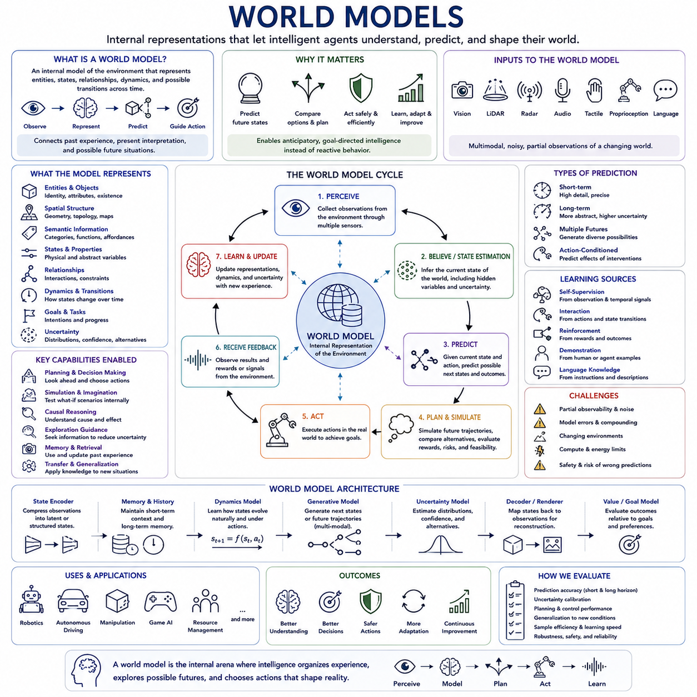{width="7.268055555555556in" height="7.268055555555556in"}

A world model is an internal representation that allows an intelligent agent to organize knowledge about its environment and predict how that environment may change. Rather than responding only to immediate observations, the agent maintains representations of entities, states, relationships, dynamics, and possible transitions. This internal structure enables intelligence to connect past experience with present interpretation and possible future situations.

The central purpose of a world model is prediction. Given a representation of the current state and a possible action, the model estimates what state may follow. Prediction can occur at many levels, from low-level sensory changes to object motion, semantic events, human behavior, or task outcomes. By anticipating future states before acting, an agent can compare alternatives and select actions according to their expected consequences.

World models differ from simple predictive models because they attempt to represent reusable structure rather than only predict a single target variable. A useful world model may contain objects, agents, spatial relationships, physical properties, goals, uncertainties, and transition rules. These representations can support multiple downstream functions such as perception, planning, control, reasoning, simulation, exploration, and learning instead of serving only one predefined task.

State representation is therefore a fundamental design problem. Raw sensor observations contain enormous amounts of information, much of which may be irrelevant to future decisions. A world model must compress observations into states that preserve information necessary for prediction and action. Learned latent states can provide compact representations while semantic or structured states can explicitly represent entities, properties, relationships, and task-relevant concepts.

An observation and a world state are not necessarily the same thing. Sensors provide partial and noisy measurements of reality, while the internal state represents what the agent believes about the underlying environment. An object may temporarily disappear behind an obstacle but remain represented in the world model. This distinction allows an intelligent system to maintain object permanence, track hidden variables, and reason under partial observability.

Temporal modeling connects states across time. Instead of treating individual observations independently, a world model estimates how states evolve and which variables remain stable or change. Motion, velocity, interaction, object transformation, environmental processes, and agent behavior all require temporal representations. Learning these transitions allows the system to move from static recognition toward understanding processes unfolding within the environment.

Dynamics models describe how states change over time, either naturally or because of actions. In an embodied agent, the model may estimate how steering affects vehicle motion, how force changes an object\'s position, or how terrain influences locomotion. More abstract models may predict how actions alter task progress or other agents\' behavior. Dynamics therefore provide the connection between world representation and purposeful intervention.

Actions are especially important because they distinguish passive prediction from interactive intelligence. A model that predicts what usually happens may rely heavily on observed correlations. A model that predicts what will happen when the agent performs a particular action must represent intervention. Learning action-conditioned transitions helps the agent understand controllability and provides a foundation for causal reasoning, planning, and model-based decision-making.

Causal structure can make world models more robust when environments change. Surface correlations may vary across locations, tasks, or operating conditions, while underlying causal mechanisms can remain more stable. An agent that represents how variables influence one another can reason about interventions and unfamiliar combinations more effectively than one relying only on statistical similarity. Causal world models therefore support generalization and transfer.

Uncertainty must also be represented because the future is rarely deterministic or completely observable. Several future states may be possible from the same current state, especially when other agents or unknown environmental factors are involved. A world model should therefore represent distributions, alternative hypotheses, or confidence estimates rather than producing only one certain prediction. Planning can then account for both expected outcomes and associated risks.

Multimodal world models integrate complementary information from different sensors and information sources. Vision may provide appearance and semantics, LiDAR may provide geometry, radar may provide motion information, proprioception may describe the agent\'s own state, and language may provide goals or conceptual knowledge. Combining these modalities can create a richer state representation while increasing robustness when individual information sources become unreliable.

Object-centric representations provide one approach to organizing world knowledge. Instead of representing an entire scene as an undifferentiated feature vector, the model identifies entities and their attributes, relationships, and interactions. This structure can support compositional generalization because familiar objects and relations can appear in previously unseen combinations. Object-centric models also connect naturally with reasoning about persistence, motion, ownership, interaction, and affordances.

Spatial representations describe where entities exist and how they relate geometrically or topologically. For embodied systems, this may include metric maps, occupancy structures, semantic maps, three-dimensional geometry, or bird\'s-eye-view representations. Spatial world models support localization, navigation, collision avoidance, manipulation, and route planning while connecting sensor observations to a persistent representation of the surrounding environment.

Semantic representations add meaning beyond geometry. A region may be recognized not merely as free space but as a road, corridor, doorway, workspace, restricted area, or hazardous zone. Objects can similarly be represented according to category, function, state, or affordance. Combining geometric and semantic information allows planning to consider not only where an agent can move but also what actions are appropriate within different contexts.

Hierarchical world models can represent the environment at several levels of abstraction. Low levels may describe sensory features, geometry, motion, and short-term dynamics, while higher levels represent objects, events, goals, tasks, and longer-term relationships. Hierarchical structure reduces computational complexity because not every decision requires detailed simulation of every variable. Different levels can be activated according to the reasoning and planning requirements of the current situation.

Prediction horizon introduces an important tradeoff. Short-term prediction can retain substantial physical detail and often achieve higher accuracy, while long-term prediction becomes increasingly uncertain. A useful world model may therefore predict near-term states precisely while representing distant futures more abstractly. Receding-horizon operation repeatedly updates predictions as new observations arrive, preventing the agent from depending excessively on increasingly uncertain long-range forecasts.

Generative models provide powerful mechanisms for representing multiple possible futures. Rather than predicting only a single next state, a generative world model can produce alternative future trajectories consistent with the current situation and candidate actions. Techniques based on autoregressive modeling, latent-variable models, diffusion, or related generative methods can support multimodal prediction when several plausible outcomes exist.

Simulation transforms a world model from a predictive representation into a reasoning environment. An agent can internally test candidate actions, estimate resulting states, compare alternative trajectories, and reject undesirable outcomes before acting physically. This process resembles mental simulation in biological intelligence. The ability to simulate possible futures connects world models directly with counterfactual reasoning, planning, risk assessment, and model-based control.

Model-based reinforcement learning uses this capability to reduce dependence on direct trial and error. Instead of learning only from actions executed in the real environment, an agent can use a learned model to generate imagined transitions and evaluate possible policies. If the model is sufficiently accurate, simulated experience can improve sample efficiency. However, planning must account for model error because repeated imagined transitions can accumulate prediction inaccuracies.

World models can also guide exploration. When the model encounters unfamiliar states or produces uncertain predictions, the agent can identify gaps in its knowledge. It may then seek observations or interactions expected to reduce uncertainty and improve the model. Exploration becomes purposeful information gathering rather than random behavior, connecting world-model learning with curiosity, active perception, active learning, and autonomous experimentation.

Memory and world models serve complementary roles. Episodic memory can preserve specific experiences, while a world model extracts reusable regularities from many experiences. Retrieved memories may provide evidence when the model encounters a similar situation, while model predictions can determine which memories are relevant. Over time, repeated experiences can be consolidated into increasingly stable representations of entities, dynamics, relationships, and environmental structure.

Language can extend a world model beyond directly observed experience. Descriptions, instructions, documentation, and communication with other agents can provide information about entities, relationships, rules, hazards, and goals before physical interaction occurs. For general intelligence, linguistic knowledge should connect with perceptual and action-based representations so that statements about the world influence prediction, planning, and behavior rather than remaining isolated symbolic information.

World models are particularly important for embodied intelligence because physical actions have costs and consequences. A robot cannot safely explore every possible action through unrestricted trial and error. Predicting outcomes internally allows it to reject dangerous or inefficient actions before execution. The world model therefore functions as a bridge between perception and safe action, supporting navigation, manipulation, autonomous driving, and other physical tasks.

Real-world environments require continual world-model updating. Objects move, maps change, machines degrade, weather varies, people behave unpredictably, and previously learned relationships may become invalid. A static model eventually becomes inaccurate. Continual learning must therefore update states and dynamics while preserving useful prior knowledge, distinguishing temporary changes from persistent changes and avoiding unnecessary destruction of previously reliable representations.

Adaptive computation can make world-model operation more efficient. Predictable observations may require only lightweight state updates, whereas unexpected events, high uncertainty, or dangerous situations can trigger deeper prediction and simulation. Rather than using maximum computation continuously, the system can allocate resources according to novelty, uncertainty, risk, and planning importance. This is especially valuable for edge and embodied systems with limited energy and compute.

Evaluating world models requires more than measuring one-step prediction accuracy. A useful model should preserve task-relevant information, support long-horizon reasoning, represent uncertainty, generalize to unfamiliar conditions, remain consistent across modalities, and improve downstream planning and control. Evaluation should also examine whether model errors are detected and corrected rather than silently propagated into increasingly unreliable decisions.

Ultimately, a world model gives an intelligent agent an internal arena in which experience can be organized and possible futures can be explored before actions are committed to the external world. By connecting perception, memory, causality, prediction, simulation, reasoning, planning, and learning, it transforms intelligence from reactive pattern matching into anticipatory behavior. For AGI and embodied AI, world models provide a central mechanism for understanding how the world changes and how purposeful action can change it.

## 01.07. Information and Knowledge

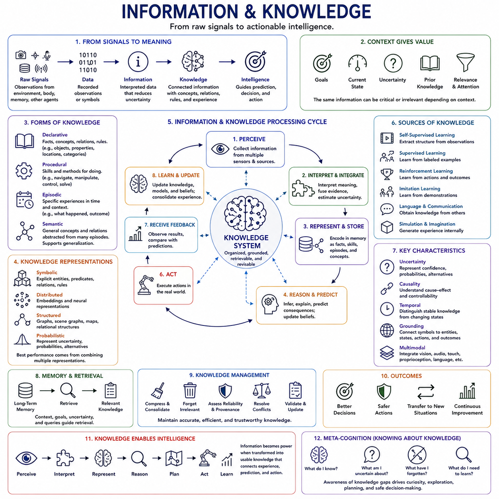{width="7.268055555555556in" height="7.268055555555556in"}

Information is the reduction of uncertainty through observations, signals, measurements, or communication. An intelligent system continuously receives information from its environment, internal states, memory, and other agents. Yet information alone does not constitute intelligence. The system must determine what signals mean, which are relevant, how they relate to existing experience, and whether they should influence beliefs, predictions, decisions, or actions.

Data, information, and knowledge represent related but distinct levels of organization. Data consists of recorded observations or symbols, while information emerges when those data are interpreted within a context. Knowledge develops when information becomes connected with concepts, relationships, rules, experience, and expectations that can support reasoning or action. Intelligence depends on transforming raw observations progressively into representations that can guide behavior.

The value of information depends strongly on context. The same observation may be critical in one situation and irrelevant in another. A temperature measurement, object location, spoken instruction, or sensor anomaly acquires significance according to the agent\'s goals, current state, uncertainty, and prior knowledge. Intelligent information processing therefore requires selective attention and relevance estimation rather than treating every available signal with equal importance.

Knowledge can be understood as structured information that supports prediction, explanation, reasoning, and action. Knowing an isolated fact is useful, but intelligence becomes more powerful when facts are connected through relationships. Knowledge that a surface is wet, for example, becomes more actionable when connected with concepts such as reduced friction, increased stopping distance, instability, risk, and appropriate changes in movement or control.

Declarative knowledge represents facts, concepts, and relationships that can often be explicitly described. It includes knowledge about objects, categories, properties, locations, events, and rules. An artificial agent may know that batteries store energy, obstacles restrict motion, or certain regions are hazardous. Such knowledge supports explanation and reasoning, but effective intelligence also requires knowing how to perform actions rather than merely describing the world.

Procedural knowledge represents skills and methods for accomplishing tasks. It may describe how to navigate, manipulate an object, operate a tool, solve a problem, or execute a control strategy. Procedural knowledge is often encoded implicitly in policies, programs, motor patterns, or learned parameters rather than explicit propositions. General intelligence requires interaction between declarative understanding and procedural competence so that knowing and doing reinforce one another.

Episodic knowledge preserves information about particular experiences situated in time and context. An agent may remember where an event occurred, which actions were attempted, what outcome followed, and which environmental conditions were present. Such experiences can later provide evidence for reasoning and planning. Episodic information also enables learning from rare events that might disappear if experience were reduced immediately to general statistical patterns.

Semantic knowledge abstracts reusable concepts and relationships from individual experiences. Repeated observations of particular objects, actions, and outcomes can gradually produce general knowledge that applies beyond the original episodes. Semantic knowledge therefore supports generalization by separating stable regularities from incidental details. An intelligent memory system must continually balance preservation of specific experiences with consolidation into broader conceptual structures.

Knowledge representation determines how information becomes accessible to intelligence. Symbolic systems may represent explicit entities, predicates, relations, and rules, while neural systems encode distributed patterns within learned representations. Vector embeddings capture similarity and contextual structure, graphs express relationships, and probabilistic models represent uncertainty. General intelligence may benefit from combining multiple forms rather than assuming that one representation is universally optimal.

Distributed representations allow concepts to be encoded across many interacting dimensions rather than assigning each concept a single isolated symbol. This enables similarity, analogy, and statistical generalization to emerge naturally from representation geometry. Modern neural networks and foundation models rely heavily on such representations. Their strength lies in flexible pattern learning, although their internal knowledge may be difficult to interpret or verify explicitly.

Structured representations provide complementary advantages by making entities and relationships more explicit. Knowledge graphs, relational structures, scene graphs, semantic maps, and symbolic models can preserve information about how concepts are connected. This structure supports compositional reasoning, constraint checking, and interpretable relationships. Combining distributed and structured representations can therefore connect flexible learning with more explicit reasoning.

Uncertainty is an essential property of knowledge because intelligent systems rarely possess complete or perfectly reliable information. A system may be uncertain whether an object exists, whether a sensor reading is accurate, or whether a prediction will occur. Knowledge should therefore include confidence, probability, alternative hypotheses, or evidence quality. Recognizing uncertainty prevents incomplete information from being incorrectly treated as unquestionable fact.

Belief represents an agent\'s current estimate of what is likely to be true given available evidence. New observations can strengthen, weaken, or replace existing beliefs. Probabilistic inference provides formal mechanisms for updating beliefs when evidence arrives, but intelligent systems may also use learned confidence estimates and competing hypotheses. Knowledge is therefore not always static storage; it can be an evolving state continually revised through interaction.

Information fusion combines evidence from multiple sources into more reliable representations. A robot may integrate cameras, LiDAR, radar, proprioception, maps, language, and prior experience when estimating its environment. Different sources may have different resolutions, uncertainties, failure modes, and update rates. Effective fusion must determine not only how signals agree but also which source should be trusted when observations conflict.

Multimodal knowledge extends beyond sensor fusion by connecting different forms of meaning. The concept of an object can include its visual appearance, spoken or written name, physical shape, sound, function, affordances, and interaction history. Connecting these modalities enables knowledge acquired through one channel to influence another. Language can identify an unfamiliar object, while physical interaction can later enrich the linguistic concept with grounded properties.

Grounding connects abstract information with entities, states, actions, and consequences in the world. A symbol such as "door" becomes more meaningful when connected with visual appearances, spatial structures, opening actions, accessibility, and expected state transitions. For embodied intelligence, grounding prevents knowledge from remaining purely symbolic. Concepts become useful because they participate directly in perception, prediction, planning, and physical interaction.

Information is also organized across time. Some knowledge describes stable properties, while other information represents rapidly changing states. An object\'s identity may remain persistent while its position changes continuously. Intelligent systems therefore need temporal representations that distinguish enduring knowledge from transient observations. This distinction is essential for tracking objects, updating maps, detecting changes, predicting events, and maintaining coherent beliefs about a dynamic world.

A world model provides a framework for organizing information and knowledge into an operational representation of the environment. Perceptual information updates estimates of current states, memory contributes previous experience, semantic knowledge provides concepts and relationships, and dynamics describe possible transitions. The resulting model enables knowledge to participate directly in prediction and simulation rather than remaining a passive database of stored facts.

Prediction provides an important test of whether information has been transformed into useful knowledge. If an agent understands relationships among states, actions, and outcomes, it should be able to anticipate at least some consequences of future events. Prediction errors reveal where knowledge is incomplete or incorrect. Learning can then modify representations, allowing knowledge to become progressively better aligned with observed environmental structure and dynamics.

Causal knowledge goes beyond recognizing statistical regularities by describing how changes in one variable can influence another. This distinction becomes essential when an agent must intervene in the world. Correlation may support prediction under familiar conditions, but planning requires understanding how actions produce consequences. Causal knowledge therefore provides a stronger basis for counterfactual reasoning, transfer, diagnosis, and purposeful action.

Knowledge acquisition can occur through many learning paradigms. Supervised learning provides explicit associations, self-supervised learning extracts structure from observations, reinforcement learning connects actions with consequences, imitation provides behavioral examples, and language transfers knowledge accumulated by others. A general intelligence system should integrate these sources so that information obtained through one learning mechanism can improve representations used by others.

Memory retrieval determines which stored knowledge becomes available at a particular moment. An intelligent system cannot efficiently process everything it has ever learned for every decision. Retrieval must therefore identify information relevant to the current observation, question, goal, or uncertainty. Effective retrieval transforms large memory stores into context-sensitive working knowledge and is central to retrieval-augmented systems, agents, and long-term autonomous operation.

Forgetting and compression are also necessary components of intelligent knowledge management. Preserving every observation indefinitely at equal priority would create enormous storage and retrieval costs. Repeated information can be consolidated, irrelevant details can lose priority, and important or unusual experiences can be preserved. Intelligent forgetting is therefore not simply loss; it can be a mechanism for maintaining efficient, useful, and adaptable knowledge.

Knowledge must also be evaluated for provenance and reliability. Information may originate from direct observation, human instruction, documents, other agents, simulations, or model-generated predictions. These sources do not necessarily deserve equal trust. Recording where knowledge came from, when it was acquired, how strongly it is supported, and whether contradictory evidence exists can improve verification and reduce propagation of incorrect assumptions.

Contradictory information creates a further challenge. An intelligent agent may receive evidence that conflicts with stored knowledge or with another source. Simply retaining both claims without evaluation can produce inconsistent reasoning, while immediately replacing old knowledge can destroy useful information. Resolution may require considering recency, source reliability, contextual differences, uncertainty, and additional observations before beliefs are revised.

Knowledge becomes most valuable when it can transfer to unfamiliar situations. Memorizing individual observations may provide high performance within familiar conditions but weak generalization. Abstract concepts, causal relationships, compositional structures, and reusable skills allow an agent to interpret new combinations of entities and events. General intelligence therefore requires knowledge that supports adaptation rather than merely reproducing previously observed patterns.

Metacognition adds knowledge about the system\'s own knowledge state. An intelligent agent should distinguish what it knows, what it believes with uncertainty, what it has forgotten, and what information it still needs. This awareness can trigger retrieval, observation, experimentation, tool use, or requests for assistance. Knowing the limits of available knowledge is therefore itself an important component of intelligent reasoning and safe decision-making.

Ultimately, information becomes valuable to intelligence when it is transformed into organized, grounded, retrievable, and revisable knowledge. An intelligent agent must continuously acquire signals, interpret context, construct representations, integrate evidence, preserve useful experience, estimate uncertainty, and update beliefs. Through memory, learning, world models, reasoning, and action, knowledge becomes not merely stored information but an active structure for understanding the world and deciding what to do next.

## 01.08. Representation Learning Revisited

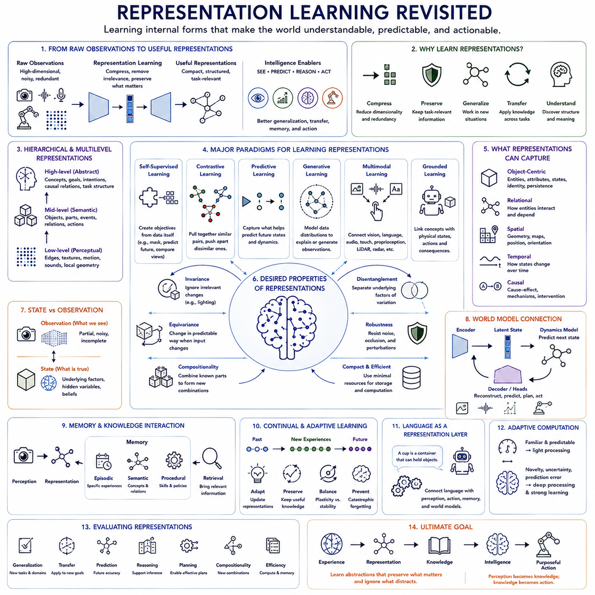{width="7.268055555555556in" height="7.268055555555556in"}

Representation learning is the process by which an intelligent system transforms raw observations into internal forms that make important structure easier to recognize, predict, reason about, and use for action. Instead of relying entirely on manually designed features, the system learns which properties of experience should be preserved. The quality of these representations strongly determines what the system can generalize, transfer, remember, and understand.

Raw observations are usually too detailed and unstable to serve directly as useful knowledge. Images contain millions of pixel values, audio contains rapidly changing waveforms, and robotic sensors continuously produce high-dimensional measurements. Representation learning compresses these signals while attempting to retain information relevant to objects, relationships, dynamics, semantics, goals, and possible actions. Effective compression removes redundancy without discarding structure required for intelligence.

Early machine learning often depended heavily on handcrafted features designed by domain experts. Computer vision used edges, corners, textures, and geometric descriptors, while speech and control systems relied on carefully selected signal characteristics. Deep learning changed this approach by allowing hierarchical features to emerge from data. Representations could increasingly be optimized together with the task rather than being completely specified before learning began.

Hierarchical representation is important because intelligent understanding occurs at multiple levels of abstraction. Low-level features may describe color, texture, motion, sound, or local geometry, while intermediate representations capture parts, objects, spatial configurations, and events. Higher levels can represent concepts, goals, intentions, causal relationships, or task structure. Intelligence requires connections across these levels rather than treating perception and abstract reasoning as independent processes.

Distributed representations encode information across patterns of many interacting dimensions. A concept does not necessarily correspond to one dedicated unit but may emerge from relationships among many features. This provides flexibility because similar concepts can occupy nearby regions of representation space and share useful structure. Distributed representations support statistical generalization, analogy, and transfer, although their internal meaning may be difficult to interpret explicitly.

Latent representations provide compact descriptions of underlying factors that may explain observations. A latent state can summarize information about objects, motion, geometry, context, or hidden environmental conditions without reproducing every sensor measurement. For intelligent agents, the objective is not simply dimensionality reduction. The latent space should preserve variables that support prediction, planning, control, reasoning, and adaptation across changing situations.

Self-supervised learning has become a major mechanism for constructing such representations. Instead of requiring explicit labels, the learner derives objectives from the structure of data itself. Predicting masked components, future observations, transformations, or relationships between different views encourages the model to discover reusable regularities. Large quantities of unlabeled experience can therefore build general representations before specialized tasks provide additional supervision.

Contrastive learning develops representations by encouraging related observations to become closer while separating unrelated examples. Different views of the same object, scene, event, or temporal sequence can provide positive relationships, while other observations provide comparisons. This teaches the model which variations should be ignored and which distinctions should remain meaningful. The resulting invariances can improve robustness and transfer when carefully aligned with downstream requirements.

Predictive representation learning instead emphasizes information that helps anticipate future observations or states. Features useful only for reconstructing irrelevant details may be less valuable than features capturing variables that determine how the environment evolves. Prediction therefore encourages representations of dynamics, persistence, interaction, and temporal structure. This becomes especially important for autonomous agents that must reason about what may happen after their actions.

Generative representation learning attempts to capture enough structure to explain or produce observations. Autoencoders, latent-variable models, autoregressive systems, diffusion approaches, and other generative methods can learn rich latent spaces by modeling data distributions. Generative objectives can preserve detailed information and represent multiple plausible outcomes, making them useful when an intelligent system must imagine alternatives or model uncertainty about possible futures.

Multimodal representation learning connects information from vision, language, audio, touch, proprioception, LiDAR, radar, and other channels. Different modalities describe overlapping aspects of the same world, allowing one source to constrain another. A shared representation can connect the appearance of an object with its name, geometry, sound, physical properties, and possible uses. This creates richer concepts than representations learned independently from isolated modalities.

Grounded representation learning extends multimodal learning by connecting internal concepts with physical states, actions, and consequences. Understanding a "container," for example, should involve more than linguistic similarity or visual appearance. It may include expectations about containment, opening, manipulation, capacity, and possible state transitions. Grounding therefore transforms representations from statistical patterns into structures connected with what an embodied agent can perceive and do.

Object-centric representation learning attempts to decompose scenes into persistent entities rather than representing an entire observation as one undifferentiated vector. Objects can have identities, attributes, positions, relationships, and changing states. Such structure supports tracking, compositionality, reasoning, and prediction because familiar entities can participate in new combinations. Object persistence also helps maintain coherent world states when objects become temporarily unobservable.

Relational representations complement object-centric structure by encoding how entities interact. Intelligence often depends less on recognizing isolated objects than on understanding relationships such as inside, behind, attached, approaching, supporting, owning, or causing. Graph-based and relational architectures can represent these dependencies explicitly. Relational knowledge is especially important for reasoning because many concepts are defined by connections among entities rather than intrinsic properties alone.

Spatial representations organize information about geometry, location, orientation, distance, connectivity, and reachability. For embodied agents, spatial understanding may involve local coordinates, maps, three-dimensional geometry, occupancy structures, semantic maps, or bird\'s-eye-view representations. These representations allow observations from different positions and times to be integrated into a persistent model that supports navigation, manipulation, planning, and environmental understanding.

Temporal representations capture how states evolve rather than describing only static observations. Motion, actions, events, intentions, and physical processes become meaningful through sequences. Recurrent models, temporal attention, state-space models, and predictive architectures can encode dependencies across time. A useful temporal representation should distinguish persistent properties from changing states while preserving information required to anticipate future transitions.

Causal representations seek variables and relationships that remain meaningful under intervention and environmental change. Statistical features can provide excellent prediction within familiar distributions while failing when correlations shift. Representations that capture causal mechanisms may transfer more reliably because they describe how states influence one another. For agents that act in the world, causal structure is particularly valuable because actions deliberately modify variables and create consequences.

Invariance is a central objective of representation learning, but excessive invariance can be harmful. A recognition system may appropriately ignore small changes in lighting or viewpoint, yet a navigation system cannot ignore changes in obstacle position. Intelligent representations must therefore preserve task-relevant variation while discarding irrelevant variation. What should remain invariant depends on the agent\'s goals, actions, environment, and level of abstraction.

Equivariance provides another useful principle. Instead of ignoring a transformation, an equivariant representation changes in a predictable way when the input changes. If an object moves, for example, its internal spatial representation should reflect that movement consistently. Equivariance is valuable for geometry, robotics, physical reasoning, and manipulation because transformations of the world should correspond systematically to transformations within the internal model.

Compositional representations allow familiar components to be combined into unfamiliar configurations. Rather than memorizing every possible scene or task, an agent can represent objects, properties, relations, actions, and goals as reusable components. New situations can then be constructed from known elements. Compositionality is therefore closely connected with systematic generalization and provides a mechanism for expanding competence beyond combinations explicitly encountered during training.

Representation learning must also separate state from observation. Sensors provide incomplete and noisy measurements, while intelligent behavior requires estimates of underlying environmental conditions. A representation may therefore maintain beliefs about hidden objects, intentions, physical properties, or other latent variables that are not directly observable. This distinction becomes fundamental under partial observability and forms an important foundation for persistent world models.

World models place representation learning inside a larger predictive architecture. Encoders transform observations into states, dynamics models predict how those states evolve, and decoders or task heads translate internal states into useful predictions or actions. Representation quality determines whether the learned state contains sufficient information for future prediction. World-model learning can therefore shape representations according to their usefulness for simulation, planning, and control.

Memory extends representations across longer timescales than immediate perception. Episodic memory preserves particular experiences, semantic memory extracts reusable concepts, and procedural memory retains skills. Retrieval can reintroduce information that is not present in the current observation. Representation learning and memory must therefore cooperate so that stored experiences can be efficiently indexed, compared, retrieved, consolidated, and integrated with the agent\'s current internal state.

Language provides an additional representational layer capable of expressing abstract concepts, relationships, instructions, and explanations. Language representations can transfer knowledge across tasks and agents, but linguistic structure alone does not guarantee grounded understanding. General intelligence benefits when language connects with perception, action, memory, and world models, allowing abstract descriptions to influence predictions and behavior while physical experience refines linguistic concepts.

Continual representation learning is required because the environment and the agent\'s capabilities change over time. New objects, tasks, sensors, behaviors, and operating conditions may require existing representations to adapt. Yet uncontrolled adaptation can destroy previously useful structure. A general system therefore needs mechanisms for preserving stable concepts while extending its representational space, balancing plasticity with long-term consistency and avoiding catastrophic forgetting.

Adaptive computation can make representation learning more efficient. Familiar and highly predictable observations may require only small state updates, while novelty, uncertainty, prediction error, or unexpected transitions can trigger deeper processing and stronger learning. This event-sensitive strategy concentrates computation on informative experiences. For embodied and edge systems, such selective processing can reduce energy consumption while preserving responsiveness to important environmental changes.

Evaluating representations requires more than measuring reconstruction accuracy or performance on one downstream benchmark. Useful representations should support generalization, transfer, prediction, reasoning, planning, robustness, compositionality, and adaptation. They should preserve information relevant to action while rejecting irrelevant variation. Evaluation must therefore examine whether learned structure remains useful across tasks, environments, modalities, timescales, and distribution shifts.

Ultimately, representation learning determines how experience becomes internal structure. Intelligence cannot reason effectively about a world represented only as unorganized sensory measurements, nor can it generalize well from representations tied too closely to individual observations. By learning abstractions that preserve entities, relationships, dynamics, semantics, uncertainty, causality, and action possibilities, an intelligent agent builds the internal language through which perception becomes knowledge and knowledge becomes purposeful behavior.

## 01.09. Unified Intelligence Framework

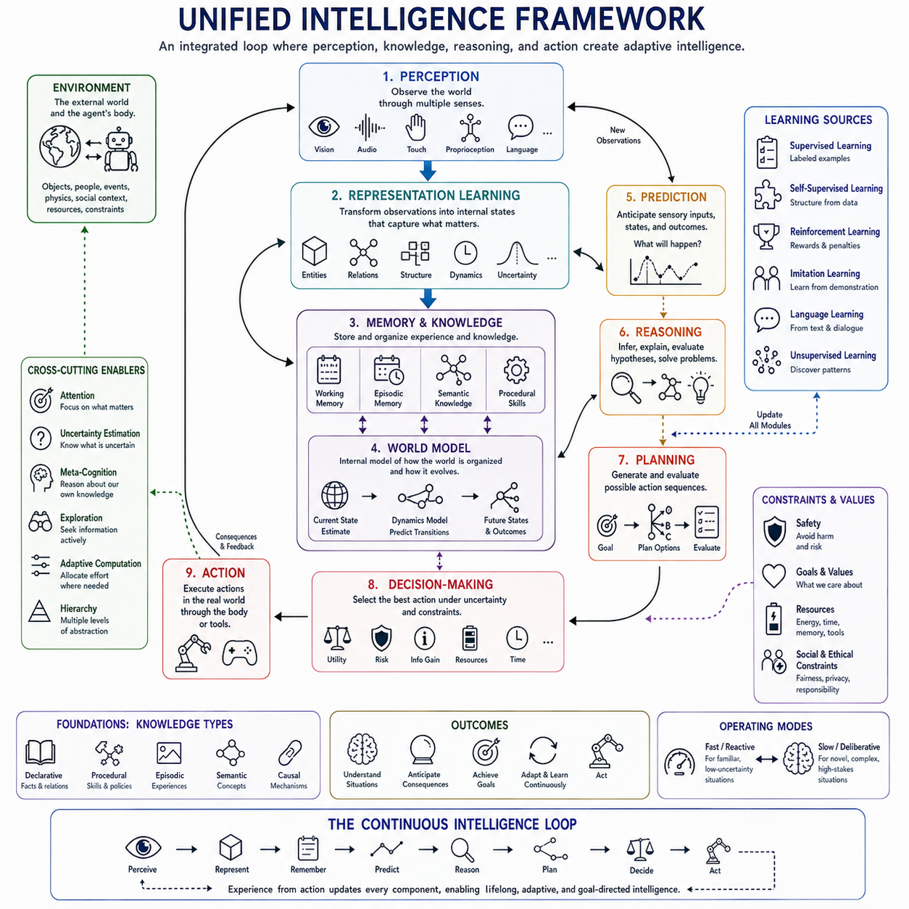{width="7.268055555555556in" height="7.268055555555556in"}

A unified intelligence framework views intelligence not as a collection of independent abilities but as a coordinated system in which perception, representation, memory, learning, reasoning, prediction, planning, and action continuously influence one another. Intelligence emerges from their integration. No single component is sufficient by itself; adaptive behavior depends on information flowing across multiple cognitive functions while the agent interacts with its environment.

Perception provides the framework with observations about the external world and the agent\'s internal condition. Vision, language, sound, touch, proprioception, and other sensory channels deliver partial and uncertain evidence rather than complete descriptions of reality. Intelligent perception must therefore select relevant information, integrate multiple modalities, estimate uncertainty, and transform raw signals into representations that can support higher-level cognition and action.

Representation learning converts observations into internal states that preserve useful structure while removing unnecessary detail. Effective representations capture entities, properties, relationships, spatial organization, temporal dynamics, semantics, uncertainty, and action possibilities. They provide a shared internal language through which perception can communicate with memory, prediction, reasoning, and planning, making representation a central integration layer within the intelligence architecture.

Memory extends intelligence beyond the immediate present. Working memory maintains information required for current reasoning, episodic memory preserves specific experiences, semantic memory stores generalized concepts and relationships, and procedural memory retains skills and policies. Memory is not simply passive storage. Retrieval reconstructs relevant context, while consolidation transforms repeated experiences into reusable knowledge that can guide future interpretation, prediction, and behavior.

Learning continually modifies the framework using experience. Supervised signals can provide explicit correction, self-supervised learning can discover structure from observation, reinforcement learning can connect actions with consequences, and imitation can transfer useful behavior from demonstrations. Rather than operating as isolated paradigms, these learning mechanisms can contribute complementary signals to shared representations, memories, policies, and world models.

A world model provides a persistent internal representation of how the environment is organized and how it may change. It connects entities, states, relationships, dynamics, actions, and possible transitions. Observations update the estimated current state, while learned dynamics predict future states. This enables an intelligent agent to move beyond immediate reaction and internally examine possible consequences before committing to actions in the external world.

Prediction is a fundamental operation within this framework because intelligence must anticipate rather than merely recognize. Predictions can concern sensory inputs, object motion, environmental changes, human behavior, task outcomes, rewards, or the consequences of actions. Differences between predicted and observed outcomes generate prediction errors that reveal weaknesses in current knowledge and provide signals for updating representations, beliefs, and world models.

Reasoning operates over representations, memories, beliefs, and world-model states to derive conclusions that are not directly present in current observations. It may involve logical, probabilistic, causal, analogical, spatial, or commonsense processes. Reasoning allows an agent to connect evidence, evaluate hypotheses, resolve inconsistencies, infer hidden conditions, and determine which knowledge is relevant to a problem rather than merely matching familiar patterns.

Causal reasoning is especially important when intelligence must act. Statistical associations may predict what commonly occurs, but an autonomous agent needs to estimate what will happen if it deliberately changes the environment. Actions are interventions that alter future states. Representing causal relationships therefore supports counterfactual reasoning, diagnosis, planning, transfer, and robust decision-making when familiar correlations no longer hold.

Planning transforms goals into sequences of possible actions. Using current state estimates, predicted transitions, constraints, and expected outcomes, the agent can compare alternative trajectories before execution. Short-horizon planning may focus on immediate motion or control, while long-horizon planning considers tasks, resources, dependencies, and future objectives. Hierarchical planning allows these timescales to cooperate without requiring every decision to operate at identical levels of detail.

Decision-making selects actions under uncertainty, limited resources, and competing objectives. The most likely outcome is not always the most desirable, and the highest expected reward may not always be sufficiently safe. Intelligent decisions may therefore balance utility, risk, information gain, energy, time, social constraints, and future flexibility. Decision-making becomes the interface through which internal cognition is converted into commitments that affect the world.

Action closes the perception-action loop. Once an action is executed, the environment changes and new observations become available. The resulting consequences provide evidence about whether the agent\'s predictions, causal assumptions, and plans were correct. Action therefore serves both as task execution and as an information-generating process. Intelligence develops through repeated cycles in which acting changes what can subsequently be perceived and learned.

Embodiment gives this loop physical meaning. A body determines what an agent can sense, where it can move, which objects it can manipulate, how much energy it consumes, and which actions are feasible or dangerous. Physical constraints transform abstract reasoning into situated intelligence. For embodied AI, cognition must remain connected to geometry, dynamics, time, safety, resources, and the irreversible consequences that may follow physical actions.

Attention regulates which information receives computational priority. Environments contain more information than an intelligent system can process equally at every moment. Attention can emphasize observations, memories, objects, goals, uncertainties, or predicted hazards that are currently relevant. This selective allocation of processing resources allows intelligence to remain responsive while avoiding unnecessary computation on information that has little influence on current decisions.

Adaptive computation extends this principle across the entire architecture. Familiar and predictable situations may require only lightweight perception, state estimation, and reactive control. Novelty, uncertainty, conflict, prediction error, or risk can activate deeper reasoning, broader memory retrieval, simulation, and replanning. Intelligence can therefore dynamically allocate computational effort according to the complexity and importance of the current situation.

Hierarchical organization provides another mechanism for managing complexity. Low-level processes can handle fast sensory processing and control, intermediate processes can maintain objects, spatial relationships, and short-term predictions, while higher levels represent goals, tasks, abstract concepts, and long-term strategies. Information can move both upward and downward, allowing sensory evidence to modify high-level beliefs while goals influence attention and lower-level action.

Fast and slow processing can coexist within such a hierarchy. Frequently encountered situations may be handled through learned policies and rapid pattern recognition, whereas unfamiliar or consequential problems may require deliberate simulation and reasoning. These modes should not be interpreted as completely separate systems. Instead, they represent different operating regimes within a shared architecture, with uncertainty and task demands determining how much computation is required.

Knowledge provides stable structure across these processes. Declarative knowledge represents facts and relationships, procedural knowledge supports skills, episodic knowledge preserves experiences, and semantic knowledge captures generalized concepts. Knowledge can originate from observation, interaction, language, demonstration, or external information sources. A unified framework must connect these forms so that what is learned in one context can influence prediction, reasoning, planning, and action elsewhere.

Language provides a powerful interface between internal intelligence and culturally accumulated knowledge. Instructions can specify goals, descriptions can update world knowledge, explanations can communicate causal relationships, and dialogue can provide feedback. Language also enables reasoning about situations that have not been directly experienced. Its greatest value emerges when linguistic representations connect with perception, memory, world models, and actions rather than remaining isolated symbolic patterns.

Metacognition allows the system to reason about its own cognitive state. An intelligent agent should estimate what it knows, where uncertainty remains, whether a memory is reliable, whether a prediction is outside familiar conditions, and whether additional information is required. These judgments can trigger deeper computation, retrieval, observation, experimentation, tool use, or assistance, enabling the system to regulate its own reasoning rather than treating every conclusion as equally reliable.

Exploration follows naturally from metacognition and uncertainty. When important knowledge is missing, an agent can actively seek information instead of waiting passively for new observations. It may change viewpoint, investigate an unfamiliar region, test an object, ask a question, or perform a controlled experiment. Exploration therefore connects learning with planning and action, allowing the agent to improve both its task performance and its internal model of the world.

Continual learning keeps the framework synchronized with changing environments and expanding experience. New observations may introduce unfamiliar entities, altered dynamics, new tasks, or exceptions to previous knowledge. The system must incorporate these changes without unnecessarily destroying established capabilities. Memory consolidation, selective updating, modularity, replay, and retrieval can help balance plasticity with stability across the lifetime of an intelligent agent.

Transfer and generalization determine whether the integrated framework produces reusable intelligence rather than task-specific competence. Representations, causal models, skills, concepts, and strategies learned in one situation should support adaptation to related but unfamiliar situations. Compositional knowledge is especially valuable because known entities, relationships, actions, and goals can be reorganized into new combinations without requiring the agent to learn every possible configuration independently.

Safety must constrain every stage of the framework rather than appearing only after an action has been selected. Perception should detect hazards, world models should represent uncertainty, planning should reject unsafe trajectories, learning should respect operational boundaries, and decision-making should account for risk. For embodied intelligence, safety becomes an architectural property connecting sensing, prediction, reasoning, planning, control, monitoring, and recovery.

The unified framework can therefore be understood as a continuous closed loop rather than a linear pipeline. Perception updates representations, representations update memory and world models, prediction anticipates transitions, reasoning interprets possibilities, planning constructs candidate actions, decision-making selects among them, and action changes the environment. New observations then begin another cycle, while learning modifies every component from accumulated experience.

Ultimately, unified intelligence emerges when these mechanisms become mutually supportive rather than independently optimized modules. Perception supplies evidence, representation creates structure, memory provides continuity, learning enables adaptation, world models provide predictive understanding, reasoning derives implications, planning explores possible futures, and action tests those expectations against reality. Their integration creates an adaptive system capable not merely of processing information, but of understanding situations, anticipating consequences, pursuing goals, and continually improving through experience.
