**Volume 47. Artificial General Intelligence**

# Chapter 02. Theory of General Intelligence

## 02.00. Formal Definitions

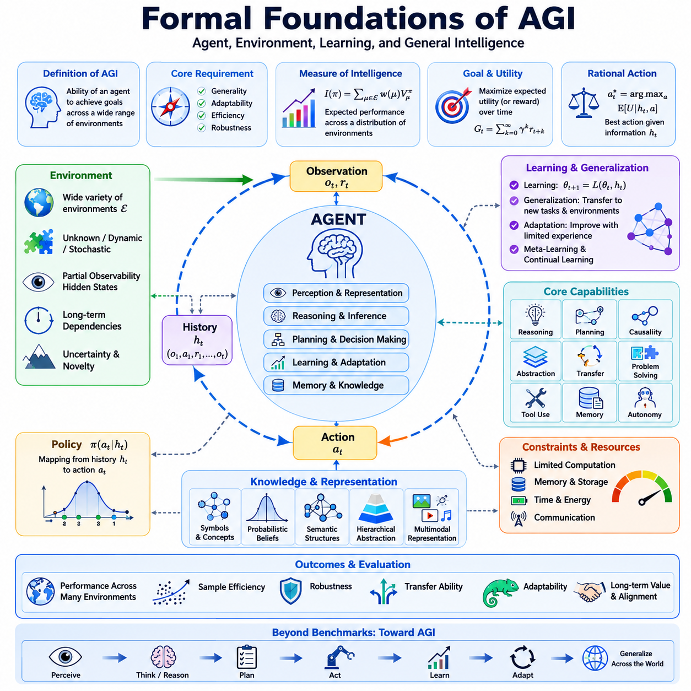{width="7.268055555555556in" height="7.268055555555556in"}

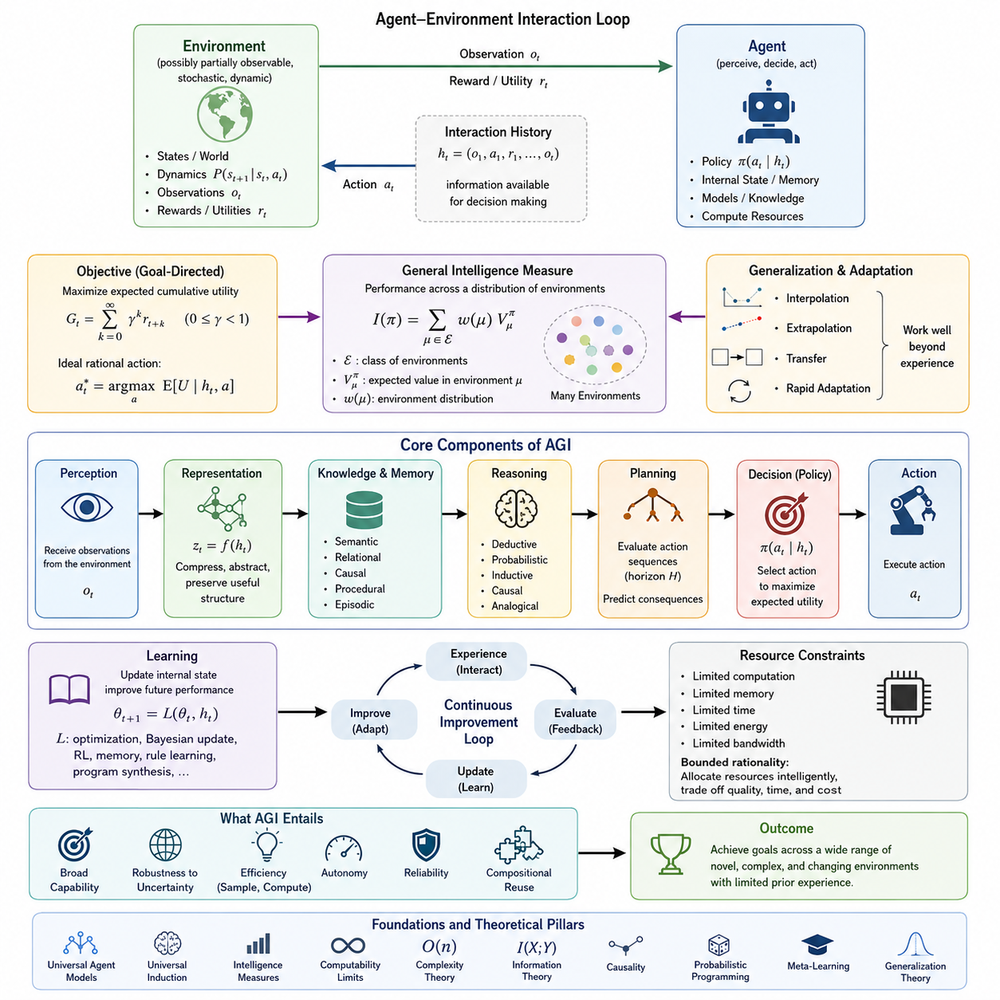{width="7.268055555555556in" height="7.268055555555556in"}

일반인공지능(Artificial General Intelligence, AGI)은 지능을 충분히 다양한 환경 분포 전반에서 목표를 달성하는 에이전트(Agent)의 역량으로 정의함으로써 형식적으로 접근할 수 있습니다. 지능을 특정 작업, 데이터셋(Dataset), 또는 벤치마크(Benchmark)와 결부시키는 대신, 이러한 관점은 에이전트를 관찰(Observation)을 수신하고, 내부 정보를 유지하며, 행동(Action)을 선택하고, 경험에 따라 행동을 조정하는 시스템으로 기술합니다. 따라서 일반성(Generality)은 하나의 좁은 영역 내에서의 뛰어난 성능이 아니라 여러 환경 전반에 걸친 성능과 관련됩니다.

유용한 형식적 추상화는 환경과 순차적으로 상호작용하는 에이전트를 나타냅니다. 시간 (t)에서 환경은 관찰 (o_t)를 제공하며, 여기에는 보상 또는 유틸리티(Utility) 신호 (r_t)가 함께 제공될 수 있습니다. 에이전트는 정책(Policy) (\\pi)에 따라 행동 (a_t)를 선택하고, 환경은 새로운 상태로 진화합니다. 상호작용 이력 (h_t=(o_1,a_1,r_1,\\ldots,o_t))은 의사결정에 이용 가능한 정보를 요약하며, 학습, 예측, 합리적 행동을 정의하는 기초를 제공합니다.

환경은 미래의 관찰과 보상이 이전의 상호작용 이력과 현재 행동에 어떻게 의존하는지를 기술하는 조건부 확률 분포로 모델링될 수 있습니다. 완전히 관찰 가능한 마르코프(Markov) 설정에서는 이것이 전이 모델(Transition Model) (P(s_{t+1}\|s_t,a_t))로 축소될 수 있습니다. 그러나 일반 지능은 모든 환경이 완전히 관찰 가능하거나 마르코프적(Markovian)이라고 가정할 수 없습니다. 따라서 AGI 지향적 공식화는 은닉 상태(Hidden State), 불완전한 관찰, 확률적 전이, 긴 시간적 의존성, 기저의 환경 구조에 대한 불확실성을 수용해야 합니다.

이 틀 안에서 정책은 이용 가능한 정보를 행동으로 매핑(Mapping)하는 것이며, 흔히 (\\pi(a_t\|h_t))로 표현됩니다. 결정론적(Deterministic) 정책은 각 이력에 대해 하나의 행동을 선택하는 반면, 확률적(Stochastic) 정책은 가능한 행동들에 대한 확률 분포를 정의합니다. 지능은 정책 자체와 동일시되지 않는데, 이는 동일한 정책이 서로 다른 환경에서 다르게 작동할 수 있기 때문입니다. 대신, 지능은 에이전트, 그 목표, 계산 자원, 축적된 지식, 그리고 행동이 평가되는 환경들 간의 관계로부터 나타납니다.

목표 지향적 행동은 대안적인 행동 순서들을 비교할 수 있는 목적함수(Objective)를 필요로 합니다. 강화학습(Reinforcement Learning) 공식화는 흔히 이를 기대 누적 보상(Expected Cumulative Return)을 통해 나타내는데, 예를 들어 (G_t=\\sum_{k=0}\^{\\infty}\\gamma\^k r_{t+k})와 같은 형태이며, 여기서 (\\gamma)는 미래 결과의 상대적 중요도를 조절합니다. 더 일반적인 공식화는 명시적인 보상 대신 유틸리티 함수(Utility Function)를 사용할 수도 있습니다. 핵심적인 요구사항은 에이전트가 시간에 걸친 결과를 평가해야 한다는 것이며, 이는 지능을 고립된 예측이나 분류가 아니라 순차적 의사결정과 근본적으로 연결시킵니다.

이상적인 합리적 에이전트는 그러면 자신의 정보와 불확실성 모델을 바탕으로 기대 유틸리티를 최대화하는 행동을 선택하는 것으로 정의될 수 있습니다. 형식적으로 이는 (a_t\^\*=\\arg\\max_a \\mathbb{E}[U\|h_t,a])와 유사합니다. 이러한 정의는 합리성(Rationality)을 전지성(Omniscience)으로부터 분리합니다. 에이전트는 실제로 무슨 일이 일어날지 알 필요가 없으며, 현재 정보가 허용하는 최선의 결정을 내려야 합니다. 개선된 표현(Representation), 모델, 지식이 이러한 기대치와 그로부터 나오는 결정의 질을 점진적으로 향상시킬 수 있기 때문에 학습은 필수적입니다.

일반 지능은 합리적 의사결정을 넘어서는 또 다른 요구사항을 도입합니다: 에이전트는 각각의 작업마다 완전한 재학습을 필요로 하지 않으면서 다수의 가능한 작업과 환경에서 효과적으로 작동해야 합니다. (\\mathcal{E})를 환경들의 부류(Class)로, (V_\\mu\^\\pi)를 정책 (\\pi)가 환경 (\\mu)에서 얻는 기대값으로 표기합시다. 일반 지능 척도는 개념적으로 분포 (w(\\mu))에 의해 가중된 여러 환경들에 걸쳐 (V_\\mu\^\\pi)를 집계하여 (I(\\pi)=\\sum_{\\mu\\in\\mathcal{E}}w(\\mu)V_\\mu\^\\pi) 형태의 양을 만들어낼 수 있습니다.

이러한 공식화는 AGI를 정의하는 데 있어 가장 심오한 문제 중 하나를 즉시 드러냅니다: 환경 분포의 선택이 무엇을 지능적이라고 간주할지를 결정합니다. 분포에 체스 포지션만 포함되어 있다면 지능은 체스 실력이 됩니다. 언어 작업, 물리적 환경, 과학적 문제, 사회적 상호작용, 낯선 상황이 포함되어 있다면 그 척도는 더 넓어집니다. 따라서 일반 지능에 대한 의미 있는 정의는 단순한 평균적 작업 성능뿐만 아니라 폭넓음, 다양성, 불확실성, 새로움, 그리고 분포적 변화 하에서도 효과성을 유지하는 능력을 특징지어야 합니다.

학습은 경험이 미래의 기대 성능을 향상시키는 방식으로 에이전트를 변화시키는 과정으로 형식화될 수 있습니다. (\\theta_t)가 시간 (t)에서 에이전트의 내부 매개변수, 기억, 지식, 또는 전략을 나타낸다면, 학습은 추상적으로 (\\theta_{t+1}=L(\\theta_t,h_t))로 표현될 수 있습니다. 연산자(Operator) (L)은 경사 기반(Gradient-based) 최적화, 베이즈적(Bayesian) 갱신, 강화학습, 기억 습득, 기호적(Symbolic) 규칙 형성, 프로그램 합성(Program Synthesis), 또는 이러한 메커니즘들의 조합에 해당할 수 있습니다. 따라서 AGI는 매개변수 최적화만으로는 부족한, 더 넓은 학습의 정의를 필요로 합니다.

일반화(Generalization)는 학습 중에 마주쳤던 정확한 상황을 넘어서도 유용한 성능을 유지하는 능력을 기술합니다. AGI에 있어 이는 익숙한 분포 내에서의 보간(Interpolation), 낯선 조건으로의 외삽(Extrapolation), 작업 간 전이(Transfer), 그리고 이전에 습득한 지식의 조합적 재사용을 포함합니다. 엄청난 수의 예제를 기억하는 시스템은 폭넓은 능력을 보이면서도 구조적으로 새로운 조건 하에서는 여전히 실패할 수 있습니다. 따라서 형식적 정의는 학습 규모를 통해 얻어진 커버리지(Coverage)와 재사용 가능한 원리 및 적응 가능한 표현을 통해 얻어진 일반성을 구별해야 합니다.

적응(Adaptation)은 일반화에 시간적 차원을 더합니다. 지능적 시스템은 단순히 고정된 능력의 저장고를 보유하는 것이 아니라, 환경 동역학, 목표, 이용 가능한 도구, 또는 제약이 변화할 때 그 행동을 수정해야 합니다. 이는 새로운 환경에서의 제한된 경험 이전과 이후의 성능을 고려함으로써 표현될 수 있습니다. 강력한 일반 지능을 보이는 에이전트는 비교적 적은 추가 정보로도 빠른 개선을 이루어야 하며, 이는 AGI 이론을 전이 학습(Transfer Learning), 소수샷 학습(Few-shot Learning), 메타학습(Meta-learning), 지속 학습(Continual Learning), 온라인 적응(Online Adaptation)과 연결시킵니다.

완전한 형식적 다룸은 계산상의 제약도 인정해야 합니다. 고전적 합리성은 무제한적인 계산을 가정할 수 있지만, 물리적 에이전트는 유한한 메모리, 처리 능력, 에너지, 통신 대역폭, 결정 시간을 가지고 작동합니다. 따라서 제한된 합리성(Bounded Rationality)은 이용 가능한 자원에 대해 상대적으로 지능적 행동을 정의합니다. AGI는 단순히 이론적으로 최적인 행동을 식별하는 것이 아니라, 계산을 지능적으로 배분하고, 어떤 문제가 더 깊은 추론을 필요로 하는지를 결정하며, 적절할 때 캐시(Cache)된 지식을 재사용하고, 해결책의 질을 지연 시간과 계산 비용에 대해 절충해야 합니다.

표현(Representation)은 에이전트가 원시적인 관찰을 직접적으로 추론하는 경우가 드물기 때문에 마찬가지로 근본적입니다. 에이전트는 감각적 또는 기호적 입력을 예측, 추론, 계획, 제어에 유용한 정보를 보존하는 내부 변수로 변환합니다. (z_t=f(h_t))를 상호작용 이력으로부터 도출된 내부 표현이라고 합시다. 효과적인 표현은 무관한 세부 사항을 압축하면서도 작업과 관련된 구조를 보존해야 합니다. 일반 지능의 경우, 표현은 추가적으로 모든 문제마다 완전히 별개의 표현을 필요로 하지 않으면서 다중 작업, 추상화 수준, 모달리티(Modality), 시간적 규모, 추론 형태를 지원해야 합니다.

지식은 환경과 가능한 결과에 대한 에이전트의 믿음을 제약하는 구조화된 정보로 간주될 수 있습니다. 형식적으로, 믿음은 (P(s_t\|h_t))와 같은 분포를 통해 표현될 수 있으며, 더 풍부한 시스템은 의미적(Semantic), 관계적(Relational), 인과적(Causal), 절차적(Procedural), 일화적(Episodic) 구조를 유지할 수 있습니다. 지능은 정보를 보유하는 것뿐만 아니라 맥락 하에서 적절한 지식을 검색하고 적용하는 것에도 의존합니다. 결과적으로, 기억 용량만으로는 지능의 충분한 척도가 아니며, 관련성 추정, 추상화, 통합, 지식 전이도 마찬가지로 중요합니다.

계획(Planning)은 가능한 미래 궤적을 평가함으로써 즉각적인 행동을 넘어서는 의사결정을 확장합니다. 환경 동역학의 모델이 주어지면, 에이전트는 후보 행동 순서 (a_t,\\ldots,a_{t+H})를 고려하고, 그 결과를 예측하며, 바람직한 결과와 연관된 행동을 선택할 수 있습니다. 계획 시야(Planning Horizon) (H)는 작업 구조와 불확실성에 따라 달라질 수 있습니다. 일반 지능은 관찰이 가정을 무효화하거나 이전에 알려지지 않은 제약을 드러낼 때 계획을 지속적으로 수정하면서, 짧고 긴 시야를 넘나드는 유연한 계획을 필요로 합니다.

추론(Reasoning)은 이용 가능한 표현과 믿음을 예측이나 행동 선택을 개선하는 새로운 결론으로 변환하는 것으로 형식적으로 이해될 수 있습니다. 연역적(Deductive) 추론은 명시된 전제로부터 결과를 도출하고, 확률적 추론은 불확실한 믿음을 갱신하며, 귀납적(Inductive) 추론은 관찰로부터 규칙성을 추출하고, 인과적 추론은 개입(Intervention)의 효과를 추정합니다. 실제 환경이 논리적 일관성, 통계적 추론, 유추(Analogy), 추상화, 인과적 모델링, 근사적 발견적(Heuristic) 탐색의 조합을 필요로 하기 때문에 AGI는 어떤 단일한 추론 메커니즘으로도 환원될 수 없습니다.

특히 중요한 구별은 역량(Competence)과 일반 지능 사이의 구별입니다. 역량은 특정 작업 내에서의 측정 가능한 성공을 의미하는 반면, 일반 지능은 시스템 구축 시 명시적으로 예상되지 않았던 작업을 포함하여 다수의 작업 전반에서 역량이 나타나도록 하는 메커니즘과 관련됩니다. 결과적으로, 벤치마크 점수는 지능에 대한 완전한 정의가 아니라 행동에 대한 관찰을 제공할 뿐입니다. 형식적인 AGI 이론은 시스템이 왜 성공하는지, 그 메커니즘이 얼마나 폭넓게 전이되는지, 얼마나 효율적으로 학습하는지, 익숙한 가정이 실패할 때 얼마나 신뢰성 있게 행동하는지를 설명해야 합니다.

이러한 고려사항들은 AGI가 이진적(Binary) 임계값이 아니라 다차원적 속성으로 다루어지는 것이 가장 적절하다는 것을 시사합니다. 형식적 특성화는 여러 환경에 걸친 기대 성능, 샘플 효율성, 전이 효율성, 적응 속도, 계획 깊이, 견고성(Robustness), 계산 효율성, 자율성, 달성 가능한 목표의 다양성을 포함할 수 있습니다. 따라서 서로 다른 시스템은 그 종합적인 성능이 유사하게 보일 때에도 서로 다른 지능 프로파일(Profile)을 나타낼 수 있습니다. 이러한 관점은 또한 단일한 벤치마크나 능력이 일반 지능에 대한 우연적인 정의가 되는 것을 방지합니다.

형식적 정의는 궁극적으로 일반 지능 이론의 나머지 부분에 필요한 수학적 언어를 제공합니다. 이는 에이전트, 환경, 이력, 정책, 유틸리티, 학습, 일반화, 적응, 표현, 추론, 계획, 자원 제약을 하나의 틀 내에서 상호작용하는 구성요소로서 확립합니다. 이러한 기초는 자연스럽게 보편적 에이전트 모델(Universal Agent Model), 보편적 귀납(Universal Induction), 지능 척도, 계산 가능성(Computability)의 한계, 복잡도(Complexity), 정보 이론, 인과성(Causality), 확률적 프로그래밍(Probabilistic Programming), 메타학습, 일반화 이론으로 이어집니다.

## 02.01. AIXI and Solomonoff Induction

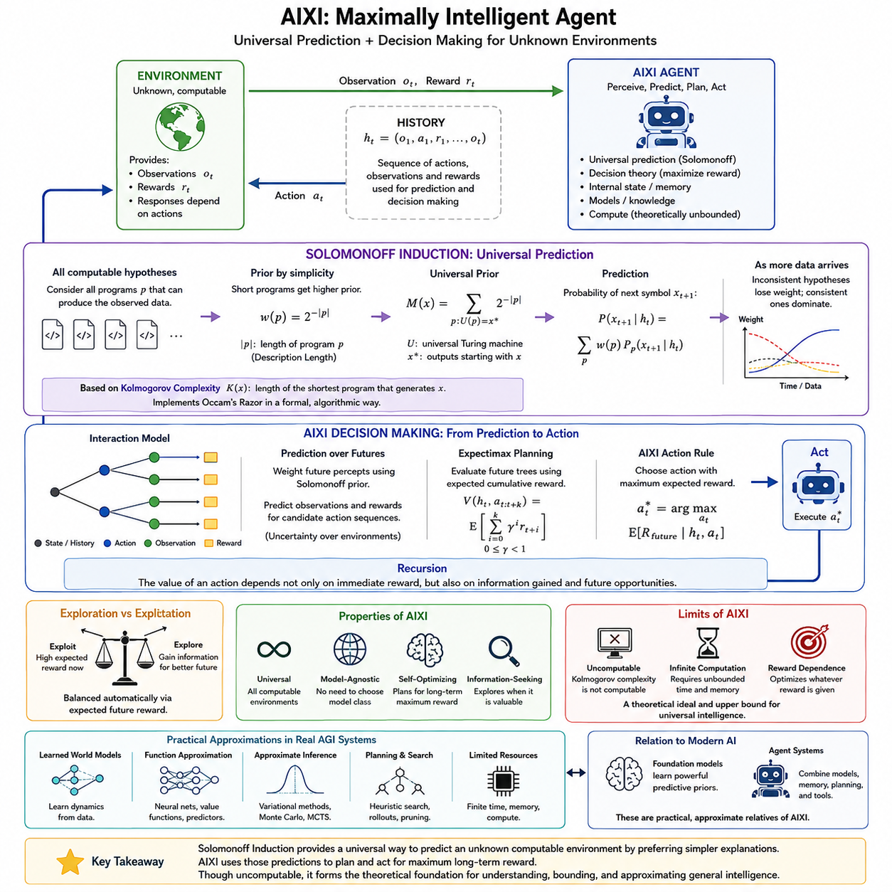{width="7.268055555555556in" height="7.268055555555556in"}

AIXI는 일반지능(general intelligence)의 개념을 형식화하기 위해 개발된 이론적 모델(theoretical model)로, 최대한 지능적인 에이전트(maximally intelligent agent)를 수학적으로 표현하려는 시도이다. 특정 벤치마크(benchmark)의 성능으로 지능을 정의하는 대신, AIXI는 알려지지 않은 환경(environment)과 상호작용하면서 기대되는 미래 보상(expected future reward)을 최대화하는 행동을 선택하는 에이전트를 가정한다. AIXI의 중요성은 실제 구현보다 범용 학습(universal learning), 예측(prediction), 계획(planning), 의사결정(decision making)을 논의하기 위한 수학적 기준점을 제공한다는 데 있다.

AIXI의 개념적 기반은 범용 예측(universal prediction)을 위한 솔로모노프 귀납(Solomonoff induction)과 합리적 행동(rational action)을 위한 순차적 의사결정 이론(sequential decision theory)이라는 두 가지 강력한 아이디어를 결합한다. 솔로모노프 귀납은 에이전트가 올바른 모델을 사전에 알지 못할 때 알려지지 않은 환경을 어떻게 예측해야 하는가라는 문제를 다룬다. 이후 의사결정 이론은 이러한 예측을 이용하여 가능한 미래 행동 순서를 평가하고 가장 큰 누적 효용(cumulative utility) 또는 보상을 가져올 것으로 기대되는 행동을 선택한다.

솔로모노프 귀납은 관측(observation)이 어떤 계산 가능한 과정(computable process)에 의해 생성되었을 수 있다는 생각에서 출발한다. 하나의 가설(hypothesis)에만 의존하는 대신 선택된 범용 튜링 머신(universal Turing machine)에서 관측 데이터를 생성할 수 있는 모든 프로그램을 고려한다. 각각의 프로그램은 환경에 대한 가능한 설명을 나타낸다. 예측은 이러한 설명을 사전확률(prior probability)에 따라 결합하여 얻으며, 단순성과 경험과의 일관성에 따라 여러 가능한 모델이 예측에 기여하도록 한다.

프로그램에 할당되는 사전확률(prior)은 프로그램의 기술 길이(description length)와 밀접하게 관련된다. (p)가 프로그램이라면 사전 가중치(prior weight)는 (2\^{-\|p\|})에 비례하며, 여기서 (\|p\|)는 프로그램의 길이를 나타낸다. 따라서 짧은 프로그램은 긴 프로그램보다 더 높은 사전확률을 부여받는다. 이는 오컴의 면도날(Occam\'s razor)을 형식적으로 구현한 것으로, 관측과 일치하는 여러 설명 중에서 기본적인 규칙성을 기술하는 데 더 적은 가정을 요구하는 단순한 설명을 우선적으로 선호한다.

이 원리는 콜모고로프 복잡도(Kolmogorov complexity)와 밀접하게 연결된다. 객체 (x)의 콜모고로프 복잡도 (K(x))는 고정된 범용 계산 기계(universal computing machine)에서 (x)를 생성하는 가장 짧은 프로그램의 길이를 의미한다. 짧은 기술로 표현할 수 있는 객체는 알고리즘적으로 단순한 것으로 간주되고, 긴 기술이 필요한 객체는 복잡한 것으로 간주된다. 솔로모노프 귀납은 이러한 알고리즘적 단순성(algorithmic simplicity)을 사용하여 사람이 직접 선택한 통계 모델군(statistical model family)에 의존하지 않는 계산 가능한 가설들의 범용 사전분포(universal prior)를 구성한다.

솔로모노프 범용 사전분포(Solomonoff universal prior)의 단순화된 표현은 (M(x)=\\sum_{p:U(p)=x\*}2\^{-\|p\|})로 나타낼 수 있다. 여기서 (U)는 범용 튜링 머신을 의미하며, 합산은 출력이 시퀀스(sequence) (x)로 시작하는 프로그램들을 대상으로 한다. 범용 분포(universal distribution)는 가장 짧은 하나의 설명만 선택하지 않고 서로 양립 가능한 모든 프로그램을 종합한다. 짧은 설명은 더 큰 가중치를 가지므로 지배적인 영향을 미치지만, 관측된 시퀀스와 일치하는 한 더 긴 가설도 계속 기여한다.

관측이 축적됨에 따라 경험과 일치하지 않는 가설은 예측에 미치는 영향력이 감소하고, 데이터를 설명할 수 있는 가설은 확률을 유지한다. 따라서 솔로모노프 귀납은 환경이 신경망(neural network), 논리 시스템(logical system), 물리 방정식(physical equation), 확률 과정(probabilistic process), 또는 다른 계산 가능한 표현을 따른다고 사전에 가정하지 않고도 규칙성을 학습하기 위한 이론적 메커니즘을 제공한다. 이러한 의미에서 학습자는 이론적 수준에서 모델 불가지론적(model-agnostic)이며 매우 광범위한 가설 공간(hypothesis space)을 암묵적으로 탐색한다.

AIXI는 범용 예측을 수동적인 관측(passive observation)에서 능동적인 상호작용(active interaction)으로 확장한다. 수동적 예측기는 다음에 어떤 관측이 나타날지를 추정하기만 하지만 지능형 에이전트는 자신의 행동을 통해 환경을 변화시킨다. 따라서 미래 관측은 에이전트가 내린 결정에 부분적으로 의존한다. 그러므로 AIXI는 조건부 미래(conditional future)를 추론해야 한다. 즉, 지금 특정 행동을 선택하면 어떤 관측과 보상이 뒤따를 가능성이 있으며 이후의 행동은 그러한 가능한 결과에 어떻게 대응해야 하는지를 평가해야 한다.

이러한 상호작용은 행동(action), 관측, 보상(reward)을 포함하는 이력(history)을 통해 표현할 수 있다. 각 시간 단계에서 AIXI는 가능한 미래 행동 시퀀스(action sequence)와 이에 대응하여 생성될 수 있는 지각 시퀀스(percept sequence)를 고려한다. 솔로모노프 방식의 가중치(Solomonoff-style weighting)는 후보 환경 동역학(environmental dynamics)에 확률을 제공하고, 기대최대화 추론(expectimax reasoning)은 미래의 분기들을 평가한다. 선택되는 행동은 계획 지평(planning horizon) 전체에서 가장 큰 기대 누적 보상(expected cumulative reward)과 연결되는 행동이며, 이를 통해 예측과 의사결정이 하나의 수학적 프레임워크 안에서 통합된다.

개념적으로 AIXI의 행동 규칙(action rule)은 (a_t\^\*=\\arg\\max_{a_t}\\mathbb{E}[R_{future}\|h_t,a_t])로 이해할 수 있지만, 완전한 형식에서는 미래의 관측, 보상, 그리고 이후의 최적 행동을 재귀적으로 고려한다. 이러한 재귀성(recursion)이 중요한 이유는 행동의 가치가 즉각적인 보상뿐만 아니라 그 행동을 통해 얻게 되는 정보와 미래의 기회에도 의존하기 때문이다. 겉보기에는 생산적이지 않은 행동이라도 이후에 더 나은 결정을 가능하게 하는 환경 구조를 밝혀낸다면 높은 가치를 가질 수 있다.

이러한 특성은 자연스럽게 탐색-활용 문제(exploration--exploitation problem)를 도입한다. 활용(exploitation)은 이미 높은 보상을 제공한다고 판단되는 행동을 선택하는 것이고, 탐색(exploration)은 미래의 의사결정을 향상시킬 수 있는 정보를 수집하는 것이다. AIXI 프레임워크에서는 원칙적으로 탐색을 위해 별도로 설계된 휴리스틱(heuristic)이 필요하지 않다. 정보 수집 행동의 미래 결과가 기대 보상 최대화에 포함되기 때문에 의사결정 과정 자체가 즉각적인 효용과 잠재적으로 유용한 지식 사이의 균형을 조정할 수 있다.

AIXI가 흔히 범용적(universal)이라고 설명되는 이유는 환경 모델 클래스(environmental model class)가 범용 머신의 프로그램으로 표현할 수 있는 모든 계산 가능한 환경(computable environment)을 포함하기 때문이다. 이는 프레임워크에 매우 넓은 이론적 범위를 제공한다. 동일한 형식의 에이전트가 게임, 언어, 로보틱스(robotics), 수학, 과학적 추론(scientific reasoning)을 위해 각각 별도로 설계되는 것이 아니라, 이들을 서로 다른 관측, 행동, 보상, 규칙성을 가진 계산 가능한 상호작용 환경으로 해석할 수 있다.

그러나 범용성(universality)이 실질적인 계산 가능성(practical computability)을 의미하는 것은 아니다. 솔로모노프 귀납은 사실상 무한하게 확장되는 프로그램 집합을 대상으로 추론해야 하며 임의의 계산 과정에 대한 속성을 판단하는 문제까지 포함한다. 콜모고로프 복잡도 자체도 일반적으로 계산 불가능(uncomputable)하며, 정확한 AIXI 역시 근본적인 계산 가능성의 한계(computability limitations)를 계승한다. 따라서 AIXI는 일반적으로 실행 가능한 AGI 알고리즘으로 정확하게 구현할 수 없으며, 이상화된 수학적 에이전트(idealized mathematical agent)이자 범용지능의 이론적 상한 기준으로 이해하는 것이 적절하다.

계산 복잡도(computational complexity)는 이론적인 근사(approximation)를 도입하더라도 추가적인 장애물이 된다. 현실의 에이전트는 모든 환경 가설을 열거하거나 가능한 모든 미래를 시뮬레이션하거나 임의의 깊이까지 행동 트리(action tree)를 탐색할 수 없다. 현실에서는 유한한 메모리, 제한된 에너지, 제한된 추론 시간, 제한된 하드웨어에서 작동한다. 따라서 실용적인 AGI는 범용 열거(universal enumeration)를 학습된 월드 모델(world model), 압축된 표현(compressed representation), 근사 베이지안 추론(approximate Bayesian inference), 신경망 예측기(neural predictor), 탐색 알고리즘(search algorithm), 계획 방법(planning method) 등의 계산 가능한 근사 방식으로 대체한다.

범용 튜링 머신의 선택 역시 정확한 기술 길이에 영향을 미치며, 결과적으로 프로그램에 부여되는 사전확률에도 영향을 준다. 불변성 정리(invariance theorem)는 서로 다른 범용 머신을 사용하여 정의된 복잡도의 차이가 가산 상수(additive constant)에 불과하므로 점근적으로 이러한 선택의 중요성을 제한한다. 그러나 유한한 문제에서는 이러한 의존성이 존재하며, 이는 범용적인 단순성 사전분포(simplicity prior)조차 표현을 위한 기준 시스템을 필요로 한다는 점을 보여준다. 범용성은 임의적인 모델링 가정을 줄여주지만 모든 모델링 선택을 완전히 제거하지는 않는다.

또 다른 중요한 문제는 목표(objective)와 관련된다. AIXI는 환경으로부터 제공되는 보상 신호를 최대화하도록 설계되지만 지능(intelligence)과 바람직한 행동(desirable behavior)이 반드시 동일한 것은 아니다. 매우 강력한 최적화기(optimizer)는 잘못 정의된 보상을 매우 효과적으로 추구할 수도 있다. 따라서 AIXI는 정렬된 AGI(aligned AGI)의 완전한 이론이라기보다 매우 일반적인 합리적 최적화(rational optimization)에 대한 이론을 제공한다. 보상 명세(reward specification), 가치 학습(value learning), 안전 제약(safety constraints), 교정 가능성(corrigibility), 정렬(alignment)은 에이전트의 능력이 증가할수록 더욱 중요해지는 별도의 문제로 남는다.

AIXI는 예측(prediction)과 에이전시(agency)의 차이도 명확하게 보여준다. 솔로모노프 귀납 자체는 이상적인 범용 예측기(universal predictor)를 설명한다. 즉, 패턴을 학습하고 미래의 관측을 추정한다. AIXI는 여기에 행동, 보상, 계획을 추가하여 예측을 목표지향적 상호작용(goal-directed interaction)으로 변환한다. 이러한 구분은 현대 인공지능에서도 중요하다. 뛰어난 다음 토큰(next-token), 이미지, 상태 예측 능력을 가진 모델이라도 그 예측이 목표, 메모리, 계획, 의사결정, 행동, 피드백(feedback)과 통합되지 않는다면 자동적으로 완전한 지능형 에이전트가 되는 것은 아니다.

현대의 월드 모델(world-model) 접근법은 AIXI를 직접 구현하지는 않지만 이러한 일반적인 아이디어를 계산 가능한 형태로 구현하려는 계열로 해석할 수 있다. 모든 계산 가능한 환경 프로그램을 고려하는 대신 학습된 모델이 환경 동역학의 제한된 근사치를 표현한다. 에이전트는 미래 상태 또는 잠재 표현(latent representation)을 예측하고 후보 행동을 평가하며 새로운 경험을 이용해 모델을 갱신한다. 결과적인 아키텍처(architecture)는 범용 추론을 계산 가능한 학습 기반 근사로 대체하면서도 예측-계획-행동(prediction--planning--action)의 광범위한 순환 구조를 유지한다.

대규모 파운데이션 모델(large foundation model) 역시 흥미로운 비교 대상을 제공한다. 방대한 데이터셋에 대한 사전학습(pretraining)은 이러한 시스템이 광범위한 통계적 규칙성을 내재화하도록 하며 강력한 예측 사전지식(predictive prior)의 한 형태를 제공한다. 그러나 이러한 학습된 사전지식은 아키텍처, 학습 데이터, 최적화(optimization), 계산 규모에 의해 결정되므로 솔로모노프의 범용 사전분포와 근본적으로 다르다. 따라서 파운데이션 모델은 모든 계산 가능한 가설에 형식적인 확률을 부여하는 대신 경험적 학습을 통해 광범위한 귀납적 지식(inductive knowledge)을 근사한다.

따라서 AIXI의 이론적 중요성은 미래의 AGI 시스템이 해당 알고리즘을 문자 그대로 재현해야 한다는 데 있지 않다. 그 가치는 지능의 여러 근본적인 구성요소를 분리하고 이들이 수학적으로 어떻게 연결될 수 있는지를 보여준다는 데 있다. 여기에는 환경 모델에 대한 불확실성(uncertainty), 단순한 설명에 대한 선호, 지속적인 베이지안 방식의 갱신(Bayesian-style updating), 미래 상호작용의 예측, 장기적 평가(long-horizon evaluation), 기대 효용에 따른 행동 선택이 포함된다. 이러한 원리는 실제 구현에서 전혀 다른 계산 메커니즘을 사용하더라도 여전히 중요한 의미를 가진다.

궁극적으로 AIXI와 솔로모노프 귀납(Solomonoff induction)은 학습 이론(learning theory)과 일반적인 지능형 에이전시(general intelligent agency)를 연결하는 이상화된 이론적 다리를 제공한다. 솔로모노프 귀납은 실제 계산 가능한 환경을 알 수 없을 때 에이전트가 어떻게 최적으로 예측할 수 있는지를 묻고, AIXI는 그러한 예측을 어떻게 장기 목표를 향한 행동으로 연결할 수 있는지를 묻는다. 심각한 계산 불가능성(incomputability) 때문에 직접적인 공학적 구현은 어렵지만, 바로 이러한 이상화 때문에 범용지능, 계산적 한계, 근사(approximation), 일반화(generalization), 그리고 AGI의 이론적 기반을 연구하기 위한 중요한 기준점이 된다.

## 02.02. Universal Intelligence Measure

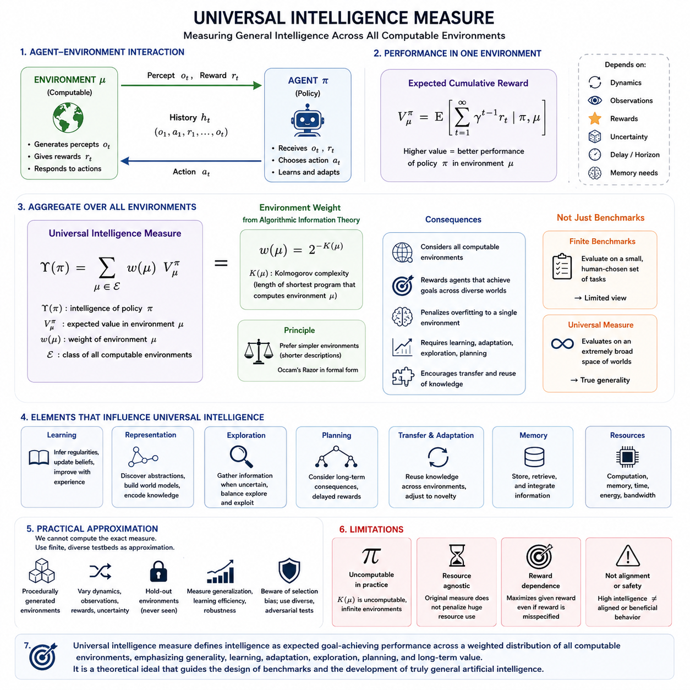{width="7.268055555555556in" height="7.268055555555556in"}

보편적 지능 척도(Universal Intelligence Measure)는 겉보기에는 단순하지만 실제로는 매우 어려운 질문에 답하려 합니다: 특정 작업이나 환경과 무관하게 에이전트(Agent)의 지능을 어떻게 정량화할 수 있는가? 전통적인 벤치마크(Benchmark)는 사전 정의된 문제에 대한 성능을 평가하지만, 일반 지능은 더 넓은 기준을 필요로 합니다. 따라서 핵심 아이디어는 하나의 전문화된 영역 내에서의 역량을 측정하는 것이 아니라, 다양한 환경들의 집합 전반에서 에이전트가 목표를 얼마나 성공적으로 달성하는지를 평가하는 것입니다.

대표적인 형식화는 셰인 렉(Shane Legg)과 마커스 후터(Marcus Hutter)가 개발한 보편적 지능 척도입니다. 이는 강화학습(Reinforcement Learning), 알고리즘 정보 이론(Algorithmic Information Theory), 그리고 AIXI와 관련된 보편적 에이전트(Universal Agent) 관점을 바탕으로 합니다. 지능은 광범위한 환경 전반에서 목표를 달성하는 에이전트의 능력으로 해석됩니다. 이 정의는 일반성(Generality)을 의도적으로 강조합니다: 에이전트는 이미 이해하고 있는 환경뿐만 아니라 낯설고 계산 가능한(Computable) 환경 전반에서도 효과적으로 작동해야 합니다.

상호작용 틀은 에이전트 (\\pi)와 환경 (\\mu)로 구성됩니다. 각각의 상호작용 주기 동안, 에이전트는 관찰(Observation)과 보상을 받고 자신의 정책(Policy)에 따라 행동을 선택합니다. 환경은 그러한 행동에 반응하여 이후의 지각(Percept)을 만들어냅니다. 성능은 에이전트가 얻는 기대 누적 보상을 통해 요약되며, 개념적으로 (V_\\mu\^\\pi)로 표현됩니다. 값이 높을수록 정책이 환경 (\\mu) 내에서 더 큰 기대 유틸리티(Utility)를 달성한다는 것을 나타냅니다.

단 하나의 환경에서만 (V_\\mu\^\\pi)를 평가하는 것은 명백히 일반 지능을 측정할 수 없습니다. 에이전트는 전이 가능한 능력을 거의 갖지 않으면서도 그 특정 환경에 특화되어 최적화될 수 있습니다. 따라서 보편적 지능은 여러 환경들의 부류(Class)에 걸쳐 성능을 집계합니다. 그 결과로 나오는 척도는 (\\Upsilon(\\pi)=\\sum_{\\mu}w(\\mu)V_\\mu\^\\pi)라는 개념적 형태를 가지며, 여기서 (w(\\mu))는 각 환경이 전체 지능 점수에 얼마나 강하게 기여하는지를 명시합니다.

핵심적인 질문은 환경적 가중치를 어떻게 선택해야 하는가입니다. 만약 모든 가능한 환경을 동등하게 취급한다면, 그 결과로 나오는 분포는 정의하기 어려워지고 매우 복잡한 세계에 과도한 중요성을 부여할 수 있습니다. 알고리즘 정보 이론은 기술 길이(Description Length)에 기반한 대안을 제공합니다. 더 짧은 프로그램으로 기술될 수 있는 환경은 더 큰 사전(Prior) 가중치를 받는 반면, 점점 더 복잡해지는 환경은 점차 더 작은 가중치를 받습니다.

콜모고로프 복잡도(Kolmogorov Complexity) (K(\\mu))를 사용하면, 가중치는 근사적으로 (w(\\mu)=2\^{-K(\\mu)})로 표현될 수 있습니다. 따라서 보편적 지능 척도는 그 특징적인 형태로 (\\Upsilon(\\pi)=\\sum_{\\mu\\in E}2\^{-K(\\mu)}V_\\mu\^\\pi)로 쓸 수 있습니다. 여기서 (E)는 적절한 계산 가능한 환경들의 부류를 나타냅니다. 결과적으로 지능은 환경의 알고리즘적 단순성에 따라 가중된 여러 환경들에 걸친 목표 달성 성능의 기댓값으로 해석됩니다.

이러한 가중치 부여는 오컴의 면도날(Occam\'s Razor)의 형식적인 버전을 구현합니다. 단순한 환경이 반드시 쉬운 환경인 것은 아니며, 오히려 상대적으로 간결한 알고리즘적 기술을 가지고 있는 환경입니다. 간결하지만 어려운 물리적 또는 수학적 법칙에 의해 지배되는 세계는 낮은 기술 복잡도를 가지면서도 여전히 어려운 의사결정 문제를 제시할 수 있습니다. 따라서 이러한 가중치 부여는 단순히 에이전트가 풀기 쉬운 환경에 더 큰 중요성을 부여하는 것이 아니라 구조적 단순성을 선호합니다.

이 척도는 또한 일반 지능이 축적된 벤치마크 성능과 근본적으로 왜 다른지를 드러냅니다. 벤치마크 모음은 인간 설계자가 선택한 환경의 유한한 샘플만을 나타냅니다. 이와 달리 보편적 지능은 극도로 광범위한 계산 가능한 세계들의 공간에 걸친 성능을 상상합니다. 만약 그 지식이 다른 환경 전반에서 효과적인 행동을 뒷받침하지 못한다면, 에이전트는 단순히 고정된 테스트 모음에 대한 답을 기억하는 것만으로는 높은 이론적 점수를 얻을 수 없습니다.

환경이 사전에 알려져 있다고 가정되지 않기 때문에 학습은 핵심적인 요소가 됩니다. 일반적으로 지능적인 에이전트는 상호작용으로부터 유용한 규칙성을 추론하고, 자신의 믿음을 갱신하며, 어떤 행동이 결과에 영향을 미치는지를 발견하고, 경험을 이용해 자신의 정책을 개선해야 합니다. 따라서 불완전한 지식으로 시작하지만 효율적으로 학습하는 에이전트는 고도로 전문화된 초기 역량을 갖춘 경직된 시스템보다 더 나은 성과를 낼 수 있습니다. 이 틀에서의 지능은 에이전트가 무엇을 할 수 있는가와 새로운 능력을 얼마나 효과적으로 습득할 수 있는가를 모두 관련시킵니다.

이러한 공식화는 자연스럽게 적응(Adaptation)과 전이(Transfer)를 포함합니다. 환경들이 서로 다르기 때문에, 하나의 설정에서 얻은 지식이 다른 설정에서도 유용할 수도 있고 그렇지 않을 수도 있습니다. 일반 지능은 재사용 가능한 구조를 식별하고 이전의 가정이 더 이상 적용되지 않을 때 신속하게 조정할 수 있는 메커니즘을 선호합니다. 표현 학습(Representation Learning), 추상화(Abstraction), 인과적 추론, 메타학습(Meta-learning), 기억, 세계 모델링(World Modeling)은 모두 경험이 더 넓은 부류의 환경 전반에서 성능을 개선할 수 있도록 함으로써 간접적으로 기여할 수 있습니다.

탐색(Exploration)은 또 다른 필수적인 구성요소입니다. 환경 동역학이 불확실할 때, 에이전트는 더 나은 미래의 결정을 가능하게 하는 정보를 얻기 위해 즉각적인 보상을 희생해야 할 수도 있습니다. 항상 현재의 지식을 활용(Exploit)하는 시스템은 낯선 환경에서 저조한 성능을 보일 수 있습니다. 따라서 보편적 지능은 정보 수집이 장기적인 가치를 향상시킬 때마다 효과적인 탐색 전략에 암묵적으로 보상을 주며, 이는 지능 측정을 불확실성 하의 순차적 의사결정과 연결시킵니다.

계획 능력(Planning Ability) 또한 일부 환경이 지연된 결과를 포함하기 때문에 척도에 영향을 미칩니다. 어떤 행동은 즉각적인 보상은 거의 제공하지 않으면서 나중에 훨씬 더 큰 보상을 가능하게 할 수 있습니다. 따라서 단기적인 반응에 제한된 에이전트는 장기 시야(Long-horizon)의 추론을 필요로 하는 환경에서 실패할 수 있습니다. 기대 누적 보상은 결과의 순서를 평가함으로써 이러한 시간적 구조를 포착하지만, 서로 다른 환경을 비교할 때는 정확한 보상 시야와 정규화(Normalization) 가정이 신중하게 정의되어야 합니다.

보편적 지능 틀의 중요한 특징은 특정한 내부 아키텍처(Architecture)를 규정하기보다 행동을 평가한다는 것입니다. 에이전트는 이론적으로 기호적 추론, 신경망, 확률적 추론, 진화적 계산(Evolutionary Computation), 기억 시스템, 탐색(Search), 또는 여러 메커니즘의 조합을 사용할 수 있습니다. 중요한 것은 여러 환경에 걸쳐 가치를 얻는 결과적인 능력입니다. 따라서 이 척도는 지능의 정의를 지능적인 시스템을 구축하는 데 사용되는 엔지니어링 방법으로부터 분리합니다.

그럼에도 불구하고, 이 이론적 척도는 직접 계산 가능하지 않습니다. 콜모고로프 복잡도는 일반적으로 정확하게 계산될 수 없으며, 계산 가능한 환경들의 공간은 실용적인 시스템에서 완전하게 열거되고 평가될 수 없습니다. 이 거대한 환경 부류 전반에서 에이전트의 기대 성능을 결정하는 것 자체가 계산적으로 불가능합니다. 따라서 보편적 지능은 실용적인 AGI 벤치마크가 아니라 주로 이론적 정의이자 참조 틀로 이해되어야 합니다.

실용적인 근사는 무한한 환경 공간을 생성되거나 선택된 유한한 환경들의 모음으로 대체합니다. 작업은 동역학, 관찰 구조, 보상 규칙, 필요한 기억, 계획 깊이, 불확실성의 정도에서 다를 수 있습니다. 이러한 속성들을 체계적으로 변화시킴으로써, 연구자들은 에이전트가 하나의 벤치마크의 규칙성을 단순히 활용하는 것이 아니라 폭넓게 학습하는지를 평가할 수 있습니다. 이러한 테스트들은 형식적인 척도 자체를 계산한다고 주장하지 않으면서 보편적 지능의 측면들을 근사합니다.

환경 생성(Environment Generation)은 절차적(Procedural) 시스템이 관련되어 있지만 이전에는 보지 못한 여러 작업들을 만들어낼 수 있기 때문에 특히 매력적입니다. 평가 환경이 학습 중에 숨겨져 있다면, 성공적인 성능은 일반화에 대한 더 강력한 증거를 제공합니다. 난이도는 상태 공간(State-space) 크기, 부분 관찰 가능성, 확률성(Stochasticity), 지연된 보상, 조합적 구조, 또는 필요한 상호작용 길이를 변경함으로써도 조정될 수 있습니다. 이는 지능 평가를 정적인 테스트에서 적응적인 문제들의 분포로 변환시킵니다.

그러나 어떤 실용적인 근사이든 선택 편향(Selection Bias)을 도입합니다. 설계자는 환경 생성기, 이용 가능한 행동, 관찰 모달리티(Modality), 보상 구조, 복잡도 범위를 선택합니다. 그러한 선택에 잘 맞는 에이전트는 실제보다 더 일반적으로 보일 수 있습니다. 결과적으로, 어떤 유한한 벤치마크도 수학적 의미에서의 보편적 지능을 확립할 수 없습니다. 더 강력한 결론을 위해서는 벤치마크의 다양성, 유보된(Held-out) 환경, 적대적(Adversarial) 변형, 평가 가정에 대한 명시적인 분석이 필요합니다.

보편적 지능 척도는 또한 지능과 자원 간의 관계를 드러냅니다. 그 이상화된 형태는 주로 달성된 가치에 초점을 맞추며, 에이전트가 엄청난 계산을 필요로 한다고 해서 자동으로 벌점을 부과하지는 않습니다. 그러나 엔지니어링의 맥락에서는, 각 결정마다 무제한의 메모리나 수 세기에 걸친 계산을 필요로 하는 AGI는 실용적인 지능이 거의 없을 것입니다. 따라서 자원을 고려한 평가는 샘플 효율성, 계산 비용, 지연 시간(Latency), 메모리, 에너지, 통신 요구사항을 포함할 수 있습니다.

이는 이론적 지능(Theoretical Intelligence)과 실용적 지능(Practical Intelligence) 간의 유용한 구별로 이어집니다. 이론적 척도는 에이전트가 여러 환경에 걸쳐 어떤 성능을 달성할 수 있는지를 묻는 반면, 실용적 척도는 그러한 성능이 제한된 자원 하에서 얼마나 효율적으로 얻어지는지를 고려해야 합니다. 유사한 작업 성공을 보이는 두 에이전트라도 하나가 수백만 번의 상호작용을 필요로 하고 다른 하나가 몇 개의 예시로부터 적응한다면 크게 다를 수 있습니다. 따라서 학습 효율성은 실제 세계의 일반 지능에서 중요한 차원입니다.

보상 명세(Reward Specification)는 또 다른 한계를 도입합니다. 이 척도는 환경적 보상이 성공적인 목표 달성을 의미 있게 나타낸다고 가정합니다. 그러나 역량 있는 에이전트는 의도되지 않은 방식으로 행동하면서도 잘못 명시된 보상을 최대화할 수 있습니다. 따라서 측정된 지능이 높다는 것이 정렬(Alignment), 안전성, 도덕성, 또는 유익한 행동을 함축하지는 않습니다. 지능 측정은 최적화 능력을 평가하는 반면, 정렬은 최적화되고 있는 목적함수가 의도된 인간의 가치와 제약에 부합하는지와 관련됩니다.

현대의 AGI 연구에 있어 보편적 지능 측정이 갖는 지속적인 중요성은 수치적인 것이 아니라 개념적인 것입니다. 이는 연구자들이 고립된 벤치마크 점수를 넘어서서 역량의 폭넓음, 새로움에 대한 적응, 학습 효율성, 불확실성, 전이, 탐색, 장기 시야의 목표 달성을 고려하도록 격려합니다. 이러한 차원들은 단일한 언어, 시각, 추론, 로보틱스(Robotics), 또는 게임 벤치마크에 대한 성능보다 일반 지능에 대한 더 유익한 그림을 제공합니다.

보편적 지능 측정은 궁극적으로 형식적인 AGI 이론과 경험적 평가 사이의 교량을 제공합니다. 이는 정확한 보편적 평가가 계산적으로 접근 불가능하다는 것을 인정하면서, 지능을 환경들의 가중된 분포 전반에서의 성공적인 목표 지향적 행동으로 정의합니다. 따라서 이 틀은 실용적인 벤치마크 시스템이 일반화, 적응, 학습 효율성, 견고성(Robustness), 계획, 그리고 점점 더 일반화되는 자율적 행동을 측정하기 위한 원리들을 도출할 수 있는 이상화된 목표로서 기능합니다.

## 02.03. Computability and Limits

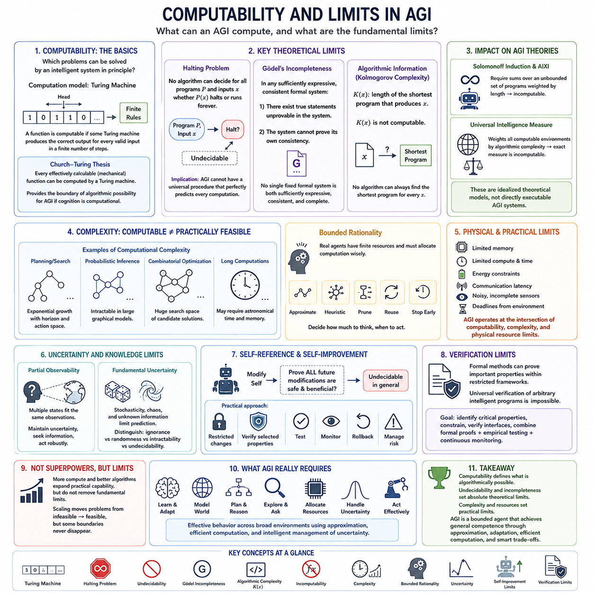{width="7.268055555555556in" height="7.268055555555556in"}

계산 가능성(computability)은 지능형 시스템(intelligent system)이 원칙적으로 어떤 문제를 해결할 수 있는지를 질문하기 위한 수학적 언어를 제공한다. AGI 이론에서 이러한 구분은 매우 중요하다. 무제한적인 지능이 무제한적인 문제 해결 가능성을 의미하지 않기 때문이다. 어떤 과제는 충분한 시간과 메모리가 주어지면 알고리즘(algorithm)으로 해결할 수 있지만, 어떤 과제에는 일반적인 해결 알고리즘 자체가 존재하지 않는다. 이러한 범주 사이의 경계는 더 큰 모델, 더 빠른 프로세서, 더 많은 학습 데이터만으로는 극복할 수 없는 근본적인 한계를 설정한다.

계산 가능성을 설명하는 고전적인 추상화(classical abstraction)는 튜링 머신(Turing machine)으로, 기호적 메모리(symbolic memory)에 대해 유한한 규칙 집합을 적용하는 계산 과정을 표현한다. 어떤 함수가 계산 가능(computable)하다고 간주되려면, 특정 튜링 머신이 모든 유효한 입력에 대해 유한한 계산 단계 이후 올바른 출력을 생성할 수 있어야 한다. 현대의 컴퓨터, 디지털 하드웨어에서 실행되는 신경망(neural network), 일반적인 AI 알고리즘은 실제 아키텍처가 크게 다르더라도 이러한 일반적인 계산 프레임워크 안에서 해석할 수 있다.

처치-튜링 논제(Church--Turing thesis)는 기계적인 절차(mechanical procedure)를 통해 효과적으로 계산할 수 있는 모든 함수는 튜링 머신으로 계산할 수 있다고 주장한다. 이는 물리적 현실에 관한 수학적 정리라기보다 직관적인 알고리즘 계산(algorithmic computation)과 형식적인 계산 가능성을 연결하는 기본적인 가설이다. AGI에서는 유용한 기준 경계를 제공한다. 즉, 인지가 이러한 의미에서 계산적이라면 인공 에이전트는 효과적 계산(effective computation)의 한계를 넘어서는 문제를 체계적으로 해결할 수 없다.

계산 가능하다는 것이 효율적으로 계산 가능(efficiently computable)하다는 것을 의미하지는 않는다. 어떤 알고리즘은 반드시 종료된다고 보장되더라도 입력 크기가 증가함에 따라 천문학적인 연산량을 요구할 수 있다. 이러한 차이가 계산 가능성 이론(computability theory)과 계산 복잡도 이론(computational complexity theory)을 구분한다. 계산 가능성은 해결 알고리즘 자체가 존재하는지를 묻는 반면, 복잡도는 알고리즘을 실행하기 위해 얼마나 많은 시간, 메모리, 통신 또는 기타 자원이 필요한지를 묻는다. AGI 시스템은 복잡한 환경에서 추론하고 행동할 때 이 두 가지 한계에 동시에 직면한다.

정지 문제(halting problem)는 계산의 가장 중요한 한계 중 하나를 보여준다. 임의의 프로그램과 입력이 주어졌을 때 그 프로그램이 결국 종료되는지 아니면 영원히 계속 실행되는지를 모든 경우에 판단하는 알고리즘이 필요하다고 가정해 보자. 앨런 튜링(Alan Turing)은 모든 가능한 프로그램에 대해 이 질문에 정확하게 답할 수 있는 일반 알고리즘이 존재하지 않는다는 것을 증명했다. 이 결과는 결정 불가능성(undecidability)을 확립하며, 정확하게 정의된 일부 계산 문제는 어떠한 알고리즘으로도 보편적으로 해결할 수 없음을 의미한다.

결정 불가능성은 AGI가 프로그램, 계획(plan), 다른 에이전트 또는 자기 자신의 변경에 대해 추론할 수 있다는 점에서 일반지능에 중요한 의미를 가진다. AGI는 가능한 모든 계산을 실행하기 전에 그 결과를 예측할 수 있는 보편적으로 정확한 절차를 가질 수 없다. 미래의 계산 행동에 관한 특정 질문은 지능 수준과 관계없이 결정 불가능한 상태로 남는다. 매우 높은 능력을 가진 에이전트는 증명(proof), 근사(approximation), 시뮬레이션(simulation), 제한(restriction), 휴리스틱(heuristic)을 사용할 수 있지만, 어떠한 방법도 일반적인 정지 문제를 계산 가능한 문제로 바꿀 수는 없다.

이와 관련된 또 다른 한계는 괴델의 불완전성 정리(Gödel\'s incompleteness theorems)에서 나타난다. 산술을 표현할 수 있을 정도로 충분히 표현력이 높고 일관적인 형식 체계(formal system)에는 그 체계 자체 안에서는 증명할 수 없는 참인 명제가 존재한다. 또한 그러한 체계는 일반적으로 내부의 자원만을 이용하여 자기 자신의 일관성(consistency)을 증명할 수 없다. 이러한 결과가 지능적인 추론 자체가 불가능하다는 것을 의미하지는 않지만, 충분히 강력한 하나의 고정된 형식 체계가 그 언어로 표현할 수 있는 모든 수학적 진리에 대해 완전한 증명 메커니즘을 제공할 수 없다는 것을 보여준다.

이러한 구분은 AGI를 완벽한 정리 증명기(theorem prover) 또는 범용 추론기(universal reasoner)로 상상할 때 중요하다. 추론 능력을 향상시키면 해결 가능한 문제의 범위를 확장할 수 있지만, 그렇다고 해서 충분한 표현력, 일관성, 효과적인 공리화(effective axiomatization), 완전성(completeness)을 동시에 갖춘 형식 체계가 자동으로 만들어지는 것은 아니다. 지능형 시스템은 공리(axiom)를 확장하거나 새로운 표현을 채택하거나 여러 추론 체계를 사용할 수 있지만, 충분히 강력한 각각의 형식적 프레임워크는 이에 상응하는 논리적 한계에 직면한다.

알고리즘 정보이론(algorithmic information theory)은 콜모고로프 복잡도(Kolmogorov complexity)를 통해 또 다른 근본적인 경계를 제시한다. 객체 (x)의 복잡도 (K(x))는 범용 계산 기계(universal computing machine)에서 해당 객체를 생성하는 가장 짧은 프로그램의 길이로 정의된다. 이러한 정의는 단순성(simplicity)을 설명하는 강력한 형식적 개념을 제공하지만, 일반적으로 (K(x))를 정확하게 계산하는 것은 불가능하다. 임의의 모든 객체에 대해 항상 가장 짧은 프로그램을 찾아낼 수 있는 범용 알고리즘은 존재하지 않는다.

이러한 한계는 솔로모노프 귀납(Solomonoff induction)과 AIXI 같은 이론적 모델에 직접적인 영향을 준다. 솔로모노프 귀납은 기술 길이(description length)에 따라 가중된 프로그램을 이용하여 확률을 부여하고, AIXI는 범용 예측(universal prediction)과 순차적 의사결정(sequential decision making)을 결합한다. 이를 정확하게 구현하려면 무한하게 확장될 수 있는 프로그램 공간과 알고리즘 복잡도와 관련된 수량을 계산해야 한다. 따라서 이들의 이론적 범용성(universality)은 계산 불가능성(incomputability)을 동반하며, 직접 실행할 수 있는 AGI 아키텍처라기보다 이상화된 기준 모델(idealized reference model)이 된다.

범용 지능 척도(universal intelligence measure) 역시 비슷한 문제에 직면한다. 모든 계산 가능한 환경에 알고리즘 복잡도에 따른 가중치를 부여하는 것은 지능에 대한 우아한 이론적 정의를 제공하지만, 정확한 콜모고로프 복잡도는 계산할 수 없으며 전체 환경 클래스(environment class)를 현실적으로 열거할 수도 없다. 따라서 형식적으로 범용적인 지능 척도를 일반적인 벤치마크처럼 단순하게 실행할 수는 없다. 실제 평가는 다양한 환경과 과제로 구성된 유한한 집합을 통해 범용성을 근사해야 한다.

문제가 계산 가능하더라도 복잡도 때문에 정확한 해법에 현실적으로 접근하지 못할 수 있다. 긴 시간 지평(time horizon)에 걸쳐 가능한 모든 계획을 탐색하면 행동 수와 시간 단계가 증가함에 따라 탐색 공간이 지수적으로 증가할 수 있다. 대규모 그래프 모델(graphical model)의 정확한 확률적 추론(probabilistic inference)은 계산 불가능할 정도로 복잡해질 수 있으며, 조합 최적화(combinatorial optimization)는 엄청난 수의 후보 공간을 탐색해야 할 수 있다. 따라서 이론적인 해결 가능성은 필요한 계산량이 사용 가능한 시간, 메모리, 에너지 또는 물리적 수명을 초과한다면 현실적인 의미가 거의 없다.

이는 자연스럽게 제한된 합리성(bounded rationality)으로 이어진다. 실제 지능형 에이전트는 유한한 자원 아래에서 작동하며 어떤 문제를 해결할 것인지뿐만 아니라 문제 해결에 얼마나 많은 계산을 사용할 것인지도 결정해야 한다. 에이전트는 탐색을 조기에 종료하거나 확률을 근사하고, 표현(representation)을 압축하며, 이전의 해법을 재사용하고, 가능성이 낮은 대안을 가지치기(pruning)하거나 휴리스틱을 선택할 수 있다. 따라서 지능에는 계산 자원 할당(computational resource allocation), 즉 언제 더 깊은 추론이 가치가 있으며 언제 근사적인 답으로 충분한지를 판단하는 능력도 포함된다.

따라서 근사(approximation)는 단순한 공학적 타협이 아니라 실용적 지능(practical intelligence)의 핵심적인 특성이다. 신경망은 복잡한 함수를 근사하고, 샘플링(sampling)은 확률분포를 근사하며, 휴리스틱 탐색(heuristic search)은 완전 탐색(exhaustive planning)을 근사하고, 학습된 월드 모델(world model)은 환경 동역학(environmental dynamics)을 근사한다. 이러한 방법들은 계산 가능성을 확보하기 위해 정확성에 대한 보장을 일부 희생한다. 높은 능력을 가진 AGI는 이러한 근사 오차(approximation error)를 관리하고 불확실성이 신뢰할 수 있는 행동을 수행하기에 지나치게 커지는 시점을 인식해야 한다.

물리적인 AGI(physical AGI)는 추상적인 계산 가능성을 넘어서는 한계에도 직면한다. 메모리는 유한하고 프로세서에는 제한된 처리량(throughput)이 있으며, 통신에는 지연시간(latency)이 발생하고, 센서는 불완전하고 잡음이 포함된 정보를 제공하며, 에너지는 지속적인 계산을 제한한다. 또한 환경이 의사결정의 마감시간을 결정하는 경우도 많다. 장애물에 접근하는 로봇은 최적 행동을 증명하기 위해 무제한의 시간을 사용할 수 없다. 따라서 현실의 지능은 수학적 계산 가능성, 계산 복잡도, 물리적 자원 제약(physical resource constraints)이 교차하는 영역에서 작동한다.

부분 관측 가능성(partial observability)은 계산 불가능성과 혼동해서는 안 되는 또 다른 형태의 한계를 만든다. 관련 상태(state)를 알고 있다면 에이전트가 계산적으로 의사결정 문제를 해결할 수 있더라도, 해당 상태를 유일하게 결정할 수 있는 충분한 정보가 없을 수 있다. 동일한 관측과 일치하는 여러 환경 설명이 동시에 존재할 수도 있다. 이러한 상황에서 지능은 모든 질문에 유일하게 복원 가능한 답이 있다고 가정하는 대신 불확실성을 유지하고, 추가 정보를 탐색하며, 강건한 의사결정(robust decision making)을 수행해야 한다.

예측(prediction) 역시 근본적인 불확실성에 직면한다. 일부 시스템은 확률적(stochastic)이고, 일부는 혼돈적(chaotic)이며, 일부는 에이전트가 이용할 수 없는 정보에 의존한다. 결정론적 환경(deterministic environment)이라도 초기 조건의 작은 불확실성이 빠르게 증폭된다면 현실적으로 예측이 불가능해질 수 있다. 따라서 AGI는 제한된 지식에서 발생하는 불확실성과 무작위성(randomness), 계산적 난해성(computational intractability), 형식적 결정 불가능성을 구분해야 한다. 이러한 한계들은 서로 다른 대응 방법을 필요로 하며 하나의 일반적인 불확실성 처리 전략으로 해결할 수 없다.

자기참조(self-reference)는 자기개선 AGI(self-improving AGI)에서 계산적 한계를 특히 중요하게 만든다. 자신의 소프트웨어를 변경할 수 있는 에이전트는 모든 변경이 원하는 속성을 유지하면서 성능을 향상시킨다는 것을 증명하고 싶을 수 있다. 그러나 충분한 표현력을 가진 시스템에서는 임의의 자기변경(self-modification)에 대한 완전한 보장을 얻는 과정이 결정 불가능성과 불완전성의 한계에 직면할 수 있다. 따라서 현실적인 자기개선에는 제한된 변경 공간, 선택된 속성에 대한 검증(verification), 시험(testing), 모니터링(monitoring), 롤백(rollback) 메커니즘, 확률적 위험 관리(probabilistic risk management)가 필요하다.

검증 자체에도 한계가 존재한다. 형식 방법(formal methods)은 시스템과 명세(specification)가 적절하게 제한된 프레임워크로 표현될 경우 중요한 속성을 증명할 수 있지만, 임의의 지능형 프로그램에 대한 범용 검증(universal verification)은 불가능하다. 따라서 현실적인 목표는 AGI에 관한 모든 것을 증명하는 것이 아니다. 대신 설계자는 중요한 속성을 식별하고, 분석할 수 있도록 구성요소를 충분히 제한하며, 검증 가능한 인터페이스(verifiable interface)를 구축하고, 형식적 보장과 경험적 시험(empirical testing)을 결합하며, 실제 작동 중에도 행동을 지속적으로 모니터링해야 한다.

이러한 한계는 초지능(superintelligence)에 대한 지나치게 단순한 생각에도 중요한 시사점을 제공한다. 더 많은 계산 자원과 더 우수한 알고리즘은 실질적인 능력을 크게 확장할 수 있지만 결정 불가능성이나 논리적 불완전성을 제거하지는 못한다. 인간보다 수백만 배 빠른 시스템이라고 하더라도 존재하지 않는 정지 문제의 범용 해법을 구현할 수는 없다. 능력 확장(capability scaling)은 많은 문제를 현실적으로 해결 불가능한 영역에서 해결 가능한 영역으로 이동시킬 수 있지만, 일부 이론적인 경계는 규모가 아무리 커져도 변하지 않는다.

동시에 이러한 이론적 한계를 AGI가 불가능하다는 증거로 해석해서는 안 된다. 인간 역시 유한한 메모리, 불완전한 정보, 제한된 계산 능력, 불확실한 지식, 불완전한 추론 능력을 가지고 작동한다. 일반지능은 가능한 모든 문제를 해결할 것을 요구하지 않는다. 중요한 것은 광범위하고 의미 있는 환경 클래스에서 효과적으로 행동하면서 불확실성을 인식하고, 자원을 배분하며, 경험으로부터 학습하고, 정확한 해법을 구할 수 없을 때 유용한 근사를 찾아내는 것이다.

따라서 AGI의 공학적 목표는 계산적 전능성(computational omnipotence)이 아니라 제약조건 아래의 적응적 역량(adaptive competence under constraints)이다. 실제 시스템은 다루기 쉬운 하위 문제(tractable subproblem)를 식별하고, 환경의 구조를 활용하며, 유용한 추상화를 학습하고, 근사적인 월드 모델을 구성하며, 빠른 휴리스틱과 느린 숙고(deliberation)를 결합하고, 추가적인 계산이 그 비용을 정당화하기 어려운 시점을 판단해야 한다. 자원 인식 추론(resource-aware reasoning)은 아키텍처가 설계된 이후 외부에서 부과되는 제약이 아니라 지능 자체의 일부가 된다.

궁극적으로 계산 가능성과 그 한계(computability and limits)는 일반지능 이론의 경계 조건(boundary conditions)을 설정한다. 튜링 계산 가능성(Turing computability)은 알고리즘적으로 가능한 영역을 정의하고, 결정 불가능성은 범용 알고리즘이 존재하지 않는 문제를 식별하며, 불완전성(incompleteness)은 형식적 추론을 제한하고, 알고리즘 정보이론은 계산 불가능한 단순성 척도를 드러내며, 복잡도(complexity)는 현실적으로 실행 가능한 계산을 제한한다. 이러한 원리들은 AGI를 무제한적인 추론기가 아니라 근사, 적응, 효율적인 계산, 불확실성의 지능적 관리를 통해 일반적인 역량을 달성해야 하는 제한된 에이전트(bounded agent)로 이해하도록 만든다.

## 02.04. Complexity and Learning

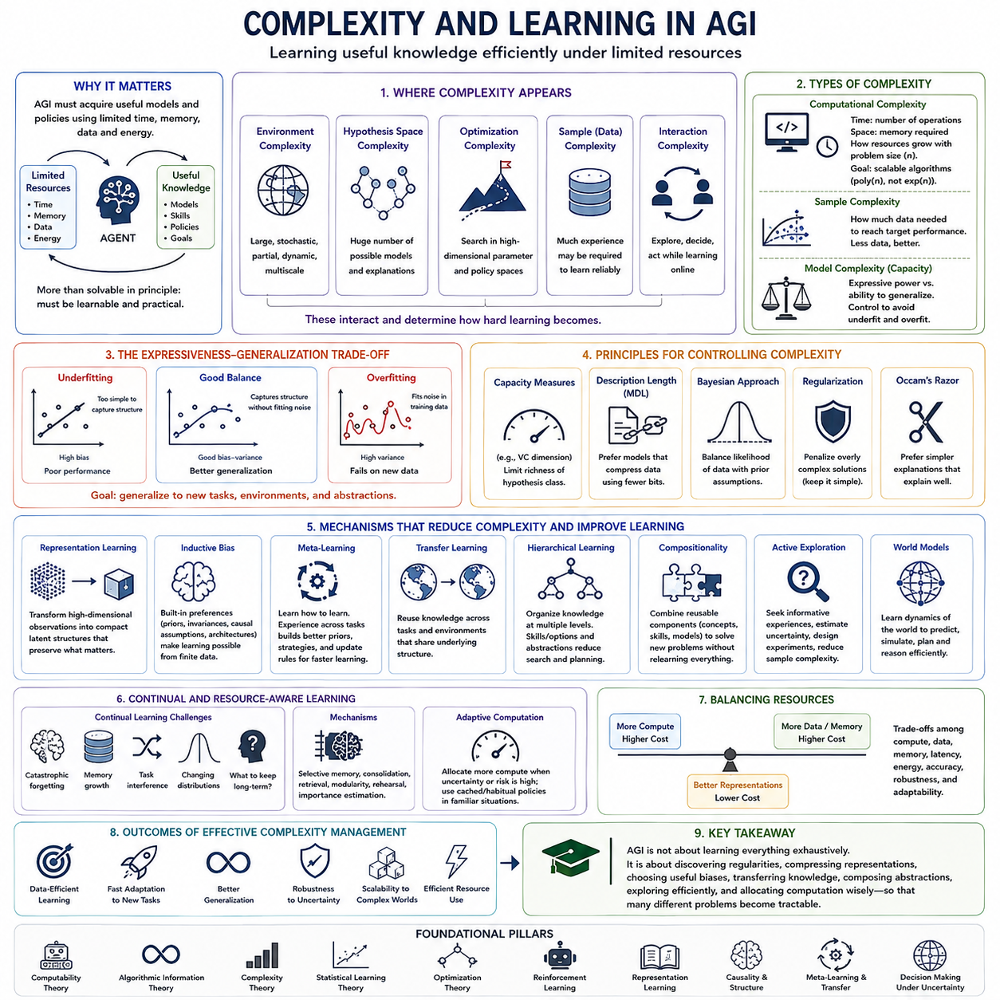{width="7.268055555555556in" height="7.268055555555556in"}

계산 복잡도(computational complexity)와 학습(learning)은 일반지능(general intelligence) 이론에서 서로 분리할 수 없는 관계에 있다. 에이전트(agent)는 제한된 시간, 메모리, 데이터, 에너지를 사용하여 유용한 지식을 습득해야 하기 때문이다. 어떤 학습 문제가 수학적으로 해결 가능하더라도 계산적으로는 현실성이 없을 수 있다. 따라서 AGI는 단순히 학습 알고리즘이 존재하는 것을 넘어 현실적인 환경에서 의사결정을 지원할 만큼 효율적으로 유용한 모델과 정책(policy)을 발견할 수 있는 메커니즘을 필요로 한다.

복잡도(complexity)는 학습의 여러 수준에서 나타난다. 환경 자체가 복잡한 구조를 포함할 수 있고, 가설 공간(hypothesis space)은 엄청난 수의 후보 모델을 포함할 수 있으며, 최적화(optimization)는 고차원 파라미터 공간(high-dimensional parameter space)을 탐색해야 할 수 있다. 또한 서로 경쟁하는 가설을 구분하는 데 필요한 경험의 양도 매우 클 수 있다. 따라서 지능을 이해하려면 계산 복잡도, 샘플 복잡도(sample complexity), 모델 복잡도(model complexity), 환경 복잡도(environmental complexity)를 함께 고려해야 한다.

계산 복잡도는 문제 크기가 증가함에 따라 알고리즘이 요구하는 자원이 어떻게 증가하는지를 설명한다. 시간 복잡도(time complexity)는 필요한 계산 연산의 수와 관련되고, 공간 복잡도(space complexity)는 메모리 요구량과 관련된다. 다항적으로 확장되는 알고리즘은 비용이 지수적으로 증가하는 알고리즘보다 훨씬 큰 문제에서도 현실적으로 사용할 수 있다. 일반지능에서는 가능한 상태(state), 행동(action), 관측(observation), 개념(concept), 관계의 수가 매우 커질 수 있기 때문에 확장 가능한 학습(scalable learning)이 중요하다.

샘플 복잡도는 다른 질문을 다룬다. 학습자가 원하는 수준의 성능을 달성하기 전에 얼마나 많은 경험이 필요한가라는 문제이다. 어떤 알고리즘은 계산적으로 효율적이지만 수백만 개의 라벨링된 사례나 상호작용을 요구할 수 있다. 반대로 계산 비용이 높은 학습자가 상대적으로 적은 데이터에서 유용한 구조를 발견할 수도 있다. 실제 에이전트가 접하는 과제에서는 데이터 획득 자체가 비싸거나 느리거나 위험하거나 물리적으로 제한될 수 있기 때문에 일반지능은 이러한 차원 사이의 균형을 필요로 한다.

통계적 학습 이론(statistical learning theory)은 가설 클래스(hypothesis class)의 복잡도와 유한한 관측으로부터 일반화(generalization)할 수 있는 능력 사이의 관계를 형식화한다. 표현력이 매우 높은 모델은 다양한 함수를 표현할 수 있지만 지나친 유연성은 학습 데이터의 우연한 패턴까지 학습하게 만들 수 있다. 반대로 제한된 모델은 적은 데이터에서도 더 잘 일반화할 수 있지만 실제 기반 구조를 표현하지 못할 수 있다. 따라서 학습은 표현력(expressive power)과 신뢰할 수 있는 일반화 사이의 근본적인 균형을 관리하는 과정이다.

이러한 균형은 과소적합(underfitting)과 과적합(overfitting) 문제와 밀접하게 관련된다. 과소적합은 모델의 능력이 너무 제한되어 중요한 규칙성을 포착하지 못할 때 발생하고, 과적합은 특정 학습 사례에 지나치게 강하게 적응하여 새로운 상황에서 실패할 때 발생한다. 일반지능에서는 하나의 고정된 분포 내에서 일반화하는 것뿐만 아니라 변화하는 과제, 환경, 추상화 수준(abstraction level) 사이에서도 유용하게 전이해야 하므로 더욱 어려운 형태의 균형이 요구된다.

모델 복잡도는 여러 이론적 프레임워크(theoretical framework)를 통해 해석할 수 있다. VC 차원(VC dimension)과 같은 용량 척도(capacity measure)는 특정 가설 클래스의 풍부함을 나타내며, 기술 길이(description length) 기반 접근법은 모델이 데이터를 얼마나 간결하게 설명하는지를 평가한다. 베이지안 방법(Bayesian method)은 가능도(likelihood)와 사전 가정(prior assumption) 사이의 균형을 조절하고, 정규화(regularization)는 불필요하게 복잡한 해법을 억제한다. 수학적으로는 서로 다르지만 이들은 모두 표현 능력을 무제한으로 증가시키는 대신 복잡도를 적절하게 제어해야 성공적인 학습이 가능하다는 공통된 원리를 가진다.

최소 기술 길이 원리(minimum description length principle)는 복잡도와 학습의 관계를 특히 직관적으로 보여준다. 좋은 모델은 반복되는 구조를 포착함으로써 관측을 압축할 수 있어야 한다. 모델이 지나치게 단순하면 데이터를 설명할 수 없고, 지나치게 복잡하면 개별 관측을 그대로 기록하는 것에 불과할 수 있다. 따라서 학습은 정확한 예측과 효과적인 행동에 필요한 정보를 유지하면서 경험을 간결하게 기술할 수 있는 표현(representation)을 발견하는 과정으로 해석할 수 있다.

이러한 개념은 학습을 알고리즘 정보이론(algorithmic information theory)과 연결한다. 콜모고로프 복잡도(Kolmogorov complexity)는 객체를 생성하는 가장 짧은 프로그램의 길이를 통해 복잡도를 정의하며, 솔로모노프 귀납(Solomonoff induction)은 더 단순한 계산 가능한 설명에 더 높은 사전 가중치(prior weight)를 부여한다. 이러한 수량의 정확한 형태는 계산할 수 없지만, 그 개념적 교훈은 중요하다. 지능적인 학습은 모든 관측을 독립적으로 암기하기보다 광범위한 규칙성을 경제적으로 포착하는 설명을 선호해야 한다.

그러나 압축(compression)만으로는 지능형 에이전트에 충분하지 않다. 표현은 미래의 예측(prediction), 추론(reasoning), 제어(control)에 필요한 정보를 보존해야 한다. 에이전트는 자신의 목표에 거의 영향을 미치지 않는 시각적으로 복잡한 세부사항은 버리는 반면, 객체, 움직임, 인과성(causality), 위험을 설명하는 간결한 잠재 변수(latent variable)는 유지할 수 있다. 따라서 효과적인 표현학습(representation learning)은 고차원 관측을 이후의 학습과 계획을 더 쉽게 만드는 구조로 변환하여 계산 부담을 감소시킨다.

차원의 저주(curse of dimensionality)는 이러한 표현이 필요한 이유를 보여준다. 독립적인 차원의 수가 증가하면 가능한 상태 공간(state space)의 크기는 지수적으로 증가할 수 있다. 모든 구성을 빠짐없이 관측하거나 평가하는 것은 곧 불가능해진다. 지능형 시스템이 이러한 어려움을 극복할 수 있는 이유는 실제 환경에 지역성(locality), 계층성(hierarchy), 대칭성(symmetry), 희소성(sparsity), 조합성(compositionality), 시간적 연속성(temporal continuity), 반복 패턴과 같이 거대한 공간을 간결하게 표현할 수 있도록 하는 활용 가능한 구조가 존재하기 때문이다.

귀납적 편향(inductive bias)은 가능한 모든 증거를 관찰하기 전에 학습자가 특정 설명을 다른 설명보다 선호하도록 만드는 메커니즘이다. 귀납적 편향이 없다면 유한한 데이터에서 일반화하는 것은 불가능하다. 관측된 사례와 동일하게 일치하면서도 관측되지 않은 영역에서는 서로 다른 결과를 예측하는 무한히 많은 가설이 존재할 수 있기 때문이다. 신경망 아키텍처(neural architecture), 사전분포(prior), 불변성(invariance), 인과적 가정(causal assumption), 어텐션 메커니즘(attention mechanism), 표현 선택 모두 유효 탐색 공간을 줄이고 학습을 현실적으로 가능하게 하는 편향을 도입한다.

AGI의 과제는 귀납적 편향을 제거하는 것이 아니라 여러 영역에서 계속 유용한 편향을 개발하는 것이다. 지나치게 전문화된 가정은 좁은 환경에서 뛰어난 성능을 제공할 수 있지만 전이(transfer)를 제한할 수 있다. 반대로 지나치게 약한 가정은 이론적인 일반성을 제공할 수 있지만 현실적으로 감당하기 어려운 계산량과 데이터를 요구할 수 있다. 따라서 일반지능에는 에이전트가 새로운 문제 클래스를 접함에 따라 스스로 적응하거나 조합되거나 학습될 수 있는 유연한 귀납적 편향(flexible inductive bias)이 필요하다.

메타학습(meta-learning)은 여러 과제에서 얻은 경험을 이용하여 학습 과정 자체를 개선함으로써 이러한 요구에 대응한다. 에이전트는 모든 문제를 동일하게 정보가 없는 상태에서 시작하는 대신 미래의 학습을 더 빠르게 만드는 사전지식(prior), 표현, 전략(strategy), 갱신 규칙(update rule)을 습득할 수 있다. 이에 따라 복잡도 문제는 각각의 과제를 독립적으로 해결하는 것에서 여러 과제 사이에 존재하는 재사용 가능한 구조를 발견하는 것으로 이동한다. 이러한 학습 비용의 분산(amortization)은 확장 가능한 일반지능의 핵심 메커니즘이다.

전이학습(transfer learning)은 이와 관련된 또 다른 복잡도 감소 방법을 제공한다. 두 환경이 공통된 기반 구조를 가진다면 한 환경에서 습득한 지식을 이용하여 다른 환경에서 필요한 데이터와 계산량을 줄일 수 있다. 이전에 학습한 시각적 특징, 물리적 동역학(physical dynamics), 언어 개념, 인과 관계, 행동 기술(action skill)은 재사용 가능한 구성요소가 될 수 있다. 성공적인 전이는 새로운 탐색 문제의 크기를 효과적으로 감소시키는 반면, 부정적 전이(negative transfer)는 부적절한 사전지식이 학습을 잘못된 방향으로 제한할 때 발생한다.

계층적 학습(hierarchical learning)은 지식을 여러 추상화 수준으로 조직하여 복잡도를 더욱 줄인다. 에이전트는 모든 원시 행동(primitive action)을 직접 대상으로 계획하는 대신 재사용 가능한 기술(skill)이나 옵션(option)을 사용하여 추론할 수 있다. 또한 모든 감각 정보를 독립적으로 표현하는 대신 관측을 객체(object), 사건(event), 장면(scene), 개념으로 구성할 수 있다. 계층 구조는 실질적인 계획 지평(planning horizon)을 단축하고 탐색 공간을 줄여 이전에 학습된 모듈을 이용해 복잡한 행동을 구성할 수 있도록 한다.

조합성(compositionality)은 효율적인 일반화를 위한 또 다른 방법을 제공한다. 지식을 재사용 가능한 구성요소로 분해할 수 있다면 새로운 상황의 완전한 해법을 처음부터 다시 학습하지 않고 익숙한 요소들을 재조합하여 해결할 수 있다. 언어는 유한한 어휘와 문법 구조를 통해 엄청난 수의 의미 있는 표현을 생성한다는 점에서 이러한 원리를 잘 보여준다. AGI 역시 개념, 기술, 모델, 목표를 이전에 경험하지 못한 상황에서도 체계적으로 재조합할 수 있을 때 큰 이점을 얻는다.

학습 복잡도는 탐색(exploration)과도 상호작용한다. 에이전트는 가능한 모든 관측을 수집할 수 없으므로 어떤 경험이 유용한 정보를 제공하는지 결정해야 한다. 상태 공간이 커질수록 무작위 탐색(random exploration)은 점점 비효율적이 된다. 더 높은 능력을 가진 시스템은 불확실성을 추정하고, 새로운 상태를 탐색하며, 정보 가치가 높은 실험을 식별하거나 서로 경쟁하는 모델을 구분할 수 있는 행동을 선택한다. 능동학습(active learning)과 정보지향적 탐색(information-directed exploration)은 지식 또는 의사결정 품질을 가장 크게 향상시키는 경험에 집중함으로써 샘플 복잡도를 감소시킨다.

월드 모델(world model)은 재사용 가능한 환경 동역학(environmental dynamics)을 포착함으로써 학습과 계획의 복잡도를 동시에 감소시킬 수 있다. 모든 상황에 대해 별도의 대응 방법을 학습하는 대신 에이전트는 행동에 따라 상태가 어떻게 변화하는지를 학습하고, 그 모델을 이용하여 익숙하지 않은 결과를 예측할 수 있다. 간결한 월드 모델은 모든 가능성을 물리적으로 직접 경험하지 않고도 시뮬레이션, 반사실적 추론(counterfactual reasoning), 계획을 지원한다. 그 유용성은 예측 자체가 지나치게 비싸지 않으면서 관련 구조를 얼마나 잘 표현하는지에 달려 있다.

지속학습(continual learning)은 AGI가 처음부터 반복적으로 재학습하지 않고 장기간에 걸쳐 학습해야 한다는 점에서 추가적인 복잡성을 도입한다. 새로운 지식은 유용한 기존 지식을 유지하면서 통합되어야 한다. 치명적 망각(catastrophic forgetting), 메모리 증가, 과제 간 간섭(interference), 변화하는 환경 분포는 어려운 자원 할당 문제를 만든다. 따라서 효과적인 지속학습에는 선택적 메모리(selective memory), 통합(consolidation), 검색(retrieval), 모듈성(modularity), 어떤 정보를 장기간 보존할 가치가 있는지 결정하는 메커니즘이 필요하다.

자원 제약(resource limitation)은 이러한 문제를 순수한 이론적 문제가 아니라 실제 운용 문제로 만든다. 물리적 에이전트는 유한한 처리 능력을 가지므로 모든 학습 메커니즘을 항상 최대 강도로 실행할 수 없다. 관측이 예상과 크게 다르거나 불확실성이 증가하거나 위험도가 높아질 때 더 많은 계산 자원을 할당하고, 익숙한 상황에서는 캐시된 예측(cached prediction)과 습관화된 정책(habitual policy)을 활용할 수 있다. 따라서 적응적 계산(adaptive computation)은 평균적인 자원 소비를 줄이면서 비용을 정당화할 수 있는 상황에 더 깊은 추론 능력을 집중시킬 수 있다.

이러한 관점은 학습 효율성(learning efficiency) 자체를 지능의 구성요소로 다루어야 한다는 것을 보여준다. 두 에이전트가 궁극적으로 동일한 성능에 도달하더라도 필요한 사례 수, 계산량, 파라미터 갱신(parameter update), 물리적 상호작용의 수에서는 큰 차이를 보일 수 있다. 제한된 경험에서 재사용 가능한 구조를 발견하고 이를 효과적으로 전이하는 에이전트는 환경이 변화할 때마다 광범위한 재학습을 요구하는 에이전트보다 더 높은 실용적 일반성(practical generality)을 보여준다.

하나의 복잡도 척도만으로 학습을 완전히 설명할 수는 없다. 더 작은 모델이 더 많은 최적화 계산을 요구할 수 있고, 더 큰 모델이 경우에 따라 오히려 더 효율적으로 학습할 수도 있으며, 추가적인 계산을 통해 필요한 데이터의 양을 줄일 수도 있다. 메모리는 계산을 대신할 수 있고, 사전지식은 새로운 샘플을 대신할 수 있으며, 더 나은 표현은 데이터와 계산량을 동시에 줄일 수 있다. 따라서 AGI에는 모델 크기, 데이터, 계산량(compute), 지연시간(latency), 에너지, 메모리, 정확도(accuracy), 강건성(robustness), 적응성(adaptability) 사이의 다차원적인 절충 관계가 존재한다.

궁극적으로 복잡도와 학습(complexity and learning)은 일반지능을 위한 핵심적인 공학 원리를 정의한다. 가능한 경험과 행동으로 이루어진 거대한 공간을 관리 가능한 구조로 축소할 수 있을 때만 광범위한 능력을 현실적으로 구현할 수 있다. 지능은 규칙성을 발견하고, 표현을 압축하며, 유용한 귀납적 편향을 선택하고, 지식을 전이하며, 추상화를 조합하고, 효율적으로 탐색하며, 필요에 따라 계산 자원을 할당하는 능력에 의존한다. 따라서 AGI는 모든 것을 완전하게 학습하는 것이 아니라 서로 다른 수많은 문제를 다룰 수 있도록 만드는 핵심 구조를 효율적으로 학습하는 것이라고 할 수 있다.

## 02.05. Information Theory in AGI

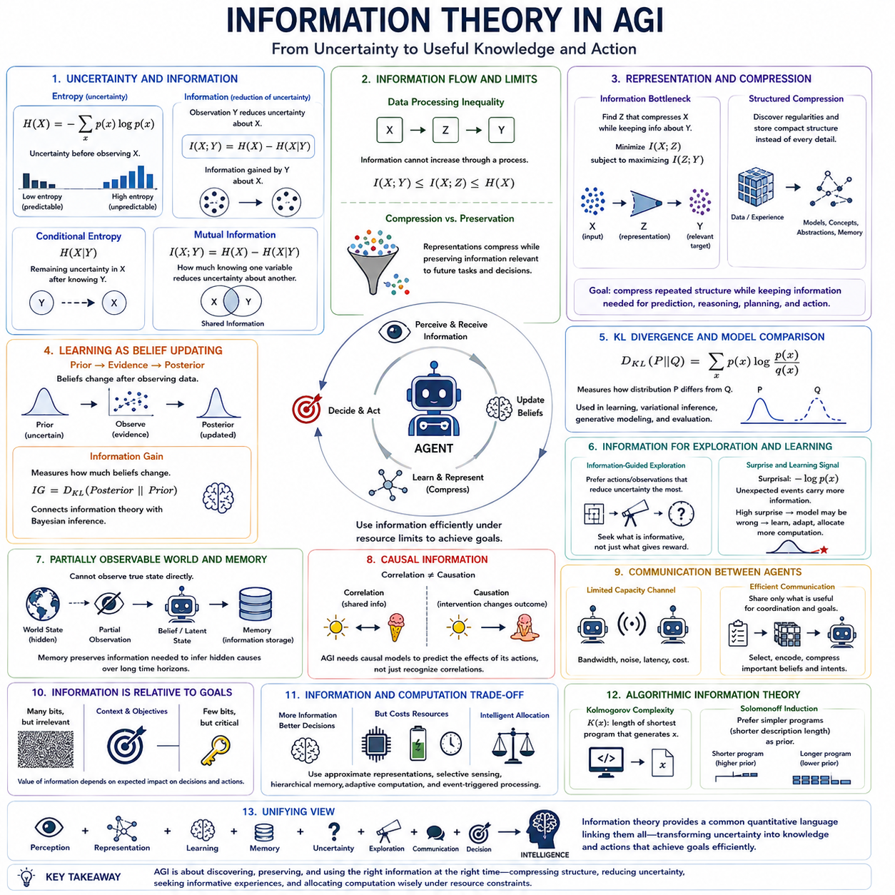{width="7.268055555555556in" height="7.268055555555556in"}

정보 이론(Information Theory)은 지능적인 에이전트(Agent)가 불확실성을 표현하고, 지식을 습득하고, 경험을 압축하고, 정보를 소통하는 방식을 이해하기 위한 수학적 틀을 제공합니다. AGI에서 이러한 질문들은 근본적인데, 이는 지능이 계산에만 의존하는 것이 아니라 어떤 정보가 유용한지, 얼마나 많은 불확실성이 남아 있는지, 그리고 내부 표현(Representation)이 예측과 행동과 관련된 구조를 얼마나 효율적으로 보존하는지를 판단하는 데도 의존하기 때문입니다.

고전적 정보 이론에서 핵심적인 양은 엔트로피(Entropy)입니다. 확률 (p(x))를 갖는 이산 확률변수 (X)에 대해, 섀넌 엔트로피(Shannon Entropy)는 (H(X)=-\\sum_x p(x)\\log p(x))입니다. 엔트로피는 결과가 관찰되기 전의 불확실성을 측정합니다. 매우 예측 가능한 변수는 낮은 엔트로피를 가지는 반면, 여러 개의 동등하게 있을 법한 결과들에 걸쳐 분포된 변수는 높은 엔트로피를 가집니다. 따라서 지능적인 에이전트에게 엔트로피는 상태, 관찰, 사건, 또는 가설에 대한 불확실성을 표현하는 형식적인 언어를 제공합니다.

관찰이 불확실성을 줄일 때 정보는 가치를 갖게 됩니다. 만약 에이전트가 처음에 자신의 환경에 대해 여러 가지 가능한 설명을 가지고 있고 새로운 관찰이 그중 일부를 제거한다면, 그 관찰은 이전의 믿음 상태에 대해 상대적으로 정보를 담고 있는 것입니다. 이러한 해석은 AGI에 있어 중요한데, 지각(Perception)이 단순히 감각 데이터의 수집이 아니기 때문입니다. 유용한 지각은 추론, 계획, 예측, 제어에 필요한 변수들에 대한 불확실성을 줄이는 관찰을 식별합니다.

조건부 엔트로피(Conditional Entropy)는 다른 변수를 알게 된 이후 하나의 변수에 남아 있는 불확실성을 측정합니다. 이는 (H(X\|Y))로 표기됩니다. (Y)에 대한 지식이 (X)를 강하게 예측한다면, 조건부 엔트로피는 작아집니다. AGI 시스템에서 이 개념은 현재의 관찰, 행동, 기억, 또는 세계 모델(World-model) 변수를 고려한 이후 미래 상태에 대해 남아 있는 불확실성의 양을 기술할 수 있습니다. 학습은 부분적으로 이러한 조건부 불확실성을 줄이는 표현을 발견하는 것으로 볼 수 있습니다.

상호정보량(Mutual Information)은 한 변수에 대한 지식이 다른 변수에 대한 불확실성을 얼마나 줄이는지를 정량화합니다. 이는 (I(X;Y)=H(X)-H(X\|Y))로 표현될 수 있습니다. 상호정보량이 높다는 것은 두 변수가 상당한 예측 구조를 공유한다는 것을 의미합니다. 표현 학습(Representation Learning)은 미래 상태, 목표, 보상, 사물, 또는 행동에 중요한 정보를 보존하면서 무관한 변동을 버리는 잠재 변수(Latent Variable)를 구성함으로써 이러한 원리를 활용할 수 있습니다.

데이터 처리 부등식(Data Processing Inequality)은 중요한 제약을 도입합니다. 정보가 (X \\rightarrow Z \\rightarrow Y)라는 순서를 통해 흐른다면, 처리 과정은 입력에 이미 존재하지 않았던 (X)에 대한 정보를 만들어낼 수 없습니다. 학습된 표현은 유용한 구조를 재구성하거나, 압축하거나, 강조할 수는 있지만, 변환 과정에서 버려진 정보는 일반적으로 이후에 복구될 수 없습니다. 따라서 AGI 지각 시스템은 나중에 관련성이 있어질 수 있는 정보의 보존과 압축 사이의 균형을 맞춰야 합니다.

압축(Compression)은 규칙적인 환경이 반복되는 구조를 포함하기 때문에 지능과 밀접하게 관련되어 있습니다. 이러한 구조를 발견하는 시스템은 모든 관찰을 독립적으로 저장하는 시스템보다 더 경제적으로 경험을 기술할 수 있습니다. 따라서 효과적인 세계 모델, 개념, 추상화(Abstraction), 기억은 구조화된 압축의 형태로 이해될 수 있습니다. 목표는 단순히 최대한의 압축이 아니라, 성공적인 예측, 추론, 계획, 행동에 필요한 정보를 보존하는 압축입니다.

정보 병목 원리(Information Bottleneck Principle)는 이러한 절충을 형식화합니다. 표현 (Z)는 입력 (X)를 압축하면서도 목표 (Y)와 관련된 정보를 유지해야 합니다. 개념적으로, 학습자는 유용한 (I(Z;Y))를 유지하면서 (I(X;Z))를 줄이려고 합니다. AGI에 있어 목표는 단일한 클래스 레이블(Label)일 필요가 없습니다. 관련 정보는 미래의 관찰, 인과적 변수, 목표, 보상, 위험, 행동의 결과, 또는 여러 작업에 걸쳐 필요한 다른 양들과 관련될 수 있습니다.

정보 이론은 또한 학습을 믿음의 갱신으로 이해하는 방법을 제공합니다. 데이터를 받기 전에, 에이전트는 가능한 모델이나 가설에 대한 불확실성을 유지합니다. 새로운 증거는 이 분포를 변화시켜, 경험과 더 일치하는 설명에 확률을 집중시킵니다. 따라서 관찰로부터 얻어진 정보는 사전(Prior) 믿음과 사후(Posterior) 믿음 간의 차이와 관련될 수 있으며, 이는 정보 이론을 베이즈적(Bayesian) 추론과 확률적 추론과 연결시킵니다.

쿨백-라이블러 발산(Kullback--Leibler Divergence)은 하나의 확률 분포가 다른 분포와 얼마나 다른지를 측정하며 흔히 (D_{KL}(P\|Q))로 표기됩니다. 학습 시스템에서 이는 근사(Approximate) 분포와 목표 분포, 사후 믿음과 사전 믿음, 또는 예측된 행동과 관찰된 행동 간의 차이를 정량화할 수 있습니다. KL 발산이 대칭적인 거리는 아니지만, 이는 확률적 학습, 변분 추론(Variational Inference), 표현 학습, 그리고 AGI와 관련된 많은 생성 모델링(Generative Modeling) 방법에 있어 근본적입니다.

정보 획득(Information Gain)은 탐색(Exploration)을 이끌 수 있습니다. 지능적인 에이전트가 항상 즉각적인 외부 보상을 만들어내는 행동으로부터 가장 큰 이익을 얻는 것은 아닙니다. 어떤 행동은 환경이 어떻게 작동하는지를 드러내기 때문에 가치가 있습니다. 에이전트는 중요한 변수에 대한 불확실성을 줄이거나 경쟁하는 모델들을 구별할 것으로 예상되는 관찰을 선호할 수 있습니다. 이는 정보 이론을 능동적 학습(Active Learning), 호기심(Curiosity), 실험 설계, 강화학습에서의 탐색, 자율적인 과학적 발견과 연결시킵니다.

예측 오차(Prediction Error)와 정보 또한 밀접하게 관련되어 있습니다. 예상치 못한 관찰은 이미 매우 그럴듯하다고 여겨진 관찰보다 확률적 모델 하에서 더 많은 정보를 담고 있습니다. 때로 놀라움(Surprisal)이라고 불리는 양 (-\\log p(x))는 사건이 덜 예상될수록 증가합니다. AGI는 놀라운 관찰을 자신의 현재 모델이 불완전하다는 것, 환경적 조건이 변화했다는 것, 또는 추가적인 학습과 계산적 주의를 할당해야 한다는 것을 나타내는 신호로 사용할 수 있습니다.

정보 이론은 부분적으로만 관찰 가능한 환경에서 특히 중요해집니다. 에이전트는 완전한 세계 상태에 직접 접근할 수 없으며, 불완전한 감각 이력으로부터 도출된 믿음이나 잠재 표현을 유지해야 합니다. 그러면 기억은 단순한 저장소가 아니라 은닉된 원인을 추론하는 데 필요한 정보를 보존하는 메커니즘으로서 기능합니다. 효과적인 기억 시스템은 어떤 관찰이 긴 시간 규모에 걸쳐 계속 유용한 정보를 담고 있으며 어떤 것은 안전하게 잊을 수 있는지를 결정해야 합니다.

인과적 정보(Causal Information)는 통계적 의존성만으로는 개입(Intervention)이 결과를 어떻게 변화시키는지가 결정되지 않기 때문에 더 깊은 과제를 제시합니다. 두 변수는 하나가 다른 하나를 야기하지 않으면서도 상호정보량을 가질 수 있습니다. 따라서 일반 지능은 정보 이론적 구조를 관찰과 개입을 구별할 수 있는 인과적 모델과 결합할 것을 필요로 합니다. 이러한 구별은 에이전트가 수동적인 데이터에서의 상관관계를 단순히 인식하는 것이 아니라 자신의 행동의 결과를 예측해야 할 때 필수적이 됩니다.

지능적인 에이전트들 간의 소통(Communication) 또한 정보 이론을 통해 분석될 수 있습니다. 통신 채널(Channel)은 제한된 용량, 잡음, 지연 시간, 비용을 가집니다. 다중 에이전트 시스템은 어떤 믿음, 관찰, 의도, 또는 불확실성이 전송할 만한 가치가 있는지를 결정해야 합니다. 따라서 효율적인 소통은, 특히 분산된 로봇이나 에이전트들이 집단적 의사결정을 위한 충분한 공유 정보를 유지하면서 대역폭 제약 하에서 조정해야 할 때, 선택적인 부호화(Encoding)와 압축을 필요로 합니다.

정보는 목표와 결정에 상대적으로만 가치를 가집니다. 관찰은 많은 비트(Bit)를 담고 있으면서도 작업과는 무관할 수 있는 반면, 매우 작은 신호가 최적의 행동을 완전히 바꿀 수도 있습니다. 따라서 AGI는 원시적인 정보의 양과 결정과 관련된 정보 사이의 구별을 필요로 합니다. 주의(Attention), 추상화, 기억 선택, 능동적 지각은 모두 미래의 추론과 행동에 대한 예상되는 영향에 따라 정보를 우선시하는 메커니즘으로 해석될 수 있습니다.

정보와 계산 간의 관계 또한 마찬가지로 중요합니다. 더 많은 정보가 결정을 개선할 수 있지만, 그것을 처리하고, 저장하고, 전송하는 데는 자원이 소모됩니다. 따라서 지능적인 시스템은 추가적인 정보가 그 계산 비용을 정당화하는 시점을 판단해야 합니다. 근사적인 표현, 선택적인 감지, 계층적 기억, 적응적 계산, 이벤트 기반(Event-triggered) 처리는 정보가 많거나 불확실한 상황에 계산을 집중시킴으로써 자원 소비를 줄일 수 있습니다.

알고리즘 정보 이론(Algorithmic Information Theory)은 이러한 아이디어들을 통계적 불확실성으로부터 개별 객체의 기술적 복잡도(Descriptive Complexity)로 확장시킵니다. 콜모고로프 복잡도(Kolmogorov Complexity)는 어떤 객체를 생성할 수 있는 가장 짧은 프로그램의 길이를 측정하는 반면, 솔로모노프 귀납(Solomonoff Induction)은 프로그램 길이를 사용하여 보편적인 단순성 사전(Simplicity Prior)을 구성합니다. 이러한 개념들은 정보, 학습, 복잡도, 보편적 예측을 연결하지만, 그 정확한 값은 일반적으로 계산 불가능하기 때문에 주로 이론적 기초로서 기능합니다.

AGI에 있어 정보 이론의 가장 깊은 역할은 지각, 표현, 학습, 기억, 불확실성, 탐색, 소통, 의사결정을 하나의 공통된 정량적 관점 안에서 연결하는 것입니다. 일반 지능은 어떤 정보가 중요한지를 발견하고, 반복되는 구조를 압축하고, 작업과 관련된 지식을 보존하고, 유익한 경험을 추구하고, 계산을 효율적으로 배분하는 것을 필요로 합니다. 따라서 정보 이론은 지능에 대한 완전한 이론을 제공하는 것이 아니라, 지능적인 에이전트가 불확실성을 유용한 지식과 행동으로 어떻게 변환하는지를 이해하기 위한 기초적인 언어를 제공합니다.

## 02.06. Causality and Reasoning

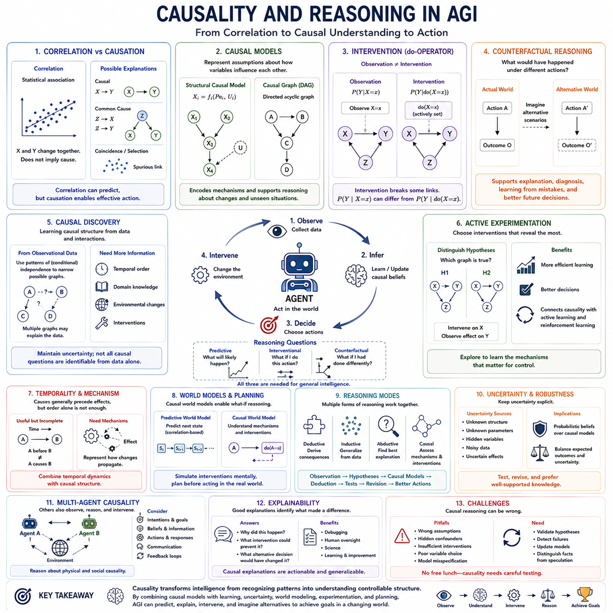{width="7.268055555555556in" height="7.268055555555556in"}

인과성(causality)과 추론(reasoning)은 일반지능(general intelligence)의 핵심 요소이다. 지능형 에이전트(intelligent agent)는 어떤 사건들이 함께 발생하는지를 이해하는 것뿐만 아니라 어떤 사건이 다른 사건의 변화를 실제로 만들어내는지도 이해해야 하기 때문이다. 통계적 연관성(statistical association)은 예측을 지원할 수 있지만 효과적인 행동에는 개입(intervention)과 그 결과에 대한 지식이 필요하다. 따라서 익숙하지 않은 환경에서 작동하는 AGI는 패턴 인식(pattern recognition)을 넘어 행동이 상태를 어떻게 변화시키고 그 변화가 세계를 통해 어떻게 전파되는지를 설명하는 모델을 구축해야 한다.

상관관계(correlation)는 변수 사이의 통계적 의존성(statistical dependence)을 설명하지만 상관관계만으로 인과관계(causal relationship)가 성립하는 것은 아니다. 두 변수가 함께 변화하는 이유는 하나가 다른 하나의 원인이기 때문일 수도 있고, 두 변수에 영향을 주는 숨겨진 공통 원인(hidden common cause)이 존재하기 때문일 수도 있으며, 선택 효과(selection effect)나 우연에 의해 연관성이 발생했을 수도 있다. 일반지능 시스템은 이러한 차이가 의사결정에 중요한 경우 이를 구분해야 하며, 단순한 상관관계를 인과관계로 간주하여 행동하면 잘못되거나 위험한 결과가 발생할 수 있다.

인과 모델(causal model)은 변수들이 서로 어떻게 영향을 미치는지에 관한 가정을 표현한다. 구조적 인과 모델(structural causal model)은 일반적으로 방향성 의존관계(directed dependency)와 방정식을 사용하여 변수들이 자신의 인과적 부모(causal parent)와 외부 요인(external factor)으로부터 어떻게 생성되는지를 기술한다. 이러한 표현은 단순히 관측을 압축해서 설명하는 것 이상의 기능을 제공한다. 변화가 어떤 메커니즘을 통해 전파되는지를 명시함으로써 에이전트가 학습 과정에서 직접 관측하지 않았던 상황에 대해서도 추론할 수 있도록 한다.

방향성 비순환 그래프(directed acyclic graph)는 많은 인과 구조를 표현하기 위한 유용한 그래픽 언어(graphical language)를 제공한다. 노드(node)는 변수를 나타내고 방향성 간선(directed edge)은 가정된 인과적 영향을 나타낸다. (X \\rightarrow Y \\rightarrow Z)와 같은 경로는 (X)의 변화가 (Y)를 거쳐 (Z)에 영향을 줄 수 있음을 의미한다. 그래프 구조는 공통 원인(common cause), 매개 변수(mediator), 그리고 관측된 통계적 연관성이 타당한 인과적 결론을 지원할 수 있는지를 결정하는 다양한 관계를 식별하는 데에도 도움을 준다.

교란(confounding)은 인과 추론(causal reasoning)의 주요 장애물이다. (X)와 (Y)가 세 번째 변수 (Z)의 영향을 동시에 받기 때문에 서로 상관되어 있다고 가정해 보자. 이 경우 (X)를 관측하면 (Y)에 관한 정보를 얻을 수 있지만 (X) 자체를 변화시키더라도 (Y)에는 아무런 영향을 주지 않을 수 있다. 따라서 지능형 에이전트는 예측에 유용한 정보(predictive information)와 실제로 조작 가능한 인과적 영향(manipulable causal influence)을 구분해야 한다. 이러한 차이는 수동적인 관측에서 학습한 지식을 물리적 세계에서 행동 선택에 사용할 때 특히 중요하다.

개입(intervention)의 개념은 변수를 단순히 관측하는 것과 능동적으로 변화시키는 것의 차이를 형식화한다. 펄의 do-연산자(Pearl\'s do-operator)는 개입을 (do(X=x))로 표현하며, 이는 (X)가 단순히 특정 값을 가진 것으로 관측된 것이 아니라 외부에서 특정 값으로 설정된 상황을 의미한다. 따라서 (P(Y\|X=x))와 (P(Y\|do(X=x)))는 서로 다를 수 있다. 관측은 기존의 인과적 의존관계를 유지하지만 개입은 인과 메커니즘(causal mechanism)의 일부를 변경하기 때문이다.

이러한 구분은 연관(association)에서 개입(intervention)으로 이어지는 발전 단계를 형성한다. 연관 수준에서 에이전트는 어떤 변수가 다른 변수를 예측하는지를 질문한다. 개입 수준에서는 특정 행동을 수행하면 어떤 일이 발생할지를 질문한다. 두 번째 질문은 자율 시스템(autonomous system)에서 필수적이다. 행동은 환경에 대한 개입이기 때문이다. 따라서 계획(planning)은 단순히 과거 관측에서 얻은 상관관계를 외삽(extrapolation)하는 것을 넘어 후보 행동(candidate action)이 미래 상태를 어떻게 변화시키는지를 추정할 수 있는 모델을 필요로 한다.

반사실적 추론(counterfactual reasoning)은 다른 행동이나 조건이 적용되었다면 어떤 일이 발생했을지를 질문함으로써 인과 추론을 더욱 확장한다. 실제 결과를 관측한 이후 에이전트는 다른 결정을 내렸다면 더 나은 결과가 발생했을지를 질문할 수 있다. 반사실(counterfactual)은 관측된 세계의 관련 사실들과 일관성을 유지하면서 대안적인 세계(alternative world)에 대해 추론해야 한다. 이러한 능력은 설명(explanation), 진단(diagnosis), 실수로부터의 학습, 책임 평가(responsibility assessment), 미래 정책(policy)의 개선을 지원한다.

따라서 인과 추론은 서로 연결된 세 가지 질문을 통해 이해할 수 있다. 무엇이 발생할 가능성이 있는가, 특정 개입을 수행하면 무엇이 발생할 것인가, 그리고 다른 개입을 수행했다면 무엇이 발생했을 것인가라는 질문이다. 예측(prediction), 개입, 반사실적 추론은 환경에 대해 점점 더 구조화된 가정을 요구한다. 수동적인 예측만으로는 의도적인 행동, 진단 또는 대안에 대한 추론을 완전히 지원할 수 없기 때문에 일반지능은 이 세 가지 능력 모두로부터 이점을 얻는다.

인과 발견(causal discovery)은 데이터와 상호작용으로부터 인과 구조를 학습하는 문제를 다룬다. 관측 데이터(observational data)는 변수 사이의 의존성과 조건부 독립성(conditional independence)의 패턴을 통해 가능한 인과 그래프(causal graph)를 어느 정도 제한할 수 있지만, 관측만으로는 여러 구조가 동일한 증거와 양립하는 경우가 많다. 추가적인 가정, 시간적 순서(temporal ordering), 도메인 지식(domain knowledge), 환경 변화 또는 개입이 필요할 수 있다. 따라서 AGI는 모든 인과관계를 데이터에서 직접 식별할 수 있다고 가정하지 않고 인과 구조 자체에 대한 불확실성을 표현해야 한다.

능동적 실험(active experimentation)은 인과 학습(causal learning)을 크게 향상시킬 수 있다. 에이전트는 환경 메커니즘에 관한 서로 경쟁하는 가설을 구분할 수 있도록 설계된 개입을 선택할 수 있다. 정보가 풍부한 데이터가 우연히 나타나기를 기다리는 대신 특정 변수를 조작하고 그 결과를 관측할 수 있다. 이는 탐색(exploration)을 실험 설계(experimental design)의 문제로 전환하며 인과 추론을 능동학습(active learning) 및 강화학습(reinforcement learning)과 연결한다. 따라서 지능적인 탐색은 미래의 제어와 의사결정에 중요한 관계에 관한 정보를 적극적으로 획득할 수 있다.

시간적 정보(temporal information)는 인과성에 대해 유용하지만 불완전한 증거를 제공한다. 일반적으로 원인은 결과보다 먼저 발생하므로 시간적 순서를 이용하면 일부 불가능한 설명을 제거할 수 있다. 그러나 시간적으로 먼저 발생했다는 사실만으로는 충분하지 않다. 시간 순서가 있는 두 변수 역시 숨겨진 요인이나 간접적인 메커니즘에 의해 연결되어 있을 수 있기 때문이다. 따라서 AGI는 단순히 시퀀스 예측(sequence prediction)을 인과적 이해와 동일시하지 않고 시간적 동역학(temporal dynamics)과 인과 구조를 결합하는 표현을 필요로 한다.

인과 메커니즘(causal mechanism)은 표면적인 통계분포(statistical distribution)가 변화하더라도 안정적으로 유지될 수 있기 때문에 더욱 강력한 일반화(generalization)를 지원할 수 있다. 로봇은 서로 다른 조명, 객체 배치, 위치, 운용 조건을 경험할 수 있지만 특정 행동이 만들어내는 물리적 결과는 유사하게 유지될 수 있다. 따라서 안정적인 인과관계를 학습하면 훈련 중 관측했던 상관관계가 정확하게 유지되지 않는 새로운 환경에서도 지식을 전이(transfer)하는 데 도움이 될 수 있다.

이러한 특성은 분포 변화(distribution shift)와 밀접하게 관련된다. 기존의 예측 모델(predictive model)은 학습 분포와 실제 운용 분포가 달라질 경우 학습 과정에서 활용했던 상관관계가 사라지거나 반전되어 실패할 수 있다. 인과 표현(causal representation)은 변화하는 상황에서도 유지되는 관계에 초점을 맞춤으로써 더 강건한 특징(robust feature)을 제공할 수 있다. 인과성이 분포 변화 문제를 자동으로 해결하는 것은 아니지만, 환경 변화에서도 유지될 가능성이 높은 구조를 식별하기 위한 원리를 제공한다.

추상화(abstraction) 역시 중요하다. 유용한 인과 모델이 모든 미시적인 물리적 상호작용을 표현할 수는 없기 때문이다. 지능형 에이전트는 객체(object), 에이전트, 의도(intention), 힘(force), 자원(resource), 위험(risk), 목표(goal)와 같이 적절한 수준의 변수를 선택해야 한다. 동일한 환경도 서로 다른 척도에서 여러 개의 타당한 인과적 설명을 가질 수 있다. 효과적인 추론은 불필요한 세부사항을 억제하면서 현재 의사결정에 필요한 인과관계를 보존하는 적절한 추상화 수준을 선택해야 한다.

인과 추론은 월드 모델(world model)과도 강하게 상호작용한다. 월드 모델은 환경 상태가 어떻게 변화하는지를 예측하고, 인과적 월드 모델(causal world model)은 어떤 메커니즘이 그러한 전이를 만들어내며 개입이 그 메커니즘을 어떻게 변화시키는지를 표현하려 한다. 이러한 모델은 에이전트가 후보 행동을 내부적으로 시험할 수 있도록 함으로써 정신적 시뮬레이션(mental simulation)을 지원한다. 계획은 현실 환경에서 비용이 크거나 되돌릴 수 없는 행동을 수행하기 전에 가능한 개입 궤적(intervention trajectory)을 비교하는 과정이 된다.

모델 기반 강화학습(model-based reinforcement learning)은 이러한 연결을 잘 보여준다. 에이전트는 환경 동역학(environmental dynamics)을 학습하고 이를 이용하여 미래 행동을 평가하지만, 순수하게 예측적인 동역학 모델은 새로운 개입에서는 실패하는 상관관계를 활용할 수도 있다. 인과 구조를 통합하면 특히 이전에 경험했던 정책과 다른 행동을 수행해야 할 때 행동 결과에 대한 추론을 향상시킬 수 있다. 목표는 변화하는 행동과 환경 조건에서도 제어를 지원할 만큼 안정적인 메커니즘을 학습하는 것이다.

추론 자체는 여러 형태의 추론 방식(inference)을 결합할 수 있다. 연역적 추론(deductive reasoning)은 받아들여진 전제로부터 결과를 도출하고, 귀납적 추론(inductive reasoning)은 관측으로부터 일반화하며, 귀추적 추론(abductive reasoning)은 가능한 설명을 탐색하고, 인과 추론은 메커니즘과 개입을 평가한다. 일반지능은 이 중 하나의 방식에만 의존하기보다 여러 방식을 함께 사용할 가능성이 높다. 이를 통해 관측에서 가설을 생성하고, 인과 모델로 이를 설명하며, 연역을 통해 검증 가능한 결과를 도출할 수 있다.

귀추적 추론은 진단(diagnosis)에서 특히 중요하다. 에이전트가 예상하지 못한 사건을 관측하면 해당 증거를 설명할 수 있는 원인을 역방향으로 탐색할 수 있다. 초기에는 여러 설명이 가능할 수 있으므로 확률적 비교(probabilistic comparison)와 추가 관측이 필요하다. 이후 에이전트는 이러한 설명을 구분할 수 있는 시험(test)이나 개입을 선택할 수 있다. 이를 통해 관측, 가설 형성(hypothesis formation), 인과 추론, 실험, 믿음 수정(belief revision)으로 이어지는 순환 구조가 형성된다.

인과 추론 과정 전체에서 불확실성은 명시적으로 유지되어야 한다. 현실의 에이전트는 정확한 인과 그래프, 파라미터(parameter), 숨겨진 변수(hidden variable), 개입 결과를 확실하게 알고 있는 경우가 드물다. 따라서 실용적인 AGI는 가능한 인과적 설명과 메커니즘에 대해 확률적 믿음(probabilistic belief)을 유지해야 한다. 특히 행동의 비용이 크거나 되돌릴 수 없거나 안전에 중요한 경우에는 기대되는 결과뿐만 아니라 모델 자체에 대한 불확실성도 의사결정에 반영해야 한다.

다중 에이전트 환경(multi-agent environment)은 다른 에이전트 역시 관측하고 추론하며 개입하기 때문에 인과성을 더욱 복잡하게 만든다. 하나의 행동이 다른 에이전트의 믿음과 행동을 변화시키고, 그 결과 다시 환경이 변화할 수 있다. 따라서 인과 모델은 의도, 전략적 반응(strategic response), 통신(communication), 피드백 루프(feedback loop)를 표현해야 할 수도 있다. 사회적 지능(social intelligence)과 협력적 지능(cooperative intelligence)은 물리적 메커니즘뿐만 아니라 정보와 행동이 다른 의사결정 시스템에 어떤 영향을 미치는지도 추론해야 한다.

인과 추론은 설명 가능성(explainability)에도 중요한 의미를 가진다. 유용한 설명은 단순히 서로 연관된 특징들을 나열하는 것이 아니라 결과에 의미 있는 차이를 만들어낸 요인을 식별하는 경우가 많다. 인과적 설명(causal explanation)이 가능한 AGI는 어떤 사건이 왜 발생했는지, 어떤 개입이 동일한 문제의 재발을 방지할 수 있는지, 어떤 대안적 결정이 결과를 변화시켰을지를 설명할 수 있다. 이러한 설명은 디버깅(debugging), 인간의 감독(human oversight), 과학적 추론(scientific reasoning), 자율학습(autonomous learning)을 향상시킬 수 있다.

그러나 시스템이 인과적 용어나 그래프 구조를 사용한다고 해서 인과 추론이 자동으로 신뢰할 수 있게 되는 것은 아니다. 잘못된 가정, 숨겨진 교란 변수(hidden confounder), 불충분한 개입, 부적절한 변수 선택, 모델 명세 오류(model misspecification)는 모두 잘못된 결론을 만들어낼 수 있다. 따라서 일반지능 에이전트는 인과 가설(causal hypothesis)을 시험하고, 예측이 실패할 경우 모델을 수정하며, 충분한 근거가 있는 인과 지식과 아직 추측에 불과한 설명을 구분해야 한다.

궁극적으로 인과성(causality)은 추론을 단순한 패턴 인식에서 제어 가능한 구조(controllable structure)에 대한 이해로 확장한다. 일반지능은 미래 사건을 예측하고, 가능한 설명을 식별하며, 개입의 결과를 평가하고, 반사실적 대안을 상상하며, 변화하는 환경 사이에서 지식을 전이할 수 있어야 한다. 인과 모델을 학습, 불확실성, 월드 모델링(world modeling), 실험, 계획과 결합함으로써 AGI는 단순히 무엇이 함께 발생하는지를 넘어 왜 그러한 일이 발생하는지, 그리고 의도적인 행동이 이후의 결과를 어떻게 변화시킬 수 있는지를 추론할 수 있다.

## 02.07. Probabilistic Programming

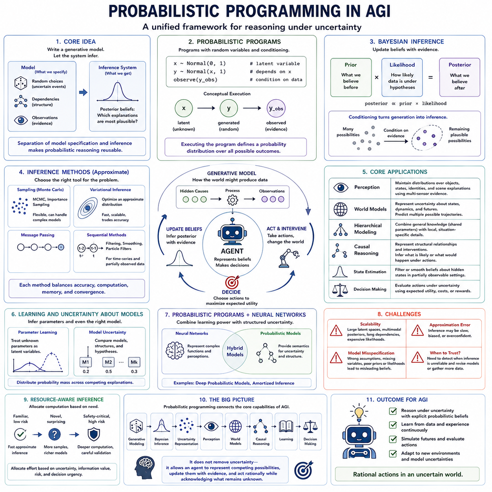{width="7.268055555555556in" height="7.268055555555556in"}

확률적 프로그래밍(probabilistic programming)은 불확실성(uncertainty)을 실행 가능한 모델(executable model) 내부에서 직접 표현할 수 있도록 하는 프레임워크이다. 각각의 불확실한 문제마다 별도의 추론 알고리즘(inference algorithm)을 설계하는 대신, 프로그래머는 숨겨진 변수(hidden variable), 관측(observation), 의존관계(dependency)가 어떻게 생성되는지를 정의하고 확률적 추론 시스템이 가능한 설명을 추정하도록 한다. 이러한 모델 명세(model specification)와 추론의 분리는 다양한 지능형 과제에서 확률적 추론을 재사용하기 쉽게 만든다.

확률적 프로그램(probabilistic program)은 일반적인 프로그램에 확률변수(random variable)와 조건화 연산(conditioning operation)을 확장한 것으로 이해할 수 있다. 무작위 선택(random choice)은 불확실한 사건이나 잠재적 원인(latent cause)을 표현하고, 관측은 이용 가능한 증거를 사용하여 이러한 선택을 제한한다. 프로그램을 실행하면 개념적으로 가능한 실행 경로(execution trace), 상태, 파라미터(parameter), 결과에 대한 확률분포(probability distribution)가 정의된다. 이후 추론은 관측된 증거가 반영된 후 어떤 가능성이 높은 확률을 유지하는지를 결정한다.

이러한 접근법은 동일한 입력이 일반적으로 미리 결정된 출력을 생성하는 기존의 결정론적 프로그래밍(deterministic programming)과 다르다. 확률적 프로그래밍에서는 하나의 모델이 여러 가능한 세계(possible world)를 각각의 확률과 함께 표현할 수 있다. 이러한 표현은 지능형 에이전트가 환경에 대한 완전한 지식을 가지는 경우가 드물다는 점에서 AGI에 유용하다. 에이전트는 지각(perception), 메모리(memory), 예측(prediction), 행동(action)이 완벽하게 확실하다고 가정하는 대신 여러 대안적 가설(alternative hypothesis)에 대해 추론해야 한다.

생성 모델(generative model)은 많은 확률적 프로그램의 개념적 기반을 형성한다. 생성 모델은 숨겨진 원인(hidden cause)이 관측 가능한 데이터를 생성하는 과정을 기술한다. 예를 들어 잠재적인 환경 상태(latent environmental state)가 센서 측정값을 생성하거나, 숨겨진 의도(hidden intention)가 관측 가능한 행동을 생성할 수 있다. 이후 추론은 반대 방향으로 진행될 수 있다. 즉, 관측이 주어졌을 때 에이전트는 어떤 잠재 변수(latent variable)나 모델 파라미터가 관측된 현상을 가장 그럴듯하게 설명하는지를 추론한다.

베이지안 추론(Bayesian inference)은 이러한 과정의 핵심적인 수학적 메커니즘을 제공한다. 사전분포(prior distribution)는 새로운 증거를 받기 전의 믿음을 표현하고, 가능도(likelihood)는 서로 다른 가설에서 관측이 발생할 가능성을 설명하며, 사후분포(posterior distribution)는 증거를 조건으로 반영한 이후 갱신된 믿음을 나타낸다. 확률적 프로그래밍은 이러한 관계를 실행 가능한 모델로 표현하여 믿음 갱신(belief updating)을 더 큰 추론 및 의사결정 아키텍처(reasoning and decision-making architecture)의 일부로 만들 수 있다.

조건화(conditioning)는 생성적 기술(generative description)을 추론 문제로 변환하기 때문에 특히 중요하다. 프로그램은 숨겨진 변수와 관측의 가능한 여러 조합을 생성할 수 있지만 실제 증거는 관련된 가능성을 제한한다. 추론 시스템은 주어진 관측에 대해 알려지지 않은 변수들의 조건부 분포(conditional distribution)를 추정해야 한다. 복잡한 모델에서는 이러한 분포를 정확하게 계산할 수 없는 경우가 많으므로 근사 추론 알고리즘(approximate inference algorithm)이 필요하다.

일부 제한된 확률 모델(probabilistic model)에서는 정확 추론(exact inference)이 가능하지만 의존관계와 잠재 변수의 수가 증가하면 계산 비용이 급격하게 증가할 수 있다. 따라서 범용 확률적 프로그래밍(general-purpose probabilistic programming)은 근사(approximation)에 크게 의존한다. 샘플링 방법(sampling method), 변분 추론(variational inference), 메시지 전달(message passing), 순차적 기법(sequential technique), 특수화된 알고리즘을 사용하면 가능한 모든 구성을 열거하지 않고도 사후분포를 추정할 수 있다. 각각의 방법은 정확도, 계산량, 메모리, 수렴(convergence) 사이에서 서로 다른 절충 관계를 제공한다.

몬테카를로 방법(Monte Carlo method)은 샘플(sample)을 사용하여 분포를 근사한다. 마르코프 연쇄 몬테카를로(Markov chain Monte Carlo)는 장기적인 분포가 목표 사후분포에 접근하도록 상관된 샘플의 연속을 구성하며, 중요도 샘플링(importance sampling)은 관측된 증거를 얼마나 잘 설명하는지에 따라 샘플에 가중치를 다시 부여한다. 이러한 방법은 표현력이 높은 확률 모델을 지원할 수 있지만 복잡한 사후분포 구조, 희귀한 증거(rare evidence), 고차원 공간에서는 상당한 계산량과 신중한 알고리즘 설계가 필요할 수 있다.

변분 추론은 확률적 추론을 최적화(optimization) 문제로 변환하는 다른 접근법을 사용한다. 정확한 사후분포를 표현하기에 충분한 샘플을 생성하는 대신 계산하기 쉬운 분포군(tractable family)에서 근사 분포를 선택하고 그 파라미터를 조정하여 목표 분포와 유사하게 만든다. 이를 통해 추론을 상당히 빠르고 확장 가능하게 만들 수 있지만, 계산 효율성을 얻는 대신 선택한 변분 분포군(variational family)에 부분적으로 의존하는 근사 오차(approximation error)를 받아들여야 한다.

확률적 프로그래밍은 감각 정보가 불완전하고 잡음(noise)을 포함한다는 점에서 지각과 특히 관련성이 높다. 지능형 시스템은 하나의 해석만 생성하는 대신 객체, 위치, 상태, 정체성(identity), 장면에 대한 설명(scene explanation)의 확률분포를 유지할 수 있다. 여러 센서에서 들어오는 증거를 통해 이러한 믿음을 시간에 따라 갱신할 수 있다. 이를 통해 이후의 추론 과정은 불확실한 지각 추정치를 의심할 수 없는 사실처럼 처리하지 않고 불확실성을 명시적으로 고려할 수 있다.

동일한 원리는 월드 모델(world model)에도 적용된다. 확률적 월드 모델(probabilistic world model)은 현재 상태, 상태 전이 동역학(transition dynamics), 숨겨진 변수, 미래 결과에 대한 불확실성을 표현할 수 있다. 하나의 결정론적인 미래를 예측하는 대신 서로 다른 확률을 가진 여러 가능한 궤적(trajectory)을 표현할 수 있다. 이러한 모델은 환경에 확률적 과정(stochastic process), 부분 관측 가능성(partial observability), 불확실한 동역학 또는 미래 행동을 정확하게 예측할 수 없는 다른 에이전트가 존재할 때 유용하다.

확률적 프로그래밍은 계층적 모델링(hierarchical modeling)도 지원한다. 한 수준의 변수는 광범위한 상황(context)을 설명하고, 하위 수준에서는 개별 객체, 사건, 측정값을 설명할 수 있다. 공유 파라미터(shared parameter)는 여러 과제나 환경에 공통된 규칙성을 포착하고, 지역 변수(local variable)는 특정 상황에 따른 차이를 표현할 수 있다. 계층적 구조는 AGI가 일반적인 지식과 새로운 증거를 결합하도록 하며 개별 과제에서 제한된 관측만 제공되는 경우에도 학습을 향상시킬 수 있다.

인과 모델(causal model) 역시 확률적으로 표현할 수 있다. 구조적 관계(structural relationship)는 변수들이 서로 어떻게 영향을 미치는지를 정의하고, 확률분포는 숨겨진 요인, 파라미터, 결과에 대한 불확실성을 표현한다. 관측적 추론(observational inference)은 증거가 주어졌을 때 무엇이 발생할 가능성이 높은지를 추정하지만, 인과 추론(causal reasoning)은 생성 과정을 변화시키는 개입(intervention)을 표현해야 한다. 따라서 개입이 올바르게 표현된다면 확률적 프로그래밍은 불확실성과 인과 모델을 결합하기 위한 계산적 메커니즘을 제공할 수 있다.

확률적 프로그램은 에이전트가 하나의 상태 추정치에 너무 일찍 확정하지 않고 숨겨진 상태(hidden state)에 대한 믿음을 유지할 수 있기 때문에 부분 관측 환경(partially observable environment)에서 유용하다. 관측이 순차적으로 들어오면 필터링(filtering)이나 스무딩(smoothing)을 통해 이러한 믿음을 갱신할 수 있다. 이렇게 형성된 믿음 상태(belief state)는 미래의 의사결정에 필요한 불확실성을 요약하며, 확률적 프로그래밍을 상태 추정(state estimation), 부분 관측 의사결정 과정(partially observable decision process), 자율 에이전트(autonomous agent)와 자연스럽게 연결한다.

의사결정(decision making)은 가능한 결과에 선호(preference), 효용(utility), 비용(cost), 보상(reward)을 연결함으로써 확률적 추론을 확장한다. 에이전트는 불확실한 모델 아래에서 후보 행동(candidate action)의 결과를 추정하고 기대 효용(expected utility)이나 다른 의사결정 기준에 따라 행동을 선택할 수 있다. 이는 확률적 프로그래밍을 계획(planning) 및 강화학습(reinforcement learning)과 연결하며, 상태와 동역학에 대한 불확실성을 목표와 분리해서 다루는 대신 함께 통합할 수 있도록 한다.

확률적 프로그램은 모델 자체에 대한 불확실성도 표현할 수 있다. 에이전트는 특정 변수의 값뿐만 아니라 어떤 설명, 구조 또는 파라미터화(parameterization)가 적절한지에 대해서도 불확실할 수 있다. 베이지안 모델 비교(Bayesian model comparison)와 계층적 사전분포(hierarchical prior)를 이용하면 서로 경쟁하는 여러 가설에 확률 질량(probability mass)을 분배할 수 있다. 익숙하지 않은 환경에서는 올바른 모델 구조가 확립되기 전에 추론해야 하는 경우가 많기 때문에 이러한 능력은 일반지능에서 중요하다.

이러한 프레임워크에서는 학습(learning)과 추론이 밀접하게 연결된다. 알려지지 않은 파라미터를 잠재 변수로 취급하여 데이터로부터 추론할 수 있으며, 새로운 관측이 들어올 때마다 사후 믿음을 지속적으로 수정할 수 있다. 따라서 하나의 확률적 프로그램 안에서 파라미터 학습(parameter learning), 상태 추정, 예측, 불확실성 정량화(uncertainty quantification)를 통합할 수 있다. AGI에서는 이를 통해 이전에 학습한 지식과 지속적인 환경 상호작용에서 새롭게 얻은 증거를 결합할 수 있다.

현대의 신경망(neural network)과 확률적 프로그래밍은 서로 보완적인 관계를 형성할 수 있다. 신경망은 강력한 함수 근사(function approximation)와 표현학습 능력을 제공하고, 확률 모델은 불확실성과 구조화된 의존관계(structured dependency)에 대한 명시적인 의미를 제공한다. 신경망 구성요소를 이용해 확률분포나 추론 절차를 파라미터화할 수 있으며, 이를 통해 심층 확률 모델(deep probabilistic model)과 상각 추론(amortized inference) 같은 하이브리드 접근법을 구성할 수 있다. 이러한 시스템은 학습된 표현과 구조화된 확률적 추론을 결합한다.

상각 추론은 확장 가능한 지능(scalable intelligence)에서 특히 중요하다. 새로운 관측이 들어올 때마다 비용이 높은 최적화나 샘플링을 처음부터 수행하는 것은 현실적으로 어려울 수 있다. 대신 학습된 추론 네트워크(inference network)가 관측으로부터 근사 사후분포를 직접 예측하도록 만들면 여러 관련 문제에 걸쳐 추론 비용을 분산할 수 있다. 이는 추론하는 방법 자체를 학습하는 것과 유사하며, 충분한 경험이 축적된 이후 반복적인 확률 추론을 훨씬 빠르게 수행할 수 있도록 한다.

그러나 확률적 프로그래밍 역시 상당한 확장성 문제(scalability challenge)에 직면한다. 표현력이 높은 모델은 거대한 잠재 공간(latent space), 다중 모드 사후분포(multimodal posterior distribution), 장기 의존성(long dependency), 계산 비용이 높은 가능도 평가(likelihood evaluation)를 만들어낼 수 있다. 근사 추론은 느리게 수렴하거나 지나치게 확신하는 결과를 생성할 수도 있다. 따라서 AGI는 불확실성을 명시적으로 표현한다는 사실만으로 추론이 자동으로 신뢰할 수 있게 된다고 가정해서는 안 되며, 근사의 품질을 평가하고 추론이 신뢰하기 어려워지는 상황을 인식해야 한다.

모델 명세(model specification)는 또 다른 한계를 만든다. 확률적 추론은 모델에 포함된 가정이 타당한 만큼만 의미를 가진다. 잘못된 독립성 가정(independence assumption), 부적절한 사전분포, 누락된 변수, 부정확한 가능도 함수(likelihood function)는 체계적으로 잘못된 사후 믿음을 만들어낼 수 있다. 따라서 높은 능력을 가진 지능형 시스템은 축적된 증거가 기존의 확률적 설명과 충돌할 경우 파라미터 값뿐만 아니라 모델 구조(model structure), 표현, 가정 자체도 수정할 수 있어야 한다.

따라서 자원 인식 추론(resource-aware inference)은 실용적인 AGI에서 중요하다. 익숙하고 위험도가 낮은 상황에서는 빠른 근사 추론으로 충분할 수 있지만, 새롭거나 예상 밖이거나 안전이 중요한 상황에서는 추가적인 샘플, 더 풍부한 모델, 더 깊은 계산이 필요할 수 있다. 지능형 아키텍처는 모든 관측에 동일한 계산 절차를 적용하는 대신 불확실성, 기대 정보 가치(expected information value), 위험, 의사결정의 긴급성에 따라 추론에 투입할 계산량을 동적으로 할당할 수 있다.

궁극적으로 확률적 프로그래밍(probabilistic programming)은 지식이 불완전한 상황에서 AGI가 추론할 수 있도록 하는 구조화된 언어를 제공한다. 이는 생성 모델링(generative modeling), 베이지안 추론, 불확실성 표현, 지각, 월드 모델, 인과 추론, 학습, 의사결정을 실행 가능한 계산 모델 안에서 연결한다. 그 중요성은 불확실성을 제거하는 데 있는 것이 아니라 지능형 에이전트가 서로 경쟁하는 여러 가능성을 표현하고, 새로운 증거를 이용해 이를 갱신하며, 무엇이 아직 알려지지 않았는지를 명시적으로 인정하면서 합리적인 행동을 선택할 수 있도록 하는 데 있다.

## 02.08. Meta Learning Theory

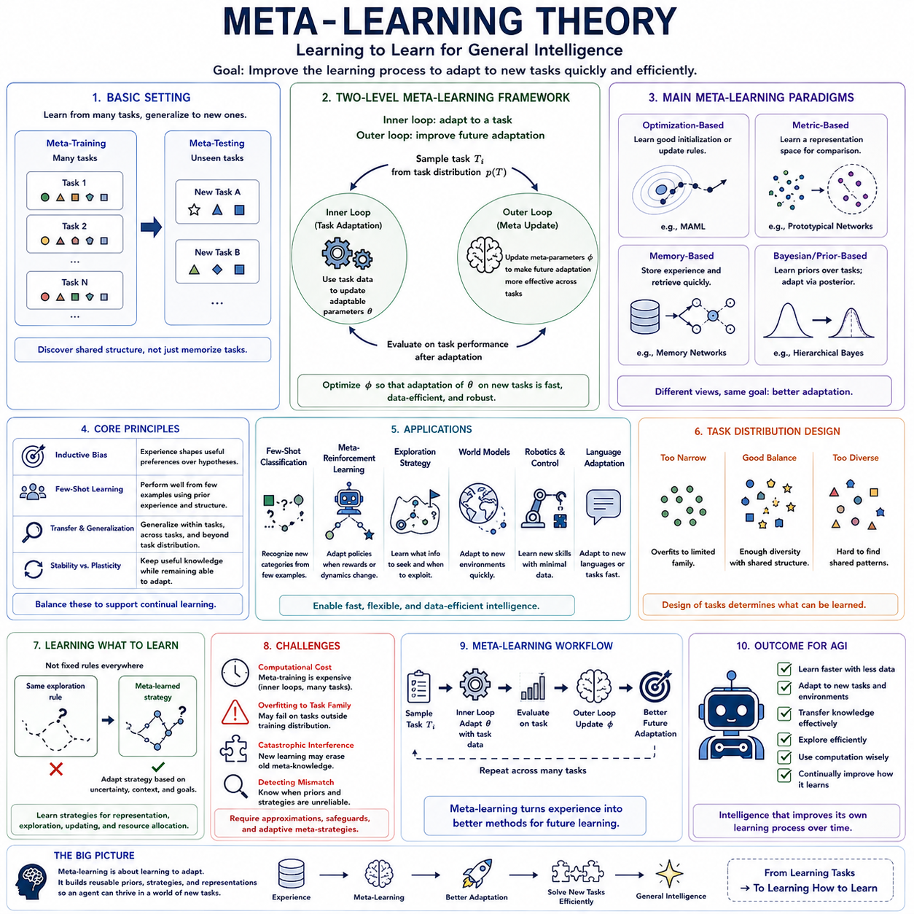{width="7.268055555555556in" height="7.268055555555556in"}

메타학습 이론(meta-learning theory)은 지능형 시스템(intelligent system)이 하나의 고정된 과제에서 성능만 향상시키는 것이 아니라 학습하는 과정 자체를 어떻게 개선할 수 있는지를 연구한다. 각각의 새로운 문제를 독립적인 최적화 문제(optimization problem)로 취급하는 대신, 메타학습(meta-learning)은 서로 관련된 여러 과제에서 얻은 경험을 통해 재사용 가능한 전략(strategy), 표현(representation), 사전지식(prior), 갱신 규칙(update rule)을 발견하고, 이를 이용해 미래의 학습을 더 빠르고 데이터 효율적이며 적응 가능하게 만드는 것을 목표로 한다.

기본적인 설정에서는 하나의 데이터셋(dataset)이 아니라 과제 분포(task distribution)를 도입한다. 각각의 과제는 자체적인 학습 사례(training example), 검증 사례(validation example), 동역학(dynamics), 목표(goal), 보상 구조(reward structure)를 가질 수 있다. 학습자는 메타훈련(meta-training) 과정에서 여러 과제를 경험하고, 메타테스트(meta-testing)에서는 이전에 경험하지 않은 새로운 과제를 대상으로 평가된다. 따라서 성공 여부는 이전의 개별 과제를 단순히 암기하는 것이 아니라 여러 과제에서 공유되는 규칙성을 추출할 수 있는지에 달려 있다.

유용한 형식적 관점(formal view)은 학습을 두 개의 수준으로 구분한다. 내부 루프(inner loop)는 과제별 데이터를 사용하여 특정 과제에 에이전트를 적응시키고, 외부 루프(outer loop)는 미래의 내부 루프 적응이 더욱 효과적으로 이루어지도록 메타 파라미터(meta-parameter)를 조정한다. (\\theta)가 적응 가능한 파라미터(adaptable parameter)를 나타내고 (\\phi)가 메타지식(meta-knowledge)을 나타낸다면, 외부 과정은 여러 과제에서 (\\theta)를 이용한 적응이 얼마나 좋은 성능을 보이는지를 기준으로 (\\phi)를 최적화한다.

최적화 기반 메타학습(optimization-based meta-learning)은 빠르게 적응할 수 있는 파라미터 초기값(parameter initialization)이나 갱신 절차(update procedure)를 학습하려고 한다. 모델 불가지론적 메타학습(Model-Agnostic Meta-Learning)은 대표적인 개념으로, 새로운 과제에서 소수의 경사하강 단계(gradient step)만 수행해도 높은 성능을 얻을 수 있도록 파라미터를 학습한다. 중요한 것은 특정 알고리즘 자체가 아니라 서로 관련된 여러 과제에 효율적으로 도달할 수 있는 파라미터 공간(parameter space)의 영역에 학습자를 위치시키는 원리이다.

메트릭 기반 메타학습(metric-based meta-learning)은 문제에 다른 방식으로 접근한다. 파라미터를 어떻게 갱신할 것인지를 학습하는 대신, 새로운 사례를 이전에 관측한 사례와 효율적으로 비교할 수 있는 표현 공간(representation space)을 학습한다. 이후 새로운 과제는 거리(distance), 프로토타입(prototype), 유사도 함수(similarity function), 학습된 임베딩(learned embedding)을 이용하여 해결할 수 있다. 이러한 방법은 새로운 범주나 과제에 대해 소수의 라벨링된 사례만 제공되는 퓨샷 환경(few-shot setting)에서 특히 유용하다.

메모리 기반 메타학습(memory-based meta-learning)은 외부 또는 내부 메모리를 사용하여 이전 과제에 관한 정보를 보존하고 관련된 경험을 빠르게 검색한다. 순환 모델(recurrent model), 어텐션 메커니즘(attention mechanism), 명시적 메모리 시스템(explicit memory system)은 이전 관측이 성공적인 예측이나 행동과 어떻게 연결되었는지를 인코딩할 수 있다. 이를 통해 관련된 문제가 다시 나타났을 때 느린 파라미터 갱신을 통해 모든 것을 다시 학습하는 대신 저장된 과제 구조를 빠른 적응 메커니즘으로 활용할 수 있다.

베이지안 관점(Bayesian perspective)은 메타학습을 여러 과제에 대한 사전분포(prior)를 학습하는 과정으로 해석한다. 이전 과제에서 축적된 경험은 새로운 과제의 데이터를 관측하기 전에 어떤 가설, 파라미터 또는 구조가 발생할 가능성이 높은지를 나타내는 사전분포를 형성한다. 이후 적응은 사후분포 갱신(posterior updating)의 과정이 된다. 이러한 관점에서 메타학습이 성능을 향상시키는 이유는 에이전트가 구조화되지 않은 일반적인 사전분포에서 시작하는 대신 정보가 반영된 기대(informed expectation)를 가지고 새로운 과제를 시작할 수 있기 때문이다.

메타학습은 귀납적 편향(inductive bias)과 밀접하게 관련된다. 모든 학습자는 특정 가설을 다른 가설보다 선호해야 하며, 메타학습은 경험을 통해 이러한 선호 자체를 조정할 수 있도록 한다. 물리적 조작(physical manipulation) 과제를 반복적으로 경험하는 시스템은 객체 영속성(object permanence), 공간적 지역성(spatial locality), 재사용 가능한 운동 패턴(motion pattern)에 대한 편향을 학습할 수 있다. 언어 학습자는 구문(syntax), 의미론(semantics), 조합성(compositionality)에 관한 구조적 기대를 습득하여 익숙하지 않은 표현을 학습할 때 필요한 탐색을 줄일 수 있다.

퓨샷 학습(few-shot learning)은 메타학습 이론이 가장 명확하게 적용되는 분야 중 하나이다. 이전 경험을 통해 이미 재사용 가능한 구조를 확보했기 때문에 단 몇 개의 사례만으로도 충분한 성능을 달성하는 것이 목표이다. 그러나 성공적인 퓨샷 행동을 단순한 암기와 혼동해서는 안 된다. 진정한 메타학습은 이전 경험이 실제로 새로운 과제에 대한 적응을 향상시켜야 하며, 여기에는 구체적인 라벨(label), 구성(configuration), 목표가 학습 과정에서 직접 등장하지 않았던 상황도 포함된다.

메타 강화학습(meta-reinforcement learning)은 이러한 원리를 순차적 의사결정(sequential decision making)으로 확장한다. 정적인 예측 과제에만 적응하는 것이 아니라 보상 함수(reward function), 상태 전이 동역학(transition dynamics), 환경 조건이 변화할 때 정책(policy)을 어떻게 적응시킬 것인지를 학습한다. 새로운 과제에서 얻은 경험은 현재 환경에 관한 정보를 제공하고, 메타학습된 메커니즘은 해당 정보가 행동을 어떻게 변화시켜야 하는지를 결정한다. 이는 메타학습을 탐색(exploration), 메모리, 적응형 제어(adaptive control)와 밀접하게 연결한다.

탐색 자체도 메타학습될 수 있다. 불확실한 환경을 반복적으로 경험한 에이전트는 어떤 행동이 유용한 정보를 제공하는 경향이 있는지, 그리고 어느 시점에서 탐색에서 활용(exploitation)으로 전환해야 하는지를 학습할 수 있다. 모든 환경에 동일한 고정 탐색 규칙을 적용하는 대신 과제 구조, 불확실성, 이전 경험에 따라 탐색 전략을 조정할 수 있다. 이는 효율적인 적응이 무엇을 해야 하는지를 학습하는 것뿐만 아니라 어떤 정보를 먼저 찾아야 하는지를 학습하는 데에도 의존한다는 점에서 AGI에 중요하다.

과제 분포 설계(task distribution design)는 메타학습자가 자신이 경험한 과제들이 뒷받침하는 편향만을 습득할 수 있다는 점에서 매우 중요하다. 메타훈련 과제가 지나치게 좁으면 해당 과제군에서는 매우 효율적이지만 그 범위를 벗어나면 실패하는 시스템이 만들어질 수 있다. 반대로 과제들이 지나치게 이질적이면 공유 구조(shared structure)를 발견하기 어려워질 수 있다. 따라서 메타학습 이론은 과제 유사성(task similarity), 과제 다양성(task diversity), 전이 가능성(transferability), 재사용 가능한 지식과 과제별 정보 사이의 경계에 관한 가정에 크게 의존한다.

메타학습에서 일반화(generalization)는 여러 수준에서 발생한다. 시스템은 제한된 적응 이후 하나의 과제 내부에서 일반화해야 하고, 익숙한 분포에서 추출된 새로운 과제 사이에서도 일반화해야 하며, 이상적으로는 기존 과제 분포 자체를 넘어서는 상황에서도 일반화해야 한다. 마지막 경우가 가장 어렵다. 학습된 적응 전략이 더 이상 성립하지 않는 가정에 의존할 수 있기 때문이다. 따라서 AGI 지향 메타학습(AGI-oriented meta-learning)은 기존 사전지식이 신뢰할 수 없는 상황을 감지하고 학습 전략 자체를 수정할 수 있는 메커니즘을 필요로 한다.

메타학습은 안정성과 가소성(stability versus plasticity)의 문제도 발생시킨다. 학습자는 여러 과제에서 축적한 유용한 메타지식을 보존하면서 새로운 과제군이 나타날 경우 변화할 수 있어야 한다. 지나친 안정성(stability)은 적응을 방해하고, 지나친 가소성(plasticity)은 이전에 유용했던 학습 전략을 지워버릴 수 있다. 따라서 지속적 메타학습(continual meta-learning)은 선택적 갱신(selective updating), 메모리 통합(memory consolidation), 모듈식 표현(modular representation), 치명적 간섭(catastrophic interference)을 방지하기 위한 메커니즘을 필요로 한다.

계산 효율성(computational efficiency)은 또 하나의 중요한 이론적 문제이다. 메타학습은 미래 과제에 필요한 데이터의 양을 줄일 수 있지만, 메타훈련 자체는 수많은 과제에 대해 내부 루프 학습을 반복적으로 수행해야 하므로 매우 높은 비용을 요구할 수 있다. 고차 미분(higher-order gradient), 반복적인 시뮬레이션(simulation), 대규모 과제 분포는 상당한 계산 비용을 발생시킬 수 있다. 따라서 실제 시스템에서는 근사(approximation), 상각 적응(amortized adaptation), 학습된 최적화기(learned optimizer), 모듈식 갱신(modular update), 제한된 파라미터 부분집합을 활용하여 메타학습의 확장성을 높인다.

AGI에서 메타학습의 가장 깊은 의미는 지능이 하나의 고정된 학습 절차를 영원히 동일하게 적용하는 방식에 의존할 수 없다는 점에 있다. 일반지능 에이전트는 표현을 형성하는 방법, 사전지식을 선택하는 방법, 환경을 탐색하는 방법, 믿음(belief)을 갱신하는 방법, 계산 자원을 할당하는 방법, 지식을 전이하는 방법 자체를 지속적으로 개선할 수 있어야 한다. 메타학습 이론은 이러한 상위 수준의 적응(higher-level adaptation)을 위한 프레임워크를 제공하며, 경험을 단순히 더 나은 답으로 변환하는 것을 넘어 미래의 문제를 더 효과적으로 학습할 수 있는 더 나은 학습 방법으로 변환한다.

## 02.09. Generalization Theory

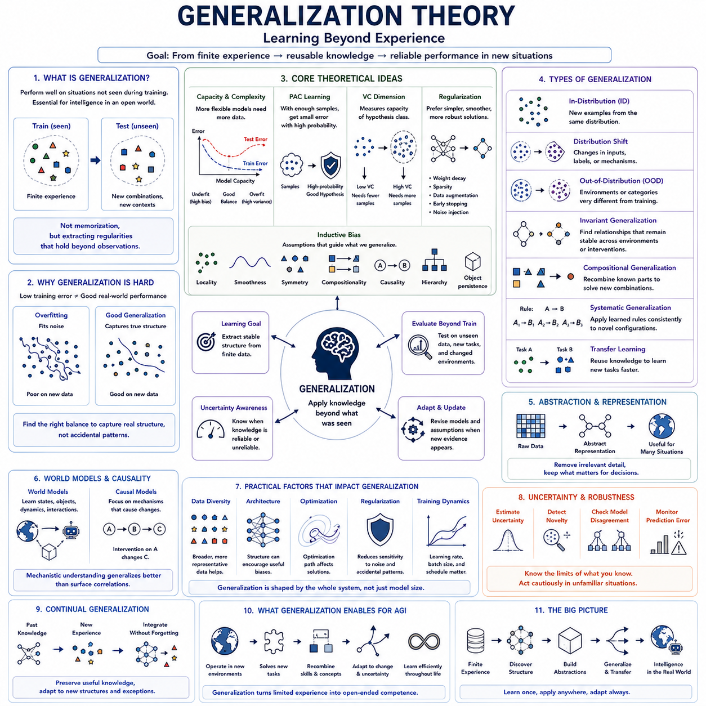{width="7.268055555555556in" height="7.268055555555556in"}

일반화 이론(generalization theory)은 학습 시스템(learning system)이 훈련 과정에서 명시적으로 경험하지 않았던 상황에서도 성공적으로 수행할 수 있는 방법을 연구한다. 이러한 능력은 지능(intelligence)의 근본적인 요소이다. 관측된 사례를 암기하는 것만으로는 열린 세계(open world)에서 작동하기에 충분하지 않기 때문이다. AGI는 유한한 경험으로부터 규칙성(regularity)을 추출하고, 관측, 과제, 환경 또는 익숙한 요소들의 조합이 변화하더라도 이를 이용하여 효과적으로 예측하고 추론하며 행동할 수 있어야 한다.

고전적인 학습 설정(classical learning setting)은 훈련 성능(training performance)과 관측하지 않은 데이터에 대한 기대 성능(expected performance)을 구분한다. 모델은 훈련 오차(training error)를 매우 낮게 만들면서도 훈련 집합 밖에서는 낮은 성능을 보일 수 있다. 따라서 일반화(generalization)는 경험적 성공(empirical success)과 기반 환경(underlying environment)에서 추출된 새로운 샘플에 대한 행동 사이의 관계를 다룬다. 핵심적인 이론적 질문은 데이터, 모델, 학습 알고리즘, 가정의 어떤 특성이 유한한 경험으로부터 관측되지 않은 사례에 대한 신뢰할 수 있는 예측을 가능하게 하는가이다.

통계적 학습 이론(statistical learning theory)은 이러한 질문에 답하기 위한 형식적 기반(formal foundation) 중 하나를 제공한다. 이는 가설 클래스(hypothesis class)의 복잡도, 훈련 샘플(training sample)의 수, 요구되는 신뢰 수준(confidence)이 일반화에 어떻게 영향을 미치는지를 분석한다. 학습자가 너무 적은 증거를 가지고 지나치게 많은 제약 없는 가설 중 하나를 선택한다면 여러 모델이 훈련 데이터를 동일하게 설명하면서도 다른 영역에서는 매우 다르게 행동할 수 있다. 따라서 신뢰할 수 있는 학습에는 가능한 설명의 유효 공간(effective space)을 어느 정도 제어하는 과정이 필요하다.

모델 용량(model capacity)은 가설 클래스가 얼마나 유연한지를 나타낸다. 높은 용량의 모델은 복잡한 관계를 표현할 수 있지만 유한한 훈련 데이터의 우연한 세부사항까지 학습할 수도 있다. 낮은 용량의 모델은 가능한 해법을 제한하여 적은 사례에서도 일반화할 수 있지만 중요한 구조를 표현하지 못할 수 있다. 따라서 일반화는 충분한 표현력(expressive power)을 유지하면서 특정 학습 관측을 넘어 계속 유용할 가능성이 높은 해법을 선호하도록 제약하는 과정의 균형에서 나타난다.

편향-분산 관점(bias--variance perspective)은 이러한 균형을 설명하는 또 다른 방법을 제공한다. 강한 가정은 환경과 일치하지 않을 경우 체계적 오차(systematic error)를 만들 수 있으며, 개별 샘플에 지나치게 민감하면 불안정한 예측이 발생할 수 있다. 효과적인 학습은 잡음(noise)에 과도하게 반응하지 않으면서 지속적인 구조를 포착하는 표현과 가설을 발견하려고 한다. 현대 시스템에서 이러한 균형은 단순히 모델 크기뿐만 아니라 최적화(optimization), 데이터 다양성(data diversity), 정규화(regularization), 아키텍처(architecture), 훈련 동역학(training dynamics)의 영향을 함께 받는다.

확률적으로 근사적으로 올바른 학습(Probably Approximately Correct learning, PAC learning)은 충분한 수의 샘플을 관측한 이후 높은 확률로 작은 오류를 가지는 가설을 학습자가 얻을 수 있는 조건을 형식화한다. 이 프레임워크는 샘플 복잡도(sample complexity)를 가설 클래스의 특성과 요구되는 정확도(accuracy)에 연결한다. 그 가정들은 이상화되어 있지만 개념적으로 중요한 기여를 한다. 즉, 일반화는 유한한 관측과 관측되지 않은 사례에 대한 기대 성능 사이를 연결하는 확률적 보장(probabilistic guarantee)의 문제로 연구할 수 있다.

VC 차원(VC dimension)은 특정 가설 클래스의 용량을 측정하는 고전적인 척도이다. 직관적으로는 모델 클래스가 가능한 사례의 구성을 얼마나 다양하게 구분할 수 있는지를 나타낸다. 일반적으로 용량이 커질수록 비슷한 수준의 일반화 보장(generalization guarantee)을 얻기 위해 더 많은 증거가 필요하다. 현대의 심층 신경망(deep neural network)에서는 단순한 용량 척도만으로 실제 행동을 완전히 설명하기 어렵지만, 학습자의 실질적인 유연성을 이용 가능한 증거의 양과 함께 고려해야 한다는 기본 원리는 여전히 중요하다.

정규화(regularization)는 훈련 데이터에 적합하는 것 이외의 추가적인 선호를 만족하는 해법을 장려한다. 가중치 패널티(weight penalty), 희소성 제약(sparsity constraint), 잡음 주입(noise injection), 데이터 증강(data augmentation), 조기 종료(early stopping), 아키텍처 제약(architectural restriction) 등의 방법은 우연한 패턴에 대한 민감성을 줄일 수 있다. 더 넓은 AGI 관점에서 정규화는 이용 가능한 관측만으로 올바른 모델을 유일하게 결정할 수 없을 때 경험과 양립하는 여러 설명 가운데 특정 설명을 선호해야 한다는 학습 원리를 나타낸다.

따라서 귀납적 편향(inductive bias)은 피할 수 없다. 유한한 데이터셋은 일반적으로 관측되지 않은 입력에서 서로 다른 예측을 하는 여러 가설로 설명될 수 있으므로, 학습자는 관측 영역을 넘어 어떤 방식으로 확장할 것인지 결정하는 가정을 가지고 있어야 한다. 지역성(locality), 평활성(smoothness), 대칭성(symmetry), 조합성(compositionality), 인과 구조(causal structure), 시간적 연속성(temporal continuity), 객체 영속성(object persistence), 계층적 조직(hierarchical organization)은 환경의 규칙성과 일치할 경우 학습을 효율적으로 만드는 편향의 예이다.

일반지능의 과제는 유용한 귀납적 편향이 다양한 영역에서 작동해야 한다는 점이다. 지나치게 전문화된 편향은 좁은 과제군에서는 뛰어난 일반화를 지원하지만 환경 구조가 변화하면 실패할 수 있다. 따라서 AGI는 경험을 통해 선택하거나 결합하고, 약화하거나 강화하거나 학습할 수 있는 유연한 편향(flexible bias)으로부터 이점을 얻는다. 메타학습(meta-learning)은 이전의 여러 과제에서 발견된 규칙성에 따라 학습 전략 자체를 적응시킴으로써 이러한 과정에 기여할 수 있다.

분포 내 일반화(in-distribution generalization)는 훈련 데이터와 대략 동일한 분포에서 추출된 새로운 사례에 대한 성능을 평가한다. 이는 중요하지만 AGI에는 충분하지 않다. 실제 환경은 통계적으로 고정된 상태를 유지하는 경우가 드물기 때문이다. 센서, 위치, 사용자, 물리적 조건, 목표 또는 다른 에이전트의 변화는 데이터 분포를 변화시킬 수 있다. 따라서 일반지능에는 원래 훈련 분포의 일부 가정이 더 이상 성립하지 않을 때도 효과적으로 작동할 수 있는 더 넓은 형태의 일반화가 필요하다.

분포 변화(distribution shift)는 훈련 조건과 실제 운용 조건이 서로 다를 때 발생한다. 공변량 변화(covariate shift)는 입력 분포를 변화시킬 수 있고, 라벨 관계(label relationship)가 달라질 수도 있으며, 완전히 새로운 범주나 메커니즘이 등장할 수도 있다. 강건한 일반화(robust generalization)를 위해서는 학습된 상관관계를 무조건 적용하는 대신 이러한 변화를 감지해야 한다. AGI는 기존 지식이 여전히 적용 가능한지에 대한 불확실성을 표현하고 환경이 익숙한 조건을 벗어날 경우 추가적인 관측, 학습 또는 추론을 할당할 수 있어야 한다.

분포 외 일반화(out-of-distribution generalization)는 한 환경 집합에서 학습한 지식이 훈련 과정에서 경험한 환경과 체계적으로 다른 환경에서도 유용할 수 있는지를 다룬다. 이를 위해서는 안정적인 구조(stable structure)와 우연한 상관관계(incidental correlation)를 분리해야 한다. 하나의 데이터셋에서 높은 예측력을 보이는 특징이 상황 변화에 따라 실패할 수 있는 반면, 기반 메커니즘(underlying mechanism)에 연결된 관계는 더 안정적으로 전이될 수 있다. 따라서 분포 외 일반화(OOD generalization)는 추상화(abstraction), 인과성(causality), 불변성(invariance), 강건한 표현학습(robust representation learning)과 밀접하게 연결된다.

불변 학습(invariant learning)은 여러 환경이나 개입(intervention)에서도 안정적으로 유지되는 관계를 찾는다. 예측 관계가 배경 조건, 도메인(domain), 정책(policy)의 변화에도 유지된다면 하나의 데이터셋에만 존재하는 상관관계보다 더 깊은 구조를 반영할 가능성이 있다. AGI는 이러한 불변성을 활용하여 전이 가능성이 높은 지식을 식별할 수 있다. 그러나 불변성은 항상 조사된 환경의 범위에 상대적이므로 실제로 새로운 메커니즘이 등장하면 기존 가정을 수정할 수 있어야 한다.

조합적 일반화(compositional generalization)는 또 다른 핵심적인 차원을 제공한다. 에이전트가 개별적인 개념, 객체, 관계, 기술(skill)을 이미 이해하고 있더라도 이들이 이전에 경험하지 못한 새로운 방식으로 조합된 상황을 만날 수 있다. 이때 전체 구성을 처음부터 다시 학습하는 대신 알려진 구성요소를 체계적으로 재조합할 수 있어야 한다. 언어, 계획(planning), 수학, 물리적 조작(physical manipulation)은 모두 이러한 능력을 필요로 한다. 따라서 조합적 표현(compositional representation)은 제한된 학습 요소를 훨씬 더 넓은 행동 공간으로 확장할 수 있다.

체계적 일반화(systematic generalization)는 조합적 일반화와 밀접하게 관련되지만 학습된 규칙을 새로운 구성에도 일관되게 적용하는 능력을 강조한다. 에이전트가 특정 상황에서 하나의 관계를 학습했다면 관련 없는 세부사항이 변화하더라도 동일한 기반 구조를 적용할 수 있어야 한다. 체계성이 실패한다는 것은 모델이 재사용 가능한 규칙(reusable rule) 대신 표면적인 상관관계를 학습했을 가능성을 보여준다. 일반지능은 중요한 구조를 그것이 처음 등장했던 구체적인 상황으로부터 분리할 수 있는 표현을 필요로 한다.

전이학습(transfer learning)은 하나의 문제에서 획득한 지식이 다른 문제의 학습 난이도를 감소시키는지를 평가한다. 긍정적 전이(positive transfer)는 필요한 샘플 수, 최적화 시간, 탐색(exploration)을 감소시킬 수 있지만, 부정적 전이(negative transfer)는 이전 지식이 부적절한 가정을 강제할 때 발생한다. 따라서 효과적인 AGI는 단순히 지식을 재사용하는 방법뿐만 아니라 언제 재사용이 타당한지도 판단해야 한다. 과제 사이의 유사성은 표면적인 유사성보다 기반 구조에 따라 추론되어야 한다.

추상화는 특정 의사결정에 불필요한 세부사항을 제거하여 일반화를 가능하게 한다. 내비게이션 시스템(navigation system)은 기하 구조(geometry), 장애물, 주행 가능성(traversability)이 계획에 충분하다면 모든 픽셀을 보존할 필요가 없다. 인과 모델은 객체와 행동 사이의 관계를 유지하면서 미시적인 상호작용을 무시할 수 있다. 좋은 추상화는 지식이 적용될 수 있는 범위를 넓히지만 지나친 추상화는 예외적인 상황에 필요한 정보를 제거할 수 있으므로 또 다른 중요한 절충 관계가 발생한다.

월드 모델(world model)은 재사용 가능한 환경 구조를 포착할 경우 일반화를 위한 강력한 메커니즘을 제공한다. 모든 관측에 대한 행동 반응을 개별적으로 암기하는 대신 에이전트는 상태, 객체, 동역학(dynamics), 상호작용(interaction)에 관한 표현을 학습할 수 있다. 이러한 모델은 훈련에서 직접 경험하지 않았던 구성에 대해서도 예측을 가능하게 하고 후보 미래(candidate future)를 내부적으로 시뮬레이션할 수 있도록 한다. 일반화 성능은 학습된 동역학이 데이터셋에 특화된 패턴이 아니라 안정적인 메커니즘을 얼마나 잘 표현하는지에 달려 있다.

인과 표현(causal representation)은 관측 분포가 변화하더라도 인과 메커니즘이 안정적으로 유지될 수 있기 때문에 일반화를 강화할 수 있다. 특정 행동이 물리적으로 상태 전이(state transition)를 만들어낸다는 사실을 이해하는 것은 두 시각적 패턴이 자주 함께 나타난다는 사실을 학습하는 것보다 더 높은 전이 가능성을 가질 수 있다. 그러나 인과 모델 역시 가정과 선택된 변수에 의존한다. 따라서 단순히 예측 시스템에 인과적 용어를 추가하는 것이 아니라 개입과 관련된 메커니즘을 정확하게 포착하는 인과적 추상화가 필요하다.

일반화에는 보정된 불확실성(calibrated uncertainty)도 포함되어야 한다. 모든 상황에서 자신감 높은 예측을 생성하는 시스템은 익숙하지 않은 조건을 만나기 전까지는 높은 능력을 가진 것처럼 보일 수 있다. 지능형 에이전트는 이전 경험으로 충분히 뒷받침되는 상황과 주의가 필요한 상황을 구분해야 한다. 불확실성 추정(uncertainty estimation), 새로움 감지(novelty detection), 모델 불일치(model disagreement), 예측 오차(prediction error)는 외삽(extrapolation)의 신뢰성이 낮아지는 시점과 추가적인 센싱, 계산, 인간 지원 또는 온라인 적응(online adaptation)이 필요한 시점을 알려줄 수 있다.

지속학습(continual learning)은 일반화 문제를 시간의 흐름으로 확장한다. 환경이 변화함에 따라 에이전트는 이전에 획득한 유용한 일반화를 파괴하지 않으면서 새로운 지식을 통합해야 한다. 새로운 경험은 기존 규칙이 지나치게 좁았음을 보여주거나 새로운 예외를 발견하게 하거나 완전히 새로운 구조를 도입할 수 있다. 따라서 성공적인 지속적 일반화(continual generalization)는 안정적인 지식을 보존하는 것과 기존 가정이 더 이상 적용되지 않는다는 증거가 나타날 때 표현을 수정하는 것 사이의 균형을 필요로 한다.

AGI에서 일반화는 궁극적으로 홀드아웃 테스트 집합(held-out test set)에서 높은 정확도를 달성하는 것보다 훨씬 광범위한 개념이다. 여기에는 과제 사이의 지식 전이, 분포 변화에 대한 적응, 알려진 개념의 새로운 조합, 익숙하지 않은 조건의 인식, 불변 구조의 발견, 이전 지식이 실패할 때 기존 가정을 수정하는 능력이 포함된다. 따라서 평가는 동일한 데이터셋에서 무작위로 분리된 샘플에만 의존하기보다 다양하고 관측되지 않은 환경과 통제된 변화(controlled change)를 포함해야 한다.

궁극적으로 일반화 이론(generalization theory)은 에이전트가 직접 관측할 수 있는 것보다 훨씬 많은 상황을 포함하는 세계에서 유한한 경험이 어떻게 광범위한 역량(competence)을 지원할 수 있는지를 설명한다. AGI는 가능한 모든 상태, 과제, 행동 시퀀스(action sequence)를 암기할 수 없다. 대신 재사용 가능한 구조를 발견하고, 적절한 추상화를 구축하며, 모델 복잡도(model complexity)를 제어하고, 불변성과 인과성을 활용하며, 지식을 전이하고, 자신의 예측이 가지는 한계를 인식해야 한다. 따라서 일반지능은 지식을 획득한 경험 자체를 넘어 그 지식의 유용성을 새로운 상황으로 확장할 수 있는 학습 능력에 의존한다.
