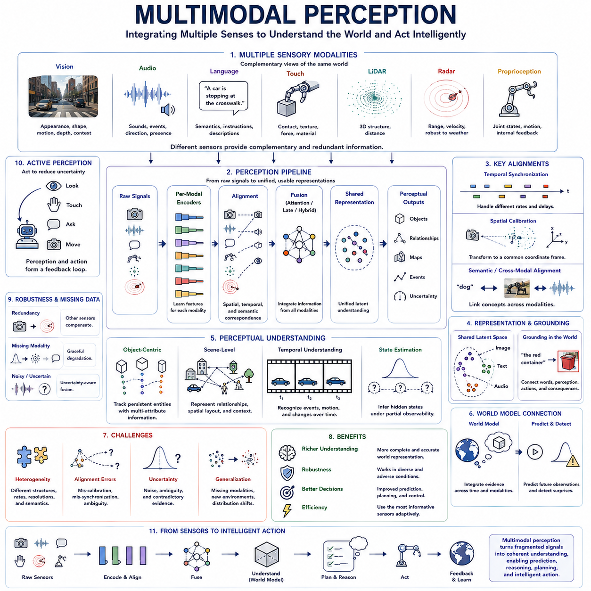
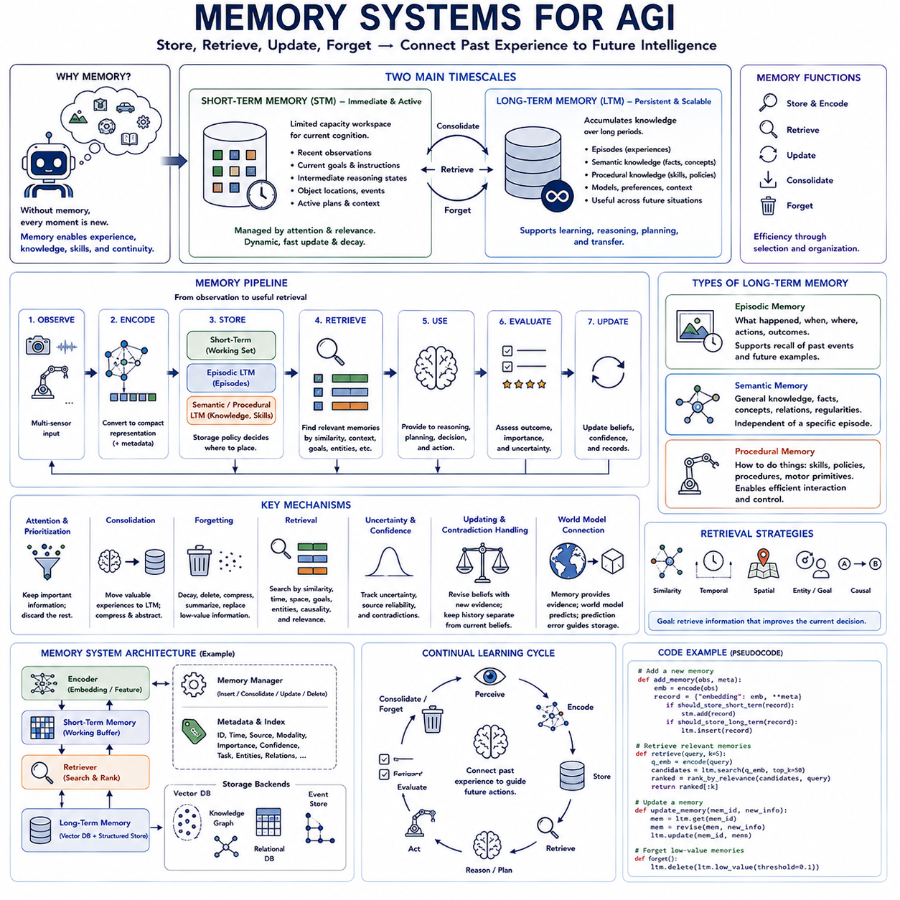
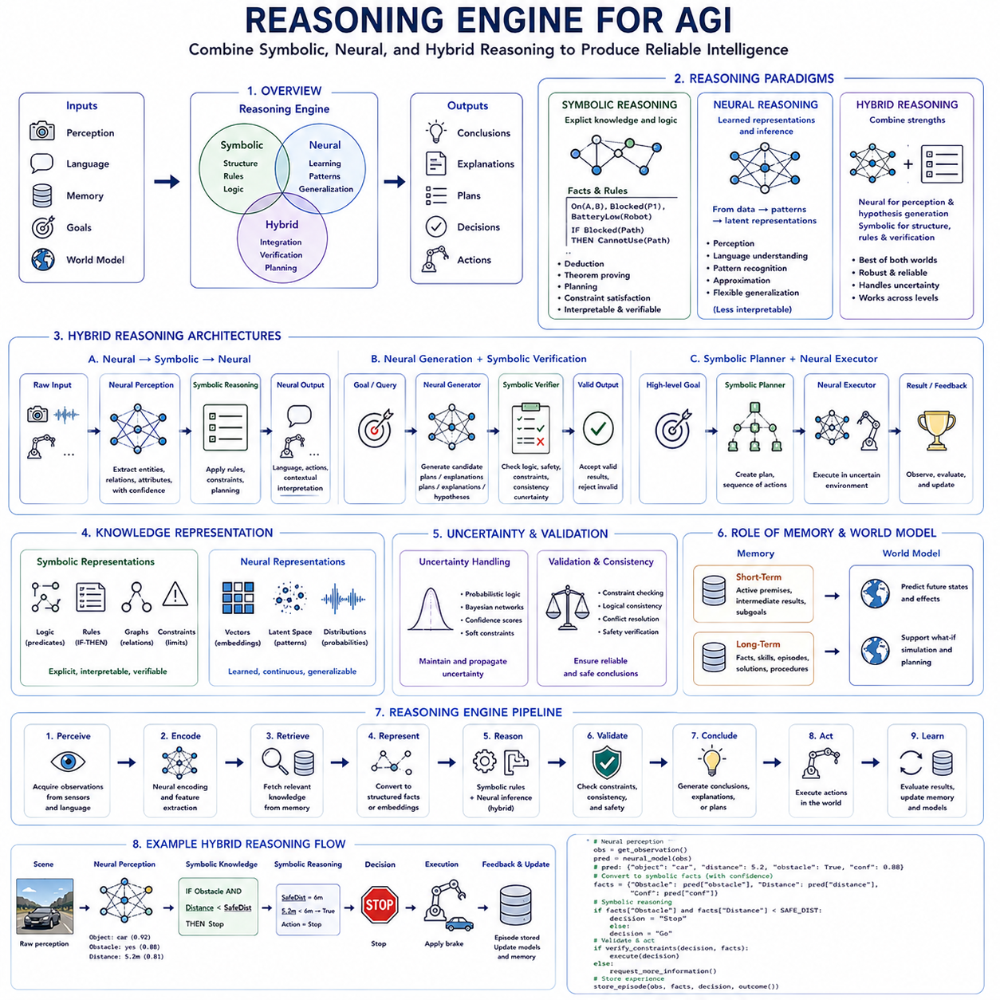
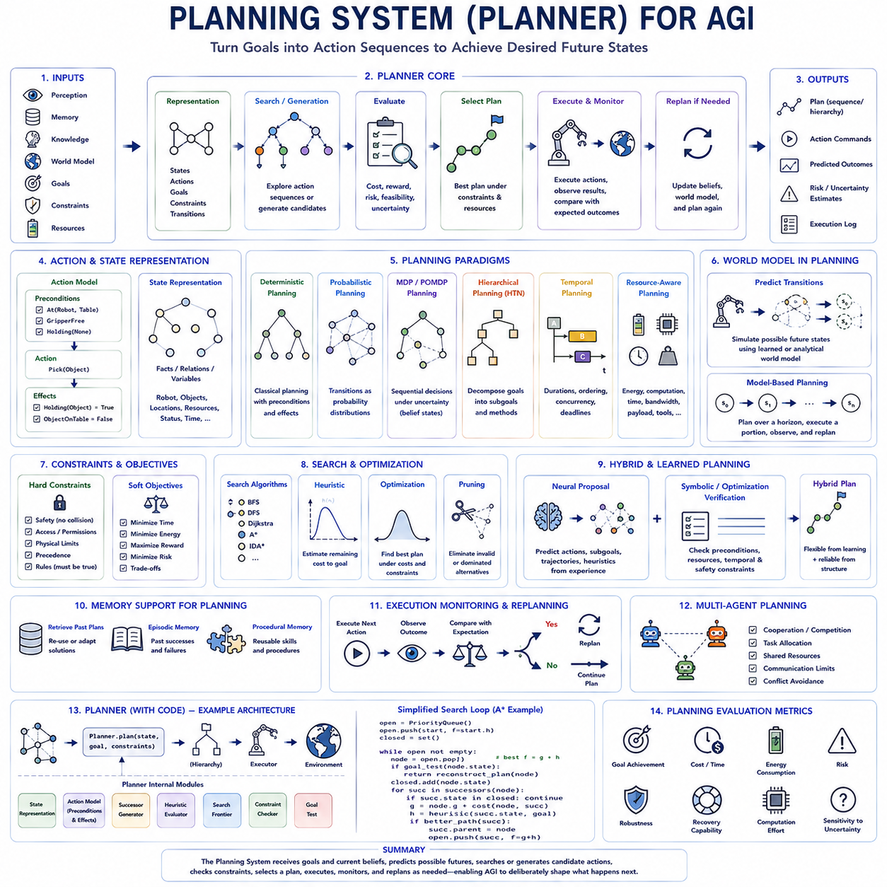
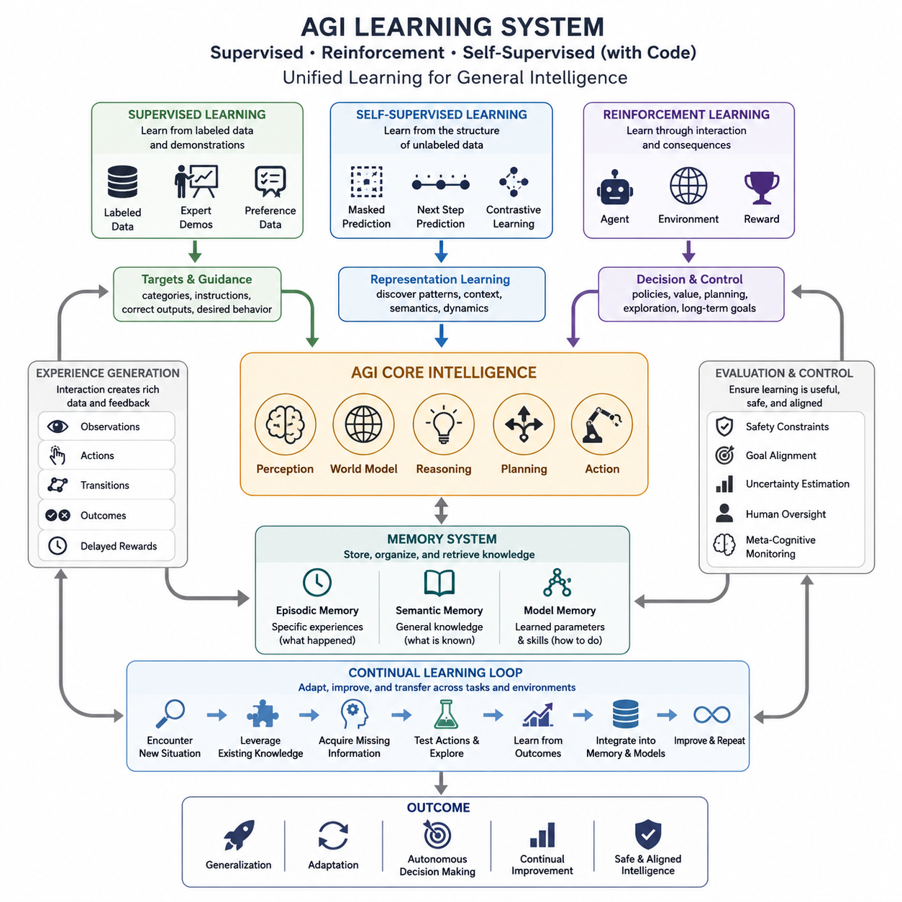
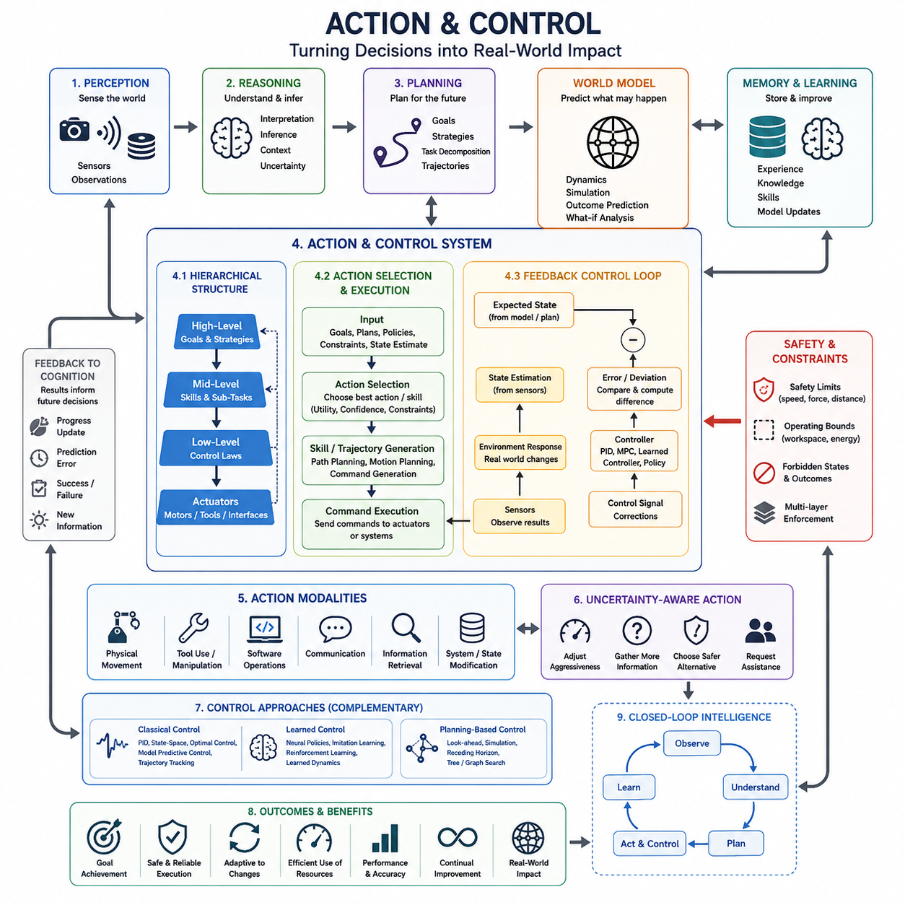
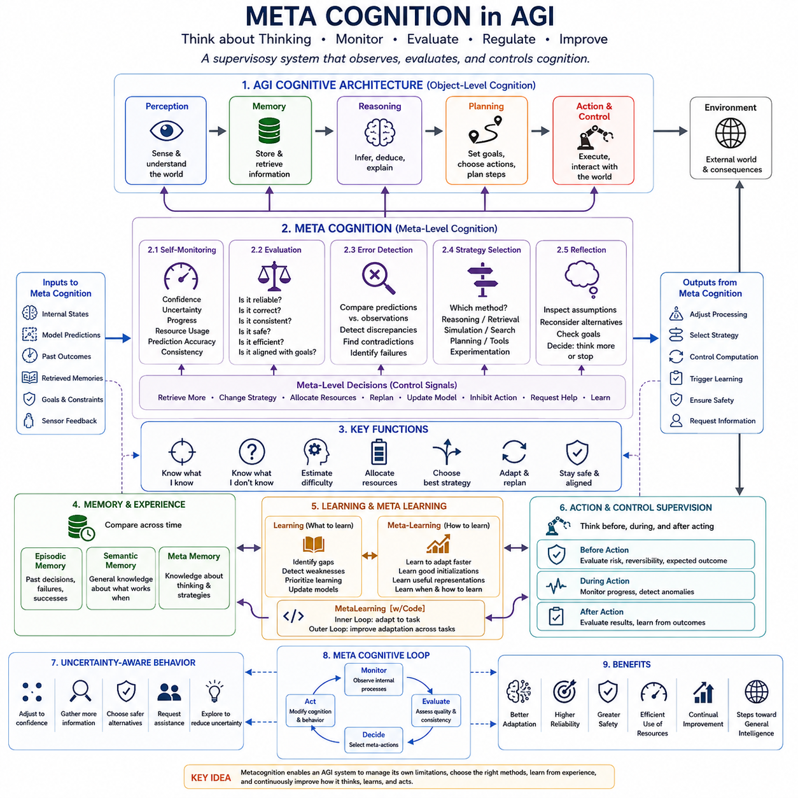
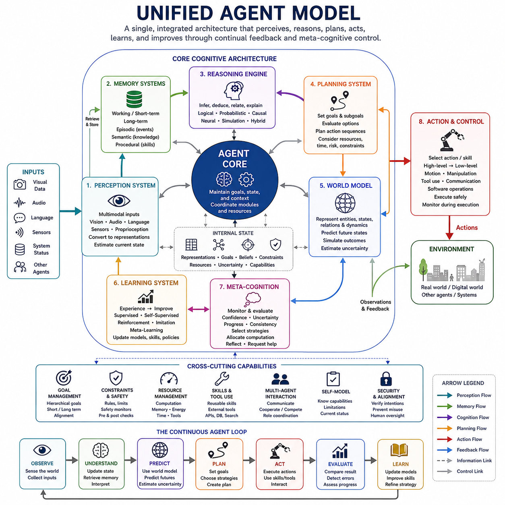

**Volume 47. Artificial General Intelligence**

# Chapter 03. Core Mechanisms

## 03.00. Perception System

{width="7.268055555555556in" height="7.268055555555556in"}

Perception is the process through which an intelligent agent converts raw sensory signals into structured representations of the external world and its own internal state. For AGI, perception cannot be limited to recognizing isolated objects in images. It must continuously organize heterogeneous observations into meaningful entities, events, relations, spatial structures, and temporal patterns that can support reasoning, prediction, memory, planning, and action.

Multimodal perception extends this process by integrating information from multiple sensory modalities. Vision may provide appearance, geometry, motion, and spatial context, while audio reveals events and sources that may not be visible. Language can supply semantic descriptions and instructions, and touch can provide contact, texture, force, and material information. Physical agents may additionally use LiDAR, radar, depth cameras, proprioception, inertial sensors, and positioning systems.

Different modalities provide complementary views of the same environment. A camera may identify an approaching vehicle, radar may estimate its range and relative velocity, and audio may reveal an emergency siren outside the current field of view. None of these observations alone necessarily provides a complete description. Multimodal intelligence emerges when the system combines complementary evidence into a coherent interpretation that is more informative and robust than any individual sensory channel.

Multimodal perception is difficult because sensory streams differ substantially in structure. Images are organized spatially, audio signals evolve rapidly through time, language consists of discrete symbolic sequences, and proprioceptive measurements describe the agent\'s own configuration. Sensors may also operate at different frequencies, resolutions, coordinate systems, and latency levels. A general perception architecture must therefore transform heterogeneous inputs into representations that can be meaningfully compared, aligned, and integrated.

Representation learning provides a mechanism for converting raw modality-specific signals into useful internal features. Separate encoders can transform images, audio, language, depth, or other observations into latent representations that capture relevant structure. These representations may preserve modality-specific information while also exposing shared concepts. Successful multimodal learning requires deciding which information should remain specialized and which should become aligned across sensory domains.

Alignment establishes correspondence between information arriving through different modalities. A spoken word may correspond to an object in a visual scene, a tactile event may coincide with visible contact, and a LiDAR cluster may correspond to an image region representing the same physical object. Alignment may occur spatially, temporally, semantically, or through combinations of these dimensions. Reliable correspondence is essential before information from different sensors can be fused meaningfully.

Temporal synchronization is particularly important for embodied intelligence. Sensors frequently operate at different sampling rates and experience different processing delays. If observations representing different moments are fused as though they were simultaneous, the resulting world representation may become geometrically or dynamically inconsistent. Time synchronization, timestamp management, motion compensation, and temporal association therefore form important foundations for multimodal perception in rapidly changing environments.

Spatial calibration provides another necessary form of alignment. Sensors mounted at different physical positions observe the environment from different coordinate frames. Their relative transformations must be known or estimated so that measurements can be expressed within a common geometric representation. Camera calibration, LiDAR-camera calibration, radar alignment, and transformations between sensor, robot, and world coordinate systems enable observations from physically separated sensors to describe consistent locations.

Fusion determines how aligned multimodal information is combined. Early fusion integrates relatively low-level features, allowing interactions among modalities to be learned from the beginning of processing. Late fusion combines higher-level predictions or decisions generated independently by modality-specific systems. Intermediate fusion operates between these extremes, exchanging latent features at selected processing stages. The appropriate strategy depends on sensor characteristics, task requirements, computational resources, and robustness needs.

Attention mechanisms provide flexible methods for multimodal fusion. Cross-attention can allow visual features to select relevant language information, language tokens to attend to image regions, or one sensor stream to retrieve useful features from another. Instead of combining all information uniformly, attention assigns different relevance to observations according to context. This becomes increasingly important as the number of sensors and the volume of multimodal data grow.

A shared latent space can support cross-modal understanding by mapping related observations into nearby internal representations. An image of an object, its textual description, and perhaps its associated sound can then share semantic structure despite originating from different modalities. Such representations enable cross-modal retrieval, grounding, transfer, and reasoning. However, complete alignment is not always desirable because each modality may contain unique information that should not be discarded merely to achieve representational similarity.

Grounding connects abstract representations to perceptual experience. Language such as "the red container beside the door" becomes useful to an embodied agent only when the relevant concepts can be associated with entities and relations in the current environment. Multimodal grounding therefore links words, visual regions, spatial relationships, actions, and sensory consequences. For AGI, grounding helps connect symbolic or linguistic knowledge with the continuously changing physical world in which decisions must be executed.

Object-centric perception organizes observations around persistent entities rather than treating sensory input as an undifferentiated stream. An object can accumulate visual appearance, geometry, motion, semantic identity, tactile properties, and interaction history across time. This representation supports object permanence and enables reasoning about entities even when they become temporarily occluded. Object-centric multimodal models can therefore provide useful building blocks for memory, causal reasoning, manipulation, and planning.

Scene-level perception extends beyond individual objects by representing relationships and environmental context. An intelligent agent may need to understand that one object is inside another, that a person is approaching a doorway, or that an obstacle blocks a planned route. Scene graphs, spatial maps, semantic maps, and structured latent representations can encode such relationships. Multimodal evidence can enrich these structures by combining geometric, semantic, dynamic, and contextual information.

Temporal perception transforms isolated observations into events and processes. Intelligence requires understanding not only what exists but what is happening and how situations are changing. Tracking, motion estimation, event recognition, temporal segmentation, and sequence modeling help connect observations across time. A multimodal system may combine visible motion, sound, language, and proprioceptive feedback to infer events that would remain ambiguous from a single instantaneous observation.

Multimodal perception also supports state estimation under partial observability. No sensor continuously observes every relevant property of the world, and objects may disappear behind obstacles or outside the field of view. The agent must therefore combine current observations with memory and predictions to estimate hidden states. Recurrent models, filtering methods, belief representations, and world models can maintain hypotheses about aspects of the environment that are not directly observable at the present moment.

Uncertainty is essential because different modalities can be noisy, ambiguous, or contradictory. A perception system should not treat every measurement as equally reliable. Sensor uncertainty, environmental conditions, model confidence, and disagreement among modalities can influence how evidence is weighted. Probabilistic fusion and uncertainty-aware representations allow an agent to preserve multiple hypotheses when evidence is insufficient rather than prematurely committing to a potentially incorrect interpretation.

Sensor redundancy improves robustness when several modalities provide overlapping information. Vision may degrade in darkness or fog, while radar or LiDAR may continue to provide useful geometric measurements. Audio can provide cues when visual information is occluded, while proprioception remains available when external sensing becomes unreliable. A capable multimodal architecture should exploit redundancy dynamically instead of assuming that every modality will always remain equally informative.

Missing modalities create an important generalization challenge. A system trained with a fixed combination of sensors may fail when one stream becomes unavailable, corrupted, delayed, or replaced. Robust multimodal perception therefore benefits from modality dropout, redundant representations, conditional computation, and models capable of operating with variable sensor subsets. AGI should degrade gracefully when information disappears rather than collapsing because one expected input is absent.

Active perception adds action to the perceptual process. An intelligent agent does not need to remain a passive receiver of observations; it can move a camera, change its viewpoint, approach an object, touch a surface, ask a question, or reposition itself to reduce uncertainty. Perception and action consequently form a feedback loop in which the agent chooses observations according to their expected value for understanding the environment and achieving current goals.

Multimodal perception is closely connected to world modeling because sensory observations are evidence about an underlying state rather than complete descriptions of reality. A world model can integrate information across modalities and time into persistent latent states, predict how those states will evolve, and generate expectations about future observations. Prediction errors can then indicate unexpected events, sensor failures, environmental changes, or limitations in the agent\'s existing internal model.

Large multimodal models extend perception by learning correspondences among images, language, audio, video, and other data at scale. They can provide broad semantic representations and transfer knowledge between modalities, allowing linguistic knowledge to assist visual interpretation or visual experience to ground language. However, broad semantic competence alone does not guarantee reliable physical perception, particularly when precise geometry, timing, uncertainty, and real-world interaction are required.

Embodied AGI places especially demanding requirements on multimodal perception. The system must transform high-bandwidth sensory streams into actionable representations under strict constraints on latency, energy, memory, and computation. Perception must remain sufficiently fast for control while preserving enough semantic and geometric information for higher-level reasoning. Hierarchical processing can help by separating rapid local responses from slower, richer interpretation and deliberation.

Ultimately, multimodal perception provides the interface between an intelligent agent and the world it must understand. Its purpose is not merely to combine sensors, but to construct coherent, persistent, uncertainty-aware representations from heterogeneous evidence. By integrating alignment, fusion, grounding, temporal reasoning, object structure, memory, active sensing, and world models, AGI can transform fragmented observations into a unified perceptual foundation for prediction, reasoning, planning, and intelligent action.

## 03.01. Memory Systems

{width="7.268055555555556in" height="7.268055555555556in"}

Memory systems are fundamental to general intelligence because an intelligent agent must preserve useful information beyond the moment in which it is perceived. Without memory, every observation would disappear after processing and each situation would effectively begin from zero. An AGI memory architecture must therefore retain experience at multiple timescales, retrieve relevant knowledge when needed, update stored information, and selectively forget material that no longer contributes to prediction, reasoning, planning, or action.

Short-term memory maintains information required for immediate cognition and ongoing interaction. It may contain recent observations, current goals, intermediate reasoning states, active instructions, object locations, and unresolved events. Its capacity is necessarily limited because maintaining every incoming signal would consume excessive computation and introduce irrelevant information. Short-term memory therefore functions as a dynamic workspace in which currently useful information remains accessible while less relevant details rapidly decay or are replaced.

Working memory can be considered the active computational component of short-term memory. Rather than simply storing recent information, it maintains representations that are being manipulated during reasoning and decision making. An agent solving a navigation problem, for example, may temporarily preserve its destination, nearby obstacles, candidate routes, and recent movement history. Working memory connects perception with reasoning by keeping task-relevant state available across multiple computational steps.

The contents of short-term memory should be controlled by attention and relevance. High-priority observations, unexpected events, current goals, and information required by active plans should remain available longer than repetitive or predictable signals. This selective mechanism prevents the memory workspace from becoming saturated with redundant sensory details. For embodied AGI, such prioritization is particularly important because continuous cameras, LiDAR, audio, proprioception, and other sensors can generate far more information than can be retained directly.

Long-term memory preserves information beyond the immediate interaction and enables knowledge to accumulate across extended experience. It can contain semantic knowledge, learned skills, environmental models, previous episodes, user-specific context, successful plans, failures, and abstract concepts. Unlike short-term memory, long-term memory is intended to support future situations that may occur hours, days, or much later, allowing an intelligent agent to benefit from experience rather than repeatedly rediscovering the same knowledge.

Episodic memory represents particular experiences situated in time and context. An episode may describe where the agent was, what it observed, what action it performed, and what happened afterward. Such memories support questions about previous events and provide examples for future reasoning. In an autonomous robot, episodes can preserve encounters with difficult terrain, navigation failures, unusual objects, or successful recovery actions that may later guide behavior in similar circumstances.

Semantic memory represents generalized knowledge that is not tied to one particular episode. Repeated experiences can reveal persistent facts, concepts, relationships, and regularities that become independent of the circumstances in which they were originally learned. Knowledge that doors connect spaces, batteries lose charge during operation, or particular objects support certain functions can be represented semantically. This allows experience to be transformed from isolated records into reusable knowledge.

Procedural memory stores knowledge related to how actions and skills are performed. Instead of recalling a detailed verbal description of every control step, an agent may preserve policies, action sequences, motor primitives, planning procedures, or learned controllers that can be executed when appropriate. Procedural memory is especially important for embodied intelligence because competent behavior depends not only on knowing facts about the world but also on retaining efficient ways of interacting with it.

Memory consolidation connects short-term and long-term memory. Not every temporary observation deserves permanent storage, so the system must determine which experiences contain lasting value. Novel events, repeated patterns, important outcomes, failures, high-reward experiences, and information strongly connected to current goals may receive greater consolidation priority. Consolidation can also transform detailed episodes into compressed semantic knowledge, reducing storage while preserving reusable structure.

Forgetting is not simply a defect of memory but an important computational mechanism. Unlimited retention creates storage costs and can make retrieval increasingly difficult as irrelevant experiences accumulate. Memory systems therefore require policies for decay, deletion, compression, summarization, and replacement. Information that is repetitive, obsolete, unreliable, or weakly relevant can be removed or reduced, while rare and consequential experiences may be preserved for substantially longer periods.

Retrieval determines which stored information becomes available to current cognition. A useful memory system cannot search every stored record exhaustively whenever the agent encounters a new situation. Instead, retrieval can use semantic similarity, temporal context, spatial context, entities, goals, causal relationships, or learned relevance functions. The objective is not merely to retrieve memories that resemble the current input, but to retrieve information that can improve the current decision or reasoning process.

Modern AI systems often implement long-term memory using vector representations and similarity search. Text, images, events, or structured records can be encoded into embeddings and stored in a vector database or related retrieval structure. A current query is encoded into the same representation space, allowing nearby memories to be identified efficiently. This mechanism provides a practical foundation for retrieval-augmented generation and agent memory, although semantic similarity alone does not guarantee usefulness.

Structured memory can complement vector retrieval by explicitly storing entities, relationships, timestamps, locations, confidence values, and causal links. Knowledge graphs, relational databases, event stores, and symbolic records can preserve information that is difficult to recover reliably from embeddings alone. Hybrid memory systems can therefore combine semantic retrieval with structured filtering, allowing an agent to search by meaning while also enforcing temporal, spatial, logical, or task-specific constraints.

A practical memory system can be implemented as a pipeline connecting encoding, storage, retrieval, update, and forgetting. Incoming observations are first transformed into compact representations and assigned metadata such as time, source, importance, confidence, and modality. A storage policy determines whether they remain in short-term memory, enter episodic long-term storage, or contribute to semantic knowledge. Retrieval later selects relevant records and injects them into the agent\'s active reasoning context.

The coding architecture for such a system benefits from modular interfaces. A short-term memory module can maintain a bounded buffer or prioritized working set, while a long-term module manages persistent storage. An encoder converts observations into embeddings or structured representations, a retriever ranks candidate memories, and a memory manager controls insertion, consolidation, update, and deletion. Separating these responsibilities allows storage technologies and retrieval algorithms to change without redesigning the entire agent.

Memory records should contain more than raw content. Useful fields can include identifiers, timestamps, source modality, semantic embeddings, importance scores, confidence estimates, task identifiers, referenced entities, and relationships to other memories. Episodic records may additionally contain observations, actions, rewards, and resulting states. Such metadata enables retrieval policies to combine semantic relevance with recency, reliability, importance, and contextual compatibility instead of depending on a single similarity score.

Memory updating is necessary because stored knowledge can become incorrect. Environments change, earlier observations may be revised, and new evidence may contradict previous beliefs. A robust memory system should therefore distinguish immutable historical episodes from mutable knowledge claims. Episodes can preserve what was observed at a particular time, while semantic memory can maintain current beliefs together with confidence and provenance. New evidence can then revise knowledge without rewriting the historical record.

Contradiction handling becomes increasingly important as memory grows. Two memories may describe different states because the world changed, because sensors were uncertain, or because one record was incorrect. The system should not automatically merge conflicting information into a single statement. Temporal ordering, source reliability, confidence, and contextual differences can help determine whether memories represent genuine contradiction, environmental change, or distinct situations requiring separate representations.

Memory and world models are closely connected. Memory provides evidence from previous states and transitions, while a world model extracts reusable structure from those experiences to predict future states. Episodic memory can preserve unusual transitions that challenge the current model, and semantic memory can retain regularities learned across many episodes. Prediction errors can in turn determine which new experiences deserve storage, creating a feedback loop between remembering, learning, and predicting.

Memory also supports continual learning by allowing new knowledge to be integrated without relying exclusively on permanent parameter updates. An agent can immediately store a new experience and retrieve it when needed before sufficient data exists for model retraining. Over time, frequently useful memories may be consolidated into model parameters or higher-level semantic structures. This creates multiple learning timescales, ranging from immediate storage to gradual representation and policy adaptation.

For AGI, memory retrieval should ultimately be decision-aware. The most similar memory is not necessarily the most useful memory. An unusual failure from years earlier may be more important than hundreds of recent routine experiences if the current situation contains the same risk. Advanced memory systems should therefore estimate the expected value of retrieved information for prediction, planning, uncertainty reduction, safety, and goal achievement rather than ranking memories only by surface similarity.

A complete memory architecture consequently forms a continuous cycle: perceive, encode, hold, retrieve, reason, act, evaluate, consolidate, and forget. Short-term memory maintains the active cognitive state, long-term memory preserves accumulated experience and knowledge, and the memory management system determines how information moves between them. Together these mechanisms allow an intelligent agent to connect its present situation with its past while preserving resources for future learning.

Ultimately, memory transforms intelligence from a sequence of disconnected reactions into a persistent adaptive process. Short-term memory provides continuity across immediate computation, long-term memory accumulates episodes, knowledge, and skills, and an implemented memory system coordinates storage, retrieval, consolidation, updating, and forgetting. For AGI, effective memory is therefore not merely a database of the past, but an active mechanism that determines which parts of experience remain available to shape future understanding, reasoning, and action.

## 03.02. Reasoning Engine

{width="7.268055555555556in" height="7.268055555555556in"}

A reasoning engine is the component of an intelligent system that transforms available knowledge, observations, goals, and intermediate representations into conclusions, explanations, plans, or decisions. For AGI, reasoning cannot rely on a single fixed mechanism because different problems demand different forms of inference. Some tasks require explicit logical consistency, others depend on statistical pattern recognition, and many real-world problems require both structured rules and learned representations working together.

Symbolic reasoning represents knowledge using explicit symbols, relations, rules, predicates, graphs, or logical expressions. It can support deduction, theorem proving, planning, constraint satisfaction, and rule-based decision making. Because relationships are represented explicitly, symbolic systems can often provide interpretable reasoning traces and enforce hard constraints. This makes them useful when correctness, consistency, traceability, or domain rules are important.

A symbolic knowledge representation may describe facts such as (On(A,B)), (Blocked(Path_1)), or (BatteryLow(Robot)), together with rules that derive new conclusions from existing facts. If a rule states that a blocked path cannot be selected for navigation, a symbolic reasoner can eliminate it explicitly. The reasoning process is therefore based on manipulating structured statements according to defined inference procedures rather than relying only on statistical similarity.

Deductive reasoning is one of the strongest capabilities of symbolic systems. Given accepted premises and valid rules, the system derives conclusions that logically follow from them. This property is valuable for planning, formal verification, configuration, diagnosis, and safety logic. However, deduction depends heavily on the quality and completeness of the available knowledge base, and real environments frequently contain uncertainty, incomplete information, ambiguous observations, and exceptions that are difficult to encode manually.

Symbolic reasoning also suffers from knowledge acquisition and scalability problems. Large rule bases can become difficult to construct, maintain, and search, while small changes in the environment may require substantial updates to manually designed representations. Symbolic systems can struggle with raw sensory inputs because pixels, audio waveforms, and high-dimensional observations do not naturally arrive as clean symbols. They therefore often require a perception or grounding layer that converts continuous data into structured entities and relations.

Neural reasoning approaches the problem from the opposite direction. Neural networks learn representations and transformations directly from data, allowing them to discover statistical regularities without requiring every rule to be explicitly specified. Deep networks can map complex observations into latent spaces where relationships become easier to model. This gives neural reasoning strong capabilities in perception, language, pattern recognition, approximation, and generalization across large and noisy datasets.

Large language models demonstrate a powerful form of neural reasoning in which learned representations support multi-step inference, analogy, explanation, code generation, and planning-like behavior. These abilities emerge from training over large corpora rather than from a manually encoded logical knowledge base. Neural models can therefore handle open-ended and ambiguous problems more flexibly than conventional rule systems, particularly when relevant knowledge is distributed across many examples and contexts.

Neural reasoning, however, does not automatically guarantee logical consistency. A model may generate a plausible conclusion that conflicts with explicit constraints or previously stated facts. Internal representations are distributed rather than directly interpretable, making it difficult to determine exactly why a conclusion was produced. Neural systems can also be sensitive to distribution shifts, prompt variations, missing context, and insufficiently represented cases, which creates challenges for high-reliability reasoning.

Another limitation is that neural models often represent uncertainty and knowledge implicitly. The presence of a pattern in learned parameters does not necessarily indicate whether the model has strong evidence, weak evidence, or contradictory evidence for a particular conclusion. Techniques such as calibrated confidence, retrieval, probabilistic modeling, self-consistency, and model ensembles can improve reliability, but neural inference still benefits from external mechanisms that monitor constraints and validate important outputs.

Symbolic and neural reasoning therefore provide complementary strengths. Symbolic systems offer explicit structure, compositional rules, interpretability, and constraint handling, while neural systems provide flexible perception, representation learning, approximation, and pattern-based generalization. A hybrid reasoning engine attempts to combine these capabilities so that learned models can process complex observations while symbolic components enforce structure, manipulate explicit knowledge, and verify critical conclusions.

A simple hybrid pipeline may begin with neural perception and representation learning. An image, language instruction, or multimodal observation is transformed into entities, attributes, relations, and confidence values. These structured outputs are passed to a symbolic reasoning layer that applies rules, constraints, or planning operators. The resulting conclusions may then be returned to a neural model for language generation, action selection, or context-sensitive interpretation.

Another hybrid design uses a neural model to propose hypotheses while a symbolic component tests them. A language model may generate candidate plans, mathematical steps, or possible explanations, and a verifier can reject candidates that violate logical, physical, or safety constraints. This architecture separates creative search from structured validation. It is especially useful when the hypothesis space is too large for pure symbolic enumeration but unrestricted neural generation would be insufficiently reliable.

The reverse relationship is also possible. A symbolic planner can generate a high-level sequence of goals or actions, while neural policies execute each symbolic step in uncertain physical environments. For example, a planner may decide to navigate to an object, grasp it, and place it at a destination, while neural controllers handle perception, grasp pose estimation, and motor control. Hybrid reasoning therefore allows different abstraction levels to use different computational mechanisms.

Neuro-symbolic representations attempt to integrate these mechanisms more deeply by allowing symbols and differentiable neural representations to interact within the same learning system. Logical relations may constrain neural outputs, while neural embeddings can provide soft similarity between symbolic entities. Differentiable logic, graph neural networks, neural theorem proving, and structured latent models illustrate different ways to connect continuous learning with explicit relational structure.

For AGI, hybrid reasoning is particularly valuable because reasoning must operate across uncertain perception and explicit goals. A robot may receive noisy sensor data, infer that an object is probably a tool, retrieve semantic knowledge about that tool, apply task constraints, and plan a safe sequence of actions. No single representation is ideal for every stage. Continuous neural features are useful for perception, while symbolic structures can better represent discrete goals, relations, and constraints.

Memory further strengthens the reasoning engine. Short-term memory maintains active premises, intermediate conclusions, and unresolved subgoals, while long-term memory supplies relevant facts, previous solutions, procedures, and episodes. A reasoning engine can retrieve knowledge before inference and store useful conclusions afterward. This creates a cycle in which reasoning uses memory and simultaneously produces new information that can improve future reasoning.

World models provide another important input. Reasoning about possible actions requires predictions of how the environment may change. Neural world models can estimate future latent states, while symbolic models can represent explicit causal or relational constraints. A hybrid reasoner may use neural simulation to generate likely future trajectories and symbolic evaluation to determine whether those trajectories satisfy goals, safety requirements, resource limits, or logical conditions.

Uncertainty must be maintained across all reasoning styles. Symbolic facts may be uncertain because they originate from imperfect sensors, while neural predictions may have limited confidence. Hybrid systems can attach probabilities or confidence values to symbols and propagate them through reasoning. Probabilistic logic, Bayesian networks, factor graphs, and uncertainty-aware neural models provide mechanisms for combining discrete structure with uncertain evidence rather than assuming that every proposition is simply true or false.

A practical reasoning engine with code can be organized around modular interfaces. A neural module accepts raw or embedded observations and returns candidate concepts or hypotheses. A symbolic module maintains structured facts and applies rules. A hybrid coordinator decides when to call each component, converts representations between them, tracks confidence, and resolves conflicts. A verifier can additionally check outputs against explicit constraints before conclusions are passed to the planner or action system.

In code, symbolic reasoning can be represented using rules such as \`if obstacle_detected and distance \< threshold: stop = True\`, while neural inference produces values such as object identity, free-space probability, or predicted trajectory. The hybrid controller then converts neural outputs into symbolic predicates when confidence exceeds an appropriate threshold, evaluates relevant rules, and may request additional perception when evidence is insufficient. The important architectural principle is separation between learned estimation and explicit decision constraints.

The coordinator should not always force neural predictions into hard symbols. Premature discretization can discard useful uncertainty. Instead, a hybrid system can maintain soft predicates, confidence distributions, or multiple competing hypotheses until sufficient evidence becomes available. This allows symbolic reasoning to operate with uncertain inputs while preserving the flexibility of neural representations. More reliable decisions emerge when the system knows which conclusions are definite and which remain provisional.

Reasoning depth should also adapt to task difficulty. Familiar low-risk situations may be handled by fast neural inference or cached symbolic procedures, while novel or safety-critical situations can trigger deeper search, explicit verification, retrieval, simulation, or multiple reasoning passes. Resource-aware reasoning prevents an AGI from spending maximum computation on every problem and connects the reasoning engine with broader mechanisms for adaptive computation and bounded rationality.

Ultimately, symbolic, neural, and hybrid reasoning should be viewed as complementary mechanisms rather than mutually exclusive alternatives. Symbolic reasoning contributes explicit structure and verifiability, neural reasoning contributes learned representations and flexible generalization, and hybrid reasoning coordinates both within a common decision process. For AGI, the most capable reasoning engine is likely to combine learned pattern recognition with explicit knowledge, memory, uncertainty, world models, planning, and validation so that intelligence can remain both flexible and disciplined.

## 03.03. Planning System

{width="7.268055555555556in" height="7.268055555555556in"}

Planning is the process through which an intelligent agent transforms goals into organized sequences of actions that can move the current state toward a desired future state. A planning system must reason beyond immediate reactions by considering possible consequences before acting. For AGI, planning connects perception, memory, reasoning, world models, and action, allowing the agent to select behavior according to future outcomes rather than only current observations.

A planner operates over representations of states, actions, goals, constraints, and expected transitions. The current state describes what the agent believes about the environment, while the goal defines conditions that should eventually become true. Actions describe possible interventions and their effects. Planning searches through combinations of these actions to identify trajectories that satisfy goals while respecting physical, logical, temporal, safety, and resource constraints.

Classical planning represents actions through explicit preconditions and effects. An action can be executed only when its preconditions are satisfied, and execution changes the state according to defined effects. For example, a robot may grasp an object only when it is near the object and the gripper is available. Such structured representations make planning interpretable because each step can be examined in terms of why it is applicable and what state transformation it produces.

State-space planning searches directly through possible configurations of the world. Forward search begins from the current state and repeatedly applies available actions until a goal state is reached. Backward search begins with goal conditions and determines which actions could produce them, recursively identifying required predecessor states. The efficiency of either approach depends strongly on the size of the state space and the quality of mechanisms used to guide search.

Search algorithms provide the computational foundation for many planners. Breadth-first search can discover short paths but becomes expensive when branching is large, while depth-first approaches reduce memory requirements but can explore poor branches. Algorithms such as Dijkstra\'s algorithm and A\* introduce path costs and heuristics, enabling search to prioritize promising states. A useful heuristic estimates how far a candidate state remains from achieving the desired goal.

Planning becomes significantly more difficult when actions have uncertain outcomes. A robot may attempt to grasp an object and fail, a navigation route may become blocked, or another agent may behave unexpectedly. Probabilistic planning therefore represents transitions as distributions over possible future states rather than deterministic transformations. The planner must then compare actions according to expected outcomes, risks, uncertainty, and the possibility of recovering when predictions are incorrect.

Markov Decision Processes provide a formal framework for sequential decisions under stochastic transitions. A state summarizes relevant information, actions influence transition probabilities, and rewards describe preferences over outcomes. A policy specifies which action should be selected in each state. Planning in an MDP therefore seeks policies that maximize expected cumulative reward rather than simply identifying one predetermined sequence that reaches a goal.

Partial observability introduces another layer of complexity because the agent may not know the true state of the environment. In a Partially Observable Markov Decision Process, planning operates over belief states representing probability distributions over possible states. Actions can then have both physical value and informational value. An agent may deliberately gather additional observations before committing to an action when uncertainty is too high for reliable decision making.

Hierarchical planning reduces complexity by decomposing large goals into smaller subgoals. Instead of searching directly over every low-level action, the planner can first construct an abstract sequence such as navigate, inspect, grasp, transport, and place. Each abstract operation can then be expanded into more detailed procedures. Hierarchical Task Networks formalize this idea by representing methods that decompose high-level tasks into progressively more concrete subtasks.

Hierarchical planning is particularly important for AGI because real objectives can span very different temporal and abstraction scales. A high-level planner may reason about objectives lasting minutes or hours, while lower-level planners determine trajectories lasting seconds and controllers generate commands at much higher frequencies. Separating these levels prevents strategic reasoning from becoming overwhelmed by every motor detail while preserving the ability to translate abstract goals into physical actions.

Temporal planning explicitly represents action duration, ordering, concurrency, and deadlines. Many real actions do not occur instantaneously, and several activities may execute simultaneously when their resource requirements do not conflict. A planner may need to charge a battery while processing data or coordinate several robots performing different subtasks. Temporal constraints therefore extend planning from determining what should happen to determining when and in what order events should occur.

Resource-aware planning considers limited quantities such as energy, computation, memory, time, communication bandwidth, payload capacity, and available tools. A theoretically valid plan may be impossible if it consumes more battery than the robot possesses or requires unavailable computational resources. AGI planners should therefore evaluate feasibility together with goal achievement, ensuring that selected plans remain executable under the actual limitations of the agent and environment.

Constraint-based planning incorporates requirements that must remain satisfied throughout execution. Safety zones, collision avoidance, access permissions, operational rules, precedence relationships, and physical limits can restrict the space of acceptable plans. Constraint satisfaction and optimization techniques can eliminate invalid alternatives before execution. Hard constraints represent conditions that cannot be violated, while soft constraints allow trade-offs when no solution satisfies every preference simultaneously.

World models are central to advanced planning because planning fundamentally requires reasoning about futures that have not yet occurred. A world model predicts how states may change following candidate actions. The planner can use these predictions to simulate alternative trajectories, estimate their consequences, and compare them before interacting with the real environment. The quality of planning therefore depends strongly on the accuracy and generalization capability of the underlying transition model.

Model-based planning repeatedly uses a learned or predefined dynamics model to evaluate candidate actions. Techniques such as model predictive control plan over a finite future horizon, execute only the first portion of the selected plan, observe the resulting state, and plan again. This receding-horizon strategy is robust to prediction errors because decisions are continually updated using new observations instead of relying on a long open-loop action sequence.

Planning can also use neural models to generate candidate solutions. A learned planner may predict promising actions, subgoals, trajectories, or complete plans from previous examples. Neural planning can reduce expensive search by exploiting patterns learned across related tasks. However, generated plans may violate explicit constraints or contain inconsistent steps, so neural planning often benefits from symbolic verification, simulation, or optimization before actions are executed.

Hybrid planning combines learned proposal mechanisms with explicit search and verification. A neural model can identify promising regions of the search space, generate candidate subgoals, estimate heuristic values, or predict likely outcomes. A symbolic or optimization-based planner can then enforce preconditions, resource limits, temporal relationships, and safety constraints. This combination provides the flexibility of learned planning while retaining structured guarantees where they are required.

Memory contributes to planning by providing previous plans, outcomes, failures, environmental knowledge, and reusable procedures. When a similar problem has been encountered before, the planner may retrieve an earlier successful solution rather than beginning search from zero. Case-based planning can adapt stored plans to new circumstances, while episodic memory can reveal failure patterns that should be avoided. Planning therefore improves as experience accumulates across repeated interactions.

Planning and reasoning are closely related but perform different roles. Reasoning derives conclusions from available information, whereas planning searches for interventions that can transform the environment toward desired conditions. Reasoning may determine that a corridor is blocked, while planning decides which alternative route should be taken. In an integrated AGI architecture, conclusions produced by the reasoning engine become constraints, facts, predictions, or hypotheses used by the planner.

A practical Planner implementation can expose a modular interface such as \`plan(state, goal, constraints)\` and return an ordered or hierarchical set of actions. Internally, the planner may contain a state representation, action model, successor generator, heuristic evaluator, search frontier, constraint checker, and goal test. Separating these components allows algorithms such as A\*, task decomposition, trajectory optimization, or learned search policies to be exchanged without redesigning the surrounding agent architecture.

A simplified search implementation can maintain nodes containing the current state, accumulated cost, heuristic estimate, and action history. The planner removes the most promising node from a priority queue, tests whether its state satisfies the goal, generates valid successor states, calculates their costs, and inserts promising alternatives back into the queue. This loop continues until a valid plan is found, computational limits are reached, or the planner determines that the current goal cannot be achieved.

Real planning systems should not assume that a generated plan will execute exactly as predicted. Execution monitoring compares expected state transitions with actual observations after actions occur. If the observed state deviates beyond acceptable limits, the system can modify the remaining plan or invoke replanning. This creates a closed planning loop of plan, execute, observe, compare, and replan rather than treating planning as a one-time computation performed before action begins.

Replanning is especially important in dynamic environments. Humans, vehicles, robots, obstacles, communication conditions, and available resources can change while a plan is being executed. Continually rebuilding the complete plan may be computationally expensive, so incremental planning can preserve valid portions while repairing affected sections. The planner must balance responsiveness against computation, changing plans when necessary without reacting unnecessarily to insignificant environmental fluctuations.

Multi-agent planning extends these principles to situations where several agents interact. Plans must account for cooperation, competition, shared resources, communication limitations, and the actions of other agents. Tasks may be allocated according to capability, location, energy, or workload, while trajectories must avoid conflicts. In multi-robot systems, planning therefore includes both individual action selection and coordination of collective behavior toward shared or compatible goals.

Planning quality should be evaluated using more than whether the final goal was achieved. Useful measures include execution cost, time, energy consumption, risk, robustness, computational effort, recovery capability, and sensitivity to uncertainty. Different goals may require different optimization criteria. An AGI planner must therefore support multi-objective decision making and select appropriate trade-offs according to context rather than optimizing a single universal metric.

Ultimately, the planning system converts intelligence about the world into purposeful future-directed behavior. The Planner receives goals and current beliefs, retrieves relevant knowledge, predicts possible state transitions, searches or generates candidate actions, checks constraints, selects a plan, monitors execution, and replans when necessary. By integrating search, hierarchy, uncertainty, world models, memory, reasoning, learning, and feedback, planning enables AGI to move from understanding what is happening to deliberately shaping what happens next.

## 03.04. Learning System

{width="7.268055555555556in" height="7.268055555555556in"}

A learning system in artificial general intelligence must do more than optimize a model for one fixed dataset. It must continuously convert experience into reusable knowledge, adapt to changing environments, and improve future perception, reasoning, planning, and action. Within the AGI core architecture, learning therefore acts as a cross-cutting mechanism connecting memory, world models, reasoning, planning, and control rather than as an isolated training stage.

Supervised learning provides the most direct mechanism for acquiring mappings from examples whose desired outputs are known. Given observations paired with labels, targets, demonstrations, or structured answers, the system adjusts its internal parameters so that similar inputs produce appropriate predictions. Classification, regression, object recognition, language understanding, imitation from expert demonstrations, and many forms of task-specific adaptation can all be expressed through this paradigm.

For AGI, however, supervised learning should be understood as one component of a broader learning architecture rather than the dominant mechanism. Human-created labels are expensive, incomplete, and inevitably cover only a small fraction of situations that a general agent may encounter. A system trained exclusively on labeled examples can become highly competent within the distribution represented by its training data while remaining fragile when objectives, environments, concepts, or combinations of skills change.

The important contribution of supervised learning is therefore the injection of explicit semantic and behavioral structure. Labels can establish categories, demonstrations can communicate desirable behavior, preference data can distinguish better responses from worse ones, and carefully curated examples can ground abstract capabilities in human-defined objectives. These signals can shape representations that were previously acquired through much larger amounts of unlabeled experience and specialize them for tasks requiring precise interpretation or control.

Reinforcement learning addresses a fundamentally different learning problem. Instead of being told the correct output for every observation, an agent interacts with an environment, selects actions, observes their consequences, and receives signals indicating how desirable those consequences are. Learning becomes sequential because an action can change the state from which future decisions are made, while rewards may occur substantially later than the decisions responsible for producing them.

This formulation makes reinforcement learning especially relevant to autonomous agents. An AGI system must often determine not merely what an observation means but what it should do next. It must evaluate alternatives, balance immediate and delayed outcomes, explore uncertain possibilities, and construct policies that maximize expected long-term utility. These requirements connect reinforcement learning directly with planning, decision making, world modeling, memory, and action-and-control mechanisms elsewhere in the core architecture.

Value-based approaches estimate the expected future return associated with states or actions, while policy-based approaches directly optimize the behavior used to select actions. Actor-critic systems combine these perspectives by learning both a policy and an evaluation mechanism. Model-based reinforcement learning adds another important capability: the agent learns or uses a model of environmental dynamics so that possible futures can be simulated before real actions are executed.

For general intelligence, the distinction between learning and planning consequently becomes increasingly blurred. A learned world model can predict how states evolve, a planner can search predicted trajectories, and reinforcement signals can determine which trajectories are desirable. Experience generated during interaction can then improve the world model and policy, creating a closed loop in which prediction, action, evaluation, memory, and subsequent learning continuously influence one another.

Self-supervised learning provides the third major foundation because most information available to an intelligent system arrives without externally supplied labels. Instead of requiring a human to specify the correct target, the learning process derives training signals from the structure of the data itself. Parts of an observation may be hidden and predicted from the remainder, future states may be predicted from previous states, or different views of the same underlying object or event may be encouraged to produce related representations.

Masked modeling illustrates this principle clearly. A portion of text, an image, a sensor stream, or another structured observation is removed or corrupted, and the model learns to reconstruct or predict the missing information. Success requires the system to capture statistical relationships among observable elements. At sufficient scale, this simple objective can produce representations containing semantic, contextual, spatial, temporal, and relational information that later tasks can reuse.

Contrastive and representation-based methods approach the same objective from another direction. Instead of predicting every raw input value, the system learns an embedding space in which related observations become close while irrelevant or incompatible observations remain distinguishable. Such learning is particularly valuable for multimodal AGI because images, language, audio, proprioception, LiDAR, actions, and other sensory streams must eventually refer to shared objects, events, states, and concepts.

Temporal self-supervision is especially important for embodied intelligence. Consecutive observations are not arbitrary samples: they are connected by physical dynamics and by the agent\'s own actions. Predicting the next observation, latent state, motion, consequence of an action, or longer future trajectory encourages the system to discover regularities of the environment. These learned dynamics can become the foundation of an internal world model used for anticipation and planning.

The practical implementation marked by SelfSupervised [w/Code] can therefore be viewed as a representation-learning pipeline rather than merely another classifier. Raw observations are transformed by an encoder into latent representations, a self-generated objective compares predictions or representations against targets derived from the data, and gradient-based optimization updates the encoder. The resulting representation can subsequently support supervised fine-tuning, reinforcement learning, retrieval, prediction, or planning.

These three learning paradigms are most powerful when they cooperate. Self-supervised learning can absorb enormous quantities of unlabeled experience and construct general representations. Supervised learning can attach explicit meanings, task objectives, and human demonstrations to those representations. Reinforcement learning can then refine behavior through interaction and consequences. The same underlying model may therefore pass through several learning regimes rather than belonging permanently to only one category.

A general agent can also generate new learning data through its own behavior. Interaction produces trajectories containing observations, actions, state transitions, successes, failures, and delayed outcomes. These trajectories can simultaneously provide reinforcement signals and self-supervised prediction targets. Successful experiences may become demonstrations for later supervised or imitation learning, while failures can identify uncertain states that deserve additional exploration, simulation, or human guidance.

Memory further transforms learning from parameter optimization into cumulative intelligence. Episodic memory can retain particular experiences, semantic memory can preserve generalized knowledge, and learned model parameters can encode statistical regularities across many experiences. When these mechanisms interact, the agent does not need to compress every useful fact immediately into neural weights. It can retrieve past experiences, compare them with current situations, and decide what should be consolidated through additional learning.

A mature AGI learning system must also manage stability and plasticity. Excessive plasticity causes newly acquired knowledge to overwrite useful previous capabilities, while excessive stability prevents meaningful adaptation. Replay, regularization, modular representations, selective parameter updates, external memory, continual-learning strategies, and periodically refreshed training mixtures can help preserve important competencies while allowing the system to incorporate new environments, concepts, and skills.

Learning must ultimately be controlled by higher-level objectives. An autonomous system capable of improving from experience needs mechanisms for deciding which experiences are trustworthy, which errors deserve correction, when exploration is justified, and whether a learned behavior remains compatible with safety constraints and intended goals. Evaluation, uncertainty estimation, human oversight, and meta-cognitive monitoring therefore become part of the learning process rather than external activities performed only after training.

The resulting architecture is not simply Supervised plus RL plus Self-Supervised learning operating independently. It is a unified adaptive cycle in which self-supervision builds representations and predictive structure, supervision introduces explicit knowledge and desired behavior, and reinforcement learning connects knowledge to consequential action. Memory preserves experience, world models predict consequences, reasoning evaluates alternatives, and planning organizes behavior across time.

From an AGI perspective, the deepest purpose of this learning system is continual adaptation across tasks rather than optimization for a single benchmark. A generally intelligent agent should be able to encounter unfamiliar observations, exploit previously learned representations, infer what knowledge transfers, acquire missing information, test actions, learn from outcomes, and integrate the resulting experience into future behavior. This capacity turns learning from a training procedure into a persistent mechanism of intelligence.

## 03.05. Action and Control

{width="7.268055555555556in" height="7.268055555555556in"}

Action and control form the execution layer through which an intelligent agent converts internal decisions into changes in the external world. Perception estimates the current situation, reasoning interprets its meaning, and planning identifies desirable future states, but none of these capabilities produces practical intelligence unless the system can select and execute actions. In an AGI architecture, action therefore closes the loop between internal cognition and environmental consequences.

The action system receives goals, plans, policies, constraints, and current state estimates from higher-level cognitive modules and transforms them into executable commands. These commands may correspond to physical motion, software operations, communication, tool use, information retrieval, or changes to other systems. The exact interface depends on the embodiment of the agent, but the underlying function is consistent: transform abstract intention into controllable behavior.

Control operates at a shorter and more continuous timescale than high-level planning. A planner may decide that a robot should move to a destination, grasp an object, or inspect a region, while the controller must continuously regulate velocity, position, force, orientation, and actuator output so that the intended behavior is realized. This separation allows long-horizon reasoning to coexist with rapid feedback correction required by dynamic environments.

A useful AGI control architecture is hierarchical. At the highest level, the agent selects goals and strategies. Intermediate layers convert those goals into skills, trajectories, or sub-actions, while lower levels generate precise control signals. Such decomposition reduces computational complexity and allows different mechanisms to operate at appropriate temporal resolutions, from milliseconds for stabilization to seconds or minutes for deliberate planning.

Feedback is fundamental to reliable control. Open-loop execution assumes that the environment behaves exactly as predicted, while closed-loop control repeatedly compares expected and observed states and corrects deviations. For intelligent agents operating in uncertain environments, closed-loop control is essential because disturbances, modeling errors, sensor noise, moving objects, and unexpected events continuously invalidate purely predetermined action sequences.

State estimation connects perception to control. The controller rarely has direct access to the true environmental state and instead acts on estimates derived from sensors, memory, and predictive models. These estimates may include position, velocity, object relationships, task progress, uncertainty, and hidden contextual variables. The quality of action consequently depends not only on the controller itself but also on how accurately the system represents the state being controlled.

Classical control techniques remain important even in advanced AGI systems. Proportional-integral-derivative control, state-space control, optimal control, model predictive control, and trajectory tracking provide mathematically structured methods for regulating well-defined dynamical systems. These techniques are particularly useful when system dynamics are sufficiently known, safety margins are important, and predictable real-time behavior is required.

Model predictive control is especially relevant to intelligent systems because it repeatedly predicts future system behavior over a finite horizon and chooses actions that optimize an objective while respecting constraints. After executing only part of the planned sequence, the system observes the new state and solves the optimization problem again. This receding-horizon strategy naturally connects prediction, planning, and feedback control.

Learned control extends these approaches when dynamics are difficult to model analytically. Neural policies can map sensory or latent states directly to actions, while learned dynamics models can support planning and predictive control. Reinforcement learning can optimize policies from interaction, and imitation learning can acquire behavior from expert demonstrations. These methods expand the range of controllable tasks but also introduce uncertainty, distribution shift, and verification challenges.

For AGI, purely reactive control is insufficient because many actions must be chosen according to context, goals, and future consequences. The same immediate observation may require different actions depending on previous events, current objectives, available resources, safety constraints, or predicted future states. Action selection therefore depends on memory, reasoning, and world models rather than only on current sensory input.

The world model plays an important role in action because it enables the agent to estimate what may happen before an action is executed. Candidate actions can be simulated internally, producing predicted state transitions and possible outcomes. The planning system can compare these futures, while the control system implements the selected trajectory. Real observations then provide prediction errors that can improve both the world model and future control decisions.

Action selection must also account for uncertainty. When state estimates or model predictions are unreliable, aggressive actions may create unacceptable risk. An intelligent controller should therefore adapt behavior according to confidence, potentially slowing down, gathering additional information, selecting a safer alternative, or requesting assistance. Uncertainty-aware action provides an important connection between epistemic limitations and safe autonomous behavior.

Safety constraints should operate throughout the action hierarchy rather than being added only after planning. High-level objectives may define forbidden outcomes, intermediate layers may restrict allowable trajectories, and low-level controllers may enforce physical limits such as speed, torque, acceleration, separation distance, or operating boundaries. Multiple layers of constraint enforcement reduce dependence on any single decision mechanism.

A control system must distinguish desired behavior from feasible behavior. A planner can request a state that cannot be achieved because of physical limitations, environmental obstacles, insufficient energy, unavailable tools, or incompatible constraints. The action layer therefore needs feasibility checks that determine whether a proposed action can actually be executed and, when necessary, return failure information to planning for revision.

Skill abstraction provides a bridge between individual control commands and complex intelligent behavior. Instead of reasoning directly over thousands of actuator updates, an AGI system can represent reusable capabilities such as navigate, grasp, open, inspect, communicate, search, or manipulate. Each skill may internally contain perception, local planning, and feedback control, allowing the reasoning system to compose sophisticated tasks from reusable behavioral primitives.

Skill execution also requires termination conditions and monitoring. The system must determine whether a behavior succeeded, failed, became unsafe, or should be interrupted because the environment changed. Monitoring therefore runs alongside execution, comparing expected progress with actual observations. When deviations become significant, the agent can retry, switch strategies, replan, or escalate control to a higher cognitive layer.

Long-horizon action requires coordination between many short-horizon control episodes. Complex objectives may consist of hundreds or thousands of intermediate decisions whose outcomes depend on previous actions. Hierarchical planning, persistent memory, progress tracking, and dynamic replanning allow the agent to preserve the overall objective while adapting local behavior as conditions change.

In embodied AGI, action is closely linked to exploration. Movement changes what the agent can perceive, which means action is not merely an output but also a mechanism for acquiring information. An agent may reposition a sensor, approach an object, manipulate it, or enter another region specifically to reduce uncertainty. This active perception creates a loop in which actions are selected partly for their informational value.

Energy and resource management are additional aspects of intelligent control. Physical agents operate with limited battery capacity, computation, communication bandwidth, actuator lifetime, and time. Software agents also face resource limits such as memory, processing budgets, external tool costs, and latency. Effective action selection must therefore optimize not only task success but also the resources required to achieve it.

Multi-objective control becomes necessary when several goals must be satisfied simultaneously. Performance, safety, energy efficiency, speed, precision, comfort, information gain, and long-term system health may conflict. An AGI controller must balance these factors according to context rather than optimizing a single fixed metric. This requires coordination between utility estimation, policy selection, constraint handling, and meta-level reasoning.

Action execution generates new experience that feeds learning. Each observation-action-transition sequence provides evidence about environmental dynamics, policy effectiveness, controller accuracy, and unexpected conditions. Successful trajectories can reinforce effective skills, while failures reveal limitations in perception, planning, world modeling, or control. The action layer is therefore both an execution mechanism and a continuous source of training data.

The Control [w/Code] implementation can be organized around a modular interface connecting state input, action generation, execution, feedback, and safety monitoring. A controller receives a target state or task command, computes an action according to a selected policy or control law, sends the command to an environment or actuator interface, observes the resulting state, and repeats this process until completion or interruption.

Such an implementation benefits from separating high-level action interfaces from platform-specific control details. The same reasoning system should ideally issue abstract commands regardless of whether the underlying agent is a mobile robot, manipulator, software agent, autonomous vehicle, or simulated system. Adapter layers can translate abstract skills into platform-specific commands, improving portability and allowing intelligence components to be reused across embodiments.

For AGI, effective action and control ultimately require coordination rather than one universal algorithm. Classical feedback control provides precision and stability, learned policies provide adaptation, planning provides long-term structure, world models provide prediction, and safety mechanisms constrain behavior. Memory and learning improve future decisions, while feedback continually corrects current execution.

The complete action system therefore closes the perception--reasoning--planning--action loop. The agent observes the world, constructs an internal state, predicts possible futures, selects a goal-directed action, executes it through control, observes the consequences, and updates its knowledge. Repeating this cycle enables intelligent behavior to remain adaptive, physically or computationally grounded, and responsive to changing conditions.

From an AGI perspective, successful control is not merely accurate movement or command execution. It is the ability to translate abstract intentions into reliable, adaptive, safe, and context-sensitive interaction with the world. When tightly integrated with perception, memory, world modeling, reasoning, planning, learning, and evaluation, action and control transform internal intelligence into autonomous behavior capable of producing meaningful real-world outcomes.

## 03.06. Meta Cognition

{width="7.268055555555556in" height="7.268055555555556in"}

Metacognition is the capacity of an intelligent system to represent, observe, evaluate, and regulate aspects of its own cognitive activity. Instead of only perceiving the environment or solving an external problem, a metacognitive agent also estimates how well it understands the situation, whether its reasoning is reliable, which knowledge is missing, and whether its current strategy should continue or change.

Within an AGI architecture, metacognition functions as a supervisory layer across perception, memory, reasoning, planning, learning, and action. These components produce beliefs, predictions, plans, and behaviors, while the metacognitive system evaluates their quality and consistency. It therefore does not replace ordinary cognition; it monitors cognition and provides signals that can modify how cognitive resources and strategies are used.

A useful distinction can be made between object-level cognition and meta-level cognition. Object-level processes solve the immediate task, such as recognizing an object, answering a question, selecting a route, or controlling a robot. Meta-level processes reason about those processes themselves, asking whether the recognition is uncertain, whether the answer is sufficiently supported, or whether the selected route remains appropriate.

Self-monitoring is one of the most fundamental metacognitive functions. An intelligent agent should maintain estimates of confidence, uncertainty, task progress, resource consumption, prediction accuracy, and internal consistency. These estimates provide information about the reliability of current cognition. A system that produces an answer without knowing when its evidence is weak lacks an important capability required for robust general intelligence.

Confidence estimation should not simply reproduce the strength of an internal activation or probability. A capable system must distinguish between familiar situations where predictions are well supported and unfamiliar situations where its model may be unreliable. Calibration connects expressed confidence with empirical correctness, allowing the agent to determine whether additional reasoning, observation, retrieval, simulation, or external assistance is justified.

Error detection extends monitoring from uncertainty to explicit discrepancies. The system can compare predictions with observations, planned progress with actual progress, retrieved knowledge with current evidence, or independent reasoning paths with one another. Significant disagreement becomes a metacognitive signal indicating that some internal assumption, representation, model, strategy, or action may need to be reconsidered.

Metacognition also supports strategy selection. Many problems can be approached through direct pattern recognition, retrieval, symbolic reasoning, simulation, search, planning, experimentation, or tool use. Rather than applying the same computational procedure to every problem, an AGI system should estimate which strategy is appropriate for the current situation and switch strategies when evidence indicates that the existing approach is ineffective.

This capability introduces adaptive computation. Simple and familiar situations may require only inexpensive processing, while novel, ambiguous, or safety-critical situations may justify deeper reasoning and additional verification. Metacognition can therefore regulate computational effort according to estimated difficulty, uncertainty, and risk, allowing the system to allocate limited processing resources where they provide the greatest expected benefit.

Reflection is a more deliberate form of metacognitive processing. After generating an intermediate result, the system can inspect assumptions, identify contradictions, reconsider alternatives, and evaluate whether the result satisfies the original objective. Reflection can occur before an action, during execution, or after completion, enabling both immediate correction and longer-term improvement of future reasoning strategies.

However, unlimited reflection is not necessarily beneficial. Repeated reconsideration consumes time and computation and can sometimes introduce unnecessary changes into an already adequate solution. A metacognitive system therefore needs stopping criteria that determine when additional reasoning is likely to provide sufficient value. The decision to think further becomes itself an optimization problem involving expected improvement, cost, urgency, and risk.

Memory is essential to metacognition because self-evaluation requires comparison across time. Episodic memory can preserve previous decisions, failures, corrections, and successful strategies, while semantic memory can store generalized knowledge about which approaches tend to work under particular conditions. The agent can use these records to recognize recurring mistakes and avoid treating every problem as an entirely new situation.

Metacognition can also regulate memory operations. The system may decide which experiences deserve long-term storage, which retrieved memories are relevant, which information should be consolidated, and which outdated knowledge should receive less weight. In this sense, metacognition manages not only reasoning but also the flow of information between working processes and persistent knowledge structures.

Planning benefits from meta-level monitoring because long-horizon plans rarely unfold exactly as expected. The system can monitor milestones, detect deviations, estimate remaining uncertainty, and determine whether replanning is necessary. Minor deviations may be handled locally, while major changes can trigger a return to higher-level reasoning. This prevents both excessive replanning and blind commitment to an obsolete plan.

Action and control similarly require metacognitive supervision. Before executing an action, the system can assess expected consequences, confidence, reversibility, and safety. During execution, it can monitor whether outcomes remain within acceptable bounds. If confidence falls or unexpected conditions appear, the agent may slow down, stop, gather more information, request assistance, or transfer control to a safer mechanism.

The world model provides another important source of metacognitive information. Predictions generated by the world model can be compared with actual observations to measure model reliability. Persistent prediction errors may indicate that the environment has changed or that the model is incomplete. The agent can then reduce reliance on uncertain predictions and prioritize additional observation or learning.

Metacognition is closely connected to learning because an intelligent system must determine not only what to learn but also when and why learning is needed. Repeated failures can reveal missing skills, poorly represented concepts, inaccurate dynamics, or inadequate training data. The meta-level system can identify these deficiencies and direct learning toward the components most responsible for performance limitations.

This relationship leads naturally to meta-learning, or learning to learn. Instead of optimizing only task-specific parameters, meta-learning attempts to improve the mechanisms that determine how adaptation occurs. Experience across many tasks can teach the system which initialization, representation, optimization strategy, memory mechanism, or adaptation rule allows new tasks to be learned more efficiently. The attached structure explicitly associates Meta_Cognition with MetaLearning [w/Code].

A MetaLearning [w/Code] implementation can represent this distinction through an inner learning process and an outer optimization process. The inner process adapts a model to a particular task or environment, while the outer process evaluates adaptation across multiple tasks and modifies the initial model or learning procedure. The objective is therefore not merely better performance on one task, but improved capacity to acquire competence across future tasks.

Optimization-based meta-learning can search for parameters from which only a small number of updates are required for adaptation. Metric-based approaches can learn representation spaces in which unfamiliar examples can be compared efficiently with previously encountered examples. Memory-based approaches can preserve task patterns and rapidly retrieve useful prior experience, reducing the amount of new learning required when related situations appear.

For AGI, meta-learning should extend beyond rapid parameter adaptation. The agent may learn which reasoning strategies work best for different problem classes, which tools should be selected, how much computation should be allocated, when external information is required, or when a learned policy should be trusted. Meta-learning thus becomes a mechanism for improving the architecture\'s own adaptive behavior rather than merely tuning one predictive model.

Self-evaluation requires appropriate criteria. Accuracy alone may be insufficient because an autonomous system must also consider robustness, efficiency, uncertainty, safety, consistency, progress toward goals, and resource usage. Different tasks may require different combinations of these criteria. Metacognition therefore depends on an evaluation model capable of judging cognition relative to the current objective and operational context.

A mature system should also distinguish between correctable uncertainty and fundamental lack of knowledge. In some cases additional computation can resolve ambiguity; in others the system requires new observations, external knowledge, experimentation, or human guidance. Recognizing this distinction prevents wasteful internal reasoning and enables the agent to choose an information-gathering action when thinking alone cannot solve the problem.

Metacognitive control creates a feedback loop across the entire cognitive architecture. Cognitive modules generate results, the meta-level system evaluates those results, and control signals modify subsequent processing. The system may retrieve more information, change a reasoning method, allocate additional computation, revise a plan, update a model, inhibit an unsafe action, or initiate learning. The outcome is then evaluated again.

Such a loop is particularly important for continual operation. An AGI agent may function for long periods while encountering tasks that were not anticipated during initial training. Fixed processing policies cannot optimally address every future situation. Metacognition enables the agent to recognize novelty, detect degradation, reorganize its strategy, and exploit accumulated experience without requiring complete redesign whenever conditions change.

Metacognition should nevertheless remain constrained by safety and external objectives. A system capable of modifying its learning strategies, resource allocation, or internal policies requires boundaries defining which adaptations are permitted. Monitoring, auditability, human oversight, and protected safety constraints can ensure that improvement of cognitive performance does not silently redefine the goals or limitations under which the agent is expected to operate.

In a unified AGI architecture, metacognition can therefore be understood as cognition about cognition combined with control of cognition. It observes internal processes, estimates confidence and uncertainty, detects errors, evaluates progress, chooses strategies, regulates resources, triggers reflection, directs learning, and determines when assistance is required. Meta-learning extends this capability by allowing experience to improve the mechanisms of adaptation themselves.

The long-term significance of metacognition is that intelligence becomes capable of managing its own limitations. A general agent cannot possess complete knowledge or perfect models of every environment, but it can become increasingly capable of recognizing what it knows, identifying what it does not know, selecting methods appropriate to each situation, learning from failure, and improving how it learns. This self-regulatory capacity is a central bridge from task-specific competence toward adaptive general intelligence.

## 03.07. Unified Agent Model [w/Code]

{width="7.268055555555556in" height="7.268055555555556in"}

A unified agent model brings the core mechanisms of artificial general intelligence into a single operational system. Perception, memory, reasoning, planning, learning, action and control, and metacognition are no longer treated as isolated capabilities. They exchange information through shared internal states and recurrent feedback, allowing the agent to pursue goals while continuously adapting its interpretation and behavior.

The central idea is integration rather than simply placing several intelligent modules next to one another. A perception system may recognize the environment, a reasoning engine may derive conclusions, and a planner may construct action sequences, but general agency requires their outputs to influence one another coherently. The unified agent therefore maintains a common operational context that represents what is happening, what matters, and what should happen next.

Perception begins the interaction cycle by transforming observations into internal representations. Visual information, language, audio, spatial signals, proprioception, sensor measurements, or digital events can all contribute to the estimated state of the environment. Instead of treating observations as independent inputs, the agent relates them to previous observations and existing knowledge so that entities, relationships, events, and changes can be interpreted consistently.

Memory gives this processing continuity across time. Working or short-term memory preserves information needed for the current task, while long-term memory retains knowledge and experience that may be useful later. Episodic information can describe particular events, semantic information can represent generalized knowledge, and procedural information can preserve reusable skills. Retrieval makes relevant past information available to current reasoning and planning.

Reasoning operates over the current state, retrieved knowledge, goals, and constraints to derive conclusions that are not immediately available from observation alone. Symbolic, neural, probabilistic, causal, or hybrid mechanisms may contribute different strengths. In a unified agent, reasoning is valuable not merely because it generates conclusions, but because those conclusions can directly modify state estimates, plans, information requests, and subsequent actions.

Planning converts goals and reasoning results into organized courses of action. The agent evaluates possible future states, decomposes objectives into intermediate steps, compares alternatives, and selects sequences expected to move the system toward desired outcomes. Plans remain provisional rather than permanent: new observations, failures, opportunities, or changing constraints can cause the agent to revise individual steps or construct a new plan.

A world model can provide the predictive structure connecting perception, reasoning, and planning. It represents relevant entities, states, relationships, dynamics, and possible transitions, allowing the agent to estimate how the world may evolve. Candidate actions can be evaluated through predicted consequences before execution, making behavior less dependent on immediate reaction and more strongly guided by anticipated future conditions.

Learning allows the unified agent to improve the components participating in this cycle. Supervised signals can provide explicit targets, self-supervised learning can extract structure from experience, and reinforcement learning can connect actions with consequences. Learning can update representations, predictions, policies, skills, and world models so that previous interaction changes how future situations are understood and handled.

Action and control convert internal decisions into consequences in the environment. High-level decisions may specify goals or skills, while lower-level mechanisms translate them into executable commands. For embodied agents these commands may control motion or manipulation; for digital agents they may invoke tools, retrieve information, communicate, or modify software states. Feedback then reveals whether the intended effect was actually achieved.

This feedback closes the agent-environment loop. An action changes the environment, the changed environment generates new observations, and those observations update the agent\'s internal state. Differences between expected and observed outcomes provide prediction errors and evidence about the quality of previous decisions. The resulting information can trigger correction, replanning, memory updates, or learning rather than allowing errors to accumulate unnoticed.

Metacognition adds supervision over the complete process. The agent can estimate confidence, detect uncertainty, monitor progress, identify inconsistencies, evaluate strategies, and determine whether additional reasoning is worthwhile. When the current approach appears unreliable, metacognitive control may request more information, retrieve additional memories, allocate more computation, change reasoning methods, replan, inhibit an action, or request external assistance.

Goals provide the organizing direction for these mechanisms. Without goals, perception and reasoning may generate information without establishing which information matters, while planning and action lack criteria for selecting among alternatives. A unified agent may maintain immediate goals, intermediate objectives, and longer-term purposes simultaneously, allowing short-term behavior to remain coordinated with broader intentions rather than optimizing each local decision independently.

Constraints complement goals by defining what the agent must not sacrifice while pursuing them. Safety limits, available resources, operating rules, physical feasibility, time, energy, computational budgets, and external requirements can restrict otherwise attractive actions. These constraints should influence reasoning and planning before execution rather than functioning only as a final filter applied after a decision has already been made.

Uncertainty must also be represented throughout the architecture. Perception can be uncertain about observations, memory retrieval can return incomplete evidence, reasoning can depend on questionable assumptions, and world-model predictions can become unreliable outside familiar situations. Propagating uncertainty between modules allows the agent to distinguish confident decisions from speculative ones and to select safer or more informative actions when knowledge is insufficient.

Information gathering can consequently become an intentional action. If uncertainty prevents reliable planning, the agent may observe another region, ask a question, perform a search, inspect an object, execute an experiment, or use an external tool. The value of an action is therefore not limited to immediate task progress; some actions are valuable because they reduce uncertainty and improve the quality of later decisions.

Skills provide an abstraction between planning and low-level execution. Instead of constructing every task from primitive commands, the agent can reuse capabilities such as navigate, inspect, grasp, search, calculate, communicate, or manipulate. Skills may themselves contain perception-action loops, local policies, termination conditions, and error handling, enabling high-level planning to operate over meaningful behavioral units rather than thousands of individual commands.

Tool use extends this principle beyond capabilities implemented directly inside the agent. Calculators, databases, search systems, code execution environments, simulators, APIs, robotic controllers, and specialized models can become external cognitive resources. The unified agent must determine when a tool is useful, construct an appropriate request, interpret the returned result, evaluate its reliability, and incorporate it into the ongoing task.

Resource management becomes important because cognition itself has costs. Deep reasoning, simulation, retrieval, planning, and model inference consume computation and time. A unified agent should therefore allocate processing according to task difficulty, uncertainty, expected value, and risk. Familiar situations may be handled through efficient policies, while unfamiliar or consequential situations can activate more expensive reasoning and verification processes.

The architecture also needs temporal coordination because its mechanisms operate at different rates. Low-level control may require millisecond-scale updates, perception may operate over sensor frames, reasoning may take longer, and strategic planning may span minutes, hours, or considerably longer periods. Hierarchical organization allows these different timescales to interact without requiring every component to execute at the same frequency.

Continual operation introduces another requirement: the agent must preserve useful knowledge while adapting to new conditions. New experiences should update models and skills without indiscriminately destroying previously acquired capabilities. Memory, replay, selective learning, modular representations, and metacognitive evaluation can contribute to balancing stability with plasticity, enabling accumulated experience to become a persistent advantage rather than a source of interference.

The unified agent should also maintain a representation of itself. This self-model can describe available capabilities, current resources, active goals, limitations, uncertainty, recent actions, and task progress. Such information helps the system determine whether it can complete a task autonomously, whether another strategy is needed, or whether assistance should be requested. Self-modeling therefore supports realistic planning as well as metacognitive regulation.

The resulting architecture can be understood as a recurrent cognitive loop: observe the environment, update internal state, retrieve relevant memory, reason about the situation, predict possible futures, construct or revise a plan, select an action, execute it, observe the consequences, evaluate the result, and learn from experience. These operations need not occur as a rigid sequence; several may execute concurrently and repeatedly influence one another.

A practical Unified Agent Model [w/Code] can implement this organization through modular interfaces and a shared agent state. Perception updates observations and state estimates, memory provides retrieved context, reasoning generates hypotheses or conclusions, planning produces candidate actions, control executes selected actions, and metacognition evaluates the process. A coordinating agent loop determines which components should run and how their outputs update the shared state.

Such modularity does not imply that every cognitive function requires a separate model. One foundation model may support several functions, while specialized models, symbolic algorithms, memories, planners, and controllers provide capabilities where they are advantageous. The important architectural property is functional integration: information produced by one mechanism must become usable by others without losing the context required for coherent goal-directed behavior.

A unified agent also requires clear interfaces between learned and engineered components. Neural models may provide flexible perception, representation, prediction, and language capabilities, while explicit planners, databases, safety monitors, and control algorithms can provide structured behavior and predictable constraints. Combining these mechanisms allows the architecture to exploit learned generalization without assuming that every aspect of intelligence must emerge from a single neural computation.

Safety and alignment should therefore span the complete agent loop. Goals can be checked before planning, candidate actions can be evaluated before execution, controllers can enforce operational boundaries, and metacognition can monitor unexpected outcomes. Feedback can trigger interruption or escalation when assumptions fail. Distributed safeguards are more appropriate to a unified agent than relying on one isolated safety mechanism positioned at the end of the pipeline.

The deeper significance of the unified agent model is that intelligence emerges from coordinated interaction among mechanisms over time. Perception supplies evidence, memory supplies continuity, reasoning supplies inference, planning organizes futures, learning produces adaptation, action creates consequences, and metacognition regulates the process. Each mechanism is limited alone, but their recurrent integration creates increasingly coherent and adaptive behavior.

From an AGI perspective, the objective is therefore not simply to build the strongest individual perception model, reasoning model, or planner. It is to construct an agent capable of maintaining goals and knowledge across time, understanding changing situations, predicting consequences, choosing appropriate strategies, acting in the world, recognizing errors, and improving from experience. The unified agent model provides the architectural bridge that turns separate cognitive capabilities into persistent, adaptive, goal-directed intelligence.
