**Volume 47. Artificial General Intelligence**

# Chapter 04. Cognitive Architectures

## 04.00. What is Cognitive Architecture

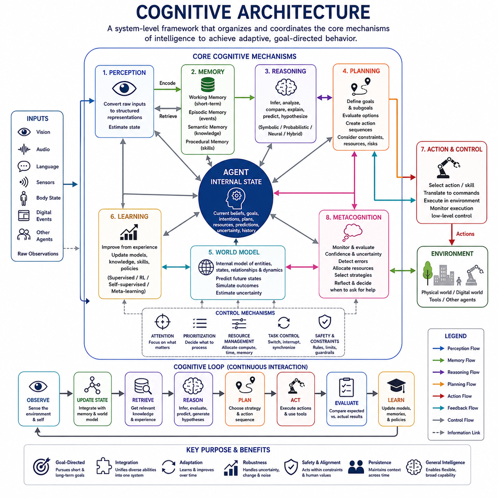{width="7.268055555555556in" height="7.268055555555556in"}

A cognitive architecture is an organized framework that specifies how the major mechanisms of an intelligent system interact to produce coherent cognition and behavior. Rather than describing a single algorithm, model, or neural network, it defines how perception, memory, reasoning, learning, planning, action, and control exchange information over time. It therefore provides a system-level structure for understanding and engineering intelligence.

The concept originates from attempts to explain cognition as a coordinated collection of processes rather than an isolated capability. Human intelligence depends on many mechanisms operating together: sensory information must be interpreted, relevant knowledge retrieved, alternatives evaluated, decisions formed, and actions executed. Cognitive architecture seeks to capture this organization in a computational form that can support persistent and adaptive intelligent behavior.

A cognitive architecture differs from a conventional AI model in scope. A model may perform classification, prediction, language generation, or policy estimation, while an architecture determines how multiple models and computational processes cooperate. It defines representations, information flows, control mechanisms, memory access, decision cycles, and interfaces through which specialized capabilities become components of a larger cognitive system.

Perception provides the architecture with observations about the external environment and the agent itself. Raw sensory signals, language, images, spatial measurements, or digital events must be transformed into representations that other cognitive mechanisms can use. The architecture determines how these representations are maintained, combined with prior knowledge, and updated when new evidence changes the interpretation of the current situation.

Memory provides continuity beyond the immediate observation. Working memory can preserve information required during an active task, while long-term memory can maintain knowledge and experience across longer periods. Episodic, semantic, and procedural forms of memory may serve different functions. A cognitive architecture specifies how information enters memory, how relevant content is retrieved, and how retrieved knowledge influences ongoing cognition.

Reasoning transforms available information into conclusions, explanations, hypotheses, and decisions. Depending on the architecture, this process may involve symbolic rules, probabilistic inference, neural computation, causal models, search, simulation, or combinations of these methods. The architectural question is not only how reasoning occurs, but also when it should be invoked and how its results affect other processes.

Planning organizes cognition across future time. Once an agent possesses an estimate of its current state and a desired objective, it must determine which sequence of actions can reduce the difference between them. Cognitive architectures can represent goals, subgoals, alternative strategies, dependencies, constraints, and expected outcomes, allowing behavior to extend beyond immediate stimulus-response relationships.

Learning enables the architecture to change through experience. New observations can improve representations, successful actions can strengthen policies, failures can reveal incorrect assumptions, and repeated experiences can create reusable knowledge or skills. Learning therefore affects multiple architectural components rather than existing only as a separate training process performed before the intelligent system begins operating.

Action connects internal cognition with external consequences. Decisions and plans must eventually be translated into commands that affect an environment, whether through physical movement, communication, software operations, or tool use. The consequences of these actions generate new observations, creating a closed interaction loop in which cognition influences the world and the changed world subsequently influences cognition.

Control mechanisms determine which cognitive processes should operate at a particular moment. An intelligent system cannot necessarily perform every possible reasoning, retrieval, planning, and learning operation simultaneously. The architecture therefore needs mechanisms for attention, prioritization, task switching, resource allocation, interruption, and synchronization so that limited computational resources are directed toward currently important problems.

This requirement makes cognitive architecture fundamentally temporal. Intelligence unfolds through sequences of internal and external events rather than through one isolated computation. Observations arrive, memories become active, goals change, reasoning processes generate intermediate results, plans are revised, actions occur, and feedback returns. Architecture defines how these processes remain coordinated as the system continuously evolves.

A useful distinction exists between cognitive content and cognitive process. Content includes beliefs, observations, goals, memories, predictions, and representations of objects or situations. Processes operate on this content by retrieving, transforming, comparing, evaluating, storing, or acting upon it. A cognitive architecture must define both what kinds of information exist internally and how operations can modify that information.

Representation is therefore a central architectural problem. Information may be represented symbolically, numerically, probabilistically, geometrically, through distributed neural embeddings, or through combinations of these forms. Different representations support different operations efficiently. Modern architectures increasingly need mechanisms that allow structured knowledge, learned representations, sensory states, and action-related information to coexist and interact.

Traditional symbolic cognitive architectures emphasize explicit knowledge structures and operations over them. Rules, symbols, goals, and production systems can provide interpretable mechanisms for reasoning and problem solving. Such architectures demonstrate how complex behavior can emerge from repeated cycles of matching internal conditions with applicable operations, although manually constructing comprehensive symbolic knowledge can become difficult at large scale.

Connectionist approaches instead emphasize distributed representations and learned transformations. Neural networks can acquire complex mappings directly from data and provide strong capabilities in perception, language, prediction, and representation learning. Their internal knowledge is generally less explicitly structured than symbolic systems, but their ability to learn statistical regularities makes them important components of contemporary cognitive architectures.

Hybrid cognitive architectures attempt to combine these complementary strengths. Learned neural components may interpret sensory information and generate flexible representations, while structured memory, planners, reasoning mechanisms, or explicit constraints provide organization and control. The objective is not necessarily to divide intelligence into purely neural and symbolic regions, but to use different computational mechanisms where their properties are most advantageous.

Modern foundation models introduce another architectural possibility because one large learned model can support multiple cognitive functions. A language or multimodal foundation model may contribute to perception, reasoning, planning, knowledge retrieval, communication, and tool selection. Nevertheless, broad model capability does not eliminate architectural requirements such as persistent memory, environmental interaction, execution monitoring, safety constraints, and long-term goal management.

Cognitive architecture is therefore particularly important when transforming a model into an agent. A model normally receives an input and produces an output, whereas an agent must maintain state across time, pursue goals, choose actions, observe consequences, and adapt its future behavior. The architecture provides the persistent mechanisms required to transform episodic model inference into continuing goal-directed interaction.

The agent\'s internal state serves as a shared context connecting different mechanisms. It may contain current observations, active goals, retrieved memories, beliefs, uncertainty estimates, plans, available resources, and recent actions. When components operate over a compatible state representation, information produced by perception can influence reasoning, reasoning can influence planning, and execution results can update memory and learning.

World models can extend this internal state by representing how relevant aspects of the environment change. Instead of reasoning only from the current observation, the architecture can predict future states under candidate actions. Such predictions support planning, counterfactual reasoning, risk assessment, and proactive behavior. Prediction errors produced after execution can then reveal where the internal model requires correction or additional learning.

Metacognition adds another level of architectural organization by allowing the system to evaluate its own cognitive activity. Confidence, uncertainty, reasoning quality, plan progress, resource usage, and error signals can become objects of monitoring. A metacognitive mechanism can determine whether additional reasoning is necessary, whether another strategy should be selected, or whether external assistance should be requested.

Attention is similarly architectural because it determines which subset of available information receives processing priority. Complex environments contain more information than an agent can process equally at every moment. Attention can prioritize observations, memories, goals, or internal hypotheses according to relevance and urgency, helping the architecture control computational load while maintaining responsiveness to significant changes.

Hierarchical organization provides another solution to complexity. High-level mechanisms can reason about abstract goals and strategies, while lower levels handle skills, trajectories, or immediate control. Different levels can operate at different temporal frequencies and degrees of abstraction. This allows long-horizon deliberation to coexist with rapid reactive behavior without forcing a single mechanism to manage every detail.

Feedback loops are essential because cognition must remain grounded in actual outcomes. A plan produces an action, the action changes the environment, and the resulting observation reveals whether expectations were correct. The architecture can use this discrepancy to modify state estimates, revise plans, update models, or initiate learning. Closed-loop cognition therefore replaces rigid execution with continuous adaptation.

Resource management becomes increasingly important as architectures grow more capable. Reasoning, simulation, retrieval, perception, and model inference consume time, energy, memory, and computational capacity. An architecture can allocate these resources dynamically, using inexpensive processing for routine situations while activating deeper reasoning or additional models when uncertainty, novelty, or risk justifies the added cost.

Safety must also be represented at the architectural level. Constraints can influence goals, planning, action selection, execution, and learning rather than being applied only after a response has been produced. Monitoring mechanisms can detect abnormal states, prevent forbidden actions, interrupt unsafe execution, and request human oversight when confidence is insufficient. Distributed safeguards provide multiple opportunities to prevent undesirable behavior.

For AGI, cognitive architecture ultimately provides the organizational foundation that connects specialized intelligence into persistent agency. Intelligence is not merely the ability to generate an accurate prediction or sophisticated answer; it requires maintaining context, integrating knowledge, selecting goals, anticipating consequences, acting, detecting errors, and learning across time. Architecture determines how these abilities become one coherent system.

The resulting cognitive cycle can be viewed as an ongoing interaction among observation, state construction, memory retrieval, reasoning, prediction, planning, action, evaluation, and learning. These processes may operate sequentially, concurrently, or hierarchically depending on the situation. Their coordination allows the system to remain responsive to immediate events while preserving longer-term objectives and accumulated knowledge.

A cognitive architecture should therefore be understood as the structural and operational blueprint of an intelligent agent. It specifies what major cognitive mechanisms exist, what information they maintain, how they communicate, when they operate, and how feedback changes future processing. For increasingly general AI systems, this architectural perspective is essential because intelligence depends not only on capable components, but on how those components cooperate as a unified adaptive system.

## 04.01. ACT R

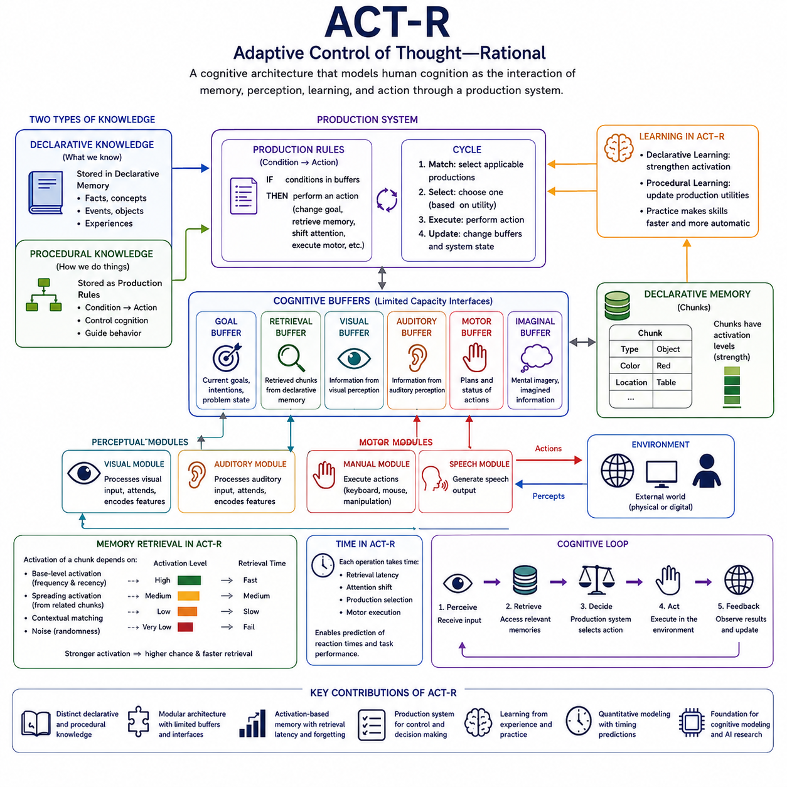{width="7.268055555555556in" height="7.268055555555556in"}

ACT-R, or Adaptive Control of Thought---Rational, is a cognitive architecture designed to model how human cognition emerges from the coordinated operation of memory, perception, learning, and action. Rather than treating intelligence as a single computational function, ACT-R represents cognition as a collection of specialized modules that exchange information through a central production system, producing goal-directed behavior over time.

The architecture is based on the idea that human cognition contains both declarative knowledge and procedural knowledge. Declarative knowledge represents facts, concepts, and remembered experiences, while procedural knowledge specifies how cognition and action should proceed under particular conditions. ACT-R separates these forms because knowing that something is true is fundamentally different from knowing how to perform an operation or accomplish a task.

Declarative knowledge is stored in declarative memory as structures called chunks. A chunk represents a unit of information containing attributes and values, such as an object, event, goal, relationship, or previously encountered situation. Chunks can be retrieved when they match the requirements of the current task, allowing past knowledge to influence present reasoning without requiring the entire memory system to be searched explicitly.

Memory retrieval in ACT-R is not purely symbolic or deterministic. Each chunk has an activation level that reflects factors such as previous use, recency, frequency, and contextual relevance. Highly activated chunks are more likely to be retrieved quickly, while weakly activated information may require more time or fail to be recalled. This mechanism allows the architecture to reproduce important characteristics of human memory, including forgetting and practice effects.

Procedural knowledge is represented through production rules, commonly expressed as condition-action relationships. A production examines the information currently available in different cognitive buffers and determines whether its conditions are satisfied. If selected, it performs an action such as changing a goal, requesting information from memory, directing attention, or initiating a motor operation. Cognition emerges from repeated cycles of production selection and execution.

Buffers are critical because they provide limited interfaces between the production system and specialized cognitive modules. Rather than allowing every component to access all internal information simultaneously, each module places a small amount of currently relevant information into a buffer. The production system evaluates these buffer contents, making ACT-R cognition strongly dependent on limited-capacity information flow rather than unlimited global access.

A goal buffer maintains information about the agent\'s current objective or problem state. Declarative memory provides retrieved knowledge through a retrieval buffer, while perceptual modules provide information about visual or auditory input. Motor modules support interaction with the environment. Through these interfaces, symbolic reasoning, memory retrieval, perception, and action become coordinated within a repeated cognitive cycle.

ACT-R therefore offers an example of modular cognitive architecture. Specialized systems handle functions such as memory, vision, motor control, and goal representation, while the production system coordinates their operation. This separation allows each mechanism to exhibit different timing and processing characteristics while still contributing to unified behavior. Intelligence arises from interaction among modules rather than from one undifferentiated processing mechanism.

Time is an important part of ACT-R modeling. Cognitive operations such as retrieving a memory, shifting visual attention, selecting a production, or executing a movement require measurable amounts of time. Consequently, ACT-R models can predict not only which behavior may occur but also how long particular cognitive operations may take. This has made the architecture useful for comparing computational models with human reaction-time and task-performance data.

Learning occurs in several parts of the architecture. Repeated retrieval changes the accessibility of declarative knowledge, while repeated successful behavior can influence procedural processing. Production utilities can represent the expected usefulness of alternative actions, enabling the system to prefer rules that have historically produced better results. Experience therefore changes both what information is easily available and which cognitive operations are likely to be selected.

ACT-R also provides mechanisms through which complex skills can gradually become more efficient. Early performance may require several explicit steps involving memory retrieval and deliberate reasoning, while repeated practice can lead to increasingly direct procedural behavior. This reflects an important aspect of human skill acquisition: tasks that initially demand substantial conscious processing can eventually become faster and more automatic through repeated experience.

The architecture can be understood as a continuous perception-cognition-action loop. Environmental information enters through perceptual modules, relevant knowledge is retrieved, production rules determine the next cognitive operation, and motor or external actions modify the environment. New observations then enter the architecture again. This recurrent structure makes cognition an ongoing interaction process rather than a single input-output transformation.

One important contribution of ACT-R is its attempt to connect symbolic cognition with quantitative constraints. Chunks and productions provide structured symbolic representations, while activation, retrieval latency, production utility, and timing introduce numerical mechanisms. ACT-R is therefore not simply a classical rule-based system; it combines symbolic organization with subsymbolic quantities that influence which memories and actions become behaviorally available.

This symbolic-subsymbolic combination is relevant to modern discussions of general intelligence. Purely symbolic systems provide explicit structures for goals and reasoning but often struggle with flexible learning from raw data, while neural systems learn rich statistical representations but may lack explicit cognitive organization. ACT-R demonstrates an architectural principle in which structured cognitive processes can coexist with graded, experience-sensitive mechanisms.

Nevertheless, ACT-R was developed primarily as a theory and computational framework for human cognition rather than as a direct blueprint for contemporary AGI. Its modules and assumptions are intended to explain psychological behavior under controlled tasks. Modern AGI systems must additionally address large-scale multimodal perception, foundation models, open-ended learning, world modeling, tool use, long-term autonomy, and operation in highly complex environments.

For AGI research, ACT-R is therefore especially valuable as an architectural reference. It shows how memory, goals, perception, procedural knowledge, learning, and action can be organized around clearly defined interfaces and processing cycles. The important lesson is not necessarily that AGI should reproduce ACT-R exactly, but that general intelligence requires mechanisms that coordinate specialized cognitive functions while preserving persistent goals and internal state.

ACT-R also highlights the importance of bounded cognition. The architecture does not assume unlimited memory access, instantaneous reasoning, or cost-free decision making. Retrieval takes time, information availability is constrained, and competing actions must be selected. These restrictions create behavior that is more realistic than an idealized agent with perfect access to all knowledge and unlimited computation, and they remain relevant when designing resource-aware artificial agents.

A modern interpretation could connect ACT-R\'s declarative memory with structured long-term memory or retrieval systems, production rules with policy or orchestration mechanisms, goal buffers with agent state, and perceptual modules with multimodal foundation models. Such mappings are conceptual rather than direct equivalences, but they illustrate how classical cognitive-architecture ideas can inform contemporary systems that combine learned models with explicit memory and control.

Metacognitive mechanisms can further extend this architecture by monitoring retrieval confidence, strategy effectiveness, resource consumption, and task progress. Although basic ACT-R cognition focuses primarily on coordinated object-level processing, broader AGI architectures can place supervisory mechanisms above similar cognitive loops. These mechanisms can determine when additional retrieval, reasoning, replanning, or external assistance is required.

World models provide another extension that becomes particularly important for autonomous agents. ACT-R-style goal and production mechanisms can organize behavior, while learned predictive models estimate how external states may evolve. Combining explicit cognitive control with predictive representations would allow an agent not only to react according to current knowledge but also to evaluate possible future consequences before committing to an action.

The production-cycle perspective also demonstrates how complex behavior can emerge incrementally. An agent does not need to solve an entire problem in one computation. Instead, each cycle updates a small portion of the cognitive state, retrieves information, selects an operation, or changes a goal. Repeated cycles can collectively produce multi-step reasoning and behavior, providing an architectural alternative to treating intelligence as a single monolithic inference process.

In the broader cognitive-architecture landscape, ACT-R represents a highly influential example of how cognition can be decomposed while remaining integrated. Its distinction between declarative and procedural knowledge, modular processing, limited buffers, subsymbolic activation, utility-based selection, learning, and explicit timing provides a coherent framework for studying how multiple cognitive mechanisms jointly produce observable behavior.

From an AGI perspective, the enduring significance of ACT-R lies in its system-level view of intelligence. General intelligence requires more than powerful prediction or language generation; it requires persistent goals, accessible knowledge, controlled information flow, adaptive decision mechanisms, learning from experience, and continuous interaction with an environment. ACT-R provides an important historical and conceptual foundation for understanding how such mechanisms can be organized into a unified cognitive architecture.

## 04.02. SOAR

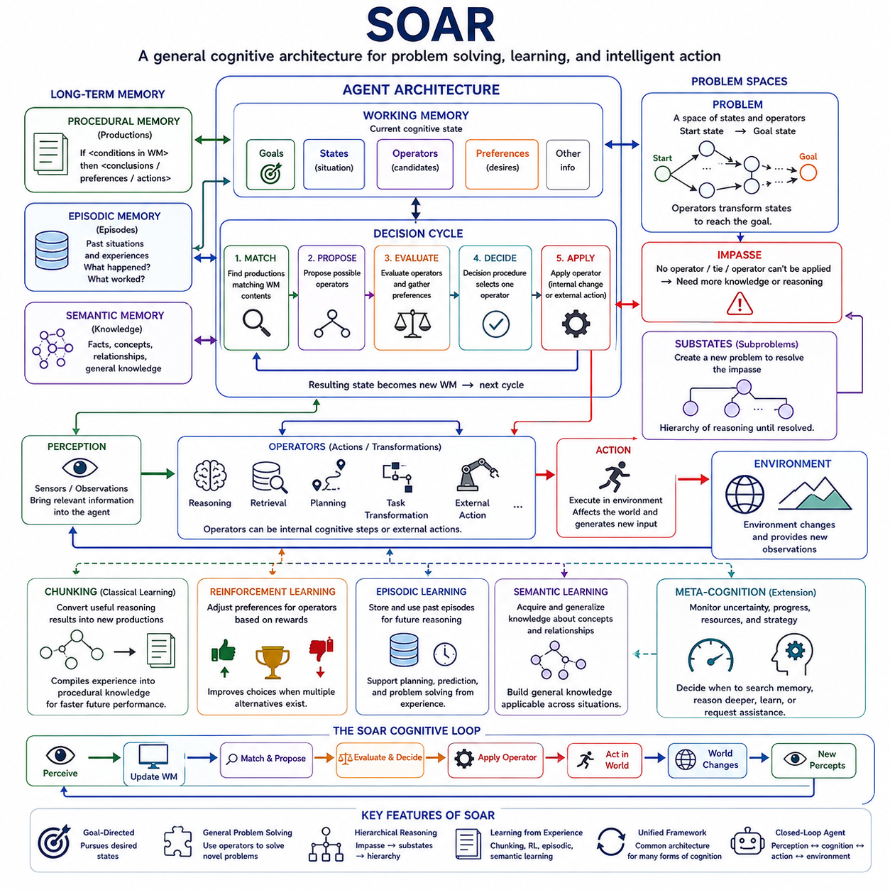{width="7.268055555555556in" height="7.268055555555556in"}

SOAR is a general cognitive architecture designed to model intelligent behavior through a unified set of mechanisms for problem solving, reasoning, learning, memory, and action. Rather than assigning every task to a separate algorithm, SOAR attempts to provide a common computational framework in which many forms of cognition can emerge from repeated decision cycles. Its central objective is to support agents that pursue goals, solve unfamiliar problems, and improve through experience.

The architecture represents cognition as interaction between an agent\'s current state, available operators, goals, and knowledge. A state describes the situation currently understood by the agent, while operators represent possible transformations that can move that state toward a desired result. Intelligence emerges as the system continuously evaluates its situation, proposes possible operators, selects among them, and applies the selected operator.

Problem spaces provide an important conceptual structure in SOAR. A problem can be represented through a collection of possible states and operators capable of transforming one state into another. The agent begins from a current state and attempts to reach a state satisfying its goal. Problem solving therefore becomes structured search through possible transformations rather than an isolated computation producing an answer immediately.

SOAR\'s working memory maintains information relevant to the agent\'s current cognitive situation. It can contain representations of goals, environmental observations, intermediate reasoning results, selected operators, and other contextual information. Working memory changes continuously as cognition progresses, providing a dynamic internal state upon which the architecture\'s decision mechanisms operate.

Long-term procedural knowledge is primarily represented through production rules. Productions specify conditions under which particular conclusions, preferences, or actions become applicable. When information in working memory satisfies the conditions of a production, that production can contribute new information or preferences. Large numbers of productions can operate together, allowing previously acquired knowledge to guide current decisions.

The decision procedure coordinates competing possibilities generated by procedural knowledge. Productions may propose several operators and express preferences concerning which operator should be selected. SOAR evaluates these preferences and chooses an operator when the available knowledge provides sufficient guidance. This mechanism separates knowledge about possible actions from the architectural process responsible for resolving alternatives.

A decision cycle repeatedly transforms the agent\'s cognitive state. Relevant productions match working-memory contents, possible operators are proposed and evaluated, preferences accumulate, and the decision mechanism selects an operator. The selected operator is then applied, changing either the internal problem state or the external environment. The resulting state becomes the basis for another cycle, producing continuous goal-directed cognition.

One of SOAR\'s distinctive concepts is the impasse. An impasse occurs when existing knowledge is insufficient to make progress, such as when no operator can be selected, several alternatives remain equally preferred, or the chosen operator cannot be applied directly. Instead of treating this situation merely as failure, SOAR automatically creates a substate in which the system attempts to resolve the difficulty.

Substates introduce hierarchical problem solving. The original problem remains active while a secondary problem is created to determine how the impasse should be resolved. This secondary reasoning may itself encounter another impasse and generate another substate. SOAR can therefore construct a hierarchy of reasoning dynamically, allowing complex problem decomposition to emerge when existing knowledge cannot directly determine the next action.

Once a subproblem has been solved, the acquired result can influence the higher-level problem. This mechanism provides an important connection between deliberate problem solving and learning. The system does not need every possible solution encoded beforehand; when its current knowledge becomes insufficient, additional reasoning can generate information that allows the original decision process to continue.

Chunking is SOAR\'s classical learning mechanism for converting the results of problem solving into reusable procedural knowledge. When reasoning within a substate produces a useful result, SOAR can create a new production that captures relevant conditions and the resulting conclusion. If a similar situation occurs later, the newly learned production may provide the required knowledge directly, avoiding the previous sequence of deliberate reasoning.

This process allows experience to transform slow problem solving into faster behavior. Initially, an unfamiliar situation may require search, intermediate reasoning, and several substates. After appropriate knowledge has been learned through chunking, similar situations can be handled more directly. SOAR therefore illustrates how repeated experience can compile reasoning results into procedural knowledge that improves future performance.

SOAR also includes mechanisms for other forms of long-term memory. Semantic memory can preserve general facts and relationships that are not necessarily encoded as procedural rules, while episodic memory can retain information about previous states and experiences. These memory systems allow the agent to retrieve relevant knowledge or previous situations when the current problem cannot be solved effectively using procedural knowledge alone.

Episodic memory is particularly useful for reasoning from experience. An agent may retrieve a previous situation resembling its current state and examine what happened after earlier decisions. Such information can contribute to planning, prediction, and problem solving without requiring every past experience to be converted immediately into a production rule. This provides a complementary mechanism to procedural learning.

Semantic memory provides more generalized knowledge about concepts, entities, and relationships. Whereas episodic memory concerns particular experiences, semantic memory supports knowledge that can apply across many situations. Together with procedural memory and working memory, these mechanisms provide SOAR with several forms of knowledge that can contribute differently to cognition while remaining coordinated by the same architecture.

Perception and action connect SOAR\'s internal decision process to an external environment. Perceptual mechanisms place relevant environmental information into internal representations, while selected operators can ultimately produce external actions. The environment then changes and supplies new observations. SOAR can consequently operate as a closed-loop agent whose cognition repeatedly alternates between internal decision processes and environmental interaction.

Operators need not always correspond directly to physical actions. An operator may represent an internal reasoning step, retrieval request, planning operation, task transformation, or externally executed behavior. This flexibility allows the same architectural decision mechanism to coordinate both cognition and action. Internal thinking and external behavior can therefore be represented within a common operator-centered framework.

Goals provide direction to this processing. Rather than responding only to immediate stimuli, a SOAR agent can maintain desired states and organize decisions according to progress toward them. Goals may generate subgoals when difficulties arise, creating hierarchical structures that support complex tasks. This organization allows short-term operator selection to remain connected to broader problem-solving objectives.

SOAR has also been extended with reinforcement learning mechanisms. Reinforcement learning can modify numeric preferences associated with operator selection according to rewards received from interaction. This complements symbolic production knowledge by allowing experience to influence which actions are preferred when several alternatives are available, creating a bridge between structured cognitive control and value-based adaptation.

This combination illustrates an important characteristic of cognitive architectures: multiple learning mechanisms can operate over different kinds of knowledge. Chunking can compile problem-solving results into productions, reinforcement learning can improve operator preferences, episodic learning can preserve experiences, and semantic learning can expand general knowledge. Learning therefore modifies the architecture through several complementary pathways.

SOAR\'s architecture emphasizes that intelligence can emerge from repeated local decisions rather than requiring a complete solution to be generated in a single inference. Each decision cycle addresses the current cognitive situation, while persistent working memory and goals maintain continuity. Over many cycles, sequences of operator selections can produce extended reasoning, planning, problem solving, and interaction with the environment.

From a modern AI perspective, this recurrent architecture resembles important aspects of agentic systems. A contemporary agent may maintain state, retrieve memory, generate candidate actions, evaluate alternatives, use tools, observe results, and repeat the process. SOAR provides a much earlier and more explicitly structured example of how such continuing cognition can be organized around persistent state and iterative decisions.

However, SOAR should not be interpreted as a direct implementation blueprint for modern AGI. It was developed primarily as a symbolic cognitive architecture and does not by itself provide the large-scale learned perception and representation capabilities associated with modern foundation models. Multimodal perception, neural world models, large-scale self-supervised learning, and flexible language understanding require additional mechanisms or integration with learned components.

A modern hybrid architecture could therefore use neural models for perception, representation, prediction, and language while retaining SOAR-like mechanisms for persistent goals, explicit state, operator selection, hierarchical problem solving, and procedural learning. Such a combination could connect the statistical generalization capabilities of learned models with structured mechanisms for long-duration reasoning and controlled action.

The impasse mechanism is especially relevant to contemporary ideas about adaptive computation. Routine situations can be handled using existing knowledge without extensive reasoning, while difficult situations automatically trigger additional processing. This creates a form of conditional computational depth: the system expends greater reasoning effort when its current knowledge is insufficient rather than applying maximum computation to every situation.

SOAR also demonstrates the value of converting successful deliberation into reusable competence. If an agent repeatedly solves similar problems through expensive reasoning, preserving the resulting strategy can reduce future computational cost. Modern systems may implement this principle differently through skill learning, policy distillation, memory, cached plans, or learned procedures, but the underlying objective remains similar.

Metacognitive mechanisms can extend this principle further by monitoring uncertainty, progress, resource use, and strategy effectiveness. An advanced agent could detect that repeated impasses indicate missing knowledge, inadequate representations, or poor planning strategies. It could then decide whether to search memory, invoke another reasoning method, gather information, request assistance, or initiate additional learning.

World models can provide another complementary extension. SOAR\'s operator-centered reasoning determines what transformations might be considered, while a learned world model can predict the likely consequences of candidate actions. Combining explicit goal-directed operator selection with predictive simulation could enable an agent to evaluate possible futures before committing to costly or irreversible actions.

The enduring importance of SOAR lies in its attempt to explain intelligence through a coherent architecture rather than through a collection of unrelated task-specific programs. Working memory maintains current context, productions provide procedural knowledge, operators structure decisions, impasses trigger deeper reasoning, substates support hierarchical problem solving, and learning converts experience into knowledge that improves subsequent behavior.

From an AGI perspective, SOAR provides a valuable architectural lesson: general intelligence requires continuity across perception, memory, reasoning, learning, goals, and action. An intelligent agent must know what situation it is in, determine what alternatives are available, recognize when existing knowledge is insufficient, reason further when necessary, preserve useful discoveries, and repeatedly use feedback to improve future decisions.

## 04.03. Global Workspace Theory

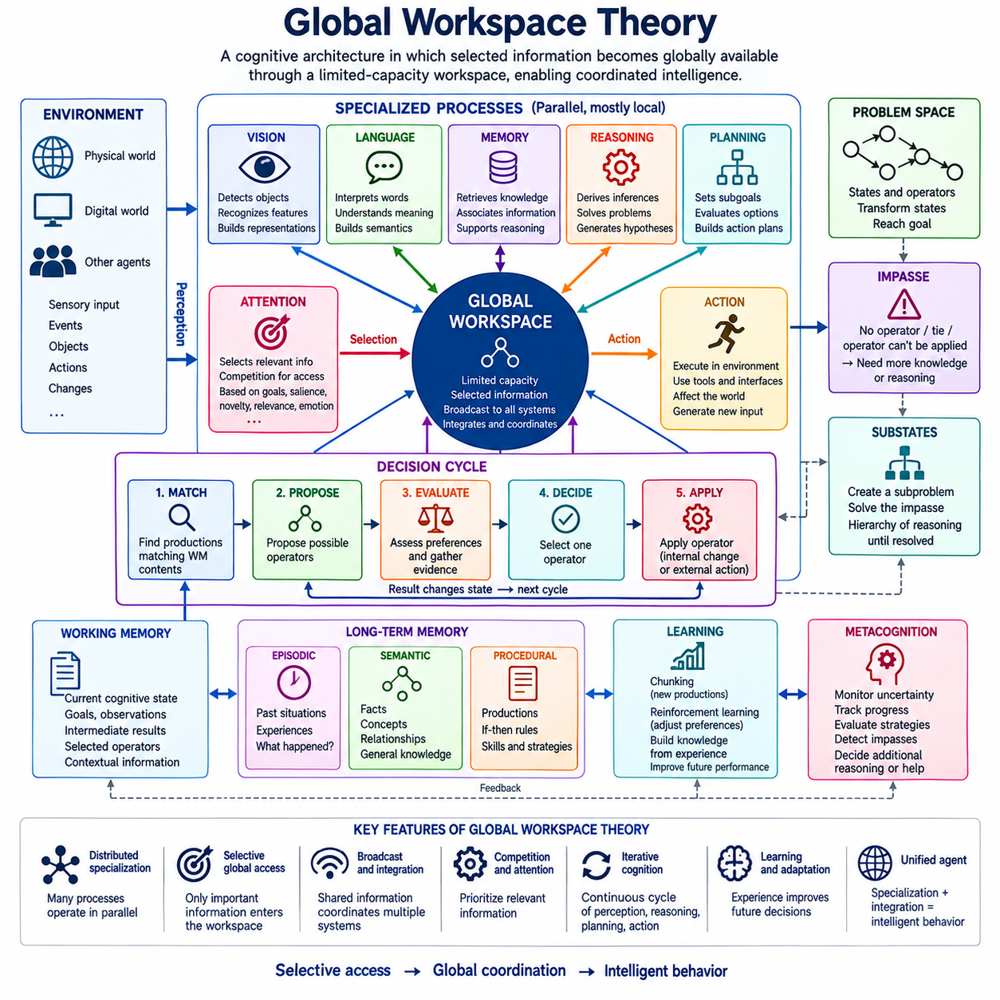{width="7.268055555555556in" height="7.268055555555556in"}

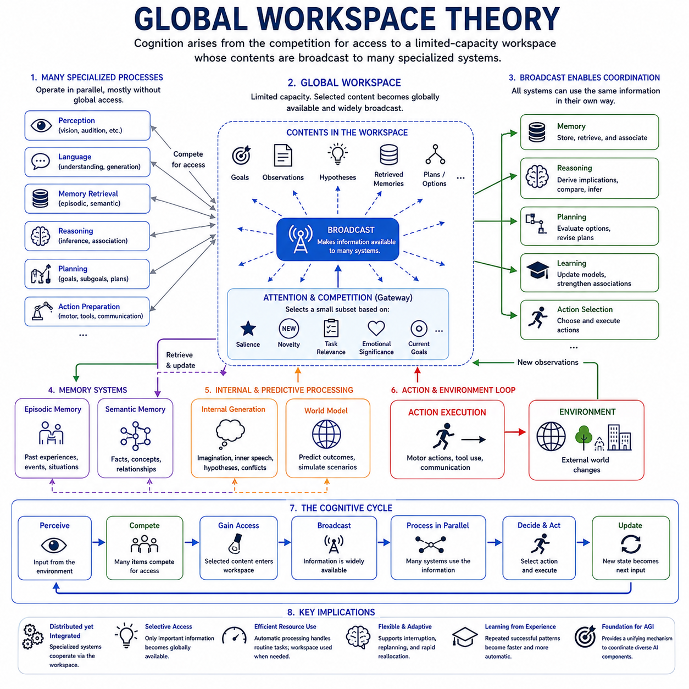{width="7.268055555555556in" height="7.268055555555556in"}

Global Workspace Theory describes cognition as a distributed system in which many specialized processes operate largely in parallel while a limited-capacity workspace enables selected information to become globally available. Rather than assuming that every cognitive process communicates directly with every other process, the theory proposes a shared informational arena through which particularly relevant content can influence memory, reasoning, planning, attention, learning, and action.

The theory is strongly associated with Bernard Baars and was originally developed as a functional account of conscious access. Its central metaphor resembles a theater: numerous cognitive processes operate outside the spotlight, while attention selects a relatively small amount of information for entry into a global workspace. Once selected, that information can be broadcast broadly to otherwise specialized systems distributed throughout the cognitive architecture.

Specialized processors perform much of cognition without requiring global access. Visual processing may identify objects, language mechanisms may interpret words, memory systems may retrieve associations, and motor systems may prepare possible actions simultaneously. These processes can remain locally specialized and computationally efficient. The global workspace becomes important when information produced by one subsystem must coordinate behavior across several other subsystems.

Competition for access is therefore a fundamental mechanism. Many representations, goals, sensory events, memories, and internally generated hypotheses may simultaneously seek broader influence, but only a limited subset can dominate the workspace at a particular moment. Attention, salience, novelty, task relevance, emotional significance, and current goals can affect this competition, allowing important information to gain temporary priority over competing cognitive contents.

When information gains access to the workspace, it becomes globally broadcast. The purpose of broadcasting is not merely to copy information everywhere, but to make selected content available to multiple systems that can use it differently. Memory may associate it with previous experience, reasoning may derive implications, planning may revise future actions, learning may update internal models, and action systems may alter behavior in response to the same globally accessible content.

This architecture creates an important distinction between local processing and global availability. A representation can influence specialized processing without becoming globally accessible, while information entering the workspace can coordinate multiple cognitive functions. The distinction provides a way to explain why intelligent systems can perform many operations automatically while only a relatively small amount of information becomes the focus of integrated, flexible processing at any moment.

Working memory is closely related to the workspace but should not necessarily be treated as identical to it. Working memory maintains information needed for ongoing tasks, whereas global workspace mechanisms emphasize widespread availability and broadcasting. Information maintained in working memory may become globally influential when task demands require it, while globally broadcast information can subsequently modify the contents maintained for continuing reasoning or planning.

Attention acts as a major gateway to global access. An environment can contain far more sensory information than an agent can process through expensive integrated reasoning. Attention prioritizes information according to current goals and significant events, reducing the effective cognitive workload. Bottom-up signals can capture attention because of novelty or sudden change, while top-down control can prioritize information because it is relevant to an active objective.

The workspace can also contain internally generated information rather than only sensory observations. Retrieved memories, imagined situations, intermediate reasoning results, predicted outcomes, unresolved conflicts, and planned actions can compete for global access. Consequently, cognition can shift from externally driven perception toward internally driven deliberation without requiring a fundamentally different architectural mechanism for coordinating the participating cognitive systems.

Memory and the global workspace interact bidirectionally. Globally available information can trigger retrieval of related episodic or semantic knowledge, while retrieved memories can themselves become candidates for global broadcasting. This recurrent relationship allows present observations to activate relevant past experience and allows remembered information to reshape the interpretation of current events. Cognition therefore develops through repeated interaction between present state and stored knowledge.

Reasoning can use workspace contents as a shared context. When a problem representation becomes globally available, several specialized mechanisms may contribute candidate explanations, associations, predictions, or solutions. Their outputs can compete for subsequent access, creating an iterative reasoning process. Complex reasoning can consequently emerge through successive workspace states rather than requiring one module to perform an entire reasoning sequence internally.

Planning can operate in a similar manner. A goal may enter the workspace and activate mechanisms capable of proposing actions or subgoals. Candidate plans can be evaluated according to constraints, predicted consequences, memory, and current resources. The selected plan or intermediate result can then become globally available, triggering the next stage of processing. Workspace dynamics can therefore coordinate multi-step goal-directed cognition.

A world model can greatly strengthen this process by producing predictions about possible future states. Candidate actions represented in the workspace can be evaluated through internal simulation, and predicted consequences can compete for attention before physical execution occurs. If a predicted outcome indicates danger, failure, or opportunity, that information can be broadcast to planning and control systems and alter the agent\'s behavior before an external consequence occurs.

Action selection represents the point at which globally coordinated cognition can influence the environment. A selected intention or plan can activate appropriate motor, software, communication, or tool-use mechanisms. After execution, new observations return through perception and can compete for workspace access. The resulting cycle links perception, global coordination, decision, action, and feedback into a continuously operating cognitive loop.

Unexpected events are especially important because they may interrupt the current workspace state. A significant prediction error, sudden environmental change, or failure of an ongoing action can acquire high priority and displace previously dominant content. This allows the system to shift rapidly from routine execution toward reevaluation and replanning. Global workspace mechanisms can therefore support both stable goal pursuit and flexible interruption.

Learning can occur throughout these cycles. Globally broadcast information provides a potentially valuable training signal because it represents content judged relevant to current cognition. Associations between workspace states, actions, predictions, and outcomes can strengthen future processing. Repeated experience can make frequently successful operations more automatic, reducing their need for global coordination and preserving limited workspace capacity for novel or difficult problems.

This distinction between automatic and controlled processing has significant architectural value. Familiar tasks can often be handled by specialized learned mechanisms with little global involvement, while unfamiliar, ambiguous, conflicting, or strategically important situations recruit the workspace. Computational resources can therefore be concentrated where coordination is needed instead of forcing every cognitive operation through an expensive central reasoning mechanism.

Global Workspace Theory does not require the workspace to contain a complete representation of the entire cognitive system. Its power comes precisely from selective access. Only information currently important for coordination needs to become globally available, while enormous amounts of lower-level processing can remain distributed. This produces an architecture that combines specialization with integration rather than replacing specialized modules with one universal processor.

For artificial intelligence, this principle suggests a possible mechanism for orchestrating heterogeneous components. Perception networks, language models, memory systems, planners, world models, reasoning engines, and controllers could operate as specialized processes. A workspace could maintain selected shared content, while attention and competition determine which outputs receive broader distribution. Broadcasting would then allow independently implemented components to coordinate around a common cognitive context.

A computational implementation might represent the workspace as a structured shared state containing active observations, goals, hypotheses, retrieved memories, uncertainty estimates, and candidate actions. Specialized modules could read relevant workspace information and submit new candidate content. An attention or arbitration mechanism could score these candidates and select information for broader broadcasting, after which participating modules update their local processing.

Such an implementation requires careful control because unrestricted broadcasting could overwhelm the architecture. Every observation or intermediate activation should not become globally distributed. Selection mechanisms must consider relevance, confidence, novelty, urgency, expected information value, and computational cost. The workspace consequently functions not simply as shared memory but as a dynamically controlled communication bottleneck.

This bottleneck can be advantageous. Limited global capacity forces the system to prioritize, preventing every cognitive subsystem from continuously exchanging unlimited information with every other subsystem. The architecture can maintain large amounts of parallel local computation while reserving expensive cross-system coordination for selected information. This resembles a resource-management strategy as much as a theory of cognitive access.

Metacognition can operate above or through the workspace by monitoring which information dominates processing, how confident the system is, whether reasoning is progressing, and whether conflicts remain unresolved. Metacognitive signals may themselves gain global access, allowing the system to recognize uncertainty or failure. The agent can then allocate more computation, retrieve additional evidence, change strategy, or request external assistance.

The relationship between Global Workspace Theory and consciousness requires careful interpretation in artificial systems. The theory was developed partly to explain conscious access in humans, but implementing workspace-like broadcasting in an AI system would not by itself establish that the system possesses subjective experience. For engineering purposes, its mechanisms can be studied independently as principles for selective information integration, attention, coordination, and cognitive control.

Modern neural approaches inspired by global workspace ideas can use learned representations and attention mechanisms rather than relying exclusively on symbolic information. Multiple specialized networks may process different modalities or tasks, while a shared latent workspace enables communication between them. Learned gating mechanisms can determine which representations enter the shared space and which specialized systems receive the resulting broadcast.

Foundation models create another possible interpretation. A powerful multimodal model could participate in workspace processing as a general reasoning or representation mechanism while persistent memory, perception, planning, control, and tools remain separate architectural components. The workspace would then coordinate information among these mechanisms rather than assuming that a single foundation model must internally implement every aspect of cognition.

In an embodied AGI system, workspace dynamics could connect multiple temporal scales. Fast perception and control processes may operate continuously without requiring deliberate reasoning, while unusual events trigger global broadcasting and slower planning. Strategic goals may influence attention from the top down, while urgent sensory changes interrupt from the bottom up. This interaction allows rapid reactions and long-horizon cognition to coexist.

Global Workspace Theory therefore provides an important architectural principle for AGI: distributed specialization and global integration do not have to be opposing approaches. Specialized mechanisms can perform efficient local computation, while selective broadcasting creates temporary system-wide coordination when required. Intelligence can emerge from repeated transitions between parallel local processing and globally accessible cognitive states.

From a cognitive architecture perspective, the enduring significance of Global Workspace Theory lies in its explanation of how many independent processes can behave as a coherent agent. Competition determines what becomes globally important, attention regulates access, broadcasting distributes selected information, specialized systems contribute interpretations and actions, and feedback produces the next workspace state. This recurrent cycle offers a powerful conceptual framework for integrating perception, memory, reasoning, planning, learning, and action into unified adaptive cognition.

## 04.04. Predictive Processing

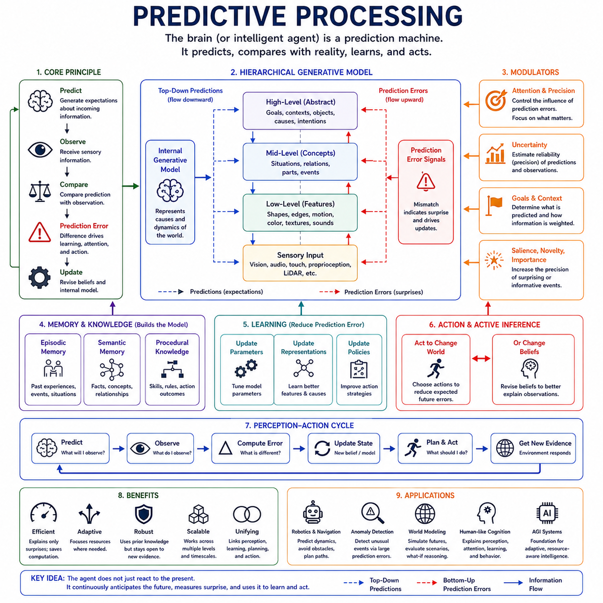{width="7.268055555555556in" height="7.268055555555556in"}

Predictive processing is a cognitive framework in which an intelligent system continuously generates expectations about incoming information and compares those expectations with actual observations. Rather than treating perception as a passive process that simply receives sensory data, predictive processing views cognition as an active cycle of prediction, observation, error detection, and model revision. The system attempts to anticipate what it is likely to experience before the evidence fully arrives.

At the center of this framework is an internal generative model that represents possible causes of sensory observations and relationships among states of the environment. The model predicts what sensory signals should occur under a particular interpretation of the world. Actual observations are then compared with these predictions, allowing discrepancies to reveal where the current internal representation fails to explain the available evidence.

The difference between predicted and observed information is commonly described as prediction error. A small prediction error indicates that the internal model adequately explains the current observation, whereas a large error suggests that something unexpected has occurred. Prediction errors therefore provide important signals for updating beliefs, redirecting attention, modifying internal representations, or initiating new actions that gather additional information.

Prediction and prediction error can be organized hierarchically. Higher levels represent relatively abstract, slowly changing structures such as objects, situations, contexts, goals, or causal relationships, while lower levels represent increasingly detailed sensory features. Predictions flow downward through the hierarchy, while discrepancies between prediction and observation propagate upward and influence higher-level interpretations.

This hierarchical organization allows cognition to integrate information across multiple levels of abstraction. A high-level expectation about a situation can constrain how lower-level sensory signals are interpreted, while unexpected sensory evidence can force revision of the higher-level interpretation. Perception therefore emerges from continuous interaction between top-down predictions and bottom-up evidence rather than from a strictly one-directional processing pipeline.

Prior knowledge plays an important role because predictions depend on what the system already believes about the world. Previous experiences, learned regularities, contextual information, and current goals influence which explanations are considered likely. The same sensory input can therefore produce different interpretations depending on context because perception reflects both incoming evidence and expectations generated from the internal model.

Uncertainty determines how strongly predictions and observations should influence inference. Not every prediction or sensory measurement is equally reliable. Predictive processing frameworks often describe this through precision, which represents the estimated reliability of a signal or prediction error. High-precision evidence receives greater influence, while uncertain information contributes less strongly to updating the current internal state.

Attention can be interpreted partly as the regulation of this precision. Rather than merely selecting a location or object for processing, attention can increase the importance assigned to particular prediction errors. Information judged relevant to current goals, potentially dangerous, novel, or highly informative can therefore exert stronger influence over inference, enabling limited cognitive resources to focus on observations that are most likely to require model revision.

When predictions accurately explain observations, much of the incoming information becomes redundant. The system does not need to repeatedly reconstruct every familiar feature from the beginning because expected structure is already represented internally. Computational effort can instead concentrate on deviations from expectation. This provides an important efficiency principle for biological cognition and potentially for resource-constrained artificial agents.

Unexpected events have the opposite effect. A sudden obstacle, unfamiliar object, surprising behavior, or major environmental change generates prediction errors that cannot be easily explained by the current model. These errors can increase attention and trigger deeper processing, memory retrieval, reasoning, replanning, or additional perception. The system consequently shifts computational resources from routine prediction toward resolving uncertainty.

Predictive processing can therefore support adaptive allocation of computation. In stable and highly predictable environments, many processes may operate with relatively low deliberative effort because incoming information closely matches expectations. When uncertainty or prediction error increases, more expensive cognitive mechanisms can be activated. This creates a possible architectural basis for dynamically adjusting computational intensity according to environmental complexity.

Memory contributes by providing the experiences and statistical regularities from which predictions are constructed. Episodic memory can recall similar past situations, semantic memory can supply general knowledge, and learned procedural structures can provide expectations about action outcomes. Prediction can also guide memory retrieval by determining which previous experiences are currently relevant to explaining an observation or anticipating future events.

Learning updates the generative model so that future predictions become more accurate. Repeated prediction errors indicate that existing representations or transition models do not adequately capture environmental structure. Parameters, representations, causal relationships, or policies can then be modified. Learning can consequently be understood as reducing systematic prediction error across repeated encounters rather than merely memorizing individual observations.

Self-supervised learning has a natural connection with predictive processing because the environment itself can provide training targets. A system can predict missing information, future observations, hidden states, temporal transitions, or relationships among different modalities and compare those predictions with subsequently available evidence. Large quantities of unlabeled experience can therefore be transformed into learning signals without requiring explicit human annotation for every observation.

Temporal prediction extends this principle from current sensory interpretation to future states. Given a representation of the present situation, the system can estimate what is likely to occur after a short or long interval. Such predictions allow an agent to detect abnormal transitions, anticipate environmental changes, and prepare appropriate responses before an event becomes immediately observable.

Actions can also be incorporated into prediction. Instead of estimating only how the world will evolve passively, the model can predict how different candidate actions will change future states. This transforms predictive processing into an important component of planning. The agent can internally evaluate possible trajectories and compare their expected consequences before selecting an action that best supports its goals.

Active inference extends the relationship between prediction and action further. Prediction errors can be reduced either by changing the internal model to better explain observations or by acting on the environment so that observations become more consistent with expected or preferred states. Action therefore becomes part of the inference process rather than merely an output produced after perception and reasoning have finished.

This creates a continuous perception-action loop. The agent predicts observations, receives sensory evidence, evaluates prediction errors, updates its state estimate, selects an action, and observes the resulting environmental change. Each action creates new evidence for evaluating the internal model. Perception, prediction, learning, and control consequently become tightly interconnected rather than functioning as independent sequential modules.

A world model provides a practical computational realization of many predictive-processing principles. It can encode latent states, environmental dynamics, objects, relationships, and action-conditioned transitions. Instead of processing only raw observations, an intelligent agent can maintain a compact internal representation of what exists, what is changing, and what is likely to happen next.

Latent-state prediction is particularly useful because predicting every raw sensory value may be unnecessarily expensive. An agent can transform high-dimensional camera, LiDAR, audio, or other sensor streams into compact representations and predict their future evolution. These latent representations can preserve information important for decision making while reducing the computational burden associated with direct prediction in raw sensory space.

Multimodal predictive processing can integrate information from several sensing channels. Vision, depth, LiDAR, proprioception, language, audio, and other modalities can provide complementary evidence about a shared environmental state. Predictions generated from one modality can help interpret another, while disagreement among modalities can expose uncertainty, sensor failure, or previously unseen situations.

Predictive processing is also closely related to anomaly detection. If a system has learned the normal dynamics of an environment, events that generate persistent or unusually large prediction errors can be treated as anomalous. This is useful for autonomous robots, industrial inspection, monitoring systems, and safety-critical agents because unusual conditions can be detected even when every possible failure has not been explicitly labeled beforehand.

For embodied intelligence, prediction must operate at multiple temporal scales. Fast predictions can support stabilization, collision avoidance, and immediate control, while medium-horizon predictions can support navigation and manipulation. Longer-horizon predictions can contribute to task planning, resource management, and strategic decisions. A hierarchical predictive architecture can coordinate these timescales while preserving responsiveness to immediate events.

Predictive processing can also interact with metacognition. The agent can monitor the magnitude, persistence, and distribution of prediction errors to estimate whether its internal model remains trustworthy. Repeated unexplained errors may indicate unfamiliar conditions or model failure. The system can then increase observation frequency, invoke stronger reasoning, switch models, slow its behavior, request assistance, or initiate additional learning.

This mechanism has important implications for computational efficiency in autonomous AI. A robot traveling through a familiar and predictable environment may not require maximum processing from every model at every moment. When observations closely match predictions, some expensive reasoning or perception processes can operate less frequently. Significant prediction errors can reactivate deeper processing when the environment becomes uncertain or dangerous.

However, reducing computation requires careful safety design. A highly confident prediction can still be wrong, particularly under distribution shift or rare events. Critical sensors and safety controllers may therefore need to remain continuously active even when higher-level cognition enters a lower-computation mode. Predictive processing should regulate expensive cognition without eliminating independent mechanisms required for detecting unexpected hazards.

Modern neural networks provide powerful mechanisms for implementing predictive representations. Transformers, recurrent networks, state-space models, latent dynamics models, generative models, and multimodal encoders can learn temporal and structural regularities from large datasets. These models can generate predictions over observations or latent states, while prediction errors provide signals for representation learning and adaptation.

Predictive processing does not imply that intelligence should only minimize immediate sensory error. An effective agent must preserve goals, explore uncertain environments, acquire useful information, and sometimes tolerate short-term prediction errors to achieve better long-term outcomes. Prediction therefore needs to operate together with planning, reward, curiosity, memory, uncertainty estimation, and safety constraints within a broader cognitive architecture.

Within AGI, predictive processing provides a unifying connection among perception, learning, world modeling, planning, and action. Perception becomes inference about hidden causes, learning improves the internal generative model, world modeling predicts state transitions, planning compares possible futures, and action changes future observations. The same predictive principle can consequently contribute to several cognitive functions that otherwise appear separate.

The broader architectural significance is that an intelligent agent does not merely react to the present. It continuously anticipates what should happen, measures where reality differs from expectation, and uses those differences to decide where additional cognition is required. Predictive processing therefore offers a foundation for adaptive, resource-aware intelligence in which prediction guides perception, prediction error drives correction, and experience progressively improves the agent\'s model of the world.

## 04.05. NeuroSymbolic Architectures

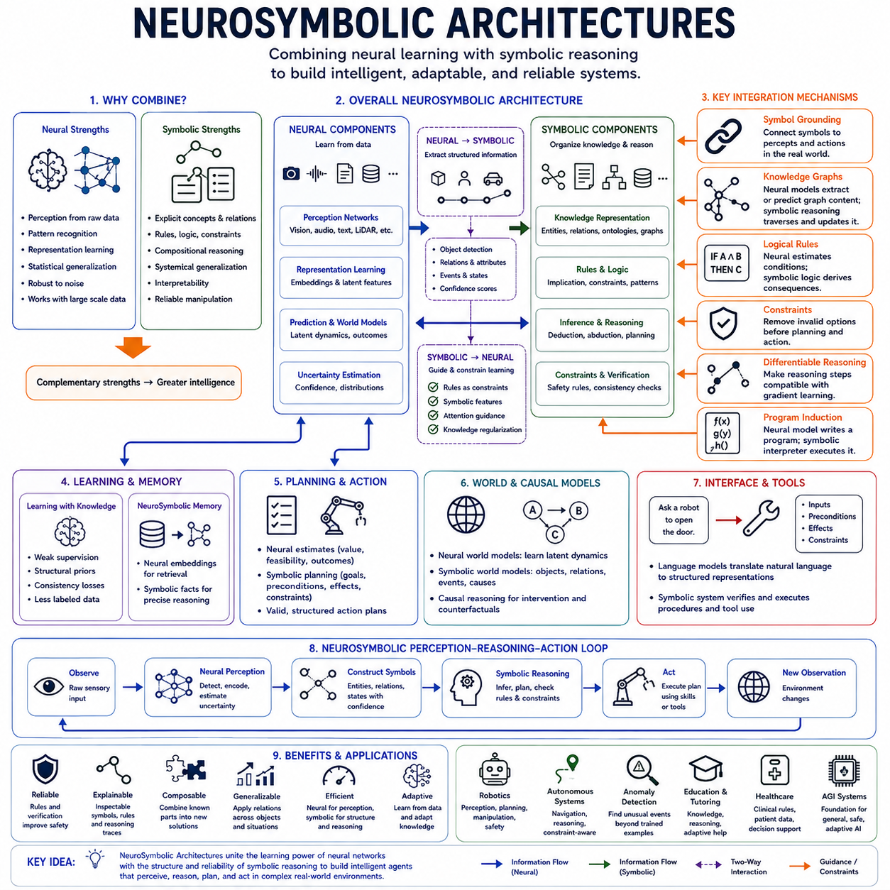{width="7.268055555555556in" height="7.268055555555556in"}

NeuroSymbolic Architectures combine neural learning with symbolic representation and reasoning to create intelligent systems that can learn from complex data while manipulating explicit knowledge. Neural networks provide perception, pattern recognition, representation learning, and statistical generalization, whereas symbolic mechanisms provide structured concepts, logical relationships, rules, constraints, and compositional reasoning. Their integration seeks to capture complementary strengths that neither paradigm provides easily on its own.

Neural approaches are highly effective at learning representations directly from large amounts of sensory or linguistic data. Images, speech, video, text, LiDAR, and multimodal observations can be transformed into distributed representations that capture complex statistical regularities. However, these learned representations may not explicitly expose objects, relations, causal structures, constraints, or rules required for systematic reasoning and long-horizon decision making.

Symbolic approaches represent knowledge through discrete and interpretable structures such as symbols, predicates, rules, graphs, programs, ontologies, and logical expressions. They can support explicit reasoning, variable binding, compositionality, constraint satisfaction, and manipulation of abstract relationships. Their weakness is that symbolic knowledge is difficult to construct directly from noisy, high-dimensional observations and can require substantial manual engineering when used without learning mechanisms.

A NeuroSymbolic architecture attempts to connect these two representational regimes. Neural components transform raw observations into learned features or structured candidates, while symbolic components organize selected information into entities, attributes, relationships, rules, and goals. Information can also flow in the opposite direction, allowing symbolic knowledge or constraints to influence neural inference, learning, attention, and action selection.

The neural-to-symbolic interface is therefore a central architectural problem. A vision network may detect objects and estimate their properties, but a reasoning system may require representations such as object identity, spatial relation, ownership, accessibility, or causal dependency. The architecture must convert uncertain neural outputs into structures that symbolic mechanisms can manipulate without discarding important information about confidence and ambiguity.

Symbol grounding addresses the relationship between abstract symbols and observations or actions in the environment. A symbol such as "door," "blocked," or "reachable" becomes useful to an embodied agent only when it can be connected to perceptual evidence and operational consequences. Neural perception can help ground symbols in sensory experience, while symbolic structures can preserve stable meanings and relationships across changing observations.

Knowledge graphs provide one possible bridge between neural and symbolic processing. Entities can represent objects, people, locations, concepts, or events, while edges represent relationships among them. Neural models can extract or predict graph content from observations, and symbolic reasoning can traverse or transform the resulting structure. Graph neural networks can further provide differentiable processing over relational structures, creating intermediate forms between purely neural and purely symbolic computation.

Logical rules provide another important mechanism. Rules can express relationships such as prerequisites, exclusions, safety conditions, causal dependencies, or task procedures. Neural systems may estimate whether the conditions represented by a rule are satisfied, while symbolic reasoning determines the consequences. This allows uncertain perception to interact with explicit domain knowledge without requiring every relationship to be rediscovered statistically from data.

Constraints are particularly valuable in safety-critical and physically grounded systems. A neural model may propose actions according to learned probabilities, while symbolic constraints can reject actions that violate physical limits, operational policies, task requirements, or safety rules. Rather than treating safety as a final filter, NeuroSymbolic architectures can incorporate constraints during planning and reasoning so that invalid possibilities are removed before execution.

Neural and symbolic components can also cooperate during learning. Symbolic knowledge can provide weak supervision, structural priors, consistency requirements, or additional training objectives. For example, a neural model may be penalized when its predictions violate known relationships between entities. This can reduce the amount of labeled data required and encourage representations that are compatible with domain knowledge rather than relying exclusively on statistical correlations.

Differentiable reasoning attempts to make some symbolic-like operations compatible with gradient-based learning. Logical relationships, rule applications, relational operations, or program structures can be approximated using differentiable mechanisms so that learning signals propagate through multiple reasoning stages. This creates a spectrum of architectures ranging from clearly separated neural and symbolic modules to deeply integrated systems in which structured reasoning itself becomes partially learnable.

Program induction provides another route toward NeuroSymbolic intelligence. Instead of generating only a direct answer or action, a neural model can infer a sequence of structured operations or a small program describing how a problem should be solved. The resulting program can then be executed by a symbolic interpreter. This separates learning how to construct a solution procedure from deterministically executing that procedure.

Compositionality is a major motivation for NeuroSymbolic systems. Human reasoning can combine familiar concepts and operations into configurations that may never have been encountered during training. Symbolic representations naturally support such recombination because variables, relations, and rules can be applied systematically. Neural models provide flexible learned representations, while symbolic composition can improve generalization to novel combinations of known concepts.

Systematic generalization is closely related to this capability. A model that learns a relationship in one context should ideally apply the same abstract relationship to different objects or situations. Pure pattern recognition may sometimes depend too strongly on statistical similarity to training examples. Explicit relational representations can help separate the structure of a problem from the specific entities occupying that structure.

Memory can also be organized NeuroSymbolically. Neural embeddings provide efficient similarity-based retrieval, while symbolic structures preserve explicit facts, relations, temporal events, and dependencies. An agent may first retrieve candidate memories using neural similarity and then use symbolic reasoning to determine which retrieved information satisfies the requirements of the current problem. This combines flexible retrieval with structured verification.

Planning benefits strongly from this integration. Neural models can estimate action feasibility, cost, value, or likely outcomes, while symbolic planners represent goals, preconditions, effects, and constraints. Candidate plans can therefore exploit learned experience without abandoning explicit task structure. When environments are uncertain, neural prediction can estimate likely transitions while symbolic mechanisms maintain the logical organization of the plan.

World models provide another important integration point. Neural world models can learn latent dynamics from high-dimensional observations, while symbolic world models represent persistent objects, relationships, events, and causal structures. A hybrid world model may therefore maintain both continuous latent representations and explicit relational state, allowing an agent to predict detailed dynamics while reasoning about abstract consequences.

Causal reasoning is particularly important because correlation alone is insufficient for many intelligent decisions. Neural networks can discover statistical regularities and candidate dependencies, while symbolic causal models can represent interventions, mechanisms, and structured relationships. Combining these capabilities can support reasoning about what may happen naturally and what may happen if the agent deliberately changes some aspect of the environment.

Uncertainty must remain visible across the neural-symbolic boundary. Neural perception rarely produces perfectly certain classifications or state estimates, and symbolic reasoning should not automatically treat uncertain outputs as unquestionable facts. Probabilistic logic, confidence-weighted facts, alternative hypotheses, or belief distributions can preserve uncertainty while still allowing structured reasoning to operate over the available evidence.

This is especially important for robotics and embodied intelligence. A robot may perceive several possible objects, estimate uncertain positions, infer navigability, and reason about task constraints simultaneously. Neural perception handles noisy sensory input, while symbolic representations describe goals, spatial relationships, task rules, and safety conditions. The architecture must continuously revise these structures as new observations arrive.

A NeuroSymbolic agent can therefore operate through a repeated perception-reasoning-action cycle. Neural perception converts observations into candidate entities and states, symbolic reasoning integrates them with knowledge and goals, planning selects structured actions, and control executes them. The resulting observations return to the neural system, while discrepancies between expected and actual outcomes update both learned representations and explicit knowledge.

Language provides another natural bridge. Large language models can interpret instructions, extract entities and relationships, generate candidate plans, and translate between natural language and structured representations. Symbolic systems can then verify constraints, execute formal procedures, or maintain persistent knowledge. The language model provides flexibility, while structured mechanisms reduce dependence on unconstrained generation for tasks requiring reliable state management.

Foundation models can consequently become components of a larger NeuroSymbolic architecture rather than complete architectures by themselves. A multimodal foundation model may provide broad perception and reasoning capabilities, while external memory, knowledge graphs, planners, rule systems, verification mechanisms, and controllers provide persistent structure. The resulting system combines learned generalization with explicit architectural organization.

Tool use can also be represented NeuroSymbolically. Neural models may determine which tool is relevant from natural-language context, while symbolic descriptions specify tool capabilities, input requirements, preconditions, and expected outputs. Planning mechanisms can organize several tool operations into a structured workflow and verify whether intermediate results satisfy the conditions required for subsequent operations.

Metacognition can monitor interactions between neural and symbolic processes. The system may detect when neural confidence is too low for symbolic commitment, when logical constraints conflict with model predictions, or when a plan repeatedly fails despite high predicted success. Such conflicts provide signals for additional observation, deeper reasoning, alternative hypotheses, model switching, or human assistance.

NeuroSymbolic architectures also provide opportunities for improved explainability. A neural network\'s internal representation may be difficult to interpret directly, but symbolic structures can expose which entities, relationships, rules, constraints, and goals contributed to a decision. This does not automatically make the entire system transparent, but it can provide inspectable intermediate representations and reasoning traces useful for debugging, validation, and safety analysis.

Efficiency is another potential advantage. Neural networks need not perform every stage of reasoning through repeated high-cost inference if some knowledge can be represented as compact rules or reusable symbolic procedures. Conversely, symbolic search can be reduced when neural models provide strong candidate predictions or heuristics. Each paradigm can therefore reduce computational burdens that would be expensive for the other.

The main difficulty lies in integration rather than simply placing two systems side by side. Representations must remain compatible, uncertainty must cross interfaces correctly, learning must not violate essential constraints, and symbolic structures must adapt when the environment changes. Poorly designed interfaces can create brittle pipelines in which errors from neural perception propagate into symbolic reasoning as incorrect facts.

Modern NeuroSymbolic research therefore spans many architectural designs rather than one standardized solution. Some systems use neural perception followed by symbolic reasoning, others embed logical constraints into neural training, and others learn programs, graphs, relational representations, or differentiable reasoning mechanisms. The common principle is that learned statistical intelligence and structured reasoning should cooperate rather than being treated as mutually exclusive alternatives.

For AGI, this combination is attractive because general intelligence requires both adaptation and structure. An agent must learn from incomplete experience, recognize unfamiliar patterns, and operate under uncertainty, while also preserving goals, relationships, constraints, causal knowledge, and reusable procedures. Neural computation provides flexible learning, while symbolic computation provides mechanisms for manipulating explicit structure across extended reasoning processes.

The broader significance of NeuroSymbolic Architectures is therefore their attempt to unify two complementary views of intelligence. Intelligence can emerge from learning distributed representations from experience, but it also requires the ability to organize knowledge, reason over relationships, compose familiar concepts in new ways, obey constraints, and explain structured decisions. Integrating these capabilities offers a promising architectural direction toward adaptive, reliable, and increasingly general intelligent agents.

## 04.06. LLM based Agents

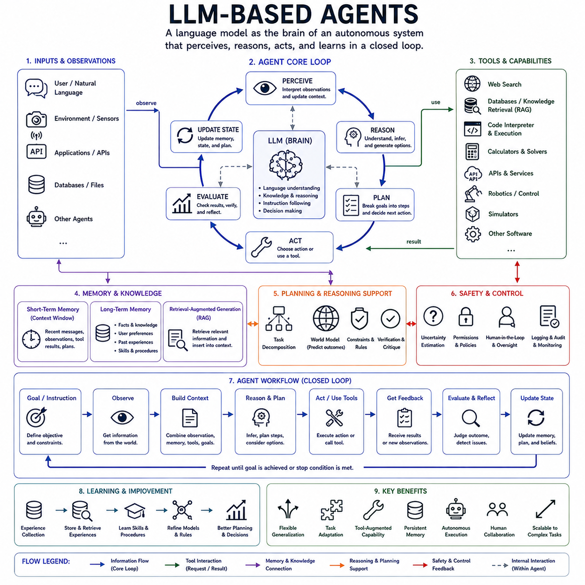{width="7.268055555555556in" height="7.268055555555556in"}

Large Language Model based agents use a language model as a central reasoning and decision component within a larger autonomous system. Instead of generating a single response to a prompt, the model participates in a repeated loop of observing a situation, interpreting goals, reasoning about alternatives, selecting actions, using tools, evaluating results, and continuing until a task is completed or another termination condition is reached.

The Large Language Model provides a flexible interface between natural language, knowledge, reasoning, and action. Because the model has learned broad statistical relationships from large-scale data, it can interpret diverse instructions and generate context-sensitive responses without requiring a separate handcrafted program for every task. However, the language model alone does not constitute a complete agent; memory, tools, planning, control, and environmental interaction must surround it.

An LLM-based agent typically begins with observations from a user, software environment, database, sensor system, or another agent. These observations are converted into a context that the language model can interpret. The model combines the current observation with instructions, goals, previous actions, retrieved knowledge, and system constraints to determine what information is relevant and what should happen next.

Goals provide persistent direction across multiple interactions. A conventional language-model request may end after one generated answer, whereas an agent can maintain an objective across many reasoning and action cycles. The goal may be decomposed into smaller subgoals, each requiring different information or tools. This allows the system to perform tasks whose solutions cannot reasonably be produced through a single inference step.

Planning transforms goals into possible sequences of actions. The model can identify dependencies, determine which information must be obtained first, generate intermediate objectives, and revise plans when assumptions prove incorrect. Planning may be performed explicitly through structured representations or implicitly through language-model reasoning, but reliable agents often benefit from separating plan generation, execution, monitoring, and revision.

Reasoning allows the agent to interpret ambiguous situations and choose among alternative actions. The LLM can combine information from the current context with retrieved knowledge and intermediate results to construct candidate solutions. Reasoning does not guarantee correctness, however, so agent architectures commonly combine generative reasoning with external verification, structured constraints, executable tools, or specialized models.

Tool use extends the agent beyond the information contained in the model\'s parameters. Search engines, databases, calculators, code execution environments, APIs, simulators, robotic controllers, and enterprise software can become external capabilities. The LLM determines when a tool is required, constructs an appropriate request, interprets the returned result, and incorporates that information into subsequent reasoning.

This creates an important separation between knowing and doing. The language model may understand that a particular operation is necessary without performing that operation internally. Instead, it can invoke a specialized tool designed for the task. Such modularity allows deterministic computation, current information retrieval, physical control, and domain-specific operations to complement the probabilistic generative capabilities of the model.

Memory provides continuity beyond the immediate context window. Short-term memory can preserve information relevant to the current task, while long-term memory can store previous experiences, user preferences, learned procedures, or domain knowledge. Retrieval mechanisms select relevant memories when needed, preventing the model from having to include the entire history of the agent in every inference.

Episodic memory can preserve particular interactions, decisions, outcomes, and failures. When a similar situation appears later, the agent can retrieve earlier episodes and use them as evidence for selecting an action. Semantic memory can preserve generalized facts and relationships, while procedural memory can represent reusable workflows, skills, or strategies developed through repeated task execution.

Retrieval-Augmented Generation can function as an important memory mechanism for LLM agents. Instead of relying exclusively on information encoded during model training, the agent retrieves relevant documents, records, knowledge fragments, or previous experiences and places them into the active context. The LLM can then reason using information that is more current, domain-specific, or task-specific than its parametric knowledge.

Reflection introduces a mechanism for examining previous reasoning or behavior. After producing a result, the agent may evaluate whether its assumptions were justified, whether tool outputs support its conclusion, or whether the task has actually been completed. When problems are detected, the agent can revise its reasoning, modify its plan, invoke another tool, or repeat part of the task with additional information.

Self-evaluation can be strengthened through external verification. Rather than asking the same language model to generate and judge everything, an architecture may use deterministic validators, separate critic models, symbolic constraints, tests, simulators, or human feedback. This reduces dependence on unconstrained self-assessment and creates checkpoints where important decisions can be validated before execution.

The agent loop can therefore be represented conceptually as observation, context construction, reasoning, planning, action, feedback, and state update. Each cycle changes the information available to the agent. The next decision is conditioned not only on the original request but also on what happened during previous actions. This recurrent structure transforms a language model from a response generator into a component of an interactive control process.

Uncertainty is critical within this loop. Language models can produce fluent outputs even when evidence is incomplete or incorrect, so linguistic confidence cannot be treated as reliable epistemic confidence. Agent systems need mechanisms for identifying missing information, conflicting evidence, unreliable tool results, unfamiliar situations, and actions whose consequences are difficult to reverse.

When uncertainty is high, the agent can gather additional evidence rather than immediately committing to an action. It may search another source, request clarification, inspect the environment, compare alternatives, invoke a specialized model, or escalate the decision to a human operator. This ability to recognize when additional information is needed is essential for moving from conversational fluency toward reliable autonomous behavior.

Structured state representations can improve reliability by separating persistent facts from temporary generated text. Goals, constraints, plans, completed actions, pending tasks, environmental states, permissions, and uncertainties can be stored explicitly. The LLM then operates over this structured state rather than attempting to reconstruct the entire situation from an unstructured conversation history during every reasoning cycle.

A world model can further extend the architecture by representing how an environment changes over time. The LLM may reason about semantic goals and high-level strategies, while a learned or structured world model predicts the consequences of candidate actions. The agent can compare possible futures before acting, enabling planning that depends not only on language knowledge but also on predicted environmental dynamics.

For embodied agents, this separation becomes particularly important. Low-level perception and motor control require continuous processing with strict timing constraints that language models are not naturally designed to satisfy. Vision networks, localization systems, motion planners, safety controllers, and real-time control loops can therefore operate independently, while the LLM manages higher-level task interpretation, reasoning, planning, and coordination.

An embodied LLM agent might receive structured descriptions from perception rather than every raw sensor value. It can reason that an object must be collected, determine which navigation or manipulation skill is required, and invoke the appropriate controller. Feedback from execution then reports whether the action succeeded, failed, or produced an unexpected condition requiring replanning.

Hierarchical control helps separate these different timescales. Fast reactive control can handle stabilization, collision avoidance, and immediate safety, while slower deliberative processes handle task planning and semantic reasoning. The LLM can occupy a higher layer of this hierarchy, issuing goals or selecting skills without directly controlling every actuator command. This improves both computational efficiency and operational safety.

Skill libraries provide reusable capabilities between high-level reasoning and low-level execution. A skill may represent navigation to a location, grasping an object, querying a database, generating a report, or operating a software service. The agent selects and parameterizes these skills according to the current goal, allowing complex behavior to emerge from combinations of previously implemented capabilities.

Learning can occur when successful experiences are converted into reusable skills or memories. If the agent repeatedly solves similar tasks through expensive reasoning, the resulting workflow can be stored and retrieved later. This resembles procedural learning: deliberate problem solving gradually becomes reusable competence. Failed experiences can likewise provide information about conditions under which particular strategies should not be applied.

Multi-agent architectures extend the concept by allowing several LLM-based agents to cooperate. Different agents may specialize in planning, research, coding, verification, simulation, or execution. They can exchange intermediate results and divide complex tasks according to their capabilities. However, adding agents does not automatically improve performance because communication overhead, duplicated reasoning, conflicting decisions, and error propagation must be controlled.

Coordination therefore requires explicit roles, shared state, communication protocols, task allocation, and mechanisms for resolving disagreement. A supervisory agent may distribute tasks and integrate results, or agents may negotiate responsibilities dynamically. In physical systems, coordination additionally requires temporal synchronization, resource management, spatial constraints, communication reliability, and shared representations of the environment.

Security becomes increasingly important as agents gain access to external tools. An LLM that can read information, execute software, communicate externally, or control machines requires carefully defined permissions. Tool interfaces should restrict available operations, validate parameters, isolate sensitive resources, record actions, and require additional authorization for operations with significant or irreversible consequences.

Human oversight remains important for decisions that exceed the agent\'s authority or confidence. Human-in-the-loop mechanisms can define checkpoints where approval is required, while human-on-the-loop supervision can monitor largely autonomous operation and intervene when necessary. The appropriate degree of autonomy depends on task risk, reversibility, environmental uncertainty, and the reliability of available safety mechanisms.

Metacognition can coordinate these mechanisms by monitoring progress, uncertainty, computational cost, failures, and remaining objectives. The agent can ask whether the current strategy is working, whether more information is necessary, whether another tool would be more appropriate, or whether continuing autonomous execution remains safe. This creates a control layer concerned not only with solving the task but also with managing the reasoning process itself.

Resource-aware operation is especially important when large models are computationally expensive. Routine situations may be handled using cached results, smaller models, specialized policies, or previously learned skills, while difficult situations invoke stronger reasoning models. An agent architecture can therefore dynamically allocate computational resources according to novelty, uncertainty, risk, and task complexity.

This principle connects LLM agents with predictive processing and cognitive architectures. When observations match expectations and familiar procedures remain successful, expensive deliberation may be unnecessary. Unexpected events, conflicting evidence, failed actions, or large prediction errors can trigger deeper reasoning. The LLM becomes one component within an adaptive architecture that increases cognitive effort when circumstances demand it.

LLM-based agents also connect naturally with NeuroSymbolic architectures. The language model can interpret flexible natural-language instructions and generate candidate plans, while symbolic components maintain rules, constraints, permissions, knowledge graphs, and formal task states. Neural flexibility can therefore be combined with structured verification, reducing the need to trust unrestricted language generation for every decision.

From an AGI perspective, the significance of LLM-based agents lies less in conversational ability than in the transition from generation to persistent agency. Memory creates continuity, goals create direction, planning organizes future behavior, tools provide external capabilities, world models support prediction, reflection supports correction, and action connects internal reasoning to consequential changes in an environment.

A mature LLM-based agent should therefore not be understood simply as an LLM surrounded by many tools. It is an integrated cognitive architecture in which the language model contributes semantic reasoning and flexible generalization while memory, planning, perception, verification, world modeling, control, safety, and learning provide complementary functions. General intelligence increasingly emerges from how these mechanisms cooperate across time rather than from any single model operating in isolation.

## 04.07. MultiAgent Systems

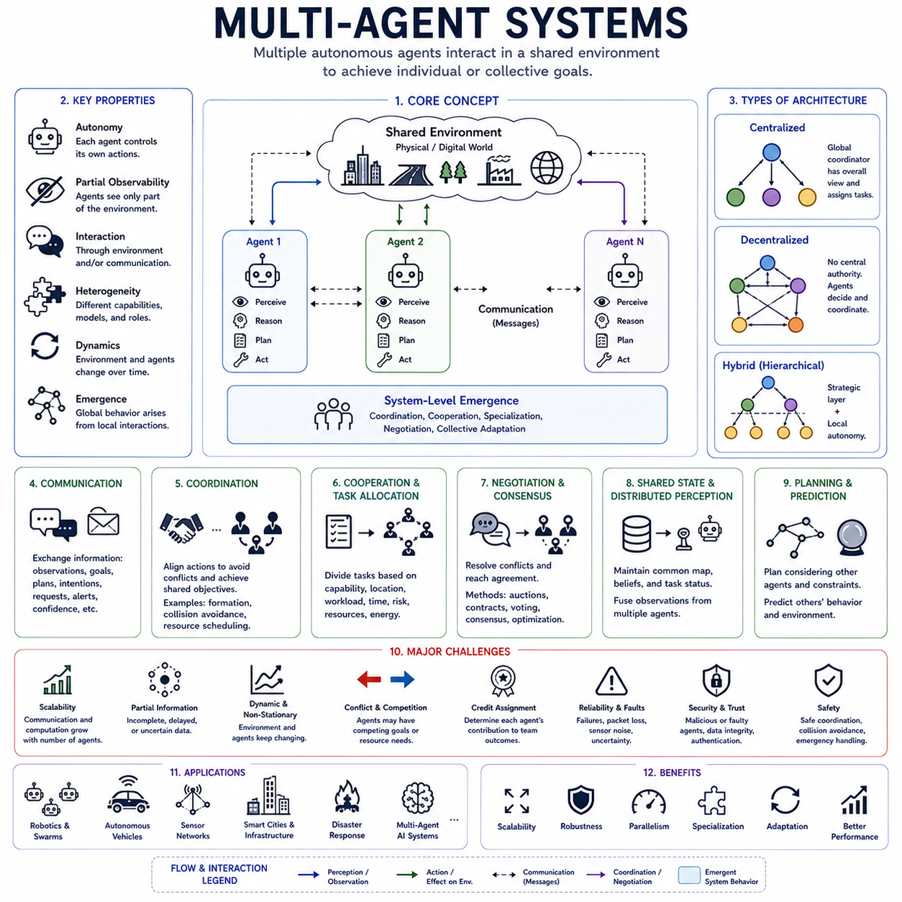{width="7.268055555555556in" height="7.268055555555556in"}

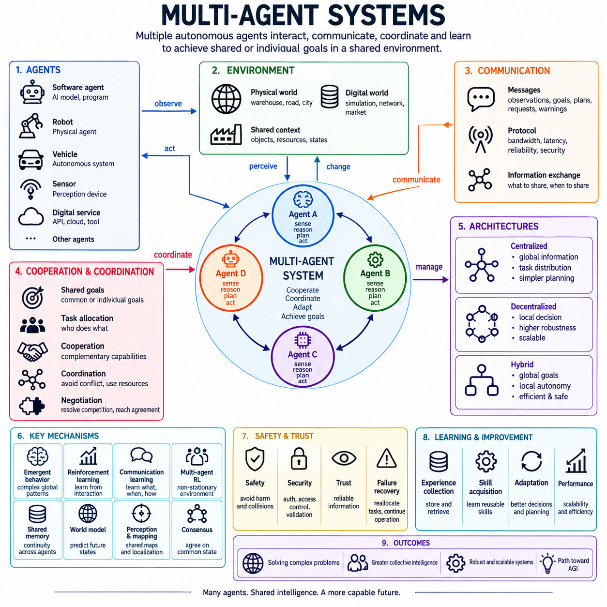{width="7.268055555555556in" height="7.268055555555556in"}

Multi-Agent Systems are computational architectures in which multiple autonomous agents interact within a shared environment to pursue individual, cooperative, or partially overlapping goals. Instead of concentrating perception, reasoning, planning, and action within one centralized intelligence, capabilities are distributed across several agents. System-level intelligence can therefore emerge from communication, coordination, specialization, negotiation, and collective adaptation among interacting entities.

An agent in a multi-agent system maintains some degree of autonomy over its observations, internal state, decisions, and actions. Agents may be software processes, AI models, robots, vehicles, sensors, digital services, or combinations of these forms. Each agent typically observes only part of the environment and possesses limited knowledge, resources, or capabilities, making cooperation valuable when problems exceed what any individual agent can solve efficiently.

The environment provides the shared context in which agents operate. It may be a physical space such as a warehouse, road network, factory, battlefield, or city, or a digital environment such as a simulation, network, market, or information system. Actions performed by one agent can modify environmental states observed by others, creating indirect interaction even when agents do not communicate explicitly.

Communication provides a direct mechanism for exchanging information between agents. Messages may contain observations, beliefs, goals, intentions, plans, requests, warnings, task assignments, or confidence estimates. Effective communication requires more than transferring raw data because bandwidth, latency, reliability, security, and computational cost may constrain information exchange. Agents must therefore determine what information is important enough to communicate and when communication is necessary.

Coordination organizes the actions of multiple agents so that their behaviors do not interfere unnecessarily and can contribute to shared objectives. Agents may coordinate spatial movement, resource usage, task execution, sensing, manipulation, or information gathering. Without coordination, individually reasonable actions can produce congestion, duplication, conflict, unsafe interactions, or inefficient use of shared resources.

Cooperation occurs when agents actively contribute toward a common objective. Different agents can provide complementary capabilities, allowing the group to divide a complex task into smaller components. One agent may specialize in perception, another in planning, another in verification, and another in execution. In robotic systems, different physical agents may instead specialize according to mobility, payload, sensing capability, endurance, or manipulation ability.

Task allocation determines which agent should perform which part of a collective objective. Allocation can consider capability, location, workload, energy, expected completion time, risk, communication quality, and resource availability. Centralized assignment can provide globally informed decisions, while decentralized allocation allows agents to negotiate or independently select tasks based on local information and changing conditions.

Centralized multi-agent architectures use a coordinator or supervisory component to maintain global information and distribute tasks. This can simplify planning and conflict resolution because one component has a broader view of system state. However, the coordinator can become a computational bottleneck, communication dependency, or single point of failure, particularly when the number of agents increases or communication becomes unreliable.

Decentralized architectures distribute decision authority among agents. Each agent reasons from local observations and exchanged information while adapting its behavior to other agents. Such systems can provide greater robustness and scalability because operation does not depend entirely on a central controller. Their difficulty lies in achieving coherent global behavior when no individual agent possesses complete information about the entire system.

Hybrid architectures combine centralized and decentralized mechanisms. Strategic goals, policies, or large-scale task allocation may be managed centrally, while local navigation, collision avoidance, immediate coordination, and failure recovery are handled autonomously by individual agents. This hierarchy can preserve global direction while allowing fast responses to local events without continuously consulting a central authority.

Shared state is important when agents must maintain a consistent understanding of the environment. This state may include maps, object locations, task status, resource availability, detected hazards, agent positions, or shared goals. Maintaining perfect consistency is often impossible in distributed environments, so systems must tolerate delayed, incomplete, or conflicting information while determining which observations are sufficiently recent and trustworthy.

Distributed perception allows several agents to combine observations that would be incomplete individually. Multiple robots can observe an environment from different viewpoints, extend sensing coverage, reduce occlusion, and provide redundancy. Sensor fusion across agents can improve environmental understanding, but it requires spatial alignment, temporal synchronization, uncertainty management, data association, and efficient communication between distributed sensing platforms.

Distributed mapping and localization are important examples in mobile robotics. Individual agents can build local maps while exchanging selected landmarks, features, poses, or map segments with others. The collective system can gradually construct a larger shared representation. Challenges arise from accumulated localization error, inconsistent coordinate frames, duplicate landmarks, communication delays, and incorrect loop closures between observations made by different agents.

Planning in a multi-agent system must consider not only environmental dynamics but also the expected behavior of other agents. A path that is optimal for one robot may interfere with another robot\'s route, while several agents may compete for the same resource. Multi-agent planning therefore involves joint constraints, temporal dependencies, collision avoidance, resource conflicts, and predictions about how other agents are likely to behave.

Negotiation provides a mechanism for resolving situations in which several agents have competing preferences or resource requirements. Agents may exchange proposals, bids, priorities, or alternative plans until an acceptable allocation is reached. Auction-based mechanisms, contract-based approaches, consensus algorithms, and distributed optimization can provide structured methods for coordinating decisions without requiring a single agent to dictate every action.

Consensus is required when multiple agents need to agree on a common value, state, decision, or objective despite distributed information. Agents repeatedly exchange local estimates and adjust them according to information received from neighbors. Consensus mechanisms are useful for formation control, distributed estimation, synchronized decisions, shared beliefs, and cooperative planning, although their performance depends strongly on communication topology and network reliability.

Emergent behavior is a defining property of many Multi-Agent Systems. Complex global patterns can arise from relatively simple local interaction rules without being explicitly programmed at the system level. Swarm formation, collective exploration, traffic organization, distributed coverage, and cooperative transport illustrate how local decisions can produce coordinated group behavior. Emergence can increase scalability but can also make system-level behavior difficult to predict or verify.

Multi-agent reinforcement learning extends reinforcement learning to environments containing multiple learning agents. Each agent learns policies from interaction while the behavior of other agents becomes part of its effective environment. This creates a non-stationary learning problem because the environment changes as other agents update their own policies. Cooperative rewards, competitive rewards, or mixed objectives can produce fundamentally different learning dynamics.

Centralized Training with Decentralized Execution provides one strategy for addressing this challenge. During training, agents may use global information, shared observations, or the states and actions of other agents to learn coordinated behavior. During deployment, each agent executes its policy using only locally available information. This approach enables richer coordination during learning while preserving decentralized operation when communication or centralized computation is unavailable.

Credit assignment becomes difficult when many agents contribute to a shared outcome. If a team succeeds or fails, the learning system must determine how much each agent\'s behavior contributed to the result. Poor credit assignment can encourage passive behavior or unstable cooperation. Value decomposition, counterfactual evaluation, difference rewards, and agent-specific feedback provide possible mechanisms for identifying individual contributions to collective performance.

Communication itself can be learned. Instead of relying entirely on manually designed message formats, agents can learn what information to transmit, which recipients require it, and when communication is valuable. Learned communication can reduce bandwidth and discover task-specific protocols, but the resulting representations may be difficult for humans to interpret and must remain robust to packet loss, changing team composition, and unfamiliar situations.

LLM-based Multi-Agent Systems introduce language models as autonomous or semi-autonomous participants. Different LLM agents can assume roles such as planner, researcher, critic, programmer, verifier, or coordinator. Natural language provides a flexible communication medium, allowing agents to exchange reasoning results and delegate tasks. However, repeated language-model communication can increase computational cost and propagate unsupported assumptions between agents.

Role specialization can improve multi-agent performance when responsibilities are clearly separated. A planning agent can decompose objectives, specialist agents can solve individual components, and a verification agent can examine results before execution. Specialization reduces the requirement for every agent to perform every type of reasoning, but excessive fragmentation can create communication overhead and make responsibility for errors difficult to identify.

Shared memory can provide continuity across cooperating agents. Instead of repeatedly transmitting complete histories, agents can write relevant observations, decisions, plans, and results into a common memory system. Other agents retrieve information according to their tasks. Shared memory must nevertheless manage provenance, permissions, conflicting updates, stale information, and uncertainty so that incorrect information does not silently become accepted collective knowledge.

World models can support coordinated prediction by representing how the environment and other agents may evolve. Each agent can maintain a local world model, while selected states or predictions are exchanged with teammates. Alternatively, a shared model can provide common environmental dynamics. Predicting other agents\' intentions is particularly important because their actions can significantly change the future states available to the entire group.

Multi-robot systems bring additional physical constraints that do not appear in purely digital agent systems. Robots have finite battery capacity, limited sensing range, mechanical constraints, communication dead zones, localization uncertainty, and collision risks. Coordination must therefore operate under real-time physical constraints while preserving safe local autonomy when communication with other robots or central infrastructure is temporarily unavailable.

Resilience is one of the major motivations for distributed intelligence. If one agent fails, remaining agents may redistribute its tasks and continue operating. Communication networks can reroute information, and redundant sensing can compensate for lost observations. Achieving this robustness requires explicit failure detection, degraded-operation modes, dynamic task reallocation, and architectures that avoid unnecessary dependence on individual agents.

Safety becomes more complicated as autonomous agents interact. A safe action for one agent considered independently may create unsafe conditions when combined with another agent\'s action. Multi-agent safety therefore requires local safety constraints together with mechanisms for shared collision avoidance, resource exclusion, priority management, emergency signaling, and coordinated stopping. Critical protections should remain operational even when higher-level communication fails.

Trust and security are equally important because agents act on information received from others. A malfunctioning, compromised, or inaccurate agent can distribute incorrect state estimates or harmful instructions throughout the system. Authentication, access control, message validation, anomaly detection, provenance tracking, and confidence estimation help prevent distributed communication from becoming a channel through which errors propagate across the entire architecture.

Scalability depends on controlling interaction complexity. If every agent continuously communicates with every other agent, communication and computation can grow rapidly as the population increases. Hierarchical organization, local neighborhoods, event-triggered communication, compressed representations, selective information sharing, and dynamic team formation can reduce this burden while preserving the information required for effective coordination.

Hierarchical Multi-Agent Systems can organize agents into teams, clusters, or command levels. Local agents solve immediate problems, team coordinators integrate regional information, and higher-level components manage strategic objectives. Such architectures reduce the need for global communication at every decision step and provide a practical way to connect fast local autonomy with slower system-wide planning.

Multi-Agent Systems also provide a natural architecture for combining heterogeneous intelligence. One agent may use symbolic planning, another may use reinforcement learning, another may use an LLM, and another may implement deterministic control. Agents do not need identical internal architectures as long as they can exchange meaningful state and coordinate actions through compatible protocols. The collective system can therefore combine specialized forms of intelligence.

Metacognition can operate at both individual and collective levels. Individual agents can monitor their own confidence, progress, resource state, and failures, while supervisory or distributed mechanisms evaluate team-level performance. The system can detect duplicated effort, communication breakdown, conflicting plans, or agents operating outside their competence and respond through replanning, role reassignment, additional verification, or human intervention.

From an AGI perspective, Multi-Agent Systems demonstrate that general intelligence does not necessarily need to reside inside a single monolithic model. Complex capabilities can emerge from communities of specialized agents that share knowledge, divide tasks, reason collectively, and adapt their organization. This resembles many biological and human systems in which distributed individuals create capabilities that exceed those of any isolated participant.

The broader architectural significance of Multi-Agent Systems lies in transforming intelligence from an individual computation problem into a coordination problem. Perception, memory, reasoning, planning, learning, and action can be distributed across interacting entities, while communication and shared representations connect them into a coherent system. Effective collective intelligence therefore depends not only on how capable each agent is, but on how reliably the agents cooperate, coordinate, learn, and recover together.

## 04.08. Cognitive Loop Design

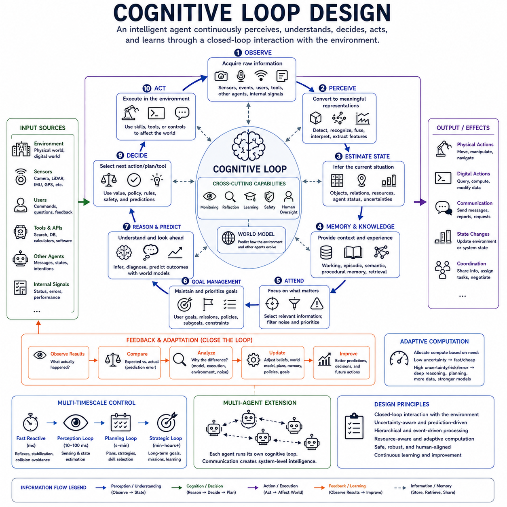{width="7.268055555555556in" height="7.268055555555556in"}

Cognitive Loop Design defines how an intelligent agent repeatedly transforms observations into understanding, decisions, actions, and learning. Rather than treating intelligence as a single inference operation, it organizes cognition as a continuous closed-loop process in which every action changes the environment and produces new observations. The agent therefore operates through recurrent interaction rather than through isolated input-output computation.

The cognitive loop begins with observation, where information is acquired from the external environment, internal system state, memory, users, tools, or other agents. Observations may include sensory signals, language, events, task status, errors, resource conditions, and feedback from previous actions. Because raw observations can be noisy, incomplete, redundant, or uncertain, they must be transformed before higher-level reasoning can reliably use them.

Perception converts observations into meaningful internal representations. Neural models may detect objects, recognize patterns, estimate states, interpret language, or fuse multimodal information. In embodied systems, perception may combine cameras, LiDAR, radar, proprioception, localization, and environmental maps. The objective is not merely to recognize data but to construct a task-relevant interpretation of what is currently happening.

State estimation integrates current perception with previous knowledge to determine the agent\'s best representation of the present situation. Since observations rarely reveal the complete state of an environment, the agent must infer hidden variables and maintain beliefs about uncertain conditions. The resulting state may contain objects, relationships, goals, constraints, resources, agent status, uncertainties, and relevant temporal information.

Memory provides continuity between successive cognitive cycles. Working memory maintains information required for the current reasoning process, episodic memory stores previous experiences and outcomes, semantic memory preserves generalized knowledge, and procedural memory contains reusable skills or strategies. Retrieval mechanisms select relevant information so that the agent can interpret the current situation in the context of what it has previously learned.

Attention determines which information deserves computational resources during a particular cycle. An agent may receive more observations than it can process with equal depth, making selective processing necessary. Novel events, high uncertainty, prediction errors, safety risks, goal-relevant changes, and unexpected behavior can receive higher priority, while familiar and stable conditions may be processed through less computationally expensive mechanisms.

Goal management defines what the agent is attempting to achieve and how competing objectives should be prioritized. Goals may originate from users, system policies, long-term missions, environmental conditions, or internally generated subgoals. A cognitive architecture must preserve goals across multiple cycles while allowing priorities to change when new evidence, risks, opportunities, or constraints appear.

Reasoning interprets the current state relative to goals and knowledge. The agent may infer relationships, diagnose problems, compare alternatives, resolve inconsistencies, or determine what additional information is required. Neural reasoning, symbolic reasoning, probabilistic inference, causal models, language models, or combinations of these mechanisms can participate depending on the architecture and the nature of the problem.

Prediction extends reasoning into the future by estimating how the environment may evolve. A world model can predict state transitions resulting from environmental dynamics, other agents, or the agent\'s own actions. Instead of responding only to the present observation, the cognitive loop can evaluate possible future states and determine whether candidate actions are likely to move the system toward desired outcomes.

Planning converts goals and predictions into organized sequences of actions. The planner may decompose a large objective into subgoals, evaluate alternative paths, estimate costs and risks, and identify required resources. Plans should not be treated as immutable scripts because environmental conditions can change. They are hypotheses about future action that must remain subject to continuous monitoring and revision.

Decision making selects which action, plan, tool, or skill should be executed next. Selection can depend on expected value, uncertainty, safety, resource cost, urgency, learned policy, symbolic constraints, and predicted outcomes. In complex architectures, decision making may arbitrate between fast reactive responses and slower deliberative reasoning, allowing the system to adapt its computational effort to the difficulty of the situation.

Action translates cognitive decisions into effects on the environment. For software agents, an action may involve querying a database, calling an API, generating a message, executing code, or modifying a digital state. For embodied agents, actions may include navigation, manipulation, communication, sensing, or control commands. Execution should occur through interfaces that clearly define capabilities, permissions, constraints, and expected feedback.

Control connects high-level intentions with reliable execution. A cognitive agent should generally avoid using expensive deliberative reasoning for every low-level operation. Hierarchical control can separate strategic cognition from fast reactive processes, allowing specialized controllers to handle stabilization, tracking, collision avoidance, or motor commands while higher cognitive layers determine goals, tasks, and behavioral strategies.

Feedback closes the cognitive loop. After an action is executed, the agent observes its consequences and compares actual outcomes with predicted outcomes. Successful predictions increase confidence in the current model, while discrepancies create prediction errors that indicate incomplete knowledge, environmental change, execution failure, or incorrect assumptions. These errors become important signals for adaptation.

Monitoring continuously evaluates whether execution remains consistent with goals, constraints, and expected progress. The system can detect stalled plans, repeated failures, unexpected environmental changes, resource depletion, communication loss, or deteriorating confidence. Monitoring prevents the architecture from blindly continuing a previously selected plan when evidence indicates that the underlying assumptions are no longer valid.

Reflection operates at a higher level by evaluating the reasoning process itself. The agent may examine why a decision failed, whether an inappropriate tool was selected, whether important evidence was ignored, or whether its world model is inaccurate. Reflection can trigger replanning, memory retrieval, additional observation, alternative reasoning strategies, or escalation to another agent or human operator.

Learning converts experience from completed cognitive cycles into future capability. Prediction errors, rewards, corrections, successful plans, failed actions, and human feedback can update neural models, policies, memories, world models, or reusable skills. The cognitive loop therefore becomes not only a mechanism for controlling behavior but also the primary pathway through which experience modifies subsequent cognition.

A central design principle is that not every cognitive cycle requires the same computational effort. Stable and predictable situations can often be handled through learned policies, cached solutions, reactive control, or lightweight prediction. When novelty, uncertainty, conflict, risk, or prediction error increases, the architecture can activate deeper reasoning, larger models, broader memory retrieval, simulation, or more extensive planning.

This creates an adaptive cognitive loop in which computational intensity varies according to environmental demand. A robot traveling through a familiar, empty corridor may rely primarily on perception and routine control, while an unexpected obstacle or ambiguous situation can activate additional world-model prediction and planning. Cognitive resources are therefore allocated according to informational significance rather than consumed uniformly at every moment.

Prediction error can serve as an important trigger for this adaptive allocation. When expected and observed states remain closely aligned, the system has evidence that its current models and policies are functioning adequately. Large deviations indicate that the environment or internal model requires additional attention. This provides a practical connection between cognitive loop design, predictive processing, active inference, and resource-aware AI.

Multiple timescales can coexist within the same architecture. Millisecond-level control loops can maintain physical stability, perception loops can update environmental state several times per second, planning loops can operate over seconds or minutes, and strategic reasoning can address much longer horizons. Attempting to force all cognitive processes into one uniform update frequency would be computationally inefficient and operationally fragile.

Hierarchical cognitive loops therefore allow different levels of intelligence to operate at appropriate temporal scales. Lower layers handle immediate sensorimotor interactions, intermediate layers manage skills and local plans, and higher layers maintain goals, strategies, semantic reasoning, and long-term context. Information moves upward when significant events require broader reasoning and downward when strategic decisions must be converted into executable behavior.

Event-driven cognition can complement periodic processing. Instead of executing every cognitive function at a fixed rate, specific events can activate particular modules. A sudden obstacle can trigger safety planning, a communication failure can activate network recovery, a large prediction error can trigger world-model reassessment, and completion of a subgoal can activate the next planning stage. This reduces unnecessary computation while preserving responsiveness.

Metacognition provides supervisory control over the cognitive loop itself. It can monitor uncertainty, progress, computational cost, confidence, model performance, and remaining objectives. The agent can determine whether to continue the current strategy, gather more information, invoke a stronger reasoning process, switch models, reduce computational effort, request assistance, or terminate an activity when further processing provides little value.

Safety must remain integrated throughout the loop rather than appearing only after a decision has been generated. Perception should identify hazards, planning should respect safety constraints, action interfaces should enforce operational limits, and monitoring should detect dangerous deviations. Independent safety mechanisms may override higher-level cognition when immediate physical or digital risks require deterministic intervention.

Human oversight can be incorporated as another path through the loop. When uncertainty, risk, authority requirements, or ethical constraints exceed predefined thresholds, the agent can request clarification or approval. Human feedback then becomes a new observation that modifies state, goals, plans, or constraints. This allows autonomy to vary dynamically instead of being defined as an all-or-nothing architectural property.

In Multi-Agent Systems, cognitive loops operate simultaneously across several agents. Each agent maintains its own perception, reasoning, planning, action, and learning cycle while communication connects local loops into a larger collective process. Shared observations, intentions, plans, and predictions can influence other agents, creating a system-level cognitive loop that emerges from coordinated local intelligence.

LLM-based agents can occupy the deliberative portions of this architecture. A language model can interpret goals, reason about structured state, retrieve knowledge, generate plans, select tools, and reflect on outcomes. However, reliable cognitive loop design places the LLM alongside memory, world models, verification, deterministic control, safety mechanisms, and external tools rather than expecting the language model to perform every cognitive function directly.

NeuroSymbolic mechanisms can further strengthen the loop by combining learned perception with explicit knowledge and constraints. Neural models provide flexible interpretation of complex observations, while symbolic representations maintain goals, rules, relationships, permissions, and task states. The cognitive loop becomes the operational framework through which these different forms of intelligence continuously exchange information.

For embodied and Physical AI systems, Cognitive Loop Design provides the bridge between perception and autonomous behavior. Sensors describe the changing world, state estimation constructs an internal representation, memory provides context, world models predict consequences, planners organize future behavior, controllers execute actions, and feedback reveals whether expectations were correct. Intelligence emerges from the continuous coordination of these processes.

From an AGI perspective, the cognitive loop provides a temporal architecture for integrating otherwise separate cognitive capabilities. Perception without memory lacks continuity, reasoning without action cannot affect the environment, planning without feedback cannot adapt, and learning without interaction lacks grounded experience. The loop connects these functions so that cognition becomes an ongoing process of understanding, predicting, acting, evaluating, and improving.

A mature Cognitive Loop Design therefore resembles a dynamically regulated hierarchy of interacting loops rather than a simple linear pipeline. Fast reactive mechanisms operate continuously, deliberative reasoning activates when needed, memory connects experience across time, world models anticipate consequences, metacognition regulates computational effort, and learning modifies future behavior. Such a design provides a foundation for adaptive, efficient, safe, and increasingly autonomous intelligent systems.
