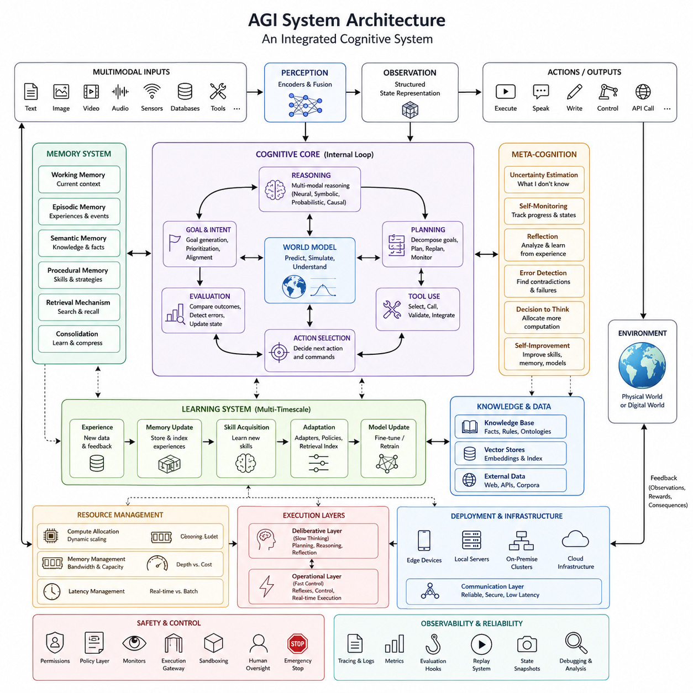
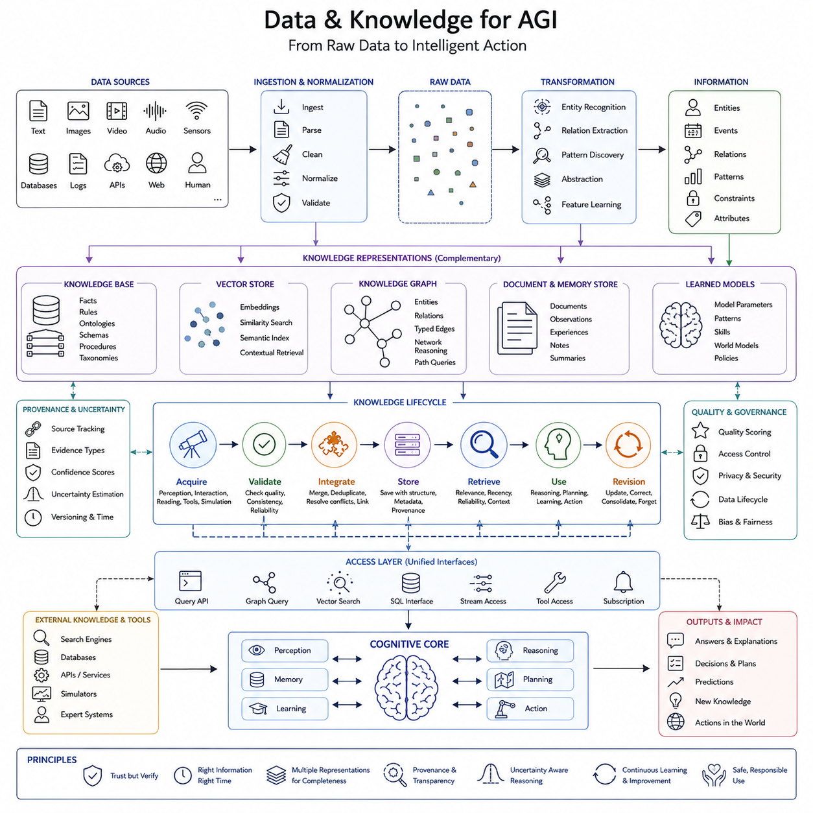
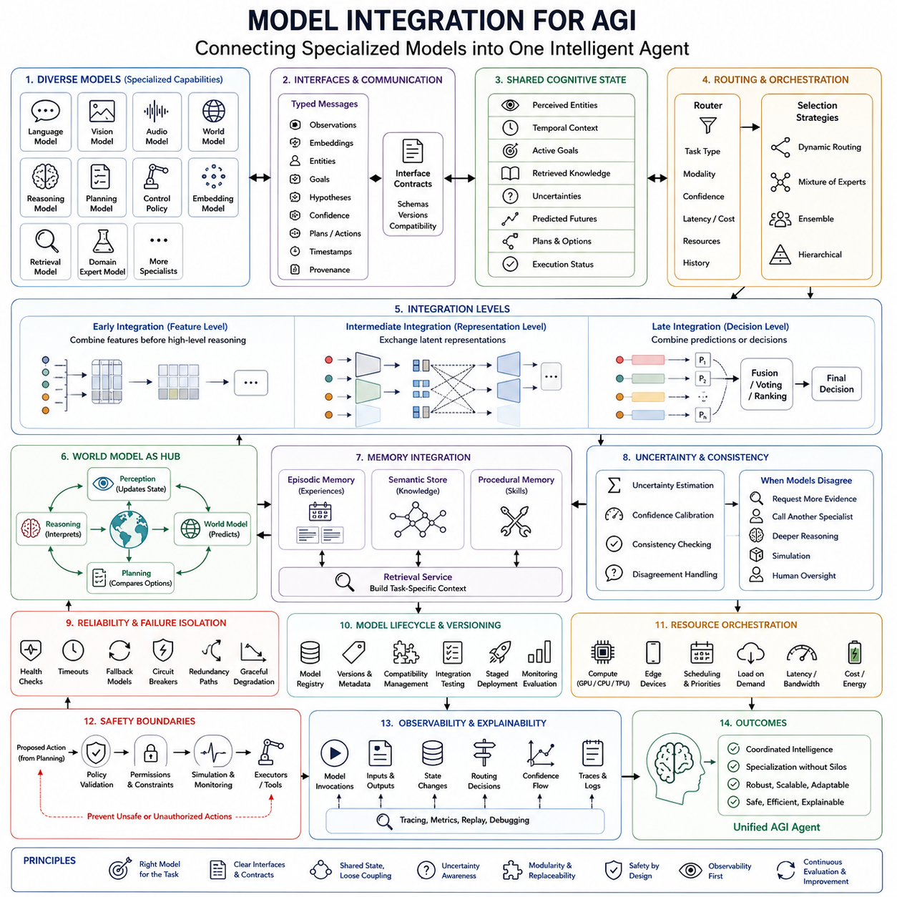
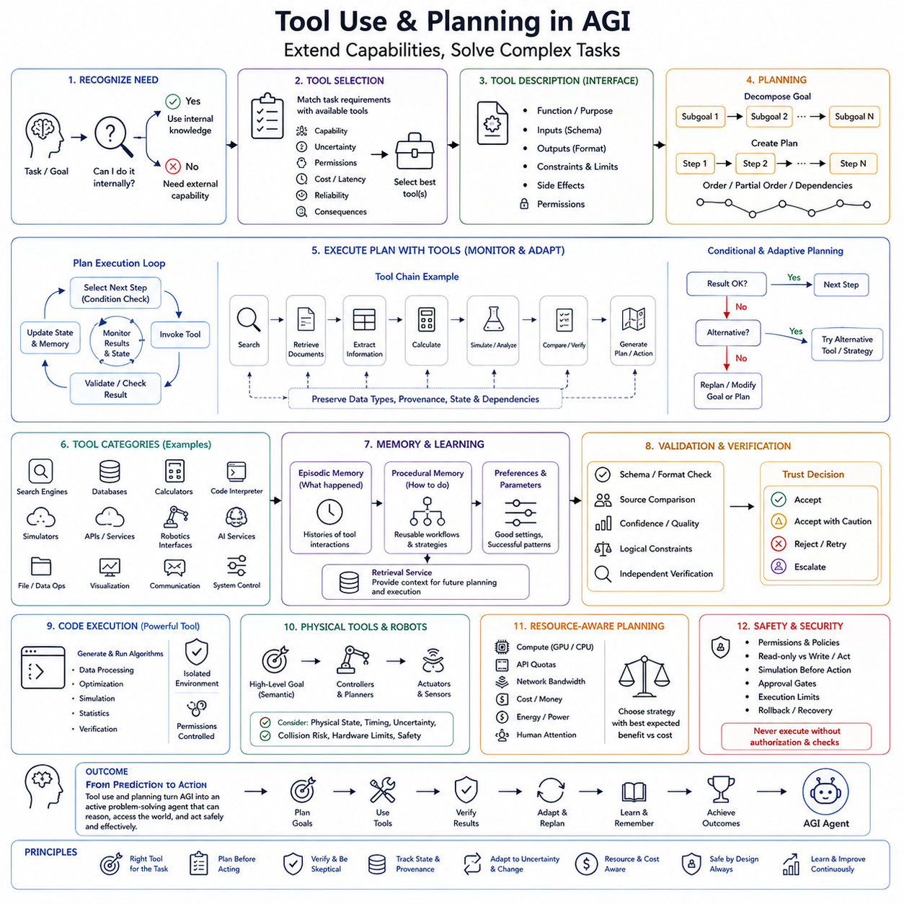
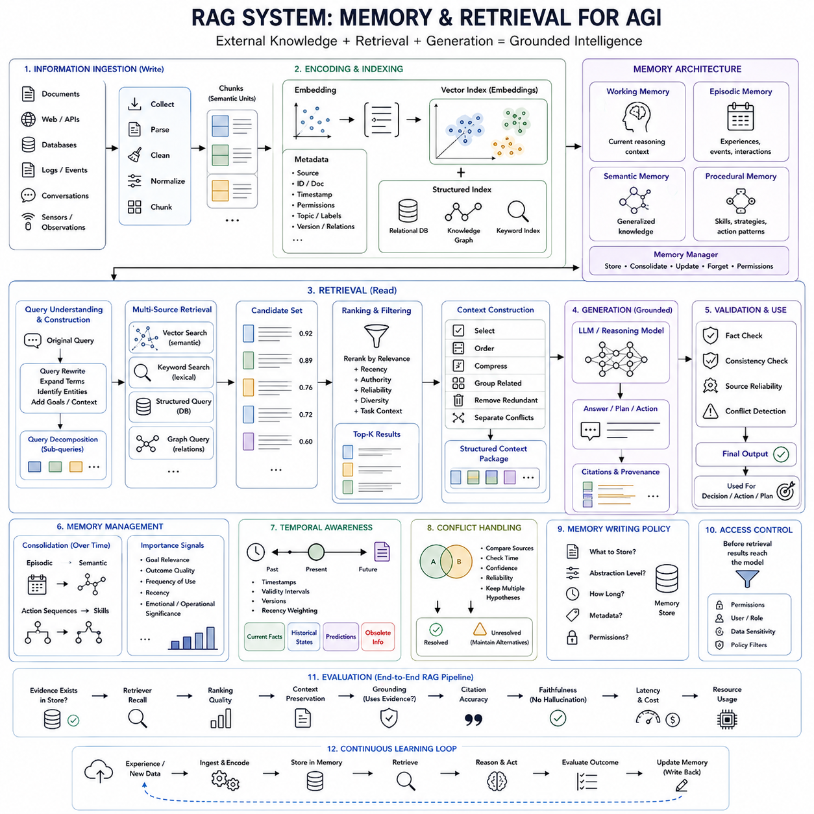
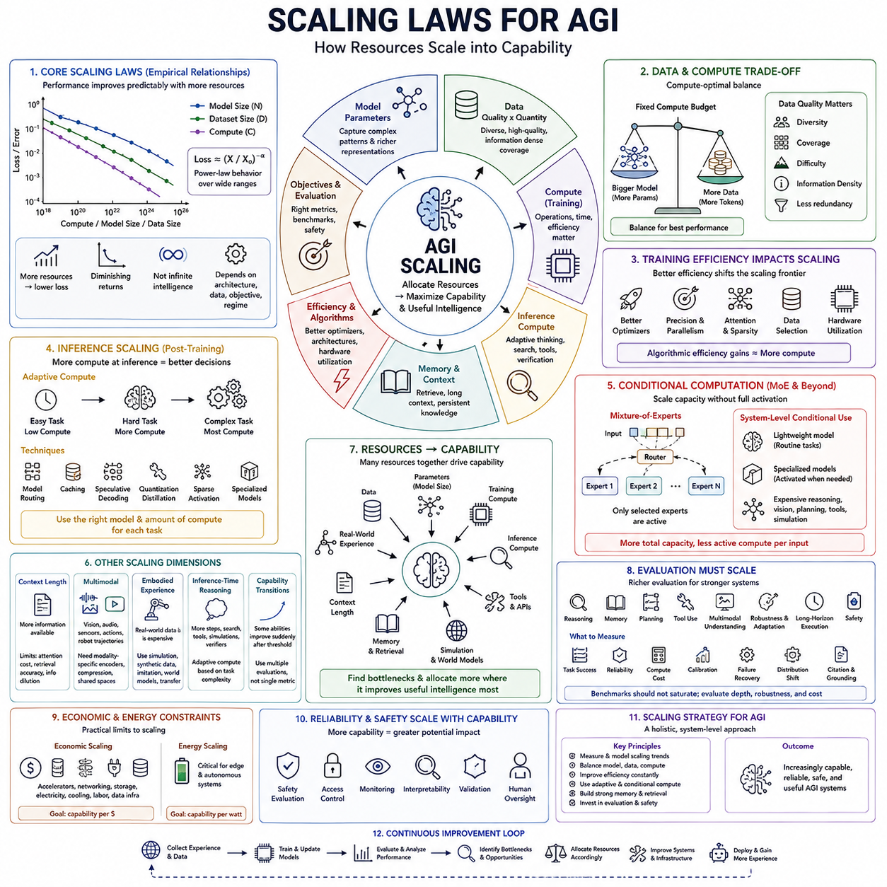
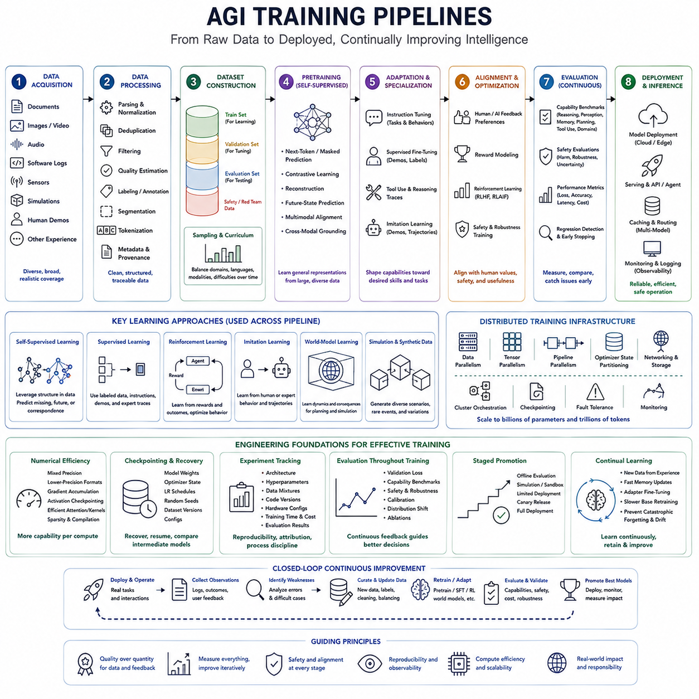
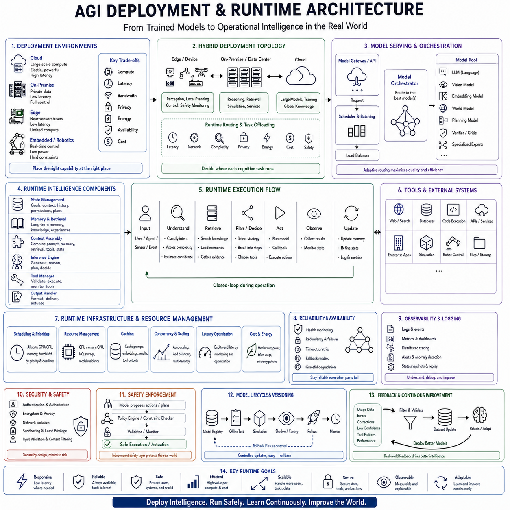
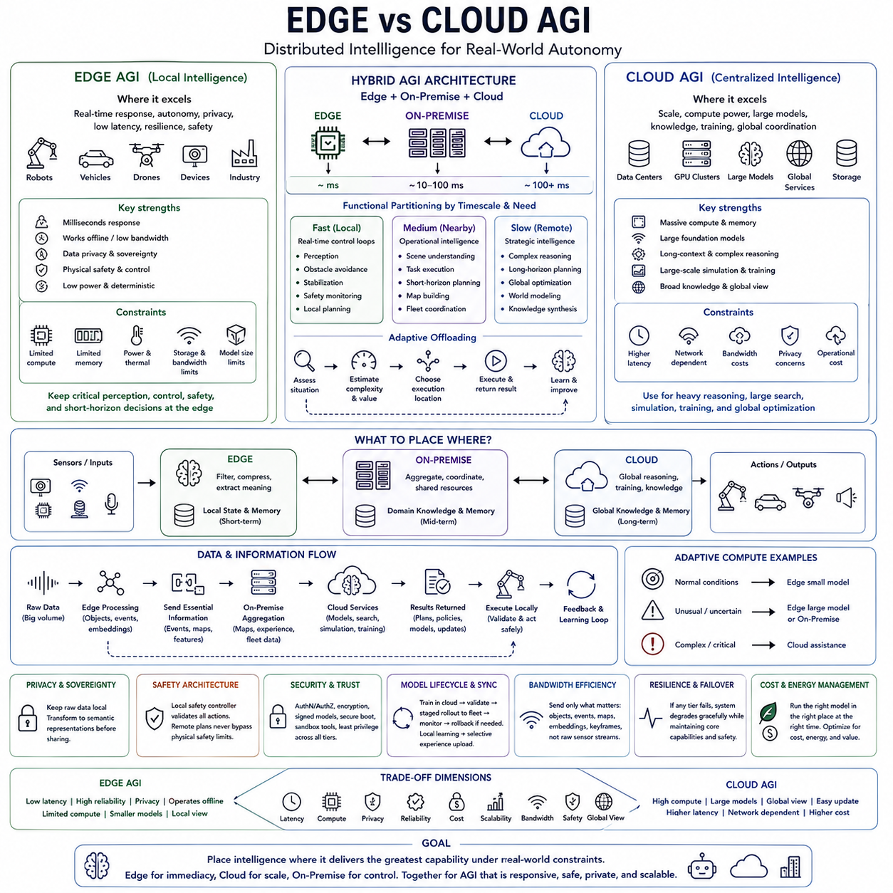
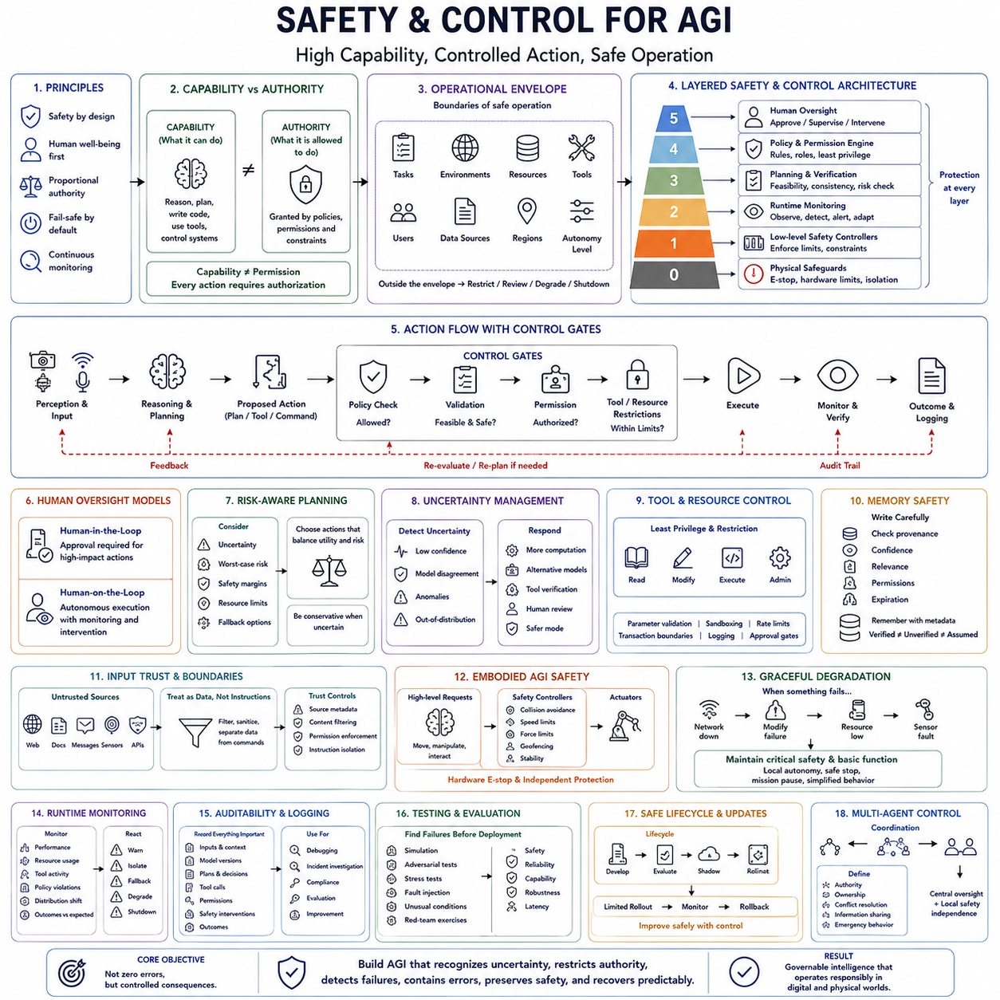

**Volume 47. Artificial General Intelligence**

# Chapter 05. Engineering AGI

## 05.00. System Architecture

{width="7.268055555555556in" height="7.268055555555556in"}

인공일반지능(Artificial General Intelligence, AGI) 시스템을 공학적으로 구현하려면 지능(Intelligence)을 하나의 단일 모델(single model)이 아니라 서로 협력하는 소프트웨어 및 컴퓨팅 아키텍처(software and computational architecture)로 다루어야 한다. 시스템은 지각(perception), 기억(memory), 추론(reasoning), 계획(planning), 학습(learning), 행동(action), 메타인지(meta-cognition)를 명확한 인터페이스(interface)를 통해 연결해야 한다. 이러한 아키텍처 관점은 앞선 장에서 다룬 핵심 메커니즘(core mechanisms)을 실제로 동작하는 하나의 시스템으로 통합하는 엔지니어링 AGI(Engineering AGI)의 기본 관점이다.

실용적인 AGI 아키텍처(AGI architecture)는 지속적인 인지 루프(cognitive loop)를 중심으로 구성할 수 있다. 관측(observation)은 지각 서비스(perception services)를 통해 입력되어 구조화된 내부 표현(internal representation)으로 변환된다. 관련 기억과 지식이 검색되고 현재 상황이 해석되며, 가능한 목표와 계획이 생성되고 행동이 선택된다. 이후 행동으로 발생한 새로운 관측을 평가하면서 내부 상태(internal state)를 지속적으로 갱신한다. 따라서 각각의 상호작용을 독립적인 추론 요청으로 처리하는 방식과 근본적으로 다르다.

따라서 이러한 아키텍처에는 서로 다른 구성요소를 연결하는 공유 표현 계층(shared representation layer)이 필요하다. 언어 모델(language model)은 주로 토큰(token)을 처리하고, 비전 모델(vision model)은 공간 특징(spatial features)을 처리하며, 지식 시스템(knowledge system)은 개체(entity)와 관계(relation)를 다루고, 제어 시스템(control system)은 연속적인 상태와 행동을 처리한다. 공통 의미 공간(common semantic space) 또는 잠재 작업공간(latent workspace)은 객체의 정체성, 시간적 관계, 불확실성, 목표, 제약조건, 인과적 가설을 유지하여 한 하위 시스템의 정보를 다른 시스템에서 의미 있게 사용할 수 있도록 해야 한다.

지각(perception)은 일반적으로 하나의 입력 인코더(input encoder)가 아니라 멀티모달 하위 시스템(multimodal subsystem)으로 구현해야 한다. 텍스트(text), 이미지(image), 비디오(video), 오디오(audio), 텔레메트리(telemetry), 데이터베이스(database), 센서(sensor), 외부 도구(external tools)는 동일한 환경에 대해 서로 보완적인 정보를 제공할 수 있다. 각 모달리티(modality)는 전문 인코더를 통해 처리되고, 융합 메커니즘(fusion mechanism)을 통해 일관된 상태 표현(state representation)으로 통합된다. 체화형 AGI(embodied AGI)에서는 공간 구조, 움직임, 객체 지속성, 에이전트 상태와 시간에 따른 환경 변화까지 표현해야 한다.

기억 아키텍처(memory architecture)는 단순히 대화 기록을 저장하는 것보다 훨씬 광범위하다. 작업 기억(working memory)은 현재 추론 과정에 필요한 정보를 유지하고, 일화 기억(episodic memory)은 경험과 그 맥락을 기록하며, 의미 기억(semantic memory)은 일반화된 지식을 보존하고, 절차 기억(procedural memory)은 재사용 가능한 기술과 전략을 표현한다. 검색 메커니즘(retrieval mechanism)은 필요한 정보를 선택적으로 복원하며, 기억 통합(memory consolidation)은 반복된 경험을 보다 안정적인 표현으로 변환하여 이후의 추론과 행동에 영향을 미치도록 한다.

월드 모델(world model)은 상태가 어떻게 변화하는지를 나타내는 내부 표현(internal representation)을 아키텍처에 제공한다. 현재 관측에 단순히 반응하는 대신 시스템은 숨겨진 상태(hidden state)를 추정하고, 미래 상황을 예측하며, 가능한 행동을 내부적으로 시뮬레이션하고, 실제 행동 전에 여러 결과를 비교할 수 있다. 이러한 모델은 학습된 잠재 동역학(latent dynamics), 명시적 기호 지식(symbolic knowledge), 물리적 제약(physical constraints), 인과관계(causal relationships), 불확실성 추정(uncertainty estimation)을 결합할 수 있다. 따라서 월드 모델은 지각, 추론, 계획, 제어를 연결하는 핵심적인 연결 계층이 된다.

추론 계층(reasoning layer)은 신경망 기반 생성(neural generation)에만 의존하기보다 여러 계산 방식을 지원해야 한다. 익숙한 상황에서는 빠른 패턴 기반 추론(pattern-based inference)이 효과적이지만 어려운 문제에서는 명시적 탐색(explicit search), 기호 조작(symbolic manipulation), 확률적 추론(probabilistic inference), 인과 추론(causal reasoning), 제약조건 해결(constraint solving), 외부 계산(external computation)이 필요할 수 있다. 라우팅 또는 오케스트레이션 메커니즘(routing or orchestration mechanism)은 작업 복잡성, 신뢰도, 사용 가능한 계산 자원, 요구되는 신뢰성에 따라 적절한 추론 자원을 선택할 수 있다.

계획(planning)은 목표와 해석된 세계 상태(world state)를 구조화된 의사결정 과정으로 변환한다. 단기 계획(short-horizon planning)은 다음 행동을 직접 선택할 수 있지만 장기 작업(long-horizon task)은 목표를 세부 목적, 하위 목표, 의존관계, 점검 지점, 복구 전략으로 분해해야 한다. 새로운 관측이 기존 가정을 무효화할 수 있으므로 계획은 수정 가능해야 한다. 따라서 아키텍처는 최초 계획을 고정적으로 실행하는 대신 계획, 실행, 모니터링, 재계획(replanning), 종료가 반복되는 지속적인 순환 구조를 지원해야 한다.

도구 사용(tool use)은 AGI 시스템의 실질적인 능력 범위를 확장한다. 검색 엔진(search engine), 데이터베이스(database), 소프트웨어 API, 시뮬레이터(simulator), 수학적 솔버(mathematical solver), 코드 실행 환경(code execution environment), 로봇 인터페이스(robotic interface), 전문 모델(specialized model)은 외부 인지 자원(external cognitive resources)으로 활용될 수 있다. 중앙 아키텍처는 적절한 도구를 발견하거나 선택하고, 유효한 요청을 생성하며, 반환된 정보를 검증하고, 실행에 따른 부수 효과(side effect)를 추적하며, 외부에서 획득한 증거와 내부에서 생성한 가설을 구별하면서 결과를 기억과 추론 과정에 통합해야 한다.

학습(learning)은 여러 시간 척도(timescale)에 걸쳐 작동해야 한다. 대규모 기반 구성요소(foundation components)는 비용이 높은 오프라인 학습(offline training)을 통해 천천히 변경될 수 있지만, 어댑터(adapter), 기억 구조(memory structure), 정책(policy), 검색 인덱스(retrieval index), 기술(skill), 작업별 표현(task-specific representation)은 보다 빠르게 변화할 수 있다. 온라인 경험(online experience)이 모든 모델 파라미터를 즉시 변경해서는 안 된다. 추론, 기억 갱신, 기술 습득, 미세조정(fine-tuning), 기반 모델 재학습을 아키텍처적으로 분리하면 파국적 망각(catastrophic forgetting)과 통제되지 않은 행동 변화(behavioral drift)를 줄일 수 있다.

메타인지(meta-cognition)는 시스템 자체의 작동을 평가하는 감독 과정(supervisory process)을 추가한다. AGI는 불확실성을 추정하고, 모순을 탐지하며, 자신의 지식 부족을 인식하고, 작업 진행 상태를 감시하며, 실패한 계획을 분석하고, 추가적인 계산이나 외부 증거가 필요한지를 판단할 수 있어야 한다. 성찰 메커니즘(reflection mechanism)은 예상 결과와 실제 결과를 비교하여 실패 원인이 지각, 검색, 추론, 계획, 도구 실행 또는 환경에 대한 잘못된 가정 가운데 어디에서 발생했는지를 식별할 수 있다.

공학적인 AGI 아키텍처에는 명시적인 자원 관리 계층(resource-management layer)도 필요하다. 서로 다른 인지 작업은 계산 비용과 지연시간(latency) 요구사항이 크게 다르다. 변화가 거의 없는 일상적인 관측은 경량 처리만 수행할 수 있지만, 새롭거나 위험성이 높은 상황에서는 심층 추론(deep reasoning), 대규모 모델, 추가 검색, 시뮬레이션 또는 여러 단계의 검증을 활성화할 수 있다. 계산량, 메모리 대역폭(memory bandwidth), 모델 용량(model capacity), 추론 깊이(reasoning depth)를 상황에 따라 동적으로 할당하면 시스템이 항상 최대 계산량으로 동작하지 않고 정보의 중요도에 따라 지능적 자원을 조절할 수 있다.

AGI가 물리적 세계와 상호작용할 경우 계층적 실행(hierarchical execution)은 특히 중요하다. 고수준 추론(high-level reasoning)은 상대적으로 느린 의미적 시간 척도에서 작동할 수 있지만 지각, 위치 추정(localization), 모션 계획(motion planning), 제어(control)는 결정론적 또는 실시간에 가까운 실행을 요구할 수 있다. 안전에 중요한 반사적 행동(reflexive action)이 긴 언어 모델 추론이 끝날 때까지 기다려서는 안 된다. 숙고적 인지(deliberative cognition)와 빠른 운영 제어(operational control)를 분리하면 복잡한 추론 능력을 유지하면서도 응답성, 안정성, 물리적 안전성을 확보할 수 있다.

분산 배포(distributed deployment)는 또 다른 중요한 아키텍처 차원을 형성한다. 구성요소는 지연시간, 개인정보 보호, 네트워크 대역폭, 에너지, 계산량 요구사항에 따라 엣지 장치(edge device), 로컬 서버(local server), 온프레미스 클러스터(on-premise cluster), 클라우드 인프라(cloud infrastructure)에 분산될 수 있다. 자주 사용되는 지각 및 제어 기능은 환경 가까이에 배치하고, 계산량이 큰 시뮬레이션이나 대규모 모델 추론은 연결성과 지연시간 조건이 허용되는 경우 원격 자원에 위임할 수 있다. 또한 원격 자원을 일시적으로 사용할 수 없는 상황에서도 시스템 전체가 치명적으로 실패하지 않도록 설계해야 한다.

모듈 간 통신(module communication)은 통제되지 않은 프롬프트 전달(prompt passing)이 아니라 명시적인 계약(interface contract)을 기반으로 해야 한다. 메시지에는 관측, 상태 추정, 목표, 가설, 증거, 신뢰도, 행동 제안, 실행 상태, 타임스탬프(timestamp), 출처 정보(provenance)가 포함될 수 있다. 형식화된 인터페이스(typed interface)와 버전 관리된 스키마(versioned schema)를 사용하면 각각의 모듈을 독립적으로 시험하고 교체할 수 있다. 이러한 모듈성(modularity)은 AGI 아키텍처가 하나의 기반 모델에 영구적으로 종속되지 않고 여러 세대의 모델과 함께 진화할 수 있도록 한다.

신뢰성(reliability)을 확보하려면 전체 인지 파이프라인(cognitive pipeline)에 대한 관측 가능성(observability)이 필요하다. 엔지니어는 어떤 정보가 지각되었는지, 어떤 기억이 검색되었는지, 어떤 가정이 사용되었는지, 어떤 도구가 호출되었는지, 계획이 어떻게 변경되었는지, 그리고 특정 행동이 왜 선택되었는지를 추적할 수 있어야 한다. 최종 응답만 기록해서는 복잡한 자율 행동을 진단하기 어렵다. 구조화된 추적 기록(structured trace), 메트릭(metric), 재현 시스템(replay system), 평가 훅(evaluation hook), 상태 스냅샷(state snapshot)은 아키텍처의 디버깅과 체계적인 버전 비교를 가능하게 한다.

안전 및 통제(safety and control)는 추론이 끝난 후 추가되는 단순 필터가 아니라 아키텍처 자체의 속성이어야 한다. 권한(permission)은 접근 가능한 도구와 행동을 제한하고, 정책 계층(policy layer)은 계획을 제약하며, 독립적인 모니터(independent monitor)는 위험 상태를 탐지할 수 있다. 실행 게이트웨이(execution gateway)는 중요한 행동 전에 검증을 요구할 수 있다. 샌드박싱(sandboxing), 인증(authentication), 호출 제한(rate limit), 롤백(rollback), 인간 승인 경계(human approval boundary), 비상 중단(emergency interruption)은 시스템이 소프트웨어 인프라 또는 물리적 기계와 상호작용할 때 추가적인 통제 수단을 제공한다.

따라서 전체 시스템은 지속적으로 갱신되는 에이전트 상태(agent state)를 중심으로 상호작용하는 계층적 인지 서비스(hierarchical cognitive services)의 구조로 이해할 수 있다. 지각(perception)은 관측을 구성하고, 기억(memory)은 경험을 제공하며, 지식(knowledge)은 구조화된 맥락을 제공하고, 월드 모델(world model)은 결과를 예측한다. 추론(reasoning)은 가능성을 해석하고, 계획(planning)은 행동을 조직하며, 도구(tool)는 능력을 확장하고, 행동(action)은 환경을 변화시키며, 학습(learning)은 미래 행동을 적응시키고, 메타인지(meta-cognition)는 이 전체 과정을 감독한다. 엔지니어링 AGI(Engineering AGI)의 핵심은 이러한 능력들이 안정적이고 일관되게 협력하도록 만드는 것이다.

이러한 시스템 아키텍처(system architecture)는 이후 엔지니어링 AGI(Engineering AGI)의 세부 주제로 자연스럽게 연결된다. 여기에는 데이터와 지식(data and knowledge), 모델 통합(model integration), 도구 사용과 계획(tool use and planning), 기억과 검색(memory and retrieval), 스케일링 법칙(scaling laws), 학습 파이프라인(training pipelines), 배포와 런타임(deployment and runtime), 엣지 대 클라우드 AGI(edge versus cloud AGI), 안전과 통제(safety and control)가 포함된다. 각각은 독립적인 공학 문제로 다룰 수 있지만 궁극적으로는 하나의 통합 인지 시스템(integrated cognitive system)을 구성하는 요소이다.

## 05.01. Data and Knowledge

{width="7.268055555555556in" height="7.268055555555556in"}

데이터(Data)와 지식(Knowledge)은 공학적으로 구현된 인공일반지능(Artificial General Intelligence, AGI) 시스템의 정보적 기반(informational foundation)을 형성한다. 데이터는 관측(observation), 경험(experience), 문서(document), 센서 스트림(sensor stream), 상호작용(interaction), 외부 기록(external record)을 나타내며, 지식은 이러한 정보가 재사용 가능한 개념, 관계, 규칙, 기술, 모델로 조직된 것을 의미한다. AGI 아키텍처는 단순히 정보를 축적하는 것이 아니라 원시 데이터를 추론, 계획, 기억, 학습, 행동에 활용할 수 있는 표현으로 지속적으로 변환해야 한다.

원시 데이터(raw data)는 매우 이질적인 다양한 출처에서 생성될 수 있다. 텍스트(text), 이미지(image), 비디오(video), 오디오(audio), 데이터베이스(database), 소프트웨어 로그(software log), 과학적 측정값, 웹 자원(web resource), API, 로봇 센서(robotic sensor), 인간과의 상호작용 등이 모두 환경에 대한 정보를 제공할 수 있다. 이러한 정보원은 구조, 신뢰성, 시간적 해상도, 불확실성, 의미적 내용이 서로 다르다. 따라서 AGI 엔지니어링은 이러한 차이를 유지하면서도 다양한 인지 구성요소가 일관되게 접근할 수 있도록 데이터 수집(ingestion)과 정규화(normalization) 메커니즘을 제공해야 한다.

데이터와 지식의 구분은 정보를 저장하는 것만으로는 지능적 행동에 직접 활용할 수 없다는 점에서 중요하다. 시스템이 관측 데이터에서 개체(entity), 속성(property), 사건(event), 관계(relation), 패턴(pattern), 제약조건(constraint), 인과적 의존성(causal dependency)을 식별할 수 있을 때 정보의 가치가 증가한다. 따라서 지식 형성(knowledge formation)은 구체적인 경험을 일반화된 표현으로 추상화하고 조직하는 과정이며, 이를 통해 학습 과정에서 정확히 경험하지 못했던 새로운 상황에서도 추론에 활용할 수 있다.

지식 표현(knowledge representation)은 여러 형태를 동시에 지원해야 한다. 의미 임베딩(semantic embedding)은 유사성과 일반화에 유용한 연속적 표현을 제공하며, 기호 구조(symbolic structure)는 명시적인 개체, 관계, 규칙, 제약조건을 표현할 수 있다. 지식 그래프(knowledge graph)는 관계형 정보를 조직하고, 데이터베이스는 구조화된 사실을 보존하며, 문서는 풍부한 문맥적 증거를 유지하고, 학습된 모델 파라미터(model parameter)는 통계적 규칙성을 내재화한다. 따라서 AGI 엔지니어링에서는 모든 지식을 하나의 표현에 저장하기보다 하이브리드 지식 아키텍처(hybrid knowledge architecture)를 사용하는 것이 적합하다.

지식 베이스(knowledge base)는 개념과 관계에 대한 비교적 명시적이고 검토 가능한 정보를 제공한다. 여기에는 사실(fact), 규칙(rule), 온톨로지(ontology), 분류체계(taxonomy), 스키마(schema), 절차(procedure), 도메인별 제약조건(domain-specific constraint)이 포함될 수 있다. 이러한 구조는 시스템이 정밀한 추론을 수행하거나 일관성을 유지하고 정보의 출처를 설명해야 할 때 특히 중요하다. 그러나 명시적인 지식 베이스만으로 현실 세계의 모든 특성을 표현하는 것은 불가능하므로 학습된 표현 및 동적으로 검색되는 정보와 함께 사용해야 한다.

벡터 표현(vector representation)은 대규모 비정형 정보(unstructured information)를 조직하는 보완적인 방법을 제공한다. 문서, 관측, 기억, 이미지, 행동, 개념을 임베딩(embedding)으로 변환하여 검색 가능한 벡터 인덱스(vector index)에 저장할 수 있다. 이를 통해 정확한 키워드 일치가 없어도 현재 작업과 의미적으로 관련된 정보를 검색할 수 있다. AGI에서 검색(retrieval)은 단순한 유사성뿐 아니라 관련성(relevance), 최신성(recency), 신뢰성(reliability), 문맥(context), 작업 목표(task goal), 검색된 정보 사이의 관계까지 고려해야 한다.

지식 그래프(knowledge graph)는 지식을 개체와 관계의 네트워크로 표현함으로써 또 다른 중요한 표현 방법을 제공한다. 사람, 객체, 위치, 사건, 개념, 행동, 상태 등을 형식화된 관계(typed relation)를 통해 연결하여 시스템이 구조화된 의존관계를 탐색할 수 있도록 한다. 신경 표현(neural representation)과 결합하면 지식 그래프는 명시적인 관계 구조를 제공하고, 임베딩은 유연한 의미적 일반화를 담당할 수 있다. 이러한 결합은 서로 다른 모달리티(modality)와 정보원에서 획득된 정보를 통합하여 추론하는 데 유용하다.

지능형 시스템은 변화하는 환경에서 작동하기 때문에 시간적 지식(temporal knowledge)이 필수적이다. 과거에 올바른 사실이 현재의 세계를 더 이상 설명하지 못할 수 있으며, 사건의 발생 순서가 유지되어야만 의미를 가지는 의존관계도 존재한다. 따라서 AGI 지식 시스템은 타임스탬프(timestamp), 버전(version), 사건 이력(event history), 유효 기간(validity interval), 상태 전이(state transition)를 관리해야 한다. 현재 상태와 과거의 증거를 구별함으로써 오래된 정보가 추론이나 계획 과정에서 현재의 사실로 잘못 사용되는 것을 방지할 수 있다.

중요한 지식에는 전체 아키텍처에 걸쳐 출처 추적 정보(provenance)가 함께 유지되어야 한다. 시스템은 직접 관측에서 획득한 정보, 검색된 문서, 데이터베이스, 외부 도구, 인간의 지시, 모델 추론(model inference), 시뮬레이션(simulation), 그리고 시스템 자신의 이전 결론을 구별할 수 있어야 한다. 출처 추적은 신뢰성 평가를 가능하게 하고 서로 충돌하는 증거를 해결하는 데 도움을 준다. 또한 후속 추론 구성요소가 특정 정보가 검증된 증거인지, 불확실한 추론인지, 예측인지, 단순한 가설인지 판단할 수 있도록 한다.

불확실성(uncertainty) 역시 확정적인 표현 뒤에 숨기지 않고 명시적으로 표현해야 한다. 센서 측정에는 잡음(noise)이 포함되고, 검색된 정보원은 서로 충돌할 수 있으며, 예측에는 제한된 신뢰도가 존재하고, 학습된 모델은 잘못된 결론을 생성할 수 있다. 따라서 지식 항목에는 신뢰도 추정(confidence estimate), 증거 참조(evidence reference), 불확실성 분포(uncertainty distribution), 검증 상태(verification status)를 포함할 수 있다. 추론 시스템은 이를 활용하여 현재 정보가 충분한지, 아니면 추가 관측, 검색, 계산 또는 인간의 확인이 필요한지를 결정할 수 있다.

AGI 시스템에는 지식 획득(knowledge acquisition)을 위한 메커니즘도 필요하다. 새로운 지식은 지각, 상호작용, 문서 읽기, 도구 사용, 실험, 시뮬레이션, 이전 경험에 대한 성찰(reflection)을 통해 생성될 수 있다. 정보가 영구적인 지식으로 저장되기 전에는 검증(validation)과 통합(integration) 과정을 거쳐야 한다. 시스템은 새로운 증거와 기존 표현을 비교하고, 모순을 식별하고, 신뢰도를 갱신하고, 새로운 관계를 생성하거나, 하나의 해석을 선택할 충분한 증거가 없을 경우 서로 경쟁하는 여러 가설을 유지할 수 있다.

지식 통합(knowledge consolidation)은 단기 경험(short-term experience)을 장기 지능(long-term intelligence)으로 연결한다. 개별적인 상호작용은 처음에는 일화 기억(episodic memory)에 남을 수 있지만 반복적으로 발견되는 패턴은 점차 일반화된 의미 지식(semantic knowledge)이나 재사용 가능한 절차 지식(procedural knowledge)으로 발전할 수 있다. 통합 과정은 중복된 정보를 요약하고, 안정적인 관계를 발견하며, 경험을 압축하고, 추상적 표현을 구성한다. 이를 통해 모든 관측을 동일한 중요도로 영구 저장하거나 동일한 문제를 처음부터 반복적으로 해결하지 않고도 지식 시스템을 성장시킬 수 있다.

망각(forgetting)과 지식 수정(knowledge revision)은 지식 획득만큼 중요하다. 정보를 무제한으로 축적하면 검색 잡음(retrieval noise), 저장 공간 증가, 정보 간 모순, 계산 비용 증가가 발생한다. 가치가 낮거나 중복된 정보는 압축, 보관 또는 제거할 수 있으며, 잘못된 지식은 더 강력한 증거가 확보되었을 때 수정해야 한다. 그러나 필요한 경우 중요한 과거 문맥을 보존해야 한다. 시간적 또는 증거적 이력을 유지하지 않고 기존 사실을 단순히 대체하면 이후 추론 과정을 감사(audit)하거나 분석하기 어려워질 수 있다.

데이터 품질(data quality)은 이후의 모든 인지 능력에 직접적인 영향을 미친다. 손상된 관측, 중복 기록, 일관되지 않은 스키마, 편향된 표본, 잘못된 레이블, 오래된 정보는 학습 및 추론 과정 전체로 전파될 수 있다. 따라서 AGI를 위한 데이터 엔지니어링(data engineering)은 검증(validation), 중복 제거(deduplication), 정규화(normalization), 필터링(filtering), 품질 점수화(quality scoring), 버전 관리(version management), 접근 제어(access control), 수명주기 관리(lifecycle management)를 포함한다. 목표는 단순히 데이터의 양을 최대화하는 것이 아니라 범용 인지에 충분히 신뢰할 수 있고 유용한 정보를 유지하는 것이다.

아키텍처는 또한 개인 정보(private information), 제한 정보(restricted information), 신뢰된 정보(trusted information), 외부에서 제공된 정보(externally supplied information)를 구별해야 한다. 데이터 거버넌스(data governance)는 특정 정보를 누가 또는 어떤 구성요소가 읽고, 수정하고, 전송하거나 학습에 사용할 수 있는지를 정의한다. 민감한 정보는 격리, 암호화(encryption), 보존 기간 제한(retention limit), 특정 인프라 경계 내부에서의 실행이 필요할 수 있다. 지식 검색과 도구 사용은 이러한 권한을 자동으로 준수하여 자율 에이전트가 기술적으로 접근 가능하다는 이유만으로 거버넌스 정책을 우회하지 못하도록 해야 한다.

데이터와 지식은 궁극적으로 공통 인터페이스(common interface)를 통해 인지 코어(cognitive core)에서 접근할 수 있어야 한다. 지각은 새로운 관측을 제공하고, 기억은 이전 경험을 검색하며, 추론은 관련 사실을 요청하고, 계획은 제약조건을 조회하며, 도구는 외부 증거를 가져오고, 학습은 새로운 추상화를 생성할 수 있다. 각 하위 시스템마다 분리된 정보 사일로(information silo)를 만드는 대신 표현 방식, 출처, 권한, 불확실성, 시간적 특성을 보존하면서 전체 시스템이 조정된 방식으로 정보에 접근할 수 있도록 해야 한다.

결과적으로 지식 시스템(knowledge system)은 정적인 데이터베이스가 아니라 에이전트와 환경에 대한 지속적으로 진화하는 정보 모델(informational model)이다. 관측은 경험이 되고, 경험은 기억에 기여하며, 반복되는 패턴은 추상화(abstraction)되고, 추상화된 지식은 추론을 지원한다. 추론은 다시 새로운 가설을 생성하며 이러한 가설은 행동 또는 외부 증거를 통해 검증될 수 있다. 따라서 데이터 획득, 표현, 검색, 추론, 검증, 통합, 수정이 지속적으로 순환하면서 AGI 시스템이 사용할 수 있는 정보의 품질을 향상시키는 폐쇄형 지식 순환(closed knowledge cycle)이 형성된다.

엔지니어링 AGI(Engineering AGI) 구조에서 데이터와 지식(Data and Knowledge)은 이후 구성요소를 위한 정보적 기반(informational substrate)을 제공한다. 모델 통합(model integration)은 공유 표현을 필요로 하고, 도구 사용(tool use)은 신뢰할 수 있는 외부 정보를 요구하며, 기억과 검색(memory and retrieval)은 조직화된 저장소를 필요로 한다. 학습 파이프라인(training pipeline)은 관리된 데이터에 의존하고, 배포(deployment)는 분산된 정보 접근을 요구하며, 안전(safety)은 출처 추적과 권한 관리에 의존한다. 따라서 AGI 아키텍처의 효과는 모델 자체의 성능뿐 아니라 지식을 얼마나 신뢰성 있게 획득하고, 조직하고, 검색하고, 평가하고, 갱신하며, 실제 추론과 행동에 활용할 수 있는지에 의해 결정된다.

## 05.02. Model Integration

{width="7.268055555555556in" height="7.268055555555556in"}

모델 통합(Model Integration)은 하나의 모델이 모든 기능을 수행할 것으로 기대하는 대신 여러 인공지능 모델(Artificial Intelligence Models)을 하나의 일관된 인지 시스템(cognitive system)으로 결합하는 공학적 과정이다. AGI 아키텍처에는 언어, 비전, 오디오, 월드 모델(world model), 추론, 계획, 제어, 임베딩(embedding), 검색(retrieval), 전문 도메인 모델 등이 포함될 수 있다. 모델 통합은 이러한 구성요소가 표현을 교환하고, 의사결정을 조정하고, 문맥을 공유하며, 하나의 지능형 에이전트(intelligent agent)처럼 동작하도록 만드는 방법을 결정한다.

핵심적인 과제 중 하나는 기능 분해(functional decomposition)이다. 서로 다른 모델은 서로 다른 귀납적 편향(inductive bias), 계산 비용, 모달리티(modality), 지연시간 특성, 전문 능력을 가진다. 비전 모델(vision model)은 공간 특징을 추출하고, 언어 모델(language model)은 의미 정보를 처리하며, 월드 모델은 상태 전이(state transition)를 예측하고, 제어 정책(control policy)은 행동을 생성할 수 있다. 아키텍처는 각 모델의 능력에 따라 역할을 할당하면서 불필요한 기능 중복, 상충되는 출력, 구성요소 간 통제되지 않는 의존성을 방지해야 한다.

통합을 위해서는 모델 사이에 명시적인 인터페이스(explicit interface)가 필요하다. 모든 구성요소 사이에서 제한 없이 자연어 프롬프트(natural-language prompt)를 전달하는 방식은 프로토타입에서는 편리하지만 시스템 규모가 커지면 검증하기 어려워진다. 실제 운영 아키텍처에서는 관측, 임베딩, 개체(entity), 목표, 가설, 신뢰도, 계획, 행동, 타임스탬프(timestamp), 출처 추적 정보(provenance)를 포함하는 형식화된 메시지(typed message)가 유리하다. 안정적인 인터페이스 계약(interface contract)은 개별 모델이 독립적으로 발전하면서도 전체 인지 아키텍처의 예측 가능한 통신을 유지하도록 한다.

표현 정렬(representation alignment)은 서로 다른 모델이 동일한 환경을 서로 다른 방식으로 인코딩할 수 있기 때문에 특히 중요하다. 비전 모델은 하나의 객체를 공간 특징(spatial feature)으로, 언어 모델은 토큰(token)으로, 지식 그래프(knowledge graph)는 개체로, 월드 모델은 잠재 상태(latent state)로 표현할 수 있다. 통합 메커니즘은 이러한 서로 다른 표현들이 동일한 실제 객체나 사건을 나타낸다는 것을 연결해야 한다. 교차 모달 임베딩(cross-modal embedding), 공유 식별자(shared identifier), 의미 스키마(semantic schema), 그라운딩 메커니즘(grounding mechanism), 학습된 투영 계층(projection layer)이 이러한 정렬을 제공할 수 있다.

모델 통합은 여러 계산 수준에서 이루어질 수 있다. 초기 통합(early integration)은 고수준 해석 이전에 특징을 결합하고, 중간 통합(intermediate integration)은 모델 사이에서 잠재 표현(latent representation)을 교환하며, 후기 통합(late integration)은 독립적으로 생성된 예측이나 의사결정을 결합한다. 모든 상황에 적합한 하나의 전략은 존재하지 않는다. 긴밀한 통합(tight integration)은 정보 공유를 향상시킬 수 있지만 결합도(coupling)가 증가하고, 느슨한 통합(loose integration)은 모듈성, 시험, 교체, 장애 격리(fault isolation)에 유리하다. AGI 시스템에서는 이러한 패턴들을 상황에 따라 조합할 가능성이 높다.

공유 인지 상태(shared cognitive state)는 실용적인 조정 메커니즘을 제공한다. 모든 모델이 다른 모든 모델과 직접 통신하도록 하는 대신 선택된 출력이 현재 상황에 대한 구조화된 표현을 갱신하도록 할 수 있다. 이러한 상태에는 인식된 개체, 시간적 문맥, 활성 목표, 검색된 지식, 불확실성, 예측된 미래 상태, 계획, 실행 상태가 포함될 수 있다. 각 모델은 자신에게 필요한 상태의 일부를 사용하고 새로운 정보를 다시 제공함으로써 구성요소 사이의 통제되지 않는 다대다 통신(many-to-many communication)을 줄일 수 있다.

라우팅(routing)은 특정 작업에서 어떤 모델을 활성화해야 하는지를 결정한다. 단순한 요청은 경량 모델(lightweight model)만으로 처리할 수 있지만 복잡한 추론, 멀티모달 해석(multimodal interpretation), 시뮬레이션 또는 위험성이 높은 의사결정에는 비용이 높은 전문 모델이 필요할 수 있다. 라우터(router)는 작업 유형, 모달리티, 신뢰도, 지연시간 제약, 사용 가능한 자원, 과거 성능을 고려할 수 있다. 동적 라우팅(dynamic routing)을 사용하면 모든 관측마다 모든 모델을 실행하는 대신 문제의 특성에 따라 필요한 지능 자원을 선택적으로 할당할 수 있다.

전문가 혼합(Mixture-of-Experts, MoE) 접근법은 조건부 계산(conditional computation)을 사용하는 보다 긴밀한 통합 방식을 제공한다. 여러 전문가 네트워크(expert network)가 서로 다른 패턴이나 도메인에 특화되고, 게이팅 메커니즘(gating mechanism)이 특정 입력을 어떤 전문가가 처리할지 결정한다. 동일한 원리를 신경망 계층을 넘어 시스템 수준의 모델 오케스트레이션(model orchestration)으로 확장하면 전문 모델들을 상황에 따라 동적으로 선택할 수 있다. 이를 통해 불필요한 계산을 줄이면서 모든 구성요소를 지속적으로 활성화하는 방식보다 훨씬 큰 집단적 능력(collective capability)을 구성할 수 있다.

앙상블(ensemble)은 여러 모델이 동일한 문제를 해결할 수 있을 때 사용할 수 있는 또 다른 통합 전략이다. 각 모델의 예측을 평균화하거나, 투표하거나, 순위를 결정하거나, 보정(calibration)하거나, 별도의 검증기(verifier)를 통해 평가할 수 있다. 모델 사이의 다양성은 서로 다른 조건에서 서로 다른 방식으로 실패할 수 있기 때문에 강건성(robustness)을 향상시킬 수 있다. 그러나 여러 모델의 의견이 일치한다고 해서 반드시 정확한 것은 아니므로 모델 신뢰성, 증거 품질, 불확실성, 작업별 전문성을 함께 고려해야 한다.

계층적 통합(hierarchical integration)은 인지 기능을 추상화 수준과 시간 척도(timescale)에 따라 분리한다. 고수준 모델은 목표를 해석하고 상황을 추론하며 계획을 생성할 수 있고, 저수준 모델은 지각, 예측, 내비게이션(navigation), 조작(manipulation), 제어를 수행할 수 있다. 이러한 구조는 고수준 의미 추론이 수 초 단위로 동작하는 반면 제어 루프(control loop)는 밀리초 단위로 동작할 수 있는 체화형 AGI(embodied AGI)에서 특히 중요하다. 모든 구성요소를 동일한 주기로 실행하지 않으면서도 목표와 상태를 안정적으로 교환할 수 있어야 한다.

월드 모델(world model)은 지각, 추론, 계획, 행동 사이를 연결하는 통합 허브(integration hub) 역할을 할 수 있다. 지각 시스템은 현재 상태 추정치를 갱신하고, 월드 모델은 가능한 행동이 해당 상태를 어떻게 변화시킬지를 예측한다. 추론 시스템은 이러한 예측을 해석하고, 계획 시스템은 여러 대안적 궤적(alternative trajectory)을 비교하여 행동을 선택한다. 이러한 구조는 공통된 환경의 예측 표현(predictive representation)을 중심으로 모델들을 연결하여 즉각적인 관측에만 반응하지 않고 행동의 미래 결과를 고려한 의사결정을 가능하게 한다.

기억(memory) 역시 모델 통합에서 중요한 역할을 한다. 관련 정보를 공유 기억 서비스(shared memory service)에 저장하고 검색할 수 있다면 모든 모델이 전체 과거 문맥을 내부적으로 유지할 필요가 없다. 일화 기록(episodic record)은 이전 상호작용을 보존하고, 의미 저장소(semantic store)는 일반화된 지식을 제공하며, 절차 기억(procedural memory)은 재사용 가능한 기술을 유지한다. 검색 시스템은 각 모델에 필요한 작업별 문맥(task-specific context)을 구성하여 서로 다른 내부 아키텍처를 가진 구성요소들이 하나의 일관된 정보 이력을 활용할 수 있도록 한다.

여러 모델의 출력을 신뢰성 있게 결합하려면 먼저 모델 출력을 보정(calibration)해야 한다. 모델마다 신뢰도를 서로 다른 방식으로 표현할 수 있으며, 생성형 시스템(generative system)은 실제 확률적 신뢰성과 관계없이 매우 자연스러운 답변을 생성할 수도 있다. 따라서 통합 계층에는 불확실성 추정(uncertainty estimation), 검증(validation), 일관성 검사(consistency checking), 필요한 경우 신뢰도 정규화(confidence normalization)가 필요하다. 모델들이 서로 다른 결론을 제시하면 추가 증거를 요청하거나, 다른 전문 모델을 호출하거나, 더 깊은 추론이나 시뮬레이션을 수행하거나, 인간 감독(human oversight)으로 의사결정을 전달할 수 있다.

다중 모델 시스템(multi-model system)은 단일 모델 파이프라인보다 더 많은 잠재적 장애 유형을 가지므로 장애 격리(failure isolation)가 필수적이다. 지각 구성요소 하나의 오류가 모든 후속 의사결정을 조용히 손상시켜서는 안 되며, 외부 모델 하나를 사용할 수 없다는 이유로 전체 에이전트가 반드시 정지해서도 안 된다. 상태 점검(health check), 시간 초과(timeout), 대체 모델(fallback model), 회로 차단기(circuit breaker), 중복 경로(redundant pathway), 캐시된 결과(cached result), 점진적 성능 저하(graceful degradation)를 통해 개별 구성요소가 불안정하거나 사용할 수 없을 때에도 시스템의 일부 기능을 유지할 수 있다.

모델들이 서로 독립적으로 발전하면서 버전 관리(version management)의 중요성도 증가한다. 임베딩 모델을 변경하면 기존 벡터 표현이 무효화될 수 있고, 지각 모델을 변경하면 후속 구성요소가 받는 상태 분포(state distribution)가 달라질 수 있으며, 플래너(planner)를 교체하면 행동 정책에 영향을 줄 수 있다. 모델 레지스트리(model registry), 호환성 메타데이터(compatibility metadata), 인터페이스 버전(interface version), 평가 스위트(evaluation suite), 단계적 배포(staged deployment)를 사용하여 이러한 의존관계를 관리할 수 있다. 통합 시험(integration testing)은 각 모델을 개별적으로 평가하는 것에 그치지 않고 구성요소 사이의 상호작용까지 검증해야 한다.

자원 오케스트레이션(resource orchestration)은 모델 통합을 실제 계산 자원의 제약조건과 연결한다. 대규모 모델은 GPU 또는 원격 가속기(remote accelerator)를 요구할 수 있지만 경량 모델은 엣지 하드웨어(edge hardware)에서 지속적으로 실행할 수 있다. 런타임(runtime)은 지연시간, 메모리, 에너지, 대역폭, 우선순위에 따라 구성요소를 스케줄링할 수 있다. 자주 필요한 기능은 메모리에 상주시킬 수 있고 비용이 높은 전문 모델은 필요한 경우에만 로드하거나 호출함으로써 항상 최대 계산량을 사용하는 추론 파이프라인이 아니라 적응형 계산 아키텍처(adaptive computational architecture)를 구성할 수 있다.

모델 간 상호작용 전체에서 안전 경계(safety boundary)가 명확하게 유지되어야 한다. 추론 모델이 행동을 제안할 수는 있지만 행동 제안(action proposal)과 실제 실행(execution)은 서로 다른 아키텍처 단계로 분리되어야 한다. 계획 결과는 액추에이터(actuator) 또는 외부 서비스에 전달되기 전에 정책 검증(policy validation), 권한 확인(permission checking), 제약조건 검사(constraint checking), 시뮬레이션, 독립적인 모니터링 과정을 거칠 수 있다. 이러한 분리는 강력한 생성형 구성요소가 통합 인지 시스템에 참여한다는 이유만으로 자동적으로 제한 없는 실행 권한을 획득하는 것을 방지한다.

전체 시스템의 집단적 행동(collective behavior)을 이해하기 위해서는 관측 가능성(observability) 역시 필수적이다. 엔지니어는 어떤 모델이 호출되었는지, 각 모델이 어떤 정보를 입력받았는지, 어떤 출력을 생성했는지, 신뢰도가 어떻게 변화했는지, 왜 특정 라우팅 결정이 이루어졌는지, 최종 행동에 어떤 구성요소가 영향을 미쳤는지를 재구성할 수 있어야 한다. 분산 추적(distributed tracing), 구조화된 로그(structured log), 모델 수준 메트릭(model-level metric), 상태 스냅샷(state snapshot), 재현 메커니즘(replay mechanism)을 활용하면 불투명할 수 있는 모델 간 상호작용을 디버깅, 평가, 체계적 개선이 가능한 아키텍처로 전환할 수 있다.

따라서 모델 통합(Model Integration)은 서로 전문화된 인공지능 능력들의 집합을 하나의 조정된 인지 아키텍처(coordinated cognitive architecture)로 변환하는 과정이다. 목표는 가능한 많은 모델을 단순히 연결하는 것이 아니라 표현, 인터페이스, 라우팅, 공유 상태, 기억, 불확실성 처리, 자원 관리, 안전 경계, 피드백 루프(feedback loop)를 체계적으로 구성하여 전문화(specialization)가 파편화(fragmentation)로 이어지지 않도록 하는 것이다. 엔지니어링 AGI(Engineering AGI)에서 성공적인 모델 통합은 서로 다른 이질적 모델들이 하나의 통합된 지능 시스템(unified intelligent system)의 구성요소로 기능하도록 만드는 핵심 메커니즘이다.

## 05.03. Tool Use and Planning

{width="7.268055555555556in" height="7.268055555555556in"}

도구 사용(tool use)은 AGI 시스템이 모델의 파라미터와 내부 지식만으로 수행할 수 있는 능력의 범위를 넘어 확장할 수 있도록 한다. 검색 엔진(search engine), 데이터베이스(database), 계산기(calculator), 코드 인터프리터(code interpreter), 시뮬레이터(simulator), 소프트웨어 API, 로봇 인터페이스(robotic interface), 전문 인공지능 서비스(specialized AI service)와 같은 외부 도구는 핵심 모델이 단독으로 신뢰성 있게 수행하기 어려운 정보 획득이나 작업을 제공할 수 있다. 계획(planning)은 이러한 도구를 언제, 왜, 어떤 순서로 사용해야 하는지를 결정한다.

도구를 사용할 수 있는 에이전트(tool-capable agent)는 먼저 특정 작업이 외부 능력을 필요로 하는지를 인식해야 한다. 일부 문제는 내부 지식만으로 해결할 수 있지만, 다른 문제는 최신 정보, 정밀한 계산, 물리적 상호작용 또는 비공개 시스템(private system)에 대한 접근이 필요하다. 따라서 도구 선택(tool selection)은 작업 요구사항과 시스템 자체의 불확실성, 사용 가능한 도구, 권한(permission), 예상 비용, 지연시간(latency), 잠재적 결과를 비교하는 능력 평가(capability assessment)에서 시작된다.

도구는 기능, 필요한 입력, 출력 형식, 제약조건, 부수 효과(side effect), 접근 권한에 대한 명시적인 설명을 통해 표현되어야 한다. 구조화된 스키마(structured schema)를 사용하면 계획 시스템이 각 도구로 무엇을 수행할 수 있으며 어떤 방식으로 호출해야 하는지를 이해할 수 있다. 이는 외부 서비스에 대한 자연어 설명이나 수동으로 구성된 명령에 전적으로 의존하는 것보다 모호성을 줄이고 실행 결과를 보다 쉽게 검증할 수 있도록 한다.

계획(planning)은 목표와 도구 실행(tool execution)을 연결하는 구조를 제공한다. 복잡한 목표는 여러 하위 목표(subgoal)로 분해될 수 있으며, 각각의 하위 목표에는 관측, 검색, 계산, 변환, 검증 또는 행동이 필요할 수 있다. 에이전트는 중간 결과가 이후 작업의 입력으로 사용되는 순차적 또는 부분 순서화된 실행 과정(partially ordered sequence)을 구성한다. 따라서 도구 사용은 독립적인 함수 호출이 아니라 보다 광범위한 추론 및 행동 계획(reasoning-and-action plan)의 일부가 된다.

많은 작업에서는 고정된 실행 순서보다 조건부 계획(conditional planning)이 필요하다. 검색 결과에서 충분한 증거를 얻지 못하거나, API가 실패하거나, 시뮬레이터가 특정 설정을 거부하거나, 물리적 행동으로 예상하지 못한 관측이 발생할 수 있다. 플래너(planner)는 중간 결과를 지속적으로 감시하고 기존 가정이 실패할 경우 대안 행동을 선택해야 한다. 분기 계획(branching plan), 재시도(retry), 대체 도구(fallback tool), 오류 복구(error recovery), 재계획(replanning)을 통해 불확실한 상황에서도 작업을 지속할 수 있다.

도구 선택(tool selection) 자체도 하나의 추론 문제(reasoning problem)이다. 여러 도구가 서로 중복되는 기능을 제공할 수 있기 때문이다. 로컬 계산기(local calculator)는 원격 서비스보다 빠를 수 있으며, 전문 데이터베이스는 일반적인 웹 검색보다 높은 신뢰성을 제공할 수 있다. 선택 과정에서는 정확성, 최신성, 권위성(authority), 실행시간, 계산 비용, 개인정보 보호, 연결성(connectivity), 안전성을 고려할 수 있다. 또한 과거의 실행 성능을 이용하여 특정 작업 유형에서 어떤 도구가 가장 효과적인지를 학습할 수도 있다.

도구 체인(tool chain)을 사용하면 여러 능력을 결합하여 보다 큰 워크플로(workflow)를 구성할 수 있다. 에이전트는 문서를 검색하고, 구조화된 정보를 추출하고, 계산을 실행하고, 시뮬레이션을 수행하고, 결과를 비교한 다음 최종적으로 계획을 생성할 수 있다. 여기에서 중요한 아키텍처 요구사항은 전체 체인에 걸쳐 데이터 유형(data type), 출처 추적 정보(provenance), 중간 상태(intermediate state), 의존관계(dependency)를 유지하여 이후 추론 과정에서 검증된 외부 증거와 변환된 정보, 모델이 생성한 결론을 구별할 수 있도록 하는 것이다.

기억(memory)은 성공적인 워크플로, 실패한 시도, 선호되는 파라미터(parameter), 실행 이력, 작업별 전략을 저장함으로써 도구 사용을 향상시킨다. 반복적으로 사용되는 실행 순서는 매번 처음부터 계획하지 않고 점차 재사용 가능한 절차적 기술(procedural skill)로 발전할 수 있다. 일화 기억(episodic memory)은 이전의 도구 상호작용을 보존하고, 절차 기억(procedural memory)은 조사, 시스템 진단 또는 다단계 소프트웨어 작업과 같은 일반화된 실행 패턴을 표현할 수 있다.

도구의 출력(tool output)은 자동으로 정확한 것으로 받아들여서는 안 된다. 외부 시스템은 불완전하거나, 오래되었거나, 잘못된 형식이거나, 적대적(adversarial)이거나, 서로 모순되는 정보를 반환할 수 있다. 검증 메커니즘(validation mechanism)은 스키마를 검사하고, 여러 정보원을 비교하고, 신뢰도를 확인하고, 논리적 제약조건을 적용하거나, 독립적인 다른 도구를 사용하여 중요한 결과를 검증할 수 있다. 잘못된 도구 출력이 이후의 추론, 의사결정 또는 실제 행동에 큰 영향을 줄 수 있는 경우 계획 단계 자체에 검증 절차를 포함해야 한다.

코드 실행(code execution)은 에이전트가 일시적인 계산 절차(computational procedure)를 직접 구성할 수 있게 한다는 점에서 특히 강력한 도구 사용 방식이다. 시스템은 언어적 추론에만 의존하는 대신 데이터 처리, 최적화(optimization), 시뮬레이션, 통계 분석 또는 검증을 위한 알고리즘을 생성하고 실행할 수 있다. 그러나 생성된 코드는 시스템 자원에 접근하고 계산 자원을 소비하거나 예상하지 못한 부수 효과를 발생시킬 수 있으므로 실행 환경(execution environment)은 격리되고 권한이 통제되어야 한다.

AGI가 로봇, 차량, 기계 또는 실험 장비와 연결될 경우 물리적 도구(physical tool)는 추가적인 제약조건을 발생시킨다. 플래너는 의미적 목표(semantic goal)를 전달할 수 있으며, 저수준 제어기(low-level controller)는 이를 안전한 궤적과 액추에이터 명령(actuator command)으로 변환한다. 이러한 환경에서 도구 호출은 물리적 상태, 타이밍, 불확실성, 충돌 위험, 하드웨어 한계, 비상 상황을 고려해야 한다. 따라서 고수준 추론(high-level reasoning)은 제한 없는 직접적인 액추에이터 제어 권한과 분리되어야 한다.

장기 계획(long-horizon planning)은 작업이 많은 도구 호출과 장시간의 실행에 걸쳐 진행될 수 있기 때문에 지속적인 상태(persistent state)를 필요로 한다. 시스템은 완료된 하위 목표, 아직 처리되지 않은 의존관계, 생성된 결과물, 해결되지 않은 질문, 환경 변화를 기억해야 한다. 체크포인트(checkpoint)를 사용하면 작업이 중단된 후에도 계획을 다시 시작할 수 있으며, 진행 상태 모니터링(progress monitoring)을 통해 현재 전략이 계속 효과적인지 또는 작업 자체를 다시 구성해야 하는지를 판단할 수 있다.

자원 인식 계획(resource-aware planning)은 도구를 사용할 수 있는 AGI가 과도한 계산이나 불필요한 외부 서비스를 사용하는 것을 방지한다. 서로 다른 행동은 GPU 시간, API 할당량(API quota), 네트워크 대역폭, 비용, 에너지 또는 인간의 주의력(human attention)을 소비할 수 있다. 플래너는 예상되는 이익과 실행 비용을 비교하여 신뢰성 요구사항을 충족하는 범위에서 가장 비용 효율적인 전략을 선택할 수 있다. 더 강력하고 비용이 높은 도구는 단순한 방법으로 문제를 해결하기 어려운 상황에 선택적으로 사용할 수 있다.

안전(safety)은 도구 계획(tool planning)에 직접 통합되어야 한다. 읽기 전용 작업(read-only operation)은 데이터베이스 수정, 메시지 전송, 자원 이전, 코드 실행, 로봇 이동 또는 인프라 제어와 같은 작업과 서로 다른 수준으로 관리할 수 있다. 권한 확인, 정책 검사(policy check), 시뮬레이션, 승인 게이트(approval gate), 실행 제한(execution limit), 롤백 메커니즘(rollback mechanism)을 계획과 실제 행동 사이에 배치할 수 있다. 도구 호출을 제안할 수 있는 능력이 해당 도구를 실제로 실행할 권한을 자동으로 의미해서는 안 된다.

도구 사용과 계획(tool use and planning)은 AGI 시스템을 수동적인 예측기(passive predictor)에서 능동적인 문제 해결 에이전트(active problem-solving agent)로 전환한다. 계획은 목표, 의존관계, 불확실성, 자원, 복구 전략을 체계적으로 구성하며, 도구는 핵심 모델 외부에 존재하는 정보와 능력에 접근할 수 있도록 한다. 기억, 추론, 월드 모델(world model), 검증, 안전 통제와 결합될 때 도구 사용은 시스템이 자신의 능력을 의도적으로 확장하고 복잡한 환경에서 효과적으로 행동할 수 있도록 하는 범용적인 메커니즘(general mechanism)이 된다.

## 05.04. Memory and Retrieval

{width="7.268055555555556in" height="7.268055555555556in"}

기억과 검색(Memory and Retrieval)은 AGI 시스템을 상태가 없는 예측기(stateless predictor)에서 경험을 보존하고, 지식을 축적하며, 여러 작업에 걸쳐 정보를 재사용할 수 있는 에이전트(agent)로 전환하는 데 필수적이다. 검색 증강 생성(Retrieval-Augmented Generation, RAG) 시스템은 생성 모델(generative model)을 외부 기억 저장소(external memory store)와 연결하여 모델 파라미터에 인코딩된 지식에만 의존하지 않고 추론 시점(inference time)에 검색된 정보를 기반으로 응답과 의사결정을 생성하도록 한다.

공학적으로 설계된 AGI 기억 아키텍처(memory architecture)는 서로 다른 인지 기능이 서로 다른 정보 유지 메커니즘을 필요로 하기 때문에 여러 형태의 기억을 구분해야 한다. 작업 기억(working memory)은 현재 추론 과정에 필요한 정보를 유지하고, 일화 기억(episodic memory)은 경험과 사건을 보존하며, 의미 기억(semantic memory)은 일반화된 지식을 저장하고, 절차 기억(procedural memory)은 재사용 가능한 기술이나 행동 패턴을 표현한다. 검색(retrieval)은 이러한 기억에서 관련된 부분을 선택적으로 활성 인지(active cognition) 영역으로 다시 가져오는 메커니즘을 제공한다.

검색 증강 생성(RAG)은 지식 저장(knowledge storage)과 생성 추론(generative reasoning)을 분리함으로써 이러한 아키텍처를 확장한다. 문서, 관측, 이전 상호작용, 구조화된 기록, 지식 그래프(knowledge graph), 기타 정보 자원은 핵심 모델 외부에 유지하면서 향후 접근할 수 있도록 인덱싱(indexing)할 수 있다. 작업이 입력되면 시스템은 검색 쿼리(retrieval query)를 구성하고 관련 정보를 찾은 다음 선택된 증거를 추론 문맥(reasoning context)에 배치하여 생성 모델이 해당 증거를 기반으로 답변이나 계획을 생성하도록 한다.

RAG 시스템의 첫 번째 공학 단계는 정보 수집 및 입력(information ingestion)이다. 원시 문서와 기록을 수집하고, 파싱(parsing)하고, 정제하고, 정규화하여 검색에 적합한 형태로 변환해야 한다. 긴 문서는 전체 내용을 한꺼번에 불러오지 않고 특정 구절을 검색할 수 있도록 작은 청크(chunk)로 분할하는 것이 일반적이다. 지나치게 작은 청크는 문맥을 잃고 지나치게 큰 청크는 검색 정밀도를 낮추며 불필요한 문맥 용량을 소비하므로 청크 경계는 의미적 일관성(semantic coherence)을 유지해야 한다.

각 청크는 의미 정보를 학습된 표현 공간(learned representation space)의 벡터로 나타내는 임베딩(embedding)으로 변환할 수 있다. 유사한 개념은 이 공간에서 서로 가까운 영역에 위치하는 경향이 있으므로 정확한 단어가 일치하지 않아도 의미를 기반으로 정보를 검색할 수 있다. 임베딩은 출처(source), 문서 식별자(document identity), 타임스탬프(timestamp), 권한(permission), 주제 레이블(topic label), 버전(version), 관계 정보와 같은 메타데이터(metadata)와 함께 벡터 인덱스(vector index)에 저장된다.

벡터 검색(vector retrieval)은 유용하지만 유일한 검색 메커니즘으로 간주해서는 안 된다. 키워드 검색(keyword search)은 의미 임베딩이 정확하게 표현하지 못할 수 있는 특정 이름, 숫자, 기술 식별자, 희귀 용어를 찾는 데 효과적이다. 구조화된 데이터베이스 쿼리(structured database query)는 결정론적인 기록을 검색할 수 있고, 그래프 쿼리(graph query)는 개체 사이의 관계를 따라 정보를 탐색할 수 있다. 하이브리드 검색(hybrid retrieval)은 의미적, 어휘적, 구조적, 관계적 검색 방식을 결합하여 작업에 따라 가장 적절한 증거를 찾을 수 있도록 한다.

쿼리 구성(query construction)은 검색 품질에 큰 영향을 미친다. 사용자의 원래 요청은 기억에 저장된 표현과 직접 대응하지 않을 수 있으며, 특히 요청에 불완전한 문맥이 포함되어 있거나 이전 사건을 간접적으로 참조하는 경우 이러한 문제가 발생한다. 시스템은 쿼리를 재구성하고, 관련 용어를 확장하고, 개체를 식별하고, 작업 목표를 포함하거나 여러 검색 쿼리를 생성할 수 있다. 쿼리 분해(query decomposition)를 사용하면 복잡한 추론 문제의 서로 다른 측면에 대한 증거를 개별적으로 검색한 후 이를 통합할 수 있다.

초기 검색(initial retrieval)은 추론 모델에 제공해야 하는 양보다 많은 후보 정보를 생성하는 경우가 많다. 따라서 랭킹 단계(ranking stage)는 검색된 항목 가운데 현재 질문이나 계획과 가장 관련성이 높은 정보를 평가한다. 경량 유사도 점수(lightweight similarity scoring)를 이용해 빠르게 후보를 생성한 후 계산 비용이 더 높은 재순위화 모델(reranker)을 사용하여 쿼리와 각 후보의 관계를 보다 정밀하게 평가할 수 있다. 관련성, 최신성, 권위성(authority), 다양성, 신뢰성, 작업 문맥이 모두 순위 결정에 영향을 줄 수 있다.

문맥 구성(context construction)은 검색된 증거를 실제 인지 과정에서 사용할 수 있는 입력으로 변환한다. 검색된 많은 청크를 단순히 연결하면 모델이 불필요한 정보에 압도되고 관련성이 낮거나 서로 모순되는 정보가 유입될 수 있다. 따라서 RAG 시스템은 작업에 따라 증거를 선택하고, 정렬하고, 압축하고, 구조화해야 한다. 관련된 구절을 그룹화하고 중복 정보를 제거하며 중요한 메타데이터를 유지하고 서로 충돌하는 내용을 명시적으로 분리함으로써 통제되지 않은 텍스트 집합이 아니라 구조화된 증거 패키지(structured evidence package)를 추론 모델에 제공할 수 있다.

출처 추적(provenance)은 에이전트가 검색된 정보가 어디에서 유래했는지를 알아야 하기 때문에 검색 증강 시스템에서 특히 중요하다. 모든 기억 항목은 원래 출처와 연결되어야 하며 필요한 경우 관측 시점, 작성자, 시스템 또는 획득 방법에 대한 정보도 유지해야 한다. 출처 추적을 통해 모델은 저장된 증거와 자신이 생성한 해석을 구분할 수 있으며, 중요한 결론을 해당 결론을 뒷받침한 원래 정보까지 역추적할 수 있다.

지식이 시간에 따라 변화하는 경우에는 시간 인식 검색(temporal retrieval)이 필요하다. 의미적으로 가장 유사한 기억이라 하더라도 오래된 시스템 상태를 설명한다면 현재 상황에 가장 적절한 정보가 아닐 수 있다. 따라서 검색 과정에는 타임스탬프, 유효 기간(validity interval), 버전 식별자(version identifier), 최신성 가중치(recency weighting)를 포함할 수 있다. AGI 에이전트는 현재 사실, 과거 상태, 미래 예측, 더 이상 유효하지 않은 정보를 구별하여 이들을 시간 정보가 없는 하나의 기억 표현으로 혼합하지 않아야 한다.

기억 검색(memory retrieval)은 정보의 중요성과 경험적 가치도 고려해야 한다. 일화 기억은 의미적 유사성뿐 아니라 목표와의 관련성, 정서적 또는 운영적 중요성, 재사용 빈도, 결과의 품질, 최신성 등을 기준으로 인덱싱할 수 있다. 새로운 상황을 만난 에이전트는 유사한 조건에서 발생했던 이전 경험을 검색하고 어떤 행동이 성공하거나 실패했는지를 검토한 다음 새로운 계획을 구성할 때 이러한 경험을 추가적인 증거로 활용할 수 있다.

반복적인 검색과 경험은 기억 통합(memory consolidation)을 지원할 수 있다. 자주 유용하게 사용되는 일화 정보는 요약되어 의미 지식(semantic knowledge)으로 변환될 수 있으며, 반복적으로 성공한 행동 순서는 절차적 기술(procedural skill)로 발전할 수 있다. 통합을 통해 거의 동일한 경험을 대량으로 반복 검색할 필요를 줄일 수 있다. 따라서 기억 아키텍처는 개별 사건의 저장에서 점차 추상적이고 재사용 가능한 지식으로 발전하면서도 세부적인 재구성이 필요한 경우 중요한 원본 증거를 보존할 수 있다.

검색 시스템은 저장된 모든 정보가 서로 일관된다고 가정하지 않고 충돌하는 기억(conflicting memory)을 처리할 수 있어야 한다. 서로 다른 정보원이 상충할 수 있고, 새로운 관측이 이전 결론을 무효화할 수 있으며, 모델이 생성한 기억 자체에 오류가 포함될 수도 있다. 시스템은 어떤 증거를 우선해야 할지 결정하기 전에 출처, 타임스탬프, 신뢰도, 정보원의 신뢰성을 비교할 수 있다. 충돌을 해결할 수 없다면 서로 양립할 수 없는 정보를 임의로 결합하기보다 여러 가설을 동시에 유지하는 것이 안전하다.

기억 쓰기(memory writing)는 검색만큼 중요하다. AGI 에이전트가 모든 토큰, 관측 또는 중간 추론 과정을 자동으로 영구 저장하면 불필요한 정보가 증가하고 검색 비용이 커진다. 기억 쓰기 정책(memory-writing policy)은 무엇을 저장할 것인지, 어느 정도의 추상화 수준으로 저장할 것인지, 얼마나 오래 유지할 것인지, 어떤 메타데이터를 함께 기록할 것인지를 결정할 수 있다. 중요한 경험, 의사결정, 결과, 수정 사항, 재사용 가능한 지식은 일시적인 대화 세부사항보다 높은 지속성(persistence)을 부여하는 것이 적절하다.

접근 제어(access control)는 검색 시스템과 통합되어 유지되어야 한다. 기억 저장소에는 개인정보(private information), 독점 정보(proprietary information), 안전 민감 정보(safety-sensitive information), 사용자별 정보(user-specific information)가 포함될 수 있으며 이러한 정보는 승인된 상황에서만 사용할 수 있어야 한다. 검색 필터(retrieval filter)는 정보가 생성 모델에 전달되기 전에 권한을 적용해야 한다. 이를 통해 특정 임베딩이 현재 쿼리와 의미적으로 유사하다는 이유만으로 추론 구성요소가 제한된 기억에 접근하는 것을 방지할 수 있다.

RAG 시스템의 평가(evaluation)는 최종적으로 생성된 답변의 품질만 측정해서는 안 된다. 엔지니어는 관련 증거가 저장소에 실제로 존재하는지, 검색기(retriever)가 이를 찾아내는지, 랭킹 시스템이 충분히 높은 순위에 배치하는지, 문맥 구성 과정이 해당 정보를 보존하는지, 그리고 모델이 그 정보를 올바르게 사용하는지를 각각 평가해야 한다. 검색 재현율(retrieval recall), 랭킹 품질(ranking quality), 근거성(grounding), 인용 정확성(citation accuracy), 충실성(faithfulness), 지연시간, 자원 소비량은 파이프라인 내부의 서로 다른 실패 지점을 식별하는 데 사용될 수 있다.

성숙한 AGI 기억 시스템은 따라서 저장(storage), 검색(retrieval), 생성(generation), 검증(validation), 지속적인 적응(continual adaptation)을 결합한다. 정보는 경험과 외부 정보원을 통해 유입되고 서로 보완적인 기억 구조로 인코딩되며, 현재 목표에 따라 검색되고 문맥적 증거로 구성된 후 추론 및 계획 구성요소에서 사용된다. 이후 행동의 결과가 다시 기억을 갱신하면서 과거 경험이 현재 인지에 영향을 미치고 현재의 경험이 미래 행동에 사용할 수 있는 지식으로 변환되는 지속적인 순환 구조가 형성된다.

따라서 엔지니어링 AGI(Engineering AGI)에서 RAG 시스템(RAG System)은 단순히 질의응답(question answering)의 성능을 향상시키는 기술 이상의 의미를 가진다. 이는 지속적인 외부 지식(persistent external knowledge)과 일시적인 모델 계산(temporary model computation)을 연결하는 아키텍처적 가교(architectural bridge) 역할을 한다. 일화 기억과 의미 기억, 벡터 검색과 구조화 검색, 출처 추적, 시간 인식, 랭킹, 문맥 관리, 검증, 권한 관리, 기억 통합을 결합함으로써 기억과 검색은 AGI 시스템이 경험으로부터 학습하고 장기간에 걸쳐 일관되게 작동하는 데 필요한 연속성(continuity)을 제공한다.

## 05.05. Scaling Laws

{width="7.268055555555556in" height="7.268055555555556in"}

스케일링 법칙(Scaling Laws)은 인공지능 시스템을 학습시키는 데 사용되는 자원과 그 투자로부터 얻어지는 성능 사이의 예측 가능한 관계를 설명한다. 대규모 신경망 모델(neural model)에서는 모델 파라미터(model parameter), 학습 데이터(training data), 계산량(computational effort)이 증가함에 따라 성능이 비교적 매끄러운 경향을 보이며 향상되는 경우가 많다. 이러한 경험적 관계(empirical relationship)는 시행착오에만 의존하여 규모를 확대하는 대신 AGI 엔지니어링에서 아키텍처의 성장 방향을 정량적으로 결정할 수 있는 프레임워크를 제공한다.

일반적으로 관찰되는 현상은 상당한 운용 범위에서 모델 크기(model size), 데이터셋 크기(dataset size), 계산량(compute)이 증가함에 따라 학습 손실(training loss)이 대략 멱법칙 관계(power-law relationship)에 따라 감소한다는 것이다. 따라서 자원을 증가시키면 지속적인 성능 향상을 얻을 수 있지만 추가되는 자원 단위당 한계 효과(marginal benefit)는 일반적으로 점차 감소한다. 스케일링 법칙은 무제한의 계산이 무제한의 지능을 만든다는 의미가 아니라 특정 아키텍처, 데이터셋, 학습 목표, 자원 조건에서 나타나는 규칙적인 성능 경향을 설명한다.

모델 스케일링(model scaling)은 통계적 구조를 표현하는 데 사용할 수 있는 파라미터 수를 증가시킨다. 더 큰 신경망은 적절하게 학습될 경우 더욱 복잡한 패턴을 포착하고, 풍부한 분산 표현(distributed representation)을 저장하며, 더 광범위한 능력을 지원할 수 있다. 그러나 파라미터 수만으로 지능을 신뢰성 있게 측정할 수는 없다. 학습 데이터나 계산 예산에 비해 지나치게 큰 모델은 비효율적으로 학습될 수 있으며, 충분한 양의 고품질 데이터를 제공받은 작은 모델이 계산량 대비 더 우수한 성능을 제공하는 경우도 있다.

데이터 스케일링(data scaling)도 마찬가지로 중요하다. 대규모 모델이 자신의 용량(capacity)을 효과적으로 활용하려면 충분한 양의 유용한 학습 사례가 필요하기 때문이다. 제한적이거나 중복된 데이터를 반복적으로 학습하면 결국 성능 향상이 감소하고 과적합(overfitting)이나 암기(memorization)가 증가할 수 있다. 따라서 효과적인 스케일링은 토큰, 이미지, 궤적(trajectory), 경험의 양뿐만 아니라 다양성, 품질, 범위, 난이도, 정보 밀도에도 의존한다. 이에 따라 데이터 엔지니어링(data engineering)은 모델 스케일링의 핵심 구성요소가 된다.

계산 스케일링(compute scaling)은 모델 크기와 데이터 양을 학습 과정에서 사용할 수 있는 연산량과 연결한다. 계산 예산이 고정되어 있다면 엔지니어는 더 큰 모델과 추가적인 학습 데이터 가운데 어디에 계산 자원을 배분할 것인지 결정해야 한다. 계산 최적 학습(compute-optimal training)은 모델 용량과 데이터 노출량이 함께 증가하도록 균형점을 찾는다. 지나치게 크지만 충분히 학습되지 않은 모델(undertrained model)은 동일한 전체 계산 예산에서 훨씬 많은 유용한 데이터를 학습한 작은 모델보다 성능이 낮을 수도 있다.

학습 효율성(training efficiency)은 스케일링 법칙의 실질적인 의미를 변화시킨다. 옵티마이저(optimizer), 수치 정밀도(numerical precision), 병렬처리(parallelism), 어텐션 메커니즘(attention mechanism), 희소성(sparsity), 데이터 선택, 아키텍처 설계, 하드웨어 활용률의 개선은 동일한 자원 예산으로 얻을 수 있는 성능을 변화시킬 수 있다. 따라서 스케일링은 단순히 더 많은 가속기를 구매하는 과정이 아니다. 알고리즘 효율성(algorithmic efficiency)의 향상은 상당한 계산 자원 증가와 유사한 효과를 제공할 수 있으므로 소프트웨어 및 아키텍처 혁신 역시 AGI 스케일링의 중요한 차원이 된다.

추론(inference)은 학습 이후 두 번째 스케일링 영역을 형성한다. 대규모 모델은 일반적으로 각각의 추론 작업에서 더 많은 메모리, 대역폭, 에너지, 지연시간을 요구한다. 지속적으로 작동하는 AGI 시스템에서는 모든 관측을 항상 가장 큰 모델로 처리한다고 가정할 수 없다. 런타임 아키텍처(runtime architecture)는 모델 라우팅(model routing), 캐싱(caching), 추측 실행 기법(speculative technique), 양자화(quantization), 지식 증류(distillation), 희소 활성화(sparse activation), 전문 모델을 이용하여 작업의 복잡성과 중요도에 따라 추론 자원을 할당할 수 있다.

조건부 계산(conditional computation)은 모든 입력에 전체 네트워크를 활성화하지 않으면서 전체 모델 용량을 증가시키는 방법을 제공한다. 전문가 혼합(Mixture-of-Experts, MoE) 아키텍처는 정보를 선택된 전문 파라미터 집합으로 라우팅하여 실제 활성 계산량(active computation)보다 전체 파라미터 수를 더 빠르게 증가시킬 수 있다. 이와 유사한 원리를 시스템 수준에도 적용하여 일상적인 작업은 경량 모델이 처리하고, 고비용의 추론, 비전, 시뮬레이션, 계획 모델은 전문적인 능력이 필요한 경우에만 선택적으로 활성화할 수 있다.

스케일링은 추론 시점 계산량(inference-time computation)의 차원에서도 이루어질 수 있다. 시스템은 즉시 하나의 답변을 생성하는 대신 추가적인 추론 단계, 대안 탐색, 다수의 후보 생성, 도구 호출, 시뮬레이션 수행 또는 검증 모델(verifier model)에 더 많은 계산량을 할당할 수 있다. 따라서 어려운 문제에는 단순한 문제보다 더 많은 계산 자원을 사용할 수 있다. 이는 적응형 계산(adaptive compute)을 또 하나의 스케일링 변수로 만들며 스케일링 법칙을 추론 아키텍처, 계획, 불확실성 추정, 자원 관리와 연결한다.

문맥 길이(context length)는 또 다른 중요한 스케일링 차원을 나타낸다. 모델이 사용할 수 있는 정보량을 증가시키면 긴 문서, 장기간의 상호작용 또는 대규모 작업 문맥이 필요한 문제의 성능을 향상시킬 수 있다. 그러나 단순히 문맥 용량을 증가시키는 것만으로 효과적인 기억(memory)이 보장되지는 않는다. 어텐션 비용(attention cost), 검색 정확도, 정보 희석(information dilution), 관련 증거를 식별하는 능력이 제한 요소가 된다. 따라서 긴 문맥(long context)과 지속적 검색 시스템(persistent retrieval system)은 서로 연관되어 있지만 서로 다른 공학적 문제를 해결한다.

멀티모달 AGI(multimodal AGI)는 스케일링의 범위를 텍스트 이상으로 확장한다. 비전, 오디오, 비디오, 센서 스트림, 공간 표현, 행동, 로봇 궤적은 서로 크게 다른 데이터 및 계산 예산을 요구할 수 있다. 특히 비디오와 체화된 경험(embodied experience)은 밀도 높은 시간적 정보를 포함하기 때문에 비용이 매우 높다. 따라서 효율적인 멀티모달 스케일링에는 모든 원시 관측을 동일하게 처리하기보다 모달리티별 인코더(modality-specific encoder), 압축된 잠재 표현(compressed latent representation), 선택적 샘플링, 공유 의미 공간(shared semantic space), 계층적 모델(hierarchical model)이 필요할 수 있다.

체화형 시스템(embodied system)은 현실 세계의 상호작용을 디지털 데이터 생성만큼 저렴하게 확장할 수 없다는 추가적인 제약을 가진다. 로봇 운용에는 물리적 시간, 에너지, 하드웨어 수명, 감독, 안전 자원이 소비된다. 시뮬레이션(simulation), 합성 데이터(synthetic data), 모방 학습(imitation learning), 오프라인 데이터셋(offline dataset), 월드 모델(world model), 전이 학습(transfer learning)을 이용하면 실제 배포 이전에 사용할 수 있는 유효 경험량을 증가시킬 수 있다. 이후 실제 세계의 데이터는 시뮬레이션과 현실 환경 사이의 차이를 보정하는 데 집중할 수 있다.

능력 스케일링(capability scaling)은 학습 손실처럼 항상 매끄럽게 나타나지는 않는다. 일부 능력은 모델, 데이터 또는 계산량이 충분한 수준에 도달할 때까지 낮은 성능을 유지하다가 이후 측정 성능이 빠르게 향상되는 것처럼 나타날 수 있다. 이러한 능력 전환은 평가 임계값이나 프롬프팅 방법에도 영향을 받을 수 있으므로 이를 자동적으로 근본적인 불연속적 창발(emergence)로 해석해서는 안 된다. 따라서 공학적 의사결정에서는 규모가 커지면 특정한 새로운 능력이 반드시 나타난다고 가정하기보다 여러 평가 방법을 함께 사용해야 한다.

평가(evaluation) 자체도 시스템 능력과 함께 스케일링되어야 한다. 단순한 벤치마크(benchmark)는 포화되어 점점 강력해지는 모델 사이의 차이를 제대로 측정하지 못할 수 있다. AGI 개발에는 추론, 기억, 계획, 도구 사용, 멀티모달 이해, 강건성(robustness), 적응, 장기 실행(long-horizon execution), 안전성에 걸친 평가가 필요하다. 모델의 능력이 향상될수록 작업 완료 여부뿐만 아니라 신뢰성, 계산 비용, 보정(calibration), 실패 복구, 분포 변화(distribution shift) 상황에서의 성능까지 평가해야 한다.

경제적 스케일링(economic scaling)은 기술적 스케일링에 현실적인 한계를 부여한다. 점점 더 큰 시스템을 학습하고 운영하려면 가속기, 네트워크, 저장장치, 전력, 냉각, 엔지니어링 인력, 데이터 인프라가 필요하다. 따라서 실제로 중요한 목표는 절대적인 벤치마크 성능보다 비용 단위당 능력(capability per unit of cost)이 되는 경우가 많다. 효율적인 추론과 높은 자원 활용률을 가진 약간 작은 시스템이 운영 비용 때문에 지속적으로 배포하기 어려운 더 큰 아키텍처보다 실질적으로 더 높은 지능적 가치를 제공할 수 있다.

에너지 스케일링(energy scaling)은 자율 시스템과 엣지 AGI(edge AGI)에서 특히 중요하다. 클라우드 시스템은 대규모 가속기 클러스터(accelerator cluster)를 사용할 수 있지만 로봇, 차량, 임베디드 장치(embedded device)는 엄격한 전력 및 열 제약조건 아래에서 작동한다. 계층적 배포(hierarchical deployment)를 사용하면 지각, 안전, 일상적인 제어는 효율적인 로컬 하드웨어에서 수행하고 계산량이 높은 추론은 필요할 때 더 큰 인근 또는 원격 시스템에 위임할 수 있다. 이 경우 스케일링은 하나의 모델 문제가 아니라 분산 아키텍처(distributed architecture)의 문제가 된다.

스케일링은 신뢰성과 안전(reliability and safety)의 중요성도 증가시킨다. 더 높은 능력, 자율성, 도구 접근 권한을 가진 시스템은 실패할 경우 더 큰 영향을 발생시킬 수 있다. 따라서 안전 평가, 접근 제어, 모니터링, 해석 가능성(interpretability), 검증, 인간 감독(human oversight) 역시 계산 능력과 함께 확장되어야 한다. 특히 모델이 소프트웨어 작업을 실행하거나 물리적 환경과 상호작용할 수 있는 경우 통제 메커니즘의 발전 없이 지능만 증가시키면 아키텍처적인 불균형이 발생할 수 있다.

엔지니어링 AGI(Engineering AGI)에서 스케일링 법칙은 궁극적으로 전체 인지 시스템(cognitive system)에 걸친 자원 할당 원리(resource-allocation principle)로 이해해야 한다. 파라미터, 데이터, 학습 계산량, 추론 계산량, 기억, 문맥, 도구, 시뮬레이션, 통신 대역폭, 에너지, 현실 세계의 경험은 모두 시스템 능력에 기여한다. 공학적 목표는 모든 차원을 무조건 최대화하는 것이 아니라 병목지점(bottleneck)을 식별하고 추가적인 자원이 유용한 지능의 가장 큰 향상을 만들어내는 부분에 선택적으로 자원을 배분하는 것이다.

따라서 확장 가능한 AGI(scalable AGI)를 향한 경로는 더 큰 기반 모델(foundation model)뿐만 아니라 더욱 효율적인 아키텍처, 고품질 데이터, 검색 시스템(retrieval system), 전문 모델(expert model), 적응형 추론(adaptive inference), 월드 모델, 분산 컴퓨팅(distributed computing), 계층적 제어(hierarchical control)의 결합으로 이루어질 가능성이 높다. 스케일링 법칙은 자원 증가에 따른 효과를 예측하고, 충분히 학습되지 않았거나 과도하게 자원이 할당된 구성요소를 식별하며, 필요한 인프라를 계획하는 기준을 제공한다. 스케일링 법칙의 가장 중요한 가치는 규모 자체가 일반지능을 만든다는 주장에 있는 것이 아니라 체계적인 측정을 통해 계산 자원을 어떻게 점점 더 높은 시스템 능력으로 전환해야 하는지를 이해할 수 있다는 데 있다.

## 05.06. Training Pipelines

{width="7.268055555555556in" height="7.268055555555556in"}

학습 파이프라인(Training Pipeline)은 원시 데이터(raw data), 모델 아키텍처(model architecture), 학습 목표(objective), 계산 자원(computational resource)을 유능한 AGI 구성요소로 변환하는 운영 프레임워크(operational framework)를 제공한다. 학습은 하나의 최적화 단계가 아니라 데이터 준비, 사전학습(pretraining), 적응(adaptation), 정렬(alignment), 평가(evaluation), 배포(deployment), 지속적인 개선이 서로 연결된 일련의 과정이다. 모델이 여러 세대에 걸쳐 신뢰성 있게 발전하려면 이러한 단계를 재현 가능한 파이프라인(reproducible pipeline)으로 설계하는 것이 필수적이다.

파이프라인은 문서, 이미지, 비디오, 오디오, 소프트웨어 상호작용, 시뮬레이션(simulation), 센서, 인간 시연(human demonstration), 기타 경험 정보원으로부터 데이터를 획득하는 단계에서 시작된다. 단순히 데이터의 양이 많다고 충분한 것은 아니다. 데이터는 시스템이 이해해야 하는 개념, 환경, 행동, 예외 상황(edge case)을 적절하게 표현해야 한다. 따라서 데이터셋 구성(dataset composition)은 학습 경험의 분포가 최적화 이후 나타나는 능력과 한계에 강하게 영향을 미친다는 점에서 중요한 아키텍처적 의사결정이 된다.

데이터 처리(data processing)는 서로 이질적인 정보원을 학습에 사용할 수 있는 표현으로 변환한다. 일반적인 과정에는 파싱(parsing), 정규화(normalization), 중복 제거(deduplication), 필터링(filtering), 품질 평가, 레이블링(labeling), 분할(segmentation), 토큰화(tokenization), 메타데이터(metadata) 생성이 포함된다. 멀티모달 시스템(multimodal system)에서는 추가적으로 시간 동기화(temporal synchronization)와 교차 모달 정렬(cross-modal alignment)이 필요하다. 전체 처리 과정에서 출처 추적(provenance)을 유지하면 특정 행동에 어떤 데이터셋이 영향을 미쳤는지 확인하고 문제가 있는 정보원을 제거하거나 수정할 수 있다.

데이터셋 구성(dataset construction)에서는 학습 데이터(training data), 검증 데이터(validation data), 평가 데이터(evaluation data), 전문적인 안전 데이터(safety data)를 분리하여 벤치마크(benchmark)를 오염시키지 않고 모델 개발 성과를 측정할 수 있어야 한다. 샘플링 전략(sampling strategy)은 서로 다른 도메인, 언어, 모달리티, 작업 난이도, 행동 사례가 학습 과정에서 얼마나 자주 등장하는지를 결정한다. 커리큘럼 메커니즘(curriculum mechanism)은 학습이 진행됨에 따라 이러한 데이터 혼합을 점진적으로 변경하여 기초적인 패턴이 안정된 이후 복잡한 추론, 계획, 상호작용 작업을 도입할 수 있도록 한다.

사전학습(pretraining)은 크고 다양한 데이터셋으로부터 광범위한 표현을 형성한다. 모델에 따라 다음 토큰 예측(next-token prediction), 마스킹 예측(masked prediction), 대조 학습(contrastive learning), 재구성(reconstruction), 미래 상태 예측(future-state prediction), 멀티모달 대응(multimodal correspondence) 등의 학습 목표를 사용할 수 있다. 목적은 단순히 사례를 암기하는 것이 아니라 다양한 작업으로 전이(transfer)할 수 있는 통계적 구조를 학습하는 것이다. AGI의 경우 사전학습은 언어, 지각, 월드 모델링(world modeling), 행동 표현(action representation), 교차 모달 그라운딩(cross-modal grounding)을 포함할 수 있다.

자기지도학습(self-supervised learning)은 사용 가능한 대부분의 정보에 비용이 높은 인간 주석(human annotation)이 존재하지 않기 때문에 특히 중요하다. 데이터 자체의 구조로부터 학습 목표를 생성하면 매우 방대한 관측 데이터로부터 모델을 학습할 수 있다. 누락된 내용, 미래 상태, 관계, 변환 또는 모달리티 사이의 대응관계를 예측함으로써 작업별 지도학습(task-specific supervision)이 도입되기 전에 유용한 표현을 형성할 수 있다. 이를 통해 AGI 학습에 활용할 수 있는 데이터 규모를 크게 확장할 수 있다.

사전학습 이후에는 지도 기반 적응(supervised adaptation)을 통해 일반적인 표현을 원하는 작업과 행동에 맞게 조정할 수 있다. 명령 데이터셋(instruction dataset), 시연, 레이블이 있는 사례, 추론 과정(reasoning trace), 도구 사용 경험(tool-use episode), 전문가 궤적(expert trajectory)을 이용하여 모델이 자신의 능력을 유용한 형태로 적용하도록 학습할 수 있다. 미세조정(fine-tuning)은 계산 자원, 배포 제약조건, 기존 능력을 손상시킬 위험에 따라 전체 모델 또는 선택된 어댑터(adapter)와 일부 파라미터만 갱신하는 방식으로 수행할 수 있다.

선호도 및 강화 기반 학습(preference and reinforcement-based training)은 단순한 정답 레이블만으로 원하는 행동을 정의하기 어려운 경우 시스템의 행동을 추가적으로 최적화할 수 있다. 인간 또는 자동화된 피드백을 이용하여 여러 응답, 계획, 행동을 비교하고 유용성, 안전성, 효율성, 작업 성공에 대한 신호를 제공할 수 있다. 보상 모델(reward model), 선호도 최적화(preference optimization), 강화학습(reinforcement learning), 검증기 기반 방법(verifier-guided method)은 이러한 신호를 학습 목표로 변환할 수 있다. 효과는 피드백의 품질과 보상 악용(reward exploitation)을 방지하는 능력에 크게 의존한다.

체화형 AGI(embodied AGI)에서 모방 학습(imitation learning)은 관측과 행동을 연결하는 중요한 가교를 제공한다. 인간 시연, 원격조작 기록(teleoperation record), 전문가 정책(expert policy), 성공적인 로봇 궤적을 이용하면 에이전트가 모든 행동을 시행착오로 처음부터 발견하지 않고 초기 행동 능력을 학습할 수 있다. 이러한 데이터셋에는 관측, 상태, 행동, 목표, 결과가 포함될 수 있다. 이를 통해 초기 정책(policy)을 구축한 후 시뮬레이션, 강화학습 또는 통제된 실제 환경 상호작용을 통해 추가적으로 개선할 수 있다.

시뮬레이션(simulation)은 실제 물리적 환경에서 직접 학습하기에는 비용이 높거나 느리거나 위험한 능력을 확장 가능한 방식으로 학습할 수 있는 환경을 제공한다. 에이전트는 하드웨어를 손상시키지 않고 많은 시나리오, 실패 상황, 환경 변화, 희귀 사건을 경험할 수 있다. 도메인 무작위화(domain randomization)와 합성 데이터 생성(synthetic data generation)은 다양성을 증가시키고, 점진적으로 현실적인 시뮬레이션을 사용하면 학습과 실제 배포 사이의 차이를 줄일 수 있다. 그러나 시뮬레이션과 현실의 차이를 식별하고 수정하려면 실제 세계 데이터(real-world data)가 여전히 필요하다.

월드 모델 학습(world-model training)은 파이프라인에 예측 학습(predictive learning)을 도입한다. 관측에서 출력으로 직접 대응하는 관계만 학습하는 대신 상태 전이(state transition), 동역학(dynamics), 행동, 결과에 대한 표현을 학습할 수 있다. 학습 시퀀스에는 시간에 따른 관측과 함께 행동 및 환경 변화가 포함될 수 있다. 충분히 유용한 월드 모델은 모든 후보 행동을 실제 물리 환경에서 실행하지 않고도 이후 시뮬레이션, 계획, 반사실적 추론(counterfactual reasoning), 정책 학습(policy learning)을 지원할 수 있다.

모델이나 데이터셋이 개별 가속기(accelerator)의 용량을 초과하면 분산 학습(distributed training)이 필요하다. 데이터 병렬화(data parallelism)는 학습 사례를 분산하고, 텐서 병렬화(tensor parallelism)와 파이프라인 병렬화(pipeline parallelism)는 모델 계산을 분할하며, 옵티마이저 상태 분할(optimizer-state partitioning)은 메모리 부담을 줄인다. 대규모 학습 시스템은 가속기, 저장장치, 네트워크, 체크포인트(checkpoint), 장애 복구를 조정해야 한다. 비효율적인 동기화는 고가의 계산 자원 상당 부분을 낭비할 수 있으므로 하드웨어 활용률(hardware utilization)은 핵심적인 공학 지표가 된다.

수치적 효율성(numerical efficiency)을 개선하면 학습 비용을 크게 줄일 수 있다. 혼합 정밀도(mixed precision), 저정밀도 형식(lower-precision format), 그래디언트 누적(gradient accumulation), 활성화 체크포인팅(activation checkpointing), 효율적인 어텐션(efficient attention), 최적화된 커널(optimized kernel), 희소성(sparsity), 컴파일 기법(compilation technique)은 메모리 또는 계산 요구량을 감소시킨다. 이를 통해 주어진 하드웨어에서 더 큰 모델이나 긴 시퀀스를 처리할 수 있지만 지나치게 공격적인 최적화는 수치적 불안정성(numerical instability)을 발생시킬 수 있으므로 신중하게 검증해야 한다.

체크포인팅(checkpointing)은 장시간의 학습 작업을 복구하고 비교할 수 있도록 한다. 모델 파라미터, 옵티마이저 상태(optimizer state), 학습률 스케줄(learning-rate schedule), 난수 시드(random seed), 데이터셋 버전, 설정 정보를 일정한 간격으로 기록해야 한다. 학습이 실패하더라도 처음부터 다시 시작하지 않고 실행을 재개할 수 있다. 또한 체크포인트는 중간 모델 평가, 학습 궤적 비교, 성능 회귀(regression) 이후 롤백(rollback), 특정 능력이나 바람직하지 않은 행동이 언제 나타났는지 조사하는 데 활용할 수 있다.

평가(evaluation)는 최종 모델이 완성된 이후에만 수행하는 것이 아니라 전체 학습 파이프라인에 걸쳐 지속적으로 이루어져야 한다. 검증 손실(validation loss)은 최적화 문제를 탐지할 수 있으며, 능력 벤치마크(capability benchmark)는 추론, 지각, 기억, 계획, 도구 사용, 도메인 성능을 측정할 수 있다. 안전 평가(safety evaluation)는 유해 행동, 강건성(robustness), 불확실성, 정책 준수 여부를 점검할 수 있다. 지속적인 평가를 통해 생산성이 낮은 학습을 조기에 중단하고 한 능력의 향상이 다른 영역의 성능 저하를 가리는 것을 방지할 수 있다.

실험 추적(experiment tracking)은 학습 결과를 해당 결과가 생성된 조건과 연결한다. 모델 아키텍처, 하이퍼파라미터(hyperparameter), 데이터셋 혼합, 코드 버전, 하드웨어 구성, 학습 시간, 평가 결과, 자원 소비량을 각각의 학습 실행과 연결하여 관리해야 한다. 이러한 정보가 없으면 성능 향상을 신뢰성 있게 재현하거나 원인을 분석하기 어렵다. 따라서 AGI 학습에는 다른 대규모 엔지니어링 시스템과 마찬가지로 체계적인 설정(configuration) 및 메타데이터 관리가 필요하다.

학습 파이프라인은 새롭게 학습된 모델을 곧바로 실제 운영 환경에 투입하기보다 단계적 승격(staged promotion)을 지원해야 한다. 후보 모델은 오프라인 평가, 시뮬레이션, 샌드박스 환경(sandbox environment), 제한적 배포(limited deployment)를 거쳐 점진적으로 더 넓은 운영 환경으로 이동할 수 있다. 이전 모델과의 비교를 통해 성능 회귀를 탐지하고, 카나리 배포(canary deployment)를 사용하면 예상하지 못한 행동이 발생했을 때 노출 범위를 제한할 수 있다. 승격 기준에는 능력, 지연시간, 비용, 강건성, 안전성, 다른 시스템 구성요소와의 호환성이 포함될 수 있다.

지속 학습(continual learning)은 초기 배포 이후까지 학습 파이프라인을 확장한다. 새로운 상호작용, 실패, 수정 사항, 환경 변화, 도메인별 경험은 추가적인 학습 자료를 생성할 수 있다. 그러나 기반 모델의 파라미터를 지속적으로 갱신하면 파국적 망각(catastrophic forgetting)이나 통제되지 않는 행동 변화(behavioral drift)가 발생할 수 있다. 따라서 성숙한 아키텍처에서는 빠른 기억 갱신(memory update), 상대적으로 느린 어댑터 학습(adapter training), 더욱 느린 기반 모델 재학습(foundation-model retraining)을 분리하여 서로 다른 형태의 지식이 적절한 시간 척도에서 변화하도록 한다.

폐쇄 루프 학습 파이프라인(closed-loop training pipeline)은 실제 배포를 미래의 학습 과정과 다시 연결한다. 런타임 관측(runtime observation)을 통해 약점을 식별하고, 어려운 사례를 수집하고 분석하며, 데이터셋을 갱신하고, 모델을 다시 학습하거나 적응시키고, 평가를 통해 변경 사항을 검증한 후 성공적인 후보를 다시 배포한다. 이를 통해 실제 운영 경험이 학습 증거(training evidence)가 되는 반복적인 공학 순환이 형성된다. 다만 시스템 자체에서 생성된 오류가 신뢰할 수 있는 학습 데이터로 반복 강화되지 않도록 신중한 거버넌스(governance)가 필요하다.

엔지니어링 AGI(Engineering AGI)에서 학습 파이프라인은 궁극적으로 지능을 생산하는 시스템(production system for intelligence)의 역할을 한다. 데이터 인프라는 경험을 공급하고, 최적화(optimization)는 경험을 모델 파라미터로 변환하며, 평가는 능력을 측정하고, 배포는 시스템을 실제 작업에 노출시키며, 피드백(feedback)은 다음 단계에서 무엇을 개선해야 하는지를 알려준다. 따라서 확장 가능한 AGI 프로그램은 강력한 학습 알고리즘뿐만 아니라 데이터, 모델, 계산, 평가, 실제 경험을 연결하는 재현 가능하고, 관측 가능하며, 효율적이고, 안전하며, 지속적으로 개선되는 학습 파이프라인에 의존한다.

## 05.07. Deployment and Runtime

{width="7.268055555555556in" height="7.268055555555556in"}

배포 및 런타임(Deployment and Runtime)은 학습된 AGI 모델을 실험적 결과물에서 사용자, 소프트웨어, 로봇, 자율 에이전트(autonomous agent)를 지속적으로 지원할 수 있는 실제 운영 시스템으로 전환한다. 배포(deployment)는 모델이 어디에서 실행되고, 어떻게 패키징되고, 업데이트되며, 주변 인프라와 연결되는지를 결정하고, 런타임 엔지니어링(runtime engineering)은 운영 중 추론, 기억, 도구, 자원, 안전, 상태를 관리한다. 따라서 신뢰할 수 있는 지능은 학습 품질뿐 아니라 실행 아키텍처(execution architecture)의 품질에도 크게 의존한다.

AGI 배포는 클라우드 데이터센터(cloud data center), 온프레미스 서버(on-premise server), 엣지 컴퓨터(edge computer), 임베디드 프로세서(embedded processor), 로봇 플랫폼(robotic platform)에 걸쳐 구성될 수 있다. 각각의 환경은 계산 능력, 메모리, 네트워크 연결성, 에너지, 지연시간(latency), 개인정보 보호, 가용성 측면에서 서로 다른 제약조건을 가진다. 하나의 보편적인 실행 위치를 선택하기보다 인지 기능을 실시간 요구사항과 자원 요구량에 따라 여러 계산 계층(computational tier)에 분산할 수 있다.

클라우드 배포(cloud deployment)는 대규모 가속기 클러스터(accelerator cluster), 확장 가능한 저장장치, 중앙집중식 서비스, 강력한 기반 모델(foundation model)을 활용할 수 있도록 한다. 계산량이 높은 추론, 대규모 검색, 시뮬레이션, 모델 학습, 네트워크 지연을 허용할 수 있는 작업에 적합하다. 그러나 원격 인프라에 대한 의존은 연결성, 개인정보 보호, 대역폭, 비용, 가용성 문제를 발생시키며, 지속적으로 작동하는 자율 시스템에서는 이러한 제약이 특히 중요하다.

엣지 배포(edge deployment)는 선택된 지능 기능을 센서, 액추에이터(actuator), 사용자 또는 실제 운영 환경 가까이에 배치한다. 지각(perception), 로컬 계획(local planning), 안전 모니터링, 제어, 시간에 민감한 추론을 원격 통신을 기다리지 않고 실행할 수 있다. 엣지 시스템은 더욱 엄격한 전력, 발열, 메모리, 계산 예산 아래에서 작동하므로 효율적인 모델, 양자화(quantization), 가지치기(pruning), 전용 가속기(specialized accelerator), 캐싱(caching), 조건부 계산(conditional computation)이 중요한 런타임 기술이 된다.

하이브리드 배포(hybrid deployment)는 로컬 시스템의 빠른 응답성과 원격 시스템의 높은 계산 능력을 결합한다. 엣지 에이전트(edge agent)는 지속적으로 지각과 일상적인 의사결정을 수행하면서 복잡한 추론, 대규모 검색, 시뮬레이션 또는 모델 집약적 작업을 온프레미스나 클라우드 인프라로 전달할 수 있다. 런타임 라우팅(runtime routing)은 특정 인지 작업을 어디에서 실행할지 결정하기 전에 지연시간, 네트워크 상태, 개인정보 보호, 작업 복잡도, 에너지, 비용, 안전성을 고려할 수 있다.

모델 서빙(model serving)은 API, 추론 서버(inference server), 메시지 시스템(message system), 내부 서비스 인터페이스를 통해 배포된 모델에 표준화된 접근 방법을 제공한다. 서빙 인프라는 요청 스케줄링(request scheduling), 배치 처리(batching), 동시성(concurrency), 모델 로딩, 메모리 할당, 응답 전달을 관리한다. 다중 모델 AGI 아키텍처에서는 모든 모델을 애플리케이션에 직접 노출하는 대신 런타임 오케스트레이터(runtime orchestrator)가 언어, 비전, 임베딩, 월드 모델, 계획, 검증, 전문 모델 사이에서 요청을 라우팅할 수 있다.

런타임 모델 라우팅(runtime model routing)은 작업 난이도에 따라 계산량을 동적으로 조절할 수 있도록 한다. 일상적인 입력은 작은 모델이 처리하고, 불확실하거나 복잡한 상황에서는 더 강력한 모델 또는 여러 전문 모델을 호출할 수 있다. 신뢰도 추정(confidence estimation), 작업 분류, 과거 성능, 지연시간 예산, 사용 가능한 자원이 라우팅 결정에 영향을 줄 수 있다. 이를 통해 추가적인 지능이 실질적인 가치를 제공할 것으로 예상되는 경우에만 계산 강도를 높이는 적응형 추론 아키텍처(adaptive inference architecture)를 구성할 수 있다.

상태 관리(state management)는 지속적으로 동작하는 에이전트와 독립적인 단발성 추론 서비스를 구분한다. AGI 런타임은 여러 상호작용에 걸쳐 활성 목표(active goal), 작업 기억(working memory), 대화 문맥, 월드 상태(world state), 계획, 도구 실행 결과, 권한, 실행 이력을 유지할 수 있다. 일부 상태는 일시적으로 유지되지만 중요한 정보는 장기 기억(long-term memory)으로 전달될 수 있다. 명확한 상태 경계(state boundary)는 서로 관련 없는 작업이나 사용자가 의도하지 않게 영향을 주고받는 것을 방지하고 에이전트 행동의 재현과 분석을 용이하게 한다.

기억 및 검색 서비스(memory and retrieval service)는 모든 사실을 모델의 문맥 내부에 유지하지 않고도 지속적인 정보를 제공한다. 런타임 쿼리는 관련 문서, 이전 경험, 의미 지식(semantic knowledge), 절차적 기술(procedural skill), 현재 환경 정보를 검색할 수 있다. 검색된 증거는 작업별 문맥(task-specific context)으로 구성되어 추론 구성요소에 제공된다. 이를 통해 매우 긴 문맥 창(context window)에 대한 의존성을 줄이고 외부 지식을 기반 모델 파라미터와 독립적으로 갱신할 수 있다.

도구 실행(tool execution)은 런타임 지능을 외부 시스템으로 확장한다. 에이전트는 정보를 검색하고, 데이터베이스를 조회하고, 코드를 실행하고, 소프트웨어 서비스를 호출하고, 시뮬레이션을 수행하거나, 로봇 하위 시스템(robotic subsystem)에 명령을 전달할 수 있다. 런타임 도구 관리자(runtime tool manager)는 파라미터를 검증하고, 권한을 적용하고, 실행을 모니터링하고, 결과를 수집하며, 읽기 전용 작업과 외부에 실제 영향을 발생시키는 행동을 구별해야 한다. 도구 실행 결과는 이후 추론이나 계획에 사용되는 구조화된 증거가 된다.

여러 인지 구성요소가 제한된 가속기 자원을 공유하는 경우 런타임 스케줄링(runtime scheduling)의 중요성이 더욱 커진다. 지각은 지속적인 실행이 필요할 수 있지만 추론과 계획은 간헐적으로 수행될 수 있다. 안전 기능은 다른 작업 부하와 관계없이 보장된 자원을 요구할 수 있다. 스케줄러(scheduler)는 우선순위, 마감시간(deadline), 예상 가치에 따라 GPU 메모리, 계산 시간, CPU 자원, 대역폭, 모델 상주 상태(model residency)를 할당하여 비용이 높은 백그라운드 인지가 중요한 실시간 작업을 방해하지 않도록 할 수 있다.

캐싱(caching)은 반복적인 계산을 크게 줄일 수 있다. 프롬프트 접두부(prompt prefix), 임베딩, 검색된 문서, 모델 상태, 도구 출력, 지각 특징(perception feature), 이전에 계산된 계획은 유효 조건이 유지되는 동안 재사용할 수 있다. 그러나 오래된 정보(stale information)는 재계산보다 더 위험할 수 있기 때문에 효과적인 캐시는 만료 정책(expiration policy)과 의존관계 추적(dependency tracking)을 필요로 한다. 따라서 런타임 시스템은 계산 효율성과 정보의 최신성 및 정확성 사이에서 균형을 유지해야 한다.

지연시간(latency)은 모델의 추론 시간만 측정하는 것이 아니라 종단간 특성(end-to-end property)으로 관리해야 한다. 입력 전처리, 네트워크 전송, 검색, 대기열 처리(queueing), 모델 실행, 도구 호출, 검증, 출력 생성이 모두 전체 응답 지연에 영향을 준다. 대화형 어시스턴트(interactive assistant)는 수 초의 지연을 허용할 수 있지만 로봇 제어는 밀리초 단위의 반응을 요구할 수 있다. 계층적 아키텍처(hierarchical architecture)는 빠른 반응형 루프(reactive loop)와 느린 숙고형 추론(deliberative reasoning)을 분리하여 복잡한 인지가 실시간 행동을 불안정하게 만들지 않도록 한다.

신뢰성 엔지니어링(reliability engineering)은 개별 구성요소에 장애가 발생해도 지능 시스템이 계속 사용할 수 있도록 한다. 런타임 인프라는 상태 모니터링(health monitoring), 중복 서비스, 시간 초과(timeout), 재시도(retry), 회로 차단기(circuit breaker), 대체 모델(fallback model), 복제된 기억(replicated memory), 점진적 성능 저하(graceful degradation)를 포함할 수 있다. 대규모 추론 모델을 사용할 수 없게 되더라도 시스템 전체가 중단되는 대신 제한된 능력으로 계속 작동할 수 있다. 안전 필수 기능(safety-critical function)은 가용성을 보장할 수 없는 구성요소에 불필요하게 의존하지 않아야 한다.

관측 가능성(observability)은 런타임 행동을 측정하고 재구성할 수 있도록 한다. 로그(log)는 모델 호출, 라우팅 결정, 검색 결과, 도구 실행, 자원 소비, 오류, 지연시간, 안전 개입(safety intervention)을 기록할 수 있다. 분산 추적(distributed tracing)은 여러 서비스에서 발생한 이러한 사건을 서로 연결하고, 메트릭(metric)은 장기적인 성능 패턴을 보여준다. 자율 에이전트에서는 단일한 잘못된 예측보다 일련의 상호작용 과정에서 장애가 발생할 수 있으므로 상태 스냅샷(state snapshot)과 재현 메커니즘(replay mechanism)이 특히 중요하다.

배포된 모델이 외부 데이터와 도구와 상호작용할수록 보안 경계(security boundary)는 더욱 중요해진다. 인증(authentication), 인가(authorization), 암호화(encryption), 네트워크 격리(network isolation), 비밀정보 관리(secret management), 샌드박싱(sandboxing), 최소 권한 접근(least-privilege access)은 손상된 구성요소나 잘못된 의사결정으로 발생할 수 있는 영향을 줄인다. 신뢰할 수 없는 외부 정보가 모델 문맥에 입력되었다는 이유만으로 운영 권한을 획득해서는 안 된다. 런타임 아키텍처는 정보, 명령, 권한, 실행 가능한 행동 사이의 차이를 명확하게 유지해야 한다.

중대한 결과가 발생할 수 있는 경우 안전 집행(safety enforcement)은 생성형 추론 경로(generative reasoning path)와 독립적으로 작동해야 한다. 모델은 계획이나 행동을 제안할 수 있지만 정책 엔진(policy engine), 제약조건 검사기(constraint checker), 검증기(validator), 모니터 또는 저수준 안전 제어기(low-level safety controller)가 실제 실행 허용 여부를 결정할 수 있다. 체화형 시스템에서는 고수준 추론이 예상하지 못한 방식으로 동작하거나 계산적으로 사용할 수 없게 되더라도 비상 정지(emergency stop), 충돌 회피, 액추에이터 제한, 보호된 제어 루프(protected control loop)가 계속 작동해야 한다.

모델 교체가 전체 통합 시스템의 행동을 변화시킬 수 있기 때문에 배포에서는 통제된 모델 버전 관리(model versioning)가 필요하다. 모델 레지스트리(model registry)는 승인된 모델 결과물, 설정, 호환성 정보, 평가 기록을 관리한다. 새로운 버전은 오프라인 시험, 시뮬레이션, 섀도 운영(shadow operation), 카나리 배포(canary deployment), 점진적 롤아웃(gradual rollout)을 거칠 수 있다. 예상하지 못한 성능 회귀가 나타나면 전체 시스템을 다시 구축하지 않고 롤백 메커니즘(rollback mechanism)을 통해 이전의 안정적인 모델로 트래픽을 전환할 수 있다.

런타임 피드백(runtime feedback)은 배포를 미래의 학습 과정과 연결한다. 어려운 질의, 낮은 신뢰도의 의사결정, 실패, 사용자 수정, 도구 오류, 비정상적인 관측, 운영 성능을 미래 학습을 위한 후보 신호로 수집할 수 있다. 배포된 시스템 자체가 오류를 생성할 수 있으므로 이러한 기록은 학습 데이터셋에 포함되기 전에 필터링되고 검증되어야 한다. 신중하게 선별된 운영 피드백(operational feedback)은 실제 경험, 평가, 데이터셋 개선, 재학습, 후속 배포 사이에 폐쇄 루프(closed loop)를 형성한다.

비용 및 에너지 관리(cost and energy management)는 궁극적으로 얼마나 많은 지능을 지속적으로 실행할 수 있는지를 결정한다. 런타임 시스템은 가속기 활용률, 메모리 사용량, 토큰 소비량, 네트워크 트래픽, 전력 사용량, API 비용, 작업 가치를 측정할 수 있다. 적응형 정책(adaptive policy)은 불필요한 추론을 줄이고 필요한 경우에만 전문 모델을 활성화하거나 작업 부하를 엣지와 중앙집중식 인프라 사이에서 이동시킬 수 있다. 따라서 효율적인 런타임 설계는 모든 구성요소를 항상 최대 규모로 실행하지 않고도 실질적인 시스템 능력을 증가시킨다.

엔지니어링 AGI(Engineering AGI)에서 배포 및 런타임(Deployment and Runtime)은 모델, 기억, 도구, 계획, 안전, 인프라, 물리적 상호작용이 하나의 실제 지능 시스템으로 결합되는 운영 계층(operational layer)을 형성한다. 성공적인 배포는 단순히 학습된 모델을 API 뒤에 배치하는 것이 아니다. 분산 실행(distributed execution), 적응형 라우팅(adaptive routing), 지속적인 상태 관리, 자원 스케줄링, 관측 가능성, 보안, 신뢰성, 통제된 업데이트, 피드백 루프를 함께 구성해야 하며, 이를 통해 지능 시스템은 실제 환경에서 유용하고, 반응성이 높으며, 안전하고, 지속적으로 개선 가능한 상태로 운영될 수 있다.

## 05.08. Edge vs Cloud AGI

{width="7.268055555555556in" height="7.268055555555556in"}

엣지 AGI(Edge AGI)와 클라우드 AGI(Cloud AGI)는 범용 지능 시스템을 공학적으로 구현하기 위한 두 가지 상호보완적 배포 영역을 나타낸다. 엣지 AGI는 지각, 추론, 계획, 행동을 사용자, 센서, 기계 또는 로봇 가까이에 배치하고, 클라우드 AGI는 대규모 계산 자원을 원격 인프라에 집중한다. 공학적 과제는 둘 중 하나를 배타적으로 선택하는 것이 아니라 지연시간(latency), 능력, 비용, 개인정보 보호, 안전, 가용성에 따라 지능을 어떻게 분할할지를 결정하는 것이다.

엣지 AGI는 지능이 물리적 세계와 실시간으로 상호작용해야 할 때 특히 중요하다. 로봇, 자율주행차, 산업 장비, 드론, 지능형 장치는 지속적으로 센서 스트림(sensor stream)을 수신하고 종종 밀리초 단위로 반응해야 한다. 모든 관측을 원격 데이터센터로 전송하면 네트워크 지연과 불확실성이 발생한다. 따라서 로컬 추론(local inference)은 지각, 장애물 회피, 안정화, 안전 모니터링, 저수준 의사결정 루프에 필요한 결정론적 응답 특성을 제공한다.

클라우드 AGI는 근본적으로 다른 장점인 계산 규모(computational scale)를 제공한다. 데이터센터는 대규모 GPU 클러스터, 광범위한 메모리, 고용량 저장장치, 대형 기반 모델(foundation model), 시뮬레이션 시스템, 지식 저장소, 전문 서비스를 운영할 수 있으며, 이러한 자원은 모바일이나 임베디드 플랫폼에 탑재하기 어렵다. 복잡한 추론, 장문 문맥 분석(long-context analysis), 대규모 검색, 전역 최적화(global optimization), 모델 학습, 계산 집약적 시뮬레이션은 즉각적인 물리 반응이 필요하지 않을 때 원격에서 수행할 수 있다.

엣지 AGI와 클라우드 AGI의 차이는 시간 척도 분리(timescale separation)의 관점에서도 이해할 수 있다. 빠른 제어 루프(control loop)는 지연이 안정성이나 안전에 직접 영향을 줄 수 있기 때문에 로컬에서 실행된다. 로컬 내비게이션, 장면 해석, 작업 실행, 단기 계획(short-horizon planning)과 같은 중간 수준 기능도 엣지에 유지할 수 있다. 반면 전략적 추론, 플릿 최적화(fleet optimization), 대규모 월드 모델링(world modeling), 지식 통합, 장기 계획(long-horizon planning)은 더 많은 계산 자원을 사용할 수 있는 온프레미스(on-premise)나 클라우드로 이동할 수 있다.

네트워크 연결성(network connectivity)은 의미 있는 수준의 지능을 엣지에 유지해야 하는 가장 중요한 이유 중 하나이다. 무선 통신은 혼잡, 간섭, 음영지역, 패킷 손실 또는 완전한 연결 단절을 경험할 수 있다. 지속적인 클라우드 접속에 의존하는 자율 시스템은 통신이 실패하면 핵심 능력을 잃을 수 있다. 따라서 엣지 AGI는 네트워크 성능이 저하되더라도 시스템이 안전 상태를 유지하고, 필수적인 환경 조건을 이해하며, 작업을 적절히 계속하거나 종료할 수 있는 최소 운영 지능 범위(minimum operational intelligence envelope)를 유지해야 한다.

개인정보 보호와 데이터 주권(data sovereignty)도 지능을 어디에 배치할지 결정하는 데 영향을 미친다. 원시 카메라 스트림, 오디오, 산업 기록, 개인정보, 독점 운영 데이터는 외부 인프라로 지속적으로 전송하기 부적절할 수 있다. 로컬 처리를 통해 민감한 관측을 압축된 의미 표현, 이벤트, 경고, 익명화된 특징(anonymized feature)으로 변환한 뒤 필요한 정보만 외부로 전달할 수 있다. 이후 클라우드 시스템은 제한 없는 원시 데이터를 수신하는 대신 고수준 추론에 필요한 최소한의 정보만 사용하게 된다.

엣지 하드웨어(edge hardware)는 엄격한 자원 제약을 가진다. 모바일 플랫폼은 제한된 전력, 열 방출 능력, 메모리 용량, 저장공간, 물리적 크기, 비용 안에서 작동해야 한다. 따라서 항상 가장 큰 기반 모델을 실행하는 것은 비효율적이거나 불가능할 수 있다. 엣지 AGI에는 최적화된 모델, 양자화(quantization), 가지치기(pruning), 지식 증류(distillation), 효율적인 어텐션(efficient attention), 하드웨어 가속, 압축 표현, 선택적 활성화(selective activation)가 필요하다.

클라우드 시스템은 로컬 전력 제약은 덜하지만 경제적 스케일링(economic scaling) 문제를 가진다. 대형 모델은 요청마다 가속기 시간, 메모리 대역폭, 네트워크, 저장장치, 에너지를 소비한다. 수백만 개의 엣지 장치가 지속적으로 관측 데이터를 고비용 클라우드 모델에 전송한다면 운영비용은 감당하기 어려운 수준으로 증가할 수 있다. 따라서 효율적인 AGI 아키텍처는 일상적인 정보를 로컬에서 필터링하고 해석한 뒤 추가적인 중앙 계산이 실제로 가치가 있을 때에만 작업을 상위 계층으로 전달한다.

적응형 계산(adaptive computation)은 두 환경을 연결하는 중요한 방법을 제공한다. 엣지 시스템이 모든 인지 기능을 항상 최대 강도로 실행할 필요는 없다. 안정적이고 예측 가능한 관측은 경량 지각 모델과 정책(policy)으로 처리하고, 새로운 사건, 높은 불확실성, 환경 변화, 복잡한 목표가 발생할 때 더 강력한 로컬 모델을 활성화하거나 원격 지원을 요청할 수 있다. 따라서 계산량은 새로움(novelty), 위험, 불확실성, 작업 복잡도에 따라 동적으로 증가할 수 있다.

계층적 모델 아키텍처(hierarchical model architecture)는 이러한 전략을 자연스럽게 지원한다. 소형 전문 모델은 센서를 지속적으로 모니터링하고 로컬 상태를 유지하며, 중간 규모 모델은 의미 이해와 계획을 수행하고, 대형 기반 모델은 어려운 추론이나 다도메인 문제를 처리할 수 있다. 지능을 하나의 거대한 신경망으로 보는 대신 운영 필요에 따라 서로 다른 인지 능력이 활성화되는 계층 구조로 구성하는 것이다. 이러한 방식은 응답성과 자원 효율성을 동시에 향상시킨다.

온프레미스 AGI(On-Premise AGI)는 엣지와 공용 클라우드 사이의 중간 계층을 제공할 수 있다. 공장, 병원, 연구시설, 군사시설, 로봇 플릿은 개별 장치보다 훨씬 높은 계산 능력을 가진 로컬 GPU 서버를 운영하면서도 데이터와 네트워크 인프라에 대한 통제권을 유지할 수 있다. 엣지 시스템은 더 낮은 지연시간과 강한 개인정보 보호 조건에서 고부하 작업을 인근 서버로 오프로딩(offloading)할 수 있으며, 이를 통해 엣지, 온프레미스, 클라우드로 구성된 3계층 아키텍처(three-tier architecture)를 형성할 수 있다.

기억(memory)도 이러한 계층 사이에 분산될 수 있다. 엣지 장치는 단기 운영 기억, 최근 관측, 로컬 맵, 활성 계획, 자주 사용하는 지식을 필요로 한다. 온프레미스 인프라는 플릿 수준 경험, 공유 지도, 도메인 특화 지식, 조직 기록을 유지할 수 있다. 클라우드 시스템은 광범위한 지식 저장소와 대규모 아카이브 저장 기능을 제공할 수 있다. 검색 메커니즘(retrieval mechanism)은 모든 기억을 모든 위치에 복제하는 대신 어떤 정보가 계층 사이를 이동해야 하는지를 결정한다.

월드 모델(world model)은 분산 실행으로부터 큰 이점을 얻을 수 있다. 압축된 로컬 월드 모델은 즉각적인 상태 전이, 객체 움직임, 충돌 위험, 단기 결과를 예측하여 실시간 행동에 활용할 수 있다. 더 큰 원격 월드 모델은 장기 미래, 대안적 전략, 다중 에이전트 상호작용, 복잡한 환경 동역학을 시뮬레이션할 수 있다. 비용이 큰 원격 시뮬레이션 결과는 이후 계획, 정책, 제약조건, 갱신된 지식으로 압축되어 엣지 시스템에서 효율적으로 실행될 수 있다.

다중 에이전트 및 로봇 시스템(multi-agent and robotic system)은 계층적 지능의 가치를 더욱 명확하게 보여준다. 개별 로봇은 독립적인 안전 및 내비게이션 능력을 유지해야 하며, 중앙 인프라는 여러 에이전트의 관측을 통합하여 더 넓은 상황 인식(situational awareness)을 구성할 수 있다. 플릿 수준 시스템은 임무를 조정하고, 작업을 할당하고, 경로를 최적화하고, 학습된 정보를 공유하며, 자원 충돌을 해결할 수 있다. 로컬 자율성(local autonomy)은 중앙 통신 장애가 모든 에이전트를 동시에 마비시키는 것을 방지한다.

안전 아키텍처(safety architecture)는 엣지 AGI와 클라우드 AGI 사이에서 비대칭적으로 설계되어야 한다. 고수준 클라우드 지능은 목표, 전략, 계획을 제안할 수 있지만 물리 시스템에 영향을 주는 명령은 실행 전에 로컬에서 검증되어야 한다. 엣지 안전 제어기(edge safety controller)는 속도 제한, 충돌 제약, 액추에이터 한계, 제한 구역, 비상 절차를 원격 추론과 독립적으로 적용할 수 있다. 이를 통해 통신 오류나 잘못된 고수준 계획이 물리적 안전 메커니즘을 직접 우회하지 못하도록 한다.

보안(security) 역시 명확한 신뢰 경계(trust boundary)를 요구한다. 클라우드 명령, 검색된 정보, 소프트웨어 업데이트, 공유 모델은 엣지 행동에 영향을 주기 전에 인증되고 검증되어야 한다. 또한 엣지 장치는 물리적으로 접근 가능한 환경이나 적대적 환경에서 운용될 수 있으므로 보안 부팅(secure boot), 암호화 저장소, 서명된 모델(signed model), 자격증명 보호(credential protection), 하드웨어 기반 보안(hardware-backed security)이 중요하다. 분산 AGI는 공격 표면(attack surface)을 확대하므로 통신 채널, 모델, 기억, 도구, 제어 인터페이스 전체에 보안이 적용되어야 한다.

지능이 여러 장치에 분산되면 모델 동기화(model synchronization)가 필요하다. 클라우드 인프라는 집계된 경험을 활용하여 더 나은 모델을 학습할 수 있지만 엣지 장치는 새로운 버전이 검증되어 배포될 때까지 이전 모델을 계속 운영할 수 있다. 모델 레지스트리(model registry), 버전 관리, 호환성 검사, 단계적 롤아웃(staged rollout), 롤백(rollback), 플릿 모니터링(fleet monitoring)은 통제되지 않은 업데이트를 방지한다. 일부 학습은 로컬에서 수행하고, 선택된 경험만 상위 계층으로 전달하여 기반 행동을 즉시 수정하지 않고 전체 시스템 학습에 활용할 수 있다.

대역폭 효율적 통신(bandwidth-efficient communication)은 멀티모달 센서(multimodal sensor)가 네트워크가 지속적으로 전송하기에는 지나치게 많은 정보를 생성하기 때문에 필수적이다. 카메라, LiDAR, 레이더, 오디오, 기타 센서는 특히 대규모 로봇 플릿에서 막대한 데이터 스트림을 생성한다. 엣지 처리는 원시 관측을 객체, 임베딩(embedding), 지도, 이벤트, 압축된 잠재 상태(latent state), 선택된 키프레임(keyframe)으로 변환할 수 있다. 이후 통신은 모든 센서 데이터를 무차별적으로 전송하는 대신 협력과 추론에 필요한 정보만 전달한다.

장애 관리(failure management)는 모든 계층이 언제든 사용할 수 없게 될 수 있다는 가정을 기반으로 해야 한다. 엣지 하드웨어는 고장날 수 있고, 로컬 서버는 과부하될 수 있으며, 네트워크는 끊어질 수 있고, 클라우드 서비스는 장애를 겪을 수 있다. 점진적 성능 저하(graceful degradation)를 사용하면 제한된 자원에서도 가장 중요한 기능을 유지할 수 있다. 예를 들어 로봇이 고급 의미 추론 능력을 잃더라도 위치추정(localization), 장애물 회피, 기본 내비게이션, 안전 정지는 계속 수행할 수 있다. 이후 자원이 회복되면 상위 수준 기능을 다시 복원할 수 있다.

최적의 엣지 대 클라우드 경계(Edge-versus-Cloud boundary)는 따라서 고정된 것이 아니라 동적으로 변화한다. 작업 복잡도, 환경 위험도, 배터리 상태, 가속기 활용률, 네트워크 품질, 개인정보 보호 정책, 비용, 요구 응답시간은 지속적으로 변할 수 있다. 런타임 오케스트레이터(runtime orchestrator)는 이러한 조건을 평가하여 계산을 로컬에 유지할지, 인근 인프라로 이동할지, 클라우드 자원까지 확장할지를 결정할 수 있다. 즉, 지능의 배치(intelligence placement) 자체가 런타임 최적화 및 계획 문제(runtime optimization and planning problem)가 된다.

엔지니어링 AGI(Engineering AGI)에서 엣지와 클라우드는 경쟁적인 대안이 아니라 하나의 분산 인지 아키텍처(distributed cognitive architecture)를 구성하는 요소로 설계해야 한다. 엣지 AGI는 즉시성, 자율성, 개인정보 보호, 회복탄력성(resilience), 물리적 안전을 제공하고, 클라우드 AGI는 규모, 광범위한 지식, 강력한 추론, 학습, 전역 조정(global coordination)을 제공한다. 온프레미스 시스템은 이 두 영역을 연결하는 중간 계층이 될 수 있다. 이러한 통합을 통해 각각의 인지 기능을 실제 환경의 제약조건을 만족하면서 가장 높은 능력을 제공할 수 있는 위치에 배치할 수 있다.

결과적으로 이러한 아키텍처는 분산 신경계(distributed nervous system)와 유사한 형태를 가진다. 엣지 지능은 빠른 로컬 지각과 반사적 인지(reflexive cognition)를 담당하고, 인근 인프라는 더 깊은 운영 조정(operational coordination)을 제공하며, 클라우드 지능은 대규모 추론, 지식, 시뮬레이션, 학습을 제공한다. 정보와 계산은 특정 위치에 영구적으로 중앙집중화되는 대신 필요에 따라 이러한 계층 사이를 이동한다. 이러한 계층적이고 적응적인 분산 구조는 디지털 환경과 물리적 환경 모두에서 지속적으로 작동해야 하는 확장 가능한 AGI(scalable AGI)를 위한 실용적인 기반이 된다.

## 05.09. Safety and Control

{width="7.268055555555556in" height="7.268055555555556in"}

안전과 통제(Safety and Control)는 점점 더 높은 능력을 갖춘 시스템이 소프트웨어, 인프라, 조직, 로봇, 물리적 환경에 영향을 미칠 수 있기 때문에 AGI의 핵심적인 공학 요구사항이다. 안전은 지능형 모델에 모든 상황에서 올바르게 행동하도록 요구하는 것만으로 달성할 수 없다. 추론이 불확실하거나 불완전하거나 잘못되더라도 목표, 의사결정, 도구, 행동, 권한, 물리적 출력이 독립적인 메커니즘에 의해 제한되는 아키텍처가 필요하다.

능력(capability)과 권한(authority)을 구분하는 것은 매우 중요하다. AGI 시스템은 정교한 계획을 생성하고, 소프트웨어를 작성하고, 도구를 사용하거나, 기계를 제어할 능력을 가질 수 있지만 이러한 능력이 자동으로 해당 행동을 실행할 권한을 의미해서는 안 된다. 통제 아키텍처(control architecture)는 추론과 인가(authorization)를 분리하여 제안된 행동이 외부에 영향을 주기 전에 정책, 제약조건, 검증, 권한 검사를 통과하도록 한다. 따라서 더 높은 지능이 반드시 더 큰 운영 권한으로 이어지지 않도록 설계할 수 있다.

안전은 시스템이 작동할 수 있도록 허용된 운영 범위(operational envelope)를 정의하는 것에서 시작한다. 이 범위에는 허용된 작업, 환경, 자원, 도구, 사용자, 데이터 소스, 물리적 영역, 운용 속도 또는 자율성 수준(level of autonomy)이 포함될 수 있다. 검증된 범위를 벗어난 조건에서는 제한된 행동, 인간 검토(human review), 성능 저하 운용(degraded operation), 안전 종료(safe shutdown)를 실행할 수 있다. 명시적인 경계를 설정하면 막연하게 올바른 행동을 기대하는 대신 안전 요구사항을 실제로 시험하고 검증할 수 있다.

계층적 통제(layered control)는 하나의 안전 메커니즘만으로 모든 실패 형태를 처리할 수 없기 때문에 특히 중요하다. 고수준 추론 모델은 목표와 계획을 제안하고, 정책 엔진(policy engine)은 권한을 평가하며, 플래너(planner)는 실행 가능성을 검증하고, 런타임 모니터(runtime monitor)는 실행 과정을 관찰하며, 저수준 제어기(low-level controller)는 강제적인 제약조건을 적용할 수 있다. 물리적 시스템에서는 비상 정지(emergency stop)와 액추에이터 제한(actuator limit)이 인지 모델과 독립적으로 작동할 수 있다. 따라서 한 계층의 실패가 다른 계층이 제공하는 보호 기능까지 반드시 제거하지는 않는다.

인간 감독(human oversight)은 불확실성, 되돌릴 수 없는 결과, 익숙하지 않은 조건 또는 높은 운영 영향이 포함된 의사결정에서 여전히 중요하다. 인간 참여형 통제(human-in-the-loop control)는 특정 행동이 발생하기 전에 명시적인 승인을 요구하며, 인간 감독형 통제(human-on-the-loop supervision)는 자율적인 실행을 허용하면서도 인간이 모니터링하고 개입할 수 있도록 한다. 적절한 방식은 응답시간 요구와 위험 수준에 따라 달라진다. 안전 필수 실시간 기능은 항상 인간의 승인을 기다릴 수 없으므로 사전에 검증된 자동화 제약조건이 필수적이다.

위험 민감 계획(risk-sensitive planning)은 기대 보상(expected reward)뿐만 아니라 실패로 발생할 수 있는 결과까지 고려한다. 두 행동이 유사한 예상 효용(expected utility)을 가지더라도 최악의 경우 발생하는 결과는 크게 다를 수 있다. 계획 시스템은 후보 궤적(candidate trajectory)을 평가할 때 불확실성, 안전 여유(safety margin), 금지 상태(forbidden state), 자원 제한, 대체 방안을 포함할 수 있다. 특히 월드 모델(world model)의 신뢰도가 낮거나 행동이 소프트웨어, 인프라 또는 물리적 환경에 되돌릴 수 없는 변화를 발생시킬 수 있다면 보수적인 행동이 중요해진다.

불확실성 추정(uncertainty estimation)은 자율성 수준을 조절하기 위한 신호를 제공한다. 특히 익숙하지 않은 입력이나 학습 분포(training distribution)를 벗어난 조건에서는 모델이 모든 예측을 동일한 수준으로 신뢰해서는 안 된다. 신뢰도 측정, 모델 간 불일치, 이상 탐지(anomaly detection), 일관성 검사(consistency check)를 통해 추가적인 계산이나 외부 검증이 필요한 상황을 식별할 수 있다. 불확실성이 증가하면 더 신중한 추론, 대체 모델, 도구 기반 검증, 인간 검토 또는 보다 안전한 운영 모드로의 전환을 실행할 수 있다.

검증(verification)은 답변이나 행동을 제안하는 과정과 그것을 신뢰할 수 있는지 판단하는 과정을 분리한다. 생성기(generator)는 계획, 코드, 명령 또는 해석을 생성할 수 있으며, 독립적인 검증 구성요소(verifier component)는 논리적 일관성, 정책 준수, 제약조건, 예상 결과, 이용 가능한 증거를 검사할 수 있다. 결과의 영향이 클수록 여러 단계의 검증을 적용할 수 있다. 이러한 아키텍처는 하나의 생성 과정이 자신의 모든 오류를 신뢰성 있게 발견하고 수정할 것이라는 가정에 대한 의존성을 줄인다.

AGI 시스템이 외부 애플리케이션이나 인프라와 상호작용할 수 있게 되면 도구 통제(tool control)가 중요해진다. 가능한 경우 도구에는 제한 없는 접근 권한 대신 명확하게 정의된 좁은 범위의 기능을 제공해야 한다. 읽기 작업, 수정 작업, 금융 행동, 소프트웨어 실행, 관리자 명령, 물리적 제어에는 서로 다른 권한 수준을 부여할 수 있다. 파라미터 검증, 샌드박싱(sandboxing), 호출 제한(rate limit), 트랜잭션 경계(transaction boundary), 로깅(logging), 승인 게이트(approval gate)는 잘못된 추론 단계가 통제되지 않은 외부 행동으로 이어질 가능성을 감소시킨다.

최소 권한 설계(least-privilege design)는 각 구성요소에 현재 작업을 수행하는 데 필요한 최소한의 권한만 부여한다. 문서 분석을 수행하는 에이전트가 자동으로 소프트웨어 설치 권한까지 가질 필요는 없으며, 내비게이션 플래너가 제한 없는 액추에이터 접근 권한을 가질 필요도 없다. 추가 권한이 필요한 경우 임시 자격증명(temporary credential)과 작업 범위 권한(task-scoped permission)을 제공한 후 작업이 끝나면 회수할 수 있다. 구획화(compartmentalization)는 모델 오류, 손상된 구성요소 또는 도구 사이의 예상하지 못한 상호작용이 미치는 영향을 제한한다.

기억 안전(memory safety)은 지속적인 기억이 정보가 처음 입력된 시점보다 훨씬 이후의 행동에도 영향을 줄 수 있기 때문에 필요하다. 잘못된 결론, 악의적인 명령, 오래된 사실, 오염된 관측이 자동으로 신뢰할 수 있는 장기 지식이 되어서는 안 된다. 기억 쓰기 정책(memory-writing policy)은 정보를 영구적으로 저장하기 전에 출처(provenance), 신뢰도, 관련성, 권한, 만료 조건을 평가할 수 있다. 검색된 기억에는 메타데이터를 유지하여 추론 시스템이 검증된 기록과 불확실한 경험 또는 모델이 생성한 해석을 구별할 수 있도록 해야 한다.

입력 통제(input control)는 임의의 외부 콘텐츠가 신뢰할 수 있는 명령으로 처리되는 것을 방지한다. 문서, 웹사이트, 센서 데이터, 메시지, 검색된 지식에는 오해를 유발하거나 적대적인 정보가 포함될 수 있다. 런타임 아키텍처(runtime architecture)는 데이터와 실행 가능한 명령을 구별하고, 사용자의 의도와 신뢰할 수 없는 콘텐츠 내부에 포함된 지시를 분리해야 한다. 신뢰 경계(trust boundary), 출처 메타데이터, 콘텐츠 필터링(content filtering), 권한 적용을 통해 추론 문맥에 들어온 정보가 자동으로 통제 권한을 획득하지 못하도록 한다.

체화형 AGI(embodied AGI)의 통제에는 행동이 물리적 세계를 직접 변화시키기 때문에 추가적인 보호가 필요하다. 고수준 지능은 이동이나 조작을 요청할 수 있지만 결정론적 안전 제어기(deterministic safety controller)는 충돌 회피, 속도 제한, 힘 제한(force limit), 지오펜싱(geofencing), 안정성 제약조건, 비상 절차를 강제할 수 있다. 하드웨어 비상 정지와 독립적인 보호 시스템은 최종적인 안전 장벽을 제공한다. 따라서 고수준 지각, 계획, 통신 또는 추론이 실패하더라도 물리적 안전 기능은 계속 사용할 수 있어야 한다.

점진적 성능 저하(graceful degradation)는 AGI 시스템이 필수적인 안전 기능을 잃지 않으면서 고급 능력 일부를 상실할 수 있도록 한다. 클라우드 연결이 끊어진 경우 로봇은 복잡한 임무를 중단하면서도 로컬 위치추정(localization)과 장애물 회피를 계속 수행할 수 있다. 주 모델(primary model)이 실패하면 더 단순한 대체 제어기(fallback controller)가 필수 기능을 유지할 수 있다. 명확한 성능 저하 모드를 설계하면 자원을 사용할 수 없을 때 시스템이 위험한 행동을 즉흥적으로 만들어내는 것을 방지하고 하드웨어, 소프트웨어, 네트워크, 모델 장애에 대해 예측 가능한 대응을 제공한다.

런타임 모니터링(runtime monitoring)은 배포 전에 발견하지 못했던 조건을 실제 운용 과정에서 탐지한다. 모니터는 자원 사용량, 비정상적인 도구 활동, 반복적인 실패, 정책 위반, 분포 변화(distribution shift), 비정상 센서 패턴, 예상 결과와 실제 결과 사이의 차이를 추적할 수 있다. 임계값이나 학습된 탐지기(detector)는 경고, 격리, 대체 행동 또는 시스템 종료를 실행할 수 있다. 모니터링은 안전을 정적인 인증 활동에서 실제 환경에서 지능의 행동을 지속적으로 관찰하는 운영 프로세스로 전환한다.

감사 가능성(auditability)은 중요한 의사결정이 발생한 이후 그 과정을 이해하는 데 필요한 증거를 제공한다. 로그는 입력, 모델 버전, 검색된 정보, 계획, 도구 호출, 권한 결정, 안전 개입, 실행 결과를 기록할 수 있다. 복잡한 에이전트에서는 분산 추적(distributed tracing)을 통해 여러 모델과 서비스에 걸쳐 발생한 일련의 과정을 재구성할 수 있다. 감사 기록은 모든 내부 신경 표현을 완벽하게 해석하지 않고도 디버깅, 사고 조사, 규정 준수, 평가, 향후 안전 메커니즘 개선을 지원한다.

시험(testing)은 성공적인 행동만 입증하는 것이 아니라 의도적으로 실패를 탐색해야 한다. 시뮬레이션, 적대적 평가(adversarial evaluation), 스트레스 테스트(stress testing), 장애 주입(fault injection), 비정상적인 환경 조건, 손상된 입력, 사용할 수 없는 서비스, 상충하는 목표를 이용하여 실제 배포 전에 약점을 발견할 수 있다. 레드팀 평가(red-team exercise)는 예상하지 못했거나 조작적인 상호작용에서 구성요소가 어떻게 동작하는지를 조사할 수 있다. 시스템의 능력, 자율성, 도구 접근, 잠재적인 영향이 증가할수록 안전 평가 역시 더욱 엄격해져야 한다.

안전한 모델 업데이트(safe model update)에는 평균적인 능력 향상이 예상하지 못한 성능 회귀를 발생시킬 수 있기 때문에 통제된 수명주기 관리(lifecycle management)가 필요하다. 새로운 모델은 이전 버전과 비교하여 능력, 안전, 신뢰성, 지연시간, 도메인별 요구사항을 평가해야 한다. 섀도 배포(shadow deployment)와 제한적 롤아웃(limited rollout)을 사용하면 후보 모델에 즉시 완전한 권한을 부여하지 않고 실제적인 작업 부하에서 평가할 수 있다. 새로운 행동이 허용할 수 없는 것으로 판명되면 롤백 메커니즘(rollback mechanism)을 통해 이전에 검증된 구성으로 신속하게 복귀할 수 있다.

다중 에이전트 AGI(multi-agent AGI)는 개별 행동뿐만 아니라 에이전트 사이의 조정과 관련된 통제 문제를 발생시킨다. 에이전트는 작업, 자원, 통신, 우선순위 또는 공유 환경을 둘러싸고 충돌할 수 있다. 조정 프로토콜(coordination protocol)은 권한, 소유권, 충돌 해결, 정보 공유, 비상 행동을 정의해야 한다. 중앙 감독(central supervision)은 전역적인 제약조건을 제공할 수 있지만, 조정 인프라가 실패하더라도 기본적인 보호 기능이 사라지지 않도록 개별 에이전트는 독립적인 로컬 안전 통제(local safety control)를 유지해야 한다.

안전과 성능은 개발 마지막 단계에서 서로 대립하는 목표로 추가되는 것이 아니라 처음부터 공동 설계(co-design)되어야 한다. 신뢰할 수 있는 불확실성 추정은 불필요하거나 위험한 행동을 방지하고, 검증은 비용이 큰 실패를 감소시키며, 제약 기반 계획(constrained planning)은 임무 완료 가능성을 향상시키고, 점진적 성능 저하는 시스템 가용성을 높일 수 있다. 시스템이 자신의 한계를 인식하고, 권한을 적절히 배분하며, 비정상적인 조건을 탐지하고, 오류에서 복구하도록 지원할 때 안전 메커니즘 자체가 시스템 지능의 일부가 된다.

엔지니어링 AGI(Engineering AGI)에서 통제(control)는 궁극적으로 지능이 어떻게 행동으로 변환되는지를 결정한다. 모델은 지식, 예측, 목표, 계획, 대안을 생성할 수 있지만 통제된 아키텍처는 어떤 출력이 어떤 조건과 안전장치 아래에서 외부 세계에 영향을 미칠 수 있는지를 결정한다. 독립적 검증, 계층적 제약조건, 최소 권한, 불확실성 인식 계획(uncertainty-aware planning), 런타임 모니터링, 인간 감독, 고장 안전 메커니즘(fail-safe mechanism), 통제된 업데이트는 인지 능력과 실제 운영 결과 사이에 명확한 경계를 형성한다.

따라서 목표는 AGI 시스템이 절대로 잘못된 예측이나 의사결정을 하지 않도록 만드는 것이 아니다. 충분히 복잡한 환경에서는 그러한 보장을 현실적으로 제공하기 어렵기 때문이다. 공학적 목표는 시스템이 불확실성을 인식하고, 권한을 제한하며, 실패를 탐지하고, 오류의 영향을 제한하며, 핵심 안전 기능을 유지하고, 예측 가능한 방식으로 복구하도록 만드는 것이다. 안전과 통제(Safety and Control)는 강력한 지능을 제한 없는 능력에서 디지털 및 물리적 환경 전반에서 책임 있게 운영할 수 있는 통제 가능한 시스템(governable system)으로 전환한다.
