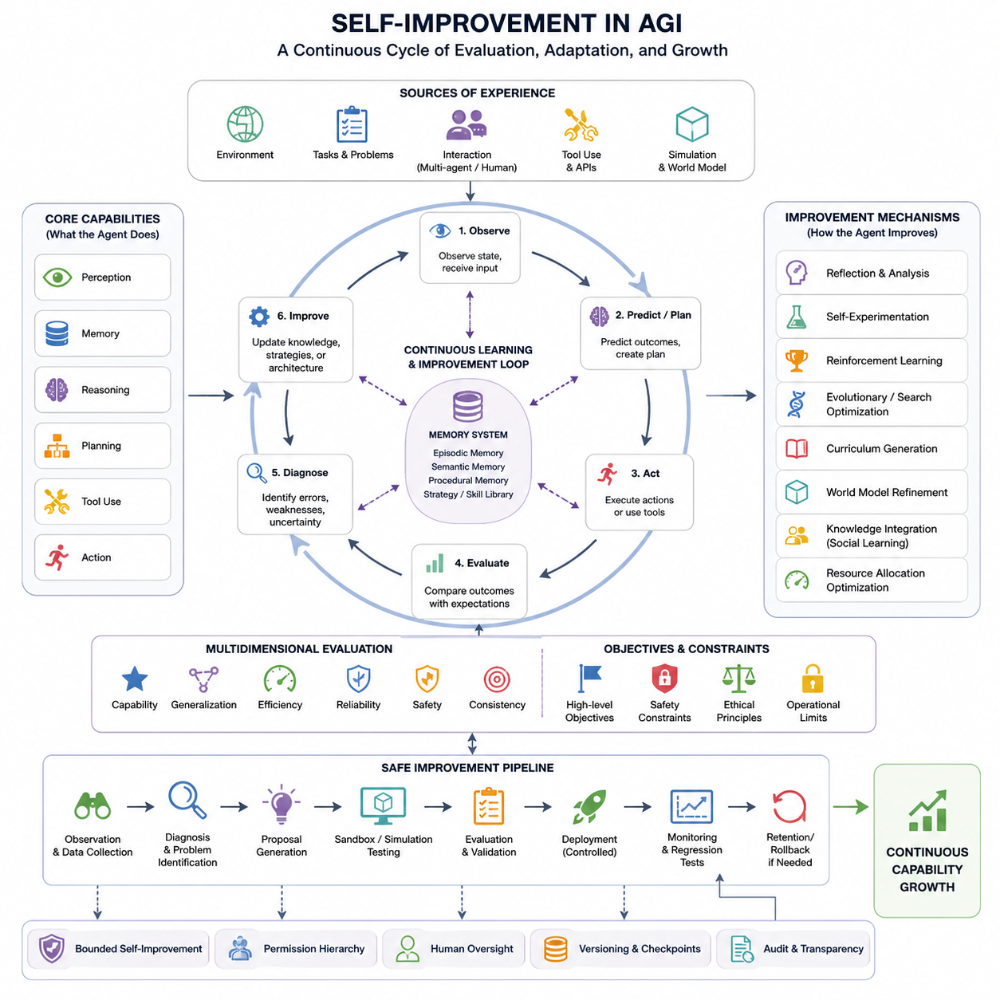
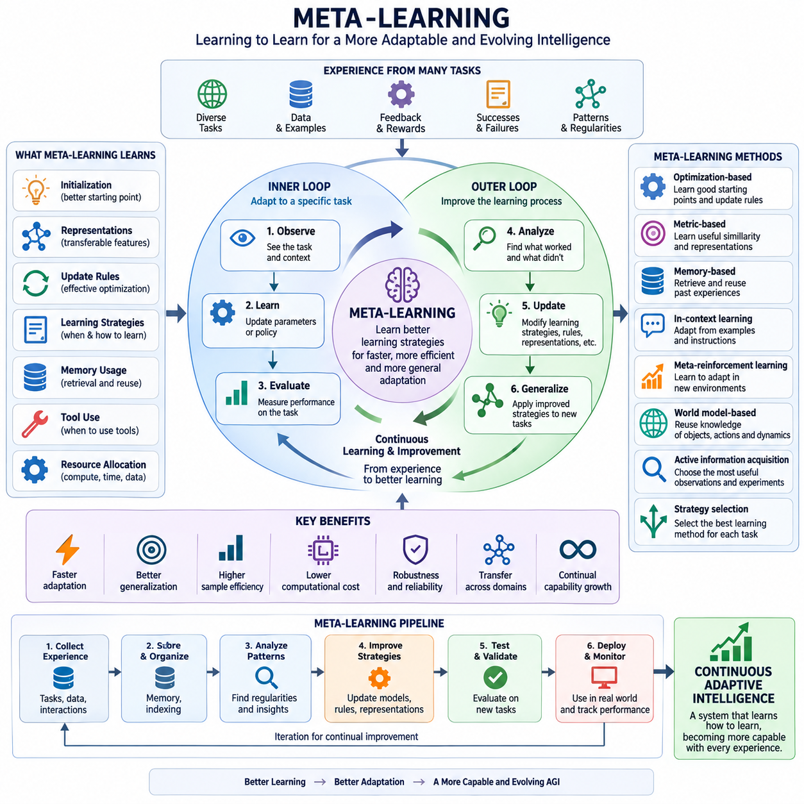
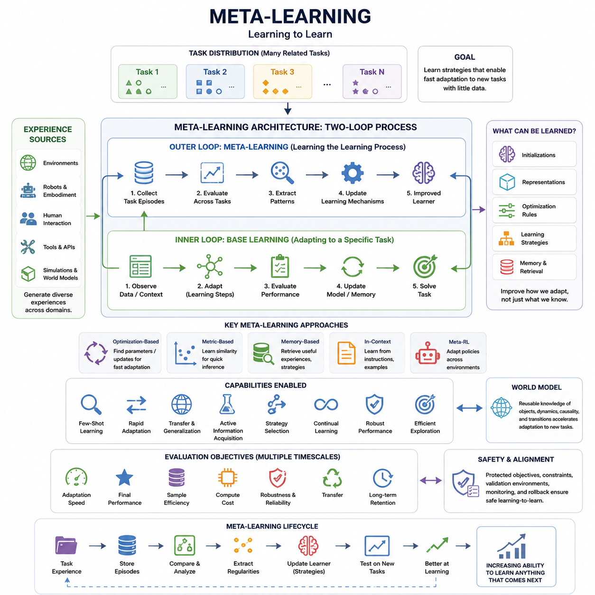
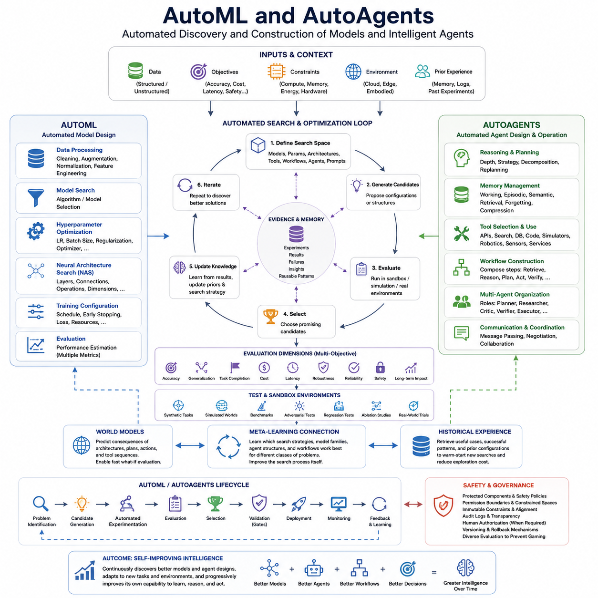
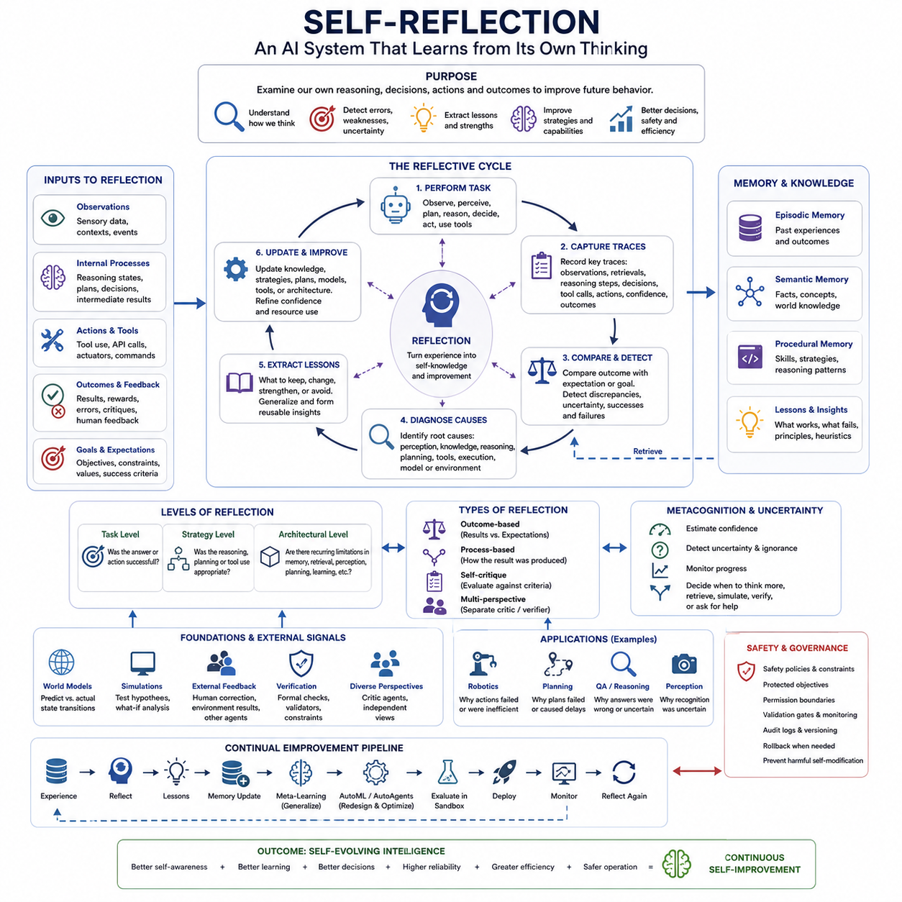
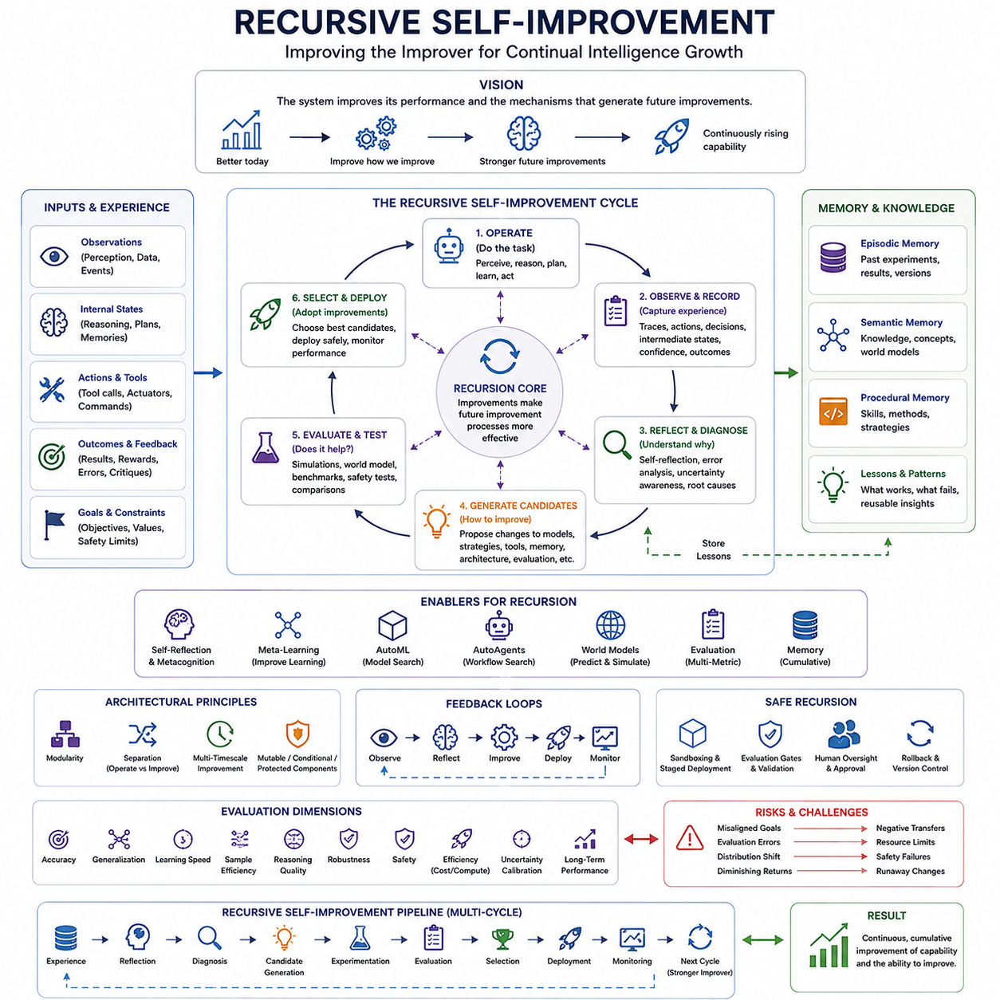
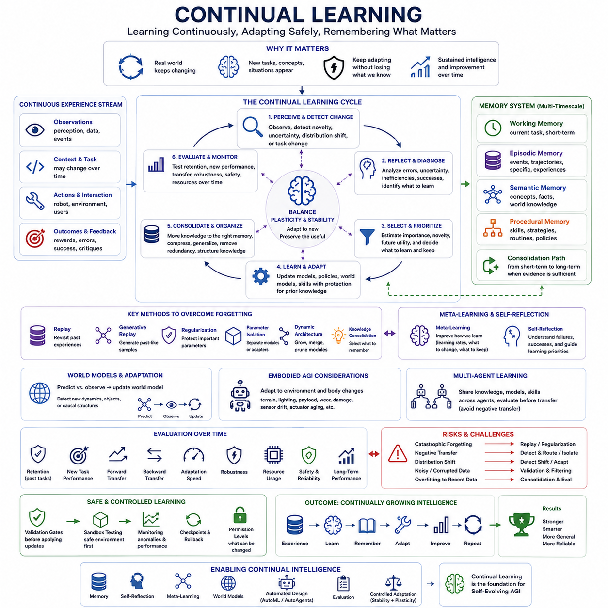
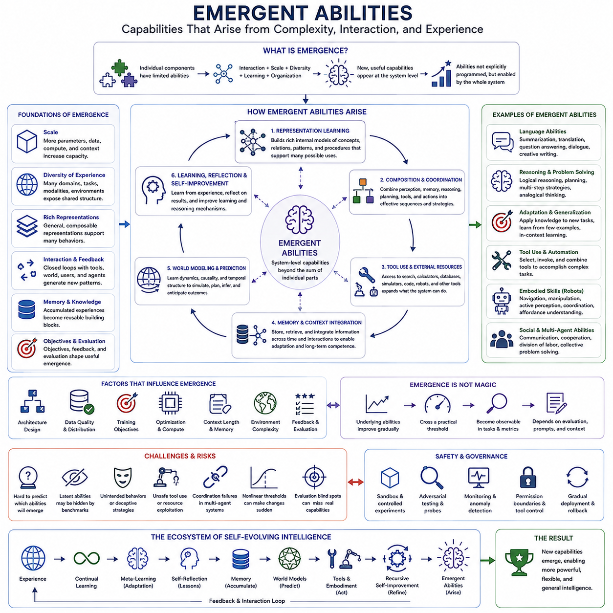
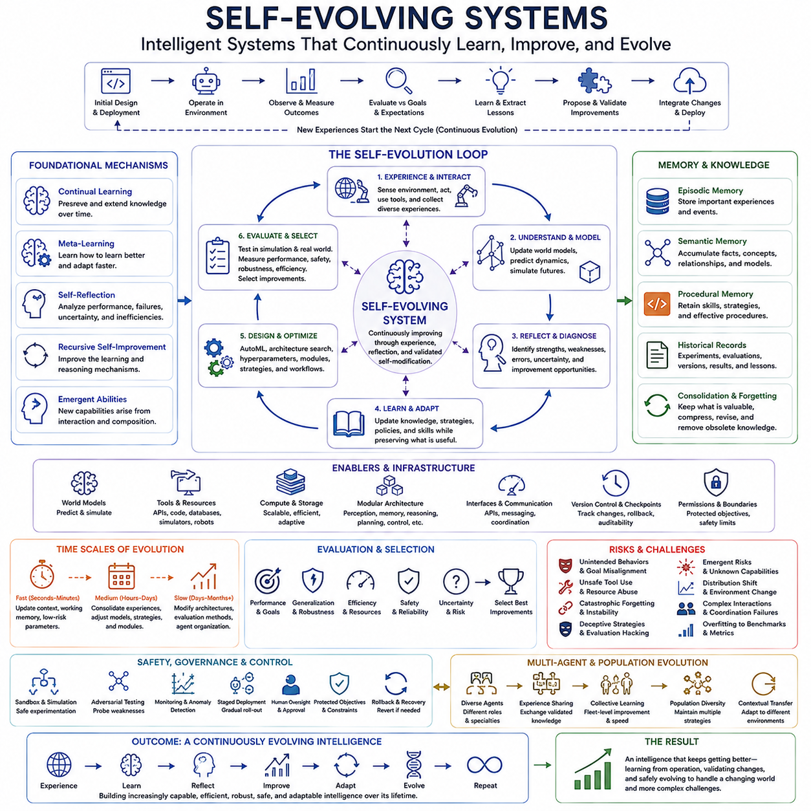

**Volume 47. Artificial General Intelligence**

# Chapter 06. Self Evolving Intelligence

## 06.00. Self Improvement

{width="7.268055555555556in" height="7.268055555555556in"}

Self-improvement in artificial general intelligence refers to the capacity of an intelligent system to enhance its own performance through experience, evaluation, adaptation, and modification. Unlike conventional machine learning systems that are optimized primarily during a predefined training phase, a self-improving system continues identifying weaknesses and discovering better strategies after deployment. This capability forms the conceptual foundation of self-evolving intelligence.

The central idea is not simply that an AI system learns more information. Self-improvement involves changes in how the system performs cognitive work. An intelligent agent may improve its representations, reasoning procedures, planning strategies, memory organization, tool-selection policies, or learning mechanisms. Improvement therefore operates across multiple levels, ranging from acquiring new knowledge to modifying the processes used to acquire and apply that knowledge.

A useful distinction can be made between parameter adaptation and structural improvement. Parameter adaptation changes numerical values inside an existing model while preserving its fundamental architecture. Structural improvement can alter modules, workflows, memory structures, reasoning procedures, or interactions among components. More advanced AGI systems may combine both approaches, allowing gradual optimization while occasionally introducing larger architectural changes when existing structures become inadequate.

Self-improvement requires some mechanism for recognizing that improvement is necessary. An intelligent system must therefore evaluate its own behavior against objectives, constraints, expectations, or previous performance. Errors, prediction failures, inefficient plans, unsuccessful actions, excessive computational cost, and uncertainty can all become signals for adaptation. Without reliable evaluation, modification alone does not constitute meaningful improvement because the system cannot determine whether a change actually produced better behavior.

This creates an important feedback cycle. The agent observes a situation, generates a prediction or plan, performs an action, measures the resulting outcome, compares that outcome with its expectation, and updates the mechanisms responsible for the discrepancy. The revised system then encounters new situations and repeats the process. Self-improvement can consequently be understood as a higher-order learning loop surrounding the ordinary perception, reasoning, planning, and action loop of an intelligent agent.

Memory plays a particularly important role because improvement depends on retaining useful information about previous successes and failures. Episodic memory can preserve individual experiences, semantic memory can consolidate general knowledge, and procedural memory can represent effective strategies or skills. A self-improving agent can analyze these different forms of memory to identify recurring errors, reusable solutions, and patterns that indicate when a particular strategy is likely to succeed.

Reflection extends this process beyond direct error correction. Instead of merely observing that an answer or action failed, the system can examine why it failed, which assumptions were incorrect, which intermediate decisions were weak, and what alternative reasoning path might have produced a better result. Reflection transforms experience into structured information about the agent\'s own cognitive behavior, creating an important bridge between ordinary learning and later mechanisms of explicit self-reflection.

Self-improvement can also occur through experimentation. An agent may generate alternative prompts, plans, algorithms, tool sequences, representations, or policies and compare their performance under controlled evaluation. This turns improvement into a search problem over possible modifications. Techniques related to reinforcement learning, evolutionary optimization, automated machine learning, program synthesis, and population-based search can therefore contribute to systems capable of discovering better internal configurations.

At the architectural level, modularity makes controlled improvement easier. If perception, memory, reasoning, planning, tool use, and control are represented as distinguishable components, the system can evaluate and modify individual capabilities without rebuilding the entire intelligence stack. A reasoning module might be replaced while memory remains unchanged, or a retrieval strategy might be optimized independently of perception. Modular architectures therefore provide practical boundaries for experimentation and validation.

An AGI system may also improve the way it allocates computational resources. Difficult problems may require deeper reasoning, broader retrieval, longer planning horizons, or additional verification, whereas familiar situations may require only lightweight processing. Learning when to activate expensive cognitive mechanisms becomes a form of self-improvement itself. Such adaptive computation allows intelligence to increase not only through better answers but also through more efficient use of time, memory, energy, and hardware.

Another important dimension is curriculum generation. Instead of depending entirely on externally selected training examples, an advanced agent can identify areas where its competence is weak and generate or seek experiences that specifically address those deficiencies. It may formulate questions, create simulated tasks, explore unfamiliar environments, or request external information. The system thereby participates in deciding what it should learn next rather than functioning only as a passive recipient of training data.

Self-improvement becomes particularly powerful when connected to world models. An agent possessing an internal predictive representation of its environment can test possible strategies through imagined or simulated futures before executing them in the real world. Differences between predicted and observed outcomes reveal weaknesses in the world model itself. The agent can then refine both its environmental understanding and the policies that depend upon that understanding, producing mutually reinforcing improvement.

For embodied AGI, improvement additionally emerges from interaction between perception and action. A robot can discover that certain viewpoints improve object recognition, that particular trajectories reduce localization uncertainty, or that different manipulation strategies work better for different physical conditions. Intelligence therefore develops through active experience rather than isolated data processing. The environment becomes both the operational domain and a continuing source of learning signals.

Social and multi-agent environments provide another pathway. Intelligent systems can learn from demonstrations, critiques, debates, shared memories, and successful strategies produced by other agents or humans. Rather than rediscovering every capability independently, an agent can incorporate knowledge generated elsewhere and evaluate whether it improves its own behavior. Self-improvement can thus operate within a larger ecosystem of distributed intelligence and accumulated experience.

However, improving one metric does not necessarily mean improving intelligence overall. Increasing task accuracy might increase computational cost, reduce robustness, damage performance on previously learned tasks, or create undesirable behavior elsewhere. Self-improvement therefore requires multidimensional evaluation involving capability, generalization, efficiency, reliability, safety, and consistency. Changes must be tested across representative situations rather than accepted solely because they improve a narrow benchmark.

Continual modification also introduces the problem of catastrophic forgetting. New learning can interfere with previously acquired capabilities, causing a system to improve on recent tasks while becoming worse at older ones. Memory replay, parameter isolation, regularization, modular adaptation, and selective consolidation are among the approaches that can help preserve useful competencies. Genuine self-improvement should accumulate capability over time rather than repeatedly exchanging old skills for new ones.

The distinction between reversible and irreversible changes is equally important. Experimental modifications should ideally be evaluated in isolated environments before being incorporated into the operational system. Versioned models, checkpoints, sandboxed execution, regression tests, and rollback mechanisms provide engineering safeguards. A self-improving architecture can therefore maintain a stable trusted configuration while candidate improvements are generated and tested separately before controlled promotion.

Human oversight remains important when improvements can alter significant capabilities or behaviors. Autonomous optimization may be appropriate for bounded parameters and low-risk strategies, while architectural changes, objective modifications, or safety-critical policies may require external authorization. This creates a hierarchy of adaptation rights in which the system can freely modify some components, cautiously experiment with others, and remain prohibited from independently changing protected objectives or constraints.

The objective being optimized is therefore fundamental. A system that becomes increasingly effective at pursuing a poorly specified goal may become less useful rather than more intelligent in a practical sense. Self-improvement must operate within stable higher-level objectives, safety constraints, and evaluation procedures. Capability growth and alignment cannot be treated as independent processes because every improvement mechanism implicitly defines what counts as a desirable change.

This leads to the concept of bounded self-improvement. Rather than granting unrestricted authority to modify every part of itself, an AGI architecture can define explicit improvement envelopes. These may restrict writable parameters, allowable tools, computational budgets, deployment environments, or classes of architectural modification. Such boundaries permit experimentation and adaptation while preserving critical invariants that protect reliability, controllability, and system identity.

Self-improvement also differs from recursive self-improvement. A system may improve its task performance without improving the mechanisms responsible for improvement itself. Recursive self-improvement begins when the system modifies its own learning, evaluation, optimization, or redesign capabilities, potentially making subsequent improvements easier or faster. The distinction is important because recursive improvement introduces stronger feedback dynamics and therefore deserves separate treatment beyond basic adaptive intelligence.

From an engineering perspective, a practical self-improvement pipeline can be viewed as continuous observation, diagnosis, proposal generation, simulation or sandbox testing, evaluation, validation, deployment, and monitoring. Each stage produces evidence about whether a proposed modification should advance. This resembles modern machine-learning lifecycle management, but the crucial difference is that increasingly capable agents may participate directly in diagnosing problems and generating their own candidate solutions.

Evaluation should include both immediate and delayed consequences. A modification that performs well on a short test may create subtle failures during long-horizon operation, interaction with other modules, or exposure to unfamiliar environments. Self-improving AGI therefore requires persistent monitoring and regression testing across time. Long-horizon evaluation is especially important because general intelligence depends on maintaining coherent behavior across extended sequences of reasoning, planning, action, and learning.

As self-improvement matures, the boundary between learning and system design begins to blur. Traditional engineering separates the designer who creates an architecture from the model that operates inside it. A sufficiently adaptive AGI may participate in both roles: it performs tasks while simultaneously collecting evidence about how its own architecture could perform those tasks better. Intelligence becomes not merely a fixed computational structure but an evolving process capable of redesigning portions of itself.

The ultimate purpose of self-improvement is therefore not unlimited optimization but sustained adaptive competence. A general intelligent system should recognize new challenges, diagnose limitations, acquire appropriate knowledge, revise ineffective strategies, preserve valuable capabilities, and verify that modifications actually improve its behavior. These mechanisms establish the foundation for meta-learning, automated agent design, self-reflection, continual learning, and eventually more sophisticated forms of self-evolving intelligence explored throughout this chapter.

## 06.01. Meta Learning

{width="7.268055555555556in" height="7.268055555555556in"}

{width="7.268055555555556in" height="7.268055555555556in"}

Meta-learning, often described as "learning to learn," refers to the ability of an intelligent system to improve the process by which it acquires new capabilities. Instead of optimizing only for performance on a particular task, meta-learning attempts to discover learning strategies that remain useful across many tasks. Within self-evolving intelligence, this capability enables an agent to become progressively better at adaptation itself.

Conventional machine learning usually assumes that a model receives a dataset, follows a predefined optimization procedure, and gradually learns parameters that solve a target problem. Meta-learning introduces another level above this process. The system observes multiple learning episodes and extracts knowledge about how learning should occur, allowing previous learning experiences to influence the speed, direction, and effectiveness of future adaptation.

This creates a distinction between the inner learning loop and the outer meta-learning loop. The inner loop adapts a model to a particular task using available observations or feedback. The outer loop evaluates performance across many tasks and modifies the mechanisms governing adaptation. Through repeated interaction between these loops, the system can discover initialization states, representations, update rules, memory structures, or strategies that enable faster learning.

A meta-learning problem is commonly organized around a distribution of tasks rather than a single dataset. During training, the learner encounters many related but distinct problems, each providing its own experience and evaluation signal. The objective is not merely to memorize solutions to these tasks but to identify transferable regularities among them. When a new task appears, the system can exploit those regularities to adapt using relatively little additional experience.

Few-shot learning illustrates this principle clearly. A conventional model may require thousands of labeled examples to learn a new category, whereas a meta-learned system attempts to infer useful behavior from only a few demonstrations. The important capability is not simply classification with limited data, but the reuse of knowledge about previous tasks to rapidly construct an appropriate solution for a previously unseen problem.

Meta-learning can operate at several levels of an intelligent architecture. It may learn model parameters that provide favorable starting points, representations that transfer across domains, optimization rules that determine how parameters should change, or policies that select suitable learning strategies. More advanced agents may also learn when to retrieve memories, request information, perform experiments, invoke tools, or allocate additional computational resources.

Optimization-based meta-learning treats rapid adaptation as an optimization problem. The system searches for parameters or update procedures from which a small number of learning steps can produce strong performance on a new task. Instead of finding parameters specialized for one problem, the meta-objective favors configurations that are easy to adapt. Learning therefore shapes not only what the model currently knows but also how readily that knowledge can be reorganized.

Metric-based approaches learn representations in which similarity between examples becomes useful for rapid inference. New observations can be compared with previously encoded examples, prototypes, or learned reference structures. If the representation captures transferable relationships, a new concept can be recognized from only a small number of examples. This approach demonstrates how learning an appropriate representational geometry can itself become a form of learning-to-learn.

Memory-based meta-learning uses stored experience as an adaptive resource. Rather than forcing all previous knowledge into fixed model parameters, the system can retrieve relevant episodes, strategies, solutions, or contextual patterns when encountering a new problem. Attention and retrieval mechanisms can determine which memories are useful for the current situation, allowing adaptation to occur through dynamic access to experience as well as parameter updates.

In-context learning provides another perspective on rapid adaptation. A sufficiently capable model can modify its behavior from instructions, demonstrations, examples, or intermediate feedback supplied within its current context without permanently changing its parameters. From an AGI perspective, this resembles a temporary learning process in which the model infers the structure of a task and constructs an appropriate strategy from information available during interaction.

Meta-reinforcement learning extends these ideas to sequential decision making. Instead of learning a fixed policy for a single environment, an agent experiences families of environments and learns how to adapt its behavior from rewards, observations, and previous actions. Internal state or memory can encode what has been discovered during the current episode, allowing the agent to explore efficiently and rapidly infer which strategy is appropriate.

World models can substantially strengthen meta-learning. If an agent learns reusable structures describing objects, actions, dynamics, causality, and temporal transitions, new tasks do not need to be learned entirely from raw observations. The system can reinterpret existing world knowledge under new objectives and constraints. Adaptation then becomes a process of recombining previously learned concepts and predictive structures rather than constructing intelligence from the beginning.

For embodied agents, meta-learning can support adaptation across robots, environments, objects, terrain conditions, sensors, and physical dynamics. Experience acquired while navigating one environment may help the robot determine how to learn navigation in another. Manipulation experience with previous objects may provide priors for unfamiliar objects. The system learns not only motor policies but also efficient procedures for discovering the properties of new physical situations.

An important meta-learning capability is active information acquisition. When facing uncertainty, an intelligent agent should determine which observation, experiment, question, or action would provide the most useful information for adaptation. Learning what to observe can be as important as learning from the observation itself. This connects meta-learning with active learning, exploration, experiment design, tool use, and autonomous scientific reasoning.

Meta-learning also allows systems to learn different strategies for different kinds of problems. Some tasks may benefit from retrieval, others from symbolic reasoning, simulation, optimization, imitation, or reinforcement learning. Instead of applying a single learning algorithm universally, a more general agent can estimate the structure of a problem and select or combine learning mechanisms accordingly. Strategy selection therefore becomes another object of learning.

Transfer and generalization are central requirements. A meta-learner that adapts rapidly only to tasks extremely similar to its training experience has learned a narrow adaptation procedure rather than a broadly useful learning capability. Effective meta-learning requires diversity in training experiences and representations that capture underlying regularities. Evaluation should therefore emphasize adaptation to genuinely new conditions rather than repeated variations of familiar examples.

Task diversity introduces a difficult balance. If training tasks are too similar, the system may overfit to a narrow task family. If they are unrelated, transferable structure may be difficult to discover. Useful meta-learning environments expose agents to variations that share meaningful latent principles while requiring different solutions. The learner can then discover which features remain stable across tasks and which must be adapted according to context.

Meta-learning must also address negative transfer. Knowledge that accelerates learning in one domain can interfere with adaptation in another. An intelligent system therefore needs mechanisms for estimating whether previous experience is relevant before applying it. Uncertainty estimation, modular representations, task inference, selective retrieval, and contextual gating can help prevent inappropriate reuse of prior strategies while preserving useful transferable knowledge.

The relationship between meta-learning and continual learning is particularly important for self-evolving intelligence. Continual learning focuses on accumulating capabilities over an extended sequence of experiences without catastrophic forgetting, while meta-learning focuses on improving the mechanisms of adaptation. Combined together, they allow an agent to preserve previous knowledge while becoming increasingly efficient at acquiring new knowledge from future experience.

Meta-learning also connects directly to self-reflection. By examining previous learning episodes, an agent can identify which strategies produced successful adaptation and which caused errors, excessive computation, or poor generalization. Reflection can convert these observations into higher-level rules about problem solving. Those rules can subsequently guide planning, retrieval, experimentation, and learning, creating a feedback pathway from experience to improved learning strategy.

A practical meta-learning system therefore requires careful evaluation at multiple timescales. Immediate adaptation speed is important, but so are final performance, sample efficiency, computational cost, robustness, transfer, and long-term retention. A strategy that learns rapidly but produces unstable behavior may be inferior to one that adapts more slowly while generating reliable and transferable knowledge. Meta-learning objectives must capture this broader notion of adaptive competence.

Safety becomes increasingly important when a system learns how to modify its own learning behavior. A meta-learner should not automatically treat every performance increase as desirable. Protected objectives, constrained optimization, validation environments, permission boundaries, monitoring, and rollback mechanisms can restrict how learned adaptation strategies affect operational behavior. Learning-to-learn must therefore remain compatible with higher-level safety and alignment requirements.

At the engineering level, meta-learning can be viewed as an architecture connecting task experience, memory, adaptation, evaluation, and strategy optimization. Individual tasks generate learning episodes; episodes are stored and compared; recurring patterns are extracted; adaptation mechanisms are updated; and the revised learner is tested on new tasks. Repetition of this process gradually transforms accumulated experience into increasingly effective procedures for acquiring future capabilities.

The significance of meta-learning for AGI lies in reducing dependence on exhaustive retraining and manually designed learning procedures. A generally intelligent system will encounter situations that its designers cannot enumerate beforehand. It must therefore possess mechanisms for discovering how unfamiliar problems should be learned. Meta-learning provides a framework in which previous experience becomes knowledge not only about the world, but about the process of acquiring knowledge itself.

Within self-evolving intelligence, meta-learning represents a transition from systems that merely change through learning to systems that improve how they change. This higher-order adaptation provides a foundation for rapid generalization, autonomous skill acquisition, continual learning, self-reflection, automated agent design, and eventually recursive forms of improvement. The long-term objective is an intelligence whose accumulated experience progressively increases its ability to learn whatever comes next.

## 06.02. AutoML and AutoAgents [w/Code]

{width="7.268055555555556in" height="7.268055555555556in"}

AutoML, or Automated Machine Learning, extends machine learning by allowing computational systems to automate important parts of model development that traditionally require human experts. These processes may include data preprocessing, feature selection, model selection, hyperparameter optimization, architecture search, training configuration, and evaluation. Within self-evolving intelligence, AutoML provides mechanisms through which an AI system can search for better learning configurations with progressively less manual intervention.

The significance of AutoML for AGI is broader than simply reducing engineering effort. A generally intelligent system cannot depend on human developers to manually redesign its learning pipeline whenever it encounters a new problem. It needs mechanisms capable of exploring alternative models and configurations autonomously. AutoML therefore represents an early engineering pathway toward systems that participate in designing and improving parts of their own computational structure.

A typical AutoML process begins by defining a search space containing possible models, parameters, preprocessing operations, architectures, or training strategies. A search algorithm then proposes candidate configurations, evaluates their performance, and uses the resulting evidence to determine which candidates should be explored next. The process transforms model engineering into an optimization problem in which increasingly effective solutions can be discovered through systematic experimentation.

Hyperparameter optimization is one of the most established forms of automated model improvement. Learning rates, regularization strengths, batch sizes, optimizer settings, model dimensions, and other parameters can strongly influence performance. Instead of selecting these values manually, automated systems can explore them using random search, Bayesian optimization, evolutionary algorithms, population-based methods, or other adaptive search procedures that concentrate computation on promising regions.

Neural Architecture Search, often abbreviated as NAS, extends automated optimization to the structure of neural networks themselves. The search space may include layers, connections, operations, attention mechanisms, hidden dimensions, or combinations of reusable modules. Candidate architectures are trained or approximated, evaluated against objectives, and compared. This allows aspects of model architecture that were previously handcrafted to become objects of computational search and optimization.

However, AutoML should not optimize predictive accuracy alone. Real systems operate under constraints involving latency, memory, energy consumption, hardware availability, robustness, training cost, and deployment requirements. Multi-objective AutoML can therefore search for configurations that balance several competing goals. For an AGI system operating across cloud, edge, and embodied platforms, selecting an appropriate model may require balancing intelligence quality against limited computational resources.

AutoAgents extend a similar principle from model development to autonomous agent construction and operation. Instead of searching only for a better neural model, an AutoAgent system can configure how an agent reasons, plans, retrieves information, uses memory, invokes tools, communicates with other agents, and evaluates results. The search space therefore expands from model parameters and architectures to complete cognitive workflows and patterns of interaction.

An AutoAgent may dynamically construct a sequence of operations for a particular objective. It can determine whether a task requires retrieval, reasoning, simulation, code execution, external tools, planning, verification, or collaboration with specialized agents. Rather than following one fixed pipeline for every problem, the system can compose an appropriate workflow from available capabilities. Agent architecture becomes adaptive and task-dependent rather than completely predetermined.

Tool selection is especially important in this framework. A capable agent may have access to search systems, databases, calculators, simulators, software environments, robotic controllers, sensors, or external services. The agent must learn which tool is appropriate, what information should be supplied to it, how its result should be interpreted, and whether additional verification is necessary. Improving these decisions can substantially increase capability without changing the underlying foundation model.

Memory configuration can also be automated. Different tasks may require different combinations of working memory, episodic memory, semantic knowledge, retrieved documents, and procedural experience. AutoAgents can learn when information should be stored, compressed, retrieved, forgotten, or promoted into more persistent knowledge. This turns memory management from a static engineering choice into an adaptive component of intelligent behavior.

Planning provides another major area for automation. Some problems can be solved through a short sequence of actions, while others require hierarchical decomposition, long-horizon planning, replanning, or parallel exploration of alternative strategies. An AutoAgent can estimate task complexity and select an appropriate planning depth, reasoning budget, or decomposition strategy. The agent therefore adapts not only what it thinks about but also how much computation it invests in thinking.

Multiple agents can further expand the design space. A complex problem may be decomposed into specialized roles such as planner, researcher, critic, verifier, simulator, executor, or memory manager. Automated agent systems can create, select, coordinate, or retire these roles according to task requirements. Multi-agent organization itself becomes a configurable architecture whose structure can change as the system learns which collaboration patterns produce better results.

Evaluation is the mechanism that connects AutoML and AutoAgents to genuine self-improvement. Candidate models, workflows, tools, prompts, policies, and agent structures must be compared using measurable evidence. Evaluation may consider correctness, generalization, task completion, computational cost, latency, reliability, safety, and long-term consequences. Without rigorous evaluation, automated generation merely creates alternatives without establishing whether those alternatives represent meaningful improvement.

This creates an iterative generate-evaluate-select cycle. The system proposes candidate configurations, executes them in controlled environments, measures their outcomes, selects promising alternatives, and uses the accumulated results to guide subsequent searches. Over many iterations, the search process can become increasingly informed by previous experiments. AutoML and AutoAgents therefore transform improvement into a continuous experimental process rather than a single manually designed training event.

Simulation and sandbox environments are particularly valuable because autonomous experimentation can produce unexpected behaviors. Candidate agents can be tested against synthetic tasks, simulated worlds, benchmark suites, adversarial situations, and regression tests before deployment. Poor configurations can be rejected without affecting operational systems. This separation between experimentation and execution is essential when automated systems are permitted to modify increasingly important aspects of their own behavior.

World models can make automated search significantly more efficient. Instead of evaluating every candidate through expensive real-world interaction, an agent can use predictive models to estimate likely consequences of architectures, plans, actions, or tool sequences. Promising alternatives can then receive more detailed evaluation. As the world model improves, it can provide increasingly useful internal environments for testing possible changes before committing resources or taking physical actions.

AutoML and AutoAgents also interact naturally with meta-learning. AutoML searches for effective models and configurations, while meta-learning can learn which search strategies are likely to work for particular classes of problems. Similarly, AutoAgents can generate alternative workflows while meta-learning identifies patterns showing which agent structures adapt most effectively. The system gradually learns not only better solutions but better procedures for discovering those solutions.

Historical experience can further reduce search cost. Previous experiments provide information about which architectures, tools, prompts, planning strategies, and agent organizations succeeded under particular conditions. A memory system can retrieve relevant cases before initiating a new search, allowing the agent to begin from informed candidates rather than exploring blindly. Automated design thus becomes increasingly efficient as the system accumulates reusable engineering and operational knowledge.

For embodied AGI, automated agents can configure perception, localization, planning, control, and computational allocation according to environmental conditions. A robot operating in an uncomplicated environment may use lightweight perception and planning, while uncertain or hazardous situations may activate additional sensing, prediction, verification, or reasoning. AutoAgent mechanisms can therefore support adaptive cognitive architectures whose computational intensity changes with operational demands.

The same flexibility introduces significant safety concerns. An autonomous system that can modify models, prompts, tools, workflows, or agent structures may accidentally remove important safeguards or discover configurations that perform well on narrow metrics while behaving poorly elsewhere. Protected components, permission boundaries, constrained search spaces, immutable safety policies, validation gates, audit logs, and human authorization can restrict which modifications are permitted and how they reach deployment.

Versioning and rollback are consequently fundamental engineering mechanisms. Every candidate configuration should have an identifiable state, evaluation history, dependency record, and reproducible execution environment. When a newly deployed configuration produces unexpected degradation, the system should be capable of returning to a previously validated state. Self-evolving systems require not only mechanisms for moving forward but also reliable mechanisms for reversing unsuccessful changes.

Another challenge is avoiding optimization toward misleading benchmarks. Automated systems can exploit weaknesses in evaluation procedures, producing high scores without acquiring the intended capability. Evaluation therefore needs diverse tasks, hidden tests, robustness checks, long-horizon scenarios, and independent validation. The more autonomous the optimization process becomes, the more important it is that evaluation accurately represents the real objectives the system is expected to satisfy.

From an engineering perspective, AutoML and AutoAgents can be integrated into a controlled lifecycle consisting of problem identification, candidate generation, automated experimentation, evaluation, selection, validation, deployment, monitoring, and feedback. Operational results return to the search system as new evidence. This closes the loop between system operation and system design, enabling deployed intelligence to contribute information toward its own future improvement.

The deeper importance of AutoML and AutoAgents lies in shifting part of AI engineering from human-designed configuration toward machine-assisted discovery. Models, learning procedures, cognitive workflows, tool combinations, memory strategies, and agent organizations increasingly become searchable design variables. Human engineers can define objectives, constraints, interfaces, and safety boundaries while automated systems explore large spaces of possible implementations inside those boundaries.

Within self-evolving intelligence, AutoML and AutoAgents provide a practical bridge between meta-learning and more advanced self-improvement. Meta-learning improves how a system learns, while automated model and agent design gives that system mechanisms for changing what performs the learning and reasoning. Combined with memory, reflection, continual learning, evaluation, and controlled experimentation, these mechanisms move AGI toward architectures capable of progressively redesigning portions of their own operation.

## 06.03. Self Reflection

{width="7.268055555555556in" height="7.268055555555556in"}

Self-reflection in artificial general intelligence is the capability of an intelligent system to examine its own reasoning, decisions, actions, internal states, and outcomes in order to identify weaknesses and improve future behavior. Rather than responding only to external feedback, a reflective agent analyzes how it reached a result. This introduces an internal evaluation process that transforms ordinary experience into information about the system's own cognitive operation.

Reflection differs from basic error correction because it investigates the causes behind success or failure. A system may recognize that an answer was incorrect, but self-reflection asks which assumptions, retrieved memories, reasoning steps, plans, tools, or observations contributed to the error. By examining intermediate processes rather than only final outcomes, the agent can discover recurring weaknesses that would otherwise remain hidden.

A useful reflective cycle begins when an agent performs a task and records relevant traces of its activity. These traces may include observations, retrieved information, intermediate reasoning states, decisions, tool calls, actions, confidence estimates, and resulting outcomes. After execution, the system compares what occurred with what was expected and constructs an explanation of important discrepancies, uncertainties, successes, and failures.

Self-reflection therefore depends strongly on memory. Episodic memory can preserve previous attempts and their outcomes, semantic memory can represent generalized lessons, and procedural memory can store improved strategies. When similar situations occur later, the agent can retrieve reflective conclusions from earlier experiences rather than repeating the same mistakes. Reflection converts raw experience into reusable knowledge about effective and ineffective cognitive behavior.

Metacognition provides an important conceptual foundation for this process. Metacognition refers to knowledge and regulation of one's own cognitive processes. In artificial systems, this can include estimating confidence, detecting uncertainty, recognizing insufficient knowledge, monitoring reasoning progress, and deciding when additional computation is necessary. A metacognitive agent does not merely solve a problem; it also estimates how well its problem-solving process is functioning.

Uncertainty awareness is particularly important because reflection should not assume that every internally generated conclusion is reliable. An intelligent system needs mechanisms for recognizing when evidence is incomplete, conflicting, unfamiliar, or outside its competence. Such recognition can trigger additional retrieval, simulation, verification, experimentation, or human assistance. Knowing when not to trust an initial answer is therefore a major component of reflective intelligence.

Reflection can occur at different levels. At the task level, the system examines whether a particular answer or action was successful. At the strategy level, it evaluates whether the chosen reasoning, planning, or tool-use method was appropriate. At the architectural level, it can identify recurring limitations in memory, retrieval, perception, planning, or learning mechanisms. These levels connect immediate correction with longer-term self-improvement.

One practical form is outcome-based reflection, in which the system analyzes the difference between expected and observed results. Prediction errors, failed actions, low rewards, unsuccessful plans, or external critiques become evidence for diagnosis. The agent attempts to determine whether the failure originated from incorrect perception, incomplete knowledge, faulty reasoning, poor planning, inappropriate tool selection, execution error, or an inaccurate model of the environment.

Process-based reflection examines how a result was produced rather than evaluating only the result itself. Two solutions may achieve the same outcome while differing greatly in reliability, efficiency, or generalizability. By examining intermediate decisions, the system can detect unnecessary computation, unsupported assumptions, fragile reasoning paths, redundant tool calls, or accidental success. This enables improvement even when the final answer happened to be correct.

Self-critique is a related mechanism in which an agent deliberately evaluates its own generated output against explicit criteria. These criteria may concern correctness, completeness, consistency, safety, relevance, efficiency, or compliance with constraints. The critique can then guide revision before an answer or action is finalized. This creates an internal generate-evaluate-revise loop that can improve performance without requiring external correction for every attempt.

Reflection can also use multiple perspectives. Instead of asking a single reasoning process to immediately judge itself, an architecture may separate generation from criticism or verification. One component can propose a solution while another searches for contradictions, missing evidence, unsafe assumptions, or alternative explanations. Specialized critic or verifier agents can provide additional independence when evaluating complex decisions in multi-agent systems.

External feedback remains valuable because self-reflection alone can reinforce incorrect beliefs. Human corrections, environmental outcomes, trusted tools, formal verification, simulations, and other agents can provide evidence that challenges the system's internal interpretation. Effective reflective intelligence therefore combines introspection with externally grounded signals. The objective is not to trust internal reasoning automatically, but to test reflective conclusions against independent evidence.

World models provide another foundation for reflection. An agent can compare predicted state transitions with what actually occurred after an action. Large discrepancies may indicate errors in perception, causal understanding, dynamics prediction, or planning assumptions. Reflection can use these differences to refine the world model, producing more accurate predictions and better decisions during later interactions with similar environments.

For embodied AGI, reflective processing can connect physical experience with cognitive improvement. A robot may examine why localization degraded, why a trajectory became inefficient, why an object manipulation failed, or why a perception system produced uncertainty. It can correlate these failures with sensor conditions, environmental properties, control decisions, and previous experiences, allowing operational failures to become structured learning opportunities.

Reflection also interacts closely with meta-learning. Individual reflective episodes reveal which learning strategies worked under particular conditions. Across many episodes, meta-learning can identify recurring patterns and improve the mechanisms used for future adaptation. Reflection supplies information about the quality of previous learning processes, while meta-learning converts that information into more general strategies for acquiring new knowledge and skills.

AutoML and AutoAgents can use reflective information as input for automated redesign. If reflection repeatedly identifies weaknesses in retrieval, planning depth, memory organization, model selection, or tool coordination, automated optimization mechanisms can propose alternative configurations. Candidate changes can then be evaluated in controlled environments. Reflection consequently provides diagnosis, while automated design mechanisms provide possible structural responses.

Continual learning benefits from reflection because not every experience deserves equal influence on long-term knowledge. Reflective mechanisms can estimate whether an event contains a novel lesson, represents an unusual exception, reveals a systematic failure, or confirms an existing strategy. This can guide memory consolidation and learning priorities, helping the system preserve important experiences while avoiding unnecessary updates from noise or misleading observations.

A reflective agent can also examine resource usage. Some tasks may consume excessive reasoning time, memory, energy, or tool calls relative to their difficulty. By comparing computational effort with achieved performance, the system can learn when deeper reasoning is valuable and when simpler processing is sufficient. Reflection therefore contributes not only to correctness but also to adaptive computation and efficient allocation of cognitive resources.

However, reflection has important limitations. A system can generate plausible explanations for its own behavior that are not causally accurate. An internally coherent critique may still be wrong if it is based on incomplete information or inaccurate representations. Reflective statements should therefore be treated as hypotheses requiring evidence rather than guaranteed descriptions of the system's true computational causes.

Repeated reflection can also become computationally expensive or counterproductive. An agent that continually reconsiders every decision may increase latency without meaningful improvement. Practical systems need stopping criteria that determine when additional reflection is likely to be valuable. Confidence, task importance, uncertainty, risk, disagreement among evaluators, and expected benefit can help determine the appropriate depth of reflective processing.

Safety-critical situations require especially careful reflective design. Reflection should not allow an agent to reinterpret protected objectives or remove constraints merely because doing so appears to improve task performance. Safety policies, permission boundaries, immutable rules, validation gates, monitoring, and human oversight can separate components that may be adapted from components that reflection cannot independently redefine.

Reflection should therefore operate within a controlled improvement architecture. Observations and outcomes are recorded, important discrepancies are detected, candidate explanations are generated, evidence is gathered, lessons are proposed, and changes are tested before being incorporated into operational behavior. Versioning and rollback mechanisms can preserve previous validated states if reflective updates unexpectedly reduce reliability or introduce undesirable behavior.

The quality of reflection can itself be evaluated. A system can measure whether reflective conclusions predict future failures, whether suggested revisions improve performance, and whether similar mistakes become less frequent after lessons are incorporated. Reflection then becomes an empirical process rather than unrestricted internal commentary. Useful reflective mechanisms should demonstrate measurable improvement across repeated tasks and changing environments.

Over time, accumulated reflection can form a structured self-model describing capabilities, limitations, successful strategies, recurring failure modes, uncertainty patterns, and resource requirements. Such a model does not imply human-like consciousness or subjective awareness. It functions as an operational representation that helps the system predict its own performance and select strategies appropriate to its current competence and circumstances.

Within self-evolving intelligence, self-reflection provides the diagnostic bridge between experience and deliberate improvement. Experience reveals what happened, reflection investigates why it happened, memory preserves the resulting lessons, meta-learning generalizes them, and automated optimization can translate them into revised strategies or architectures. Together, these mechanisms allow an intelligent system to improve not merely by accumulating data, but by learning systematically from its own operation.

## 06.04. Recursive Self Improvement

{width="7.268055555555556in" height="7.268055555555556in"}

Recursive self-improvement refers to a process in which an intelligent system improves not only its task performance but also the mechanisms responsible for producing further improvements. A conventional adaptive system may learn better policies or acquire additional knowledge, whereas a recursively improving system can modify its learning, reasoning, evaluation, optimization, or redesign processes. Each successful improvement may therefore increase its capacity to discover subsequent improvements.

The defining feature is recursion across levels of adaptation. At one level, the system improves how it performs a task. At a higher level, it improves how it learns to perform tasks, evaluates its performance, searches for alternatives, or modifies its architecture. If those higher-level improvements make future optimization more effective, the resulting capability can feed back into the improvement process, creating an iterative cycle in which the improver itself becomes an object of improvement.

This distinguishes recursive self-improvement from ordinary self-improvement. An agent that updates its knowledge after receiving new information is improving, but it is not necessarily recursively improving. Recursion begins when changes affect the mechanisms that generate future changes. Examples include improving an optimization algorithm, developing better evaluation procedures, redesigning memory organization, increasing experimentation efficiency, or learning more effective strategies for modifying internal components.

A useful conceptual model separates an operational system from an improvement system. The operational system performs perception, reasoning, planning, learning, and action, while the improvement system monitors these processes, identifies limitations, proposes modifications, evaluates candidates, and determines whether validated changes should be adopted. Recursive improvement occurs when the improvement system can itself be evaluated and modified through similar mechanisms rather than remaining permanently fixed.

Evaluation is therefore fundamental. A system cannot reliably improve itself merely by generating modifications; it must determine whether those modifications produce genuine benefits. Evaluation may measure accuracy, generalization, learning speed, sample efficiency, reasoning quality, computational cost, robustness, safety, and long-term performance. Recursive improvement requires especially strong evaluation because errors in the evaluator can influence multiple subsequent generations of modification.

Self-reflection can provide diagnostic information for this process. By examining previous reasoning, decisions, failures, and successful strategies, an agent can identify recurring weaknesses in its own operation. If reflection repeatedly reveals inefficient retrieval, shallow planning, poor uncertainty estimation, or ineffective learning strategies, these observations can become targets for redesign. Reflection therefore helps determine what should be improved before automated mechanisms search for how to improve it.

Meta-learning contributes another important layer because it explicitly improves the process of adaptation. A meta-learner can discover representations, initialization states, memory strategies, update procedures, or learning policies that allow new tasks to be learned more efficiently. When improvements to meta-learning also enhance the system's ability to develop better future learning procedures, meta-learning becomes one possible component within a recursive self-improvement architecture.

AutoML and automated agent design provide practical mechanisms for searching over possible modifications. Automated systems can explore model architectures, hyperparameters, training procedures, prompts, memory configurations, reasoning workflows, tool combinations, or multi-agent structures. If an improved search or evaluation procedure subsequently allows the system to discover still better configurations, automated design becomes part of a recursive optimization loop rather than a one-time engineering process.

Memory is essential because recursive improvement depends on cumulative knowledge about previous experiments. The system should retain which modifications were attempted, under what conditions they were tested, what outcomes occurred, and why candidates were accepted or rejected. Such historical information can prevent repeated failures, identify reusable patterns, and provide priors for future searches. Improvement then becomes progressively informed rather than repeatedly starting from an empty search space.

World models can reduce the cost of recursive experimentation. A sufficiently accurate predictive model can estimate how candidate changes may influence future behavior before those changes are deployed in the real environment. Alternative strategies, architectures, or policies can first be examined through simulation or internal prediction. Promising candidates can receive more expensive validation, while obviously poor candidates can be rejected earlier in the improvement pipeline.

Recursive improvement does not necessarily imply modification of every component. Practical architectures can divide the system into mutable, conditionally mutable, and protected regions. Learning strategies or retrieval parameters may be modified automatically, while safety constraints, authorization mechanisms, or fundamental objectives remain protected. Such separation allows substantial adaptation without granting unrestricted authority over every element of the system.

Modularity can make this process more manageable. When perception, memory, reasoning, planning, evaluation, learning, and tool use are represented as distinguishable modules, improvements can be localized and tested independently. A new planning mechanism can be evaluated without simultaneously modifying perception or safety control. Modular design reduces the number of interacting variables and makes the consequences of individual modifications easier to measure and reverse.

Recursive self-improvement may operate at different speeds. Some changes may occur continuously through parameter updates or memory consolidation, while architectural modifications may require longer experimentation and validation cycles. More consequential changes can be subjected to increasingly strict review. A multi-timescale architecture therefore allows rapid low-risk adaptation while preserving deliberate control over modifications with larger systemic consequences.

One important possibility is improvement in search efficiency. Early versions of a system may explore candidate solutions broadly and inefficiently. Experience can reveal which regions of the design space are promising, which evaluation methods are informative, and which experiments provide little value. The system can then improve the process used to generate candidates, reducing the resources required to discover subsequent improvements and increasing the effectiveness of future experimentation.

Another possibility is improvement in evaluation itself. A system may initially rely on narrow benchmarks but later discover that they poorly predict real-world performance. Better evaluation can include hidden tests, adversarial cases, long-horizon scenarios, uncertainty measurements, safety checks, and diverse environments. Because future modifications are selected according to evaluation results, improving the evaluator can have a particularly strong influence on the direction of recursive development.

However, recursive improvement does not guarantee continuously accelerating capability. Improvements may become increasingly difficult as obvious weaknesses are removed. Hardware limitations, data availability, computational cost, irreducible uncertainty, architectural constraints, and diminishing returns can restrict progress. Some modifications may improve one capability while degrading another. Recursive self-improvement should therefore be understood as a feedback structure, not as an assumption of unlimited or inevitable acceleration.

Negative feedback is as important as positive feedback. A modification that reduces reliability, increases resource consumption, damages previously learned skills, or creates unsafe behavior should be rejected or reversed. Regression testing, comparative evaluation, checkpoints, version control, and rollback mechanisms allow the system to preserve validated capabilities. Stable recursive improvement depends on selective retention rather than automatic acceptance of every newly generated configuration.

Distribution shift creates another challenge. A modification may appear superior in the environments used for evaluation but fail under unfamiliar conditions. Recursive systems therefore require broad validation across tasks, environments, time horizons, and operational contexts. Improvements should demonstrate transfer and robustness rather than merely exploiting the current test distribution. Otherwise, repeated optimization may progressively specialize the system while giving the appearance of general improvement.

Goal preservation is particularly important because improving optimization capability can amplify errors in objective specification. A system that becomes more effective at pursuing an incomplete or distorted objective may move farther from intended behavior. Recursive self-improvement must therefore operate within protected higher-level objectives, constraints, and governance mechanisms that define which changes are acceptable independently of narrow performance gains.

Capability improvement and safety improvement should ideally develop together. A system that becomes better at planning, learning, and tool use should also improve uncertainty estimation, anomaly detection, verification, monitoring, and risk assessment. Safety mechanisms should not remain static while operational capability grows. Recursive architectures can treat robustness and safety mechanisms themselves as improvement targets while preserving fundamental restrictions that cannot be autonomously removed.

Sandboxing provides an important boundary between proposed improvement and operational deployment. Candidate modifications can first operate in isolated environments with restricted permissions, controlled resources, and extensive monitoring. Their behavior can be compared with validated baselines before promotion. Increasingly consequential modifications can require stronger evidence or human authorization, creating staged pathways from experimentation to trusted deployment.

Human oversight can therefore remain part of recursive improvement even when much of the search process is automated. Humans may define protected objectives, approve major architectural changes, review unexpected behaviors, establish deployment criteria, and determine acceptable risk levels. The purpose of automation is not necessarily to eliminate human governance but to allow machines to explore and evaluate increasingly complex improvements within explicitly defined boundaries.

For embodied AGI, recursive improvement can include perception models, sensor fusion, world modeling, navigation, manipulation, planning, and computational scheduling. Operational experience may reveal weaknesses, reflective mechanisms may diagnose them, automated design may generate alternatives, simulation may evaluate them, and validated improvements may be deployed back to the robot. Physical interaction then supplies new evidence for the next improvement cycle.

Multi-agent systems can extend recursive improvement through specialization and independent evaluation. Different agents may generate candidate designs, test them, criticize assumptions, verify results, or monitor safety. The organization of these agents can itself become subject to optimization. However, diversity and independent checks remain important because multiple agents using identical assumptions may reproduce the same errors rather than providing meaningful verification.

A practical recursive improvement lifecycle therefore connects operation, observation, reflection, diagnosis, candidate generation, experimentation, evaluation, validation, deployment, and monitoring. Results from deployment return as evidence for subsequent cycles. At higher levels, the system also evaluates whether its diagnosis, search, experimentation, and evaluation mechanisms are effective, allowing the improvement pipeline itself to become progressively refined.

The long-term significance of recursive self-improvement lies in shifting intelligence from a system whose developmental process is largely fixed by designers toward one that can participate in improving that developmental process. This does not require unrestricted self-modification. A controlled architecture can combine adaptable components, protected invariants, rigorous evaluation, historical memory, simulation, rollback, and governance to support cumulative improvement while maintaining operational stability.

Within self-evolving intelligence, recursive self-improvement represents a higher-order integration of self-reflection, meta-learning, AutoML, automated agents, continual learning, memory, world models, and evaluation. These mechanisms create a closed loop in which intelligence performs tasks, learns from outcomes, improves its strategies, and eventually improves selected mechanisms responsible for that improvement. The central challenge is making this recursion cumulative, verifiable, bounded, robust, and aligned with intended objectives.

## 06.05. Continual Learning

{width="7.268055555555556in" height="7.268055555555556in"}

Continual learning is the ability of an intelligent system to acquire, integrate, and refine knowledge throughout an extended sequence of experiences rather than learning only during a fixed training phase. For AGI, this capability is essential because real environments continuously introduce new tasks, concepts, situations, and constraints. Intelligence must therefore remain adaptable after deployment while preserving knowledge that continues to be useful.

Traditional machine learning often assumes that training data are collected in advance and sampled from a relatively stable distribution. Continual learning removes this assumption. Data may arrive sequentially, the environment may change, and previously encountered examples may no longer remain available. The system must learn under evolving conditions while deciding how new information should modify, extend, or coexist with previously acquired knowledge.

The central difficulty is the stability-plasticity dilemma. Plasticity allows a system to learn new information and adapt quickly, while stability protects useful knowledge from destructive modification. Excessive plasticity causes earlier capabilities to disappear, whereas excessive stability prevents meaningful adaptation. Continual learning therefore requires mechanisms that balance the ability to change with the ability to preserve what has already been learned.

Catastrophic forgetting is one of the most important manifestations of this problem. When a neural model is trained sequentially on new tasks or distributions, parameter updates for recent experience can overwrite representations needed for earlier tasks. The model may appear to improve because performance on current data increases while previously acquired capabilities silently deteriorate. Preventing this destructive interference is a fundamental objective of continual learning.

Replay provides one approach to preserving previous knowledge. The learner retains representative experiences and periodically combines them with new training data. Rehearsing earlier examples reminds the model of previous tasks while it adapts to new ones. Replay buffers can store actual observations, compressed representations, trajectories, or strategically selected experiences, depending on memory capacity and the requirements of the learning system.

Generative replay reduces dependence on storing original experiences. Instead of preserving every previous example, a generative model can learn to produce synthetic samples approximating earlier data distributions. These generated experiences are mixed with new observations during learning. The approach can reduce storage requirements and support privacy constraints, although its effectiveness depends on whether the generator accurately preserves important characteristics of earlier knowledge.

Regularization-based methods protect existing capabilities by restricting changes to parameters considered important for previous tasks. The system estimates which parameters strongly contribute to established knowledge and penalizes modifications that would damage them. Less important parameters remain more flexible for new learning. This transforms continual learning into an optimization problem balancing adaptation to new experience against preservation of existing competence.

Parameter isolation takes a more structural approach. Different tasks, domains, or capabilities can use partially separate parameters, adapters, modules, or subnetworks. New knowledge is allocated to additional or selectively activated components rather than repeatedly modifying the same representation. Modular architectures can therefore reduce interference, although uncontrolled expansion creates challenges involving memory, computation, routing, and long-term architectural complexity.

Dynamic architectures extend this principle by allowing the system to modify its structure as experience accumulates. New modules can be created when existing components cannot represent a new capability effectively, while redundant modules may later be merged, compressed, or removed. Continual learning then becomes not only continuous parameter adaptation but also controlled evolution of the architecture used to represent growing knowledge.

Knowledge consolidation determines which experiences deserve long-term preservation. Not every observation should produce a permanent update because many events are redundant, noisy, or exceptional. A continual learner can estimate novelty, importance, uncertainty, recurrence, and future utility before deciding what should be consolidated. This resembles a selective transition from temporary experience toward increasingly stable semantic or procedural knowledge.

Different memory systems can support different timescales of learning. Working memory maintains information needed for the current task, episodic memory preserves specific experiences, semantic memory represents generalized knowledge, and procedural memory retains learned strategies or skills. Continual intelligence can coordinate these memory systems so that information gradually moves from temporary storage toward durable representations when sufficient evidence supports consolidation.

Task boundaries may not always be explicitly provided. In realistic environments, an AGI system may not receive a signal indicating that one task has ended and another has begun. It must detect changes from observations, prediction errors, context, reward structure, or uncertainty. Task-free continual learning therefore requires the system to infer when the underlying situation has changed and determine whether existing knowledge should be adapted or a new representation should be formed.

Distribution shift makes this capability especially important. Sensor characteristics, user behavior, physical environments, language patterns, operational objectives, or environmental dynamics can change over time. A continual learner should distinguish ordinary variation from meaningful change. Detecting such shifts allows the system to adjust models and policies before performance deteriorates significantly while avoiding unnecessary retraining for insignificant fluctuations.

Continual learning is closely connected to meta-learning because experience can improve not only knowledge but also the process of acquiring future knowledge. A system may discover which parameters should remain stable, which modules transfer well, which memories should be replayed, or which learning rates are appropriate under different conditions. Meta-learning can therefore make continual adaptation progressively faster, more selective, and less destructive.

Self-reflection can help determine what should be learned from experience. An agent can analyze failures, unexpected outcomes, uncertainty, inefficient reasoning, and successful strategies to identify events containing valuable lessons. Reflection can distinguish systematic weaknesses from isolated accidents and guide learning priorities. Continual learning then becomes more deliberate than simply updating parameters whenever new observations arrive.

World models provide another powerful mechanism for continual adaptation. Differences between predicted and observed state transitions reveal where the agent\'s understanding of the environment has become inaccurate. These prediction errors can identify new dynamics, unfamiliar objects, changed relationships, or previously unknown causal structures. Updating the world model allows future reasoning and planning to incorporate newly discovered properties of the environment.

For embodied AGI, continual learning is unavoidable because physical environments cannot be completely represented by a fixed training dataset. Robots encounter new terrain, objects, lighting conditions, sensor degradation, payloads, interaction patterns, and mechanical changes. Experience from operation can gradually improve perception, navigation, manipulation, control, and prediction, provided that new adaptation does not destroy previously reliable behaviors.

A robot may also need to adapt to changes in its own body. Tire wear, actuator aging, payload variation, calibration drift, sensor replacement, or mechanical damage can alter the relationship between commands and physical outcomes. Continual learning can update internal models of the robot itself, allowing planning and control systems to compensate for changing dynamics rather than assuming that the physical platform remains permanently unchanged.

Multi-agent systems introduce another dimension because knowledge can be accumulated across multiple agents. One robot may encounter an environment or failure that others have not experienced. Shared memories, models, or learned policies can distribute useful information across the fleet. However, transferred knowledge must be evaluated because differences in hardware, environment, configuration, or local context can make another agent\'s experience inappropriate.

Continual learning also requires mechanisms for detecting negative transfer. Previous knowledge is useful only when it applies to the current situation. An agent should estimate whether retrieved experience or existing representations support adaptation or interfere with it. Contextual routing, uncertainty estimation, modular models, selective retrieval, and task inference can help determine when prior knowledge should be reused, modified, isolated, or ignored.

Evaluation must measure more than current-task performance. A continual learner should be tested on retention of previous capabilities, acquisition of new ones, transfer between tasks, adaptation speed, memory usage, computational cost, robustness, and long-term performance. Evaluation across time is essential because a system can appear successful at individual moments while gradually losing important capabilities accumulated during earlier stages.

Backward transfer describes how new learning influences previously acquired tasks. Positive backward transfer occurs when later experience improves earlier capabilities, while negative backward transfer indicates forgetting or interference. Forward transfer describes how previous learning affects the acquisition of future tasks. Strong continual intelligence should preserve past competence while increasingly using accumulated experience to accelerate learning in unfamiliar situations.

Safety places additional constraints on continual adaptation. Operational systems should not automatically incorporate every new observation into critical behavior. Corrupted data, adversarial inputs, unusual events, or temporary environmental anomalies could produce harmful updates. Validation gates, trusted data sources, bounded update permissions, sandbox testing, monitoring, checkpoints, and rollback mechanisms can prevent unverified learning from immediately affecting safety-critical functions.

Different components may therefore operate under different learning permissions and timescales. Low-risk memory updates can occur frequently, while modifications to perception models, planning policies, or control systems may require stronger evidence. Changes affecting protected objectives or safety constraints may require external authorization. This layered approach enables continuous adaptation without treating every part of an AGI architecture as equally mutable.

Continual learning provides the temporal foundation for recursive self-improvement. Recursive improvement requires evidence accumulated across many cycles, and continual learning preserves the knowledge produced by those cycles. Reflection identifies lessons, meta-learning generalizes adaptation strategies, automated optimization proposes changes, and continual learning integrates validated improvements without unnecessarily destroying previous competence.

The long-term objective is not simply a model that keeps training forever, but an intelligence capable of developing a coherent history of accumulated competence. New experience should refine existing knowledge, create new representations when necessary, preserve valuable skills, identify obsolete assumptions, and reorganize memory as the world changes. Learning becomes an ongoing developmental process rather than a temporary stage preceding deployment.

Within self-evolving intelligence, continual learning enables capability to accumulate across time. Combined with memory, self-reflection, meta-learning, world models, automated design, evaluation, and controlled adaptation, it allows an AGI system to remain responsive to new experience without repeatedly starting over. The central challenge is achieving sustained plasticity without sacrificing stability, so that learning today expands rather than erases the intelligence developed yesterday.

## 06.06. Emergent Abilities

{width="7.268055555555556in" height="7.268055555555556in"}

Emergent abilities refer to capabilities that become observable when an intelligent system reaches sufficient scale, representational richness, training diversity, or organizational complexity, even though those capabilities were not individually programmed as explicit functions. In self-evolving intelligence, emergence is important because interactions among learned components can produce behaviors that exceed the apparent capabilities of the components considered separately.

The concept of emergence does not necessarily imply that a capability appears instantaneously or mysteriously. Some abilities may improve gradually at the underlying level while becoming measurable only after performance crosses a practical threshold. Evaluation methods, prompting conditions, task difficulty, and measurement resolution can therefore influence whether an ability appears discontinuous. Emergence should be treated as an empirical phenomenon requiring careful analysis rather than as evidence of unexplained intelligence.

Large neural systems provide an important example. As models acquire broader representations of language, concepts, relationships, procedures, and patterns, previously separate competencies can interact. A system trained primarily to predict sequences may subsequently demonstrate summarization, translation, classification, analogy, question answering, or limited reasoning because these tasks reuse structures embedded within the learned representation rather than requiring completely independent mechanisms.

Representation learning is central to this process. A sufficiently expressive internal representation can encode relationships that support multiple downstream behaviors simultaneously. Concepts learned in one context may become useful in another, allowing knowledge to recombine across tasks. Emergent capability can therefore arise when representations become sufficiently general that the system can construct new solutions from previously acquired components without having been explicitly trained for every combination.

Compositionality provides another mechanism for emergence. Individual skills such as perception, memory retrieval, planning, tool use, and reasoning may initially operate as separate capabilities. When an architecture learns to coordinate them, combinations can solve problems that none of the components could address independently. The resulting behavior is not necessarily a new primitive ability; it may be a higher-order capability produced by organizing existing abilities into effective sequences.

Scale can influence emergence through several dimensions. Increasing parameter capacity can support richer representations, larger datasets can expose more diverse regularities, additional computation can enable deeper optimization, and longer contexts can provide more information for adaptation. However, scale alone does not guarantee useful emergence. Data quality, architecture, objectives, memory, interaction, evaluation, and environmental diversity strongly determine which capabilities actually develop.

Training diversity is particularly important because broadly distributed experience creates opportunities for transfer. A system exposed to many domains, tasks, modalities, environments, and forms of feedback can discover regularities that recur across apparently different problems. These shared structures may later support capabilities that were not directly targeted during training. Diversity therefore creates a substrate from which generalized and recombinable competence can emerge.

Transfer learning helps explain how this occurs. Knowledge acquired for one task can provide useful representations, priors, or procedures for another. When many transfers accumulate, the system may begin solving new tasks with little or no dedicated training. What appears to be a new ability can result from the interaction of previously learned structures whose combined relevance becomes apparent only when the system encounters an appropriate problem.

In-context learning is an important example of potentially emergent adaptive behavior. A model can infer patterns from instructions or demonstrations supplied within its current context and modify its responses without permanent parameter updates. This allows a general model to behave temporarily like a task-specific learner. The capability depends on interactions among representation, attention, prior training, context interpretation, and pattern completion rather than on a separately installed learning module.

Tool use can produce another qualitative expansion of capability. A model that learns when and how to invoke search systems, calculators, databases, simulators, code environments, or robotic functions gains access to operations beyond its internal computation. Once tool selection, interpretation, and verification become coordinated, the combined agent may solve classes of problems that neither the foundation model nor individual tools could handle effectively in isolation.

Memory can similarly transform behavior. Without persistent memory, an agent may repeatedly solve similar problems from the beginning. Episodic, semantic, and procedural memory allow experiences, facts, strategies, and lessons to accumulate across interactions. When retrieval becomes sufficiently contextual and reliable, the system can exhibit longer-term adaptation, personalized strategies, improved planning, and avoidance of repeated failures, creating capabilities that emerge at the agent level.

World models can support emergent planning and prediction by integrating knowledge about objects, actions, dynamics, causality, and temporal transitions. Once these relationships are represented together, an agent may simulate possible futures, compare alternative actions, infer hidden causes, or anticipate consequences. Such capabilities can emerge from the interaction of perception and predictive structure even when each individual prediction mechanism appears relatively limited.

Embodiment creates additional opportunities for emergence because perception and action form a closed feedback loop. A robot does not merely observe the environment; its actions change what it observes next. Repeated interaction can produce sensorimotor skills, active perception, adaptive exploration, object affordance understanding, and coordinated behavior. These abilities can develop from relationships among sensing, control, memory, prediction, and environmental feedback.

Multi-agent systems introduce emergence at the collective level. Individual agents may possess limited information or specialized capabilities, while communication and coordination allow the group to divide tasks, exchange discoveries, verify results, and organize collective action. Specialized roles can form dynamically, producing group-level problem solving that exceeds individual performance. However, collective emergence can also generate coordination failures, misinformation propagation, or unstable interaction patterns.

Continual learning strengthens emergence by allowing capabilities to accumulate over time. New skills can reuse older representations, while earlier knowledge can be reorganized when later experience reveals more general structure. A system may eventually exhibit abilities that were impossible at earlier stages because the required components had not yet been acquired. Emergence can therefore be developmental, arising from the cumulative interaction of capabilities learned at different times.

Meta-learning can accelerate this process by improving how new abilities are acquired. A system that learns effective adaptation strategies may require fewer examples to master unfamiliar tasks. As these strategies generalize, the system can rapidly construct new task-specific behaviors from existing knowledge. Emergent competence then results not only from accumulated content knowledge but also from increasingly effective mechanisms for reorganizing that knowledge under new conditions.

Self-reflection provides another pathway by allowing an agent to analyze its own successes and failures. Reflection can identify recurring reasoning patterns, useful strategies, ineffective tool sequences, or missing knowledge. When these lessons are stored and reused, the agent may develop higher-order behaviors such as systematic verification, adaptive reasoning depth, or strategic error avoidance. Such behaviors can emerge from repeated cycles of execution, evaluation, and revision.

Recursive self-improvement potentially extends emergence further because improvements to learning or reasoning mechanisms can alter the conditions under which future abilities develop. Better memory can improve reflection, improved reflection can guide better learning, and better learning can produce more effective planning. Interactions among these improvements may generate capabilities that cannot be attributed to any single modification, making system-level evaluation increasingly important.

Emergent abilities can be beneficial but are not automatically desirable. The same mechanisms that generate useful planning, creativity, cooperation, or adaptation can produce unintended strategies, deceptive shortcuts, unsafe tool use, excessive resource consumption, or behaviors that exploit weaknesses in evaluation. An ability may emerge before designers fully understand the conditions that activate it, creating challenges for prediction, testing, and governance.

Capability elicitation is therefore an important evaluation problem. A system may possess a latent capability that ordinary benchmarks fail to reveal because the required prompt, context, memory, tool, or interaction pattern is absent. Evaluation should test multiple formulations, environments, difficulty levels, and combinations of capabilities. Failure on one benchmark does not necessarily prove that the underlying capability is absent, while success under narrow conditions does not establish robust general competence.

Threshold effects also require careful interpretation. If a task requires several subskills simultaneously, overall performance may remain near zero until each component becomes sufficiently reliable. Once this happens, measured success can increase sharply even though each underlying component improved gradually. Apparent emergence may therefore result from nonlinear composition, benchmark thresholds, or measurement design rather than a sudden internal transformation.

Predicting emergence remains difficult because complex learning systems contain many interacting variables. Parameters, representations, training data, optimization, memory, tools, environment, and feedback can combine in ways that are difficult to extrapolate from smaller systems. Scaling studies and mechanistic analysis can provide evidence, but they cannot guarantee that all future capabilities will be anticipated. Evaluation must therefore continue throughout development and deployment.

For safety, systems should be tested not only for intended capabilities but also for unexpected combinations of abilities. Sandboxed environments, adversarial evaluation, capability probes, behavioral monitoring, permission boundaries, restricted tool access, and staged deployment can reveal behaviors before they receive broad operational authority. As capability grows, evaluation coverage and control mechanisms should expand rather than assuming that previously tested behavior remains unchanged.

Emergence also changes how AGI architecture should be designed. Instead of specifying every intelligent behavior independently, designers can construct reusable representations, memory systems, learning mechanisms, world models, tools, and coordination structures that allow useful capabilities to form through interaction. The engineering challenge becomes creating conditions that encourage beneficial composition while maintaining observability, controllability, robustness, and safety.

Within self-evolving intelligence, emergent abilities represent the system-level consequences of accumulated learning and interaction. Continual learning supplies experience, meta-learning improves adaptation, self-reflection extracts lessons, memory preserves them, world models organize predictive knowledge, and recursive improvement refines selected mechanisms. Their interaction can produce capabilities beyond those explicitly optimized in isolation, making emergence both a major source of generality and a central challenge for understanding advanced intelligence.

## 06.07. Self Evolving Systems [w/Code]

{width="7.268055555555556in" height="7.268055555555556in"}

Self-evolving systems represent intelligent architectures that continue changing after their initial design and deployment by learning from experience, evaluating their own performance, and modifying selected components of their operation. Unlike conventional software whose essential behavior remains fixed until engineers update it, a self-evolving system maintains controlled mechanisms for adaptation, allowing its knowledge, strategies, models, and internal organization to develop over time.

The central idea is not unrestricted self-modification but continuous closed-loop development. The system acts in an environment, observes outcomes, compares them with expectations and objectives, identifies useful or problematic patterns, and converts these observations into learning signals. Validated changes are incorporated into future operation, producing new experiences that initiate another cycle. Evolution therefore becomes an ongoing property of system operation rather than a separate development phase.

A self-evolving architecture integrates several mechanisms that individually provide different forms of adaptation. Continual learning preserves and extends knowledge across time, meta-learning improves how new knowledge is acquired, self-reflection identifies weaknesses in reasoning and behavior, and recursive self-improvement can refine selected mechanisms responsible for improvement itself. Their coordination transforms isolated adaptation techniques into a broader developmental system.

Memory provides continuity across these improvement cycles. Without persistent memory, each episode of adaptation would have limited influence on future development. Episodic memory can preserve significant experiences, semantic memory can accumulate generalized knowledge, and procedural memory can retain effective strategies. Historical records of experiments, failures, modifications, and evaluations also allow the system to avoid repeating unsuccessful changes and reuse previously validated solutions.

World models provide an internal representation through which evolving systems can understand and predict their environment. By comparing predicted state transitions with observed outcomes, the system can detect changes in environmental dynamics, identify weaknesses in its assumptions, and update predictive knowledge. Improved world models can subsequently support better planning, simulation, decision making, and evaluation of possible actions before they are executed.

Self-reflection connects operational experience with explicit diagnosis. The system can examine unsuccessful plans, inefficient reasoning, unexpected outcomes, uncertainty, excessive resource consumption, or recurring failures to determine which mechanisms may require improvement. Reflection is particularly valuable when it produces testable hypotheses rather than merely descriptive explanations, allowing proposed lessons to be verified through later experiments and observations.

Meta-learning extends adaptation by enabling the system to learn how to learn more effectively. Across many tasks and environments, it can discover which representations transfer well, which memories should be retrieved, which update rules are effective, or how rapidly particular components should adapt. As these learning strategies improve, the system can acquire future capabilities with fewer examples, less computation, or reduced interference with previously learned knowledge.

Automated model and agent design can convert identified weaknesses into candidate modifications. AutoML mechanisms may search architectures, hyperparameters, training procedures, or specialized modules, while automated agents can reorganize reasoning workflows, memory access, planning strategies, and tool usage. These mechanisms allow parts of system engineering to become searchable design spaces while evaluation determines which proposed configurations actually provide improvement.

Continual learning ensures that successful changes accumulate rather than disappearing after individual adaptation episodes. New knowledge must be integrated while useful earlier capabilities remain available. Replay, regularization, modularity, parameter isolation, memory consolidation, and dynamic architectures can help balance stability and plasticity. This allows system evolution to become cumulative rather than repeatedly replacing one temporary competence with another.

Emergent abilities may appear as these mechanisms interact. Improvements in memory can strengthen reflection, better reflection can improve learning priorities, stronger world models can support planning, and improved planning can make tool use more effective. The resulting capability may not correspond to any single explicitly designed component. Self-evolving systems therefore need system-level evaluation capable of detecting both beneficial and unexpected behaviors produced through composition.

The architecture can operate across multiple timescales. Fast adaptation may update working memory, context, or low-risk parameters during operation. Medium-term learning may consolidate experiences or adjust specialized models, while slower processes may modify architectures, evaluation procedures, or agent organizations. Separating these timescales prevents every observation from immediately triggering major structural change while still allowing meaningful long-term evolution.

Modularity is especially valuable for controlling this process. Perception, memory, reasoning, planning, world modeling, learning, tool use, and control can be represented as partially separable components with explicit interfaces. Candidate improvements can then target individual modules and be evaluated before affecting the complete system. Modular evolution reduces uncontrolled interactions and makes failures easier to diagnose, isolate, reverse, and compare with previous versions.

Not every component should possess the same degree of adaptability. A practical self-evolving system can distinguish mutable components, conditionally mutable components, and protected invariants. Task strategies and memory policies may adapt relatively freely, while safety constraints, authorization boundaries, critical control limits, and fundamental objectives remain protected. Evolution then occurs within an explicitly constrained space rather than through unrestricted modification.

Evaluation acts as the selection mechanism of system evolution. Candidate changes must demonstrate improvement through measurable evidence involving task performance, generalization, robustness, efficiency, learning speed, resource usage, uncertainty, and safety. A change that improves one benchmark while damaging previously reliable capabilities should not automatically be accepted. Evaluation must therefore consider the complete capability profile rather than a single optimization metric.

Longitudinal evaluation is particularly important because the consequences of modifications may appear only after repeated interactions. A configuration that performs well immediately may gradually increase forgetting, instability, computational cost, or undesirable behavioral tendencies. Monitoring performance across time allows the system to distinguish temporary gains from sustainable improvements and provides evidence about whether evolutionary changes remain beneficial under changing operational conditions.

Simulation and sandbox environments create protected spaces for experimentation. Candidate models, policies, memory strategies, or agent organizations can be tested under diverse scenarios without immediately affecting operational systems. Adversarial cases, rare events, distribution shifts, and failure conditions can be deliberately introduced. Only configurations that satisfy predefined validation criteria need to progress toward increasingly realistic or consequential deployment stages.

Version control, checkpoints, and rollback mechanisms provide technological memory for the evolution process itself. Every significant configuration can be associated with its training history, evaluation results, dependencies, permissions, and operational outcomes. If a newly deployed version behaves unexpectedly, the system can return to a previously validated state. Evolution therefore becomes reversible and auditable rather than an irreversible sequence of accumulated modifications.

For embodied AGI, self-evolution connects directly with physical experience. Robots encounter changing terrain, objects, payloads, sensor characteristics, actuator conditions, human behaviors, and operational objectives. These experiences can update perception, localization, world modeling, planning, manipulation, and control. The robot can consequently adapt not only to changes in its environment but also to gradual changes in its own physical body and computational resources.

Adaptive computation can become part of this evolution. Simple and predictable situations may require only lightweight perception and planning, whereas unfamiliar, uncertain, or hazardous situations may justify deeper prediction, additional sensing, verification, simulation, or reasoning. By learning how much computation different situations require, a self-evolving system can improve the relationship between intelligence quality, latency, energy consumption, and available hardware resources.

Multi-agent architectures can extend evolution from individual systems to populations. Different agents can encounter different environments, develop specialized knowledge, exchange validated experiences, and independently evaluate candidate solutions. Fleet-level learning may therefore accumulate experience faster than any individual agent. However, transferred knowledge must remain contextual because differences in hardware, environment, objectives, or configuration can make apparently successful experience inappropriate elsewhere.

Population-based mechanisms can also maintain multiple alternative strategies simultaneously rather than forcing every component toward one solution. Candidate policies, models, or agent organizations can be evaluated under different conditions, allowing useful diversity to persist. Such diversity can improve robustness and exploration because one configuration may perform better in circumstances where another fails, while comparative evaluation reveals which properties should be preserved or combined.

Self-evolving systems must also manage obsolete knowledge. Continual accumulation without forgetting can produce excessive memory, conflicting representations, outdated assumptions, and increasing computational complexity. Controlled forgetting, compression, consolidation, pruning, and knowledge revision therefore complement learning. Effective evolution requires deciding not only what should be acquired but also what should be retained, reorganized, replaced, or safely discarded.

Safety becomes increasingly important as the system gains greater ability to modify its own operation. Improvements that increase task performance may unintentionally weaken safeguards, exploit evaluation weaknesses, or produce capabilities that were not anticipated during initial design. Permission boundaries, protected objectives, independent verification, anomaly detection, monitoring, staged deployment, and human authorization can constrain how proposed modifications move from experimentation into operational use.

Human governance can remain integrated even in highly automated evolutionary systems. Humans can define high-level objectives, protected constraints, acceptable risk levels, evaluation standards, and classes of modifications requiring approval. Automated processes can perform large-scale search and experimentation within these boundaries. This creates a division in which machines optimize complex implementation choices while human governance maintains authority over critical objectives and deployment decisions.

A mature self-evolving system therefore resembles a continuously operating developmental ecosystem. Experience generates evidence, memory preserves it, reflection extracts lessons, continual learning integrates knowledge, meta-learning improves adaptation, world models support prediction, automated design generates alternatives, and evaluation selects validated improvements. Deployment produces new experience, closing the loop and allowing development to continue throughout the operational lifetime.

The objective is not change for its own sake. Useful self-evolution should produce increasingly capable, efficient, robust, adaptable, and verifiable intelligence while maintaining continuity with previously validated behavior. Improvements must accumulate without uncontrolled forgetting, structural instability, or objective drift. The quality of evolution is determined not by how frequently the system changes, but by whether those changes create sustainable improvements under diverse real-world conditions.

Within self-evolving intelligence, self-evolving systems represent the integration layer where continual learning, meta-learning, self-reflection, recursive self-improvement, emergent abilities, memory, world models, automated agents, and evaluation become parts of one closed developmental architecture. Intelligence is no longer treated as a finished artifact after training, but as a controlled evolving process capable of learning from operation and progressively reorganizing selected aspects of itself throughout its lifetime.
