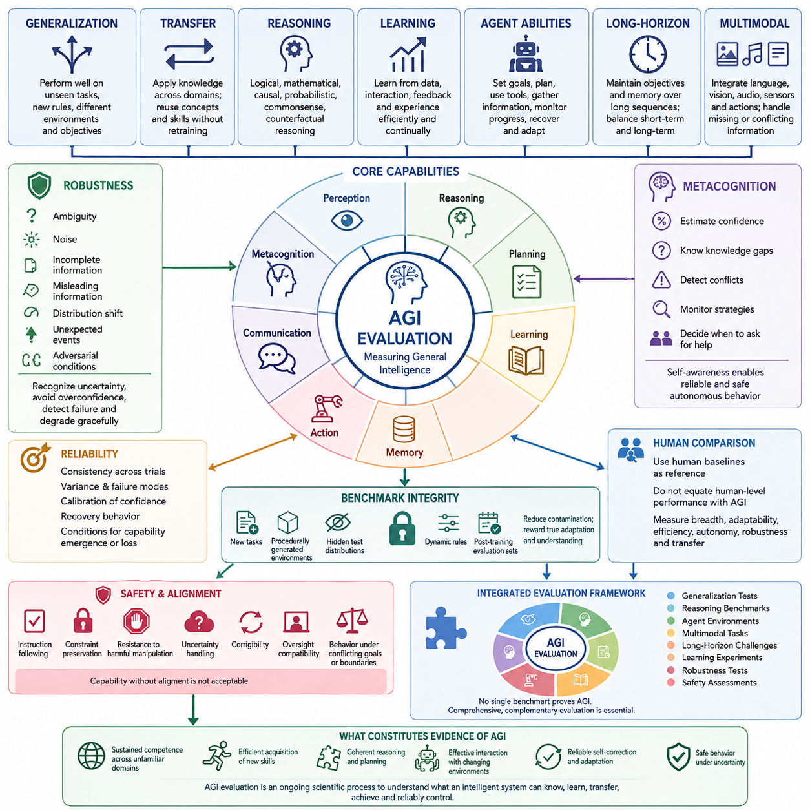
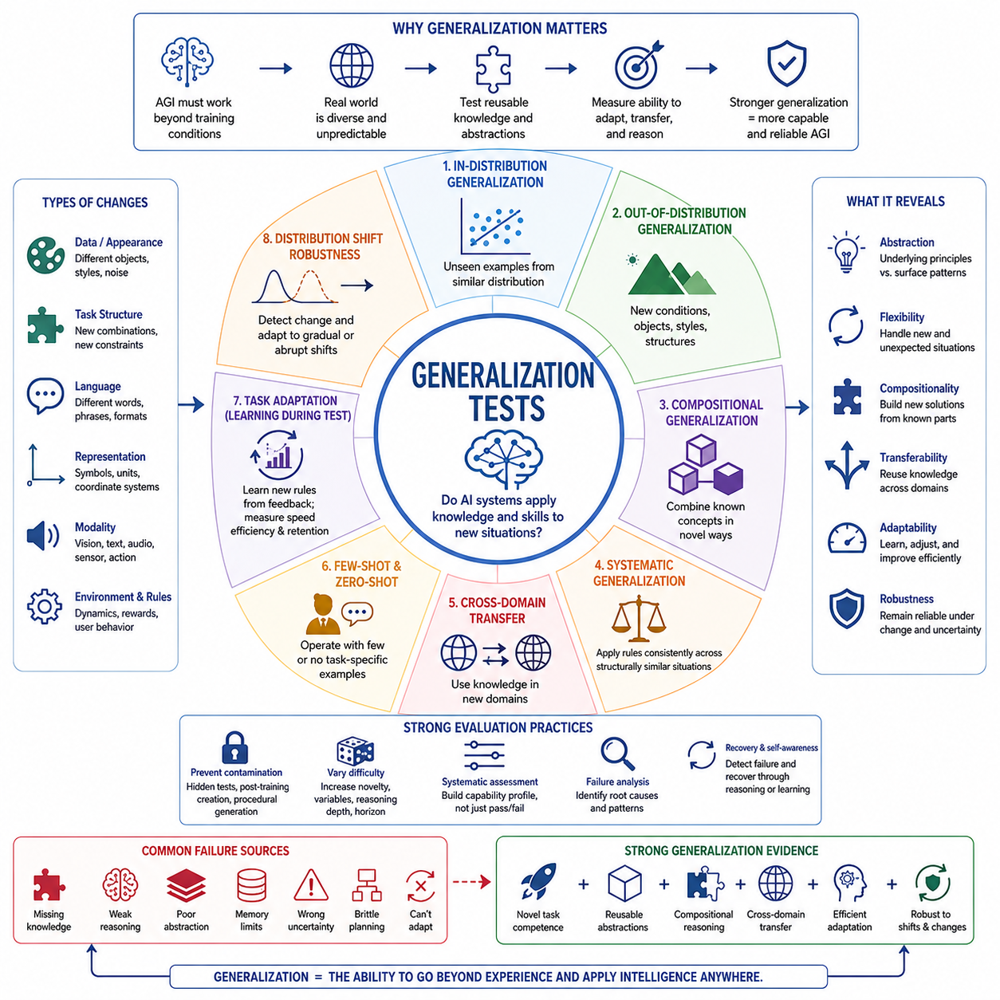
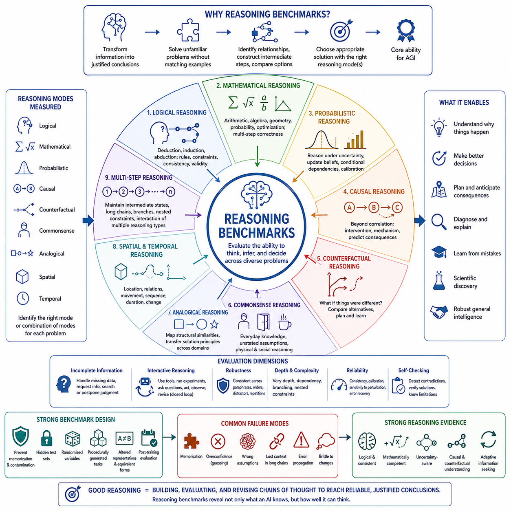
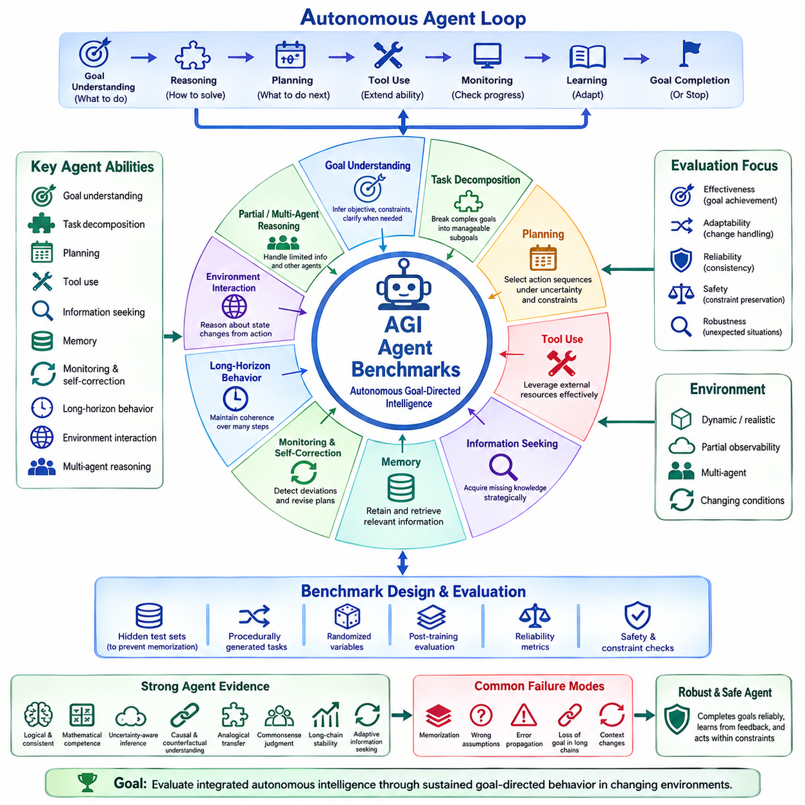
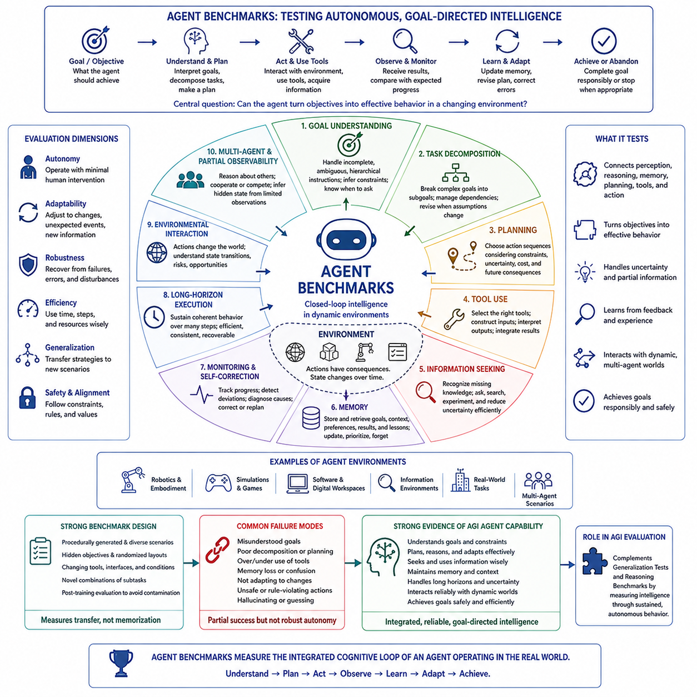
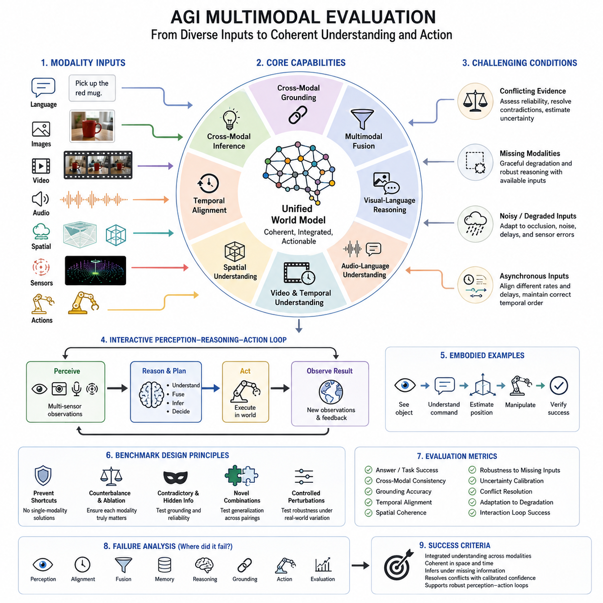
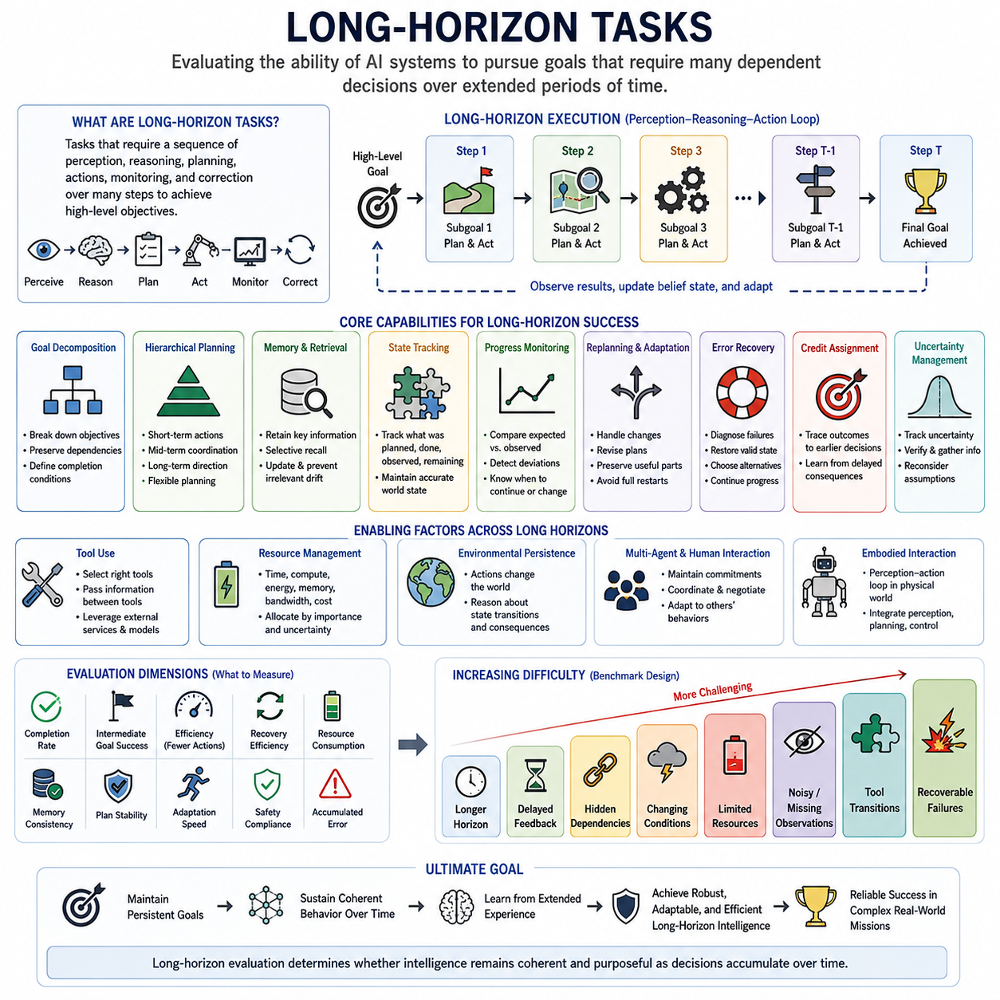
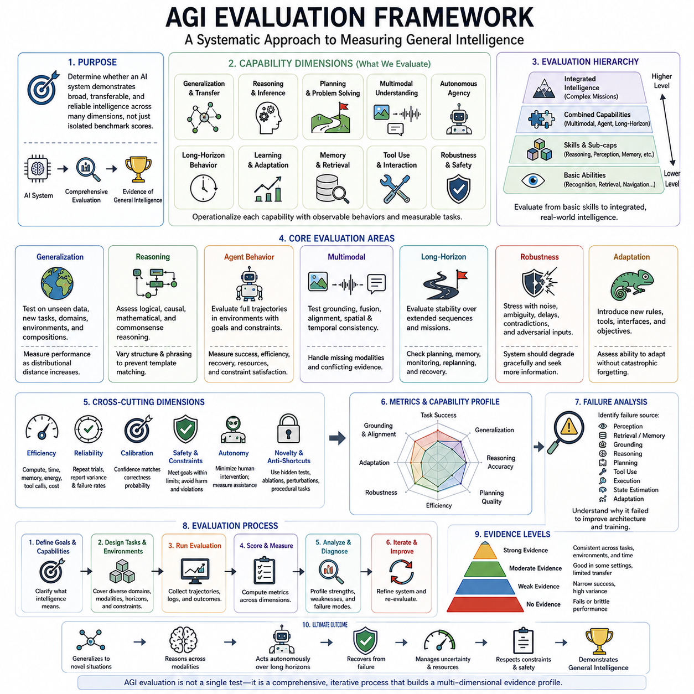

**Volume 47. Artificial General Intelligence**


# Chapter 07. AGI Evaluation and Benchmarks

##  

## 07.00. What is AGI Evaluation

{width="7.268055555555556in" height="7.268055555555556in"}

Artificial General Intelligence evaluation is the systematic process of determining whether an artificial system possesses intelligence that extends beyond competence in isolated tasks. Unlike conventional model evaluation, which measures performance on predefined datasets or narrow objectives, AGI evaluation asks whether a system can understand unfamiliar situations, acquire new capabilities, transfer knowledge across domains, reason under uncertainty, and pursue goals in environments that were not explicitly represented during training.

The central difficulty is that general intelligence cannot be represented adequately by a single accuracy score. A system may outperform humans on mathematics, programming, language, or visual recognition while remaining fragile when tasks require unfamiliar combinations of those abilities. AGI evaluation therefore treats intelligence as a multidimensional capability involving perception, memory, reasoning, learning, planning, adaptation, communication, action, and metacognition rather than as mastery of one benchmark.

Generalization is especially important because an apparently intelligent system may simply exploit patterns contained in its training distribution. A stronger evaluation examines performance when tasks, rules, environments, representations, or objectives change. The question is not merely whether the system can solve previously observed problem classes, but whether it can identify the structure of a new problem, connect it with prior knowledge, construct an appropriate strategy, and adapt when its initial assumptions prove incorrect.

Transfer provides another essential dimension of AGI evaluation. Knowledge acquired in one domain should improve performance in related or structurally similar domains without requiring complete retraining. A generally intelligent agent might learn principles of spatial reasoning from navigation and later reuse them in manipulation or planning. Evaluation must therefore examine whether internal representations capture reusable concepts and relationships rather than superficial correlations specific to individual datasets or tasks.

Reasoning evaluation investigates how effectively an agent can transform available information into conclusions, explanations, predictions, and decisions. This includes logical, mathematical, probabilistic, causal, commonsense, and counterfactual reasoning. Difficult evaluations should require combinations of these forms rather than testing them independently, because real problems rarely announce which reasoning method is appropriate. An AGI candidate must often determine both how to reason and what information is relevant.

Learning ability must also be evaluated dynamically rather than only through the capabilities frozen into a trained model. General intelligence implies the capacity to acquire useful knowledge from demonstrations, instructions, interaction, feedback, observation, and experience. Evaluation should measure learning efficiency, the amount of experience required for adaptation, resistance to catastrophic forgetting, and the ability to integrate new knowledge without destroying previously acquired competencies.

Agent evaluation expands the problem from producing correct answers to achieving goals through sequences of decisions. An intelligent agent may need to interpret an objective, decompose it into subgoals, select tools, gather missing information, monitor progress, recover from errors, and revise plans. These abilities become increasingly important as evaluation moves from short question-answer benchmarks toward interactive environments where actions alter future states and mistakes can accumulate across long horizons.

Long-horizon evaluation reveals weaknesses that short tasks often conceal. A system may appear highly capable when each interaction is independent yet fail when success depends on maintaining objectives, memories, constraints, and causal dependencies over hundreds of actions. AGI evaluation therefore needs tasks in which the agent must preserve coherence over time, recognize when circumstances invalidate an earlier plan, allocate resources, and balance immediate rewards against delayed consequences.

Multimodal evaluation examines whether intelligence remains coherent across language, vision, audio, spatial information, sensor observations, and actions. General intelligence should not consist merely of independent modality-specific modules producing disconnected outputs. The system should integrate evidence across modalities, establish correspondences between different representations of the same world, resolve conflicting observations, and use one modality to compensate when information in another modality is incomplete or uncertain.

Robustness is equally important because intelligence demonstrated only under carefully controlled benchmark conditions may not survive real deployment. Evaluations should introduce ambiguity, noisy observations, incomplete instructions, misleading information, distribution shifts, unexpected events, and adversarial conditions. The objective is not to demand perfect performance, but to determine whether the system recognizes uncertainty, avoids unjustified confidence, detects failure, and degrades gracefully instead of producing uncontrolled behavior.

Metacognition introduces evaluation of what the system knows about its own cognitive state. A capable agent should estimate confidence, recognize knowledge gaps, identify conflicts in its reasoning, detect unsuccessful strategies, and decide when additional information or external assistance is required. Such self-monitoring becomes critical for autonomous systems because raw problem-solving ability without reliable awareness of limitations can produce confident but systematically dangerous decisions.

AGI evaluation must distinguish capability from reliability. Demonstrating that a system can occasionally solve an extremely difficult task does not establish that the capability can be invoked consistently when required. Repeated trials, variations in context, alternative formulations, perturbations, and controlled difficulty levels are therefore necessary. Evaluation should characterize not only peak performance but also variance, failure modes, calibration, recovery behavior, and the conditions under which particular abilities emerge or disappear.

Human comparison can provide useful reference points, but human-level performance should not automatically define AGI. Humans themselves vary greatly across knowledge, memory, reasoning, perception, and expertise, while artificial systems may exhibit fundamentally different capability profiles. Evaluation should consequently use human baselines as informative anchors while separately measuring breadth, adaptability, efficiency, autonomy, robustness, and transfer instead of reducing general intelligence to imitation of an average human score.

Benchmark contamination presents a major methodological challenge. When evaluation problems or closely related examples appear in training data, high performance may reflect memorization rather than general intelligence. Strong AGI evaluation therefore benefits from newly generated tasks, procedurally constructed environments, hidden test distributions, dynamically changing rules, and evaluation sets created after model training. The more novel the evaluation conditions are, the more meaningful successful adaptation becomes.

Safety and alignment are inseparable from evaluation once systems become autonomous and broadly capable. An agent that efficiently accomplishes objectives while violating constraints cannot be considered successfully evaluated merely because task completion is high. Evaluation must examine instruction following, constraint preservation, resistance to harmful manipulation, uncertainty handling, corrigibility, oversight compatibility, and behavior when goals conflict or when the requested action exceeds authorized boundaries.

No single benchmark can establish the existence of AGI. A credible evaluation framework therefore combines generalization tests, reasoning benchmarks, agent environments, multimodal tasks, long-horizon challenges, learning experiments, robustness tests, and safety assessments. These components correspond to the broader evaluation structure in which generalization, reasoning, agency, multimodal intelligence, temporal persistence, and integrated evaluation are treated as complementary views of the same underlying question.

Ultimately, AGI evaluation should measure the structure and adaptability of intelligence rather than the accumulation of benchmark victories. The strongest evidence for general intelligence would be sustained competence across unfamiliar domains, efficient acquisition of new skills, coherent reasoning and planning, effective interaction with changing environments, reliable self-correction, and safe behavior under uncertainty. Evaluation thus becomes an ongoing scientific process for mapping what an intelligent system can understand, learn, transfer, accomplish, and reliably control.

인공일반지능 평가(Artificial General Intelligence Evaluation)는 인공지능 시스템이 개별적인 특정 과제(Isolated Task)의 수행 능력을 넘어서는 지능(Intelligence)을 보유하고 있는지를 체계적으로 판단하는 과정이다. 기존의 모델 평가(Model Evaluation)가 미리 정의된 데이터셋(Dataset)이나 제한된 목표에 대한 성능을 측정한다면, AGI 평가는 시스템이 낯선 상황을 이해하고 새로운 능력을 습득하며 영역 간 지식을 전이하고 불확실한 상황에서 추론하며 학습 과정에서 명시적으로 경험하지 않은 환경에서도 목표를 달성할 수 있는지를 평가한다.

핵심적인 어려움은 일반지능(General Intelligence)을 하나의 정확도 점수(Accuracy Score)만으로 적절하게 표현할 수 없다는 점이다. 어떤 시스템이 수학, 프로그래밍, 언어 또는 시각 인식에서 인간보다 뛰어난 성능을 보이더라도 이러한 능력을 새롭게 조합해야 하는 상황에서는 취약할 수 있다. 따라서 AGI 평가는 지능을 하나의 벤치마크(Benchmark)에 대한 숙련도가 아니라 지각(Perception), 기억(Memory), 추론(Reasoning), 학습(Learning), 계획(Planning), 적응(Adaptation), 의사소통(Communication), 행동(Action), 메타인지(Metacognition)를 포함하는 다차원적 능력으로 다룬다.

일반화(Generalization)는 특히 중요하다. 겉으로는 지능적으로 보이는 시스템도 실제로는 학습 분포(Training Distribution)에 포함된 패턴을 활용하는 것에 불과할 수 있기 때문이다. 보다 강력한 평가는 과제, 규칙, 환경, 표현 또는 목표가 변경되었을 때의 성능을 조사한다. 핵심 질문은 시스템이 이전에 경험한 문제 유형을 해결할 수 있는가에 그치지 않고, 새로운 문제의 구조를 파악하고 기존 지식과 연결하며 적절한 전략을 구성하고 초기 가정이 잘못되었을 때 이를 수정할 수 있는가에 있다.

전이(Transfer)는 AGI 평가의 또 다른 핵심 차원이다. 한 영역에서 습득한 지식은 완전한 재학습(Retraining) 없이도 관련되거나 구조적으로 유사한 다른 영역의 성능을 향상시킬 수 있어야 한다. 예를 들어 일반지능 에이전트(Generally Intelligent Agent)는 내비게이션(Navigation)에서 공간 추론(Spatial Reasoning)의 원리를 학습한 뒤 이를 조작(Manipulation)이나 계획(Planning)에 다시 활용할 수 있다. 따라서 평가는 내부 표현(Internal Representation)이 개별 데이터셋이나 과제에 특화된 표면적 상관관계가 아니라 재사용 가능한 개념과 관계를 포착하는지를 살펴보아야 한다.

추론 평가(Reasoning Evaluation)는 에이전트가 이용 가능한 정보를 얼마나 효과적으로 결론, 설명, 예측 및 의사결정으로 변환하는지를 조사한다. 여기에는 논리적 추론(Logical Reasoning), 수학적 추론(Mathematical Reasoning), 확률적 추론(Probabilistic Reasoning), 인과적 추론(Causal Reasoning), 상식 추론(Commonsense Reasoning), 반사실적 추론(Counterfactual Reasoning)이 포함된다. 현실의 문제는 어떤 추론 방법을 사용해야 하는지 미리 알려주지 않으므로 어려운 평가에서는 이러한 능력들을 독립적으로 시험하기보다 서로 결합하여 요구해야 한다. AGI 후보 시스템은 무엇을 추론해야 하는지뿐 아니라 어떻게 추론해야 하는지도 스스로 결정해야 한다.

학습 능력(Learning Ability)은 학습이 완료된 모델에 고정된 능력만을 대상으로 하는 것이 아니라 동적으로 평가되어야 한다. 일반지능은 시연(Demonstration), 지시(Instruction), 상호작용(Interaction), 피드백(Feedback), 관찰(Observation), 경험(Experience)을 통해 유용한 지식을 새롭게 획득할 수 있는 능력을 의미한다. 따라서 평가는 학습 효율성(Learning Efficiency), 적응에 필요한 경험의 양, 치명적 망각(Catastrophic Forgetting)에 대한 저항성, 그리고 기존 능력을 손상시키지 않으면서 새로운 지식을 통합하는 능력을 측정해야 한다.

에이전트 평가(Agent Evaluation)는 올바른 답을 생성하는 문제에서 벗어나 연속적인 의사결정을 통해 목표를 달성하는 문제로 평가 범위를 확장한다. 지능형 에이전트(Intelligent Agent)는 목표를 해석하고 이를 하위 목표(Subgoal)로 분해하며 도구(Tool)를 선택하고 부족한 정보를 수집하며 진행 상황을 감시하고 오류에서 회복하며 계획을 수정해야 할 수 있다. 이러한 능력은 단순한 질의응답 벤치마크에서 행동이 미래 상태를 변화시키고 오류가 장기간 누적될 수 있는 상호작용 환경(Interactive Environment)으로 평가가 확장될수록 중요해진다.

장기 지평 평가(Long-Horizon Evaluation)는 짧은 과제에서 드러나지 않는 약점을 발견한다. 각각의 상호작용이 독립적일 때는 뛰어나 보이는 시스템도 수백 번의 행동에 걸쳐 목표, 기억, 제약조건 및 인과적 의존성을 유지해야 하는 상황에서는 실패할 수 있다. 따라서 AGI 평가에는 에이전트가 시간에 걸쳐 일관성을 유지하고, 변화된 상황이 이전 계획을 무효화했음을 인식하며, 자원을 배분하고, 즉각적인 보상과 지연된 결과 사이에서 균형을 유지해야 하는 과제가 포함되어야 한다.

다중양식 평가(Multimodal Evaluation)는 언어(Language), 시각(Vision), 오디오(Audio), 공간 정보(Spatial Information), 센서 관측(Sensor Observation), 행동(Action) 전반에서 지능이 일관되게 유지되는지를 조사한다. 일반지능은 서로 독립적인 양식별 모듈(Modality-Specific Module)이 단절된 결과를 생성하는 것에 그쳐서는 안 된다. 시스템은 서로 다른 양식의 증거를 통합하고 동일한 세계를 나타내는 서로 다른 표현 사이의 대응 관계를 형성하며, 충돌하는 관측을 해결하고, 특정 양식의 정보가 불완전하거나 불확실할 때 다른 양식을 이용해 이를 보완할 수 있어야 한다.

강건성(Robustness) 역시 중요하다. 세심하게 통제된 벤치마크 조건에서만 나타나는 지능은 실제 환경(Real-World Environment)에 배치되었을 때 유지되지 않을 수 있기 때문이다. 평가는 모호성(Ambiguity), 잡음이 포함된 관측(Noisy Observation), 불완전한 지시(Incomplete Instruction), 오해를 유발하는 정보(Misleading Information), 분포 변화(Distribution Shift), 예상하지 못한 사건(Unexpected Event), 적대적 조건(Adversarial Condition)을 포함해야 한다. 목표는 완벽한 성능을 요구하는 것이 아니라 시스템이 불확실성을 인식하고 근거 없는 확신을 피하며 실패를 감지하고 통제되지 않은 행동 대신 점진적으로 성능이 저하되는지를 판단하는 것이다.

메타인지(Metacognition)는 시스템이 자신의 인지 상태(Cognitive State)를 얼마나 이해하고 있는지를 평가 대상으로 추가한다. 능력 있는 에이전트는 자신의 확신도(Confidence)를 추정하고 지식의 공백(Knowledge Gap)을 인식하며 추론 과정의 충돌을 찾아내고 실패한 전략을 감지하며 추가 정보나 외부 지원이 필요한 시점을 판단할 수 있어야 한다. 이러한 자기 감시(Self-Monitoring)는 자율 시스템(Autonomous System)에서 특히 중요하다. 자신의 한계를 신뢰성 있게 인식하지 못한 높은 문제 해결 능력은 오히려 확신에 찬 위험한 의사결정으로 이어질 수 있기 때문이다.

AGI 평가는 능력(Capability)과 신뢰성(Reliability)을 구분해야 한다. 시스템이 매우 어려운 문제를 간헐적으로 해결할 수 있다는 사실만으로 그 능력이 필요할 때 일관되게 발휘된다고 판단할 수는 없다. 따라서 반복 시험(Repeated Trial), 문맥 변화(Context Variation), 대체 표현(Alternative Formulation), 섭동(Perturbation), 통제된 난이도(Controlled Difficulty)가 필요하다. 평가는 최고 성능뿐 아니라 성능 편차(Variance), 실패 유형(Failure Mode), 보정(Calibration), 복구 행동(Recovery Behavior), 특정 능력이 나타나거나 사라지는 조건까지 특성화해야 한다.

인간 비교(Human Comparison)는 유용한 기준점을 제공할 수 있지만 인간 수준의 성능(Human-Level Performance)을 자동적으로 AGI의 정의로 간주해서는 안 된다. 인간 역시 지식, 기억, 추론, 지각 및 전문성에서 상당한 개인차를 나타내며 인공지능 시스템은 인간과 근본적으로 다른 능력 프로파일(Capability Profile)을 가질 수 있다. 따라서 인간 기준선(Human Baseline)은 유용한 참조점으로 사용하되 일반지능을 평균적인 인간 점수의 모방으로 축소하지 않고 능력의 폭(Breadth), 적응성(Adaptability), 효율성(Efficiency), 자율성(Autonomy), 강건성(Robustness), 전이(Transfer)를 별도로 측정해야 한다.

벤치마크 오염(Benchmark Contamination)은 중요한 방법론적 문제를 발생시킨다. 평가 문제 또는 이와 매우 유사한 사례가 학습 데이터(Training Data)에 포함되어 있다면 높은 성능은 일반지능이 아니라 암기(Memorization)의 결과일 수 있다. 따라서 강력한 AGI 평가는 새롭게 생성된 과제, 절차적으로 생성된 환경(Procedurally Generated Environment), 비공개 시험 분포(Hidden Test Distribution), 동적으로 변경되는 규칙, 모델 학습 이후에 만들어진 평가 세트를 활용하는 것이 바람직하다. 평가 조건의 새로움이 커질수록 성공적인 적응은 일반지능을 보여주는 더욱 의미 있는 증거가 된다.

시스템이 자율적이고 광범위한 능력을 갖추게 되면 안전성(Safety)과 정렬(Alignment)은 평가와 분리할 수 없는 요소가 된다. 제약조건을 위반하면서 목표를 효율적으로 달성하는 에이전트는 단순히 과제 완료율이 높다는 이유만으로 성공적으로 평가되었다고 볼 수 없다. 따라서 평가는 지시 준수(Instruction Following), 제약조건 유지(Constraint Preservation), 유해한 조작에 대한 저항성, 불확실성 처리, 수정 가능성(Corrigibility), 인간 감독과의 호환성(Oversight Compatibility), 목표가 충돌하거나 요청된 행동이 허가된 범위를 초과했을 때의 행동까지 조사해야 한다.

어떠한 단일 벤치마크(Single Benchmark)도 AGI의 존재를 확정할 수 없다. 따라서 신뢰할 수 있는 평가 프레임워크(Evaluation Framework)는 일반화 시험(Generalization Test), 추론 벤치마크(Reasoning Benchmark), 에이전트 환경(Agent Environment), 다중양식 과제(Multimodal Task), 장기 지평 과제(Long-Horizon Challenge), 학습 실험(Learning Experiment), 강건성 시험(Robustness Test), 안전성 평가(Safety Assessment)를 결합해야 한다. 이러한 구성요소는 일반화, 추론, 에이전트성(Agency), 다중양식 지능, 시간적 지속성(Temporal Persistence), 통합 평가(Integrated Evaluation)를 동일한 일반지능 문제를 바라보는 상호보완적 관점으로 다루는 전체 평가 구조와 연결된다.

궁극적으로 AGI 평가(AGI Evaluation)는 벤치마크 승리의 누적이 아니라 지능의 구조(Structure of Intelligence)와 적응성(Adaptability)을 측정해야 한다. 일반지능을 뒷받침하는 가장 강력한 증거는 낯선 영역에서도 지속되는 능력, 새로운 기술을 효율적으로 습득하는 능력, 일관된 추론과 계획, 변화하는 환경과의 효과적인 상호작용, 신뢰할 수 있는 자기 수정(Self-Correction), 불확실한 상황에서의 안전한 행동이다. 따라서 AGI 평가는 지능형 시스템이 무엇을 이해하고 학습하며 전이하고 성취할 수 있는지, 그리고 그러한 능력을 얼마나 신뢰성 있게 통제할 수 있는지를 지속적으로 규명하는 과학적 과정(Scientific Process)이라고 할 수 있다.

##  

## 07.01. Generalization Tests

{width="7.268055555555556in" height="7.268055555555556in"}

Generalization tests examine whether an artificial intelligence system can apply knowledge and capabilities beyond the exact conditions encountered during training. For AGI, this ability is fundamental because intelligence must remain useful when tasks, environments, representations, goals, or rules change. A system that succeeds only on familiar examples may demonstrate strong pattern recognition without demonstrating genuinely general intelligence.

The simplest form of generalization evaluates performance on unseen examples drawn from approximately the same distribution as the training data. This tests whether the system has learned reusable patterns rather than memorized individual cases. Although important, such in-distribution evaluation is insufficient for AGI because real environments frequently produce situations whose combinations, contexts, and constraints differ substantially from those represented during training.

Out-of-distribution generalization increases the difficulty by changing important properties of the evaluation environment. Inputs may contain unfamiliar objects, different linguistic styles, altered visual conditions, new task structures, or unexpected combinations of known concepts. Successful performance indicates that the system has learned abstractions that remain useful when surface-level statistical regularities change, rather than depending entirely on familiar correlations.

Compositional generalization tests whether previously learned concepts can be recombined in novel ways. A system may understand individual ideas such as objects, actions, spatial relationships, numerical operations, or logical rules, yet fail when they appear in combinations that were absent during training. AGI requires the ability to construct new solutions from reusable components because the number of possible real-world combinations is effectively unlimited.

Systematic generalization evaluates whether learned rules are applied consistently across equivalent situations. If a system learns a relationship in one context, structurally similar relationships should often be handled using the same underlying principle. This form of testing is particularly valuable for distinguishing genuine rule-like understanding from pattern matching, since superficial similarity may be deliberately reduced while deeper structural relationships are preserved.

Cross-domain transfer extends generalization beyond variations of a single task. Knowledge obtained in language, vision, mathematics, navigation, or interaction may contain principles that are useful elsewhere. Tests can therefore examine whether an agent recognizes shared structures between domains and reuses them effectively. Strong transfer suggests that internal representations encode concepts at a sufficiently abstract level to support broader intelligence.

Few-shot and zero-shot evaluation measure how efficiently a system can operate when direct training examples are scarce or absent. Zero-shot tasks require the system to interpret instructions and apply existing knowledge without task-specific examples, while few-shot tasks provide only limited demonstrations. These settings are important for AGI because a generally intelligent system should not require extensive retraining whenever it encounters a new objective or unfamiliar environment.

Task adaptation tests add an interactive dimension by allowing the system to learn during evaluation. Instead of measuring only fixed pretrained capability, the evaluator observes how quickly the system identifies new rules, updates strategies, and improves through feedback. Adaptation speed, sample efficiency, stability, and retention become important measures because intelligence involves not only what has already been learned but also how effectively future learning occurs.

Distribution shifts can be introduced gradually or abruptly. Gradual shifts test whether a system notices changing conditions and continuously adjusts its internal models, while abrupt shifts examine recovery from unexpected transitions. Examples include altered sensor characteristics, new environmental dynamics, changing user behavior, or modified reward structures. Robust AGI should recognize that previous assumptions are becoming unreliable and revise them accordingly.

Generalization should also be tested under changes in representation. The same underlying problem may be expressed using different words, symbols, visual layouts, coordinate systems, units, or modalities. A system that truly understands the problem structure should retain much of its competence despite these transformations. Large performance losses after superficial reformulation can reveal dependence on presentation-specific cues rather than stable conceptual understanding.

Counterfactual and causal generalization provide stronger tests because they require reasoning about how outcomes would change under different interventions. Statistical similarity alone may not be sufficient when the environment behaves differently from familiar examples. An intelligent system should distinguish correlation from causation, predict consequences of interventions, and adapt its reasoning when mechanisms change while irrelevant background features remain constant.

Generalization tests must carefully control benchmark contamination. If evaluation tasks, solutions, or close variants appeared during training, apparently impressive zero-shot performance may partly reflect memorization. Hidden evaluation sets, procedurally generated problems, newly created environments, randomized rules, and post-training task construction can reduce this risk. The objective is to maximize the probability that success reflects transferable capability rather than exposure.

Difficulty should be varied systematically rather than represented by a single pass-or-fail threshold. Evaluators can increase novelty, number of interacting variables, required reasoning depth, horizon length, uncertainty, or environmental change. This produces a capability profile showing where performance begins to degrade. Such profiles are more informative than aggregate scores because two systems with similar averages may exhibit very different generalization boundaries.

Failure analysis is therefore an essential component of generalization testing. Evaluators should determine whether errors arise from missing knowledge, weak reasoning, poor abstraction, memory limitations, incorrect uncertainty estimates, brittle planning, or inability to adapt. Repeated tests with controlled perturbations help reveal whether a failure is isolated or systematic and whether the system can recognize the failure and recover through additional reasoning or learning.

Ultimately, AGI generalization tests should measure whether intelligence remains functional as familiar assumptions are progressively removed. Strong evidence would include competence on novel tasks, reusable abstractions, compositional reasoning, cross-domain transfer, efficient adaptation, robustness to representation changes, and recovery from distribution shifts. Generalization is therefore not a single benchmark property but a central test of whether learned intelligence can extend beyond its training history.

일반화 테스트(Generalization Tests)는 인공지능 시스템이 학습 과정에서 경험한 정확한 조건을 넘어 지식과 능력을 적용할 수 있는지를 평가한다. AGI에서 이러한 능력은 핵심적이다. 과제(Task), 환경(Environment), 표현(Representation), 목표(Goal), 규칙(Rule)이 변경되더라도 지능은 계속 유용하게 작동해야 하기 때문이다. 익숙한 사례에서만 성공하는 시스템은 뛰어난 패턴 인식(Pattern Recognition)을 보여줄 수는 있지만 진정한 일반지능(General Intelligence)을 입증했다고 보기는 어렵다.

가장 단순한 형태의 일반화(Generalization)는 학습 데이터와 대략 동일한 분포에서 추출되었지만 이전에는 보지 못했던 사례에 대한 성능을 평가한다. 이는 시스템이 개별 사례를 암기(Memorization)한 것이 아니라 재사용 가능한 패턴을 학습했는지를 확인한다. 이러한 분포 내 평가(In-Distribution Evaluation)도 중요하지만 실제 환경에서는 학습 중 경험했던 것과 상당히 다른 상황, 조합, 문맥 및 제약조건이 지속적으로 발생하기 때문에 AGI 평가만으로는 충분하지 않다.

분포 외 일반화(Out-of-Distribution Generalization)는 평가 환경의 중요한 특성을 변화시켜 난이도를 높인다. 입력에는 익숙하지 않은 객체, 서로 다른 언어 표현 방식, 변화된 시각적 조건, 새로운 과제 구조 또는 기존 개념의 예상하지 못한 조합이 포함될 수 있다. 이러한 상황에서도 성공적인 성능을 보인다면 시스템이 익숙한 상관관계에 전적으로 의존하는 대신 표면적인 통계적 규칙성이 변화해도 유용하게 유지되는 추상화(Abstraction)를 학습했음을 의미한다.

조합적 일반화(Compositional Generalization)는 이전에 학습한 개념을 새로운 방식으로 결합할 수 있는지를 시험한다. 시스템이 객체, 행동, 공간적 관계, 수치 연산 또는 논리 규칙과 같은 개별 개념을 이해하면서도 학습 중 등장하지 않았던 조합에서는 실패할 수 있다. 현실 세계에서 가능한 조합의 수는 사실상 무한하기 때문에 AGI는 재사용 가능한 구성요소(Reusable Component)를 이용하여 새로운 해결책을 구성할 수 있어야 한다.

체계적 일반화(Systematic Generalization)는 학습한 규칙이 동등한 상황에 일관되게 적용되는지를 평가한다. 시스템이 특정 문맥에서 어떤 관계를 학습했다면 구조적으로 유사한 관계에서도 동일한 기본 원리를 활용할 수 있어야 한다. 이러한 시험은 표면적인 유사성을 의도적으로 줄이면서 더 깊은 구조적 관계를 유지할 수 있기 때문에 진정한 규칙 기반 이해(Rule-Like Understanding)와 단순한 패턴 매칭(Pattern Matching)을 구별하는 데 특히 유용하다.

영역 간 전이(Cross-Domain Transfer)는 하나의 과제에서 발생하는 변형을 넘어 일반화 범위를 확장한다. 언어(Language), 시각(Vision), 수학(Mathematics), 내비게이션(Navigation), 상호작용(Interaction)에서 획득한 지식에는 다른 영역에서도 활용할 수 있는 원리가 포함될 수 있다. 따라서 테스트는 에이전트가 서로 다른 영역 사이의 공통 구조를 인식하고 이를 효과적으로 재사용하는지를 평가할 수 있다. 강력한 전이는 내부 표현(Internal Representation)이 더 광범위한 지능을 지원할 만큼 충분히 추상적인 수준에서 개념을 표현하고 있음을 시사한다.

퓨샷 평가(Few-Shot Evaluation)와 제로샷 평가(Zero-Shot Evaluation)는 직접적인 학습 사례가 거의 없거나 전혀 없는 상황에서 시스템이 얼마나 효율적으로 작동할 수 있는지를 측정한다. 제로샷 과제(Zero-Shot Task)는 과제별 사례 없이 지시를 해석하고 기존 지식을 적용하도록 요구하며, 퓨샷 과제(Few-Shot Task)는 제한된 수의 시범 사례만 제공한다. 일반지능 시스템은 새로운 목표나 익숙하지 않은 환경을 만날 때마다 대규모 재학습(Retraining)을 필요로 해서는 안 되므로 이러한 평가 방식은 AGI에서 중요하다.

과제 적응 테스트(Task Adaptation Tests)는 평가 과정에서 시스템이 학습할 수 있도록 함으로써 상호작용적 요소를 추가한다. 이미 학습된 고정 능력만을 측정하는 대신 평가자는 시스템이 새로운 규칙을 얼마나 빠르게 파악하고 전략을 갱신하며 피드백(Feedback)을 통해 성능을 개선하는지를 관찰한다. 지능은 이미 학습한 내용뿐 아니라 앞으로 얼마나 효과적으로 학습할 수 있는지도 포함하므로 적응 속도(Adaptation Speed), 표본 효율성(Sample Efficiency), 안정성(Stability), 유지 능력(Retention)이 중요한 평가 지표가 된다.

분포 변화(Distribution Shift)는 점진적으로 또는 갑작스럽게 도입할 수 있다. 점진적 변화는 시스템이 변화하는 조건을 감지하고 내부 모델(Internal Model)을 지속적으로 조정할 수 있는지를 평가하며, 갑작스러운 변화는 예상하지 못한 전환으로부터 회복하는 능력을 시험한다. 센서 특성의 변화, 새로운 환경 동역학(Environmental Dynamics), 사용자 행동 변화 또는 보상 구조(Reward Structure)의 변경 등이 이에 해당한다. 강건한 AGI는 기존 가정이 더 이상 신뢰할 수 없음을 인식하고 그에 따라 이를 수정해야 한다.

일반화는 표현 방식의 변화(Representation Change)에 대해서도 평가되어야 한다. 동일한 기본 문제가 서로 다른 단어, 기호, 시각적 배치, 좌표계(Coordinate System), 단위(Unit) 또는 양식(Modality)을 사용하여 표현될 수 있다. 문제의 구조를 진정으로 이해하는 시스템이라면 이러한 변환에도 상당한 수준의 능력을 유지해야 한다. 표면적인 문제 표현의 변화만으로 성능이 크게 저하된다면 안정적인 개념적 이해(Conceptual Understanding)보다 표현 방식에 특화된 단서에 의존하고 있음을 보여줄 수 있다.

반사실적 일반화(Counterfactual Generalization)와 인과적 일반화(Causal Generalization)는 서로 다른 개입(Intervention)이 이루어졌을 때 결과가 어떻게 변화하는지를 추론해야 하기 때문에 더욱 강력한 시험을 제공한다. 환경이 익숙한 사례와 다르게 작동한다면 통계적 유사성만으로는 충분하지 않을 수 있다. 지능형 시스템은 상관관계(Correlation)와 인과관계(Causation)를 구별하고 개입의 결과를 예측하며 관련 없는 배경 특성은 유지되더라도 인과 메커니즘이 변화하면 추론 방식을 적절하게 조정할 수 있어야 한다.

일반화 테스트는 벤치마크 오염(Benchmark Contamination)을 세심하게 통제해야 한다. 평가 과제, 정답 또는 매우 유사한 변형이 학습 과정에서 이미 사용되었다면 인상적인 제로샷 성능도 부분적으로 암기에서 비롯되었을 수 있다. 비공개 평가 세트(Hidden Evaluation Set), 절차적으로 생성된 문제(Procedurally Generated Problem), 새롭게 만들어진 환경, 무작위화된 규칙(Randomized Rule), 학습 이후 생성된 과제(Post-Training Task)를 활용하면 이러한 위험을 줄일 수 있다. 목표는 성공이 이전 노출이 아니라 전이 가능한 능력(Transferable Capability)을 반영할 가능성을 최대화하는 것이다.

난이도(Difficulty)는 하나의 통과 또는 실패 기준으로 표현하기보다 체계적으로 변화시켜야 한다. 평가자는 새로움(Novelty), 상호작용하는 변수의 수, 필요한 추론 깊이(Reasoning Depth), 지평 길이(Horizon Length), 불확실성(Uncertainty), 환경 변화의 정도를 점진적으로 증가시킬 수 있다. 이를 통해 어느 지점에서 성능이 저하되기 시작하는지를 보여주는 능력 프로파일(Capability Profile)을 구성할 수 있다. 비슷한 평균 점수를 가진 두 시스템도 서로 매우 다른 일반화 경계(Generalization Boundary)를 보일 수 있으므로 이러한 프로파일은 단순한 종합 점수보다 많은 정보를 제공한다.

따라서 실패 분석(Failure Analysis)은 일반화 테스트에서 필수적인 요소이다. 평가자는 오류가 지식 부족, 약한 추론, 부족한 추상화, 기억 한계(Memory Limitation), 잘못된 불확실성 추정, 취약한 계획(Brittle Planning), 적응 능력 부족 중 어디에서 발생했는지를 파악해야 한다. 통제된 섭동(Controlled Perturbation)을 이용한 반복 시험은 실패가 일시적인 것인지 체계적인 것인지를 확인하고, 시스템이 실패를 스스로 인식하여 추가적인 추론이나 학습을 통해 회복할 수 있는지를 평가하는 데 도움을 준다.

궁극적으로 AGI 일반화 테스트(AGI Generalization Tests)는 익숙한 가정들이 점진적으로 제거되는 상황에서도 지능이 계속 기능할 수 있는지를 측정해야 한다. 강력한 일반화의 증거에는 새로운 과제에 대한 능력, 재사용 가능한 추상화(Reusable Abstraction), 조합적 추론(Compositional Reasoning), 영역 간 전이, 효율적인 적응, 표현 변화에 대한 강건성, 분포 변화로부터의 회복 능력이 포함된다. 따라서 일반화는 하나의 벤치마크 특성이 아니라 학습된 지능이 자신의 학습 이력(Training History)을 넘어 얼마나 확장될 수 있는지를 판단하는 AGI의 핵심 시험이라고 할 수 있다.

##  

## 07.02. Reasoning Benchmarks

{width="7.268055555555556in" height="7.268055555555556in"}

Reasoning benchmarks evaluate whether an artificial intelligence system can transform information into justified conclusions rather than merely retrieve familiar answers or reproduce statistical patterns. Within AGI evaluation, reasoning is especially important because unfamiliar problems often require the system to identify relationships, construct intermediate conclusions, compare alternatives, and determine an appropriate solution even when no directly matching example exists in its training experience.

A comprehensive reasoning benchmark should measure several forms of reasoning rather than treating intelligence as a single homogeneous capability. Logical, mathematical, probabilistic, causal, spatial, temporal, analogical, commonsense, and counterfactual reasoning involve different structures and assumptions. An AGI candidate should not only perform well within these categories independently but also recognize which reasoning mode, or combination of modes, is appropriate for a particular problem.

Logical reasoning tests whether a system can manipulate propositions, rules, constraints, and relationships consistently. Tasks may require deduction from known premises, induction from observations, or abduction toward the most plausible explanation. Strong performance requires more than producing the correct final answer: the system should preserve relevant constraints, avoid contradictions, distinguish valid implications from unsupported conclusions, and remain consistent when equivalent problems are expressed differently.

Mathematical reasoning benchmarks examine the ability to understand quantities, symbols, equations, structures, and transformations while maintaining correctness across multiple steps. Difficult tasks may combine arithmetic, algebra, geometry, probability, optimization, or abstract mathematical concepts. For AGI evaluation, the important property is not memorization of known solutions but the capacity to formulate unfamiliar problems, select suitable operations, track intermediate states, and verify whether results satisfy the original conditions.

Probabilistic reasoning evaluates decisions and conclusions when information is incomplete or uncertain. An intelligent system should distinguish possibility from probability, update beliefs when new evidence becomes available, and reason about conditional dependencies. These benchmarks are valuable because real-world environments rarely provide complete information, making calibrated uncertainty and rational belief revision essential components of reliable reasoning rather than optional extensions to deterministic problem solving.

Causal reasoning goes beyond statistical association by asking whether a system understands how changes in one variable influence another through underlying mechanisms. Benchmarks may distinguish observation from intervention or require predictions under altered conditions. Such tasks reveal whether a model can reason about why events occur, anticipate consequences of actions, and revise predictions when causal mechanisms change even though superficial correlations remain similar.

Counterfactual reasoning extends causal understanding by asking what would have happened if some event, condition, or action had been different. The system must preserve relevant aspects of the known situation while modifying specific assumptions and propagating their consequences. This capability is important for planning, diagnosis, scientific reasoning, decision support, and learning from mistakes because intelligent agents frequently need to compare actual outcomes with plausible alternatives.

Commonsense reasoning evaluates knowledge and inference about ordinary physical, social, and practical situations. Many apparently simple problems require assumptions that are rarely stated explicitly, such as object permanence, typical human intentions, everyday causality, or basic physical constraints. AGI reasoning benchmarks should therefore examine whether a system can infer unstated but relevant information while avoiding unsupported assumptions that merely resemble frequent patterns in its training data.

Analogical reasoning measures whether a system can identify structural similarities between situations whose surface features differ. Instead of matching words or appearances, the system must recognize corresponding relationships and transfer a useful solution principle from one problem to another. This capability connects reasoning benchmarks directly with generalization because abstract relational knowledge enables previously acquired reasoning strategies to become useful in unfamiliar domains and contexts.

Spatial and temporal reasoning evaluate relationships involving location, orientation, movement, sequence, duration, and change. A system may need to infer relative positions, predict how configurations evolve, reconstruct event order, or reason about dependencies across time. These abilities become particularly important for embodied AGI, robotics, autonomous agents, and world models where reasoning must remain grounded in dynamically changing states rather than isolated textual descriptions.

Multi-step reasoning benchmarks test whether a system can maintain coherent intermediate states across extended inference chains. Errors can accumulate when an early assumption is incorrect, relevant information is forgotten, or intermediate conclusions become inconsistent. Evaluation should therefore vary reasoning depth and dependency structure systematically, revealing how performance changes as problems require longer chains, branching alternatives, nested constraints, or interactions among several reasoning processes.

Reasoning under incomplete information is another important test of general intelligence. Some problems cannot be solved reliably from the evidence initially provided, and the correct behavior may be to acknowledge uncertainty, request additional information, search for evidence, or postpone commitment. Benchmarks that always guarantee a definite answer can unintentionally reward overconfidence, whereas realistic evaluation should distinguish justified conclusions from guesses presented with unjustified certainty.

Interactive reasoning expands evaluation beyond static question answering. An agent may need to perform experiments, query tools, inspect external information, test hypotheses, or choose actions that reveal previously unavailable evidence. Reasoning then becomes a closed loop involving hypothesis formation, information acquisition, inference, action, observation, and revision. This structure more closely reflects the reasoning requirements of autonomous AGI operating in complex environments.

Benchmark design must also defend against memorization and contamination. Widely published reasoning problems may appear directly or indirectly in training corpora, making high scores difficult to interpret. Novel problem generation, hidden test sets, randomized variables, procedurally constructed tasks, altered surface representations, and post-training evaluation can reduce this risk. Multiple equivalent formulations can additionally reveal whether performance depends on understanding or accidental prompt-specific cues.

Evaluation should measure reasoning reliability as well as maximum capability. A system that solves a difficult problem once but fails under minor paraphrases, reordered information, irrelevant distractors, or repeated trials has demonstrated fragile reasoning. Useful metrics therefore include consistency, calibration, sensitivity to perturbation, error propagation, recovery from incorrect intermediate steps, and the ability to detect contradictions or recognize when a proposed solution requires reconsideration.

Ultimately, AGI reasoning benchmarks should determine whether a system can construct, evaluate, and revise chains of thought across diverse and unfamiliar problems. Strong evidence includes logical consistency, mathematical competence, uncertainty-aware inference, causal and counterfactual understanding, analogical transfer, commonsense judgment, long-chain stability, and adaptive information seeking. Reasoning evaluation therefore complements generalization tests by examining not merely whether intelligence transfers, but whether the transferred knowledge can be transformed into coherent decisions and solutions.

추론 벤치마크(Reasoning Benchmarks)는 인공지능 시스템이 단순히 익숙한 답을 검색하거나 통계적 패턴을 재현하는 것을 넘어, 정보를 정당화된 결론으로 변환할 수 있는지를 평가한다. AGI 평가에서 추론은 특히 중요하다. 익숙하지 않은 문제에서는 시스템이 관계를 파악하고 중간 결론을 구성하며 대안을 비교하고, 학습 경험에서 직접적으로 일치하는 사례가 존재하지 않더라도 적절한 해결책을 결정해야 하는 경우가 많기 때문이다.

포괄적인 추론 벤치마크(Reasoning Benchmark)는 지능을 하나의 동질적인 능력으로 취급하기보다 여러 형태의 추론을 측정해야 한다. 논리적 추론(Logical Reasoning), 수학적 추론(Mathematical Reasoning), 확률적 추론(Probabilistic Reasoning), 인과적 추론(Causal Reasoning), 공간적 추론(Spatial Reasoning), 시간적 추론(Temporal Reasoning), 유추적 추론(Analogical Reasoning), 상식 추론(Commonsense Reasoning), 반사실적 추론(Counterfactual Reasoning)은 서로 다른 구조와 가정을 가진다. AGI 후보는 이러한 능력을 개별적으로 잘 수행할 뿐 아니라 특정 문제에 어떤 추론 방식 또는 추론 방식의 조합이 적절한지도 판단할 수 있어야 한다.

논리적 추론(Logical Reasoning)은 시스템이 명제(Proposition), 규칙(Rule), 제약조건(Constraint), 관계(Relationship)를 일관되게 처리할 수 있는지를 시험한다. 과제에서는 알려진 전제로부터의 연역(Deduction), 관찰로부터의 귀납(Induction), 가장 가능성 높은 설명을 찾는 가추(Abduction)가 요구될 수 있다. 강력한 성능은 단순히 최종 정답을 생성하는 것을 넘어 관련 제약조건을 유지하고 모순을 피하며, 타당한 함의와 근거 없는 결론을 구분하고, 동일한 문제가 다르게 표현되더라도 일관성을 유지하는 능력을 요구한다.

수학적 추론 벤치마크(Mathematical Reasoning Benchmarks)는 여러 단계에 걸쳐 정확성을 유지하면서 수량, 기호, 방정식, 구조 및 변환을 이해하는 능력을 평가한다. 어려운 과제는 산술(Arithmetic), 대수(Algebra), 기하학(Geometry), 확률(Probability), 최적화(Optimization), 추상적 수학 개념을 결합할 수 있다. AGI 평가에서 중요한 것은 알려진 해답의 암기가 아니라 익숙하지 않은 문제를 정식화하고 적절한 연산을 선택하며 중간 상태를 추적하고 결과가 원래 조건을 만족하는지 검증하는 능력이다.

확률적 추론(Probabilistic Reasoning)은 정보가 불완전하거나 불확실한 상황에서의 의사결정과 결론을 평가한다. 지능형 시스템은 가능성(Possibility)과 확률(Probability)을 구별하고 새로운 증거가 제공될 때 믿음(Belief)을 갱신하며 조건부 의존성(Conditional Dependency)을 추론할 수 있어야 한다. 현실 환경에서는 완전한 정보가 제공되는 경우가 드물기 때문에 보정된 불확실성(Calibrated Uncertainty)과 합리적인 믿음 수정(Belief Revision)은 결정론적 문제 해결에 부가되는 선택적 기능이 아니라 신뢰할 수 있는 추론의 핵심 요소이다.

인과적 추론(Causal Reasoning)은 통계적 연관성(Statistical Association)을 넘어 한 변수의 변화가 기본적인 메커니즘을 통해 다른 변수에 어떤 영향을 주는지를 시스템이 이해하는지 평가한다. 벤치마크에서는 관찰(Observation)과 개입(Intervention)을 구분하거나 변화된 조건에서 결과를 예측하도록 요구할 수 있다. 이러한 과제는 모델이 사건이 발생하는 이유를 추론하고 행동의 결과를 예상하며, 표면적인 상관관계가 유사하게 유지되더라도 인과 메커니즘이 변화했을 때 예측을 수정할 수 있는지를 보여준다.

반사실적 추론(Counterfactual Reasoning)은 어떤 사건, 조건 또는 행동이 달랐다면 무엇이 발생했을지를 질문함으로써 인과적 이해를 확장한다. 시스템은 알려진 상황의 관련 요소를 유지하면서 특정 가정만 변경하고 그 변화에 따른 결과를 추론해야 한다. 이러한 능력은 계획(Planning), 진단(Diagnosis), 과학적 추론(Scientific Reasoning), 의사결정 지원(Decision Support), 실수로부터의 학습에서 중요하다. 지능형 에이전트는 실제 결과와 가능한 대안적 결과를 자주 비교해야 하기 때문이다.

상식 추론(Commonsense Reasoning)은 일상적인 물리적, 사회적, 실용적 상황에 관한 지식과 추론 능력을 평가한다. 겉으로는 단순해 보이는 문제도 객체 영속성(Object Permanence), 일반적인 인간의 의도, 일상적인 인과관계 또는 기본적인 물리적 제약처럼 명시적으로 표현되지 않는 가정을 요구하는 경우가 많다. 따라서 AGI 추론 벤치마크는 시스템이 명시되지 않았지만 관련성이 높은 정보를 추론하면서 학습 데이터에서 자주 등장한 패턴과 유사하다는 이유만으로 근거 없는 가정을 만들어내지 않는지를 평가해야 한다.

유추적 추론(Analogical Reasoning)은 표면적 특징이 서로 다른 상황 사이에서 구조적 유사성(Structural Similarity)을 식별할 수 있는지를 측정한다. 단순히 단어나 외형을 일치시키는 것이 아니라 시스템은 대응되는 관계를 파악하고 한 문제에서 얻은 유용한 해결 원리를 다른 문제로 전이해야 한다. 이러한 능력은 추상적인 관계 지식(Abstract Relational Knowledge)이 이전에 습득한 추론 전략을 익숙하지 않은 영역과 문맥에서도 활용할 수 있게 한다는 점에서 추론 벤치마크를 일반화(Generalization)와 직접 연결한다.

공간적 추론(Spatial Reasoning)과 시간적 추론(Temporal Reasoning)은 위치, 방향, 이동, 순서, 지속시간 및 변화와 관련된 관계를 평가한다. 시스템은 상대적인 위치를 추론하고 구성 상태가 어떻게 변화하는지 예측하며 사건의 순서를 재구성하거나 시간에 따른 의존성을 추론해야 할 수 있다. 이러한 능력은 추론이 고립된 텍스트 설명이 아니라 동적으로 변화하는 상태에 기반해야 하는 체화형 AGI(Embodied AGI), 로보틱스(Robotics), 자율 에이전트(Autonomous Agent), 월드 모델(World Model)에서 특히 중요해진다.

다단계 추론 벤치마크(Multi-Step Reasoning Benchmarks)는 시스템이 확장된 추론 연쇄(Inference Chain)에 걸쳐 일관된 중간 상태를 유지할 수 있는지를 시험한다. 초기 가정이 잘못되거나 관련 정보를 잊거나 중간 결론이 불일치하면 오류가 연속적으로 누적될 수 있다. 따라서 평가는 추론 깊이와 의존 구조를 체계적으로 변화시키면서 더 긴 추론 연쇄, 분기되는 대안, 중첩된 제약조건 또는 여러 추론 과정의 상호작용이 요구될 때 성능이 어떻게 변화하는지를 확인해야 한다.

불완전한 정보에서의 추론(Reasoning under Incomplete Information)도 일반지능을 평가하는 중요한 시험이다. 일부 문제는 처음 제공된 증거만으로 신뢰성 있게 해결할 수 없으며, 올바른 행동은 불확실성을 인정하거나 추가 정보를 요청하거나 증거를 탐색하거나 판단을 보류하는 것일 수 있다. 항상 명확한 정답이 존재하도록 설계된 벤치마크는 의도하지 않게 과도한 확신(Overconfidence)을 보상할 수 있으므로 현실적인 평가는 정당화된 결론과 근거 없는 확신으로 제시된 추측을 구분해야 한다.

상호작용적 추론(Interactive Reasoning)은 정적인 질의응답(Question Answering)을 넘어 평가 범위를 확장한다. 에이전트는 실험을 수행하거나 도구(Tool)를 사용하고 외부 정보를 조사하며 가설(Hypothesis)을 검증하거나 이전에는 이용할 수 없었던 증거를 발견하기 위한 행동을 선택해야 할 수 있다. 이때 추론은 가설 형성(Hypothesis Formation), 정보 획득(Information Acquisition), 추론(Inference), 행동(Action), 관찰(Observation), 수정(Revision)이 반복되는 폐쇄 루프(Closed Loop)가 된다. 이러한 구조는 복잡한 환경에서 작동하는 자율 AGI의 추론 요구사항을 더욱 현실적으로 반영한다.

벤치마크 설계(Benchmark Design)는 암기(Memorization)와 벤치마크 오염(Benchmark Contamination)에 대해서도 방어할 수 있어야 한다. 널리 공개된 추론 문제는 학습 말뭉치(Training Corpus)에 직접적 또는 간접적으로 포함되었을 수 있기 때문에 높은 점수를 해석하기 어렵게 만든다. 새로운 문제 생성, 비공개 테스트 세트(Hidden Test Set), 무작위 변수(Randomized Variable), 절차적으로 구성된 과제(Procedurally Constructed Task), 변화된 표면 표현, 학습 이후 평가(Post-Training Evaluation)는 이러한 위험을 줄일 수 있다. 동일한 문제를 여러 동등한 형태로 표현하는 방법도 성능이 실제 이해에 기반하는지 우연한 프롬프트 단서에 의존하는지를 확인하는 데 유용하다.

평가는 최대 추론 능력(Maximum Capability)뿐 아니라 추론 신뢰성(Reasoning Reliability)도 측정해야 한다. 어려운 문제를 한 번 해결하지만 사소한 표현 변경, 정보 순서 변화, 관련 없는 방해 정보(Irrelevant Distractor) 또는 반복 시험에서 실패하는 시스템은 취약한 추론(Fragile Reasoning)을 보여준 것이다. 따라서 유용한 평가 지표에는 일관성(Consistency), 보정(Calibration), 섭동 민감도(Sensitivity to Perturbation), 오류 전파(Error Propagation), 잘못된 중간 단계로부터의 복구 능력, 모순을 감지하거나 제안된 해결책을 다시 검토해야 하는 시점을 인식하는 능력이 포함된다.

궁극적으로 AGI 추론 벤치마크(AGI Reasoning Benchmarks)는 시스템이 다양하고 익숙하지 않은 문제에 대해 추론 연쇄를 구성하고 평가하며 수정할 수 있는지를 판단해야 한다. 강력한 증거에는 논리적 일관성(Logical Consistency), 수학적 능력(Mathematical Competence), 불확실성을 고려한 추론(Uncertainty-Aware Inference), 인과적·반사실적 이해, 유추적 전이(Analogical Transfer), 상식적 판단, 장기 추론 연쇄의 안정성(Long-Chain Stability), 적응적 정보 탐색(Adaptive Information Seeking)이 포함된다. 따라서 추론 평가는 단순히 지능이 전이되는지를 확인하는 것을 넘어 전이된 지식이 일관된 의사결정과 해결책으로 변환될 수 있는지를 평가함으로써 일반화 테스트(Generalization Tests)를 보완한다.

##  

## 07.03. Agent Benchmarks

{width="7.268055555555556in" height="7.268055555555556in"}

{width="7.268055555555556in" height="7.268055555555556in"}

Agent benchmarks evaluate whether an artificial intelligence system can operate as an autonomous goal-directed agent rather than simply answer isolated questions. Within AGI evaluation, this distinction is fundamental because real intelligence must connect perception, reasoning, memory, planning, tool use, and action across sequences of interaction. The central question is whether the system can transform an objective into effective behavior in a changing environment.

An agent benchmark typically places the system inside an environment where actions have consequences and future observations depend on earlier decisions. Unlike static reasoning tests, the agent cannot treat every step independently. It must maintain a representation of the current state, remember relevant history, anticipate possible outcomes, and continuously update its strategy as new information arrives. Evaluation therefore becomes a test of closed-loop intelligence rather than one-shot prediction.

Goal understanding is one of the first capabilities that agent benchmarks must measure. Real instructions may be incomplete, ambiguous, hierarchical, or expressed in terms of desired outcomes rather than explicit procedures. A capable agent should identify the underlying objective, infer reasonable constraints, distinguish required results from optional preferences, and recognize when clarification is necessary. Misinterpreting the goal can invalidate even technically competent planning and execution.

Task decomposition evaluates whether an agent can transform a complex objective into manageable subgoals. Many useful tasks cannot be solved through a single action and instead require dependencies among information gathering, preparation, execution, verification, and correction. Strong agents should identify these dependencies, order them appropriately, revise the decomposition when assumptions change, and avoid unnecessary actions that consume time or resources without contributing meaningfully to the objective.

Planning benchmarks examine how agents select sequences of actions while considering constraints, uncertainty, cost, and future consequences. Short plans may reveal basic competence, but AGI-oriented evaluation should include situations requiring branching strategies, contingency planning, resource allocation, and delayed outcomes. The agent must often choose between acting immediately, gathering more information, or preserving options until uncertainty is reduced.

Tool-use evaluation tests whether an agent can extend its internal capabilities through external resources. Tools may include search systems, databases, calculators, software environments, APIs, simulators, sensors, or robotic actuators. Effective tool use requires recognizing when a tool is useful, selecting the appropriate one, constructing valid inputs, interpreting returned information, and incorporating the result into subsequent reasoning rather than treating tool invocation as an isolated action.

Information-seeking behavior is particularly important when the environment does not initially provide everything needed for success. A competent agent should recognize missing knowledge and actively acquire relevant evidence instead of guessing. Benchmarks can evaluate whether the agent asks useful questions, searches strategically, performs diagnostic actions, or conducts experiments that reduce uncertainty. Efficient information acquisition is often as important as reasoning over the information already available.

Memory becomes essential as agent tasks extend across longer interaction sequences. The agent may need to preserve goals, intermediate results, user preferences, environmental changes, failed approaches, and unresolved constraints. Agent benchmarks should examine whether relevant information remains accessible when needed without allowing obsolete or irrelevant details to dominate decisions. Memory evaluation therefore includes retention, retrieval, updating, prioritization, and controlled forgetting.

Monitoring and self-correction distinguish robust agents from systems that merely execute an initial plan. During execution, an intelligent agent should compare observed progress with expected progress, detect deviations, identify likely causes, and determine whether local correction or complete replanning is required. Evaluation should therefore include unexpected failures, invalid assumptions, unavailable tools, changed environments, and misleading observations that force the agent to reconsider earlier decisions.

Long-horizon agent benchmarks test whether coherent behavior can be sustained across many steps. Small errors in memory, planning, reasoning, or tool use can accumulate until the original objective is lost. The system must preserve task identity while allowing individual plans to change. Performance should therefore be measured not only by final task completion but also by the efficiency, consistency, recoverability, and stability of the decision process over extended horizons.

Environmental interaction adds another layer of difficulty because intelligent action changes the state being reasoned about. In robotics, games, simulations, software systems, or digital workspaces, an action can create opportunities while simultaneously removing others. An AGI agent must therefore reason about state transitions and understand that actions are not merely outputs but interventions that reshape subsequent possibilities, risks, observations, and planning requirements.

Partial observability makes agent evaluation more realistic. An agent often sees only a limited portion of the environment and must infer hidden state from observations and history. It may need to maintain hypotheses about unseen conditions, update them when evidence changes, and select actions that are useful both for achieving goals and revealing information. Benchmarks that expose every relevant state variable can substantially underestimate the difficulty of real autonomous operation.

Multi-agent environments test whether an agent can reason about other intelligent actors rather than treating the world as passive. Other agents may cooperate, compete, communicate, negotiate, share resources, or pursue conflicting objectives. Evaluation can examine coordination, role assignment, communication efficiency, prediction of other agents, conflict resolution, and adaptation to changing group behavior. These abilities become increasingly important as AGI systems participate in human and machine organizations.

Reliability must be distinguished from occasional task success. An agent that completes a difficult objective once but fails frequently under small variations cannot be considered robustly autonomous. Repeated trials should vary initial conditions, instruction wording, environment layouts, tool availability, disturbances, and task order. Useful measurements include success rate, completion time, resource consumption, unnecessary actions, recovery rate, consistency, and the frequency of unrecoverable failures.

Safety and constraint preservation are inseparable from agent benchmarking because autonomous systems can produce consequences through action. Completing an objective is not sufficient if the agent violates explicit restrictions, ignores authorization boundaries, damages resources, or pursues unsafe shortcuts. Benchmarks should therefore incorporate operational constraints and evaluate whether the agent maintains them throughout planning, tool use, execution, replanning, and recovery from unexpected situations.

Benchmark contamination is also a concern because fixed agent tasks may eventually become familiar through training data or repeated optimization. Procedurally generated environments, hidden objectives, randomized layouts, changing tool interfaces, novel combinations of subtasks, and post-training scenarios can provide stronger evidence of genuine agent capability. Evaluators should measure whether learned strategies transfer to new situations rather than whether specific benchmark trajectories have been memorized.

Ultimately, AGI agent benchmarks should measure an integrated cognitive loop in which the system understands goals, observes the environment, recalls relevant knowledge, reasons about alternatives, plans actions, uses tools, monitors results, learns from feedback, and adapts until the objective is completed or responsibly abandoned. This role within the broader AGI evaluation structure complements generalization and reasoning benchmarks by testing intelligence through sustained autonomous behavior.

에이전트 벤치마크(Agent Benchmarks)는 인공지능 시스템이 단순히 독립적인 질문에 답하는 것을 넘어 자율적인 목표 지향 에이전트(Autonomous Goal-Directed Agent)로 작동할 수 있는지를 평가한다. AGI 평가에서 이러한 구분은 매우 중요하다. 실제 지능은 연속적인 상호작용 과정에서 지각(Perception), 추론(Reasoning), 기억(Memory), 계획(Planning), 도구 사용(Tool Use), 행동(Action)을 서로 연결해야 하기 때문이다. 핵심 질문은 시스템이 하나의 목표(Objective)를 변화하는 환경에서 효과적인 행동으로 변환할 수 있는가이다.

일반적으로 에이전트 벤치마크는 행동이 결과를 발생시키고 미래의 관측이 이전의 의사결정에 따라 달라지는 환경(Environment) 안에 시스템을 배치한다. 정적인 추론 테스트와 달리 에이전트는 각 단계를 서로 독립적으로 처리할 수 없다. 현재 상태(Current State)를 표현하고 관련된 과거 정보를 기억하며 가능한 결과를 예측하고 새로운 정보가 들어올 때마다 전략을 지속적으로 갱신해야 한다. 따라서 평가는 단발성 예측(One-Shot Prediction)이 아니라 폐쇄 루프 지능(Closed-Loop Intelligence)을 시험하는 과정이 된다.

목표 이해(Goal Understanding)는 에이전트 벤치마크가 측정해야 하는 첫 번째 능력 중 하나이다. 실제 지시는 불완전하거나 모호하고 계층적일 수 있으며, 명시적인 절차 대신 원하는 결과의 형태로 주어질 수도 있다. 능력 있는 에이전트는 기본 목표를 파악하고 합리적인 제약조건을 추론하며 필수적인 결과와 선택적인 선호를 구별하고 추가적인 확인이 필요한 시점을 인식해야 한다. 목표를 잘못 해석하면 기술적으로 뛰어난 계획과 실행도 결국 무의미해질 수 있다.

과제 분해(Task Decomposition)는 에이전트가 복잡한 목표를 관리 가능한 하위 목표(Subgoal)로 변환할 수 있는지를 평가한다. 많은 실용적인 과제는 하나의 행동으로 해결되지 않으며 정보 수집, 준비, 실행, 검증, 수정 사이의 의존관계를 필요로 한다. 강력한 에이전트는 이러한 의존관계를 파악하고 적절한 순서로 구성하며 가정이 변경되면 과제 분해 구조를 수정하고, 목표 달성에 실질적으로 기여하지 않으면서 시간이나 자원을 소비하는 불필요한 행동을 피해야 한다.

계획 벤치마크(Planning Benchmarks)는 에이전트가 제약조건, 불확실성, 비용 및 미래 결과를 고려하면서 일련의 행동을 어떻게 선택하는지를 평가한다. 짧은 계획은 기본적인 능력을 보여줄 수 있지만 AGI 중심의 평가에는 분기 전략(Branching Strategy), 비상 계획(Contingency Planning), 자원 할당(Resource Allocation), 지연된 결과(Delayed Outcome)를 요구하는 상황도 포함되어야 한다. 에이전트는 즉시 행동할 것인지, 추가 정보를 수집할 것인지, 또는 불확실성이 감소할 때까지 선택 가능성을 유지할 것인지를 판단해야 하는 경우가 많다.

도구 사용 평가(Tool-Use Evaluation)는 에이전트가 외부 자원(External Resource)을 활용하여 자신의 내부 능력을 확장할 수 있는지를 시험한다. 도구에는 검색 시스템, 데이터베이스(Database), 계산기, 소프트웨어 환경, 응용 프로그램 인터페이스(API), 시뮬레이터(Simulator), 센서(Sensor), 로봇 액추에이터(Robotic Actuator) 등이 포함될 수 있다. 효과적인 도구 사용을 위해서는 도구가 필요한 시점을 인식하고 적절한 도구를 선택하며 올바른 입력을 구성하고 반환된 정보를 해석하여 이후의 추론 과정에 통합할 수 있어야 한다.

정보 탐색 행동(Information-Seeking Behavior)은 환경이 성공에 필요한 모든 정보를 처음부터 제공하지 않을 때 특히 중요하다. 능력 있는 에이전트는 부족한 지식을 인식하고 추측하는 대신 필요한 증거를 적극적으로 확보해야 한다. 벤치마크는 에이전트가 유용한 질문을 하고 전략적으로 정보를 검색하며 진단 행동(Diagnostic Action)을 수행하거나 불확실성을 감소시키는 실험을 수행하는지를 평가할 수 있다. 효율적인 정보 획득(Information Acquisition)은 이미 보유한 정보를 대상으로 추론하는 능력만큼 중요할 수 있다.

에이전트 과제가 긴 상호작용 과정으로 확장되면 기억(Memory)이 필수적이 된다. 에이전트는 목표, 중간 결과, 사용자 선호, 환경 변화, 실패한 접근 방식, 해결되지 않은 제약조건을 유지해야 할 수 있다. 에이전트 벤치마크는 오래되거나 관련성이 낮은 정보가 의사결정을 지배하지 않으면서 필요한 정보가 적절한 시점에 접근 가능한지를 평가해야 한다. 따라서 기억 평가는 유지(Retention), 검색(Retrieval), 갱신(Updating), 우선순위화(Prioritization), 통제된 망각(Controlled Forgetting)을 포함한다.

모니터링(Monitoring)과 자기 수정(Self-Correction)은 단순히 초기 계획을 실행하는 시스템과 강건한 에이전트를 구별한다. 실행 과정에서 지능형 에이전트는 실제 진행 상황과 예상 진행 상황을 비교하고 편차를 감지하며 가능한 원인을 파악하고 부분적인 수정 또는 전체 재계획(Replanning)이 필요한지를 판단해야 한다. 따라서 평가에는 예상하지 못한 실패, 잘못된 가정, 사용할 수 없는 도구, 변화된 환경, 오해를 유발하는 관측을 포함하여 에이전트가 이전의 의사결정을 다시 검토하도록 만들어야 한다.

장기 지평 에이전트 벤치마크(Long-Horizon Agent Benchmarks)는 여러 단계에 걸쳐 일관된 행동을 지속할 수 있는지를 시험한다. 기억, 계획, 추론 또는 도구 사용에서 발생하는 작은 오류가 누적되면 원래의 목표 자체를 잃어버릴 수 있다. 시스템은 개별적인 계획은 변화시키면서도 과제 정체성(Task Identity)을 유지해야 한다. 따라서 성능은 최종적인 과제 완료 여부뿐 아니라 장기간에 걸친 의사결정 과정의 효율성(Efficiency), 일관성(Consistency), 복구 가능성(Recoverability), 안정성(Stability)을 함께 측정해야 한다.

환경 상호작용(Environmental Interaction)은 지능적인 행동 자체가 추론 대상이 되는 상태를 변화시키기 때문에 또 다른 난이도를 추가한다. 로보틱스(Robotics), 게임(Game), 시뮬레이션(Simulation), 소프트웨어 시스템 또는 디지털 작업공간(Digital Workspace)에서 하나의 행동은 새로운 기회를 만드는 동시에 기존의 다른 가능성을 제거할 수도 있다. 따라서 AGI 에이전트는 상태 전이(State Transition)를 추론하고 행동을 단순한 출력이 아니라 이후의 가능성, 위험, 관측 및 계획 요구사항을 변화시키는 개입(Intervention)으로 이해해야 한다.

부분 관측 가능성(Partial Observability)은 에이전트 평가를 더욱 현실적으로 만든다. 에이전트는 환경의 제한된 일부만 관찰하는 경우가 많으며 관측과 과거 기록을 이용하여 숨겨진 상태(Hidden State)를 추론해야 한다. 보이지 않는 조건에 대한 가설을 유지하고 새로운 증거에 따라 이를 갱신하며, 목표 달성과 정보 획득 모두에 유용한 행동을 선택해야 할 수 있다. 모든 관련 상태 변수를 에이전트에게 제공하는 벤치마크는 실제 자율 동작의 난이도를 크게 과소평가할 수 있다.

다중 에이전트 환경(Multi-Agent Environment)은 에이전트가 세계를 수동적인 대상으로 취급하지 않고 다른 지능형 행위자(Intelligent Actor)를 고려하여 추론할 수 있는지를 시험한다. 다른 에이전트는 협력하거나 경쟁하고 의사소통하며 협상하고 자원을 공유하거나 서로 충돌하는 목표를 추구할 수 있다. 평가는 협업(Coordination), 역할 할당(Role Assignment), 의사소통 효율성, 다른 에이전트의 행동 예측, 갈등 해결(Conflict Resolution), 변화하는 집단 행동에 대한 적응 능력을 조사할 수 있다. 이러한 능력은 AGI 시스템이 인간과 기계로 구성된 조직에 참여하면서 더욱 중요해진다.

신뢰성(Reliability)은 간헐적인 과제 성공과 구별되어야 한다. 어려운 목표를 한 번 달성하지만 작은 변화만 발생해도 자주 실패하는 에이전트는 강건한 자율성(Robust Autonomy)을 갖추었다고 보기 어렵다. 반복 시험에서는 초기 조건, 지시 표현, 환경 배치, 도구 가용성, 외부 교란, 과제 순서를 변화시켜야 한다. 유용한 측정 지표에는 성공률(Success Rate), 완료 시간, 자원 소비량, 불필요한 행동, 복구율(Recovery Rate), 일관성 및 복구 불가능한 실패의 발생 빈도가 포함된다.

안전성(Safety)과 제약조건 유지(Constraint Preservation)는 자율 시스템이 행동을 통해 실제 결과를 발생시킬 수 있기 때문에 에이전트 벤치마크와 분리할 수 없다. 에이전트가 명시적인 제한을 위반하거나 권한 경계(Authorization Boundary)를 무시하고 자원을 손상시키거나 위험한 지름길을 선택한다면 목표를 완료했다는 사실만으로 충분하지 않다. 따라서 벤치마크에는 운영 제약조건(Operational Constraint)이 포함되어야 하며 에이전트가 계획, 도구 사용, 실행, 재계획 및 예상하지 못한 상황에서의 복구 과정 전체에서 이를 유지하는지를 평가해야 한다.

벤치마크 오염(Benchmark Contamination) 역시 중요한 문제이다. 고정된 에이전트 과제가 학습 데이터 또는 반복적인 최적화 과정에서 익숙해질 수 있기 때문이다. 절차적으로 생성된 환경(Procedurally Generated Environment), 비공개 목표(Hidden Objective), 무작위화된 배치(Randomized Layout), 변화하는 도구 인터페이스, 새로운 하위 과제 조합, 학습 이후 생성된 시나리오(Post-Training Scenario)는 진정한 에이전트 능력을 보여주는 더욱 강력한 증거를 제공할 수 있다. 평가자는 특정 벤치마크의 행동 경로를 암기했는지가 아니라 학습된 전략을 새로운 상황으로 전이할 수 있는지를 측정해야 한다.

궁극적으로 AGI 에이전트 벤치마크(AGI Agent Benchmarks)는 시스템이 목표를 이해하고 환경을 관찰하며 관련 지식을 기억하고 대안을 추론하며 행동을 계획하고 도구를 사용하며 결과를 모니터링하고 피드백으로부터 학습하여 목표를 완료하거나 책임 있게 중단할 때까지 적응하는 통합 인지 루프(Integrated Cognitive Loop)를 측정해야 한다. 이러한 평가는 더 넓은 AGI 평가 구조에서 일반화(Generalization) 및 추론 벤치마크(Reasoning Benchmarks)를 보완하며, 지속적인 자율 행동(Sustained Autonomous Behavior)을 통해 지능이 실제로 통합되어 작동하는지를 검증한다.

##  

## 07.04. Multimodal Evaluation

{width="7.268055555555556in" height="7.268055555555556in"}

Multimodal evaluation examines whether an artificial intelligence system can understand, integrate, and reason across multiple forms of information rather than operating effectively within only one modality. For AGI, intelligence may need to combine language, images, video, audio, spatial information, sensor signals, and actions. The central question is whether these inputs contribute to one coherent representation of a situation rather than remaining isolated capabilities.

A basic multimodal benchmark measures competence within each individual modality before evaluating their integration. A system may demonstrate strong language understanding but weak visual perception, or accurate image recognition but poor temporal interpretation of video. Such asymmetries matter because high performance in one channel can conceal weaknesses elsewhere. AGI evaluation therefore requires a capability profile that reveals both modality-specific strengths and cross-modal competence.

Cross-modal grounding evaluates whether concepts represented in one modality can be connected correctly with corresponding information in another. Language may refer to objects in an image, sounds may indicate events outside the visual field, and sensor measurements may provide physical evidence about a scene. A generally intelligent system should establish these correspondences and understand that different modalities can describe complementary aspects of the same underlying world state.

Multimodal fusion tests whether information from several sources can be combined into a more useful representation than any individual source provides alone. Effective fusion requires determining which observations are relevant, how they correspond in space and time, and how much confidence should be assigned to each source. The system should exploit complementary information while avoiding the assumption that every modality is equally reliable under every condition.

Visual-language reasoning is a common component of multimodal evaluation because it requires perception and symbolic interpretation to operate together. Tasks may involve describing scenes, answering questions about images, following visually grounded instructions, comparing objects, reading diagrams, or inferring relationships that are not explicitly stated in text. Strong performance requires the system to reason about visual evidence rather than merely associate image patterns with familiar linguistic responses.

Audio-language evaluation extends this integration to speech, environmental sounds, acoustic events, and temporal signals. A capable system may need to distinguish what was said from how it was said, associate sounds with visible events, or recognize important events that are not visually observable. These benchmarks test whether auditory information contributes meaningfully to reasoning instead of functioning as an independent transcription or classification channel.

Video evaluation introduces temporal continuity because understanding a sequence requires more than recognizing individual frames. The system must track objects and agents, identify events, infer motion and state transitions, preserve identity over time, and determine causal or temporal relationships. For AGI, video provides an important bridge between static perception and world modeling because it exposes how environments evolve as actions and external events occur.

Spatial multimodal evaluation examines whether information from images, depth, maps, coordinates, language, and sensors can be organized into a coherent representation of space. This is particularly important for embodied intelligence, where an agent must understand where objects are, how they relate geometrically, which regions are reachable, and how movement changes perspective. Evaluation should test both spatial understanding and the ability to use that understanding for planning and action.

Temporal alignment is equally important because different modalities may arrive at different frequencies, delays, or levels of precision. A spoken instruction, camera frame, LiDAR scan, proprioceptive measurement, and action command may refer to related events while occurring at different times. Multimodal evaluation should therefore test whether a system can align asynchronous observations, preserve temporal order, and avoid combining information that belongs to different states of the environment.

Cross-modal inference tests whether one modality can supply information that is missing or ambiguous in another. An obscured object might be inferred from sound, language may clarify the intended meaning of a gesture, or depth information may resolve ambiguity in a two-dimensional image. Strong multimodal intelligence should use complementary evidence flexibly rather than fail whenever the preferred information channel becomes incomplete, noisy, or unavailable.

Conflicting evidence provides an even stronger evaluation condition. Different modalities may disagree because of sensor noise, occlusion, misleading language, measurement errors, or environmental change. The system should not combine these signals mechanically. It should assess reliability, identify contradictions, estimate uncertainty, and determine whether additional observation is required. The ability to manage disagreement is essential for robust intelligence in uncontrolled environments.

Missing-modality tests evaluate graceful degradation when one or more information channels disappear. A system trained with rich visual, linguistic, and sensor inputs may become unexpectedly fragile if one source is unavailable. AGI-oriented benchmarks should remove or corrupt modalities systematically and observe whether the system can reorganize its reasoning around remaining evidence. Robust performance indicates that multimodal intelligence is integrated without becoming unnecessarily dependent on a single channel.

Interactive multimodal evaluation connects perception directly with action. An agent may receive visual observations, spoken instructions, sensor measurements, and textual objectives while controlling software or physical actuators. Actions then alter the environment and generate new observations. This creates a closed perception-reasoning-action loop in which multimodal understanding must continuously support planning, execution, monitoring, correction, and learning rather than produce a single static answer.

Embodied evaluation makes this requirement especially concrete. A robot or simulated agent may need to identify an object visually, understand a linguistic command, estimate its spatial relationship, navigate toward it, manipulate it, and verify the result through multiple sensors. Success depends on maintaining a shared representation across modalities and time. Such tasks reveal whether multimodal intelligence can support purposeful interaction with the physical or simulated world.

Benchmark design should prevent systems from succeeding through shortcuts in a dominant modality. If a question can be answered from text alone, the benchmark may not actually measure visual reasoning even when an image is present. Evaluators can use counterbalanced examples, modality ablation, contradictory inputs, hidden information, novel combinations, and controlled perturbations to determine whether each modality genuinely contributes to the final decision.

Evaluation metrics should therefore extend beyond final answer accuracy. Useful measures include cross-modal consistency, grounding accuracy, temporal alignment, robustness to missing inputs, uncertainty calibration, conflict resolution, adaptation to sensor degradation, and task success during interaction. Failure analysis should identify whether errors originate in perception, alignment, fusion, memory, reasoning, grounding, or action so that apparently similar failures can be distinguished mechanistically.

Ultimately, AGI multimodal evaluation should determine whether diverse information channels are integrated into a coherent and actionable model of the world. Strong evidence includes reliable cross-modal grounding, complementary fusion, spatial and temporal coherence, inference under missing information, resolution of conflicting evidence, and successful perception-action loops. Multimodal evaluation therefore tests whether general intelligence can remain unified when reality is represented through many different forms of observation.

다중양식 평가(Multimodal Evaluation)는 인공지능 시스템이 하나의 양식(Modality)에서만 효과적으로 작동하는 것을 넘어, 여러 형태의 정보를 이해하고 통합하며 추론할 수 있는지를 평가한다. AGI에서는 언어(Language), 이미지(Image), 비디오(Video), 오디오(Audio), 공간 정보(Spatial Information), 센서 신호(Sensor Signal), 행동(Action)을 함께 처리해야 할 수 있다. 핵심 질문은 이러한 입력들이 서로 분리된 능력으로 남는 것이 아니라 하나의 일관된 상황 표현(Coherent Representation)에 기여하는가이다.

기본적인 다중양식 벤치마크(Multimodal Benchmark)는 여러 양식을 통합하기 전에 각각의 개별 양식에서의 능력을 먼저 측정한다. 시스템이 뛰어난 언어 이해(Language Understanding)를 보이면서 시각 지각(Visual Perception)은 약할 수 있고, 정확한 이미지 인식(Image Recognition)을 수행하면서도 비디오의 시간적 흐름을 제대로 해석하지 못할 수도 있다. 이러한 비대칭성은 하나의 채널에서 높은 성능이 다른 채널의 약점을 가릴 수 있기 때문에 중요하다. 따라서 AGI 평가는 양식별 강점과 양식 간 통합 능력을 함께 보여주는 능력 프로파일(Capability Profile)을 필요로 한다.

교차양식 그라운딩(Cross-Modal Grounding)은 한 양식에서 표현된 개념을 다른 양식의 대응 정보와 정확하게 연결할 수 있는지를 평가한다. 언어가 이미지 속 객체를 지칭할 수 있고, 소리가 시야 밖에서 발생한 사건을 나타낼 수 있으며, 센서 측정값이 장면에 대한 물리적 증거를 제공할 수도 있다. 일반지능 시스템은 이러한 대응 관계를 형성하고, 서로 다른 양식이 동일한 세계 상태(World State)의 상호보완적인 측면을 표현한다는 점을 이해해야 한다.

다중양식 융합(Multimodal Fusion)은 여러 정보원을 결합했을 때 개별 정보원만 사용할 때보다 더 유용한 표현을 만들 수 있는지를 시험한다. 효과적인 융합을 위해서는 어떤 관측이 관련성이 높은지, 공간과 시간에서 서로 어떻게 대응하는지, 각 정보원에 어느 정도의 신뢰도(Confidence)를 부여해야 하는지를 판단해야 한다. 시스템은 상호보완적 정보를 활용하면서 모든 양식이 모든 조건에서 동일하게 신뢰할 수 있다고 가정해서는 안 된다.

시각-언어 추론(Visual-Language Reasoning)은 지각(Perception)과 기호적 해석(Symbolic Interpretation)이 함께 작동해야 하므로 다중양식 평가에서 흔히 사용되는 요소이다. 과제에는 장면 설명, 이미지 질의응답, 시각적으로 근거화된 지시 수행, 객체 비교, 다이어그램 해석, 텍스트에 명시되지 않은 관계 추론 등이 포함될 수 있다. 강력한 성능을 위해서는 익숙한 언어 응답과 이미지 패턴을 단순히 연결하는 것이 아니라 실제 시각적 증거(Visual Evidence)를 바탕으로 추론할 수 있어야 한다.

오디오-언어 평가(Audio-Language Evaluation)는 이러한 통합을 음성(Speech), 환경음(Environmental Sound), 음향 사건(Acoustic Event), 시간적 신호(Temporal Signal)로 확장한다. 능력 있는 시스템은 무엇이 말해졌는지뿐 아니라 어떻게 말해졌는지를 구별하고, 소리를 시각적으로 관찰된 사건과 연결하거나 시각적으로 보이지 않는 중요한 사건을 인식해야 할 수 있다. 이러한 벤치마크는 청각 정보가 독립적인 전사(Transcription)나 분류 채널로만 작동하는 것이 아니라 실제 추론에 의미 있게 기여하는지를 평가한다.

비디오 평가(Video Evaluation)는 시간적 연속성(Temporal Continuity)을 추가한다. 하나의 영상 시퀀스를 이해하려면 개별 프레임을 인식하는 것만으로는 충분하지 않다. 시스템은 객체와 에이전트를 추적하고 사건을 식별하며 움직임과 상태 전이(State Transition)를 추론하고 시간에 걸쳐 동일성을 유지하며 인과적 또는 시간적 관계를 파악해야 한다. AGI 관점에서 비디오는 행동과 외부 사건에 따라 환경이 어떻게 변화하는지를 보여주므로 정적인 지각과 월드 모델링(World Modeling)을 연결하는 중요한 역할을 한다.

공간적 다중양식 평가(Spatial Multimodal Evaluation)는 이미지, 깊이 정보(Depth), 지도(Map), 좌표(Coordinate), 언어, 센서 정보를 하나의 일관된 공간 표현(Spatial Representation)으로 구성할 수 있는지를 평가한다. 이는 에이전트가 객체의 위치, 기하학적 관계, 접근 가능한 영역, 이동에 따른 관점 변화 등을 이해해야 하는 체화 지능(Embodied Intelligence)에서 특히 중요하다. 평가는 공간을 이해하는 능력뿐 아니라 그 이해를 계획(Planning)과 행동(Action)에 활용하는 능력도 시험해야 한다.

시간 정렬(Temporal Alignment) 역시 중요하다. 서로 다른 양식은 서로 다른 주기, 지연, 정밀도로 도착할 수 있기 때문이다. 음성 지시, 카메라 프레임, 라이다 스캔(LiDAR Scan), 고유수용성 측정(Proprioceptive Measurement), 행동 명령(Action Command)은 서로 관련된 사건을 나타내면서도 서로 다른 시점에 발생할 수 있다. 따라서 다중양식 평가는 시스템이 비동기 관측(Asynchronous Observation)을 정렬하고 시간 순서를 유지하며 서로 다른 환경 상태에 속하는 정보를 잘못 결합하지 않는지를 시험해야 한다.

교차양식 추론(Cross-Modal Inference)은 하나의 양식에서 부족하거나 모호한 정보를 다른 양식이 보완할 수 있는지를 평가한다. 가려진 객체를 소리로 추론하거나, 언어가 제스처(Gesture)의 의도를 명확하게 해주거나, 깊이 정보가 2차원 이미지의 모호성을 해결할 수 있다. 강력한 다중양식 지능은 선호하는 정보 채널이 불완전하거나 잡음이 있거나 사용할 수 없을 때 실패하는 대신, 상호보완적인 증거를 유연하게 활용할 수 있어야 한다.

서로 충돌하는 증거(Conflicting Evidence)는 더욱 강력한 평가 조건을 제공한다. 센서 잡음, 가림(Occlusion), 오해를 유발하는 언어, 측정 오류, 환경 변화 때문에 서로 다른 양식이 서로 다른 정보를 제공할 수 있다. 시스템은 이러한 신호를 기계적으로 결합해서는 안 된다. 대신 각 정보원의 신뢰성을 평가하고 모순을 식별하며 불확실성(Uncertainty)을 추정하고 추가적인 관측이 필요한지를 판단해야 한다. 불일치를 관리하는 능력은 통제되지 않은 현실 환경에서 강건한 지능(Robust Intelligence)을 구현하는 데 필수적이다.

양식 누락 테스트(Missing-Modality Tests)는 하나 이상의 정보 채널이 사라졌을 때 시스템이 점진적으로 성능을 저하시키며 작동할 수 있는지를 평가한다. 풍부한 시각, 언어, 센서 입력을 이용해 학습된 시스템도 하나의 정보원이 제거되면 예상보다 취약해질 수 있다. AGI 중심의 벤치마크는 양식을 체계적으로 제거하거나 손상시키고 남아 있는 증거를 중심으로 시스템이 추론 구조를 재구성할 수 있는지를 관찰해야 한다. 강건한 성능은 다중양식 지능이 특정 채널에 불필요하게 의존하지 않으면서 통합되어 있음을 의미한다.

상호작용적 다중양식 평가(Interactive Multimodal Evaluation)는 지각을 행동과 직접 연결한다. 에이전트는 소프트웨어 또는 물리적 액추에이터(Actuator)를 제어하면서 시각 관측, 음성 지시, 센서 측정, 텍스트 목표를 동시에 받을 수 있다. 행동은 다시 환경을 변화시키고 새로운 관측을 생성한다. 이 과정은 다중양식 이해가 하나의 정적인 답을 생성하는 데 그치지 않고 계획, 실행, 모니터링, 수정, 학습을 지속적으로 지원해야 하는 폐쇄형 지각-추론-행동 루프(Closed Perception-Reasoning-Action Loop)를 형성한다.

체화 평가(Embodied Evaluation)는 이러한 요구사항을 더욱 구체적으로 만든다. 로봇 또는 시뮬레이션 에이전트는 객체를 시각적으로 식별하고 언어 명령을 이해하며 공간적 관계를 추정하고 해당 객체로 이동하며 이를 조작하고 여러 센서를 통해 결과를 검증해야 할 수 있다. 성공 여부는 양식과 시간 전반에서 공유 표현(Shared Representation)을 유지할 수 있는지에 달려 있다. 이러한 과제는 다중양식 지능이 실제 또는 시뮬레이션 세계와 목적 지향적으로 상호작용할 수 있는지를 보여준다.

벤치마크 설계(Benchmark Design)는 하나의 지배적인 양식(Dominant Modality)을 이용한 지름길로 시스템이 성공하는 것을 방지해야 한다. 예를 들어 이미지가 포함되어 있더라도 질문에 텍스트만으로 답할 수 있다면 실제로 시각 추론을 평가하고 있다고 보기 어렵다. 평가자는 균형 조정 사례(Counterbalanced Example), 양식 제거(Modality Ablation), 모순되는 입력, 숨겨진 정보, 새로운 조합, 통제된 섭동(Controlled Perturbation)을 활용하여 각각의 양식이 최종 의사결정에 실제로 기여하는지를 확인할 수 있다.

따라서 평가 지표(Evaluation Metrics)는 최종 답변 정확도만을 넘어야 한다. 유용한 측정 항목에는 교차양식 일관성(Cross-Modal Consistency), 그라운딩 정확도(Grounding Accuracy), 시간 정렬 정확도, 입력 누락에 대한 강건성, 불확실성 보정(Uncertainty Calibration), 충돌 해결(Conflict Resolution), 센서 성능 저하에 대한 적응, 상호작용 중의 과제 성공률이 포함된다. 실패 분석(Failure Analysis)은 오류가 지각, 정렬, 융합, 기억, 추론, 그라운딩, 행동 중 어디에서 발생했는지를 구분해야 하며, 이를 통해 겉으로 비슷한 실패를 메커니즘 수준에서 구별할 수 있다.

궁극적으로 AGI 다중양식 평가(AGI Multimodal Evaluation)는 서로 다른 정보 채널이 하나의 일관되고 행동 가능한 세계 모델(Actionable Model of the World)로 통합되는지를 판단해야 한다. 강력한 증거에는 신뢰할 수 있는 교차양식 그라운딩, 상호보완적 융합, 공간적·시간적 일관성, 정보 누락 상황에서의 추론, 충돌하는 증거의 해결, 성공적인 지각-행동 루프가 포함된다. 따라서 다중양식 평가는 현실이 다양한 형태의 관측으로 표현되더라도 일반지능(General Intelligence)이 하나로 통합된 상태를 유지할 수 있는지를 시험한다.

##  

## 07.05. Long Horizon Tasks

{width="7.268055555555556in" height="7.268055555555556in"}

Long-horizon tasks evaluate whether an artificial intelligence system can pursue objectives that require many dependent decisions over extended periods rather than solving isolated problems in a single interaction. Within AGI evaluation, this capability is especially important because real-world goals often unfold through sequences of perception, reasoning, planning, action, monitoring, and correction. The benchmark structure places long-horizon tasks within AGI evaluation alongside generalization, reasoning, agent, and multimodal evaluation.

A long-horizon task differs from a conventional benchmark because success cannot usually be achieved through one correct prediction or response. The system must transform a high-level objective into intermediate goals, determine dependencies among them, select appropriate actions, and preserve progress across multiple stages. Errors made early in the sequence may propagate forward, making the ability to maintain coherent behavior over time as important as competence at any individual step.

Goal decomposition is therefore a fundamental capability tested by long-horizon evaluation. An AGI system should convert broad objectives into manageable subgoals while preserving their relationship to the original intent. Decomposition should not merely produce a plausible checklist; it should capture prerequisite relationships, resource constraints, ordering requirements, and conditions for completion. Effective decomposition reduces complex objectives into executable structures without losing strategic coherence.

Planning quality must also be evaluated at multiple temporal scales. Short-term planning determines the next useful action, while medium-term planning coordinates groups of actions and long-term planning maintains direction toward the final objective. A capable system should move flexibly among these levels rather than generating one rigid plan at the beginning. This requirement connects naturally with the broader AGI architecture in which planning, memory, reasoning, perception, and action are distinct but integrated mechanisms.

Memory becomes critical as the task horizon expands. The agent must remember completed actions, unresolved problems, intermediate discoveries, previous failures, environmental changes, and commitments that may become relevant much later. Working memory alone is insufficient when tasks extend across hundreds or thousands of interactions. Long-horizon evaluation should therefore examine whether information is retained selectively, retrieved when useful, updated when circumstances change, and prevented from accumulating into misleading context.

State tracking complements memory by requiring the system to maintain an accurate representation of current progress. The agent should distinguish between what was planned, what was attempted, what actually occurred, and what remains unfinished. This distinction becomes especially important when actions fail silently or produce unexpected consequences. A system that continues reasoning from an assumed state rather than the observed state can gradually diverge from reality even when its individual decisions appear reasonable.

Long-horizon competence also requires continual monitoring of progress toward goals. Instead of executing a plan blindly, the agent should compare observed outcomes with expected outcomes and determine whether the current strategy remains appropriate. Progress monitoring allows deviations to be detected before they become catastrophic. Useful benchmarks can introduce delayed consequences, incomplete feedback, misleading intermediate success, or changing conditions to test whether the system genuinely monitors execution.

Replanning measures the ability to modify behavior when the original plan becomes invalid. Resources may disappear, tools may fail, environments may change, or newly discovered information may reveal that an earlier assumption was incorrect. A generally intelligent agent should preserve useful parts of an existing plan while revising the portions affected by new evidence. Restarting the entire task unnecessarily can be almost as problematic as refusing to change the plan at all.

Error recovery is particularly revealing because long tasks inevitably create opportunities for failure. Evaluation should distinguish systems that merely avoid common benchmark errors from systems capable of diagnosing and repairing unexpected failures. Recovery may require identifying the failed step, estimating its consequences, restoring a valid state, selecting an alternative method, and continuing without losing unrelated progress. This transforms robustness from passive resistance into an active cognitive capability.

Credit assignment becomes difficult when consequences occur far after the decisions that produced them. A poor outcome near the end of a task may originate from an assumption or action taken many stages earlier. Long-horizon evaluation should examine whether the system can trace outcomes backward through its decision history and identify influential causes. Without this ability, learning from extended experience becomes inefficient because the agent cannot determine which decisions should be reinforced or changed.

Uncertainty should accumulate explicitly rather than disappear as plans become longer. Every perception, inference, retrieved memory, external tool result, and predicted consequence may introduce uncertainty. If an agent repeatedly treats uncertain intermediate conclusions as established facts, confidence can become detached from reality. Long-horizon benchmarks should therefore test uncertainty tracking, verification behavior, information gathering, and the ability to reconsider assumptions when accumulated uncertainty becomes operationally significant.

Tool use creates another important dimension of long-horizon evaluation. Complex objectives may require search systems, databases, software applications, calculators, external services, robotic actuators, or specialized models. The agent must determine not only how to use individual tools but when they are necessary, what information should be passed between them, and how their outputs affect subsequent decisions. This reflects the volume\'s broader treatment of tool use and planning as an engineering component of AGI.

Long-horizon tasks can also test resource management. An intelligent system may operate under limited time, computational capacity, energy, memory, communication bandwidth, or financial cost. It should allocate these resources according to task importance and uncertainty instead of spending maximum effort on every decision. Efficient intelligence requires recognizing which situations justify deeper reasoning, additional observation, external tools, or contingency planning and which can be handled through inexpensive routine behavior.

Environmental persistence further separates realistic long-horizon evaluation from static question answering. Actions can modify the world, and those modifications may constrain later choices. Moving an object, changing a file, consuming a resource, communicating information, or navigating to another location creates consequences that persist. Evaluation should test whether the agent reasons about these state transitions and understands that later decisions occur in a world partly produced by its own earlier actions.

Multi-agent and human interaction can extend the horizon even further. Goals may depend on commitments, delegated tasks, negotiations, shared resources, or information provided by other agents over time. The evaluated system should remember responsibilities, recognize dependencies, update plans when collaborators behave unexpectedly, and avoid contradictory actions. Long-horizon intelligence therefore involves maintaining social and operational continuity as well as maintaining an internal sequence of reasoning.

Embodied long-horizon tasks provide particularly demanding tests because planning must remain grounded in continuous physical interaction. A robot might navigate through several locations, locate objects, manipulate equipment, recharge, respond to obstacles, coordinate with people, and eventually complete a mission lasting hours or days. Each action changes subsequent possibilities. Success requires integrating perception, memory, planning, control, world modeling, and recovery within one persistent perception-action loop.

Benchmark design should measure more than whether the final goal was eventually achieved. Useful metrics include completion rate, number of successful intermediate goals, unnecessary actions, recovery efficiency, resource consumption, memory consistency, planning stability, adaptation speed, safety violations, and accumulated error. Evaluators should also examine the trajectory itself because two agents reaching the same endpoint may differ greatly in efficiency, reliability, autonomy, and robustness.

Difficulty can be increased systematically by extending task length, delaying feedback, introducing hidden dependencies, changing environmental conditions, restricting resources, corrupting observations, requiring tool transitions, or injecting recoverable failures. The most informative benchmarks should prevent solutions based on memorized action sequences. Novel task combinations and dynamic environments reveal whether an agent can construct and maintain plans rather than reproduce previously learned trajectories.

Ultimately, long-horizon evaluation asks whether intelligence remains coherent as decisions accumulate over time. Strong AGI performance requires persistent goals, hierarchical planning, reliable memory, accurate state tracking, uncertainty management, progress monitoring, adaptive replanning, error recovery, and learning from delayed consequences. A system that performs impressively for a few steps but gradually loses its objective or diverges from reality remains fundamentally limited; general intelligence must sustain purposeful behavior across extended interaction.

장기 범위 작업(Long-Horizon Tasks)은 단일 상호작용에서 고립된 문제를 해결하는 것이 아니라, 장기간에 걸쳐 서로 의존하는 많은 의사결정(Decisions)을 수행하면서 인공지능 시스템(Artificial Intelligence System)이 목표를 지속적으로 추구할 수 있는지를 평가합니다. AGI 평가(AGI Evaluation)에서 이 능력은 특히 중요합니다. 현실 세계의 목표는 흔히 인식(Perception), 추론(Reasoning), 계획(Planning), 행동(Action), 모니터링(Monitoring), 수정(Correction)이 연속적으로 이어지는 과정으로 전개되기 때문입니다.

장기 범위 작업(Long-Horizon Task)은 일반적인 벤치마크(Conventional Benchmark)와 달리 하나의 정확한 예측이나 응답만으로 성공하기 어렵습니다. 시스템은 상위 수준 목표(High-Level Objective)를 중간 목표(Intermediate Goals)로 변환하고, 이들 사이의 의존관계(Dependencies)를 파악하며, 적절한 행동을 선택하고, 여러 단계에 걸쳐 진행 상태를 유지해야 합니다. 초기 단계의 오류가 이후 단계로 전파될 수 있기 때문에 개별 단계의 능력만큼 시간에 따른 행동의 일관성(Coherent Behavior)이 중요합니다.

따라서 목표 분해(Goal Decomposition)는 장기 범위 평가(Long-Horizon Evaluation)에서 시험해야 하는 핵심 능력입니다. AGI 시스템은 광범위한 목표를 관리 가능한 하위 목표(Subgoals)로 변환하면서 원래 의도와의 관계를 유지해야 합니다. 목표 분해는 단순히 그럴듯한 작업 목록을 생성하는 것이 아니라 선행 조건 관계(Prerequisite Relationships), 자원 제약(Resource Constraints), 수행 순서(Ordering Requirements), 완료 조건(Completion Conditions)을 포착해야 합니다. 효과적인 분해는 전략적 일관성(Strategic Coherence)을 잃지 않으면서 복잡한 목표를 실행 가능한 구조로 변환합니다.

계획 품질(Planning Quality)은 여러 시간적 규모(Temporal Scales)에서 평가되어야 합니다. 단기 계획(Short-Term Planning)은 다음에 수행할 유용한 행동을 결정하고, 중기 계획(Medium-Term Planning)은 여러 행동의 집합을 조정하며, 장기 계획(Long-Term Planning)은 최종 목표를 향한 방향을 유지합니다. 유능한 시스템은 처음에 하나의 경직된 계획을 생성하는 데 그치지 않고 이러한 수준 사이를 유연하게 이동해야 합니다. 이는 계획, 기억, 추론, 인식, 행동이 서로 구별되면서도 통합되는 광범위한 AGI 아키텍처(AGI Architecture)와 연결됩니다.

작업의 시간 범위(Task Horizon)가 길어질수록 기억(Memory)은 핵심적인 역할을 합니다. 에이전트(Agent)는 완료한 행동, 해결되지 않은 문제, 중간 단계에서 발견한 정보, 이전 실패, 환경 변화, 그리고 훨씬 나중에 중요해질 수 있는 약속이나 결정 사항을 기억해야 합니다. 작업이 수백 또는 수천 번의 상호작용으로 확장되면 작업 기억(Working Memory)만으로는 충분하지 않습니다. 따라서 장기 범위 평가는 정보가 선택적으로 유지되고, 필요할 때 검색되며, 상황 변화에 따라 갱신되고, 불필요하거나 잘못된 문맥으로 누적되지 않는지를 평가해야 합니다.

상태 추적(State Tracking)은 현재 진행 상황에 대한 정확한 표현(Representation)을 유지하도록 요구함으로써 기억을 보완합니다. 에이전트는 계획한 것, 실제로 시도한 것, 실제로 발생한 것, 아직 완료되지 않은 것을 구분해야 합니다. 이러한 구분은 행동이 명확한 오류 없이 실패하거나 예상하지 못한 결과를 만들 때 특히 중요합니다. 실제로 관찰된 상태(Observed State)가 아니라 가정된 상태(Assumed State)를 기반으로 계속 추론하는 시스템은 개별 판단이 합리적으로 보이더라도 점차 현실에서 벗어날 수 있습니다.

장기 범위 능력(Long-Horizon Competence)은 목표를 향한 진행 상황을 지속적으로 모니터링(Progress Monitoring)하는 능력도 요구합니다. 에이전트는 계획을 맹목적으로 실행하는 대신 관찰된 결과(Observed Outcomes)를 예상 결과(Expected Outcomes)와 비교하고 현재 전략이 여전히 적절한지 판단해야 합니다. 진행 상황 모니터링은 편차가 치명적인 문제로 확대되기 전에 이를 발견할 수 있게 합니다. 벤치마크는 지연된 결과(Delayed Consequences), 불완전한 피드백(Incomplete Feedback), 오해를 유발하는 중간 성공, 변화하는 조건 등을 도입하여 시스템이 실제로 실행 과정을 모니터링하는지 시험할 수 있습니다.

재계획(Replanning)은 기존 계획이 더 이상 유효하지 않을 때 행동을 수정하는 능력을 측정합니다. 자원이 사라지거나, 도구가 고장 나거나, 환경이 변화하거나, 새롭게 발견된 정보로 인해 이전의 가정이 잘못된 것으로 드러날 수 있습니다. 일반 지능형 에이전트(Generally Intelligent Agent)는 기존 계획 전체를 폐기하는 대신 유용한 부분은 유지하면서 새로운 증거에 영향을 받은 부분만 수정할 수 있어야 합니다. 불필요하게 전체 작업을 처음부터 다시 시작하는 것은 계획 변경을 전혀 하지 않는 것만큼 문제가 될 수 있습니다.

오류 복구(Error Recovery)는 장시간 작업에서 실패가 발생할 가능성이 필연적으로 증가하기 때문에 특히 중요한 평가 요소입니다. 평가는 일반적인 벤치마크 오류를 단순히 회피하는 시스템과 예상하지 못한 실패를 진단하고 복구할 수 있는 시스템을 구별해야 합니다. 복구에는 실패한 단계의 식별, 실패 결과의 영향 추정, 유효한 상태 복원, 대체 방법 선택, 그리고 관련 없는 기존 진행 상황을 잃지 않은 상태에서 작업을 계속하는 과정이 포함될 수 있습니다. 이를 통해 강건성(Robustness)은 수동적인 오류 저항 능력에서 능동적인 인지 능력(Active Cognitive Capability)으로 확장됩니다.

신용 할당(Credit Assignment)은 결과가 해당 결과를 발생시킨 의사결정보다 훨씬 나중에 나타날 때 어려워집니다. 작업 마지막 부분에서 발생한 좋지 않은 결과의 원인이 여러 단계 이전에 만들어진 가정이나 행동일 수 있습니다. 장기 범위 평가는 시스템이 의사결정 이력(Decision History)을 역으로 추적하여 결과에 영향을 준 원인을 식별할 수 있는지를 평가해야 합니다. 이러한 능력이 없다면 에이전트는 어떤 결정을 강화하고 어떤 결정을 수정해야 하는지 판단하기 어렵기 때문에 장기간의 경험으로부터 효율적으로 학습하기 어렵습니다.

계획이 길어질수록 불확실성(Uncertainty)은 사라지는 것이 아니라 명시적으로 누적되고 관리되어야 합니다. 모든 인식, 추론, 검색된 기억, 외부 도구 결과, 예측된 결과에는 불확실성이 포함될 수 있습니다. 에이전트가 불확실한 중간 결론을 반복적으로 확정된 사실처럼 취급하면 시스템의 신뢰도(Confidence)가 현실과 분리될 수 있습니다. 따라서 장기 범위 벤치마크는 불확실성 추적(Uncertainty Tracking), 검증 행동(Verification Behavior), 정보 수집(Information Gathering), 그리고 누적된 불확실성이 운영상 중요해졌을 때 기존 가정을 다시 검토하는 능력을 시험해야 합니다.

도구 사용(Tool Use)은 장기 범위 평가의 또 다른 중요한 차원을 형성합니다. 복잡한 목표에는 검색 시스템(Search Systems), 데이터베이스(Databases), 소프트웨어 애플리케이션(Software Applications), 계산기(Calculators), 외부 서비스(External Services), 로봇 액추에이터(Robotic Actuators), 특수 모델(Specialized Models)이 필요할 수 있습니다. 에이전트는 개별 도구를 사용하는 방법뿐만 아니라 언제 해당 도구가 필요한지, 도구 사이에서 어떤 정보를 전달해야 하는지, 도구의 결과가 이후 의사결정에 어떤 영향을 주는지를 판단해야 합니다.

장기 범위 작업은 자원 관리(Resource Management) 능력도 평가할 수 있습니다. 지능형 시스템은 제한된 시간, 계산 능력(Computational Capacity), 에너지(Energy), 메모리(Memory), 통신 대역폭(Communication Bandwidth), 비용 등의 제약 속에서 작동할 수 있습니다. 시스템은 모든 판단에 최대의 자원을 사용하는 대신 작업의 중요성과 불확실성에 따라 자원을 배분해야 합니다. 효율적인 지능은 어떤 상황에서 더 깊은 추론, 추가 관찰, 외부 도구 사용, 비상 계획(Contingency Planning)이 필요한지와 어떤 상황을 저비용의 일상적인 행동으로 처리할 수 있는지를 구분해야 합니다.

환경 지속성(Environmental Persistence)은 현실적인 장기 범위 평가를 정적인 질의응답(Static Question Answering)과 구별하는 또 하나의 특징입니다. 행동은 세계를 변화시키며 이러한 변화는 이후 선택을 제한할 수 있습니다. 물체를 이동하거나, 파일을 변경하거나, 자원을 소비하거나, 정보를 전달하거나, 다른 위치로 이동하는 행동은 지속적인 결과를 생성합니다. 평가는 에이전트가 이러한 상태 전이(State Transitions)를 추론하고 이후의 의사결정이 자신의 이전 행동으로 부분적으로 변화된 세계에서 이루어진다는 사실을 이해하는지 시험해야 합니다.

다중 에이전트(Multi-Agent) 및 인간 상호작용(Human Interaction)은 작업의 시간 범위를 더욱 확장할 수 있습니다. 목표는 다른 에이전트와의 약속, 위임된 작업, 협상, 공유 자원, 장기간에 걸쳐 제공되는 정보에 의존할 수 있습니다. 평가 대상 시스템은 책임을 기억하고, 의존관계를 파악하며, 협력자가 예상과 다르게 행동할 경우 계획을 갱신하고, 서로 모순되는 행동을 방지해야 합니다. 따라서 장기 범위 지능(Long-Horizon Intelligence)은 내부적인 추론 순서뿐만 아니라 사회적·운영적 연속성(Social and Operational Continuity)을 유지하는 능력까지 포함합니다.

체화된 장기 범위 작업(Embodied Long-Horizon Tasks)은 계획이 지속적인 물리적 상호작용(Physical Interaction)에 기반해야 하므로 특히 까다로운 평가를 제공합니다. 로봇은 여러 위치를 탐색하고, 물체를 찾고, 장비를 조작하고, 충전하고, 장애물에 대응하며, 사람과 협력하면서 수 시간 또는 수일에 걸친 임무를 완수해야 할 수 있습니다. 각각의 행동은 이후 가능한 선택을 변화시킵니다. 성공하려면 하나의 지속적인 인식-행동 루프(Perception-Action Loop) 안에서 인식, 기억, 계획, 제어(Control), 월드 모델링(World Modeling), 복구(Recovery)를 통합해야 합니다.

벤치마크 설계(Benchmark Design)는 최종 목표가 결국 달성되었는지만 측정해서는 안 됩니다. 유용한 평가 지표(Evaluation Metrics)에는 작업 완료율(Completion Rate), 성공한 중간 목표 수, 불필요한 행동 수, 복구 효율(Recovery Efficiency), 자원 소비(Resource Consumption), 기억 일관성(Memory Consistency), 계획 안정성(Planning Stability), 적응 속도(Adaptation Speed), 안전 위반(Safety Violations), 누적 오류(Accumulated Error) 등이 포함됩니다. 동일한 최종 상태에 도달한 두 에이전트도 효율성, 신뢰성, 자율성, 강건성 측면에서는 크게 다를 수 있으므로 전체 수행 궤적(Trajectory)도 함께 평가해야 합니다.

난이도(Difficulty)는 작업 길이를 증가시키거나, 피드백을 지연하거나, 숨겨진 의존관계를 도입하거나, 환경 조건을 변화시키거나, 자원을 제한하거나, 관측 정보를 손상시키거나, 여러 도구 사이의 전환을 요구하거나, 복구 가능한 실패를 의도적으로 삽입하는 방식으로 체계적으로 높일 수 있습니다. 가장 유용한 벤치마크는 암기된 행동 시퀀스(Memorized Action Sequences)에 기반한 해결을 방지해야 합니다. 새로운 작업 조합과 동적인 환경은 에이전트가 학습된 궤적을 단순 재현하는 것이 아니라 실제로 계획을 구성하고 유지할 수 있는지를 보여줍니다.

궁극적으로 장기 범위 평가(Long-Horizon Evaluation)는 의사결정이 시간에 따라 누적되더라도 지능이 일관성(Coherence)을 유지할 수 있는지를 묻습니다. 강력한 AGI 성능에는 지속적인 목표(Persistent Goals), 계층적 계획(Hierarchical Planning), 신뢰할 수 있는 기억(Reliable Memory), 정확한 상태 추적(Accurate State Tracking), 불확실성 관리(Uncertainty Management), 진행 상황 모니터링, 적응적 재계획(Adaptive Replanning), 오류 복구, 지연된 결과로부터의 학습이 필요합니다. 몇 단계 동안 뛰어난 성능을 보이지만 시간이 지나면서 목표를 잃거나 현실과의 일관성을 상실하는 시스템은 근본적으로 제한적입니다. 일반 지능(General Intelligence)은 장기간의 상호작용에서도 목적 지향적 행동(Purposeful Behavior)을 지속적으로 유지할 수 있어야 합니다.

##  

## 07.06. Evaluation Framework [w/Code]

{width="7.268055555555556in" height="7.268055555555556in"}

An AGI evaluation framework provides a systematic structure for determining whether an artificial intelligence system demonstrates broad, transferable, and reliable intelligence rather than isolated competence on individual benchmarks. Because general intelligence involves perception, reasoning, learning, memory, planning, action, and adaptation, evaluation must integrate evidence across multiple capability dimensions instead of reducing intelligence to a single accuracy score.

The framework should begin by defining the capabilities that constitute the target concept of general intelligence. These may include generalization, transfer, reasoning, planning, multimodal understanding, autonomous agency, long-horizon behavior, learning, memory, tool use, and adaptation. Each capability should be operationalized through observable behaviors so that abstract claims about intelligence can be translated into measurable experimental conditions.

Evaluation should distinguish capability from benchmark performance. A benchmark is an instrument for observing behavior under particular conditions, while a capability is the underlying competence that the benchmark attempts to measure. High performance on one dataset does not necessarily demonstrate general reasoning or generalization. Multiple tasks, environments, perturbations, and evaluation methods are therefore needed to establish stronger evidence for a capability.

A useful framework organizes evaluation hierarchically. At the lowest level, individual skills such as object recognition, retrieval, logical inference, navigation, or tool invocation can be measured directly. Higher levels evaluate combinations of these skills within reasoning problems, multimodal tasks, agent environments, and extended missions. The highest level examines whether capabilities remain coordinated when the system encounters complex objectives that require integrated intelligence.

Generalization evaluation should determine whether performance transfers beyond familiar training distributions. Tests may introduce new examples, combinations, environments, tasks, rules, or domains while preserving some underlying structure that the system must discover. Increasing distributional distance can reveal whether competence depends on memorized patterns or reflects reusable representations and strategies capable of supporting behavior under genuinely unfamiliar conditions.

Reasoning evaluation should examine more than whether the final answer is correct. The system may need to infer relationships, combine evidence, reason causally, manage uncertainty, construct intermediate conclusions, and revise beliefs when new information appears. Evaluation should vary problem structure and surface representation so that success cannot depend primarily on recognizing familiar benchmark templates or exploiting accidental statistical correlations.

Agent evaluation extends assessment from responses to behavior. An agent must interpret goals, construct plans, interact with tools or environments, observe consequences, maintain state, and determine subsequent actions. Performance should therefore be measured across complete trajectories rather than isolated decisions. Task completion, action efficiency, recovery behavior, resource consumption, constraint satisfaction, and unnecessary interventions can provide complementary evidence about autonomous competence.

Multimodal evaluation determines whether different information channels contribute to one coherent understanding of a situation. Language, images, video, audio, spatial information, sensor measurements, and actions may provide complementary or conflicting evidence. Evaluation should measure grounding, fusion, temporal alignment, spatial consistency, missing-modality robustness, conflict resolution, and the ability to use multimodal representations during reasoning and action.

Long-horizon evaluation examines whether competence remains stable as decisions accumulate over time. Extended tasks require persistent goals, hierarchical planning, memory, state tracking, progress monitoring, uncertainty management, replanning, and error recovery. A system that performs individual steps correctly may still fail when hundreds of dependent actions must remain coordinated. Evaluation should therefore examine both final success and the quality of the trajectory leading to it.

Robustness should be tested by deliberately disturbing the conditions under which intelligence operates. Inputs may be noisy, incomplete, delayed, contradictory, adversarial, or outside the normal operating distribution. Tools may become unavailable and environments may change unexpectedly. Robust systems should degrade gracefully, recognize uncertainty, seek additional evidence when necessary, and avoid turning small disturbances into uncontrolled chains of failure.

Adaptation provides another critical dimension because general intelligence should respond constructively to novelty rather than merely tolerate it. An evaluation environment can introduce new rules, objectives, interfaces, tools, or constraints after deployment. The system should infer what has changed, update its strategy, exploit previous knowledge when appropriate, and acquire new competence without unnecessarily destroying capabilities that were learned earlier.

Efficiency must be considered alongside raw capability. Two systems may achieve the same objective while consuming very different amounts of computation, memory, energy, time, external tool calls, or human assistance. An evaluation framework should therefore measure the resources required to achieve performance. Efficient intelligence allocates expensive reasoning and information gathering selectively instead of applying maximum computational effort to every situation.

Reliability requires repeated evaluation rather than isolated demonstrations. A system that solves a difficult task once but fails frequently under equivalent conditions cannot be considered dependable. Repeated trials, alternative task formulations, random seeds, environmental variations, and independent evaluation sets can reveal performance variance. Reporting distributions and failure rates provides a more realistic picture than presenting only average or best-case results.

Calibration should evaluate whether the system\'s confidence corresponds to the probability that its judgments or actions are correct. This is especially important when an AGI system must decide whether to proceed autonomously, gather additional information, request assistance, or abstain. An agent that recognizes the limits of its knowledge may be operationally more capable than one that achieves slightly higher accuracy while expressing unjustified confidence.

Safety and constraint satisfaction should be integrated into capability evaluation rather than treated as entirely separate concerns. An agent may accomplish an objective while violating operational limits, ignoring instructions, consuming unacceptable resources, or creating hazardous intermediate states. Evaluation should therefore determine not only whether the goal was achieved but whether it was achieved within specified boundaries and throughout an acceptable execution trajectory.

Human intervention provides a useful measure of practical autonomy. Some systems appear autonomous while depending on repeated clarification, correction, task decomposition, or recovery assistance from human operators. Evaluation should record when intervention occurs, why it was required, and whether the agent could resume effectively afterward. Decreasing dependence on intervention across increasingly difficult tasks provides evidence of stronger autonomous competence.

Benchmark contamination and shortcut learning can seriously distort AGI evaluation. Test items may resemble training data, contain unintended cues, or permit solutions that bypass the capability supposedly being measured. Evaluation frameworks should therefore incorporate novel task generation, hidden test sets, counterbalanced examples, controlled perturbations, modality ablations, alternative formulations, and procedural environments that make superficial memorization less effective.

Metrics should be organized into a multidimensional capability profile rather than collapsed prematurely into one universal number. Useful dimensions may include task success, generalization, reasoning accuracy, planning quality, grounding, adaptation, robustness, efficiency, calibration, autonomy, safety, memory consistency, and recovery performance. A composite score can support comparison, but the underlying profile should remain visible because different systems may reach similar totals through fundamentally different strengths and weaknesses.

Failure analysis should accompany quantitative scoring. Errors can originate in perception, retrieval, memory, grounding, reasoning, planning, tool selection, execution, state estimation, or adaptation. Identifying the mechanism of failure helps distinguish systems that produce the same incorrect outcome for different reasons. Evaluation therefore becomes not only a ranking mechanism but also a diagnostic process that reveals where architectural improvements and additional training are required.

Evaluation should also consider capability interactions because general intelligence emerges from coordination among components. Strong perception may be useless if relevant observations are not retained, and accurate reasoning may fail operationally if planning cannot translate conclusions into actions. Integrated tasks should therefore test whether perception, memory, reasoning, planning, learning, and control can exchange information coherently while maintaining a shared representation of goals and environmental state.

A mature AGI evaluation framework should progressively increase task diversity, novelty, duration, uncertainty, interaction, and environmental complexity. Early stages can establish fundamental competencies under controlled conditions, while later stages combine capabilities in dynamic environments with incomplete information and delayed consequences. This progression allows evaluators to identify where performance begins to deteriorate rather than relying on an arbitrary binary distinction between AGI and non-AGI.

Ultimately, AGI evaluation should build an evidence profile demonstrating that intelligence remains general, integrated, adaptive, robust, efficient, and reliable across changing conditions. No single benchmark can establish general intelligence. Stronger evidence emerges when a system generalizes to novel situations, reasons across modalities, acts autonomously over long horizons, recovers from failure, manages uncertainty, respects constraints, and continues to perform coherently as task complexity increases.

AGI 평가 프레임워크(AGI Evaluation Framework)는 인공지능 시스템(Artificial Intelligence System)이 개별 벤치마크(Benchmark)에서 제한된 능력만을 보이는 것이 아니라 광범위하고 전이 가능하며 신뢰할 수 있는 지능을 나타내는지를 체계적으로 판단하기 위한 구조를 제공합니다. 일반 지능(General Intelligence)은 인식(Perception), 추론(Reasoning), 학습(Learning), 기억(Memory), 계획(Planning), 행동(Action), 적응(Adaptation)을 포함하므로 평가는 지능을 하나의 정확도 점수로 축소하기보다 여러 능력 차원의 증거를 통합해야 합니다.

평가 프레임워크(Evaluation Framework)는 먼저 목표로 하는 일반 지능의 개념을 구성하는 능력을 정의해야 합니다. 여기에는 일반화(Generalization), 전이(Transfer), 추론, 계획, 멀티모달 이해(Multimodal Understanding), 자율 에이전시(Autonomous Agency), 장기 범위 행동(Long-Horizon Behavior), 학습, 기억, 도구 사용(Tool Use), 적응 등이 포함될 수 있습니다. 각각의 능력은 관찰 가능한 행동(Observable Behaviors)을 통해 구체화되어야 하며, 이를 통해 지능이라는 추상적인 개념을 측정 가능한 실험 조건으로 변환할 수 있습니다.

평가는 능력(Capability)과 벤치마크 성능(Benchmark Performance)을 구분해야 합니다. 벤치마크는 특정 조건에서 행동을 관찰하기 위한 측정 도구이며, 능력은 벤치마크가 측정하려는 근본적인 역량입니다. 하나의 데이터셋(Dataset)에서 높은 성능을 달성했다고 해서 반드시 일반적인 추론이나 일반화 능력을 입증하는 것은 아닙니다. 따라서 하나의 능력에 대한 더 강력한 증거를 확보하려면 여러 작업, 환경, 교란(Perturbations), 평가 방법을 사용해야 합니다.

유용한 프레임워크는 평가를 계층적(Hierarchical)으로 구성합니다. 가장 낮은 수준에서는 객체 인식(Object Recognition), 검색(Retrieval), 논리적 추론(Logical Inference), 내비게이션(Navigation), 도구 호출(Tool Invocation)과 같은 개별 기술을 직접 측정할 수 있습니다. 상위 수준에서는 이러한 기술의 조합을 추론 문제, 멀티모달 작업, 에이전트 환경(Agent Environments), 장기 임무(Extended Missions)에서 평가합니다. 최상위 수준에서는 통합 지능(Integrated Intelligence)이 요구되는 복잡한 목표를 만났을 때 여러 능력이 지속적으로 조정되는지를 평가합니다.

일반화 평가(Generalization Evaluation)는 시스템의 성능이 익숙한 학습 분포(Training Distribution)를 넘어 전이되는지를 판단해야 합니다. 테스트에서는 시스템이 발견해야 하는 기본 구조 일부를 유지하면서 새로운 예제, 조합, 환경, 작업, 규칙 또는 도메인(Domain)을 도입할 수 있습니다. 분포적 거리(Distributional Distance)를 점진적으로 증가시키면 시스템의 능력이 암기된 패턴에 의존하는지, 아니면 실제로 낯선 조건에서도 행동을 지원할 수 있는 재사용 가능한 표현(Reusable Representations)과 전략을 갖추고 있는지를 확인할 수 있습니다.

추론 평가(Reasoning Evaluation)는 최종 답변이 정확한지만 확인해서는 안 됩니다. 시스템은 관계를 추론하고, 여러 증거를 결합하고, 인과적으로 추론하며, 불확실성(Uncertainty)을 관리하고, 중간 결론을 구성하고, 새로운 정보가 나타났을 때 기존 믿음(Beliefs)을 수정해야 할 수 있습니다. 평가에서는 문제 구조와 표면적 표현(Surface Representation)을 변화시켜 시스템이 익숙한 벤치마크 템플릿을 인식하거나 우연한 통계적 상관관계를 활용하는 방식만으로 성공하지 못하도록 해야 합니다.

에이전트 평가(Agent Evaluation)는 응답 중심 평가를 행동 중심 평가로 확장합니다. 에이전트(Agent)는 목표를 해석하고, 계획을 수립하고, 도구나 환경과 상호작용하며, 결과를 관찰하고, 상태를 유지하고, 이후의 행동을 결정해야 합니다. 따라서 성능은 고립된 개별 의사결정이 아니라 전체 수행 궤적(Complete Trajectories)을 대상으로 측정되어야 합니다. 작업 완료(Task Completion), 행동 효율(Action Efficiency), 복구 행동(Recovery Behavior), 자원 소비(Resource Consumption), 제약조건 준수(Constraint Satisfaction), 불필요한 개입(Unnecessary Interventions)은 자율적 능력에 대한 상호 보완적인 증거를 제공할 수 있습니다.

멀티모달 평가(Multimodal Evaluation)는 서로 다른 정보 채널이 하나의 일관된 상황 이해(Coherent Understanding)에 기여하는지를 판단합니다. 언어(Language), 이미지(Images), 비디오(Video), 오디오(Audio), 공간 정보(Spatial Information), 센서 측정값(Sensor Measurements), 행동은 서로 보완적이거나 충돌하는 증거를 제공할 수 있습니다. 평가는 그라운딩(Grounding), 융합(Fusion), 시간 정렬(Temporal Alignment), 공간 일관성(Spatial Consistency), 결손 모달리티 강건성(Missing-Modality Robustness), 충돌 해결(Conflict Resolution), 그리고 추론과 행동 과정에서 멀티모달 표현을 활용하는 능력을 측정해야 합니다.

장기 범위 평가(Long-Horizon Evaluation)는 의사결정이 시간에 따라 누적될 때도 능력이 안정적으로 유지되는지를 평가합니다. 장기간의 작업에는 지속적인 목표(Persistent Goals), 계층적 계획(Hierarchical Planning), 기억, 상태 추적(State Tracking), 진행 상황 모니터링(Progress Monitoring), 불확실성 관리(Uncertainty Management), 재계획(Replanning), 오류 복구(Error Recovery)가 필요합니다. 시스템이 개별 단계를 정확하게 수행하더라도 수백 개의 상호 의존적인 행동을 조정해야 하는 상황에서는 실패할 수 있습니다. 따라서 최종 성공뿐 아니라 그 결과에 도달하는 전체 수행 과정의 품질도 평가해야 합니다.

강건성(Robustness)은 지능이 작동하는 조건을 의도적으로 교란함으로써 시험해야 합니다. 입력은 노이즈가 있거나, 불완전하거나, 지연되거나, 서로 모순되거나, 적대적(Adversarial)이거나, 정상적인 운영 분포(Operating Distribution)를 벗어날 수 있습니다. 도구를 사용할 수 없게 되거나 환경이 예기치 않게 변화할 수도 있습니다. 강건한 시스템은 성능이 점진적으로 저하되어야 하며, 불확실성을 인식하고, 필요한 경우 추가 증거를 수집하며, 작은 교란이 통제되지 않는 연쇄적 실패로 확대되는 것을 방지해야 합니다.

적응(Adaptation)은 일반 지능이 새로운 상황을 단순히 견디는 데 그치지 않고 건설적으로 대응해야 한다는 점에서 또 다른 핵심 평가 차원을 제공합니다. 평가 환경에서는 배포(Deployment) 이후 새로운 규칙, 목표, 인터페이스(Interfaces), 도구 또는 제약조건을 도입할 수 있습니다. 시스템은 무엇이 변화했는지를 추론하고, 전략을 갱신하며, 적절한 경우 기존 지식을 활용하고, 이전에 학습한 능력을 불필요하게 파괴하지 않으면서 새로운 역량을 습득해야 합니다.

효율성(Efficiency)은 원시적인 능력(Raw Capability)과 함께 고려되어야 합니다. 두 시스템이 동일한 목표를 달성하더라도 계산량(Computation), 메모리, 에너지, 시간, 외부 도구 호출(External Tool Calls), 인간 지원(Human Assistance)의 사용량은 크게 다를 수 있습니다. 따라서 평가 프레임워크는 일정한 성능을 달성하는 데 필요한 자원을 측정해야 합니다. 효율적인 지능은 모든 상황에 최대 계산 자원을 투입하는 대신 비용이 높은 추론과 정보 수집을 필요한 상황에 선택적으로 할당합니다.

신뢰성(Reliability)을 평가하려면 단일 시연이 아니라 반복적인 평가가 필요합니다. 어려운 작업을 한 번 해결했지만 동일한 조건에서 자주 실패하는 시스템은 신뢰할 수 있다고 보기 어렵습니다. 반복 시행(Repeated Trials), 대체 작업 표현(Alternative Task Formulations), 무작위 시드(Random Seeds), 환경 변화(Environmental Variations), 독립적인 평가 세트(Independent Evaluation Sets)를 활용하면 성능의 변동성을 파악할 수 있습니다. 평균 또는 최고 성능만 제시하는 것보다 성능 분포와 실패율(Failure Rates)을 함께 보고하는 것이 더욱 현실적인 평가를 제공합니다.

보정(Calibration)은 시스템의 신뢰도(Confidence)가 판단이나 행동이 정확할 실제 확률과 일치하는지를 평가해야 합니다. 이는 AGI 시스템이 자율적으로 진행할지, 추가 정보를 수집할지, 도움을 요청할지, 또는 판단을 보류(Abstain)할지를 결정해야 하는 상황에서 특히 중요합니다. 자신의 지식 한계를 인식하는 에이전트는 약간 더 높은 정확도를 보이지만 정당화되지 않은 높은 확신을 표현하는 시스템보다 실제 운영 환경에서 더 뛰어난 능력을 가질 수 있습니다.

안전성(Safety)과 제약조건 준수(Constraint Satisfaction)는 능력 평가와 완전히 분리된 문제로 취급하기보다 평가 체계 내부에 통합해야 합니다. 에이전트가 목표를 달성하더라도 운영 한계를 위반하거나, 지시를 무시하거나, 허용할 수 없는 자원을 소비하거나, 위험한 중간 상태(Hazardous Intermediate States)를 만들 수 있습니다. 따라서 평가는 목표 달성 여부뿐 아니라 지정된 경계 안에서 목표를 달성했는지, 그리고 전체 실행 궤적이 허용 가능한 상태를 유지했는지도 판단해야 합니다.

인간 개입(Human Intervention)은 실질적인 자율성(Practical Autonomy)을 측정하는 유용한 지표를 제공합니다. 일부 시스템은 자율적으로 보이지만 실제로는 인간 운영자의 반복적인 명확화(Clarification), 수정(Correction), 작업 분해(Task Decomposition), 복구 지원(Recovery Assistance)에 의존할 수 있습니다. 평가는 인간 개입이 언제 발생했고, 왜 필요했으며, 이후 에이전트가 효과적으로 작업을 재개할 수 있었는지를 기록해야 합니다. 점점 어려워지는 작업에서 인간 개입에 대한 의존도가 감소하는 것은 더 강한 자율적 능력을 보여주는 증거가 됩니다.

벤치마크 오염(Benchmark Contamination)과 지름길 학습(Shortcut Learning)은 AGI 평가를 심각하게 왜곡할 수 있습니다. 테스트 항목이 학습 데이터와 유사하거나, 의도하지 않은 단서를 포함하거나, 실제로 측정하려는 능력을 우회하는 해결 방법을 허용할 수 있습니다. 따라서 평가 프레임워크는 새로운 작업 생성(Novel Task Generation), 비공개 테스트 세트(Hidden Test Sets), 균형화된 예제(Counterbalanced Examples), 통제된 교란(Controlled Perturbations), 모달리티 제거(Modality Ablations), 대체 표현, 절차적으로 생성되는 환경(Procedural Environments)을 포함하여 표면적인 암기의 효과를 줄여야 합니다.

평가 지표(Metrics)는 하나의 범용적인 숫자로 성급하게 통합하기보다 다차원 능력 프로파일(Multidimensional Capability Profile)로 구성해야 합니다. 유용한 차원에는 작업 성공(Task Success), 일반화, 추론 정확도(Reasoning Accuracy), 계획 품질(Planning Quality), 그라운딩, 적응, 강건성, 효율성, 보정, 자율성(Autonomy), 안전성, 기억 일관성(Memory Consistency), 복구 성능(Recovery Performance)이 포함될 수 있습니다. 종합 점수(Composite Score)는 시스템 비교에 도움이 될 수 있지만 서로 다른 시스템이 근본적으로 다른 강점과 약점을 통해 비슷한 점수를 얻을 수 있으므로 기본 능력 프로파일도 함께 제시되어야 합니다.

실패 분석(Failure Analysis)은 정량적 점수(Quantitative Scoring)와 함께 수행되어야 합니다. 오류는 인식, 검색, 기억, 그라운딩, 추론, 계획, 도구 선택(Tool Selection), 실행(Execution), 상태 추정(State Estimation), 적응 등에서 발생할 수 있습니다. 실패 메커니즘(Failure Mechanism)을 식별하면 동일한 잘못된 결과를 서로 다른 이유로 생성한 시스템을 구별할 수 있습니다. 따라서 평가는 단순히 시스템의 순위를 정하는 수단이 아니라 어떤 아키텍처 개선과 추가 학습이 필요한지를 보여주는 진단 과정(Diagnostic Process)이 됩니다.

평가에서는 일반 지능이 여러 구성요소 사이의 조정에서 나타나기 때문에 능력 간 상호작용(Capability Interactions)도 고려해야 합니다. 강력한 인식 능력이 있더라도 관련 관찰 정보가 기억되지 않는다면 유용하지 않을 수 있으며, 정확한 추론도 계획 시스템이 결론을 행동으로 변환하지 못한다면 실제 운영에서 실패할 수 있습니다. 따라서 통합 작업(Integrated Tasks)은 인식, 기억, 추론, 계획, 학습, 제어(Control)가 목표와 환경 상태에 대한 공유 표현(Shared Representation)을 유지하면서 정보를 일관되게 교환할 수 있는지를 시험해야 합니다.

성숙한 AGI 평가 프레임워크는 작업의 다양성(Task Diversity), 신규성(Novelty), 지속 시간(Duration), 불확실성, 상호작용(Interaction), 환경 복잡성(Environmental Complexity)을 점진적으로 증가시켜야 합니다. 초기 단계에서는 통제된 조건에서 기본적인 역량을 확인하고, 이후 단계에서는 불완전한 정보와 지연된 결과가 존재하는 동적 환경에서 여러 능력을 결합할 수 있습니다. 이러한 단계적 접근은 AGI와 비AGI를 임의적인 이분법으로 구분하는 대신 어느 수준에서 시스템 성능이 저하되기 시작하는지를 식별할 수 있게 합니다.

궁극적으로 AGI 평가(AGI Evaluation)는 변화하는 조건에서도 지능이 일반적(General), 통합적(Integrated), 적응적(Adaptive), 강건하며(Robust), 효율적(Efficient)이고 신뢰할 수 있음(Reliable)을 입증하는 증거 프로파일(Evidence Profile)을 구축해야 합니다. 단 하나의 벤치마크만으로 일반 지능을 입증할 수는 없습니다. 시스템이 새로운 상황으로 일반화하고, 여러 모달리티에 걸쳐 추론하며, 장기 범위에서 자율적으로 행동하고, 실패에서 복구하며, 불확실성을 관리하고, 제약조건을 준수하면서 작업 복잡성이 증가해도 일관된 성능을 유지할 때 일반 지능에 대한 더욱 강력한 증거가 형성됩니다.
