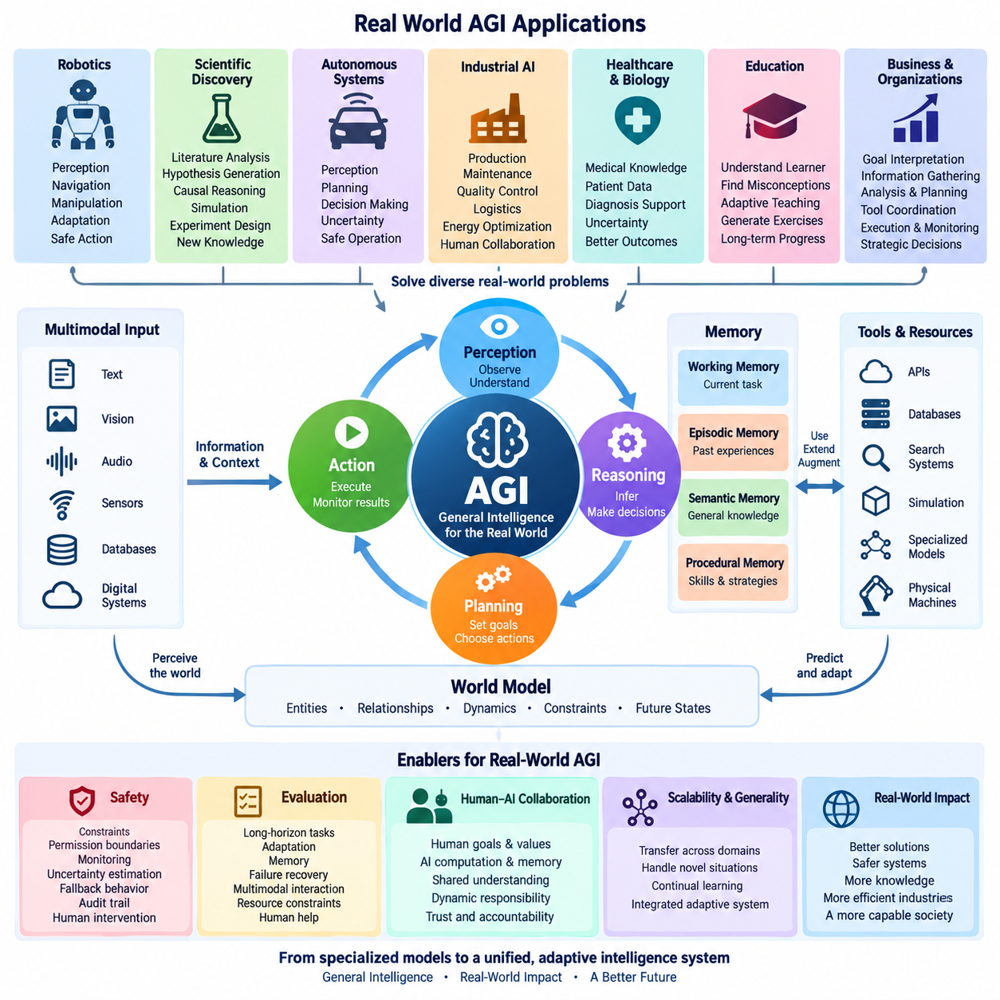
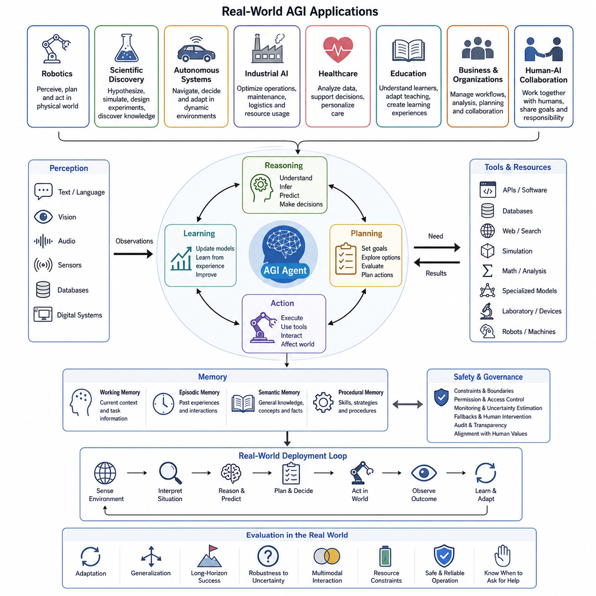
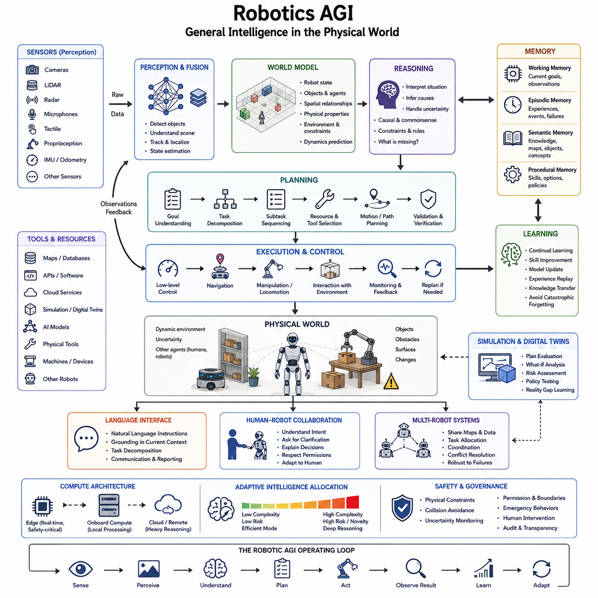
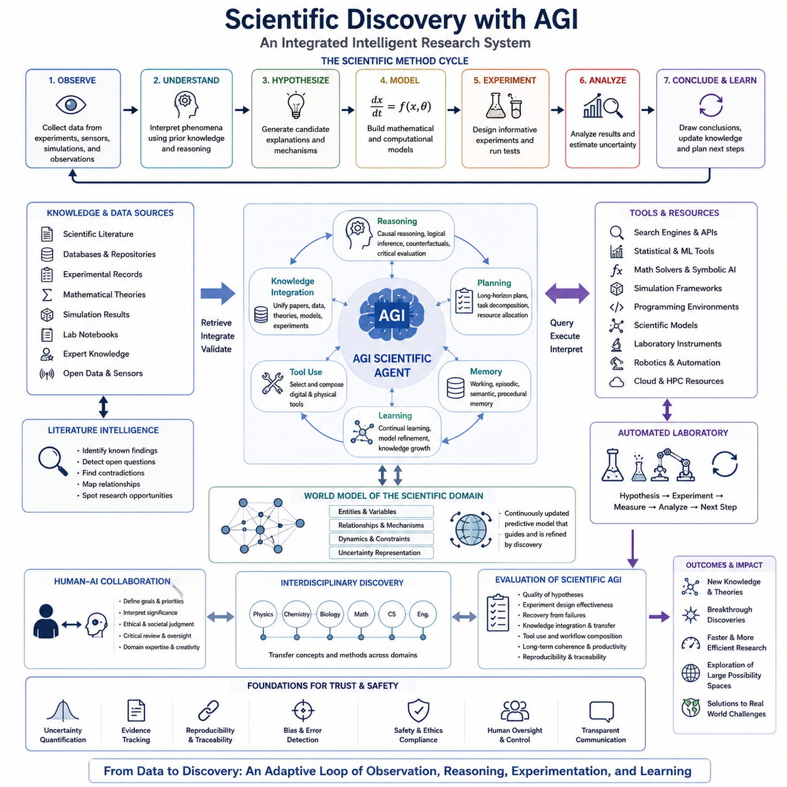
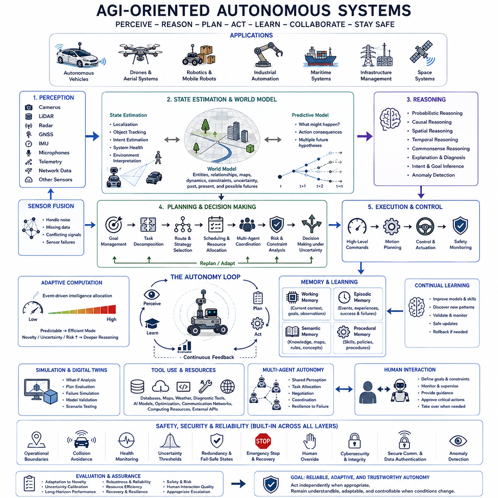
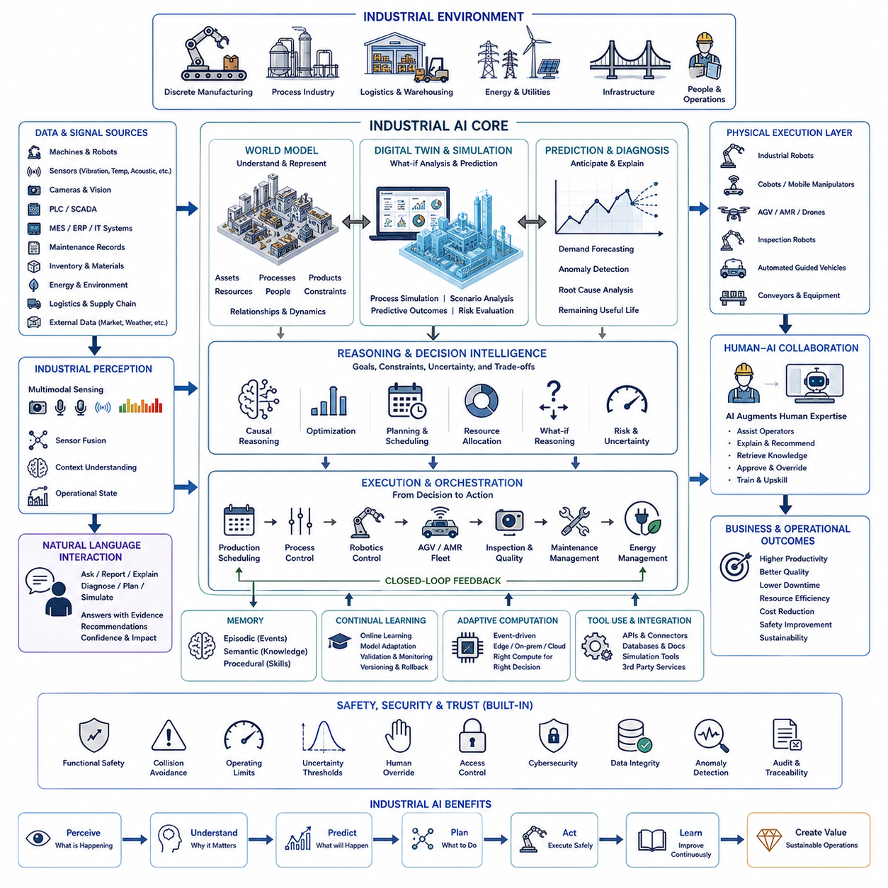
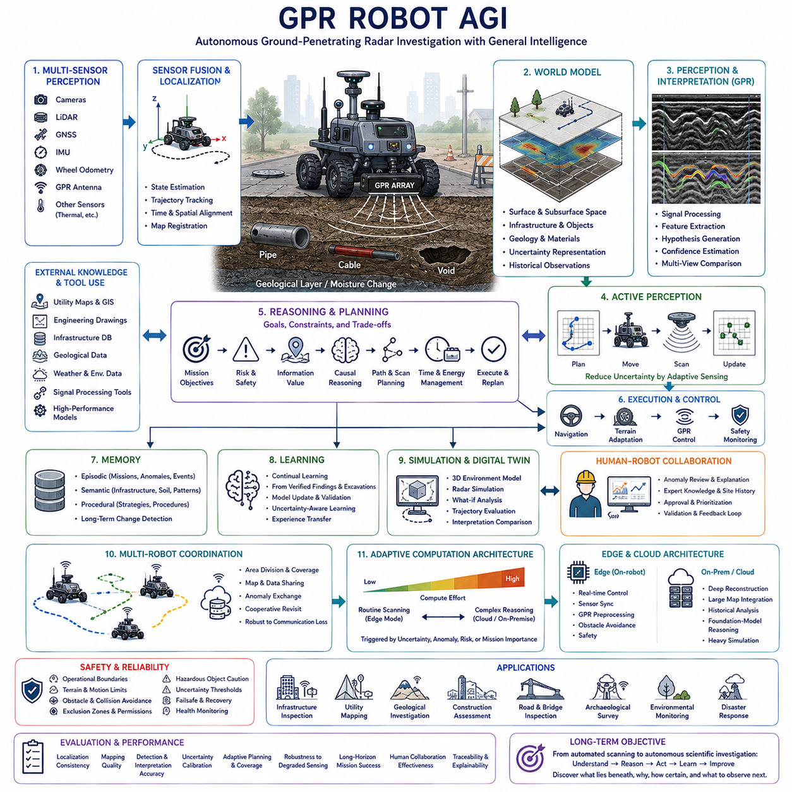
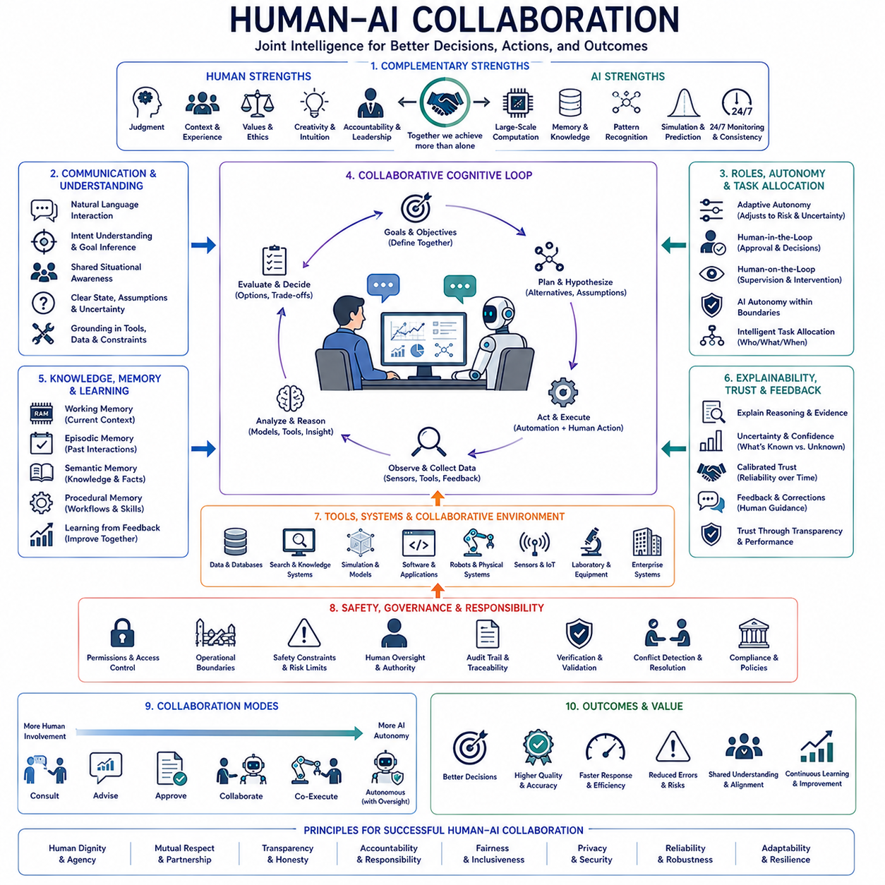

**Volume 47. Artificial General Intelligence**

# Chapter 08. AGI in Real World

## 08.00. Applications

{width="7.268055555555556in" height="7.268055555555556in"}

{width="7.268055555555556in" height="7.268055555555556in"}

인공일반지능(Artificial General Intelligence, AGI)은 고립된 벤치마크(Benchmark)에 머무르지 않고 실제 환경에서 지능이 작동할 수 있을 때 실질적인 의미를 갖는다. 현실 세계의 AGI 응용(Application)은 변화하는 상황을 인식하고, 불완전한 정보를 해석하며, 익숙하지 않은 문제를 추론하고, 목표를 설정하고, 도구를 선택하며, 행동을 실행하고, 그 결과로부터 학습할 수 있어야 한다. 따라서 핵심은 하나의 응용 분야에서 뛰어난 성능을 보이는 것이 아니라 다양한 과제와 영역 사이에서 지식과 인지 전략(Cognitive Strategy)을 전이할 수 있는 능력이다.

일반적으로 사전에 정해진 기능에 최적화되는 기존 인공지능(Artificial Intelligence)과 달리, AGI 지향 응용 시스템은 개발 단계에서 완전히 정의되지 않았던 과제도 처리할 수 있어야 한다. 배치된 시스템은 새로운 객체, 예상하지 못한 지시, 익숙하지 않은 환경, 상충하는 목표 또는 누락된 정보를 만날 수 있다. 따라서 어떤 알고리즘, 지식원, 도구 또는 행동이 적절한지를 결정하기 전에 현재 상황이 무엇을 의미하는지 스스로 판단해야 하며, 과제 해석(Task Interpretation) 자체가 지능적 행동의 일부가 된다.

현실 세계의 AGI는 지속적인 인식--추론--계획--행동 루프(Perception--Reasoning--Planning--Action Loop)로 이해할 수 있다. 언어, 시각, 음향, 센서, 데이터베이스(Database), 디지털 시스템에서 얻은 다중모달 관측(Multimodal Observation)은 현재 상황에 대한 내부 표현(Internal Representation)으로 변환된다. 기억(Memory)은 관련된 과거 경험을 제공하고, 추론(Reasoning)은 관계와 결과를 평가하며, 계획(Planning)은 가능한 행동 순서를 구성하고, 제어(Control)는 선택된 행동을 실행하면서 현실이 예상대로 전개되는지를 지속적으로 확인한다.

이러한 응용은 월드 모델(World Model)에 크게 의존한다. 지능형 에이전트(Intelligent Agent)는 현재 관측을 인식하는 것만으로는 충분하지 않으며, 객체, 관계, 동역학(Dynamics), 제약 조건 및 가능한 미래 상태를 설명하는 내부 모델이 필요하다. 행동 이후 환경이 어떻게 변화할지를 예측함으로써 시스템은 실제 행동을 수행하기 전에 여러 대안을 평가할 수 있다. 이후 예측 오류(Prediction Error)를 이용해 내부 모델을 갱신함으로써 인식, 예측, 행동, 학습이 서로를 지속적으로 개선하는 폐루프(Closed Loop)를 형성할 수 있다.

기억(Memory)은 서로 단절된 지능적 응답을 지속적인 지능적 행동으로 전환한다. 작업 기억(Working Memory)은 현재 과제와 관련된 정보를 유지하고, 일화 기억(Episodic Memory)은 이전 상호작용과 경험을 보존하며, 의미 기억(Semantic Memory)은 일반적인 지식을 체계화하고, 절차 기억(Procedural Memory)은 재사용 가능한 전략이나 기술을 표현한다. 검색 메커니즘(Retrieval Mechanism)은 새로운 문제가 과거 경험과 유사할 때 유용한 맥락을 재구성하며, 지속 학습(Continual Learning)은 전체 시스템을 다시 학습하지 않고도 중요한 경험이 미래 행동에 영향을 미치도록 한다.

현실 세계의 응용에는 유연한 도구 사용(Tool Use)도 필요하다. AGI 시스템이 가능한 모든 능력을 내부에 직접 포함할 필요는 없다. 대신 외부 자원이 필요한 상황을 인식하고 소프트웨어 API, 데이터베이스, 검색 시스템, 시뮬레이션 환경, 수학적 도구, 전문 모델, 실험 장비 또는 물리적 기계와 상호작용할 수 있다. 따라서 도구 선택은 에이전트가 현재 부족한 능력이 무엇인지 판단하고 이용 가능한 외부 자원을 통해 자신의 능력을 어떻게 확장할 것인지를 결정하는 추론 문제(Reasoning Problem)가 된다.

로보틱스(Robotics)는 지능이 물리적 세계와 직접 연결되기 때문에 이러한 원리를 가장 명확하게 보여주는 분야 중 하나이다. 범용 능력을 가진 로봇은 지속적으로 변화하는 조건에 대응하면서 인식, 위치 추정(Localization), 공간 추론(Spatial Reasoning), 조작 또는 이동, 계획, 예측, 제어를 통합해야 한다. 한 환경에서 획득한 지식은 다른 환경에 대한 적응을 지원해야 하며, 고수준 명령(High-Level Instruction)은 궁극적으로 불확실성 아래에서 안전한 물리적 행동의 연속으로 변환되어야 한다.

과학적 발견(Scientific Discovery)은 또 다른 중요한 응용 영역이다. AGI 지향 과학 시스템은 문헌 분석, 가설 생성(Hypothesis Formation), 인과 추론(Causal Reasoning), 수학적 모델링, 시뮬레이션, 실험 설계, 데이터 해석 및 반복적 개선을 하나의 인지 워크플로(Cognitive Workflow) 안에서 연결할 수 있다. 단순히 과거 데이터로부터 값을 예측하는 것을 넘어 설명되지 않은 관측을 발견하고, 후보 메커니즘을 제안하고, 대안을 검증하며, 증거가 예상과 일치하지 않을 경우 가설을 수정함으로써 발견 과정 자체에 참여할 수 있다.

공학 응용(Engineering Application) 역시 여러 전문 영역을 넘나드는 지능을 필요로 한다. 복잡한 기계를 설계하려면 기계 구조, 전자 시스템, 소프트웨어, 제어 이론, 제조 제약, 비용, 신뢰성, 안전 및 유지보수를 함께 고려해야 한다. 범용 시스템은 서로 상호작용하는 이러한 요소를 공통 표현(Shared Representation)으로 유지하고, 서브시스템(Subsystem) 결정 사이의 충돌을 탐지하며, 대체 아키텍처(Alternative Architecture)를 탐색하고, 전문 분석 도구를 실행하며, 특정 설계 절충안(Design Trade-off)이 전체 시스템 목표를 만족하는 이유를 설명할 수 있다.

산업 환경(Industrial Environment)은 이러한 요구를 개별 과제에서 상호 연결된 운영 전체로 확장한다. AGI는 운영 목표에 대한 공통 이해를 기반으로 생산 계획, 검사, 유지보수, 물류, 품질 관리, 에너지 최적화 및 인간과의 협업을 조정할 수 있다. 장비가 고장 나거나 공급 조건이 변경될 경우 단순히 사전에 정의된 대응을 실행하는 것이 아니라 상황을 진단하고, 후속 영향을 평가하고, 계획을 재구성하며, 관련 지식을 검색하고, 복구 전략(Recovery Strategy)을 제안할 수 있다.

자율 시스템(Autonomous System)은 의사결정을 지속적으로 그리고 불확실한 상황에서 수행해야 하므로 특히 까다로운 응용 환경을 제공한다. 차량, 드론, 이동 로봇, 인프라 시스템 및 자율 시설은 일상적인 조건과 더 깊은 연산이 필요한 사건을 구분해야 한다. 계층적 지능(Hierarchical Intelligence)은 안정적인 상황에서는 효율적인 예측 처리를 사용하면서 불확실성, 신규성(Novelty), 위험 또는 환경 변화가 증가할 경우 더욱 집중적인 인식, 추론, 시뮬레이션 또는 재계획(Replanning)을 활성화하는 방식으로 계산 자원을 동적으로 배분할 수 있다.

의료 및 생물학적 응용(Healthcare and Biological Application)은 맥락적 추론(Contextual Reasoning)과 인간 감독(Human Oversight)의 중요성을 보여준다. 범용 지능은 의료 문헌, 환자 이력, 의료 영상, 검사 측정값, 치료 지침 및 장기간의 관측 정보를 통합하여 의료 전문가를 지원할 수 있다. 목표는 제한 없는 자율 진단이 아니라 이질적인 증거를 체계화하고, 불확실성을 식별하고, 대안적 설명을 생성하고, 관련 지식을 검색하며, 자격을 갖춘 전문가가 평가할 수 있는 형태로 추론 결과를 전달하는 것이다.

교육(Education)은 각각의 학습자가 지속적으로 변화하는 인지 환경(Cognitive Environment)을 구성한다는 점에서 또 다른 형태의 일반화(Generalization)를 요구한다. AGI 기반 교육 시스템은 학습자가 무엇을 이해하고 있는지 추정하고, 오개념(Misconception)을 발견하며, 설명 방식을 조정하고, 연습 문제를 생성하고, 다양한 교육 전략을 비교하며, 장기적인 학습 진행 모델을 유지할 수 있다. 효과적인 튜터링(Tutoring)은 단순히 질문에 정확하게 답하는 것을 넘어 학습자가 왜 혼란을 겪는지 추론하고 어떤 경험의 순서가 이해도를 가장 효과적으로 높일지를 판단해야 한다.

비즈니스 및 조직 응용(Business and Organizational Application)은 개별적인 보조 시스템에서 장기간의 워크플로를 관리할 수 있는 에이전트(Agent)로 발전할 수 있다. 이러한 시스템은 목표를 해석하고, 정보를 수집하고, 대안을 분석하고, 문서와 소프트웨어 도구를 조정하고, 사람과 의사소통하고, 실행 과정을 모니터링하며, 상황 변화에 따라 계획을 수정할 수 있다. 실제 조직의 업무는 하나의 고정된 파이프라인을 따르는 경우가 드물며 재무, 엔지니어링, 조달, 운영, 커뮤니케이션, 규제 및 전략적 의사결정을 빈번하게 넘나들기 때문에 범용성(Generality)이 중요한 가치를 갖는다.

따라서 인간--AI 협업(Human--AI Collaboration)은 실용적인 AGI에서 계속 핵심적인 위치를 차지할 가능성이 높다. 인간은 목표, 가치, 사회적 이해, 책임, 도메인 판단 및 권한을 제공하며, 인공지능 시스템은 연산, 기억, 시뮬레이션, 검색, 패턴 인식 및 지속적인 모니터링 능력을 제공한다. 효과적인 협업을 위해 AGI는 외부 문제뿐 아니라 인간 협력자의 의도, 불확실성, 권한 및 기대까지 표현해야 하며, 이를 통해 상황 변화에 따라 인간과 AI 사이의 책임을 동적으로 조정할 수 있다.

실제 환경에 배치(Deployment)되는 것은 지능 평가(Intelligence Evaluation)의 의미도 변화시킨다. 정적인 시험에서 높은 성능을 보이는 시스템이라도 관측에 잡음이 존재하거나, 지시가 모호하거나, 도구를 사용할 수 없거나, 환경이 변화하거나, 행동이 되돌릴 수 없는 결과를 가져오는 상황에서는 실패할 수 있다. 따라서 실용적인 AGI는 적응, 기억, 실패 복구, 다중모달 상호작용, 자원 제약, 불확실성 관리 및 독립적인 행동을 중단하고 인간의 도움을 요청해야 하는 시점을 판단하는 능력을 포함하는 장기 과제(Long-Horizon Task)를 통해 평가되어야 한다.

자율성이 증가할수록 안전(Safety)은 응용 아키텍처(Application Architecture)와 분리할 수 없는 요소가 된다. 현실 세계의 에이전트에는 행동 제약, 권한 경계(Permission Boundary), 모니터링, 불확실성 추정, 폴백 행동(Fallback Behavior), 감사 기록(Audit Trail) 및 인간 개입 메커니즘이 필요하다. 더 강력한 추론 능력이 이러한 요구를 제거하는 것이 아니라 범용 에이전트가 예상하지 못한 전략을 발견할 수 있기 때문에 오히려 중요성을 증가시킨다. 따라서 안전은 최종 출력 필터가 아니라 인식, 계획, 도구 사용, 실행, 학습 및 시스템 수준의 거버넌스(Governance) 전체에서 작동해야 한다.

AGI 응용이 갖는 더 넓은 의미는 인공지능을 전문화된 모델들의 집합으로 보는 관점에서 통합된 적응형 시스템(Integrated Adaptive System)으로 보는 관점으로의 전환에 있다. 로보틱스, 과학적 발견, 자율 시스템, 산업 인공지능(Industrial AI), 인간--AI 협업은 동일한 기본 지능 메커니즘을 서로 다른 환경에서 검증할 수 있는 영역이다. 이러한 구성은 응용 개요(Application Overview)를 이후의 로보틱스 AGI(Robotics AGI), 과학적 발견, 자율 시스템, 산업 AI, 전문 로봇 시스템 및 인간--AI 협업이라는 현실 세계의 세부 주제로 자연스럽게 연결한다.

## 08.01. Robotics AGI

{width="7.268055555555556in" height="7.268055555555556in"}

로보틱스 AGI(Robotics AGI)는 현실 세계를 인식하고, 추론하고, 학습하고, 계획하며, 행동하는 체화 시스템(Embodied System)과 범용 지능(General Intelligence)의 통합을 의미한다. 좁게 정의된 특정 작업을 중심으로 설계된 기존 로봇과 달리 AGI 지향 로봇은 익숙하지 않은 객체, 환경, 명령 및 사건에 대응할 수 있어야 한다. 또한 실제 운용 환경이 개발이나 학습 과정에서 경험한 조건과 크게 달라지더라도 지능의 유용성을 유지해야 한다.

체화(Embodiment)는 범용 지능에 요구되는 조건을 근본적으로 변화시킨다. 소프트웨어 에이전트(Software Agent)는 비교적 낮은 비용으로 작업을 다시 시도하거나 추가 정보를 확인할 수 있지만, 물리적 로봇은 실수가 장비를 손상시키거나 사람에게 피해를 주거나 되돌릴 수 없는 상태를 만들 수 있는 환경에서 행동한다. 따라서 로보틱스 AGI는 인지적 유연성(Cognitive Flexibility)을 실시간 제약, 물리적 실행 가능성, 불확실성 인식 및 지속적으로 적용되는 안전 경계(Safety Boundary)와 결합해야 한다.

인식(Perception)은 로봇을 외부 세계와 연결한다. 카메라, 라이다(LiDAR), 레이더(Radar), 마이크, 촉각 센서(Tactile Sensor), 고유수용감각(Proprioception), 관성 측정 및 기타 센싱 모달리티(Sensing Modality)는 서로 다른 공간적, 시간적, 의미적 특성을 가진 관측 정보를 생성한다. 범용 능력을 가진 로봇은 이러한 신호를 융합하여 개별 센서가 무엇을 감지했는지를 넘어 주변에 어떤 객체, 에이전트, 표면, 사건 및 관계가 존재하는지를 설명하는 표현을 구성해야 한다.

이러한 표현은 즉각적인 인식을 넘어 지속적인 월드 모델(World Model)로 확장되어야 한다. 로봇은 자신의 상태뿐 아니라 주변 객체의 상태, 객체 사이의 관계, 관련 물리적 특성, 환경 제약 및 가능한 미래 변화를 추정해야 한다. 월드 모델을 이용하면 아직 발생하지 않은 상황을 추론하고, 후보 행동의 결과를 예측하며, 일반적인 환경 변화와 추가적인 주의 또는 재계획(Replanning)이 필요한 사건을 구분할 수 있다.

로봇의 의사결정은 궁극적으로 물리적으로 실행 가능한 궤적과 행동으로 변환되어야 하기 때문에 공간 지능(Spatial Intelligence)이 특히 중요하다. 시스템은 자유 공간, 장애물, 주행 가능성(Traversability), 도달 가능성(Reachability), 객체 형상, 상대 위치 및 동적 움직임을 이해해야 한다. 따라서 "컨테이너를 작업대로 가져가라"와 같은 고수준 개념은 로봇과 환경의 제약 안에서 내비게이션, 조작, 이동 및 제어 시스템이 실행할 수 있는 공간적 목표로 구체화되어야 한다.

추론(Reasoning)은 인식과 월드 지식을 로봇의 목표와 연결한다. 익숙하지 않은 상황을 만났을 때 로봇은 무엇이 변화했는지 추론하고, 가능한 원인을 파악하고, 어떤 정보가 부족한지를 판단하며, 여러 대응 방법을 비교해야 할 수 있다. 이는 단순한 패턴 인식(Pattern Recognition)을 넘어서는 능력이다. 범용 로봇 지능은 상황에 따라 학습된 표현, 확률적 추론(Probabilistic Inference), 인과 추론(Causal Reasoning), 상식 지식(Common-Sense Knowledge) 및 명시적 제약을 적절하게 결합함으로써 더 효과적으로 작동할 수 있다.

계획(Planning)은 이러한 상황 해석을 즉각적인 제어 결정에서 장기 목표까지 이어지는 일련의 행동으로 변환한다. 로봇은 하나의 명령을 여러 하위 작업으로 분해하고, 작업 간 의존성을 설정하고, 자원을 확보하고, 도구를 선택하고, 장소 사이를 이동하고, 객체를 조작하고, 중간 결과를 검증하며, 실패로부터 복구해야 할 수 있다. 계층적 계획(Hierarchical Planning)은 전략적 의사결정과 빠른 제어를 분리하면서도 인지 수준과 물리적 수준 사이의 정보 교환을 유지하도록 한다.

실행(Execution)은 추상적인 계획과 현실 사이의 간극을 연결한다. 논리적으로 올바른 계획이라도 객체가 이동했거나, 표면이 미끄럽거나, 위치 추정(Localization) 성능이 저하되었거나, 다른 에이전트가 경로를 막거나, 물리적 상호작용이 예측과 다르게 발생하면 실패할 수 있다. 따라서 로보틱스 AGI는 계획을 고정된 스크립트가 아니라 적응 가능한 가설(Adaptive Hypothesis)로 취급하고, 예상 결과와 실제 관측 결과를 지속적으로 비교하여 차이가 운용상 중요해질 경우 행동을 수정해야 한다.

기억(Memory)은 로봇이 모든 상황을 매번 새로운 문제처럼 처리하지 않고 여러 임무에 걸쳐 경험을 축적할 수 있도록 한다. 작업 기억(Working Memory)은 현재 목표와 관측을 유지하고, 일화 기억(Episodic Memory)은 이전 상호작용과 실패를 기록하며, 의미 기억(Semantic Memory)은 일반화된 환경 지식을 저장하고, 절차 기억(Procedural Memory)은 재사용 가능한 기술을 보존한다. 이러한 기억 시스템은 유사한 상황이 다시 나타났을 때 관련 정보를 검색하면서 과거 경험이 미래의 의사결정에 영향을 미치도록 한다.

지속 학습(Continual Learning)은 이러한 과정을 확장하여 배치(Deployment) 이후에도 로봇의 능력이 발전할 수 있도록 한다. 새로운 환경에서는 이전에 보지 못한 배치 구조, 객체, 행동, 운영 절차 및 실패 유형이 나타날 수 있다. 고급 로봇 시스템은 주기적인 오프라인 재학습(Offline Retraining)에만 의존하는 대신 가치 있는 경험을 식별하고, 검증된 지식을 통합하며, 표현을 개선하고, 선택된 기술을 향상시키면서 기존에 획득한 능력을 파괴적인 간섭이나 통제되지 않은 행동 변화로부터 보호해야 한다.

도구 사용(Tool Use)은 로보틱스에서 특히 광범위한 의미를 갖는데, 도구가 디지털 형태와 물리적 형태 모두로 존재할 수 있기 때문이다. 로보틱스 AGI는 지도, 데이터베이스, 매뉴얼, 진단 소프트웨어, 클라우드 서비스, 시뮬레이션 시스템 또는 전문 AI 모델을 조회하면서 동시에 물리적 도구, 매니퓰레이터(Manipulator), 센서 또는 기계를 선택할 수 있다. 따라서 범용 지능에는 현재 능력의 부족을 인식하고 다른 소프트웨어 서비스, 장치, 로봇 또는 인간이 작업 완료에 필요한 능력을 제공할 수 있는지를 판단하는 능력이 포함된다.

언어(Language)는 인간의 의도와 로봇의 행동을 연결하는 강력한 인터페이스(Interface)를 제공한다. 자연어 명령(Natural-Language Instruction)을 이용하면 모든 움직임을 명시적으로 프로그래밍하지 않고도 목표를 지정할 수 있지만, 언어는 궁극적으로 로봇이 현재 존재하는 환경과 연결되어야 한다. "손상된 장비를 검사하고 위험한 것이 있으면 보고하라"와 같은 명령은 실행 가능한 행동이 되기 전에 객체 식별, 공간 해석, 과제 분해, 위험 평가, 탐색, 관측, 기억 및 의사소통을 필요로 한다.

인간--로봇 협업(Human--Robot Collaboration)은 사람들이 모든 가정을 명시적으로 전달하지 않기 때문에 추가적인 추론 능력을 요구한다. 인간과 함께 작업하는 로봇은 언어, 제스처, 맥락, 작업 이력 및 환경 상태를 통해 인간의 의도를 추론하면서 그러한 해석에 존재하는 불확실성도 인식해야 한다. 범용 능력을 가진 시스템은 필요한 경우 명확한 설명을 요청하고, 중요한 결정을 설명하며, 권한과 허가의 경계를 준수하고, 인간 협력자의 능력과 기대에 따라 행동을 조정해야 한다.

다중 로봇 환경(Multi-Robot Environment)은 하나의 체화 에이전트에서 분산된 물리적 시스템으로 지능의 범위를 확장한다. 로봇들은 독립적인 로컬 인식(Local Perception)과 제어를 유지하면서 관측 정보, 지도, 작업, 발견된 정보 및 선택된 지식을 공유할 수 있다. 이러한 시스템에서 범용 지능은 통신 제약 아래의 협조, 책임 할당, 충돌 해결, 동기화 및 일부 로봇이 고장 나거나 사용할 수 없게 되었을 때의 적응을 요구하며, 로보틱스 AGI와 보다 광범위한 다중 에이전트 지능(Multi-Agent Intelligence)을 연결한다.

시뮬레이션(Simulation)과 디지털 트윈(Digital Twin)은 현실 세계에서 행동을 실행하기 전에 로봇의 추론을 지원할 수 있다. 후보 계획은 예상되는 형상, 동역학, 교통 상황, 자원 소비 또는 상호작용 결과를 기준으로 평가될 수 있다. 시뮬레이션이 현실을 완벽하게 대체할 수는 없지만 에이전트가 내부적으로 여러 대안을 탐색하는 정신적 시뮬레이션(Mental Simulation)의 메커니즘을 제공한다. 이후 시뮬레이션 예측과 실제 결과의 차이를 이용하여 모델과 미래 의사결정을 개선할 수 있다.

로봇 지능은 서로 다른 시간 척도(Time Scale)에서 작동하기 때문에 컴퓨팅 아키텍처(Compute Architecture)는 중요한 현실적 제약이 된다. 저수준 제어는 밀리초 단위의 결정론적 응답을 요구할 수 있고, 인식은 영상이나 센서 주기로 작동하는 반면 의미적 추론과 장기 계획은 상대적으로 느린 주기를 허용할 수 있다. 따라서 로보틱스 AGI는 엣지 프로세서(Edge Processor)가 안전 핵심 작업을 유지하고, 지연 시간과 연결 조건이 허용될 경우 더욱 강력한 로컬 또는 원격 자원이 계산 집약적인 추론을 수행하는 계층적 컴퓨팅(Hierarchical Computing)을 활용할 수 있다.

효율적인 연산은 지능 자원의 적응적 할당(Adaptive Allocation of Intelligence)도 필요로 한다. 예측 가능하고 위험도가 낮은 환경을 이동하는 로봇이 모든 고비용 추론 과정을 지속적으로 활성화할 필요는 없다. 안정적인 관측은 효율적인 인식과 예측으로 처리하고, 신규성(Novelty), 불확실성, 위험 요소, 상충하는 정보 또는 예측 오류가 증가하면 더욱 깊은 분석을 활성화할 수 있다. 이러한 사건 민감형 아키텍처(Event-Sensitive Architecture)는 제한된 연산 및 에너지 자원을 추가적인 지능이 가장 큰 운용 가치를 제공하는 상황에 집중할 수 있도록 한다.

안전(Safety)은 로봇의 전체 인지 루프(Cognitive Loop)에서 지속적으로 작동해야 한다. 물리적 제약, 충돌 회피, 속도 제한, 운용 경계, 불확실성 임계값, 권한 시스템, 비상 행동 및 인간 개입 메커니즘은 행동 실행 전과 실행 중에 로봇의 행동을 제한해야 한다. 로봇이 더욱 범용적으로 발전할수록 가능한 모든 행동을 사전에 열거하는 것은 현실적으로 어려워지므로 런타임 모니터링(Runtime Monitoring)과 계층적 안전 아키텍처(Layered Safety Architecture)가 로보틱스 AGI의 핵심 구성 요소가 된다.

로보틱스 AGI(Robotics AGI)의 장기적인 목표는 단순히 더 많은 사전 정의 기술을 수행할 수 있는 로봇을 만드는 것이 아니다. 궁극적인 목표는 익숙하지 않은 상황을 이해하고, 서로 다른 과제 사이에서 지식을 전이하며, 계획을 생성하고 수정하고, 경험으로부터 학습하고, 인간 및 기계와 협력하면서 열린 세계(Open World)에서 안전하게 행동할 수 있는 체화 에이전트(Embodied Agent)를 만드는 것이다. 따라서 로보틱스는 인공지능이 전문화된 능력에서 진정한 범용 적응 지능(General Adaptive Intelligence)으로 발전했는지를 검증하는 가장 강력한 현실 세계의 시험 환경 중 하나이다.

## 08.02. Scientific Discovery

{width="7.268055555555556in" height="7.268055555555556in"}

과학적 발견(Scientific Discovery)은 과학적 진보가 하나의 인지 능력에만 의존하는 경우가 드물다는 점에서 인공일반지능(Artificial General Intelligence, AGI)이 적용되기에 자연스러운 영역이다. 연구자는 현상을 관찰하고, 증거를 해석하고, 기존 지식을 검색하고, 가설을 수립하고, 모델을 구축하고, 실험을 설계하고, 결과를 분석하며, 설명을 수정해야 한다. AGI 지향 과학 시스템은 이러한 활동을 독립적인 AI 작업으로 처리하기보다 지속적인 추론 및 학습 과정으로 통합할 수 있다.

기존의 과학 인공지능(Scientific AI)은 단백질 구조 예측, 분자 특성 추정, 이미지 분류, 방정식 발견 또는 문헌 검색과 같이 좁게 정의된 문제에 특화되는 경우가 많다. 과학적 AGI(Scientific AGI)는 문제 사이에서 개념과 추론 전략을 전이함으로써 이러한 전문화를 넘어설 수 있다. 새로운 문제가 이전 문제와 어떤 점에서 유사한지 인식하고, 어떤 방법을 적용할 수 있는지 판단하며, 기존 가정이 이용 가능한 증거를 더 이상 설명하지 못할 경우 접근 방법을 수정할 수 있어야 한다.

과학 지식(Scientific Knowledge)은 논문, 데이터베이스(Database), 실험 기록, 수학적 이론, 시뮬레이션 결과, 연구 노트 및 전문가 경험에 분산되어 있다. 범용 능력을 가진 과학 에이전트(Scientific Agent)는 이러한 이질적인 정보원을 일관된 표현으로 통합해야 한다. 검색(Retrieval)만으로는 충분하지 않은데, 검색된 정보가 서로 충돌하거나 서로 다른 가정에 의존하거나 특정 조건에서만 적용될 수 있기 때문이다. 따라서 시스템은 정보원 사이의 관계를 평가하고 증거, 가설, 모델 및 해석을 구분해야 한다.

문헌 이해(Literature Understanding)는 단순한 검색 기능을 넘어 발견 과정의 능동적인 구성 요소가 된다. 과학적 AGI는 방대한 연구 자료에서 확립된 발견, 해결되지 않은 질문, 상충하는 결과, 방법론적 한계 및 아직 탐구되지 않은 관계를 식별할 수 있다. 일반적으로 서로 분리되어 있는 학문 분야의 개념을 연결함으로써 키워드 검색이나 개별 문서 분석만으로는 발견하기 어려운 후보 연구 방향(Candidate Research Direction)을 생성할 수 있다.

가설 생성(Hypothesis Generation)은 축적된 지식을 검증 가능한 설명으로 변환한다. 기존 모델로 충분히 설명할 수 없는 관측이 주어졌을 때 AGI 시스템은 하나의 해석에 즉시 고정되는 대신 여러 후보 메커니즘(Candidate Mechanism)을 제안할 수 있다. 각 가설은 예상되는 결과, 관련 변수, 가정 및 가설을 지지하거나 반박할 수 있는 관측을 명시해야 한다. 이를 통해 과학적 추론은 단순히 그럴듯한 문장을 자유롭게 생성하는 과정이 아니라 여러 대안적 설명 사이의 구조화된 경쟁 과정이 된다.

인과 추론(Causal Reasoning)은 예측과 설명이 동일하지 않기 때문에 특히 중요하다. 통계적 관계는 결과를 예측할 수 있지만 어떤 개입(Intervention)이 결과를 변화시키는지는 설명하지 못할 수 있다. 따라서 과학적 AGI는 상관관계와 인과관계를 구분하고, 잠재적 교란 변수(Confounding Variable)를 추론하고, 경쟁하는 인과 구조를 비교하며, 개입의 결과를 평가해야 한다. 반사실적 추론(Counterfactual Reasoning)을 통해 다른 조건이었다면 어떤 일이 발생했을지를 검토함으로써 표면적인 연관성을 넘어 메커니즘에 대한 깊은 이해를 지원할 수 있다.

수학적 모델링(Mathematical Modeling)은 가설을 정밀하게 표현하는 언어를 제공한다. 과학 에이전트는 방정식을 구성하고, 매개변수를 추정하고, 불확실성을 분석하고, 모델로부터 결과를 도출하며, 모델이 실제 관측과 일치하는지를 판단해야 할 수 있다. 복잡한 영역에서는 기호 수학(Symbolic Mathematics)을 신경망 표현(Neural Representation) 및 수치적 방법(Numerical Method)과 결합함으로써 해석 가능한 이론적 구조와 분석적으로 표현하기 어려운 고차원 패턴 사이를 연결할 수 있다.

시뮬레이션(Simulation)은 직접적인 실험이 비싸거나, 느리거나, 위험하거나, 현실적으로 수행하기 어려운 환경으로 추론의 범위를 확장한다. 후보 가설을 계산 모델(Computational Model)로 구현하고 실제 물리 실험을 수행하기 전에 다양한 조건에서 평가할 수 있다. 과학적 AGI는 시뮬레이션을 일종의 정신적 실험(Mental Experimentation)으로 활용하여 예측 결과를 비교하고, 민감한 변수를 식별하고, 경계 조건을 탐색하며, 어떤 불확실성이 경쟁 가설의 설명력에 가장 큰 영향을 주는지를 판단할 수 있다.

실험 설계(Experiment Design)는 이론적 불확실성을 유용한 관측으로 변환한다. 지능형 과학 시스템은 단순히 더 많은 데이터를 수집하는 것이 아니라 경쟁하는 가설을 가장 효과적으로 구별할 수 있는 실험이 무엇인지를 결정해야 한다. 이를 위해 예상 정보 이득(Expected Information Gain), 측정 정확도, 사용 가능한 장비, 비용, 시간, 안전 및 실험적 제약을 고려해야 한다. 따라서 실험은 불확실성을 줄이기 위해 관측을 의도적으로 선택하는 능동적 의사결정 문제(Active Decision-Making Problem)가 된다.

과학적 지능은 하나의 모델을 넘어 다양한 자원을 활용해야 하기 때문에 도구 사용(Tool Use)이 필수적이다. AGI 연구 시스템은 데이터베이스, 검색 엔진, 통계 패키지, 수학적 솔버(Mathematical Solver), 시뮬레이션 프레임워크, 프로그래밍 환경, 전문 과학 모델, 실험 장비 및 로봇 자동화 시스템과 상호작용할 수 있다. 범용 능력은 각각의 도구가 무엇을 수행할 수 있는지를 이해하고, 적절한 자원을 선택하고, 여러 도구를 하나의 워크플로(Workflow)로 구성하며, 그 결과를 전체 과학 문제의 맥락에서 해석하는 능력에서 부분적으로 형성된다.

자동화 실험실(Automated Laboratory)은 과학적 추론을 물리적 실험과 직접 연결할 수 있다. 과학 에이전트는 가설을 생성하고, 실험을 설계하고, 로봇 장비를 설정하고, 측정값을 수집하고, 결과를 분석하며, 다음 실험을 결정하는 과정을 폐루프 발견 과정(Closed Discovery Loop)으로 수행할 수 있다. 인간 연구자는 목표와 중요한 의사결정을 감독하고, 자동화 시스템은 반복적이거나 대량 처리가 필요한 절차를 실행함으로써 훨씬 넓은 실험 공간을 체계적으로 탐색할 수 있다.

월드 모델(World Model)은 이러한 발견 과정에 통합된 표현을 제공한다. AGI 시스템은 과학적 사실을 서로 단절된 문장으로 저장하는 대신 연구 대상 시스템의 객체, 변수, 관계, 동역학(Dynamics), 제약, 메커니즘 및 불확실성을 지속적으로 변화하는 하나의 모델로 표현할 수 있다. 새로운 증거는 이러한 내부 표현을 수정하고, 모델에서 생성된 예측은 이후의 관측과 실험을 안내한다. 따라서 과학 지식은 정적인 정보 저장소가 아니라 능동적으로 갱신되는 예측 구조(Predictive Structure)로 기능한다.

기억(Memory)은 과학적 AGI가 장기간의 연구 프로그램에서 연속성을 유지할 수 있도록 한다. 작업 기억(Working Memory)은 현재의 추론 맥락을 유지하고, 일화 기억(Episodic Memory)은 이전 실험과 실패한 접근 방법을 기록하며, 의미 기억(Semantic Memory)은 일반화된 과학 지식을 저장하고, 절차 기억(Procedural Memory)은 재사용 가능한 분석 및 실험 방법을 보존한다. 실패를 기억하는 것은 특히 중요한데, 실패한 실험 역시 가설을 제거하거나 숨겨진 제약을 발견하거나 이미 효과가 없다고 밝혀진 접근 방법을 반복하는 것을 방지할 수 있기 때문이다.

중요한 과학적 발견은 장기간에 걸쳐 수행되는 수백 개의 상호 의존적인 단계를 포함할 수 있으므로 장기 계획(Long-Horizon Planning)이 필요하다. 시스템은 새로운 증거가 나타남에 따라 중간 계획을 조정하면서도 전체 연구 목표를 유지해야 한다. 광범위한 질문을 하위 문제로 분해하고, 실험의 우선순위를 결정하고, 계산 및 실험실 자원을 할당하고, 협력자를 조정하며, 축적된 증거를 기반으로 기존 연구 방향을 계속 유지하는 것이 타당한지를 주기적으로 재검토해야 할 수 있다.

불확실성(Uncertainty)은 이러한 전체 과정에서 명시적으로 표현되어야 한다. 과학적 결론이 모두 동일한 수준의 신뢰도를 갖는 것은 아니며, 측정값, 모델, 가정 및 외부 지식에는 서로 다른 형태의 불확실성이 존재한다. AGI 시스템은 무엇을 알고 있는지, 무엇을 추정하고 있는지, 무엇이 아직 알려지지 않았는지, 그리고 어떤 결론이 불확실한 가정에 크게 의존하는지를 전달해야 한다. 보정된 불확실성(Calibrated Uncertainty)은 추가 실험이 필요한 시점과 자율적인 진행보다 인간 전문가의 검토가 우선되어야 하는 시점을 판단하는 데에도 도움을 준다.

과학적 AGI는 서로 다른 분야의 표현을 연결함으로써 학제간 발견(Interdisciplinary Discovery)을 지원할 수도 있다. 생물학의 문제를 해결하기 위해 화학, 물리학, 통계학, 컴퓨터 과학 또는 공학의 개념이 필요할 수 있으며, 재료 연구에서는 양자 모델(Quantum Model)과 제조 제약을 연결해야 할 수도 있다. 범용 지능은 여러 학문 분야에서 구조적으로 유사한 문제를 탐색하고 유용한 방법을 전이하면서도 표면적으로 유사한 문제가 반드시 동일한 메커니즘을 따른다고 가정하지 않아야 한다.

과학적 발견에는 중요성, 윤리, 허용 가능한 증거, 연구 우선순위 및 사회적 결과에 대한 판단이 포함되기 때문에 인간--AI 협업(Human--AI Collaboration)은 여전히 핵심적이다. AGI는 연구자가 탐색할 수 있는 가설, 계산, 시뮬레이션 및 실험의 범위를 확대할 수 있으며, 인간은 목표, 비판적 해석, 책임 및 도메인 전문지식(Domain Expertise)을 제공한다. 효과적인 시스템은 연구자가 생성된 답변을 단순히 받아들이는 것이 아니라 결론에 이의를 제기하고 검증할 수 있도록 근거와 불확실성을 명확하게 제시해야 한다.

따라서 과학적 AGI의 평가(Evaluation)는 최종 예측이 정확한지만을 측정해서는 안 된다. 유능한 시스템은 의미 있는 가설을 생성하고, 정보 가치가 높은 실험을 설계하고, 잘못된 가정으로부터 복구하고, 새로운 증거를 통합하고, 영역 사이에서 지식을 전이하고, 도구를 적절하게 사용하며, 장기간의 연구 프로그램에서 일관된 추론을 유지해야 한다. 또한 과학적 주장은 그것이 도출된 데이터, 가정, 계산 및 실험과 연결되어야 하므로 재현성(Reproducibility)과 추적 가능성(Traceability) 역시 중요하다.

과학적 발견 AGI(Scientific Discovery AGI)의 궁극적인 가능성은 AI가 고립된 분석 도구로 사용되는 단계에서 과학적 방법(Scientific Method)에 통합된 참여자로 발전하는 데 있다. 이러한 시스템은 관측, 지식, 가설, 인과 추론, 모델링, 시뮬레이션, 실험, 평가 및 학습을 하나의 적응형 루프(Adaptive Loop)로 연결할 수 있다. 그 가치는 단순히 더 빠르게 답을 생성하는 것이 아니라 증거, 불확실성, 검증 및 인간 감독을 유지하면서 인간이 훨씬 더 넓은 과학적 가능성 공간(Scientific Possibility Space)을 탐색할 수 있도록 지원하는 데 있다.

## 08.03. Autonomous Systems

{width="7.268055555555556in" height="7.268055555555556in"}

자율 시스템(Autonomous Systems)은 환경을 인식하고, 의사결정을 내리며, 인간의 직접적인 개입을 제한적으로 받으면서 행동을 실행할 수 있는 기계 또는 소프트웨어 제어 플랫폼을 의미한다. 인공일반지능(Artificial General Intelligence, AGI)의 맥락에서 자율성은 사전에 정의된 규칙을 따르는 수준을 넘어선다. AGI 지향 자율 시스템은 익숙하지 않은 상황을 해석하고, 목표를 구성하고, 불확실성 아래에서 추론하고, 계획을 조정하고, 경험으로부터 학습하며, 독립적인 운용이 더 이상 적절하지 않은 시점을 인식할 수 있어야 한다.

기존의 자율 시스템(Autonomous Systems)은 일반적으로 특정 운용 영역과 신중하게 정의된 조건을 중심으로 설계된다. 자율주행차, 드론, 이동 로봇, 산업 기계 및 인프라 제어 시스템은 정교한 기능을 수행할 수 있지만 개발 과정에서 설정된 가정에 의존하는 경우가 많다. 범용 자율성(General Autonomy)은 현실 환경에 예상하지 못한 객체, 불완전한 정보, 변화하는 목표, 장비 고장, 새로운 사건 및 사전에 모두 예측할 수 없는 상호작용이 존재하기 때문에 더욱 폭넓은 능력을 요구한다.

인식(Perception)은 관측 정보를 환경에 대한 유용한 표현으로 변환함으로써 자율 운용의 첫 번째 계층을 형성한다. 카메라, 라이다(LiDAR), 레이더(Radar), 위성항법시스템(GNSS), 관성 센서, 마이크, 텔레메트리(Telemetry), 네트워크 데이터 및 기타 정보원이 서로 다른 정보를 제공할 수 있다. 시스템은 잡음, 누락된 측정값, 상충하는 신호 및 센서 고장을 고려하면서 이러한 관측을 융합하고, 외부 환경과 자신의 운용 상태 모두에 대한 추정치를 생성해야 한다.

월드 모델(World Model)은 현재 상태를 인식하는 것에서 더 나아가 환경이 앞으로 어떻게 변화할 수 있는지를 이해하도록 인식 능력을 확장한다. 월드 모델은 객체, 관계, 공간 구조, 동역학(Dynamics), 제약, 불확실성 및 가능한 미래 상태를 표현한다. 후보 행동의 결과를 예측함으로써 자율 시스템은 실행 전에 여러 대안을 비교할 수 있다. 이후 예측 결과와 실제 관측 결과의 차이를 이용하여 예상하지 못한 변화를 발견하고 모델 갱신, 추가적인 인식 또는 재계획(Replanning)을 활성화할 수 있다.

자율 시스템은 완전한 환경을 직접 관측할 수 없는 경우가 많기 때문에 상태 추정(State Estimation)이 특히 중요하다. 시스템은 시간에 따라 축적되는 부분적인 관측으로부터 숨겨져 있거나 불확실한 상태를 추론해야 한다. 위치 추정(Localization), 객체 추적, 의도 추정(Intent Estimation), 시스템 상태 모니터링 및 환경 해석은 모두 이러한 내부 상태 구성에 기여한다. 신뢰도 추정(Confidence Estimation)을 유지하면 시스템은 신뢰할 수 있는 지식과 추가 관측 또는 신중한 행동이 필요한 가정을 구분할 수 있다.

추론(Reasoning)은 즉각적인 인식만으로 해결할 수 없는 상황을 자율 시스템이 해석할 수 있도록 한다. 시스템은 경로가 왜 위험해졌는지, 비정상적인 관측이 센서 오류인지 실제 위험 요소인지, 또는 특정 고장이 임무 목표에 어떤 영향을 미치는지를 판단해야 할 수 있다. 확률적, 인과적, 공간적, 시간적 및 상식적 추론(Common-Sense Reasoning)을 결합하면 시스템은 단순히 관측 결과를 사전에 정의된 반응과 연결하는 것을 넘어 설명을 생성하고 대응 방법을 평가할 수 있다.

계획(Planning)은 목표와 환경에 대한 이해를 실행 가능한 전략으로 변환한다. 복잡한 임무에는 작업 분해(Task Decomposition), 경로 선택, 자원 할당, 일정 계획, 다른 에이전트와의 상호작용 및 비상 상황에 대한 대비가 필요할 수 있다. 계층적 계획(Hierarchical Planning)은 장기적인 임무 목표와 단기적인 이동 및 제어 결정을 분리할 수 있다. 그러나 계획 과정에서 사용된 가정은 환경, 시스템 상태 또는 임무 우선순위가 변화함에 따라 유효하지 않게 될 수 있으므로 계획은 지속적으로 수정 가능해야 한다.

예측(Prediction)은 안전한 자율성의 핵심 요소인데, 행동은 현재 관측되는 상황뿐 아니라 다음에 어떤 일이 발생할 것으로 예상되는지에 따라 결정되는 경우가 많기 때문이다. 자율주행차는 주변 교통의 움직임을 예측하고, 로봇은 인간의 이동을 추정하며, 드론은 바람의 영향을 예상하고, 산업 시스템은 장비 상태를 예측한다. AGI 지향 자율성은 여러 가능한 미래를 동시에 고려하고 자신의 행동이 이러한 미래에 어떤 영향을 줄 수 있는지를 추론하는 방향으로 이러한 능력을 확장한다.

불확실성 아래의 의사결정(Decision-Making under Uncertainty)은 서로 충돌할 수 있는 여러 목표 사이에서 균형을 유지해야 한다. 임무 진행은 안전, 에너지 소비, 시간, 장비 마모, 정보 품질 및 운용 제약과 절충되어야 하는 경우가 많다. 강건한 자율 시스템(Robust Autonomous System)은 단순히 가장 높은 예측 보상을 제공하는 행동만 선택하는 것이 아니라 특히 사람이나 안전 핵심 인프라 주변에서 운용될 경우 신뢰도, 위험, 가역성(Reversibility) 및 최악의 결과까지 고려해야 한다.

실행(Execution)은 숙고형 지능(Deliberative Intelligence)을 실시간 제어(Real-Time Control)와 연결한다. 고수준 의사결정은 수초 이상의 시간에 걸쳐 생성될 수 있지만 안정화, 충돌 회피, 액추에이터 제어 및 비상 대응은 밀리초 단위의 반응을 요구할 수 있다. 따라서 실용적인 아키텍처는 서로 다른 계산 시간 척도를 분리하면서도 이들 사이의 협조를 유지해야 한다. 빠른 안전 핵심 제어기는 고수준 추론이 지연되거나 사용할 수 없거나 임무를 다시 검토하는 동안에도 계속 작동할 수 있어야 한다.

적응형 연산(Adaptive Computation)은 이러한 아키텍처를 더욱 효율적으로 만들 수 있다. 예측 가능한 운용 상황에서는 시스템이 주로 경량 인식, 상태 추정, 예측 및 제어에 의존할 수 있다. 반면 신규성(Novelty), 불확실성, 예측 오류, 위험 또는 임무 복잡성이 증가하면 더욱 높은 비용의 추론, 시뮬레이션 또는 재계획을 활성화할 수 있다. 이러한 사건 기반 지능 할당(Event-Driven Intelligence Allocation)은 불필요한 연산을 줄이면서 더 깊은 인지 처리가 높은 가치를 제공하는 상황에 계산 자원을 집중시킨다.

기억(Memory)은 개별 임무뿐 아니라 장기적인 운용 전반에서 연속성을 제공한다. 작업 기억(Working Memory)은 현재 목표와 관련 관측을 유지하고, 일화 기억(Episodic Memory)은 이전 사건과 실패를 기록하며, 의미 기억(Semantic Memory)은 일반화된 환경 지식을 보존하고, 절차 기억(Procedural Memory)은 재사용 가능한 기술과 정책을 저장한다. 자율 시스템은 유사한 과거 경험을 검색함으로써 동일한 실수를 반복하는 것을 방지하고 기존 전략을 새롭지만 관련성이 있는 상황에 적응시킬 수 있다.

학습(Learning)은 자율성이 배치(Deployment) 이후에도 고정된 상태로 머무르지 않고 향상될 수 있도록 한다. 실제 경험은 학습 데이터에 존재하지 않았던 새로운 환경 패턴, 고장 유형, 인간 행동 또는 운용 제약을 드러낼 수 있다. 지속 학습(Continual Learning)은 특정 모델과 기술을 갱신할 수 있지만 통제되지 않은 적응은 새로운 위험을 발생시킬 수도 있다. 따라서 학습 메커니즘에는 검증, 모니터링, 롤백(Rollback) 기능 및 운용 중 변경할 수 있는 구성 요소의 범위를 정의하는 경계가 필요하다.

시뮬레이션(Simulation)과 디지털 트윈(Digital Twin)은 자율 시스템이 물리적인 결과를 즉시 감수하지 않고도 행동을 평가할 수 있는 환경을 제공한다. 후보 궤적, 임무 계획, 고장 대응 또는 자원 운용 전략을 실제 실행 전에 예상 동역학을 기반으로 검증할 수 있다. 가상 상황 분석(What-If Analysis)을 통해 여러 미래를 비교할 수 있으며, 시뮬레이션 결과와 현실 결과 사이의 차이는 모델의 한계를 발견하고 이후의 예측 능력을 개선하는 데 활용할 수 있다.

도구 사용(Tool Use)은 자율성을 에이전트 내부에 구현된 능력 이상으로 확장한다. 자율 시스템은 지도, 데이터베이스, 기상 정보, 진단 도구, 전문 AI 모델, 통신 네트워크, 최적화 소프트웨어 또는 외부 컴퓨팅 자원에 접근할 수 있다. 또한 물리적 장비나 다른 로봇과 협조할 수도 있다. 범용 지능은 외부 능력이 필요한 시점을 인식하고 그 결과의 관련성과 신뢰성을 검증해야 하는 책임을 유지하면서 외부 자원을 자신의 의사결정 과정에 통합하는 능력을 포함한다.

다중 에이전트 자율성(Multi-Agent Autonomy)은 여러 상호작용 시스템에 의사결정이 분산되기 때문에 또 다른 수준의 복잡성을 발생시킨다. 자율주행차, 로봇 플릿(Robot Fleet), 드론 및 인프라 에이전트는 관측 정보를 공유하고, 작업을 협상하고, 경로를 조정하고, 책임을 재분배할 수 있다. 통신은 지연되거나 사용할 수 없을 수 있으므로 각 에이전트는 가능한 경우 공유 정보를 활용하면서도 충분한 로컬 자율성(Local Autonomy)을 유지해야 한다. 따라서 협조에는 협력뿐 아니라 부분적인 시스템 고장에 대한 복원력도 필요하다.

고도로 발전된 자율 시스템에서도 인간 상호작용(Human Interaction)은 여전히 필수적이다. 인간은 목표, 운용 권한, 윤리적 제약 및 허용 가능한 위험 수준을 정의하고, 자율 에이전트는 기계 속도로 지속적인 인식과 의사결정을 수행한다. 효과적인 시스템은 자신의 의도, 불확실성, 한계 및 비정상 상태를 명확하게 전달해야 한다. 또한 중단 없는 자율성을 성공의 주요 척도로 간주하기보다 상황이 자신의 능력을 초과할 경우 인간의 지원을 요청할 수 있어야 한다.

안전(Safety)은 의사결정 이후에 추가되는 기능이 아니라 전체 자율 아키텍처에 통합되어야 한다. 운용 경계, 충돌 방지, 상태 모니터링, 불확실성 임계값, 중복 센싱(Redundant Sensing), 페일세이프 상태(Fail-Safe State), 비상 정지 및 인간의 강제 개입 메커니즘은 여러 계층의 보호를 제공한다. 자율성이 더욱 범용화될수록 적응형 시스템이 열린 환경에서 경험할 수 있는 모든 상황을 사전에 열거하는 것이 불가능하기 때문에 런타임 보증(Runtime Assurance)의 중요성이 더욱 커진다.

사이버보안(Cybersecurity)과 시스템 무결성(System Integrity) 역시 자율 행동이 신뢰할 수 있는 정보와 제어 채널에 의존하기 때문에 기본적인 요소가 된다. 조작된 센서 데이터, 침해된 통신, 허가되지 않은 명령, 손상된 지도 또는 악성 소프트웨어는 추론 시스템 자체가 정상적으로 작동하더라도 의사결정을 변화시킬 수 있다. 따라서 안전한 신원 확인, 접근 제어, 데이터 인증, 이상 탐지(Anomaly Detection), 보호된 업데이트 및 성능 저하 상태 운용 전략(Degraded-Operation Strategy)이 실용적인 자율 지능의 기반을 구성한다.

AGI 지향 자율 시스템의 평가(Evaluation)는 사전에 정의된 시나리오의 성공 여부를 측정하는 수준을 넘어야 한다. 시스템은 신규 상황에 대한 적응, 장기 신뢰성, 고장 복구, 성능이 저하된 센서에 대한 강건성, 불확실성 보정(Uncertainty Calibration), 자원 효율성, 안전한 인간 상호작용 및 적절한 인간 감독 전환 능력에 대해 평가되어야 한다. 또한 여러 예상하지 못한 사건이 동시에 발생했을 때도 시스템이 일관된 목표와 안전 제약을 유지하는지를 검증해야 한다.

따라서 AGI 기반 자율 시스템(AGI-Based Autonomous Systems)으로의 발전은 사전에 정의된 행동을 자동화하는 단계에서 불확실한 현실 세계의 상황을 적응적으로 관리하는 단계로의 전환을 의미한다. 인식, 월드 모델링(World Modeling), 추론, 예측, 계획, 기억, 학습, 제어, 시뮬레이션, 협업 및 안전은 하나의 통합된 루프(Integrated Loop)로 작동해야 한다. 궁극적인 목표는 인간이 없는 자율성이 아니라 적절한 상황에서는 독립적으로 행동하면서도 조건이 변화할 때 신뢰할 수 있고, 이해 가능하며, 적응 가능하고, 인간이 통제할 수 있는 시스템을 구현하는 것이다.

## 08.04. Industrial AI

{width="7.268055555555556in" height="7.268055555555556in"}

산업 인공지능(Industrial AI)은 점점 더 범용화되는 형태의 인공지능을 공장, 물류 네트워크, 에너지 시스템, 인프라 및 기타 복잡한 운영 환경에 적용한다. 사전에 정의된 기능을 수행하는 개별 자동화(Isolated Automation)와 달리 AGI 지향 산업 인공지능은 기계, 공정, 자재, 사람, 일정 및 비즈니스 목표 사이의 관계를 이해해야 한다. 그 목적은 각각의 구성 요소를 독립적으로 최적화하는 것이 아니라 이러한 요소들을 하나의 적응형 운영 시스템(Adaptive Operational System)으로 통합하고 조정하는 것이다.

현대의 산업 환경(Industrial Environment)은 기계, 로봇, 카메라, 센서, 프로그램 가능 논리 제어기(Programmable Logic Controller, PLC), 제조 실행 시스템(Manufacturing Execution System, MES), 기업 시스템, 유지보수 기록 및 공급 네트워크에서 지속적인 정보 흐름을 생성한다. 산업 지능(Industrial Intelligence)은 이러한 이질적인 신호를 일관된 운영 상태(Operational State)로 변환해야 한다. 이를 위해 물리적 측정값과 생산 맥락을 결합하여 현재 무엇이 발생하고 있는지를 넘어 특정 관측이 왜 중요한지까지 이해해야 한다.

산업 인식(Industrial Perception)은 기존의 시각 검사(Visual Inspection)를 넘어선다. 여기에는 장비 상태, 자재 흐름, 작업자 활동, 환경 조건, 생산 진행 상황, 재고 상태, 에너지 소비 및 물류 이동이 포함된다. 다중모달 센서 융합(Multimodal Sensor Fusion)은 이미지, 진동, 온도, 음향 신호, 전기적 측정값, 위치 데이터 및 기계 텔레메트리(Machine Telemetry)를 결합하여 하나의 센서 모달리티만으로는 충분히 이해하기 어려운 공정에 대해 더욱 풍부한 표현을 생성할 수 있다.

월드 모델(World Model)은 이러한 관측을 서로 연결하는 데 필요한 내부 구조를 제공한다. 월드 모델은 기계, 제품, 자원, 작업자, 로봇, 생산 단계, 공간적 관계, 공정 의존성, 운영 제약 및 시스템 동역학(System Dynamics)을 표현할 수 있다. 현재 상태와 예측된 미래 상태를 함께 유지함으로써 산업 인공지능은 장비 고장, 생산 지연, 자재 부족, 품질 문제 또는 수요 변화가 상호 연결된 운영 시스템 전체에 어떻게 전파될 수 있는지를 추정할 수 있다.

디지털 트윈(Digital Twin)은 물리적 자산을 지속적으로 갱신되는 계산적 표현(Computational Representation)과 연결함으로써 이러한 월드 모델을 확장한다. 디지털 트윈은 서로 다른 조건에서 장비의 동작, 생산 흐름, 자원 활용 또는 전체 시설을 시뮬레이션할 수 있다. AGI 지향 시스템은 이러한 모델을 가상 상황 추론(What-If Reasoning)에 활용하여 실제 운영을 변경하기 전에 가능한 개입 방법을 비교하고, 시뮬레이션 예측과 실제 산업 현장에서 관측된 결과의 차이로부터 학습할 수 있다.

예지 정비(Predictive Maintenance)는 산업 지능이 단순한 관측에서 미래를 예상하는 단계로 발전하는 방식을 보여준다. 장비가 고장 난 이후에만 정비하거나 고정된 일정에 따라 정비하는 대신 AI는 운용 이력과 센서 패턴을 분석하여 장비의 열화(Degradation)와 잔여 유효 수명(Remaining Useful Life, RUL)을 추정할 수 있다. 더욱 범용적인 시스템은 정비 시점이 생산 능력, 예비 부품, 작업 인력의 가용성, 후속 공정 및 운영 위험에 어떤 영향을 미치는지를 함께 추론한 후 적절한 개입 방법을 제안할 수 있다.

품질 관리(Quality Management) 역시 결함 탐지(Defect Detection)에서 인과적 이해(Causal Understanding)로 발전한다. 컴퓨터 비전(Computer Vision)은 표면 결함이나 치수 이상을 식별할 수 있지만, 산업 인공지능은 이러한 관측을 기계 설정값, 자재 배치(Material Batch), 환경 조건, 공정 이력 및 이전 고장과 연결해야 한다. 이러한 관계를 종합적으로 추론함으로써 단순히 불량 제품을 정상 제품과 분리하는 것을 넘어 가능한 근본 원인(Root Cause)을 파악하고 공정 조정 방법을 제안할 수 있다.

생산 계획(Production Planning)은 다양한 시간 척도와 제약 조건을 동시에 고려하는 추론을 필요로 한다. 고객 수요, 기계 가용성, 자재 공급, 인력, 에너지 가격, 유지보수 시간, 물류 용량 및 납품 기한이 모두 일정 계획에 영향을 미칠 수 있다. 지능형 산업 시스템은 상황 변화에 따라 생산 계획을 지속적으로 수정하고, 최초 일정이 실행 과정 전체에서 계속 최적이라고 가정하는 대신 개별 설비의 효율성과 시스템 수준 목표(System-Level Objective) 사이의 균형을 조정할 수 있다.

산업용 로보틱스(Industrial Robotics)는 이러한 의사결정의 물리적 실행 계층(Physical Execution Layer)을 제공한다. 고정형 매니퓰레이터(Fixed Manipulator), 자율이동로봇(Autonomous Mobile Robot, AMR), 무인운반차(Automated Guided Vehicle, AGV), 드론, 검사 로봇 및 이동형 매니퓰레이터(Mobile Manipulator)는 운송, 조립, 검사, 유지보수 및 자재 취급 작업을 수행할 수 있다. 산업 AGI는 운영 목표를 실제 작업으로 변환하고 물리적 환경 변화에 따라 작업 할당과 이동 경로를 조정함으로써 이러한 이질적인 로봇 시스템을 통합적으로 관리할 수 있다.

다중 로봇 및 플릿 지능(Multi-Robot and Fleet Intelligence)은 많은 자율 기계가 동일한 시설에서 함께 운용될 때 중요해진다. 로봇들은 지도 정보를 공유하고, 교통 흐름을 협상하고, 작업량을 분배하고, 조작 작업을 협조하며, 혼잡이나 고장에 공동으로 대응해야 할 수 있다. 중앙집중식 최적화(Centralized Optimization)는 전체적인 협조를 제공할 수 있으며, 분산 지능(Distributed Intelligence)은 통신이 지연되거나 사용할 수 없는 상황에서도 개별 로봇이 운용을 유지하도록 함으로써 더욱 높은 복원력을 가진 산업 자율성(Industrial Autonomy)을 형성한다.

산업 환경은 자동화된 공정과 인간의 전문지식, 책임 및 물리적 작업이 함께 존재하기 때문에 인간--AI 협업(Human--AI Collaboration)은 여전히 필수적이다. AI 시스템은 이상 상태를 식별하고, 가능한 원인을 설명하고, 복구 절차를 제안하며, 관련 기술 지식을 검색함으로써 작업자를 지원할 수 있다. 인간은 상황적 판단과 중요한 행동에 대한 승인을 제공할 수 있다. 따라서 효과적인 인터페이스는 시스템 상태, 권고 사항, 신뢰도 및 예상되는 결과를 명확하게 전달해야 한다.

자연어 상호작용(Natural-Language Interaction)은 복잡한 산업 시스템의 접근성을 높일 수 있다. 엔지니어는 생산 처리량이 감소한 이유, 어떤 기계가 지연에 가장 큰 영향을 미쳤는지 또는 생산 라인을 유지보수를 위해 중단하면 어떤 일이 발생하는지를 질문할 수 있다. AGI 지향 시스템은 이러한 질문을 데이터 검색, 인과 분석(Causal Analysis), 시뮬레이션 및 계획 작업으로 변환한 후 현재의 운영 맥락에 근거한 설명을 제공할 수 있다.

기억(Memory)은 산업 인공지능이 조직과 운영의 경험을 축적할 수 있도록 한다. 일화 기억(Episodic Memory)은 비정상적인 사건, 유지보수 개입, 생산 중단 및 복구 행동을 보존할 수 있다. 의미 기억(Semantic Memory)은 장비 사양, 공정 지식, 운영 절차 및 역사적 관계를 체계화할 수 있으며, 절차 기억(Procedural Memory)은 재사용 가능한 진단 및 복구 전략을 유지할 수 있다. 이를 통해 과거의 산업 경험을 미래 의사결정에 영향을 미치는 지식으로 전환할 수 있다.

지속 학습(Continual Learning)은 공장이 변화함에 따라 시스템이 적응할 수 있도록 한다. 장비가 교체되고, 제품이 변경되고, 공정이 수정되며, 센서 특성이 드리프트(Drift)하고, 새로운 운용 조건이 등장할 수 있다. 산업 인공지능은 학습된 가정이 더 이상 현실과 일치하지 않는 시점을 탐지하고 중요 운영을 불안정하게 만들지 않으면서 적절한 모델을 갱신해야 한다. 따라서 검증, 통제된 배치(Controlled Deployment), 버전 관리 및 롤백(Rollback) 메커니즘은 산업 학습 아키텍처의 중요한 부분이 된다.

산업 시스템은 적응형 연산(Adaptive Computation)을 통해서도 이점을 얻을 수 있다. 안정적인 생산 조건에서는 효율적인 모니터링, 예측 및 일상적인 제어만 필요할 수 있지만 이상 상태, 예상하지 못한 상호작용, 안전 위험 또는 큰 예측 오류가 발생하면 더욱 깊은 추론과 시뮬레이션을 활성화할 수 있다. 이러한 사건 민감형 연산(Event-Sensitive Computation)을 이용하면 엣지 시스템(Edge System)이 빠른 운영 응답을 유지하면서 필요할 경우 더욱 강력한 온프레미스(On-Premise) 또는 원격 컴퓨팅 자원이 복잡한 분석을 수행할 수 있다.

엣지 컴퓨팅(Edge Computing)은 지연 시간, 신뢰성, 대역폭, 개인정보 보호 또는 안전 문제로 인해 원격 인프라에 지속적으로 의존할 수 없는 환경에서 특히 중요하다. 인식, 모션 제어, 충돌 회피, 장비 모니터링 및 비상 기능은 로컬에서 유지되어야 할 수 있다. 온프레미스 서버(On-Premise Server)는 플릿 최적화, 디지털 트윈 시뮬레이션, 모델 관리 및 광범위한 추론을 수행할 수 있으며, 클라우드 자원(Cloud Resources)은 연결성과 정책이 허용하는 경우 대규모 학습 및 비실시간 분석을 지원할 수 있다.

공급망 지능(Supply-Chain Intelligence)은 산업 인공지능의 범위를 개별 공장 외부로 확장한다. 자재, 공급업체, 창고, 운송 네트워크, 생산 시설 및 고객은 하나의 조직에서 발생한 문제가 다른 영역으로 전파될 수 있는 상호 연결된 시스템을 구성한다. AGI 지향 추론은 운영 데이터와 외부 정보를 결합하여 취약성을 식별하고, 대체 공급업체나 운송 경로를 평가하고, 후속 영향을 추정하며, 예상했던 자원을 사용할 수 없게 되었을 때 계획을 재구성할 수 있다.

에너지 관리(Energy Management)는 또 다른 시스템 수준의 응용 분야이다. 산업 시설은 생산 요구사항과 전력 소비, 배터리 저장, 재생에너지 발전, 열적 조건 및 변동 가능한 에너지 가격 사이의 균형을 유지해야 한다. 지능형 시스템은 생산 목표를 유지하면서 장비 일정과 에너지 집약적인 공정을 조정할 수 있다. 이와 유사한 추론은 비용과 지속가능성에 영향을 미치는 물, 압축 공기, 자재 및 기타 자원의 관리에도 확장될 수 있다.

지능형 의사결정이 궁극적으로 물리적 장비와 사람에게 영향을 미치기 때문에 안전(Safety)은 산업 인공지능의 모든 계층을 제한해야 한다. 충돌 회피, 안전 운용 범위(Safe Operating Envelope), 장비 한계, 접근 권한, 비상 절차, 불확실성 임계값 및 인간의 강제 개입 메커니즘은 계획과 실행 과정에서 지속적으로 활성화되어야 한다. 런타임 보증(Runtime Assurance)은 제안된 행동을 독립적으로 모니터링하여 더욱 강력해지는 AI가 중요한 산업 안전 요구사항을 우회하지 못하도록 할 수 있다.

산업 장비의 연결성이 증가하면서 사이버보안(Cybersecurity) 역시 기본적인 요소가 된다. 침해된 센서, 제어기, 네트워크, 모델 또는 소프트웨어 업데이트는 지능형 자동화(Intelligent Automation)를 운영상의 위험으로 변화시킬 수 있다. 따라서 인증(Authentication), 네트워크 분할(Network Segmentation), 접근 제어, 보안 통신, 이상 탐지(Anomaly Detection), 보호된 모델 배치 및 복구 절차는 별도의 정보기술 문제가 아니라 산업 지능의 구성 요소로 고려되어야 한다.

산업 인공지능의 평가(Evaluation)는 단순한 예측 정확도나 개별 작업 성능 이상을 측정해야 한다. 중요한 평가 기준에는 생산 신뢰성, 적응성, 다운타임 감소, 품질 향상, 자원 효율성, 고장 복구, 장기 계획(Long-Horizon Planning), 안전한 인간 협업, 불확실성 관리 및 성능 저하 조건에서의 복원력이 포함된다. 또한 시스템의 권고 사항이 운영상의 증거까지 추적 가능하고 책임 있는 담당자가 이해할 수 있는지도 평가해야 한다.

따라서 산업 인공지능(Industrial AI)의 장기적인 발전 방향은 개별적인 최적화 알고리즘에서 통합 산업 지능(Integrated Industrial Intelligence)으로의 전환이다. 인식, 월드 모델, 디지털 트윈, 추론, 예측, 계획, 로보틱스, 기억, 학습, 인간 협업 및 안전이 하나의 공통된 적응형 아키텍처(Adaptive Architecture) 안에서 작동할 수 있다. 이러한 시스템은 공장과 인프라를 단순한 자동화 기계들의 집합에서 운영 변화를 이해하고, 결과를 예측하고, 자원을 재구성하며, 성능을 지속적으로 개선할 수 있는 협조된 지능형 환경(Coordinated Intelligent Environment)으로 발전시킬 수 있다.

## 08.05. GPR Robot AGI [w/Code]

{width="7.268055555555556in" height="7.268055555555556in"}

지표투과레이더 로봇 AGI(Ground-Penetrating Radar Robot AGI)는 자율 로보틱스(Autonomous Robotics), 지하 탐지(Subsurface Sensing), 공간 지능(Spatial Intelligence), 범용 추론(General Reasoning)을 결합하여 지표면의 인식만으로는 이해할 수 없는 환경을 조사한다. 사전에 정의된 스캔 경로를 따라 이동하며 레이더 측정값만 기록하는 기존 GPR 로봇과 달리 AGI 지향 시스템은 어디를 조사할지 결정하고, 불확실한 지하 증거를 해석하고, 센싱 전략을 조정하며, 지하 구조물을 지표면의 물리적 환경과 연결해야 한다.

지표투과레이더(Ground-Penetrating Radar, GPR)는 전자기파를 지하로 송신하고 지하 물질의 특성 변화에서 발생하는 반사 신호를 분석하여 정보를 제공한다. 파이프, 케이블, 공동(Void), 매설 객체, 지질층, 수분 변화 및 기타 구조물은 특징적인 반응을 생성할 수 있다. 그러나 레이더 측정은 간접적이고 모호할 수 있으므로 지능적인 해석을 위해서는 센서 관측과 해당 관측이 획득된 물리적 맥락을 함께 추론해야 한다.

로봇은 전체 운용 환경을 이해하기 위해 GPR을 보완적인 인식 시스템과 결합해야 한다. 카메라, 라이다(LiDAR), 위성항법시스템(GNSS), 관성 센서, 휠 오도메트리(Wheel Odometry), 레이더 및 잠재적으로 열화상 센서나 기타 특수 센서는 지형, 장애물, 위치 추정 및 지표면 상태에 대한 정보를 제공할 수 있다. 센서 융합(Sensor Fusion)은 이러한 관측과 GPR 측정값을 연결하여 지하 특징을 공통 공간 표현(Common Spatial Representation) 내에서 정확하게 정합할 수 있도록 한다.

지하 관측은 신뢰할 수 있는 위치와 연결될 때만 유용하기 때문에 위치 추정(Localization)의 정확성이 특히 중요하다. 로봇은 휠 슬립(Wheel Slip), 불규칙한 지형, GNSS 성능 저하, 진동 및 센서 동기화 오류를 고려하면서 자신의 이동 궤적을 추정해야 한다. 내비게이션 센서와 GPR 측정값 사이의 정확한 시간 및 공간 정렬을 통해 반복 스캔을 비교할 수 있으며, 탐지된 지하 구조물을 지도상에서 일관되게 표현할 수 있다.

월드 모델(World Model)은 시스템이 환경의 가시적인 부분과 보이지 않는 부분을 통합할 수 있도록 한다. 지표면 형상, 로봇 상태, 주행 가능성(Traversability), 알려진 인프라, 탐지된 지하 객체, 지질학적 특성, 불확실성 및 과거 관측을 하나의 통합된 공간 모델로 표현할 수 있다. 로봇은 각각의 레이더 스캔을 독립적으로 처리하는 대신 시간에 따라 증거를 축적하고 지하에 무엇이 존재하는지에 대한 가설을 점진적으로 정교화할 수 있다.

GPR 해석(GPR Interpretation)은 상당한 불확실성 아래에서의 추론을 요구한다. 서로 다른 물질이나 구조물이 유사한 레이더 패턴을 생성할 수 있으며, 토양 조성, 수분, 안테나 주파수, 깊이 및 지표면 상태가 신호 특성을 변화시킬 수 있다. 따라서 AGI 지향 로봇은 모든 이상 신호(Anomaly)를 확인된 객체로 해석해서는 안 된다. 여러 가설을 동시에 유지하고, 신뢰도를 추정하고, 서로 다른 이동 궤적에서 획득한 관측을 비교하며, 증거가 모호한 경우 추가적인 측정을 요청할 수 있어야 한다.

능동 인식(Active Perception)은 로봇을 수동적인 데이터 수집기에서 지능적인 조사자(Intelligent Investigator)로 변화시킨다. 불확실한 이상 신호가 탐지되면 시스템은 추가 관측이 필요하다고 판단하고 이에 따라 이동 궤적을 변경할 수 있다. 다른 방향에서 해당 위치를 다시 스캔하거나, 이동 속도를 낮추거나, 스캔 밀도를 높이거나, 센싱 파라미터를 조정하거나, 주변 영역을 추가로 조사할 수 있다. 따라서 이동과 센싱은 서로 독립적인 과정이 아니라 불확실성을 감소시키기 위해 협조되는 행동이 된다.

계획(Planning)은 임무 목표, 센싱 품질, 지형 접근성, 시간, 에너지 및 안전을 동시에 고려해야 한다. 균일한 조사에서는 단순한 커버리지 패턴(Coverage Pattern)만으로 충분할 수 있지만 복잡한 환경에서는 적응형 계획(Adaptive Planning)이 필요하다. 로봇은 지하 인프라가 존재할 가능성이 높은 영역을 우선적으로 조사하고, 모호한 탐지 영역을 다시 방문하고, 위험한 지형을 회피하며, 새로운 증거가 기존 미탐사 영역의 중요성을 나타낼 경우 조사 계획을 동적으로 재구성할 수 있다.

의미론적 이해(Semantic Understanding)는 기하학적 관측과 레이더 관측에 의미를 추가한다. 기반 시설 주변에서 발견된 선형 지하 특징은 개방된 지질 영역에서 발견된 유사한 신호와 다르게 해석될 수 있다. 맨홀이나 점검구, 건물, 도로 경계, 전신주, 배수 구조물 및 건설 시설과 같은 지표면 객체는 가능한 지하 시스템에 대한 맥락적 증거(Contextual Evidence)를 제공할 수 있다. 의미 정보와 GPR 관측을 결합하면 맥락적 예상을 확정적인 증거로 간주하지 않으면서도 가설의 정확도를 향상시킬 수 있다.

지하 환경은 수개월 또는 수년에 걸쳐 반복적으로 조사될 수 있기 때문에 기억(Memory)이 중요하다. 일화 기억(Episodic Memory)은 이전 임무, 비정상적인 신호, 확인된 발견 및 잘못된 해석을 보존할 수 있으며, 의미 기억(Semantic Memory)은 인프라 패턴, 토양 특성 및 센서 동작에 대한 지식을 저장할 수 있다. 장기적인 비교를 통해 지반 변형, 새롭게 형성되는 공동, 이동된 지하 설비 또는 추가 조사가 필요한 변화 등을 발견할 수 있다.

지속 학습(Continual Learning)은 현장에서 검증된 관측이 축적됨에 따라 해석 능력을 향상시킬 수 있다. 굴착, 설계 도면, 검사 결과 또는 인간 전문가가 레이더 신호가 무엇을 의미하는지 이후에 검증하면 이러한 정보는 미래 모델을 위한 가치 있는 지도 정보(Supervision)가 될 수 있다. 시스템은 원시 신호, 처리된 레이더 이미지, 환경적 맥락 및 검증된 지하 객체 사이의 관계를 점진적으로 학습하면서 학습 데이터에서 충분히 표현되지 않은 조건에 대해서는 불확실성을 유지할 수 있다.

시뮬레이션(Simulation)과 디지털 트윈(Digital Twin)은 내비게이션과 지하 추론을 모두 지원할 수 있다. 조사 지역의 디지털 표현은 지표면 지도, 인프라 기록, 이전 스캔 및 가설로 추정된 지하 구조물을 결합할 수 있다. 후보 조사 궤적은 실행 전에 평가할 수 있으며, 시뮬레이션된 레이더 응답은 여러 대안적 해석을 비교하는 데 활용할 수 있다. 예측된 관측과 실제 측정값의 차이는 잘못된 가정을 식별하고 추가 조사를 안내할 수 있다.

도구 사용(Tool Use)은 로봇의 지능을 탑재 센싱(Onboard Sensing) 이상의 범위로 확장한다. 시스템은 지하 시설 지도, 지리정보시스템(Geographic Information System, GIS), 건설 도면, 유지보수 데이터베이스, 지질 정보, 기상 기록 또는 전문 신호처리 소프트웨어에 접근할 수 있다. 또한 레이더 복원(Radar Reconstruction)이나 이상 분류를 위한 계산 집약적인 모델을 호출할 수도 있다. 범용 지능은 어떤 외부 정보가 관련성이 있는지를 판단하고 그 신뢰성을 평가한 후 월드 모델에 통합하는 능력을 포함한다.

GPR 해석에는 전문가의 판단이 필요한 경우가 많기 때문에 인간--로봇 협업(Human--Robot Collaboration)이 특히 중요하다. 로봇은 이상 신호를 강조하고, 이를 뒷받침하는 관측 정보를 표시하며, 추가 스캔이 필요한 이유를 설명하고, 불확실한 예측을 확정된 발견처럼 제시하는 대신 신뢰 수준(Confidence Level)을 전달할 수 있다. 엔지니어나 운영자는 현장 이력을 제공하고, 조사 우선순위를 승인하고, 알려진 인프라를 식별하며, 로봇의 지식을 향상시키는 해석 결과를 검증할 수 있다.

다중 로봇 운용(Multi-Robot Operation)은 넓은 지역에서 조사 속도와 센싱 다양성을 향상시킬 수 있다. 여러 로봇이 조사 영역을 분할하고, 지도를 교환하고, 이상 신호 위치를 공유하며, 재조사 작업을 협조할 수 있다. 서로 다른 플랫폼이 상호 보완적인 센서 또는 GPR 구성을 탑재하여 한 로봇의 관측 결과가 다른 로봇의 전문적인 검사를 활성화하도록 할 수도 있다. 분산 매핑(Distributed Mapping)과 작업 할당은 통신이 간헐적이거나 일부 로봇을 사용할 수 없게 되더라도 일관성을 유지해야 한다.

적응형 연산(Adaptive Computation)은 GPR 임무에서 요구되는 인지적 부하가 상황에 따라 크게 달라지기 때문에 유용하다. 예측 가능한 지형에서의 일상적인 스캔에는 비교적 효율적인 위치 추정, 센싱 및 이상 신호 선별만 필요할 수 있다. 그러나 강한 비정상 신호, 위치 추정의 불일치, 위험한 지형 또는 센서 사이의 불일치가 발생하면 더욱 심층적인 복원, 추론, 시뮬레이션 및 재계획을 활성화할 수 있다. 따라서 불확실성이나 잠재적인 임무 중요도가 증가할수록 계산 자원의 투입도 증가시킬 수 있다.

엣지 컴퓨팅(Edge Computing)은 지속적인 네트워크 연결 없이도 실시간 내비게이션, 센서 동기화, 초기 GPR 처리, 장애물 회피 및 안전 기능을 지원한다. 더욱 복잡한 복원, 대규모 지도 통합, 과거 데이터 비교 또는 파운데이션 모델 추론(Foundation-Model Reasoning)은 사용 가능한 경우 강력한 탑재 컴퓨터나 온프레미스 인프라(On-Premise Infrastructure)에서 수행할 수 있다. 원격 연산 기능을 사용할 수 없게 되더라도 기본적인 이동성과 안전 기능이 상실되지 않도록 아키텍처는 점진적 성능 저하(Graceful Degradation)를 지원해야 한다.

안전 요구사항(Safety Requirements)은 적용 환경에 따라 크게 달라진다. GPR 로봇은 도로, 건설 현장, 산업 시설, 재난 지역, 농경지 또는 위험한 지하 인프라가 존재하는 장소에서 운용될 수 있다. 시스템은 운용 경계, 지형 한계, 충돌 제약, 출입 제한 구역, 통신 상태 및 불확실성 임계값을 준수해야 한다. 잠재적으로 위험한 지하 객체가 탐지될 경우 더욱 공격적인 자율 조사를 수행하기보다는 일반적으로 운용의 신중성을 높이는 방향으로 대응해야 한다.

GPR 로봇 AGI(GPR Robot AGI)는 매설 파이프, 케이블, 배수 시스템, 기초 구조물, 공동 및 기타 지하 구조물을 탐지하고 모니터링함으로써 인프라 검사(Infrastructure Inspection)를 지원할 수 있다. 또한 지질 조사, 건설 평가, 도로 검사, 고고학적 조사, 환경 모니터링 및 재난 대응에도 활용될 수 있다. 동일한 범용 아키텍처를 여러 영역에 전이하면서 월드 지식, 센서 해석, 임무 목표 및 안전 정책을 각 응용 분야에 맞게 조정할 수 있다.

평가(Evaluation)는 단순한 이상 신호 탐지 정확도 이상을 측정해야 한다. 중요한 능력에는 위치 추정의 일관성, 매핑 품질, 불확실성 보정(Uncertainty Calibration), 적응형 조사 계획, 잘못된 해석의 감소, 성능이 저하된 센싱으로부터의 복구, 장기 임무 완수 및 인간 전문가와의 효과적인 의사소통이 포함된다. 또한 중요한 결론이 특정 측정값, 위치, 처리 단계, 맥락적 증거 및 신뢰도 추정치까지 추적 가능하다는 것을 입증해야 한다.

GPR 로봇 AGI(GPR Robot AGI)의 장기적인 목표는 지하 탐사를 자동화된 스캐닝(Automated Scanning)에서 자율적인 과학적 조사(Autonomous Scientific Investigation)로 전환하는 것이다. 인식, 위치 추정, 레이더 해석, 월드 모델링(World Modeling), 추론, 능동 센싱(Active Sensing), 계획, 기억, 학습, 시뮬레이션 및 인간 협업이 하나의 폐루프 인지 과정(Closed Cognitive Loop)을 구성한다. 로봇은 단순히 "여기에서 어떤 신호가 측정되었는가?"라고 판단하는 것을 넘어 "지하에 무엇이 존재할 가능성이 있는가?", "그 결론은 얼마나 확실한가?", 그리고 "이를 더 정확히 이해하기 위해 다음에는 어떤 관측을 수행해야 하는가?"를 지속적으로 추론하게 된다.

## 08.06. Human AI Collaboration

{width="7.268055555555556in" height="7.268055555555556in"}

인간--AI 협업(Human--AI Collaboration)은 인간과 인공지능이 서로를 완전히 대체하려 하기보다 상호 보완적인 강점을 결합하여 함께 작업하는 시스템을 의미한다. AGI의 맥락에서 협업은 과제의 복잡성, 불확실성, 위험, 이용 가능한 전문성 및 운용 조건에 따라 책임이 동적으로 이동할 수 있는 관계로 발전한다. 목표는 어느 한쪽이 단독으로 안정적으로 달성할 수 있는 수준을 넘어서는 성능을 제공하는 공동 인지 시스템(Joint Cognitive System)을 구축하는 것이다.

인간은 복잡한 환경에서 여전히 필수적인 맥락적 판단(Contextual Judgment), 사회적 이해, 가치, 책임, 직관 및 모호한 목표를 해석하는 능력을 제공한다. AI는 대규모 연산, 지속적인 기억, 빠른 정보 검색, 패턴 인식, 시뮬레이션 및 지속적인 모니터링 능력을 제공한다. 효과적인 협업은 AI가 단순히 결과를 생성하고 인간이 이를 수용하거나 거부하는 방식이 아니라 이러한 능력들이 의도적으로 조정될 때 형성된다.

공유 상황 인식(Shared Situational Awareness)은 의미 있는 협업의 기반이다. 인간과 AI가 의사결정을 조정하려면 현재 환경, 목표, 제약 조건 및 불확실성에 대해 충분히 호환되는 표현을 가지고 있어야 한다. AI가 이해하는 상황과 인간이 가정하는 상황이 서로 다르면 각각의 판단이 합리적이더라도 결정이 충돌할 수 있다. 따라서 인터페이스는 맥락 없이 결론만 제시하는 것이 아니라 관련 상태, 가정, 변화 및 아직 해결되지 않은 불확실성을 전달해야 한다.

의도 이해(Intent Understanding)는 AI 시스템이 인간의 문자 그대로의 명령을 넘어 실제로 무엇을 달성하려 하는지를 해석할 수 있도록 한다. 현실의 명령은 사람들이 공유된 맥락, 암묵적 가정, 조직의 관행 및 이전 상호작용에 의존하기 때문에 불완전한 경우가 많다. AGI 지향 협업 시스템은 언어, 작업 이력, 환경 상태 및 사용자의 행동을 연결하여 가능한 목표를 추론하면서 여러 해석이 가능할 경우에는 그 불확실성을 유지해야 한다.

자연어(Natural Language)는 사람들이 전문적인 프로그래밍 인터페이스를 배우지 않고도 목표를 표현할 수 있게 해주기 때문에 중요한 의사소통 계층을 제공한다. 그러나 효과적인 협업에는 단순한 대화 유창성 이상의 능력이 필요하다. AI는 언어를 이용 가능한 도구, 데이터, 물리적 환경, 권한 및 운용 제약과 연결해야 한다. 또한 언어적 모호성이 자동으로 행동으로 이어지지 않도록 논의, 권고, 승인 및 실행 가능한 명령을 구분할 수 있어야 한다.

기억(Memory)은 장기적인 인간--AI 관계에서 연속성을 지원한다. 작업 기억(Working Memory)은 현재 과제의 맥락을 유지하고, 일화 기억(Episodic Memory)은 이전 상호작용과 의사결정을 보존할 수 있으며, 의미 기억(Semantic Memory)은 안정적인 지식을 체계화하고, 절차 기억(Procedural Memory)은 재사용 가능한 워크플로(Workflow)를 유지한다. 적절한 기억을 통해 시스템은 반복되는 문제를 인식하고, 과거의 결정을 검색하며, 이미 확립되어 여전히 유효한 정보를 반복적으로 요청하지 않으면서 협업 관계를 발전시킬 수 있다.

협업적 추론(Collaborative Reasoning)은 불필요한 계산 세부사항으로 인간에게 부담을 주지 않으면서 유용한 중간 구조를 보여주어야 한다. AI 시스템은 권고 사항을 제시하기 전에 여러 대안을 비교하고, 가정을 식별하고, 예상 결과를 평가하거나, 불일치를 탐지할 수 있다. 이후 인간은 가정에 이의를 제기하고, 누락된 맥락을 추가하고, 우선순위를 변경하거나, 더 깊은 분석을 요청할 수 있다. 따라서 협업은 인간과 AI가 문제에 대한 변화하는 표현을 함께 수정하는 반복적인 추론 과정이 된다.

불확실성 전달(Uncertainty Communication)은 신뢰도가 인간이 AI의 권고를 어떻게 해석해야 하는지에 영향을 미치기 때문에 매우 중요하다. 시스템은 검증된 정보, 모델 기반 추정, 가정 및 아직 해결되지 않은 질문을 구분해야 한다. 불확실성이 높을 경우 추가적인 데이터 수집, 시뮬레이션, 다른 전문가와의 협의 또는 행동의 연기가 적절한 대응이 될 수 있다. 보정된 신뢰도(Calibrated Confidence)는 AI에 대한 과도한 신뢰와 유용한 자동화 지원을 불필요하게 거부하는 상황 모두를 방지하는 데 도움을 준다.

설명 가능성(Explainability)은 인간이 실제로 평가해야 하는 의사결정과 설명이 연결될 때 협업을 지원한다. 지능형 시스템은 모델 동작에 대한 일반적인 설명을 생성하는 대신 어떤 증거가 권고에 영향을 주었는지, 어떤 가정이 중요했는지, 어떤 대안을 고려했는지, 어떤 결과가 예상되는지를 설명해야 한다. 엔지니어, 운영자, 관리자, 규제 담당자 또는 최종 사용자는 서로 다른 책임을 가지고 있기 때문에 필요한 설명의 형태와 수준도 달라질 수 있다.

적응형 자율성(Adaptive Autonomy)은 인간과 AI 사이의 업무 분담이 시간과 상황에 따라 변화할 수 있도록 한다. 일상적이고 충분히 이해된 작업은 자동화 시스템에 위임할 수 있는 반면, 비정상적이고 불확실하거나 위험도가 높거나 윤리적으로 중요한 상황에는 인간의 개입을 확대할 수 있다. 시스템은 신뢰도와 운용 조건이 양호하면 자율성을 높이고, 증거가 상충하거나 환경이 검증된 조건을 벗어나면 자율성을 낮출 수 있다.

휴먼 인 더 루프(Human-in-the-Loop) 운용은 인간이 특정 의사결정이나 승인 과정에 직접 참여하도록 한다. 휴먼 온 더 루프(Human-on-the-Loop) 운용에서는 AI가 행동을 실행하고 인간이 이를 감독하면서 필요할 경우 개입한다. 더욱 자율적인 구성에서는 시스템이 명시적인 경계 내에서 독립적으로 운용하면서 예외적인 상황을 인간에게 에스컬레이션(Escalation)할 수 있다. 이러한 방식은 인간을 제거하기 위한 단순한 발전 단계가 아니라 서로 다른 과제와 위험 수준에 적합한 운용 구성으로 이해해야 한다.

작업 할당(Task Allocation) 자체도 하나의 지능적인 의사결정 문제이다. 일부 활동은 기계 연산에 더 적합한 반면 다른 활동은 인간의 판단이나 권한에 크게 의존한다. AGI 협업 시스템은 과제 요구사항을 평가하여 독립적으로 실행할지, 인간의 입력을 요청할지, 전문 도구에 위임할지 또는 여러 참여자를 조정할지를 결정할 수 있다. 효과적인 작업 할당은 능력, 업무 부하, 긴급성, 불확실성, 비용 및 실패의 결과를 함께 고려한다.

도구 사용(Tool Use)은 협업의 범위를 한 명의 인간과 하나의 AI 모델을 넘어 확장한다. AI는 검색 시스템, 데이터베이스, 시뮬레이션 도구, 소프트웨어 애플리케이션, 전문 모델, 로봇, 실험 장비 및 기업 시스템을 조정할 수 있다. 인간은 목표와 제약을 정의하고 AI는 이러한 자원을 오케스트레이션(Orchestration)할 수 있다. 결과적으로 협업 환경은 단순한 질의응답 인터페이스가 아니라 공동 목표를 중심으로 사람과 기계가 구성된 네트워크로 발전한다.

피지컬 AI(Physical AI)와 로보틱스(Robotics)는 의사소통이 현실 세계의 행동으로 직접 이어질 수 있기 때문에 협업을 더욱 어렵게 만든다. 사람과 함께 작업하는 로봇은 공간적 관계, 제스처, 움직임, 작업 역할, 안전 구역 및 변화하는 인간의 의도를 이해해야 한다. 또한 자신의 행동이 주변 사람들에게 어떤 영향을 줄 수 있는지를 예측하고, 인간 협력자가 로봇의 행동을 예상하여 안전하게 협조할 수 있을 정도로 자신의 의도된 움직임을 명확하게 전달해야 한다.

다중 에이전트 환경(Multi-Agent Environment)은 여러 인간과 인공지능 에이전트로 구성된 팀으로 협업을 확장한다. 책임은 전문성, 위치, 자원 가용성 또는 임무 상태에 따라 분산될 수 있다. AI 에이전트는 정보를 요약하고, 계획을 동기화하고, 작업을 할당하고, 충돌을 탐지할 수 있으며, 인간은 전략적 권한을 유지한다. 효과적인 협조를 위해서는 공유된 표현과 서로 다른 에이전트가 상충하는 결론에 도달했을 때 의견 차이를 해결할 수 있는 메커니즘이 필요하다.

인간 피드백으로부터의 학습(Learning from Human Feedback)은 협업 시스템이 자신의 행동을 개선할 수 있도록 한다. 수정, 시연, 선호도, 승인 및 거부된 권고 사항은 인간이 무엇을 기대하는지에 대한 정보를 제공할 수 있다. 그러나 인간의 판단도 맥락에 따라 달라지거나 오류를 포함할 수 있으므로 피드백을 항상 보편적으로 유효한 것으로 해석해서는 안 된다. 학습 메커니즘은 지역적 선호(Local Preference)와 일반적인 규칙을 구분하고 쉽게 변경해서는 안 되는 제약을 보존해야 한다.

개인화(Personalization)는 안전이나 조직의 요구사항을 약화시키지 않으면서 개별 사용자의 요구에 상호작용 방식을 조정할 경우 협업을 향상시킬 수 있다. 사람마다 선호하는 설명 수준, 자동화 수준, 정보의 세부 정도, 알림 방식 또는 상호작용 빈도가 다를 수 있다. 지능형 협업 시스템은 이러한 표현 방식과 워크플로를 조정하면서 권한, 개인정보 보호, 책임 및 공식적인 승인이 필요한 의사결정에 대한 명시적인 경계를 유지할 수 있다.

신뢰(Trust)는 설득력 있는 행동이 아니라 입증된 신뢰성에서 형성되어야 한다. 인간은 시스템이 일관되게 행동하고, 자신의 한계를 전달하고, 권한을 준수하며, 오류 발생 시 적절하게 복구한다는 증거를 필요로 한다. 과도한 신뢰는 자동화 편향(Automation Bias)을 유발할 수 있으며, 설명되지 않은 실패는 부적절한 불신을 초래할 수 있다. 따라서 잘 설계된 협업은 능력, 불확실성, 운용 경계 및 중요한 실패를 가시화함으로써 보정된 신뢰(Calibrated Trust)를 지원한다.

안전과 거버넌스(Safety and Governance)는 협업이 작동할 수 있는 경계를 정의한다. 권한(Permission)은 AI가 무엇을 관측하고, 권고하고, 수정하고, 실행할 수 있는지를 명시해야 한다. 결과의 영향이 큰 행동은 명시적인 승인, 독립적인 검증 또는 다단계 권한 부여(Multiple Authorization Levels)를 요구할 수 있다. 감사 추적(Audit Trail)은 중요한 의사결정, 데이터 출처, 도구 실행 및 인간의 개입을 보존하여 결과를 검토해야 할 경우 책임과 의사결정 과정을 재구성할 수 있도록 해야 한다.

인간의 지시, AI의 권고, 안전 제약, 조직 정책 또는 여러 목표가 서로 충돌할 경우 충돌 해결(Conflict Resolution)이 필요하다. AGI 시스템은 모든 충돌을 내부 최적화 기준에 따라 조용히 해결해서는 안 된다. 대신 충돌을 식별하고, 어떤 규칙이나 권한이 우선하는지를 판단하며, 관련된 절충 관계(Trade-off)를 설명하고, 올바른 해결 방법이 인간의 권한이나 가치 판단에 의존하는 경우 해당 결정을 인간에게 에스컬레이션해야 한다.

인간--AI 협업의 평가(Evaluation)는 AI의 정확도만이 아니라 결합된 시스템 전체의 성능을 측정해야 한다. 관련 평가 항목에는 의사결정 품질, 과제 완료, 오류 탐지, 업무 부하 감소, 응답 시간, 공유 상황 인식, 실패 복구, 적절한 의존(Appropriate Reliance) 및 의사소통 효과가 포함된다. 독립적인 벤치마크에서 높은 성능을 가진 강력한 AI라도 혼란을 증가시키거나 부적절한 의존을 유도한다면 전체 협업 성능은 오히려 낮아질 수 있다.

따라서 인간--AI 협업(Human--AI Collaboration)의 장기적인 목표는 단순히 자동화를 확대하는 것이 아니라 점점 더 효과적인 공동 지능(Joint Intelligence)을 구현하는 것이다. 인간과 AGI 시스템은 각자의 강점에 따라 인식, 지식, 추론, 기억, 시뮬레이션, 계획, 행동 및 피드백을 분담하는 적응형 파트너십(Adaptive Partnership)을 형성할 수 있다. 성공적인 협업은 인간의 권한과 책임을 유지하면서 기계 지능을 활용하여 인간의 문제 해결 능력이 다룰 수 있는 규모, 속도, 깊이 및 연속성을 확장하는 것이다.
