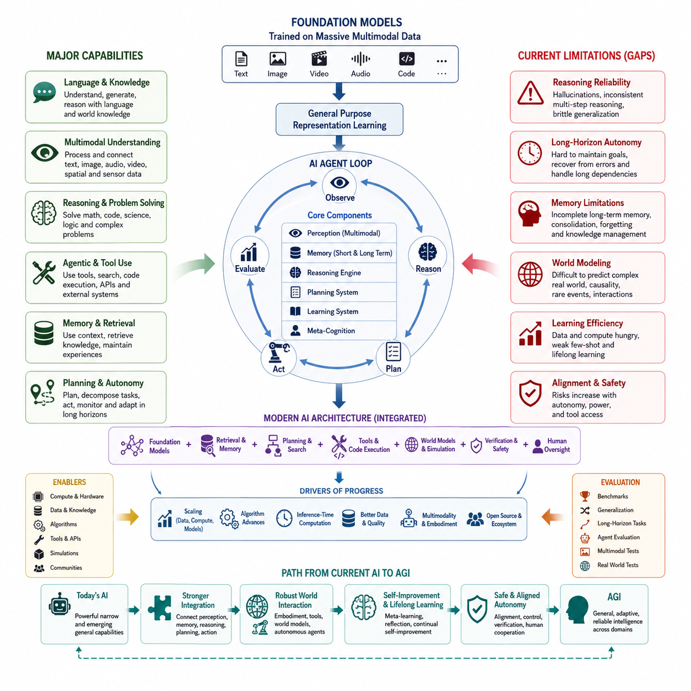
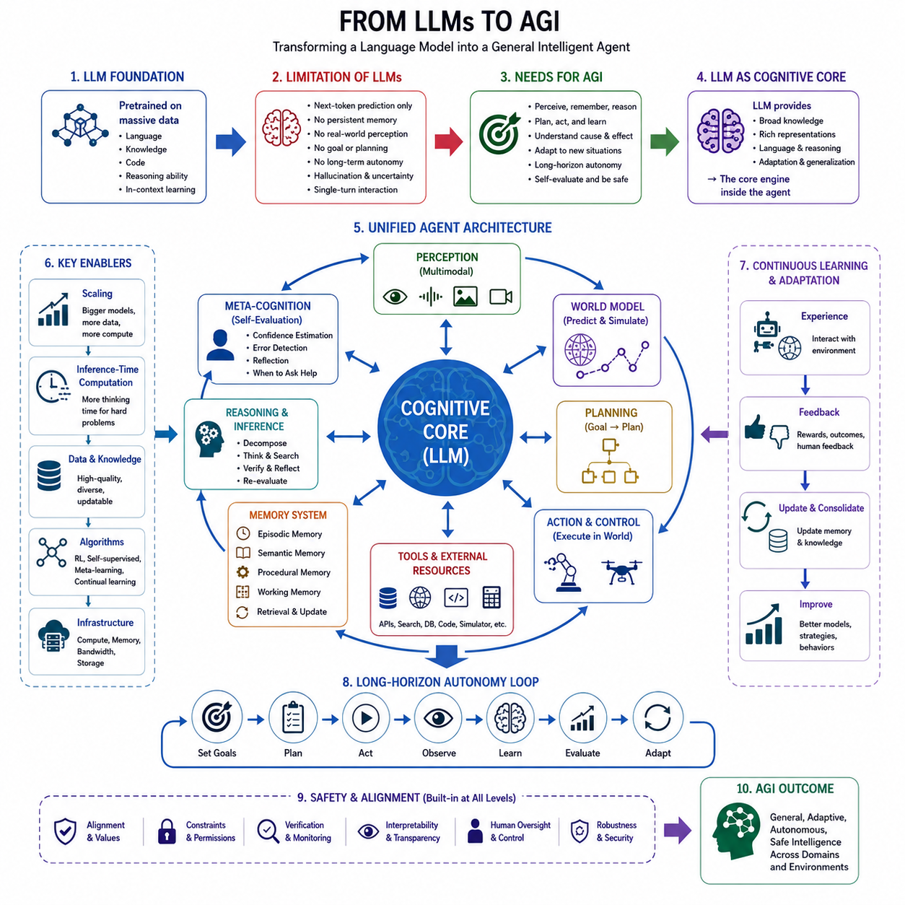
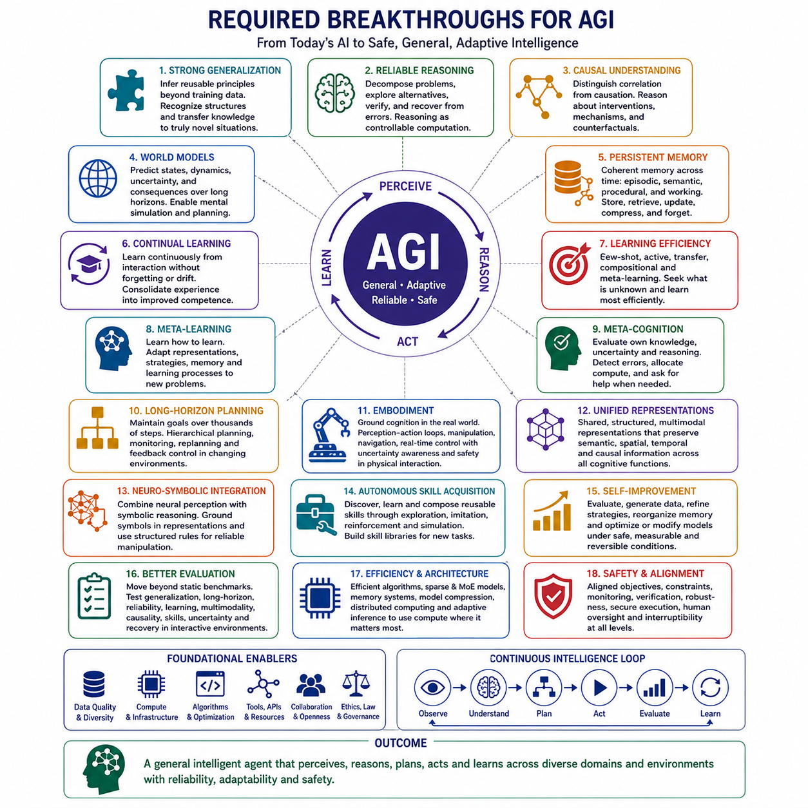
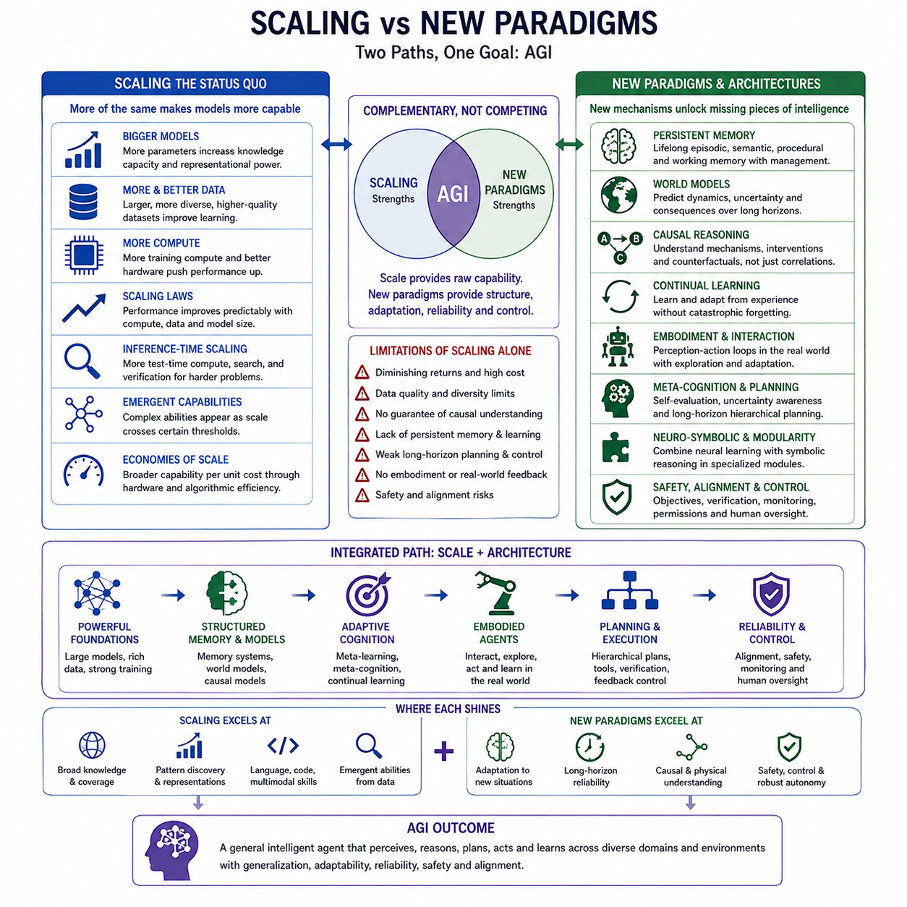
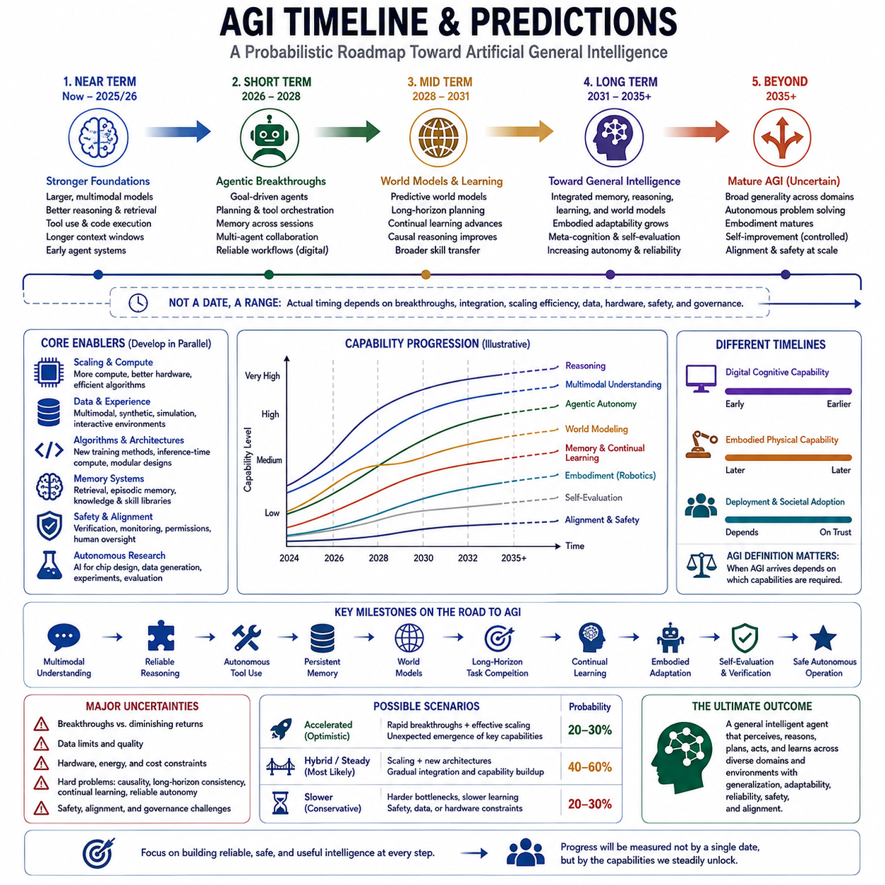
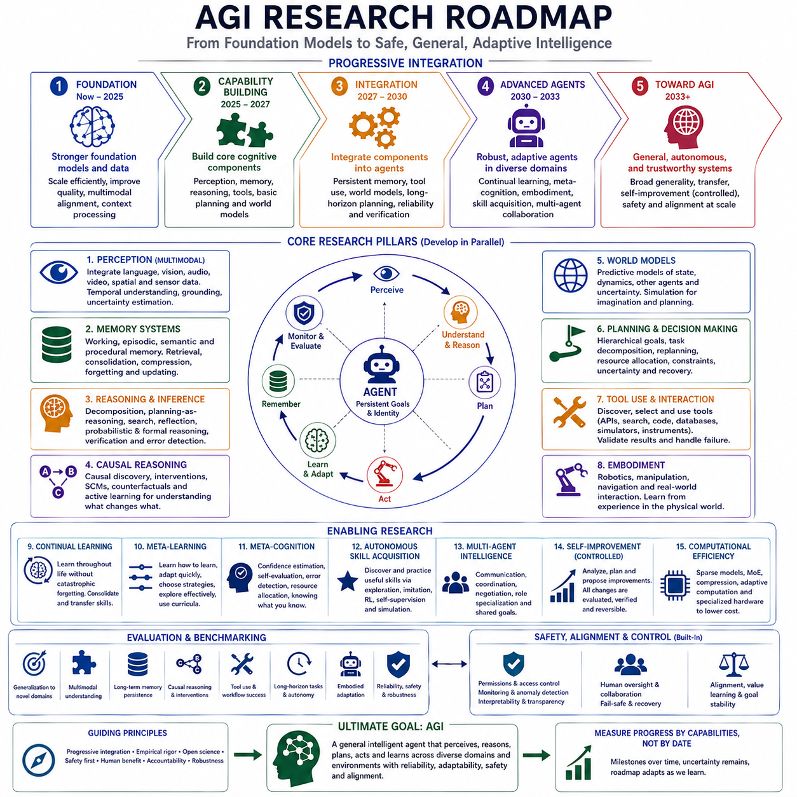

**Volume 47. Artificial General Intelligence**

# Chapter 09. Path to AGI

## 09.00. Current State of AI

{width="7.268055555555556in" height="7.268055555555556in"}

인공지능(Artificial Intelligence)은 매우 광범위한 인지 작업(cognitive tasks)을 수행할 수 있는 단계에 진입했지만, 그 능력은 여전히 불균일하며 인간의 일반지능(general human intelligence)과 근본적으로 다르다. 현대 인공지능은 언어 생성, 이미지 해석, 오디오 및 비디오 합성, 소프트웨어 작성, 수학 문제 해결, 지식 검색, 외부 도구(tool)와의 상호작용을 수행할 수 있다. 이러한 능력은 점차 일반화된 계산 지능(general computational intelligence)을 향한 중요한 진전을 의미하지만, 완전한 범용인공지능(Artificial General Intelligence, AGI)의 존재와 동일시해서는 안 된다.

현대 인공지능의 지배적인 기반은 대규모 사전학습 모델(large-scale pretrained model)이다. 각 작업마다 별도의 모델을 구축하는 대신, 현대 시스템은 방대한 텍스트, 이미지, 비디오, 오디오, 코드 및 점차 증가하는 멀티모달 데이터(multimodal data)로부터 광범위한 통계적 표현(statistical representation)을 학습한다. 하나의 파운데이션 모델(foundation model)은 이후 프롬프팅(prompting), 지시 튜닝(instruction tuning), 파인튜닝(fine-tuning), 검색(retrieval), 도구 통합(tool integration)을 통해 다양한 응용 분야를 지원할 수 있다. 이러한 변화는 인공지능을 전문화된 알고리즘의 집합에서 점차 재사용 가능한 범용 계산 플랫폼(general-purpose computational platform)으로 변화시켰다.

대규모 언어 모델(Large Language Model, LLM)은 이러한 변화를 가장 명확하게 보여준다. 트랜스포머 기반 시스템(Transformer-based system)은 대규모 예측 목표(prediction objective)를 통해 언어와 지식에 대한 풍부한 표현을 학습하며, 학습 과정에서 명시적으로 정의되지 않았던 작업도 수행할 수 있다. 인컨텍스트 학습(in-context learning)은 모델이 추론 시 제공되는 지시와 예제로부터 행동을 조정하도록 한다. 최근의 추론 지향 접근법(reasoning-oriented approach)은 추론 과정에 추가적인 계산 자원을 할당하여 중간 가능성을 탐색하고, 후보 해답을 수정하며, 어려운 수학·과학·프로그래밍·계획 문제에서 성능을 향상시킨다.

멀티모달 인공지능(multimodal AI)은 이러한 능력을 언어의 범위를 넘어 확장하고 있다. 현대 모델은 텍스트, 이미지, 음성, 비디오, 공간 정보(spatial information), 기타 센서 신호(sensor signal)의 조합을 공동으로 처리할 수 있다. 공유되거나 정렬된 표현 공간(aligned representation space)을 통해 하나의 모달리티(modality)에서 얻은 정보가 다른 모달리티의 해석에 영향을 줄 수 있다. 이러한 발전은 AGI로 향하는 과정에서 중요하다. 물리 세계에서 작동하는 지능은 언어에만 의존할 수 없으며, 언어적 개념을 지각(perception), 공간 관계, 시간적 변화, 물리적 객체, 행동(action), 결과(consequence)와 연결해야 하기 때문이다.

또 다른 중요한 변화는 에이전틱 인공지능(agentic AI)의 등장이다. 기존 모델은 주로 입력을 출력으로 변환했지만, 인공지능 에이전트(AI agent)는 관찰(observation), 추론(reasoning), 계획(planning), 행동(action), 평가(evaluation)가 반복되는 순환 구조를 통해 작동할 수 있다. 에이전트는 소프트웨어 도구를 호출하고, 데이터베이스를 검색하며, 코드를 실행하고, 외부 정보를 검색하며, 디지털 환경을 조작하고, 여러 전문화된 모델을 조정할 수 있다. 메모리 시스템(memory system)과 검색 증강 생성(Retrieval-Augmented Generation, RAG)은 이전 상호작용이나 외부 지식 저장소의 관련 정보를 필요할 때 다시 검색할 수 있도록 하여 에이전트의 능력을 현재 컨텍스트 창(context window)의 범위 이상으로 확장한다.

이러한 발전에도 불구하고 현재 인공지능은 추론 신뢰성(reasoning reliability)에서 상당한 한계를 보인다. 모델은 어려운 문제를 해결하면서도 더 단순한 변형 문제에서 예상치 못하게 실패할 수 있으며, 성공적인 추론이 반드시 문제의 기반 구조에 대한 안정적인 내부 이해를 의미하지는 않는다. 환각(hallucination), 취약한 일반화(brittle generalization), 프롬프트에 대한 민감성, 잘못된 가정, 일관되지 않은 다단계 추론(multi-step reasoning)은 여전히 중요한 약점이다. 추론 시 계산량(inference-time computation)을 증가시키면 성능을 향상시킬 수 있지만, 추가 계산만으로 올바른 추론이 보장되거나 모델의 기본 표현에 존재하는 오류가 제거되는 것은 아니다.

장기 지평 자율성(long-horizon autonomy)은 현재 인공지능과 AGI 사이의 또 다른 주요 격차이다. 지능형 시스템은 수시간, 수일, 수개월 또는 그 이상의 기간 동안 목표를 유지하면서 계획을 갱신하고, 관련 경험을 기억하며, 실패에서 복구하고, 예상하지 못한 변화에 대응해야 할 수 있다. 현재의 에이전트는 점차 복잡한 연속 작업을 수행할 수 있지만, 작업이 길어지고 의존 관계가 누적될수록 일반적으로 신뢰성이 감소한다. 지각, 추론, 기억, 계획 또는 도구 사용에서 발생한 작은 오류가 장기간의 행동 순서를 따라 전파되어 결국 전체 작업의 실패를 초래할 수 있다.

메모리(memory) 역시 근본적으로 불완전하다. 트랜스포머 컨텍스트 창(Transformer context window)은 강력한 임시 작업 공간을 제공하며, 검색 시스템(retrieval system)은 외부 장기 기억(long-term memory)의 일부 형태를 모사할 수 있다. 그러나 인간과 유사한 기억은 단순히 문서를 저장하고 검색하는 것 이상이다. 일화 기억(episodic memory), 의미 기억(semantic memory), 절차 기억(procedural memory), 우선순위, 맥락적 연관성(contextual association), 지속적인 기억 공고화(memory consolidation)가 동적으로 상호작용한다. AGI 시스템에는 무엇을 기억하고, 잊고, 일반화하고, 검색하고, 수정하며, 완전한 재학습 없이 재사용 가능한 지식으로 변환할지를 결정하는 통합 메모리 메커니즘(integrated memory mechanism)이 필요할 가능성이 높다.

월드 모델링(world modeling)은 또 하나의 중요한 연구 최전선이다. 지능형 에이전트는 단순히 무엇이 존재하는지를 설명하는 것이 아니라 상태(state)가 시간에 따라 어떻게 변화하고 행동이 미래의 가능성을 어떻게 변화시키는지를 표현하는 내부 모델(internal representation)이 필요하다. 현재의 생성 모델(generative model)과 예측 모델(predictive model)은 비디오, 로봇 궤적(robotic trajectory), 시뮬레이션(simulation), 멀티모달 관찰(multimodal observation)로부터 상당한 통계적 구조를 학습할 수 있다. 그러나 복잡한 물리적·사회적 환경을 강건하게 예측하는 것은 여전히 어렵다. 장기 불확실성, 숨겨진 변수(hidden variable), 인과 구조(causal structure), 희귀 사건(rare event), 다중 에이전트 간 상호작용은 현실적인 월드 모델링을 단기 패턴 예측보다 훨씬 어렵게 만든다.

체화 인공지능(embodied AI)은 이러한 한계를 특히 명확하게 보여준다. 로봇은 실시간 제약(real-time constraint) 아래에서 노이즈가 포함된 센서 측정값을 객체, 기하 구조, 움직임, 행동유도성(affordance), 위험, 가능한 행동에 대한 추정으로 변환해야 한다. 또한 고립된 답변을 생성하는 것이 아니라 지각을 계획 및 제어(control)와 지속적으로 연결해야 한다. 로봇 파운데이션 모델(robot foundation model), 비전-언어-행동 모델(Vision-Language-Action model, VLA), 강화학습(reinforcement learning), 모방학습(imitation learning), 월드 모델(world model)의 발전은 디지털 지능과 물리적 자율성 사이의 간격을 줄이고 있지만, 유연한 조작(flexible manipulation)과 범용적인 현실 세계 적응(real-world adaptation)은 여전히 인간의 능력에 크게 미치지 못한다.

현재의 인공지능 학습은 많은 환경에서 생물학적 학습(biological learning)에 비해 훨씬 비효율적이다. 파운데이션 모델은 광범위한 능력을 획득하기 전에 막대한 데이터셋과 계산 자원을 필요로 하는 경우가 많다. 인간은 몇 번의 시범, 설명 또는 직접적인 경험만으로 새로운 개념이나 행동을 학습하고 상당히 다른 상황으로 지식을 전이(transfer)할 수 있다. 자기지도학습(self-supervised learning), 퓨샷 적응(few-shot adaptation), 메타학습(meta-learning), 강화학습, 지속학습(continual learning), 합성 데이터 생성(synthetic data generation)은 이러한 문제의 일부를 해결하지만, 일반지능에서 기대되는 유연한 평생학습(lifelong learning)을 제공하는 기존 접근법은 아직 존재하지 않는다.

지식(knowledge)과 인과성(causality)은 또 다른 중요한 경계선이다. 대규모 모델은 광범위한 통계적 규칙성을 인코딩하고 종종 인과적 추론(causal reasoning)과 유사한 설명을 생성할 수 있지만, 관찰 데이터에서 학습된 상관관계(correlation)는 인과 구조를 발견하는 것과 동일하지 않다. 일반지능은 개입(intervention), 반사실적 대안(counterfactual alternative), 메커니즘(mechanism), 결과를 이해해야 한다. 따라서 인공지능이 패턴 인식에서 환경이 실제로 어떻게 작동하는지를 발견하는 방향으로 발전함에 따라 신경 표현학습(neural representation learning)을 인과 모델(causal model), 기호 추론(symbolic reasoning), 확률적 추론(probabilistic inference), 시뮬레이션, 실험과 통합하는 것이 점점 중요해질 수 있다.

따라서 현대 인공지능의 아키텍처(architecture)는 점차 이질적인 구조(heterogeneous architecture)로 발전하고 있다. 발전은 더 이상 단일 신경망의 파라미터 수(parameter count)를 증가시키는 것만으로 정의되지 않는다. 실제 시스템은 파운데이션 모델을 검색, 외부 메모리(external memory), 계획 알고리즘(planning algorithm), 코드 실행(code execution), 탐색(search), 전문화된 지각 모델, 데이터베이스, 지식 표현(knowledge representation), 검증 시스템(verification system), 시뮬레이터(simulator), 외부 도구와 결합한다. 이는 점차 일반화되는 지능이 하나의 단일 모델(monolithic model)이 모든 계산 기능을 내부적으로 수행하는 방식보다 여러 기능이 조정되는 인지 아키텍처(cognitive architecture)에서 출현할 가능성을 시사한다.

그럼에도 스케일링(scaling)은 여전히 능력 향상의 가장 강력한 동인 가운데 하나이다. 더 큰 데이터셋, 더 많은 계산 자원, 개선된 학습 알고리즘, 향상된 모델 아키텍처, 고품질 데이터, 증가된 추론 시 계산(inference-time computation)은 작은 시스템에서는 예상하기 어려웠던 능력을 반복적으로 만들어 왔다. 동시에 스케일링은 경제성, 에너지, 하드웨어, 메모리, 통신, 데이터 품질의 제약에 직면한다. 따라서 핵심 질문은 스케일링이 작동하는지 여부에서 스케일링이 어디까지 지속될 수 있으며 어떤 부족한 능력이 기존 스케일링을 넘어서는 아키텍처적 또는 알고리즘적 돌파구를 필요로 하는지로 이동하고 있다.

이에 따라 평가(evaluation) 역시 더욱 어려워지고 있다. 수학, 코딩, 언어 이해, 과학, 멀티모달 추론에서의 벤치마크 점수(benchmark score)는 중요한 능력을 보여주지만, 그 자체로 일반지능의 존재를 입증하지는 않는다. 모델은 학습 분포(training distribution)에 포함된 패턴을 활용할 수 있으며, 벤치마크 성능이 포화되더라도 낯선 환경으로의 강건한 전이(robust transfer)가 입증되는 것은 아니다. 따라서 AGI 평가는 일반화, 적응(adaptation), 장기 계획(long-horizon planning), 멀티모달 추론, 자율적 작업 완료, 불확실성 관리, 메모리, 도구 사용, 실제로 새로운 조건에서의 성능을 점점 더 요구한다.

안전성(safety)과 정렬(alignment) 역시 현재 인공지능 상태를 이해하는 데 핵심적이다. 더욱 강력한 시스템은 더 큰 이점을 제공할 수 있지만, 자율성, 도구 접근(tool access), 지속적 메모리(persistent memory), 현실 세계 제어 능력이 증가하면 오류가 발생했을 때의 결과도 커진다. 따라서 정렬 방법(alignment method), 인간 피드백(human feedback), 헌법적 제약(constitutional constraint), 해석가능성(interpretability), 모니터링(monitoring), 샌드박싱(sandboxing), 권한 시스템(permission system), 인간 감독(human oversight)은 선택적인 부가 기능이 아니라 아키텍처적 요구사항으로 변화하고 있다. 시스템이 복잡한 환경에서 계획을 수립하고 행동을 실행하는 능력을 갖출수록 이러한 문제는 더욱 어려워진다.

현재 인공지능의 상태는 궁극적으로 전문화된 기계지능(specialized machine intelligence)에서 통합된 범용 지능형 시스템(integrated general-purpose intelligent system)으로 이동하는 전환기로 이해할 수 있다. 파운데이션 모델은 광범위한 표현을 제공하고, 멀티모달 학습은 서로 다른 형태의 지각을 연결하며, 추론 방법은 숙고적 계산(deliberative computation)을 확장하고, 메모리 시스템은 시간적 연속성(temporal continuity)을 확대하며, 에이전트는 인지와 행동을 연결하고 있다. 체화 시스템과 월드 모델은 이러한 능력을 물리적 환경과 연결하기 시작했으며, 평가와 안전 연구는 이러한 시스템이 얼마나 신뢰성 있게 작동할 수 있는지를 규명하려 하고 있다.

AGI까지 남아 있는 거리는 하나의 벤치마크나 모델 크기로 측정할 수 없다. 핵심 과제는 통합(integration)이다. 지각은 메모리와 연결되어야 하고, 메모리는 추론과, 추론은 계획과, 계획은 행동과, 행동은 학습과, 학습은 지속적인 세계 지식(persistent world knowledge)과 연결되어야 한다. 메타인지(meta-cognition)는 이러한 과정들을 평가해야 하며, 안전 메커니즘(safety mechanism)은 전체 시스템의 작동을 제약해야 한다. 현재 세대의 인공지능은 이러한 아키텍처를 구성하는 점점 더 강력한 요소들을 보유하고 있지만, 아직 이 요소들은 일관되게 적응하고 자율적으로 행동하며 신뢰할 수 있는 범용 지능 시스템으로 통합되지 않았다. 바로 이 통합 문제(integration problem)가 오늘날의 인공지능에서 AGI로 향하는 경로의 출발점을 정의한다.

## 09.01. From LLM to AGI

{width="7.268055555555556in" height="7.268055555555556in"}

대규모 언어 모델(Large Language Model, LLM)은 범용인공지능(Artificial General Intelligence, AGI)으로 전환하기 위한 가장 강력한 기술적 기반 가운데 하나이지만, LLM 자체를 AGI로 간주해서는 안 된다. LLM은 광범위한 언어 지식, 유연한 표현(representation), 인컨텍스트 적응(in-context adaptation), 점점 강력해지는 추론(reasoning) 능력을 제공한다. 따라서 AGI로 향하는 경로는 언어 모델을 주로 예측하는 모델에서 다양한 환경을 지각하고, 기억하고, 추론하고, 계획하고, 행동하고, 학습하며, 스스로를 평가할 수 있는 지속적인 지능형 시스템(persistent intelligent system)으로 전환하는 과정이다.

LLM이 제공하는 첫 번째 주요 기여는 대규모 데이터로부터 재사용성이 높은 표현(representation)을 구축하는 능력이다. 사전학습(pretraining)을 통해 모델은 언어, 개념, 관계, 절차, 세계 지식(world knowledge)의 일부와 관련된 통계적 구조를 분산 신경 표현(distributed neural representation)으로 압축한다. 이러한 표현을 통해 한 맥락에서 획득한 지식이 다른 맥락의 수행 능력에 영향을 줄 수 있다. 이러한 광범위한 전이 능력(transfer capability)은 일반지능이 가능한 모든 작업이나 환경마다 별도로 설계된 모델에 의존할 수 없다는 점에서 AGI에 중요하다.

그러나 다음 토큰 예측(next-token prediction)만으로는 일반지능에 필요한 모든 메커니즘을 제공할 수 없다. 예측은 놀라운 언어 능력을 만들어 내고 세계에 관한 상당한 구조를 암묵적으로 포착할 수 있지만, 자율 지능(autonomous intelligence)은 그럴듯한 연속 내용을 생성하는 것 이상의 기능을 수행해야 한다. 관찰(observation)과 가정(assumption)을 구분하고, 지속적인 목표를 유지하며, 불확실성을 표현하고, 대안적인 미래를 비교하며, 실패를 탐지하고, 믿음(belief)을 수정하고, 예상되는 결과에 따라 행동을 선택해야 한다. 따라서 AGI에는 파운데이션 모델(foundation model)을 둘러싸거나 확장하는 추가적인 인지 과정(cognitive process)이 필요하다.

추론(reasoning)은 가장 중요한 확장 요소 가운데 하나이다. 기존 LLM 추론(inference)은 해결책을 빠르게 생성할 수 있지만, 어려운 문제는 여러 중간 상태(intermediate state)에 걸친 숙고적 계산(deliberate computation)을 필요로 하는 경우가 많다. 추론 지향 시스템(reasoning-oriented system)은 문제 분해(decomposition), 반복적 추론(iterative inference), 탐색(search), 검증(verification), 성찰(reflection), 추론 시 계산량(inference-time computation) 증가를 위한 메커니즘을 도입한다. 최초로 생성된 답을 최종 결과로 간주하는 대신 후보 해답을 구성하고, 불일치를 검사하고, 대안을 탐색하며, 더 나은 결론을 선택할 수 있다. 이는 인공지능을 즉각적인 생성에서 계산적 숙고(computational deliberation)로 이동시킨다.

계획(planning)은 문제를 이해하는 추론 능력을 미래 행동을 조직하는 능력으로 확장한다. AGI는 추상적인 목표를 달성 가능한 행동 순서로 변환하면서 의존 관계, 자원, 제약조건, 불확실성, 변화하는 조건을 고려해야 한다. LLM은 이미 계획을 생성할 수 있지만, 신뢰할 수 있는 자율성(reliable autonomy)을 위해서는 계획이 실제 환경 상태(environment state)와 지속적으로 연결되어야 한다. 따라서 실행 결과는 계획 시스템으로 다시 전달되어 가정이 실패했을 때 계획을 수정할 수 있어야 한다. 그 결과 목표 형성, 계획, 실행, 관찰, 재계획(replanning)이 이어지는 지속적인 순환 구조가 형성된다.

도구 사용(tool use)은 LLM에서 범용 에이전트(general-purpose agent)로 발전하는 또 하나의 연결 고리를 제공한다. 언어 모델은 자신의 파라미터와 현재 컨텍스트(context)에 표현된 정보와 계산 능력에 제한되지만, 에이전트는 데이터베이스, 검색 시스템, 소프트웨어 API, 계산기, 코드 인터프리터(code interpreter), 시뮬레이터(simulator), 센서 및 외부 애플리케이션에 접근할 수 있다. 도구는 언어 기반 추론을 실제 작동 능력(operational capability)으로 변환한다. 모델이 모든 전문 기능을 내부적으로 재현할 필요 없이 적절한 자원을 판단하고, 호출하고, 결과를 해석하며, 그 정보를 이후의 추론에 통합할 수 있게 된다.

메모리(memory)는 LLM과의 상호작용을 고립된 하나의 추론 과정에서 시간적으로 확장된 인지 과정(temporally extended cognitive process)으로 변화시킨다. 컨텍스트 창(context window)은 임시 작업기억(working memory)을 제공하고, 검색 시스템(retrieval system)은 외부 저장소의 정보를 제공할 수 있다. 더욱 발전된 아키텍처에는 이전 경험을 위한 일화 기억(episodic memory), 축적된 지식을 위한 의미 기억(semantic memory), 재사용 가능한 기술을 위한 절차 기억(procedural memory), 현재 추론을 위한 작업기억이 필요하다. 또한 경험이 무한히 증가하는 기록의 집합이 아니라 구조화된 지식으로 전환되도록 기억 공고화(memory consolidation), 관련성 평가(relevance estimation), 갱신, 망각(forgetting)을 지원해야 한다.

따라서 검색 증강 생성(Retrieval-Augmented Generation, RAG)은 단순히 사실적 답변의 정확도를 향상시키는 방법 이상의 의미를 갖는다. AGI 아키텍처 내에서 검색(retrieval)은 추론 시스템을 모델 파라미터 내부에 영구적으로 저장할 필요가 없는 동적으로 변화하는 지식과 연결할 수 있다. 지능형 에이전트는 필요에 따라 문서, 과거 경험, 계획, 환경 상태 또는 전문 지식을 검색할 수 있다. 이러한 파라미터 지식(parametric knowledge)과 외부 메모리(external memory)의 분리는 시스템이 정보를 더욱 효율적으로 갱신하도록 하며 장기간의 운영 과정에서 지속적인 지식 관리(persistent knowledge management)를 수행하기 위한 기반을 제공한다.

멀티모달 지각(multimodal perception)은 LLM을 텍스트라는 기호적 세계(symbolic world)의 범위를 넘어 확장한다. 일반지능은 이미지, 음성, 비디오, 공간 구조, 움직임뿐만 아니라 잠재적으로 카메라, 라이다(LiDAR), 레이더(radar), 촉각 센서(tactile sensor), 고유수용감각(proprioception), 기타 물리 센서에서 생성되는 데이터 스트림을 해석해야 한다. 멀티모달 모델(multimodal model)은 언어적 개념과 지각 경험(perceptual experience)을 연결하는 메커니즘을 제공한다. 이러한 표현들이 정렬되면 에이전트는 세계에 대한 설명뿐만 아니라 환경에서 직접 획득한 관찰을 기반으로 추론할 수 있으며, 이는 체화 지능(embodied intelligence)으로 발전하기 위한 필수적인 연결 고리를 형성한다.

월드 모델(world model)은 환경이 시간에 따라 어떻게 변화하는지를 표현함으로써 지각 능력을 확장한다. 지각은 현재 상태를 설명하지만, 월드 모델은 가능한 미래 상태와 행동의 결과를 예측하려 한다. 이러한 능력은 정신적 시뮬레이션(mental simulation), 반사실적 추론(counterfactual reasoning), 위험 추정(risk estimation), 모델 기반 계획(model-based planning)을 가능하게 한다. AGI는 가능한 모든 행동을 현실 세계에서 시행착오를 통해 평가할 수 없으므로 행동하기 전에 내부 예측 모델을 통해 대안을 탐색하는 것이 중요한 계산 메커니즘이 된다. LLM의 지식이 이러한 모델에 기여할 수 있지만, 정확한 물리 동역학(physical dynamics)을 표현하기에는 언어 표현만으로 충분하지 않다.

체화(embodiment)는 폐루프 지능(closed-loop intelligence)에 대한 더욱 강력한 요구를 제시한다. 로봇이나 자율 시스템은 지속적으로 관찰을 수신하고, 행동을 선택하며, 환경을 변화시키고, 다시 그 결과를 관찰한다. 따라서 지능은 서로 분리된 프롬프트의 연속이 아니라 지각-행동 루프(perception-action loop)가 된다. 비전-언어-행동 모델(Vision-Language-Action model, VLA)과 로봇 파운데이션 모델(robot foundation model)은 이러한 전환의 초기 사례이다. 이들은 의미적 이해(semantic understanding)와 물리적 행동을 연결하려 하지만, 강건한 AGI를 위해서는 훨씬 발전된 공간 추론, 시간적 예측, 조작(manipulation), 제어(control), 적응(adaptation), 안전 메커니즘이 필요하다.

학습(learning)은 배포 이후에도 계속되어야 한다. 대부분의 LLM 지식은 비용이 많이 드는 오프라인 학습(offline training) 과정에서 획득되는 반면, 인간은 상호작용과 경험을 통해 자신의 이해를 지속적으로 갱신한다. AGI에는 파운데이션 모델 전체를 반복적으로 재학습하지 않고 새로운 개념, 절차, 선호도, 환경 모델, 기술(skill)을 획득할 수 있는 지속학습(continual learning)이 필요하다. 메모리, 파라미터 효율적 적응(parameter-efficient adaptation), 강화학습(reinforcement learning), 자기지도학습(self-supervised learning), 스킬 라이브러리(skill library), 메타학습(meta-learning)은 운영 경험을 점진적으로 향상되는 행동으로 전환하기 위한 상호보완적인 메커니즘을 제공할 수 있다.

메타인지(meta-cognition)는 시스템이 자신의 인지 과정을 추론할 수 있도록 하는 또 하나의 계층을 추가한다. 단순히 답을 생성하는 대신 지능형 에이전트는 신뢰도(confidence)를 추정하고, 부족한 정보를 인식하고, 모순을 탐지하며, 추가적인 계산이 필요한지를 판단하고, 외부 검증이나 인간의 도움이 필요한 시점을 결정해야 한다. 성찰(reflection)과 자기평가(self-evaluation)는 성능을 향상시킬 수 있지만, 신뢰할 수 있는 메타인지에는 실제 오류 탐지와 동일한 기반 모델에서 생성된 또 하나의 잠재적으로 잘못된 출력을 구별하는 메커니즘이 필요하다.

따라서 AGI로의 전환은 대규모 언어 모델이라는 개념에서 통합 에이전트 아키텍처(unified agent architecture)라는 개념으로 이동하는 과정일 수 있다. LLM은 중요한 추론, 언어, 지식 구성요소로 기능할 수 있으며, 지각 시스템, 메모리, 검색, 플래너(planner), 월드 모델, 학습 메커니즘, 도구, 제어기(controller), 검증 모듈(verification module)은 상호보완적인 능력을 제공한다. 이러한 구성요소는 일관된 표현을 통해 정보를 교환해야 하며 서로 분리된 소프트웨어 모듈이 아니라 지속적인 인지 루프(cognitive loop) 안에서 작동해야 한다.

이러한 통합은 스케일링(scaling)의 역할도 변화시킨다. 모델 크기, 학습 데이터, 계산량의 증가는 표현과 추론 능력을 지속적으로 향상시킬 수 있으며, 추론 시 계산(inference-time computation)은 어려운 작업에 추가적인 능력을 제공할 수 있다. 그러나 이러한 능력이 시간에 걸쳐 지속되고 실제 행동에 영향을 줄 수 있는지는 아키텍처 통합(architectural integration)에 의해 결정된다. 따라서 스케일링과 새로운 메커니즘은 반드시 경쟁적인 경로가 아니다. 더 큰 파운데이션 모델은 강력한 인지적 기본 요소(cognitive primitive)를 제공하고, 메모리, 월드 모델링, 계획, 체화, 지속학습은 이러한 요소를 점점 일반적인 지능형 시스템으로 조직할 수 있다.

장기 지평 신뢰성(long-horizon reliability)은 이러한 구성요소가 통합될수록 결정적인 엔지니어링 과제가 된다. 하나의 추론 단계에서 높은 확률로 성공하는 에이전트도 수천 개의 상호 의존적인 결정을 수행해야 한다면 빈번하게 실패할 수 있다. 따라서 AGI에는 오류 탐지(error detection), 불확실성 추정(uncertainty estimation), 중복 검증(redundant verification), 체크포인트(checkpointing), 복구 전략(recovery strategy), 계층적 계획(hierarchical planning), 어려운 상황을 상위 수준으로 전달하는 메커니즘이 필요하다. 지능은 개별 답변의 품질뿐만 아니라 변화하는 환경과 장기간 상호작용하는 동안 시스템이 일관되고 효과적인 행동을 유지할 수 있는지를 통해 평가되어야 한다.

안전성(safety)과 정렬(alignment)은 자율성의 발전과 동시에 발전해야 한다. 계획, 도구 사용, 지속적 메모리, 학습, 물리적 행동이 가능한 시스템은 텍스트만 생성하는 모델보다 훨씬 큰 운영상의 영향력을 갖는다. 따라서 권한(permission), 행동 제약(behavioral constraint), 검증, 모니터링, 해석가능성(interpretability), 안전한 실행 환경(secure execution environment), 인간 감독(human oversight), 제어 가능한 목표(controllable objective)가 아키텍처의 통합된 구성요소가 되어야 한다. 결과적으로 LLM에서 AGI로의 전환은 단순히 능력을 증가시키는 과정이 아니라 점점 자율화되는 지능을 둘러싼 신뢰할 수 있는 제어 체계를 구축하는 과정이기도 하다.

LLM에서 AGI로 향하는 경로는 궁극적으로 강력한 파운데이션 모델을 중심으로 이루어지는 점진적인 통합(progressive integration)으로 볼 수 있다. 언어 모델링(language modeling)은 광범위한 표현과 지식을 제공하고, 추론은 숙고적 계산을 제공하며, 메모리는 연속성(continuity)을 제공하고, 검색은 동적 지식을 제공한다. 계획은 목표 지향적 구조(goal-directed structure)를 제공하고, 도구는 외부 능력을 제공하며, 멀티모달 지각은 시스템을 관찰과 연결하고, 월드 모델은 예측을 제공한다. 체화는 인지와 행동을 연결하고, 지속학습은 적응을 제공하며, 메타인지는 내부 평가와 제어를 제공한다.

어떠한 단일 구성요소도 그 자체만으로는 충분하지 않다. 일반지능은 이러한 능력이 다양한 작업, 영역(domain), 환경, 시간 규모(time scale)에 걸쳐 함께 작동할 때 비로소 나타날 수 있다. 따라서 핵심적인 전환은 질문에 답하는 모델에서 진화하는 내부 상태(evolving internal state)를 유지하고, 환경을 이해하며, 목표를 형성하고 추구하고, 행동의 결과로부터 학습하며, 제어 가능성을 유지하면서 자신의 행동을 적응시키는 에이전트로의 변화이다. LLM은 이러한 전환의 인지적 핵심(cognitive core)을 제공할 수 있지만, AGI에는 광범위한 예측 지능을 지속적이고, 현실에 기반하며(grounded), 학습하고, 자율적으로 행동하는 지능으로 전환하는 주변 아키텍처가 필요하다.

## 09.02. Required Breakthroughs

{width="7.268055555555556in" height="7.268055555555556in"}

범용인공지능(Artificial General Intelligence, AGI)에 도달하려면 벤치마크 성능(benchmark performance)의 점진적인 향상만으로는 충분하지 않다. 현재 인공지능은 이미 강력한 파운데이션 모델(foundation model), 멀티모달 지각(multimodal perception), 추론(reasoning), 검색(retrieval), 도구 사용(tool use), 점점 더 발전하는 에이전트(agent)를 결합하고 있지만, 이러한 구성요소들은 낯선 영역에서 장기간 작동할 때 여전히 불완전하고 신뢰성이 부족하다. 따라서 AGI에 필요한 돌파구(breakthrough)는 단순한 능력 향상뿐 아니라 지속적인 시스템으로서 지능의 통합(integration), 효율성(efficiency), 적응성(adaptability), 신뢰성(reliability), 제어 가능성(controllability)에 관한 것이다.

근본적으로 필요한 돌파구 가운데 하나는 학습 분포(training distribution)를 넘어서는 더욱 강력한 일반화(generalization)이다. 현대 모델은 다양한 작업 사이에서 지식을 전이할 수 있지만, 환경, 가정, 표현 또는 문제 구조가 익숙한 사례와 크게 달라지면 성능이 저하될 수 있다. AGI는 주로 통계적 유사성에 의존하는 대신 재사용 가능한 원리(reusable principle)를 추론해야 한다. 또한 여러 영역에 걸친 구조적 관계(structural relationship)를 인식하고, 광범위한 재학습이나 세심하게 구성된 시범 없이도 이전에 획득한 지식을 실제로 새로운 상황에 적용할 수 있어야 한다.

추론 신뢰성(reasoning reliability)은 두 번째로 중요한 과제이다. 현재 모델은 수학, 과학, 언어, 프로그래밍 분야에서 뛰어난 추론을 수행할 수 있지만 그 성공은 여전히 일관적이지 않다. 더욱 발전된 시스템에는 문제를 분해하고, 중간 상태(intermediate state)를 유지하고, 대안을 탐색하며, 가정을 점검하고, 결론을 검증하고, 오류에서 복구하는 메커니즘이 필요하다. 특히 의사결정이 이후의 행동이나 현실 세계 시스템에 영향을 미치는 경우, 추론은 단순히 그럴듯하게 생성된 토큰의 연속이 아니라 제어 가능한 계산 과정(controllable computational process)이 되어야 한다.

인과적 이해(causal understanding)는 추론과 함께 발전해야 한다. 통계적 예측은 규칙성을 발견할 수 있지만, 일반지능은 상관관계(correlation)와 실제로 사건을 발생시키는 메커니즘(mechanism)을 구별해야 한다. AGI는 개입(intervention)에 대해 추론하고, 행동이 환경을 어떻게 변화시키는지를 이해하며, 다른 결정을 내렸을 경우 어떤 일이 발생했을지를 나타내는 반사실적 가능성(counterfactual possibility)을 평가할 수 있어야 한다. 표현학습(representation learning)을 인과추론(causal inference), 실험, 시뮬레이션(simulation), 구조화 모델(structured model)과 결합하면 반복적인 패턴을 인식하는 단계에서 변화가 왜 발생하는지를 이해하는 단계로 발전할 수 있다.

월드 모델(world model)은 시간적·물리적 이해(temporal and physical understanding) 측면에서 이와 관련된 돌파구를 필요로 한다. 범용 에이전트(general agent)는 객체, 에이전트, 공간 관계, 동역학(dynamics), 불확실성, 가능한 미래 상태를 표현하는 내부 모델을 필요로 한다. 이러한 모델은 바로 다음 관찰뿐 아니라 더 장기적인 궤적(trajectory)과 행동의 결과까지 예측해야 한다. 정확한 월드 모델은 정신적 시뮬레이션(mental simulation), 계획(planning), 위험 평가(risk assessment), 반사실적 추론을 지원하여 에이전트가 외부 세계에서 비용이 많이 들거나 위험한 행동을 실행하기 전에 내부적으로 다양한 가능성을 평가할 수 있게 한다.

지속적 메모리(persistent memory)는 또 다른 부족한 능력이다. 현재의 컨텍스트 창(context window)과 검색 시스템은 유용한 근사 방법을 제공하지만, AGI에는 장기간의 상호작용 동안 일관성을 유지하는 메모리가 필요하다. 일화적 경험(episodic experience)은 의미 지식(semantic knowledge), 재사용 가능한 절차, 목표, 맥락적 관계와 연결되어야 한다. 시스템은 어떤 정보를 저장할 가치가 있는지, 무엇을 압축하거나 일반화할 수 있는지, 언제 기억을 검색해야 하는지, 오래된 지식을 언제 수정하거나 잊어야 하는지를 결정해야 한다. 메모리는 수동적인 저장소가 아니라 능동적인 학습 메커니즘(active learning mechanism)이 되어야 한다.

지속학습(continual learning)은 이렇게 축적된 경험을 향상된 능력으로 전환해야 한다. 대부분의 파운데이션 모델은 대규모 오프라인 학습(offline training)을 통해 기본 능력을 획득하며 배포 이후에는 상대적으로 거의 변화하지 않는다. AGI는 파국적 망각(catastrophic forgetting), 통제되지 않은 행동 변화(behavioral drift), 신뢰할 수 없는 관찰로 인한 지식 손상을 방지하면서 상호작용으로부터 지속적으로 학습해야 한다. 외부 메모리, 자기지도학습(self-supervised learning), 강화학습(reinforcement learning), 파라미터 효율적 적응(parameter-efficient adaptation), 기술 습득(skill acquisition), 주기적 공고화(periodic consolidation)의 결합은 안정적인 평생학습(lifelong learning)을 위한 경로를 제공할 수 있다.

학습 효율성(learning efficiency) 자체도 상당한 향상이 필요하다. 인간은 몇 개의 사례만으로 유용한 개념을 습득할 수 있으며, 설명, 유추(analogy), 관찰, 실험을 통해 일반화하는 경우가 많다. 현대 인공지능은 흔히 막대한 데이터셋과 계산 예산(computational budget)에 의존한다. AGI에는 더욱 강력한 퓨샷 학습(few-shot learning), 능동학습(active learning), 전이(transfer), 구성적 일반화(compositional generalization), 메타학습(meta-learning), 자율적 데이터 선택(autonomous data selection)이 필요하다. 지능형 시스템은 자신이 무엇을 모르는지를 점차 스스로 판단하고, 불확실성을 가장 효율적으로 감소시킬 수 있는 경험이나 정보를 찾아야 한다.

메타학습(meta-learning)은 특정 작업을 학습하는 지능에서 학습하는 방법 자체를 학습하는 지능으로 전환함으로써 중요한 돌파구를 제공할 수 있다. 새로운 영역마다 고정된 학습 절차를 요구하는 대신, 메타학습 시스템은 마주한 문제에 따라 자신의 표현, 전략, 메모리 사용 방식, 학습 과정을 적응시킬 수 있다. 이러한 능력은 인지적 유연성(cognitive flexibility)과 밀접하게 관련된다. 범용 에이전트는 이전에 성공했던 전략이 더 이상 적합하지 않은 시점을 인식하고 인간 엔지니어가 시스템 전체를 다시 설계하지 않더라도 새로운 접근법을 구성할 수 있어야 하기 때문이다.

메타인지(meta-cognition) 역시 신뢰할 수 있는 자율성(reliable autonomy)을 위해 중요하다. AGI는 자신의 추론, 지식, 불확실성, 한계를 평가하는 메커니즘을 갖추어야 한다. 증거가 부족한 경우, 계획이 실패하고 있는 경우, 추가 계산이 필요한 경우, 외부의 도움이 필요한 경우를 인식할 수 있어야 한다. 현재의 성찰(reflection) 방법은 이러한 능력의 초기 형태를 제공하지만, 진정한 메타인지 제어(meta-cognitive control)를 위해서는 단순히 기존 추론 과정을 반복하는 것이 아닌 신뢰도 추정(confidence estimation), 오류 탐지(error detection), 전략 선택(strategy selection), 계산 자원 할당(computational resource allocation), 검증 메커니즘이 필요하다.

장기 지평 계획(long-horizon planning)은 또 하나의 주요 기술적 장벽이다. 현실의 목표는 수천 개의 의사결정에 걸쳐 계층적 의존 관계(hierarchical dependency)를 포함하는 경우가 많다. AGI는 상위 수준의 목표를 유지하면서 이를 중간 목표와 실행 가능한 행동으로 분해하고, 진행 상황을 모니터링하며, 상황이 변화하면 다시 계획해야 한다. 따라서 계층적 계획(hierarchical planning), 메모리, 월드 모델, 검증, 피드백 제어(feedback control)가 함께 작동해야 한다. 계획이 하나의 추론 컨텍스트를 훨씬 넘어서거나 예상하지 못한 환경 변화가 발생하더라도 시스템은 일관성을 유지해야 한다.

체화 지능(embodied intelligence)은 이러한 인지 능력을 물리적 상호작용에 기반시키는 돌파구를 필요로 한다. 범용 로봇은 불확실한 환경에 지속적으로 대응하면서 비전(vision), 언어, 공간 이해, 고유수용감각(proprioception), 조작(manipulation), 내비게이션(navigation), 계획, 제어를 결합해야 한다. 물리적 행동은 잘못되었을 때 단순히 다시 생성하면 되는 것이 아니며 객체, 로봇 또는 사람에게 손상을 줄 수 있다. 따라서 체화 AGI(embodied AGI)에는 엄격한 안전 제약 아래 작동하는 신뢰할 수 있는 지각-행동 루프(perception-action loop), 예측 월드 모델, 불확실성 인식 계획(uncertainty-aware planning), 빠른 적응, 실시간 제어(real-time control)가 필요하다.

또 다른 돌파구는 여러 인지 기능 사이의 통합 표현(unified representation)에 관한 것이다. 현재 인공지능 아키텍처는 지각, 언어, 메모리, 계획, 제어, 검색을 위해 별도로 개발된 모듈을 연결하는 경우가 많다. AGI에서는 이러한 구성요소들이 중요한 의미적, 공간적, 시간적, 인과적 구조를 잃지 않고 정보를 교환할 수 있어야 한다. 공유 잠재 표현(shared latent representation), 구조화된 세계 상태(structured world state), 멀티모달 임베딩(multimodal embedding), 지식 그래프(knowledge graph), 하이브리드 신경-기호 표현(hybrid neural-symbolic representation)은 이러한 연결을 위한 서로 다른 방법을 제공할 수 있다. 목표는 반드시 하나의 보편적인 표현을 만드는 것이 아니라 전문화된 인지 과정 사이에서 일관된 의사소통을 가능하게 하는 것이다.

신경-기호 통합(neural-symbolic integration)은 유연한 패턴 인식과 명시적인 추론이 함께 필요한 영역에서 특히 중요해질 수 있다. 신경망(neural network)은 복잡한 데이터에서 분산 표현을 학습하는 데 뛰어나지만, 기호 시스템(symbolic system)은 구성적 구조(compositional structure), 변수, 규칙, 해석 가능한 제약조건을 제공할 수 있다. AGI는 이 둘 가운데 하나만 선택하기보다 두 형태 사이를 이동할 수 있는 아키텍처를 필요로 할 수 있다. 이러한 시스템은 학습된 표현에 기호를 기반시키면서 순수한 통계적 생성이 신뢰성 있게 처리하기 어려운 관계를 구조적 추론(structured reasoning)을 통해 조작할 수 있다.

자율적 기술 습득(autonomous skill acquisition)도 필요한 단계이다. 범용 에이전트는 모든 행동을 인간의 시범으로부터 직접 학습하는 대신 상호작용을 통해 유용하고 재사용 가능한 기술을 발견할 수 있어야 한다. 이후 복잡한 작업은 보다 단순하게 학습된 행동들을 조합하여 구성할 수 있다. 강화학습, 모방학습(imitation learning), 자기지도 예측(self-supervised prediction), 탐색(exploration), 시뮬레이션, 자동화된 커리큘럼 생성(automated curriculum generation)이 이러한 능력에 기여할 수 있다. 기술 라이브러리(skill library)는 반복된 경험을 계획 시스템이 새로운 목표를 위해 검색하고 조합할 수 있는 절차적 지식(procedural knowledge)으로 점진적으로 전환할 수 있다.

자기개선(self-improvement)은 이러한 원리를 개별 기술에서 지능형 시스템 자체로 확장한다. 미래의 에이전트는 자신의 실패를 평가하고, 부족한 능력을 식별하며, 학습 경험을 생성하고, 프롬프트나 전략을 개선하고, 메모리를 재구성하며, 계산 워크플로(computational workflow)의 일부를 최적화할 수 있다. 더욱 발전된 시스템은 통제된 조건에서 모델이나 아키텍처를 수정할 수도 있다. 그러나 자기개선이 AGI에 유용하려면 개선 결과를 측정할 수 있고, 안정적이며, 필요할 경우 되돌릴 수 있어야 하고, 최적화가 의도하지 않은 행동을 발생시키지 않도록 안전 메커니즘에 의해 제한되어야 한다.

평가(evaluation) 역시 개념적인 돌파구를 필요로 한다. 정적인 벤치마크(static benchmark)만으로는 학습하고, 도구를 사용하고, 환경과 상호작용하며, 시간에 따라 적응할 수 있는 시스템을 적절하게 측정할 수 없다. AGI 평가는 보지 못했던 문제에 대한 일반화, 장기 지평 신뢰성(long-horizon reliability), 지속학습, 멀티모달 이해, 인과추론, 자율적 기술 습득, 불확실성 관리, 실패 복구 능력을 평가해야 한다. 따라서 기존의 시험과 함께 상호작용형 환경(interactive environment)과 개방형 작업(open-ended task)이 점점 중요해질 가능성이 높다.

효율성(efficiency)과 계산 아키텍처(computational architecture)는 또 다른 실질적인 장벽이다. 일반지능은 모델 크기와 추론 비용을 제한 없이 증가시키는 방식에 영원히 의존할 수 없다. 향상된 알고리즘, 희소 계산(sparse computation), 전문가 혼합 아키텍처(Mixture-of-Experts architecture), 효율적인 메모리 시스템, 특수 가속기(specialized accelerator), 모델 압축(model compression), 분산 컴퓨팅(distributed computing), 적응형 추론(adaptive inference)은 지능적 행동에 필요한 자원을 줄일 수 있다. 미래의 시스템은 예측 가능한 상황에서는 저비용 처리를 사용하고 불확실성, 새로움(novelty), 위험이 증가할 때만 더 깊은 추론을 활성화하는 방식으로 계산 자원을 동적으로 할당할 수 있다.

안전성(safety)과 정렬(alignment)은 AGI가 달성된 이후가 아니라 능력 개발과 동시에 이루어져야 하는 돌파구이다. 자율성이 증가할수록 잘못된 목표, 기만적인 정보, 안전하지 않은 탐색, 통제되지 않은 도구 사용의 결과도 커진다. 신뢰할 수 있는 시스템에는 해석 가능한 목표(interpretable goal), 권한 경계(permission boundary), 모니터링, 검증, 강건성(robustness), 안전한 실행(secure execution), 인간 감독(human oversight), 행동을 중단하거나 수정할 수 있는 메커니즘이 필요하다. 시스템이 새로운 기술을 학습하고 전략을 변경하며 개발 과정에서 예상하지 못했던 상황을 접하더라도 정렬은 계속 유지되어야 한다.

따라서 필요한 돌파구들은 서로 깊이 연결되어 있다. 더 나은 월드 모델은 계획을 향상시키고, 더 나은 메모리는 지속학습을 가능하게 하며, 인과추론은 예측을 강화하고, 메타인지는 검증 능력을 향상시키며, 체화는 현실에 기반한 경험(grounded experience)을 제공하고, 효율적인 학습은 적응 속도를 높인다. 하나의 구성요소에서 이루어진 발전은 다른 구성요소의 요구조건도 변화시킨다. 독립적인 모듈들의 상호작용이 시간에 걸쳐 정보, 목표, 학습, 제어를 유지할 수 있는 일관된 인지 아키텍처(coherent cognitive architecture)를 형성하지 않는다면 단순히 이들을 조립하는 것만으로 AGI가 출현할 가능성은 낮다.

따라서 AGI로 향하는 경로는 강력하지만 분절된 능력(fragmented capability)에서 통합된 적응형 지능(integrated adaptive intelligence)으로 전환하는 과정으로 이해할 수 있다. 스케일링(scaling)은 파운데이션 모델을 계속 강화할 수 있지만, 일반화, 추론, 인과성, 메모리, 월드 모델링, 지속학습, 메타인지, 계획, 체화, 표현, 효율성, 안전성에서도 중요한 발전이 이루어져야 한다. 궁극적으로 결정적인 돌파구는 아키텍처적일 수 있다. 즉, 이러한 능력들이 지속적인 지각-추론-행동-학습 루프(perception-reasoning-action-learning loop) 안에서 서로를 강화하면서 낯선 환경에서도 신뢰성과 제어 가능성을 유지하는 하나의 시스템을 구축하는 것이다.

## 09.03. Scaling vs New Paradigms

{width="7.268055555555556in" height="7.268055555555556in"}

범용인공지능(Artificial General Intelligence, AGI)으로 향하는 경로는 기존 모델의 스케일링(scaling)과 근본적으로 새로운 패러다임(new paradigm)의 발견 사이의 경쟁으로 설명되는 경우가 많다. 스케일링 관점에서는 더 큰 모델, 더 풍부한 데이터셋, 더 많은 계산 자원, 더 긴 추론 과정이 점점 더 일반적인 능력을 계속 만들어낼 수 있다고 본다. 새로운 패러다임 접근법에서는 지속적 메모리(persistent memory), 인과적 이해(causal understanding), 월드 모델링(world modeling), 지속학습(continual learning), 체화(embodiment), 메타인지(meta-cognition)와 같은 지능의 중요한 특성들이 스케일만으로는 신뢰성 있게 출현하기 어려우며 새로운 메커니즘이 필요할 수 있다고 본다. 따라서 AGI로 향하는 실제 경로는 둘 중 하나를 선택하기보다 두 방향을 함께 활용하는 형태가 될 가능성이 높다.

스케일링은 이미 놀라운 경험적 효과(empirical effectiveness)를 입증했다. 모델 파라미터, 학습 데이터, 계산 자원, 최적화 품질(optimization quality)의 증가는 언어 이해, 지식 표현(knowledge representation), 코딩, 멀티모달 지각(multimodal perception), 추론 능력을 반복적으로 향상시켜 왔다. 과거에는 전문화된 시스템이 필요했던 능력들이 이제 하나의 공통 파운데이션 모델(foundation model) 안에서 나타날 수 있다. 이는 충분히 큰 모델이 엔지니어가 명시적으로 프로그래밍하지 않은 표현과 계산 패턴을 발견할 수 있음을 시사하며, 스케일링을 광범위한 기계지능(machine intelligence)을 만들어내는 가장 강력한 방법 가운데 하나로 만든다.

스케일링 법칙(scaling law)은 이러한 발전을 이해하기 위한 유용한 프레임워크를 제공한다. 학습 계산량(training compute), 데이터셋 크기, 모델 용량(model capacity)이 증가함에 따라 모델 성능이 예측 가능한 방식으로 변화하는 경우가 많기 때문에 연구자들은 추가적인 자원이 손실(loss)이나 다운스트림 능력(downstream capability)을 얼마나 향상시킬 수 있는지 추정할 수 있다. 이러한 관계는 점점 더 거대한 학습 시스템과 데이터셋 구축을 촉진했다. 그러나 스케일링 법칙은 특정 아키텍처와 학습 방식에서 관찰된 경험적 경향을 설명하는 것이며, AGI에 필요한 모든 능력이 동일한 과정에 의해 무한히 향상된다는 것을 입증하는 것은 아니다.

데이터 스케일링(data scaling)은 특히 중요한 한계를 제시한다. 모델 크기를 증가시키는 것은 학습 데이터가 충분한 품질, 다양성, 정보적 가치를 제공할 때에만 유용하다. 품질이 낮거나 중복된 정보를 반복적으로 제공하는 방식으로는 지능을 무한히 강화할 수 없다. 따라서 미래의 스케일링은 데이터 큐레이션(data curation), 합성 데이터(synthetic data), 상호작용 경험(interactive experience), 멀티모달 관찰(multimodal observation), 시뮬레이션(simulation), 자동 생성 학습 환경에 점점 더 의존하게 될 것이다. 문제의 중심은 단순히 더 많은 데이터를 수집하는 것에서 더욱 발전된 시스템이 학습해야 할 적절한 경험을 생성하는 것으로 이동한다.

계산 스케일링(compute scaling) 역시 비슷한 제약에 직면한다. 더 큰 학습 작업에는 막대한 규모의 가속기 클러스터(accelerator cluster), 메모리 용량, 통신 대역폭, 에너지, 냉각 시스템, 재정적 투자가 필요하다. 하드웨어가 계속 발전하더라도 제한 없는 성장은 점점 더 많은 비용을 요구한다. 이는 알고리즘 효율성(algorithmic efficiency), 희소 계산(sparse computation), 전문가 혼합 모델(Mixture-of-Experts model), 양자화(quantization), 특수 가속기(specialized accelerator), 향상된 최적화, 하드웨어-소프트웨어 공동 설계(hardware-software co-design)에 대한 필요성을 증가시킨다. 따라서 미래의 스케일링은 단순히 원시 계산량(raw compute)을 최대화하는 것보다 단위 계산량당 더 많은 유용한 지능을 얻는 방향으로 발전할 가능성이 높다.

추론 시 스케일링(inference-time scaling)은 또 다른 차원을 제공한다. 모든 계산 자원을 학습 단계에서 사용하는 대신 시스템은 어려운 문제를 해결할 때 추가적인 자원을 사용할 수 있다. 탐색(search), 다수의 후보 생성, 검증(verification), 성찰(reflection), 시뮬레이션, 반복적 추론(iterative reasoning)을 통해 모델은 더욱 깊은 분석이 필요한 상황에 더 많은 계산을 투입할 수 있다. 이는 적응적 인지(adaptive cognition)와 유사하다. 일상적인 문제에는 적은 비용의 처리를 사용하고, 불확실하거나 위험도가 높은 문제에는 더욱 광범위한 추론을 적용하는 것이다. 이러한 동적 계산(dynamic computation)은 기존 파운데이션 모델과 더욱 유연한 인지 시스템(cognitive system)을 연결하는 중요한 가교가 될 수 있다.

그러나 스케일만으로 지속적 메모리(persistent memory)가 자동으로 해결되는 것은 아니다. 더 많은 파라미터를 가진 모델은 더 많은 지식을 인코딩할 수 있고, 더 큰 컨텍스트 창(context window)은 더 긴 시퀀스를 처리할 수 있지만, 어느 방법도 반드시 평생에 걸친 메모리 관리(lifelong memory management)를 제공하는 것은 아니다. 일반지능은 무엇을 기억하고, 공고화(consolidation)하고, 일반화하고, 갱신하고, 잊을지를 결정해야 한다. 일화 기억(episodic memory), 의미 기억(semantic memory), 절차 기억(procedural memory), 작업기억(working memory)은 서로 다른 계산적 역할을 수행한다. 이러한 기능은 단순히 대규모 사전학습 모델의 파라미터 수를 증가시키는 것이 아니라 이를 보완하는 명시적인 메모리 아키텍처(memory architecture)를 필요로 할 수 있다.

월드 모델링(world modeling)에서도 비슷한 문제가 나타난다. 대규모 멀티모달 모델은 객체, 행동, 공간, 시간적 변화에 관한 상당한 규칙성을 학습할 수 있으므로 스케일링은 내부 세계 모델(internal world model) 형성에 크게 기여할 수 있다. 그러나 신뢰할 수 있는 에이전트는 장기적인 결과를 예측하고, 불확실성을 표현하며, 숨겨진 원인(hidden cause)을 구별하고, 개입(intervention)에 대해 추론해야 한다. 따라서 명시적인 예측 상태 모델(predictive state model), 시뮬레이터, 잠재 동역학(latent dynamics), 인과 표현(causal representation), 모델 기반 계획(model-based planning)이 광범위한 통계적 지식을 변화하는 환경에 대한 실제 작동 가능한 이해로 전환하는 데 필요할 수 있다.

인과추론(causal reasoning)은 새로운 패러다임이 필요할 가능성이 자주 제기되는 또 하나의 영역이다. 파운데이션 모델은 주로 관찰된 데이터의 통계적 관계를 학습하지만, 지능적인 개입을 위해서는 에이전트가 시스템을 능동적으로 변화시켰을 때 무엇이 달라지는지를 이해해야 한다. 상관관계는 기반 메커니즘을 밝히지 않으면서도 예측을 가능하게 할 수 있다. 구조적 인과 모델(structural causal model), 반사실적 추론(counterfactual reasoning), 실험, 능동학습(active learning)은 이러한 관계를 표현하기 위한 프레임워크를 제공한다. 궁극적으로 신경 모델(neural model)과 인과적 방법(causal method)은 경쟁 관계가 아니라 상호보완적인 접근법이 될 수 있다.

지속학습(continual learning)은 기존의 한 번 학습하고 배포하는 방식(train-once-and-deploy paradigm)에도 도전한다. 스케일링은 일반적으로 대규모 오프라인 최적화(offline optimization) 과정에 학습을 집중시키지만, AGI는 배포 이후에도 계속 적응해야 한다. 새로운 지식, 환경, 도구, 목표, 기술(skill)은 지속적으로 나타날 것이다. 거대한 파운데이션 모델을 반복적으로 재학습하는 것은 비효율적이며 시스템을 불안정하게 만들 수 있다. 따라서 지속적 메모리, 파라미터 효율적 적응(parameter-efficient adaptation), 모듈형 학습(modular learning), 기술 습득(skill acquisition), 강화학습(reinforcement learning), 통제된 공고화(controlled consolidation)가 스케일링된 파운데이션 모델을 확장하는 핵심 아키텍처 요소가 될 수 있다.

체화(embodiment)는 정적인 데이터셋 스케일링만으로 쉽게 환원할 수 없는 요구사항을 만든다. 물리적 에이전트는 자신의 행동이 이후의 관찰을 변화시키는 폐루프(closed loop) 안에서 작동한다. 에이전트는 상호작용을 통해 행동유도성(affordance), 동역학(dynamics), 공간 관계, 불확실성, 행동의 결과를 학습해야 한다. 대규모 비디오 및 로봇 데이터셋은 강력한 사전 지식(prior)을 제공할 수 있지만, 현실 세계 지능은 사전에 완전히 표현할 수 없는 환경에 대한 적응을 요구한다. 따라서 상호작용, 탐색(exploration), 시뮬레이션, 강화학습, 월드 모델은 에이전트가 자신의 데이터를 능동적으로 생성하는 학습 패러다임을 도입한다.

새로운 패러다임은 모듈형 인지 아키텍처(modular cognitive architecture)의 형태로 나타날 수도 있다. 하나의 신경망이 모든 능력을 내부적으로 구현하기를 기대하는 대신, 미래 시스템은 지각, 메모리, 추론, 계획, 검색, 월드 모델링, 검증, 제어를 담당하는 전문화된 구성요소들을 조정할 수 있다. 파운데이션 모델은 여전히 중심적인 표현 및 추론 엔진으로 기능하면서 외부 모듈이 명시적인 구조가 유리한 능력을 제공할 수 있다. 이러한 아키텍처는 고립된 예측 모델보다 통합 인지 시스템(integrated cognitive system)에 가까우며 더 높은 신뢰성, 해석가능성(interpretability), 엔지니어링 유연성을 제공할 수 있다.

신경-기호 시스템(neuro-symbolic system)은 가능한 아키텍처 방향 가운데 하나이다. 신경망은 고차원 데이터(high-dimensional data)에서 유연하게 학습하는 능력을 제공하는 반면, 기호 표현(symbolic representation)은 명시적인 변수, 규칙, 관계, 구성적 구조(compositional structure)를 제공한다. 순수한 기호 인공지능(symbolic AI)은 역사적으로 지각과 지식 획득에 어려움을 겪었고, 순수한 신경 시스템은 체계적 추론(systematic reasoning)과 명시적인 제약조건 만족(constraint satisfaction)에 어려움을 겪을 수 있다. 이 두 접근법을 결합하면 학습된 표현의 유연성을 유지하면서 구조적 추론을 통해 정밀한 관계 조작이 필요한 작업에서 더 높은 일관성을 확보할 수 있다.

메타학습(meta-learning)은 적응(adaptation) 자체를 학습 가능한 대상으로 취급함으로써 또 다른 패러다임 전환을 제시한다. 기존의 스케일링은 점점 광범위한 능력을 모델 파라미터에 인코딩하려 하지만, 메타학습은 제한된 경험으로부터 새로운 능력을 빠르게 구축할 수 있는 시스템을 추구한다. AGI에는 두 가지 모두가 필요할 수 있다. 즉, 광범위한 사전학습 지식과 기존 지식이 충분하지 않을 때 어떻게 적응할지를 결정하는 메커니즘이다. 학습 전략, 탐색 정책(exploration policy), 메모리 사용 방식, 심지어 계산 자원의 할당까지 고정된 설계가 아니라 적응 가능한 구성요소가 될 수 있다.

자기개선(self-improvement)은 이러한 개념을 더욱 확장한다. 충분한 능력을 가진 에이전트는 자신의 실패를 분석하고, 부족한 지식을 식별하며, 학습 작업을 생성하고, 메모리를 재구성하고, 더 나은 전략을 발견하거나, 자신의 소프트웨어와 모델 일부를 개선할 수 있다. 이는 개선 과정 자체가 부분적으로 지능형 시스템 내부에서 이루어진다는 점에서 기존 스케일링과 근본적으로 다르다. 그러나 통제되지 않은 자기수정(self-modification)은 심각한 신뢰성과 정렬(alignment) 문제를 발생시킨다. 자기개선 아키텍처에서는 변경 사항을 수용하기 전에 평가, 검증, 롤백(rollback), 권한 경계(permission boundary), 안정적인 목표가 필요하다.

효율성(efficiency) 자체가 새로운 지능 패러다임이 될 수도 있다. 생물학적 뇌는 모든 감각 입력에 최대 계산량을 균일하게 적용하지 않는다. 주의(attention), 예측(prediction), 새로움 탐지(novelty detection), 계층적 처리(hierarchical processing)를 통해 계산 자원을 선택적으로 할당한다. 미래의 인공지능 역시 예측 가능한 조건에서는 저비용 처리를 유지하고, 불확실성, 새로움, 충돌, 위험이 증가할 때만 고비용 추론을 활성화할 수 있다. 조건부 계산(conditional computation), 희소 활성화(sparse activation), 이벤트 기반 처리(event-driven processing), 계층적 에이전트(hierarchical agent), 적응형 추론(adaptive inference)은 평균 계산량보다 효과적인 지능 능력이 더 빠르게 증가하는 시스템을 가능하게 할 수 있다.

이 논쟁은 연구자들이 출현(emergence)을 어떻게 정의하는지에 따라서도 달라진다. 특정 작업을 기준으로 측정하면 스케일링 과정에서 어떤 능력이 갑자기 나타나는 것처럼 보일 수 있지만, 그 기반이 되는 향상은 점진적으로 축적되었을 가능성이 있다. 이러한 관찰은 미래의 추가적인 스케일링을 통해 현재 작은 시스템에서는 보이지 않는 능력이 나타날 가능성을 시사한다. 그러나 출현이 모든 부족한 메커니즘을 해결할 것이라고 가정할 수는 없다. 아키텍처에 지속적인 상호작용, 메모리 갱신, 환경 피드백(environmental feedback), 행동 채널(action channel)이 없다면 스케일을 증가시키더라도 내부 예측 능력은 향상될 수 있지만 이러한 시스템 수준의 기능이 자동으로 만들어지는 것은 아니다.

따라서 진정한 발전과 외견상의 발전을 구별하기 위해 평가(evaluation)가 필수적이다. 인공지능을 정적인 언어, 코딩, 수학, 지식 벤치마크만으로 평가한다면 이러한 평가가 파운데이션 모델의 강점과 밀접하게 일치하기 때문에 스케일링만으로 충분해 보일 수 있다. AGI 평가는 추가적으로 새로운 영역에 대한 적응(novel-domain adaptation), 장기 지평 자율성(long-horizon autonomy), 지속적 메모리, 인과적 개입(causal intervention), 체화된 상호작용(embodied interaction), 지속학습, 불확실성 관리, 실패 복구를 평가해야 한다. 서로 다른 평가 방식은 어떤 능력이 스케일링을 통해 자연스럽게 향상되고 어떤 능력이 아키텍처 혁신을 필요로 하는지를 보여줄 수 있다.

안전성(safety)은 능력 스케일링을 독립적인 목표로 취급해서는 안 되는 또 다른 이유이다. 더 크고 자율적인 시스템은 추론, 목표, 행동이 잘못되었을 때 더 큰 결과를 초래할 수 있다. 따라서 새로운 아키텍처는 능력 향상과 함께 정렬, 검증, 모니터링, 권한 관리, 해석가능성, 안전한 실행(secure execution), 인간 감독(human oversight)을 통합해야 한다. 시스템이 더 강력해졌지만 그에 비례하여 더 신뢰할 수 있고 제어 가능해지지 않았다면, 그것이 반드시 실용적인 AGI를 향한 발전을 의미하지는 않는다. 능력(capability)과 제어(control)는 함께 스케일링되어야 한다.

따라서 스케일링 대 새로운 패러다임(scaling versus new paradigms)에 대한 가장 생산적인 해석은 양자택일(either-or)이 아니라 스케일링과 아키텍처의 결합(scale-plus-architecture)이다. 스케일링은 파운데이션 모델, 표현, 지식, 멀티모달 이해, 기본적인 추론 능력(reasoning primitive)을 지속적으로 향상시킬 수 있다. 새로운 패러다임은 메모리, 월드 모델, 인과 구조, 지속학습, 체화, 메타인지, 적응형 계산, 신뢰할 수 있는 제어를 제공할 수 있다. 각각의 접근법은 일반지능 문제의 서로 다른 부분을 해결하며, 한쪽의 발전은 다른 쪽의 효과를 더욱 증폭시킬 수 있다.

따라서 AGI는 점점 강력해지는 파운데이션 모델이 점점 정교해지는 인지 아키텍처(cognitive architecture)에 포함되는 형태로 등장할 수 있다. 스케일링은 광범위하게 학습된 능력을 제공하고, 아키텍처 혁신(architectural innovation)은 그러한 능력을 지속적인 지각-추론-계획-행동-학습 루프(perception-reasoning-planning-action-learning loop)로 조직한다. 핵심 연구 질문은 더 이상 단순히 모델이 얼마나 커져야 하는지가 아니라 어떤 능력을 스케일을 통해 암묵적으로 학습해야 하고, 어떤 능력을 새로운 메커니즘을 통해 명시적으로 표현해야 하는가이다. 이 두 영역 사이의 올바른 역할 분담과 이들을 연결하는 인터페이스(interface)를 발견하는 것이 일반지능으로 향하는 다음 주요 단계를 정의할 수 있다.

## 09.04. Timeline and Predictions

{width="7.268055555555556in" height="7.268055555555556in"}

범용인공지능(Artificial General Intelligence, AGI)에 도달하는 시점을 예측하는 것은 본질적으로 불확실하다. AGI에 대해 보편적으로 합의된 운영적 정의(operational definition)가 존재하지 않으며, 발전 과정 역시 단순한 선형 궤적(linear trajectory)을 따르지 않기 때문이다. 파운데이션 모델(foundation model), 추론(reasoning), 멀티모달 지각(multimodal perception), 에이전트(agent), 로보틱스(robotics), 메모리(memory), 월드 모델(world model)의 발전이 동시에 이루어지고 있지만, 한 능력의 발전이 다른 능력의 동등한 발전을 보장하지는 않는다. 따라서 AGI 타임라인은 특정 도달 날짜에 대한 정확한 예측이라기보다 조건에 따라 달라지는 여러 시나리오(conditional scenario)의 집합으로 이해해야 한다.

인공지능의 역사적 발전은 단순한 외삽(extrapolation)이 어려운 이유를 보여준다. 점진적인 발전 과정은 주요 아키텍처 혁신(architectural innovation), 새로운 학습 방법, 하드웨어 발전, 더 큰 데이터셋, 예상하지 못했던 출현 능력(emergent capability)에 의해 반복적으로 급격한 변화를 경험했다. 반대로 빠르게 발전하는 것처럼 보이던 영역이 해결하는 데 수년이 필요한 어려운 병목(bottleneck)에 직면하기도 했다. 미래의 AGI 개발 역시 스케일링 기반 발전(scaling-driven improvement), 알고리즘적 돌파구(algorithmic breakthrough), 통합 문제(integration challenge), 그리고 원시적인 능력보다 신뢰성(reliability)의 발전이 느린 시기가 교대로 나타날 수 있다.

단기적인 발전 경로는 완전히 다른 형태의 지능이 갑자기 등장하기보다는 점점 더 강력해지는 파운데이션 모델이 주도할 가능성이 높다. 모델은 계속해서 더욱 멀티모달(multimodal)화되고, 추론 지향적(reasoning-oriented)이며, 도구 사용(tool use)이 가능해지고, 외부 메모리와 검색(retrieval)이 통합될 것이다. 추론 시 계산(inference-time computation)을 통해 어려운 문제에 더 많은 자원을 투입할 수 있으며, 작은 전문화 모델(specialized model)은 예측 가능한 작업을 효율적으로 처리할 것이다. 이에 따라 언어 모델(language model)과 인공지능 에이전트(AI agent) 사이의 구분은 점차 모호해질 것이다.

에이전틱 시스템(agentic system)은 이러한 전환 과정에서 가장 가시적인 단계 가운데 하나가 될 가능성이 높다. 개별 프롬프트에 응답하는 것을 넘어 시스템은 점차 목표를 유지하고, 계획을 구성하고, 소프트웨어 도구를 사용하며, 워크플로(workflow)를 실행하고, 결과를 검사하며, 행동을 수정하게 될 것이다. 이러한 발전은 완전한 AGI가 존재하기 전에도 경제적으로 중요한 자율성(autonomy)을 만들어낼 수 있다. 그러나 작업 시간이 길어질수록 누적 오류(accumulated error)가 드러나기 때문에 장기 지평 신뢰성(long-horizon reliability), 검증(verification), 메모리, 권한(permission), 복구 메커니즘(recovery mechanism)이 차세대 에이전트의 핵심 엔지니어링 과제가 될 것이다.

멀티모달 지능(multimodal intelligence) 역시 AGI 이전에 상당히 발전할 가능성이 높다. 텍스트, 이미지, 오디오, 비디오, 공간 표현(spatial representation), 센서 데이터가 점점 더 공유된 아키텍처(shared architecture) 안에서 처리될 것이다. 이를 통해 모델은 환경에 대한 더욱 풍부한 표현을 기반으로 추론하고 추상적인 언어를 관찰 가능한 사건과 연결할 수 있다. 특히 비디오 이해(video understanding)는 중요한 역할을 할 수 있는데, 시간적 데이터(temporal data)는 정적인 텍스트와 이미지가 간접적으로만 표현하는 객체, 움직임, 상호작용, 인과성(causality), 물리적 변화에 관한 정보를 제공하기 때문이다.

월드 모델(world model)은 또 하나의 중요한 중간 단계로 등장할 수 있다. 환경이 어떻게 변화하는지를 예측하고 대안적인 행동의 결과를 추정할 수 있는 시스템은 계획, 시뮬레이션(simulation), 로보틱스, 자율적 의사결정(autonomous decision-making)을 지원할 수 있다. 초기 월드 모델은 특정 영역에 특화되거나 짧은 시간 범위에서만 신뢰성 있게 작동할 수 있지만, 멀티모달 파운데이션 모델과의 통합이 증가하면서 점차 적용 범위를 확장할 수 있다. 상태(state)를 인식하는 단계에서 상태 전이(state transition)를 예측하는 단계로의 발전은 더욱 일반적인 에이전트로 향하는 가장 중요한 이정표 가운데 하나가 될 수 있다.

메모리 아키텍처(memory architecture)도 이와 병행하여 발전할 가능성이 높다. 더 큰 컨텍스트 창(context window)은 계속해서 유용한 임시 메모리를 제공하겠지만, 지속적으로 작동하는 에이전트에는 여러 세션과 장기간의 운영 과정에서 경험을 저장할 수 있는 메커니즘이 필요하다. 검색, 일화 기록(episodic record), 의미 지식(semantic knowledge), 절차적 기술(procedural skill), 메모리 공고화(memory consolidation)가 점차 에이전트 아키텍처의 표준 구성요소가 될 수 있다. 이러한 발전은 새로운 정보가 발생할 때마다 비용이 많이 드는 파운데이션 모델 재학습을 수행하지 않고도 인공지능 시스템이 운영 경험을 축적할 수 있게 한다.

지속학습(continual learning)은 더욱 어려운 이정표이며 상대적으로 느리게 발전할 수 있다. 현재 시스템은 외부 메모리를 갱신하고 제한적인 파인튜닝(fine-tuning)을 통해 적응할 수 있지만, 배포 중에 핵심 능력을 안전하게 변경하는 것은 여전히 어렵다. 미래의 에이전트는 초기에는 상대적으로 안정적인 사전학습 모델(pretrained model)과 빠르게 변화하는 외부 메모리 및 기술 모듈(skill module)을 분리할 수 있다. 시간이 지나면서 통제된 공고화 메커니즘(controlled consolidation mechanism)이 선택된 경험을 적응 가능한 모델 구성요소로 이전하여 파국적 망각(catastrophic forgetting)과 바람직하지 않은 행동 변화(behavioral drift)를 제한하면서 지속적으로 학습하는 시스템을 만들 수 있다.

추론 성능(reasoning performance)은 더욱 강력한 사전학습 모델과 증가된 추론 시 계산을 결합하는 방식으로 계속 향상될 가능성이 높다. 시스템은 작업에 즉각적인 생성, 확장된 추론, 외부 검색, 시뮬레이션, 코드 실행(code execution), 독립적인 검증 가운데 무엇이 필요한지를 동적으로 결정할 수 있다. 이러한 적응적 계산 자원 할당(adaptive allocation of computation)은 모든 문제에 최대 수준의 추론 노력을 투입하지 않고도 미래 인공지능의 능력을 크게 향상시킬 수 있다. 그러나 신뢰성은 추론 능력 자체뿐 아니라 검증 아키텍처(verification architecture)에 점점 더 크게 의존하게 될 것이다.

체화 지능(embodied intelligence)은 디지털 에이전트와 다른 시간표를 따라 발전할 가능성이 높다. 소프트웨어 환경은 구조화된 인터페이스를 제공하며 오류를 상대적으로 저렴하게 되돌릴 수 있지만, 로봇은 물리적 불확실성, 실시간 제약(real-time constraint), 하드웨어 한계, 안전 요구사항 아래에서 작동한다. 파운데이션 모델, 비전-언어-행동 모델(Vision-Language-Action model, VLA), 모방학습(imitation learning), 강화학습(reinforcement learning), 시뮬레이션, 월드 모델은 로봇의 적응 능력을 향상시키겠지만, 범용적인 물리적 능력(general-purpose physical competence)은 광범위한 디지털 인지 능력보다 늦게 발전할 수 있다.

이러한 차이는 AGI가 모든 영역에서 동시에 하나의 임계점(threshold)을 넘어서는 방식으로 등장하지 않을 가능성을 시사한다. 시스템은 언어, 과학, 프로그래밍, 디지털 도구 사용, 지식 작업에서 매우 광범위한 능력을 갖추면서도 유연한 물리적 상호작용에서는 인간보다 상당히 약할 수 있다. 반대로 인지적 일반성(cognitive generality)을 강조하는 AGI 정의에서는 강건한 체화 지능이 존재하기 전에 이러한 시스템을 일반지능으로 분류할 수도 있다. 따라서 타임라인 예측은 AGI라는 용어에 어떤 능력을 필수적으로 포함하는지에 크게 좌우된다.

과학 및 엔지니어링 자동화(scientific and engineering automation)는 간접적으로 AGI 타임라인을 가속할 수 있다. 알고리즘 발견, 소프트웨어 엔지니어링, 칩 설계, 합성 데이터 생성(synthetic data generation), 실험 계획, 모델 평가를 지원하는 인공지능 시스템은 미래의 인공지능 시스템 개선에도 기여할 수 있다. 이러한 도구의 능력이 향상되면서 인공지능 연구 자체의 일부가 점점 자동화될 가능성이 있다. 이는 더 강력한 인공지능이 연구를 가속하고 그 연구가 다시 더 강력한 인공지능을 만들어내는 피드백 루프(feedback loop)의 가능성을 만들지만, 이러한 가속의 규모와 안정성은 여전히 매우 불확실하다.

하드웨어 발전(hardware development)은 또 다른 불확실성의 원천이다. 가속기 성능, 메모리 대역폭(memory bandwidth), 네트워킹(networking), 패키징(packaging), 에너지 효율성, 특수 추론 하드웨어(specialized inference hardware)의 향상은 학습과 배포 모두에서 가능한 스케일을 확대할 수 있다. 동시에 전력 공급, 반도체 생산 능력, 인프라 비용, 통신 병목이 성장을 제한할 수 있다. 알고리즘 효율성은 이러한 한계를 부분적으로 보완할 수 있으므로 미래의 능력은 사용 가능한 하드웨어의 절대적인 양만큼이나 계산 자원을 얼마나 효율적으로 사용하는지에 의해 결정될 수 있다.

데이터 가용성(data availability) 역시 미래의 타임라인에 영향을 줄 것이다. 고품질 인간 생성 텍스트만으로는 제한 없는 스케일링을 지원할 수 없기 때문에 멀티모달 데이터, 합성 데이터, 시뮬레이션, 생성형 커리큘럼(generated curriculum), 상호작용형 환경(interactive environment)의 활용이 증가할 것이다. 미래 시스템은 자신의 불확실성을 식별하고, 가설을 생성하며, 시뮬레이션을 수행하거나, 정보 가치가 높은 상호작용을 선택함으로써 자신의 학습 경험 생성에 직접 참여할 수 있다. 수동적인 데이터셋 소비(passive dataset consumption)에서 능동적 경험 생성(active experience generation)으로의 전환은 데이터 규모와 지능 사이의 관계를 크게 변화시킬 수 있다.

벤치마크 능력이 빠르게 향상되더라도 여러 병목은 AGI의 도달을 지연시킬 수 있다. 장기 지평 일관성(long-horizon consistency), 인과적 이해, 지속학습, 지속적인 정체성과 메모리(persistent identity and memory), 강건한 월드 모델링, 신뢰할 수 있는 자기평가(self-evaluation), 안전한 자율 행동은 여전히 해결되지 않은 문제이다. 따라서 짧은 상호작용에서는 매우 일반적인 지능처럼 보이지만 장기간의 자율적 운영에서는 실패하는 시스템이 등장할 수 있다. AGI 달성 여부를 평가할 때 인상적인 시연(demonstration)과 대규모 환경에서의 신뢰할 수 있는 지능(dependable intelligence)의 차이는 점점 더 중요해질 것이다.

안전성(safety)과 거버넌스(governance)는 기술적 능력과 별개로 실제 배포 시점에 영향을 줄 수 있다. 자율 계획, 코드 실행, 금융 활동, 인프라 제어, 과학 실험 또는 물리적 작동이 가능한 시스템에는 대화형 모델보다 훨씬 강력한 모니터링 및 권한 구조(permission structure)가 필요하다. 따라서 기술적으로 가능한 시스템이 존재하더라도 사회가 제한 없는 자율적 배포를 허용하기까지 시간이 필요할 수 있다. 그러므로 AGI 개발(AGI development)과 AGI 배포(AGI deployment)는 엔지니어링, 규제, 경제성, 제도적 신뢰(institutional trust)에 의해 영향을 받는 서로 관련되어 있지만 구별되는 타임라인으로 이해해야 한다.

예측에서는 프로토타입 AGI(prototype AGI)와 성숙한 AGI(mature AGI)도 구분해야 한다. 프로토타입은 광범위한 영역에서 학습과 추론 능력을 보여주면서도 비용이 많이 들고, 느리고, 신뢰성이 낮거나, 상당한 인간 감독을 필요로 할 수 있다. 성숙한 시스템은 훨씬 높은 강건성(robustness), 효율성, 지속학습, 안전성, 운영 독립성(operational independence)을 요구한다. 이러한 구분은 기술 발전 전반에서 나타난다. 어떤 능력이 가능하다는 것을 입증하는 것과 다양한 현실 조건에서 반복적으로 작동할 수 있는 신뢰성 높은 인프라로 발전시키는 것은 서로 다른 문제이다.

이러한 이유로 특정 연도를 AGI 도달 시점으로 지정하는 것보다 이정표 기반 예측(milestone-based forecasting)이 더 유용한 경우가 많다. 중요한 이정표에는 신뢰할 수 있는 멀티모달 추론, 지속적 에이전트 메모리, 자율적 도구 사용, 장기 지평 작업 완료, 강건한 월드 모델, 지속학습, 일반적 기술 전이(general skill transfer), 체화된 적응(embodied adaptation), 자기평가, 안전한 자율적 운영이 포함된다. 이러한 능력들이 얼마나 빠르게 향상되고 통합되는지를 관찰하는 것이 개별 벤치마크의 성능 향상보다 AGI로의 발전을 판단하는 더 강력한 증거를 제공한다.

따라서 여러 시나리오가 여전히 가능하다. 지속적인 스케일링과 추론 시 계산이 결합되어 부족한 능력들이 점점 강력해지는 모델에서 자연스럽게 출현한다면 예상보다 빠른 발전이 이루어질 수 있다. 반면 스케일링된 파운데이션 모델과 명시적인 메모리, 월드 모델, 계획, 인과추론, 학습 아키텍처를 결합하는 하이브리드 경로(hybrid trajectory)가 주류가 될 수도 있다. 신뢰성, 체화, 지속학습, 에너지, 데이터 또는 안전 제약이 현재의 능력 발전 추세에서 예상하는 것보다 훨씬 어려운 문제로 밝혀진다면 더 느린 시나리오도 충분히 가능하다.

따라서 가장 중요한 예측은 연대기적(chronological)이라기보다 구조적(structural)이다. 미래의 인공지능 시스템은 고립된 파운데이션 모델에서 지각, 메모리, 추론, 계획, 도구, 월드 모델, 행동, 학습, 메타인지(meta-cognition), 안전 메커니즘을 결합하는 지속적 인지 아키텍처(persistent cognitive architecture)로 발전할 가능성이 높다. 각각의 구성요소는 서로 다른 속도로 발전할 수 있으며, AGI라고 불리는 시점은 하나의 명확한 사건으로 갑자기 나타나기보다 이러한 구성요소들의 통합이 일반성(generality), 자율성, 적응성, 신뢰성의 실질적인 임계점을 넘어가면서 점진적으로 등장할 수 있다.

따라서 AGI 타임라인은 카운트다운(countdown)이 아니라 계속 이동하는 최전선(moving frontier)으로 이해해야 한다. 스케일링, 아키텍처 혁신, 하드웨어, 데이터, 자율 연구(autonomous research), 체화, 안전성, 경제성, 거버넌스는 정확하게 예측할 수 없는 방식으로 서로 상호작용할 것이다. 더욱 신뢰성 있게 평가할 수 있는 것은 조립되고 있는 능력들의 순서이다. 인공지능이 예측(prediction)에서 추론으로, 추론에서 에이전시(agency)로, 에이전시에서 지속적인 학습으로, 고립된 능력에서 통합 적응 지능(integrated adaptive intelligence)으로 발전함에 따라 고도화된 인공지능(advanced AI)과 AGI 사이의 경계는 특정한 예측 날짜보다 실제로 입증된 시스템 수준의 능력(system-level capability)에 의해 점점 더 결정될 것이다.

## 09.05. Research Roadmap

{width="7.268055555555556in" height="7.268055555555556in"}

범용인공지능(Artificial General Intelligence, AGI)을 향한 연구 로드맵(research roadmap)은 하나의 모델, 벤치마크(benchmark), 또는 예측된 도달 시점을 중심으로 구성되어서는 안 된다. AGI는 지각(perception), 메모리(memory), 추론(reasoning), 계획(planning), 학습(learning), 행동(action), 메타인지(meta-cognition)의 조화로운 발전이 필요한 시스템 수준의 목표(system-level objective)이다. 따라서 연구는 개별 능력을 발전시키는 동시에 이러한 능력들이 지속적인 에이전트(persistent agent) 내부에서 어떻게 상호작용하는지를 연구해야 한다. 이 로드맵은 강력한 파운데이션 모델(foundation model)에서 통합되고, 적응적이며, 신뢰할 수 있고, 제어 가능한 지능형 시스템으로 점진적으로 발전하는 통합 과정(progressive integration)으로 이해하는 것이 가장 적절하다.

파운데이션 모델은 언어, 지식, 코드, 이미지, 오디오, 비디오 및 점점 더 다양한 모달리티(modality)에 대한 광범위한 표현(representation)을 제공하기 때문에 여전히 필수적인 출발점이다. 연구는 데이터 품질, 모델 아키텍처(model architecture), 최적화(optimization), 멀티모달 정렬(multimodal alignment), 컨텍스트 처리(context processing), 계산 효율성(computational efficiency)을 지속적으로 개선해야 한다. 스케일링(scaling)은 여전히 중요하지만, 그 목표는 파라미터 수의 극대화에서 데이터와 계산 자원 단위당 유용한 능력, 일반화(generalization), 추론 품질, 지식 전이(knowledge transfer)를 극대화하는 방향으로 점차 이동해야 한다.

표현학습(representation learning)은 서로 다른 인지 과정에서 지속적으로 활용할 수 있는 표현을 구축하는 방향으로 발전해야 한다. AGI에서는 객체, 개념, 관계, 공간, 시간, 행동, 불확실성, 인과성(causality)에 관한 정보가 지각, 추론, 메모리, 계획, 제어(control) 사이를 이동할 수 있어야 한다. 연구에서는 공유 잠재 공간(shared latent space), 구조화 표현(structured representation), 멀티모달 임베딩(multimodal embedding), 객체 중심 표현(object-centric representation), 지식 구조(knowledge structure), 신경-기호 인터페이스(neural-symbolic interface)를 탐구해야 한다. 목표는 모든 인지 기능을 하나의 표현 형식으로 강제하는 것이 아니라 일관된 정보 교환(coherent information exchange)을 가능하게 하는 것이다.

멀티모달 지각(multimodal perception)은 다음의 주요 연구 계층을 형성한다. 범용 에이전트(general agent)는 각각의 모달리티를 독립적으로 처리하는 대신 언어를 이미지, 비디오, 음성, 공간 정보, 물리적 센서 스트림과 통합해야 한다. 연구에서는 시간적 지각(temporal perception), 교차 모달 그라운딩(cross-modal grounding), 공간 추론(spatial reasoning), 객체 영속성(object permanence), 사건 이해(event understanding), 불확실성 추정(uncertainty estimation)을 강조해야 한다. 체화 시스템(embodied system)에서는 궁극적으로 깊이 정보(depth), 라이다(LiDAR), 레이더(radar), 촉각 감지(tactile sensing), 고유수용감각(proprioception), 기타 물리적 환경과의 강건한 상호작용에 필요한 관찰 정보까지 확장되어야 한다.

메모리 연구(memory research)는 더 긴 컨텍스트 창(context window)을 넘어 지속적인 인지 메모리 아키텍처(persistent cognitive memory architecture)로 발전해야 한다. 작업기억(working memory)은 즉각적인 추론을 지원하고, 일화 기억(episodic memory)은 관련 경험을 보존하며, 의미 기억(semantic memory)은 축적된 지식을 조직하고, 절차 기억(procedural memory)은 재사용 가능한 기술(skill)을 유지해야 한다. 기억 공고화(consolidation), 검색(retrieval), 압축(compression), 망각(forgetting), 충돌 해결(conflict resolution), 출처 추적(provenance), 메모리 갱신에 관한 연구가 필요하다. 범용 에이전트는 메모리 시스템이 과거 상호작용의 통제되지 않는 저장소가 되지 않도록 경험을 점진적으로 유용한 지식으로 전환해야 한다.

추론 연구(reasoning research)는 인상적인 개별 문제 해결보다 신뢰성(reliability)에 점점 더 초점을 맞추어야 한다. 시스템은 언제 즉시 답해야 하는지, 언제 문제를 분해해야 하는지, 언제 검색해야 하는지, 언제 코드를 실행해야 하는지, 언제 대안을 시뮬레이션해야 하는지, 언제 독립적인 검증(independent verification)이 필요한지를 학습해야 한다. 추론 시 계산(inference-time computation), 탐색(search), 성찰(reflection), 형식 추론(formal reasoning), 확률적 추론(probabilistic inference), 외부 검증(external verification)은 상호보완적인 메커니즘으로 연구되어야 한다. 핵심 목표는 추론을 오류를 탐지하고 수정할 수 있는 제어 가능한 과정(controllable process)으로 전환하는 것이다.

인과추론(causal reasoning)은 이러한 아키텍처 안에서 독립적인 연구 방향으로 발전해야 한다. 통계적 예측(statistical prediction)은 강력하지만, 자율 에이전트는 개입(intervention)이 환경을 어떻게 변화시키는지를 이해해야 한다. 연구에서는 학습된 표현을 인과 발견(causal discovery), 구조적 인과 모델(structural causal model), 실험(experimentation), 반사실적 추론(counterfactual reasoning), 능동학습(active learning)과 연결해야 한다. 이러한 능력을 통해 에이전트는 관찰된 상관관계와 실제 행동 가능한 메커니즘(actionable mechanism)을 구별할 수 있으며, 과학적 추론, 진단, 계획, 낯선 조건에서의 의사결정 능력을 크게 향상시킬 수 있다.

월드 모델 연구(world-model research)는 지각, 인과성, 예측, 계획을 연결해야 한다. 에이전트에는 현재 상태, 잠재 변수(latent variable), 동역학(dynamics), 불확실성, 다른 에이전트, 가능한 미래 궤적(future trajectory)을 표현할 수 있는 내부 모델이 필요하다. 연구에서는 예측 잠재 상태 모델(predictive latent-state model), 멀티모달 동역학(multimodal dynamics), 계층적 시간 모델(hierarchical temporal model), 생성형 시뮬레이션(generative simulation), 행동 조건부 예측(action-conditioned prediction)을 탐구해야 한다. 궁극적으로 월드 모델은 비용이 많이 들거나 되돌릴 수 없거나 위험한 행동을 외부에서 실행하기 전에 내부적으로 대안 전략을 평가하는 정신적 시뮬레이션(mental simulation)을 지원해야 한다.

계획 연구(planning research)는 그럴듯한 계획을 생성하는 단계에서 장기간 실행 가능한 계획을 유지하는 방향으로 확장되어야 한다. 계층적 계획(hierarchical planning)은 추상적인 목표를 중간 목표, 기술, 저수준 행동(low-level action)과 연결할 수 있으며, 피드백 메커니즘(feedback mechanism)은 예상 결과와 실제 관찰 결과를 지속적으로 비교할 수 있다. 연구는 재계획(replanning), 제약조건 만족(constraint satisfaction), 자원 할당(resource allocation), 불확실성, 부분 관측 가능성(partial observability), 실패 복구(failure recovery), 다중 목표 간 조정(coordination)을 다루어야 한다. 계획은 지각 및 세계 상태 갱신(world-state update)과 지속적으로 연결되는 폐루프 과정(closed-loop process)으로 작동해야 한다.

도구 사용(tool use)은 모든 기능을 파운데이션 모델 내부에 포함하지 않고도 더욱 광범위한 능력으로 발전할 수 있는 실용적인 경로를 제공한다. 에이전트는 검색 시스템, 데이터베이스, 소프트웨어 API, 코드 실행 환경(code execution environment), 시뮬레이터, 과학 장비(scientific instrument), 전문화 모델을 선택하고 사용할 수 있도록 학습해야 한다. 연구에서는 도구 발견(tool discovery), 인터페이스 이해(interface understanding), 결과 검증, 권한 관리(permission management), 실패 처리를 다루어야 한다. 궁극적으로 도구 활용 능력은 구성적(compositional)이어야 하며, 에이전트가 낯선 작업을 마주했을 때 이전에 학습한 자원을 조합하여 새로운 워크플로(workflow)를 구성할 수 있어야 한다.

지속학습(continual learning)은 에이전트를 정적인 사전학습 시스템에서 적응형 지능(adaptive intelligence)으로 전환하기 위해 필요하다. 연구에서는 파국적 망각(catastrophic forgetting)이나 통제되지 않은 행동 변화(behavioral drift)를 발생시키지 않으면서 운영 경험이 메모리, 기술, 표현, 선택된 모델 구성요소를 어떻게 갱신할 수 있는지를 탐구해야 한다. 자기지도학습(self-supervised learning), 강화학습(reinforcement learning), 파라미터 효율적 적응(parameter-efficient adaptation), 모듈형 갱신(modular update), 리플레이(replay), 주기적 공고화(periodic consolidation)는 상호보완적인 메커니즘을 제공할 수 있다. 시스템은 이전에 검증된 능력과 안전 제약을 보존하면서 배포 기간 전체에 걸쳐 학습해야 한다.

메타학습(meta-learning)은 시스템이 적응 과정 자체를 개선하도록 함으로써 지속학습을 보완해야 한다. 모든 상황에 하나의 고정된 학습 전략을 적용하는 대신 에이전트는 새로운 문제에 어떤 표현, 경험, 도구, 탐색 전략(exploration strategy)이 적합한지를 판단해야 한다. 연구에서는 퓨샷 적응(few-shot adaptation), 학습된 최적화(learned optimization), 커리큘럼 생성(curriculum generation), 능동적 정보 수집(active information gathering), 재사용 가능한 학습 전략을 탐구해야 한다. 이는 방대한 작업별 데이터셋에 대한 의존도를 줄이고 실제로 낯선 환경에 더욱 빠르게 적응할 수 있도록 할 것이다.

메타인지(meta-cognition)는 전체 인지 아키텍처에 대한 감독 제어(supervisory control)를 제공해야 한다. 범용 에이전트에는 신뢰도(confidence)를 추정하고, 지식의 공백(knowledge gap)을 탐지하고, 추론 품질을 모니터링하고, 계획 실패를 식별하고, 계산 자원을 할당하고, 외부 지원이 필요한 시점을 판단하는 메커니즘이 필요하다. 가능한 경우 연구에서는 생성(generation)과 평가(evaluation)를 분리하고 독립적인 검증 메커니즘을 개발해야 한다. 궁극적으로 메타인지는 시스템이 무엇을 생각하는지만이 아니라 특정 의사결정에 어느 정도의 계산과 증거를 투입해야 하는지를 결정해야 한다.

체화 지능(embodied intelligence)은 표현과 추론이 실제 상호작용에 기반하고 있는지를 검증하는 핵심 시험을 제공한다. 로보틱스 연구(robotics research)는 실시간 지각-행동 루프(perception-action loop) 안에서 멀티모달 지각, 월드 모델, 계획, 조작(manipulation), 내비게이션(navigation), 제어, 강화학습, 적응을 통합해야 한다. 시뮬레이션과 대규모 로봇 데이터셋은 초기 경험을 제공할 수 있지만, 궁극적으로 시스템은 물리적 상호작용으로부터 안전하게 학습해야 한다. 체화 연구는 순수한 디지털 환경에서는 드러나지 않을 수 있는 불확실성 처리, 인과성, 시간적 예측, 실패 복구의 약점도 노출한다.

자율적 기술 습득(autonomous skill acquisition)은 점점 더 강력해지는 에이전트가 수동으로 정의된 작업에 완전히 의존하지 않고 재사용 가능한 행동을 발견하도록 해야 한다. 탐색, 모방학습(imitation learning), 강화학습, 자기지도 예측(self-supervised prediction), 시뮬레이션, 자동화된 커리큘럼 생성(automated curriculum generation)은 기술 발견을 지원할 수 있다. 이러한 행동은 절차 기억이나 기술 라이브러리(skill library)로 압축되어 이후 계획 시스템에 의해 조합될 수 있다. 연구에서는 유용한 기술을 어떻게 식별하고, 표현하고, 검증하고, 전이하고, 조합하며, 서로 다른 환경에서 개선할 것인지를 규명해야 한다.

멀티에이전트 연구(multi-agent research)는 일반지능을 고립된 하나의 에이전트 범위를 넘어 확장한다. 많은 현실 세계의 작업은 협력(cooperation), 협상(negotiation), 전문화(specialization), 의사소통(communication), 분산 의사결정(distributed decision-making)을 요구한다. 연구에서는 에이전트가 지식을 공유하고, 작업을 분배하고, 계획을 조정하고, 충돌을 해결하며, 집단 메모리(collective memory)를 유지하는 방법을 조사해야 한다. 멀티에이전트 시스템은 사회적 추론(social reasoning)과 출현적 조직(emergent organization)을 연구하는 환경도 제공할 수 있다. 그러나 상호작용 증가는 통신 신뢰성, 인센티브(incentive), 보안, 에이전트 사이의 오류 전파라는 새로운 문제를 발생시킨다.

자기개선(self-improvement)은 점진적으로 그리고 엄격하게 통제된 실험 조건에서 접근해야 한다. 초기 시스템은 핵심 아키텍처를 직접 수정하지 않고도 실패를 분석하고, 메모리를 재구성하고, 연습 작업을 생성하고, 워크플로를 개선하고, 전략 변경을 제안할 수 있다. 더욱 발전된 연구에서는 통제된 모델 또는 소프트웨어 개선(controlled model or software improvement)을 탐구할 수 있다. 모든 변경은 독립적인 시험, 안전 제약, 기존 능력을 기준으로 평가되어야 하며 롤백 메커니즘(rollback mechanism)이 제공되어야 한다. 신뢰할 수 있는 평가가 없는 자기개선은 지능이 아니라 오류를 증폭시킬 수 있다.

계산 효율성(computational efficiency)은 병렬적인 연구 트랙(parallel research track)으로 발전해야 한다. AGI는 모든 입력에 최대 계산량을 지속적으로 적용하는 방식에 의존할 수 없다. 희소 모델(sparse model), 전문가 혼합 시스템(Mixture-of-Experts system), 조건부 계산(conditional computation), 모델 압축(model compression), 특수 하드웨어(specialized hardware), 분산 추론(distributed inference), 적응형 추론(adaptive reasoning)은 비용을 줄일 수 있다. 궁극적으로 에이전트는 새로움(novelty), 불확실성, 난이도, 위험에 따라 계산량을 할당해야 한다. 예측 가능한 상황에서는 최소한의 처리만 수행하고, 낯설거나 중요한 상황에서는 더욱 깊은 지각, 추론, 시뮬레이션, 검증을 활성화할 수 있다.

평가 연구(evaluation research)는 아키텍처와 함께 발전해야 한다. 정적인 벤치마크(static benchmark)는 새로운 영역에 대한 일반화, 멀티모달 이해, 메모리 지속성(memory persistence), 인과추론, 도구 사용, 장기 지평 계획(long-horizon planning), 지속학습, 체화 적응(embodied adaptation), 실패 복구, 자율적 작업 완료를 평가하는 시험으로 보완되어야 한다. 평가는 시스템이 성공하는지 여부뿐 아니라 반복적인 시험과 변화하는 환경에서 얼마나 신뢰성 있게 성공하는지도 측정해야 한다. 개방형 상호작용 환경(open-ended interactive environment)은 겉으로는 뛰어난 시스템에 숨겨진 약점을 발견하는 데 점점 더 중요해질 것이다.

안전성(safety), 정렬(alignment), 제어(control)는 마지막 단계에서 추가되는 기능이 아니라 지속적인 연구 계층으로 작동해야 한다. 권한 시스템(permission system), 모니터링(monitoring), 해석가능성(interpretability), 검증, 강건성(robustness), 안전한 실행(secure execution), 인간 감독(human oversight), 제어 가능한 목표(controllable objective)는 자율성이 증가함에 따라 함께 통합되어야 한다. 지속학습과 자기개선은 시스템이 변화하는 동안에도 안전 특성이 안정적으로 유지되어야 한다는 추가적인 요구사항을 만든다. 따라서 연구에서는 능력 향상(capability growth)과 제어 가능성(controllability)을 서로 결합된 목표로 취급하고 함께 평가해야 한다.

이 로드맵은 궁극적으로 지각, 메모리, 추론, 월드 모델, 계획, 도구, 행동, 학습, 메타인지를 지속적인 피드백 루프(continuous feedback loop) 안에서 통합하는 통합 에이전트 아키텍처(unified agent architecture)로 수렴한다. 서로 다른 구성요소들은 전문화된 형태로 유지될 수 있지만, 일관된 표현을 교환하고 지속적인 목표를 향해 작동해야 한다. 연구는 신뢰성을 측정하면서 작업 지속시간(task duration), 환경 다양성(environmental diversity), 자율성, 학습 요구사항을 점진적으로 증가시켜야 한다. 통합 자체가 단순히 마지막 단계의 엔지니어링 작업이 아니라 하나의 실험적 연구 분야(experimental discipline)가 된다.

따라서 AGI로 향하는 발전은 미리 결정된 날짜가 아니라 능력 이정표(capability milestone)를 통해 측정되어야 한다. 더욱 강력한 파운데이션 모델은 인지적 기반(cognitive substrate)을 제공하고, 메모리와 월드 모델은 연속성과 예측을 제공하며, 추론과 계획은 숙고적 지능(deliberative intelligence)을 제공한다. 도구와 체화는 행동을 제공하고, 지속학습과 메타학습은 적응을 제공하며, 메타인지, 평가, 안전성, 정렬은 제어를 제공한다. 연구의 목표는 이러한 능력들이 서로를 강화하여 궁극적으로 낯선 영역에서도 신뢰성 있게 지각하고, 추론하고, 학습하고, 계획하며, 행동할 수 있는 지속적인 시스템(persistent system)을 형성하도록 만드는 것이다.
