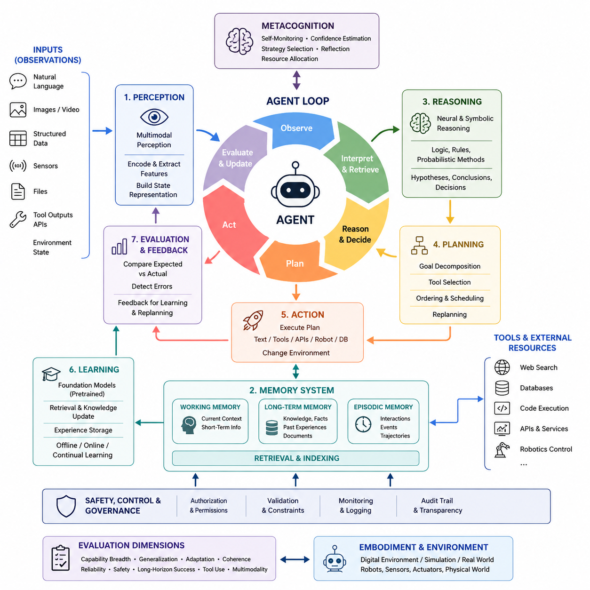
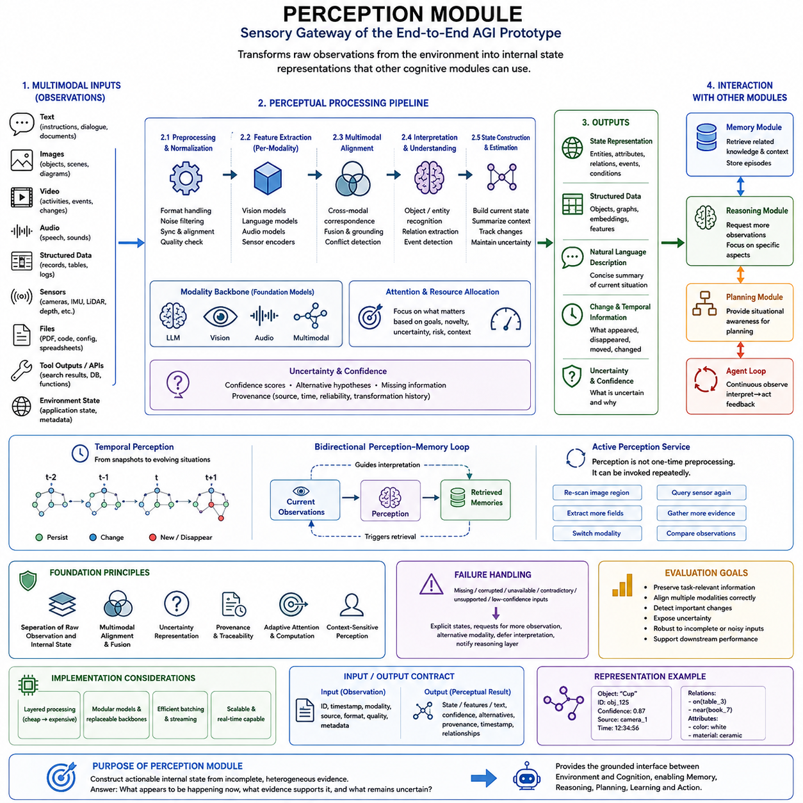
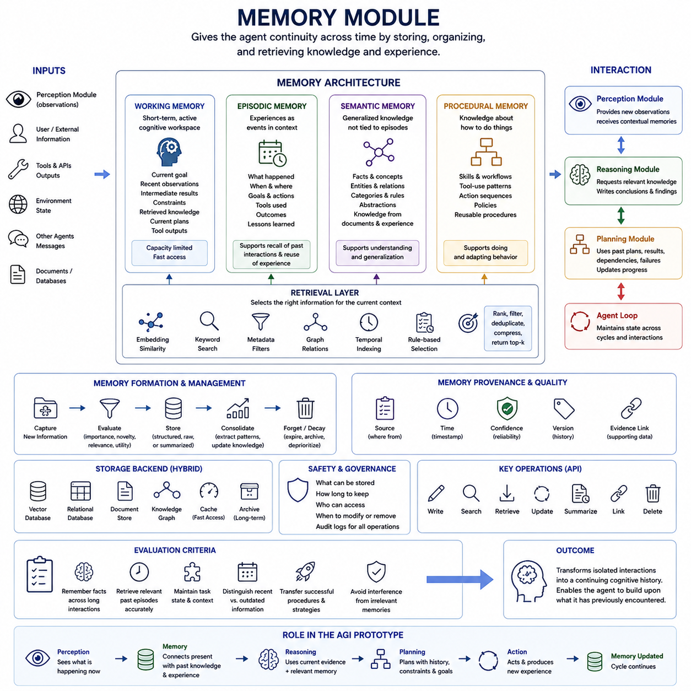
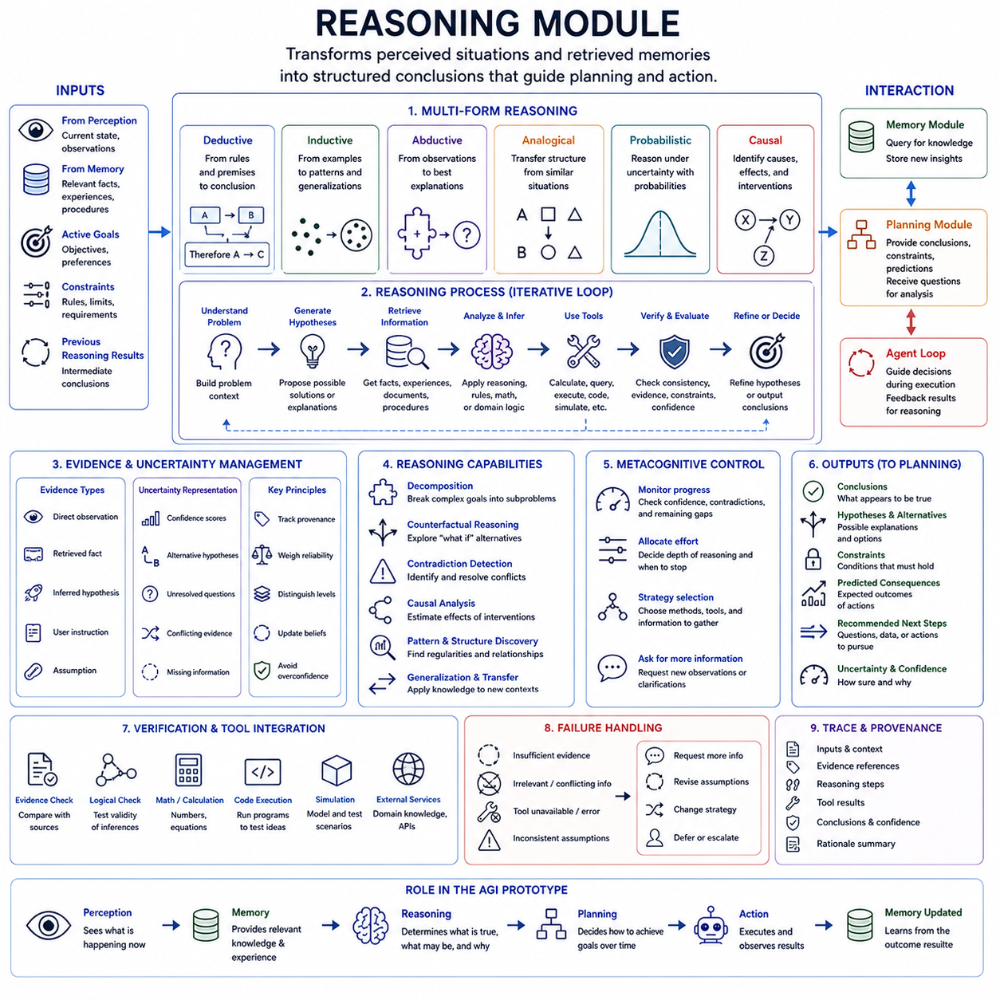
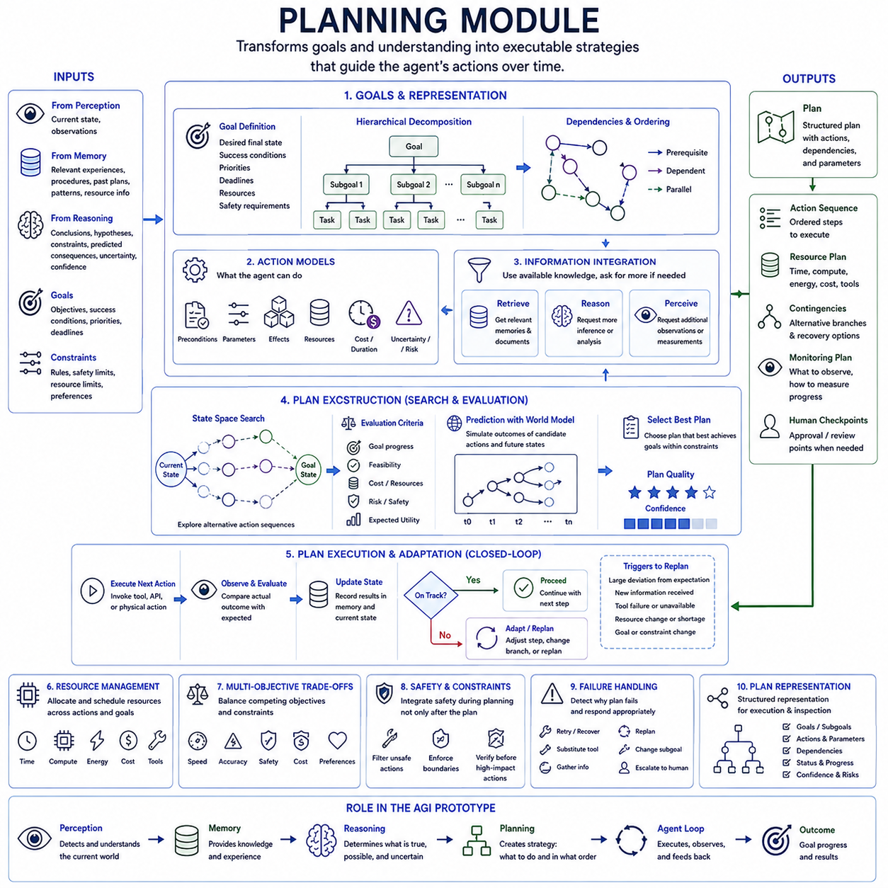
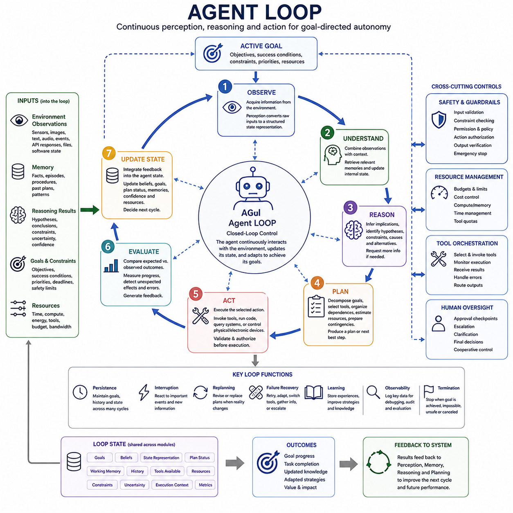
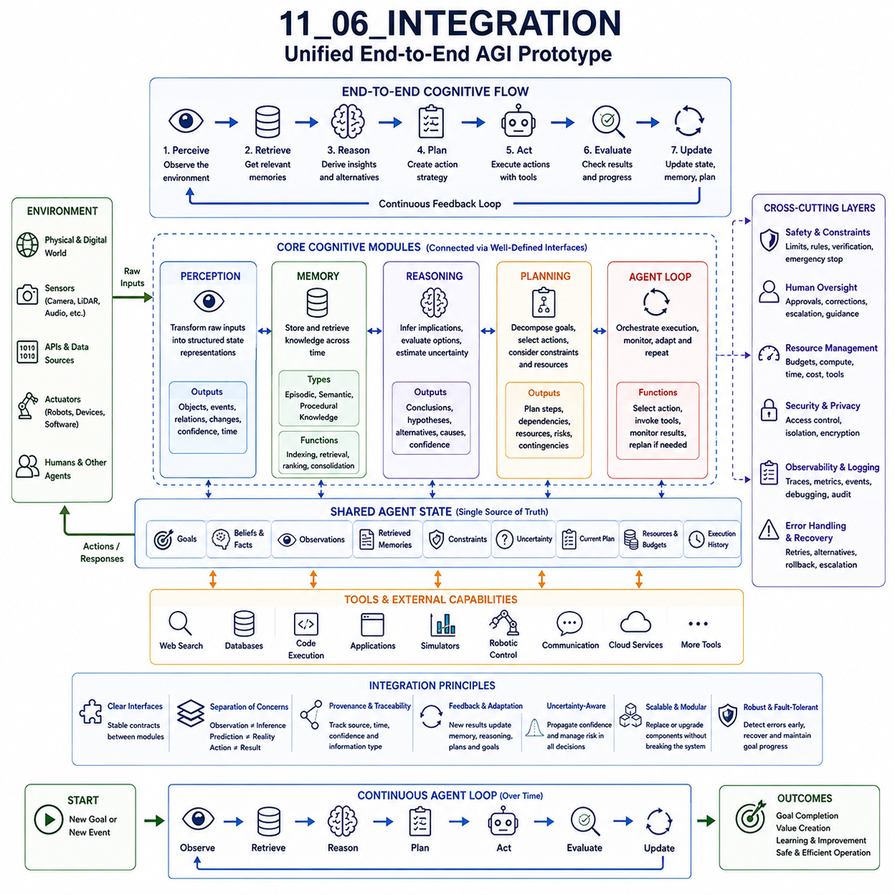

**Volume 47. Artificial General Intelligence**

# Chapter 11. End to End AGI Prototype

## 11.00. Project Overview

{width="7.268055555555556in" height="7.268055555555556in"}

엔드투엔드 AGI 프로토타입(End-to-End AGI Prototype)의 목적은 완전한 범용 인공지능(Artificial General Intelligence, AGI)이 이미 달성되었다고 주장하는 것이 아니라, 이 책 전반에서 다룬 원리들을 실제로 동작하는 통합 에이전트(Integrated Agent)로 구현하는 데 있다. 이 프로토타입은 지각(Perception), 기억(Memory), 추론(Reasoning), 계획(Planning), 행동(Action), 피드백(Feedback)을 하나의 운영 아키텍처(Operational Architecture) 안에서 연결하여, 각각의 기능이 독립된 데모로 존재하는 것이 아니라 지속적으로 상호작용하도록 한다.

앞선 장들에서는 지능(Intelligence)을 다중모달 지각(Multimodal Perception), 단기 및 장기 기억(Short- and Long-Term Memory), 기호적 및 신경망 기반 추론(Symbolic and Neural Reasoning), 계획(Planning), 학습(Learning), 행동(Action), 메타인지(Metacognition)를 포함하는 긴밀하게 연결된 메커니즘들의 집합으로 다루었다. 이 프로토타입은 이러한 메커니즘들을 통합 인지 루프(Unified Cognitive Loop)로 조립할 수 있는 실질적인 환경을 제공한다. 따라서 핵심 목표는 특정 벤치마크나 단일 작업의 성능을 극대화하는 것이 아니라 아키텍처 통합(Architectural Integration)에 있다.

이 프로젝트는 지능에 대해 에이전트 중심 관점(Agent-Centered View)을 채택한다. 시스템은 하나의 입력을 받아 하나의 출력을 생성하는 방식이 아니라, 환경을 반복적으로 관찰하고 현재 상황을 해석하며 관련 지식을 검색하고 가능한 대안들을 추론한 뒤 계획을 수립하고 행동을 실행하며 그 결과를 평가한다. 이러한 행동으로 발생한 새로운 관찰은 다음 주기의 입력이 되어, 기존의 정적인 추론 파이프라인(Static Inference Pipeline)이 아니라 지속적인 지각-추론-행동 루프(Perception-Reasoning-Action Loop)를 형성한다.

지각(Perception)은 에이전트와 환경(Environment)을 연결하는 인터페이스를 형성한다. 구현 방식에 따라 관찰(Observation)은 자연어(Natural Language), 이미지(Image), 구조화 데이터(Structured Data), 센서 정보(Sensor Information), 파일(File), 외부 도구(External Tool)가 반환하는 출력 등을 포함할 수 있다. 지각 모듈(Perception Module)은 이러한 이질적인 입력을 후속 구성요소들이 처리할 수 있는 표현(Representation)으로 변환한다. 이러한 분리를 통해 전체 인지 아키텍처를 다시 설계하지 않고도 프로토타입을 점차 다중모달(Multimodal) 시스템으로 발전시킬 수 있다.

기억(Memory)은 프로토타입이 시간의 흐름에 따라 연속성을 유지하도록 한다. 작업 기억(Working Memory)은 현재 작업에 필요한 정보를 유지하고, 장기 기억(Long-Term Memory)은 지식, 이전 상호작용, 관찰, 계획, 결과 및 재사용 가능한 경험을 보존한다. 검색 메커니즘(Retrieval Mechanism)은 전체 기억 저장소를 추론 시스템에 그대로 제공하는 대신 현재 맥락(Context)에 관련된 정보를 선택한다. 따라서 기억은 단순한 수동적 데이터베이스(Passive Database)가 아니라 인지 과정에 능동적으로 참여하는 구성요소가 된다.

추론 모듈(Reasoning Module)은 관찰 정보와 검색된 정보를 구조화된 해석(Interpretation), 가설(Hypothesis), 의사결정(Decision), 중간 결론(Intermediate Conclusion)으로 변환한다. 이 모듈은 파운데이션 모델(Foundation Model)의 신경망 기반 추론(Neural Reasoning)과 명시적인 규칙(Explicit Rules), 기호 표현(Symbolic Representation), 확률적 방법(Probabilistic Methods), 외부 계산 도구(External Computational Tools)를 결합할 수 있다. 이 프로토타입은 하나의 추론 패러다임이 모든 문제를 해결할 수 있다고 가정하지 않으며, 작업 요구사항에 따라 서로 다른 추론 메커니즘들이 협력할 수 있는 인터페이스를 제공한다.

계획(Planning)은 추론 결과를 시간적으로 조직된 행동으로 변환한다. 하나의 목표(Goal)를 달성하려면 하위 목표(Subgoal)로의 분해, 의존성 분석(Dependency Analysis), 도구 선택(Tool Selection), 자원 추정(Resource Estimation), 실행 순서 결정(Execution Ordering), 그리고 상황 변화에 따른 반복적인 재계획(Replanning)이 필요할 수 있다. 따라서 계획기(Planner)는 에이전트가 달성하려는 목표와 현재 그 목표를 달성하기 위해 사용하려는 방법을 구분하여 관리한다. 이러한 구분은 예상하지 못한 관찰로 기존 계획이 무효화될 수 있는 장기 작업(Long-Horizon Task)에서 특히 중요하다.

행동(Action)은 인지(Cognition)를 실제 결과(Consequence)와 연결한다. 행동은 텍스트 응답(Textual Response), 데이터베이스 작업(Database Operation), 소프트웨어 함수(Software Function), 외부 도구 호출(External Tool Invocation), API 요청(API Request), 시뮬레이션된 이동(Simulated Movement), 또는 체화 시스템(Embodied System)에 전달되는 명령일 수 있다. 아키텍처는 행동을 공통 추상화(Common Abstraction)를 통해 처리함으로써 상위 수준 추론이 모든 구현 세부사항에 직접 의존하지 않도록 한다. 또한 이러한 접근법은 권한 제어(Permission Control), 검증(Validation), 모니터링(Monitoring), 안전 제약(Safety Constraint)을 적용할 명확한 위치를 제공한다.

에이전트 루프(Agent Loop)는 이러한 구성요소를 관찰(Observe), 해석(Interpret), 검색(Retrieve), 추론(Reason), 계획(Plan), 행동(Act), 평가(Evaluate), 갱신(Update)의 반복적인 과정으로 조정한다. 이러한 단계들은 모든 상황에서 동일하게 실행되는 고정된 순서로 이해해서는 안 된다. 단순한 작업은 복잡한 계획 과정을 생략할 수 있는 반면, 불확실성이 높거나 영향이 큰 작업은 추가 검색, 시뮬레이션(Simulation), 검증(Verification), 성찰(Reflection)을 요구할 수 있다. 일반성(Generality)은 상황에 따라 계산 자원과 인지 과정을 다르게 배분할 수 있는 능력에서도 부분적으로 나타난다.

유용한 프로토타입은 불확실성(Uncertainty)과 실패(Failure) 또한 인식해야 한다. 지각 정보는 불완전할 수 있고, 검색된 기억은 관련성이 낮을 수 있으며, 추론은 잘못된 가정을 생성할 수 있고, 계획은 실패할 수 있으며, 외부 도구는 예상하지 못한 결과를 반환할 수 있다. 따라서 시스템에는 예측된 결과와 실제 관찰된 결과를 비교하는 명시적인 피드백 경로(Feedback Path)가 필요하다. 오류는 이후 단계로 조용히 전파되는 것이 아니라 수정(Correction), 재계획(Replanning), 추가 증거 수집(Evidence Gathering), 또는 상위 수준으로의 에스컬레이션(Escalation)을 유발하는 정보가 된다.

메타인지 기능(Metacognitive Function)은 인지 루프에 또 하나의 제어 계층(Control Layer)을 제공한다. 에이전트는 충분한 증거가 존재하는지, 계획이 정상적으로 진행되고 있는지, 검색된 정보가 신뢰할 만한지, 또는 현재 전략을 변경해야 하는지를 점검할 수 있다. 프로토타입에서 메타인지가 반드시 기계 의식(Machine Consciousness)이나 인간과 같은 자기성찰을 의미하는 것은 아니다. 대신 신뢰도 추정(Confidence Estimation), 자기평가(Self-Evaluation), 검증(Verification), 전략 선택(Strategy Selection), 자원 할당(Resource Allocation)을 위한 실용적인 메커니즘으로 구현할 수 있다.

학습(Learning)은 서로 다른 시간 척도(Time Scale)에서 이루어질 수 있다. 파운데이션 모델은 사전학습(Pretraining)을 통해 일반적인 능력을 제공할 수 있고, 검색 시스템(Retrieval System)은 새로운 외부 지식을 즉시 통합할 수 있으며, 일화 기억(Episodic Memory)은 작업 경험을 보존할 수 있다. 또한 특화 모델(Specialized Model)은 오프라인 학습(Offline Training)이나 지속학습(Continual Learning)을 통해 갱신될 수 있다. 이러한 메커니즘들을 분리하면 모든 새로운 관찰이 모델 파라미터(Model Parameter)를 직접 변경하는 것을 방지하면서도 전체 시스템이 상호작용을 통해 유용한 경험을 축적하도록 할 수 있다.

AGI는 여전히 빠르게 변화하는 기술 구성요소들을 포함하는 개방형 연구 문제(Open Research Problem)이기 때문에 프로토타입은 모듈형(Modular)으로 설계되어야 한다. 지각 모델, 언어 모델(Language Model), 기억 저장소(Memory Store), 계획기, 추론 전략, 도구 인터페이스(Tool Interface), 평가 메커니즘은 명확한 인터페이스를 통해 통신해야 한다. 모듈형 아키텍처(Modular Architecture)는 개별 구성요소를 교체하고 대안을 비교하며 병목현상(Bottleneck)을 식별하고, 전체 시스템을 다시 구축하지 않고도 어떤 조합이 일반적 능력을 향상시키는지 실험적으로 확인할 수 있게 한다.

통합(Integration)은 개별 모듈을 독립적으로 평가할 때에는 나타나지 않는 새로운 문제를 발생시킨다. 매우 뛰어난 추론 모델도 지각이 잘못된 상태 정보를 제공하거나, 기억이 오해를 유발하는 맥락을 검색하거나, 계획기가 실행 불가능한 행동을 생성한다면 실패할 수 있다. 반대로 개별 구성요소의 성능이 상대적으로 제한적이더라도 인터페이스, 피드백 메커니즘, 표현 체계가 정교하게 조정된다면 예상보다 효과적인 행동을 만들어낼 수 있다. 따라서 엔드투엔드 평가(End-to-End Evaluation)는 구성요소 수준의 정확성뿐만 아니라 모듈 간 상호작용도 평가해야 한다.

이 프로젝트는 소프트웨어 에이전트(Software Agent)와 체화 지능(Embodied Intelligence)을 연결하는 다리 역할도 한다. 초기 구현은 관찰과 행동을 텍스트, 구조화된 상태(Structured State), 도구 및 API를 통해 표현하는 디지털 환경(Digital Environment)에서 동작할 수 있다. 이후 동일한 아키텍처 원칙을 카메라(Camera), 라이다(LiDAR), 고유수용감각(Proprioception), 위치추정(Localization), 내비게이션(Navigation), 조작(Manipulation), 저수준 제어(Low-Level Control)와 연결함으로써 로보틱스(Robotics) 영역으로 확장할 수 있으며, 상위 수준의 기억, 추론 및 계획 메커니즘은 그대로 유지할 수 있다.

안전성(Safety)과 제어 가능성(Controllability)은 시스템 통합 이후 추가되는 기능이 아니라 아키텍처 자체의 속성이 되어야 한다. 행동은 명시적인 권한 경계(Authorization Boundary)를 통과해야 하며, 잠재적으로 위험한 작업은 더욱 강력한 검증 절차를 요구해야 한다. 또한 시스템 상태는 디버깅(Debugging)과 인간 감독(Human Oversight)이 가능하도록 충분히 관찰 가능해야 한다. 관찰, 검색된 기억, 계획, 도구 호출, 실행 결과 및 실패를 기록하면 엔지니어링 진단과 자율 행동의 체계적인 평가를 지원하는 감사 추적(Audit Trail)을 구축할 수 있다.

프로토타입의 평가는 하나의 AGI 점수(AGI Score)를 찾는 것보다 능력의 폭(Capability Breadth), 적응(Adaptation), 일관성(Coherence), 신뢰성(Reliability)에 초점을 맞추어야 한다. 관련 실험에서는 에이전트가 작업 간 지식을 전이(Transfer)할 수 있는지, 장시간 상호작용에서 유용한 정보를 유지하는지, 실패한 계획에서 복구하는지, 익숙하지 않은 도구를 사용하는지, 여러 모달리티(Modality)를 결합하는지, 다수의 상호 의존적인 단계가 필요한 목표를 완수하는지를 평가할 수 있다.

결과적으로 이 시스템은 AGI 연구 스캐폴드(AGI Research Scaffold), 즉 범용 인지 능력을 어떻게 통합하고 실험적으로 평가할 수 있는지를 연구하기 위한 구체적인 플랫폼으로 이해해야 한다. 이 시스템의 가치는 아키텍처에 관한 가정을 실제 실행 가능한 형태로 만드는 데 있다. 기억 조직(Memory Organization), 추론 전략, 계획 깊이(Planning Depth), 도구 사용(Tool Use), 피드백, 인지 제어(Cognitive Control)에 관한 질문들을 추상적인 지능의 특성으로만 논의하는 것이 아니라 공통 시스템 안에서 실제로 시험할 수 있다.

프로젝트의 이후 과정에서는 전용 지각 모듈(Perception Module), 기억 모듈(Memory Module), 추론 모듈(Reasoning Module), 계획 모듈(Planning Module), 에이전트 루프(Agent Loop)를 단계적으로 구축한 후 최종 통합(Integration) 단계에서 하나의 아키텍처로 결합한다. 이러한 순서는 앞서 다룬 기초(Foundations), 이론(Theory), 인지 아키텍처(Cognitive Architecture), AGI 엔지니어링(Engineering AGI), 평가(Evaluation), 실제 응용(Real-World Application), 미래 전망(Future-Oriented Discussion)을 실제 구현으로 연결하는 Chapter 11의 구조를 따른다.

궁극적으로 이 프로토타입은 AGI 연구의 핵심적인 엔지니어링 원칙을 보여주는 것을 목표로 한다. 범용 지능(General Intelligence)은 하나의 고립된 알고리즘으로 표현되기보다는 여러 기능이 조정되는 통합 시스템으로 접근하는 것이 적절하다. 지각은 현재 상태를 구성하고, 기억은 경험을 보존하며, 추론은 이해를 형성하고, 계획은 미래 행동을 조직하며, 행동은 환경을 변화시키고, 피드백은 이 전체 과정을 지속적으로 닫힌 루프(Closed Loop)로 연결한다. 이 프로토타입은 이러한 통합적 관점을 구체적이고 측정 가능하며 확장 가능한 형태로 만들어 향후 실험과 연구를 위한 기반을 제공한다.

## 11.01. Perception Module [w/Code]

{width="7.268055555555556in" height="7.268055555555556in"}

지각 모듈(Perception Module)은 엔드투엔드 AGI 프로토타입(End-to-End AGI Prototype)의 감각적 관문(Sensory Gateway)으로서, 외부 환경(External Environment)에서 들어오는 관찰(Observation)을 인지 아키텍처(Cognitive Architecture)의 다른 구성요소들이 사용할 수 있는 내부 표현(Internal Representation)으로 변환한다. 프로젝트 구조상 지각 모듈은 기억(Memory), 추론(Reasoning), 계획(Planning), 에이전트 루프(Agent Loop), 최종 통합(Final Integration)에 앞서 구현되는 첫 번째 기능 모듈이다. 따라서 그 목적은 단순히 입력을 인식하는 것이 아니라 에이전트가 현재 처한 상황에 대한 활용 가능한 표현을 구성하는 데 있다.

범용 에이전트(General-Purpose Agent)는 매우 다양한 모달리티(Modality)를 통해 정보를 받을 수 있다. 텍스트(Text)는 명령, 대화, 문서 또는 기호적 설명(Symbolic Description)을 포함할 수 있으며, 이미지와 비디오(Image and Video)는 객체, 장면, 활동 및 공간적 관계에 관한 시각적 증거를 제공한다. 구조화된 데이터(Structured Data), 센서 측정값(Sensor Measurement), 파일(File), 외부 도구(External Tool)의 출력 역시 추가적인 관찰 정보를 제공한다. 지각 계층(Perception Layer)은 이후의 추론에 필요한 정보를 보존하면서 이러한 이질적인 신호들을 정규화(Normalization)해야 한다.

프로토타입은 원시 관찰(Raw Observation)과 내부 상태 표현(Internal State Representation)을 분리해야 한다. 원시 입력은 환경 인터페이스(Environment Interface)에 속하며 형식, 규모, 시간적 특성 및 신뢰성이 크게 다를 수 있다. 지각은 이러한 입력을 의미 있는 특징(Feature), 개체(Entity), 관계(Relationship), 사건(Event), 속성(Attribute), 맥락 정보(Contextual Information)를 포함하는 표현으로 변환한다. 이러한 경계를 통해 상위 인지 모듈이 특정 카메라, 파일 형식, API, 토큰 스트림(Token Stream) 또는 기타 저수준 입력 메커니즘에 직접 의존하는 것을 방지할 수 있다.

다중모달 지각(Multimodal Perception)은 여러 종류의 입력을 각각 독립적으로 처리하는 것만으로는 충분하지 않다. 서로 다른 모달리티에서 얻어진 정보는 궁극적으로 하나의 공통된 상황(Shared Situation)을 가리킬 수 있어야 한다. 텍스트 명령이 이미지에 보이는 객체를 지칭할 수 있고, 센서 측정값은 동일한 물리 시스템의 상태를 설명할 수 있으며, 검색된 메타데이터(Metadata)는 추가적인 속성을 제공할 수 있다. 교차 모달 정렬(Cross-Modal Alignment)은 이러한 신호들이 의사결정에 영향을 주기 전에 서로 보완하거나 강화하고, 경우에 따라 서로 모순되는지를 파악할 수 있게 한다.

현대의 파운데이션 모델(Foundation Model)은 사전학습된 언어(Language), 비전(Vision), 오디오(Audio), 다중모달 모델(Multimodal Model)이 각 영역에 대한 광범위한 통계적 지식을 이미 인코딩하고 있기 때문에 이러한 과정에 유용한 구성요소를 제공한다. 프로토타입은 모든 표현을 처음부터 학습하는 대신 이러한 모델을 지각 백본(Perception Backbone)으로 활용할 수 있다. 그러나 지각 모델은 객체를 잘못 분류하거나 세부사항을 놓치거나 입력으로 뒷받침되지 않는 정보를 추론할 수 있으므로, 사전학습 표현을 의심할 수 없는 사실이 아니라 관찰과 해석으로 취급해야 한다.

지각의 중요한 출력 중 하나는 현재 상태(Current State)에 대한 추정이다. 상태 표현(State Representation)은 특정 시점에서 에이전트에게 관련성이 있다고 판단되는 정보를 요약하며, 인식된 개체, 속성, 관계, 환경 조건(Environmental Condition), 활성 작업(Active Task), 관찰된 변화 등을 포함할 수 있다. 상태는 원본 입력의 모든 세부사항을 그대로 재현할 필요가 없다. 대신 기억 검색(Memory Retrieval), 추론, 계획, 행동 선택(Action Selection), 이후의 검증(Verification)에 충분한 정보를 보존해야 한다.

시간적 지각(Temporal Perception)은 이러한 개념을 개별 관찰에서 변화하는 상황으로 확장한다. 에이전트가 메시지의 연속, 비디오 프레임(Video Frame), 센서 측정값 또는 도구 결과를 받을 때 지속적인 상태(Persistent State)와 일시적인 사건(Transient Event)을 구별할 수 있어야 한다. 무엇이 나타나거나 사라졌는지, 이동하거나 변화했는지, 또는 안정적으로 유지되었는지를 감지하는 것은 인과 추론(Causal Reasoning)과 계획에 중요한 증거를 제공한다. 또한 시간적 조직화(Temporal Organization)는 현재 관찰을 이전에 저장된 일화(Episode)와 연결하여 각각의 입력을 독립적인 사건으로 처리하지 않도록 한다.

주의(Attention)는 어떤 지각 정보에 계산 우선순위(Computational Priority)를 부여할 것인지를 제어하는 실용적인 메커니즘을 제공한다. 실제 환경은 에이전트가 동일한 깊이로 처리할 수 있는 수준보다 훨씬 많은 정보를 포함할 수 있다. 작업 목표(Task Goal), 새로움(Novelty), 불확실성(Uncertainty), 잠재적 위험(Potential Risk), 이전 맥락(Previous Context)은 어떤 관찰을 추가로 분석해야 하는지를 결정하는 데 영향을 줄 수 있다. 따라서 지각은 예측 가능한 입력에는 경량 처리(Lightweight Processing)를 사용하고, 의미 있는 변화나 모호한 상황이 감지될 때 더 깊은 계산을 할당하는 적응형 방식(Adaptive Manner)으로 동작할 수 있다.

지각 모듈은 모든 관찰을 강제로 확정적인 해석으로 변환하기보다는 불확실성(Uncertainty)도 함께 표현해야 한다. 하나의 객체가 여러 가능한 정체성을 가질 수 있고, 문장이 모호할 수 있으며, 여러 센서가 서로 다른 결과를 제공할 수도 있다. 신뢰도 값(Confidence Value), 대안 가설(Alternative Hypothesis), 정보 누락 표시(Missing-Information Marker), 출처 메타데이터(Provenance Metadata)를 사용하면 이러한 불확실성을 후속 추론 과정까지 유지할 수 있다. 그러면 추론 시스템은 근거가 부족한 지각적 가정을 바탕으로 전체 계획을 구성하는 대신 추가 관찰이나 검증을 요청할 수 있다.

출처 추적(Provenance)은 관찰이 서로 다른 채널에서 들어올 때 특히 중요하다. 센서에서 직접 측정된 정보는 모델이 추론한 정보, 데이터베이스에서 검색한 정보, 사용자가 제공한 정보, 외부 서비스가 반환한 정보와 성격이 다르다. 중요한 관찰에 대해 정보 출처(Source), 타임스탬프(Timestamp), 신뢰도(Confidence), 변환 이력(Transformation History)을 유지하면 이후 모듈이 증거의 품질을 판단할 수 있다. 또한 잘못된 의사결정이 발생했을 때 그 원인을 인지 파이프라인(Cognitive Pipeline)을 따라 역추적하는 디버깅(Debugging)을 지원한다.

지각과 기억(Perception and Memory)은 엄격한 단방향 파이프라인(One-Way Pipeline)을 형성하기보다는 양방향으로 상호작용해야 한다. 현재 관찰은 관련 개념, 이전 사건, 알려진 객체 또는 과거 상호작용의 검색을 유발할 수 있다. 검색된 기억은 다시 모호한 관찰을 해석하는 데 도움이 되는 맥락을 제공할 수 있다. 이를 통해 입력에 부여되는 의미가 축적된 지식의 영향을 받으면서도 직접 관찰된 내용과 기억에서 검색되거나 추론된 내용을 구분하는 맥락 민감형 지각(Context-Sensitive Perception)을 구현할 수 있다.

지각은 추론(Reasoning)과도 긴밀하게 상호작용한다. 일부 입력은 즉시 해석할 수 있지만 다른 입력은 가설(Hypothesis)과 반복적인 분석(Iterative Analysis)을 필요로 한다. 추론 모듈은 지각 모듈에 특정 이미지 영역을 다시 조사하거나, 문서에서 추가 필드를 추출하거나, 관찰 결과를 비교하거나, 센서를 다시 질의하거나, 추가 증거를 수집하도록 요청할 수 있다. 따라서 지각을 작업 시작 시 한 번만 실행되는 전처리 단계(Preprocessing Stage)가 아니라 반복적으로 호출할 수 있는 능동적 서비스(Active Service)로 취급하는 것이 아키텍처에 유리하다.

체화 AGI 시스템(Embodied AGI System)의 경우 동일한 추상화 구조에 카메라(Camera), 깊이 센서(Depth Sensor), 라이다(LiDAR), 마이크(Microphone), 관성측정장치(Inertial Measurement Unit, IMU), 위치추정 시스템(Localization System), 고유수용감각 측정(Proprioceptive Measurement)과 같은 물리 센서를 포함할 수 있다. 이러한 입력은 외부 환경뿐만 아니라 에이전트 자신의 물리적 상태도 설명한다. 그 결과 생성되는 상태 표현은 객체 이해(Object Understanding), 공간 추론(Spatial Reasoning), 내비게이션(Navigation), 조작(Manipulation), 상호작용(Interaction), 제어(Control)를 지원하면서 상위 인지 모듈이 하드웨어별 센서 프로토콜에 직접 의존하지 않고 일관된 인터페이스를 통해 작동하도록 한다.

소프트웨어 기반 프로토타입(Software-Based Prototype)은 물리적 로봇 없이도 동일한 원리를 구현할 수 있다. 텍스트 메시지, 문서, 이미지, 애플리케이션 상태(Application State), 데이터베이스(Database), API 응답(API Response), 도구 출력(Tool Output)을 디지털 환경(Digital Environment)에서 발생하는 관찰로 취급할 수 있다. 이는 지각 아키텍처를 체화 지능(Embodied Intelligence)으로 확장하기 전에 개발하고 평가할 수 있는 실용적인 환경을 제공한다. 이 경우 디지털 지각(Digital Perception)과 물리적 지각(Physical Perception)의 차이는 전체 인지 시스템보다는 주로 관찰 인터페이스(Observation Interface)에 위치하게 된다.

모듈을 엔지니어링하기 위해서는 명확한 입출력 계약(Input and Output Contract)이 필요하다. 각각의 관찰은 식별과 처리에 필요한 충분한 메타데이터를 포함해야 하며, 지각 출력은 다른 모듈이 일관되게 사용할 수 있는 표현을 제공해야 한다. 실제 구현에서는 임베딩(Embedding), 구조화된 객체(Structured Object), 텍스트 설명(Textual Description), 신뢰도 추정(Confidence Estimate), 타임스탬프, 관계 정보 등을 결합할 수 있다. 정확한 표현 방식은 발전할 수 있지만 지각 모델이 교체될 때마다 기억, 추론 및 계획 모듈이 함께 변경되지 않도록 안정적인 인터페이스(Stable Interface)를 유지하는 것이 중요하다.

지각 처리(Perceptual Processing)는 계산 측면에서도 선택적이어야 한다. 모든 관찰에 가장 비용이 높은 다중모달 모델을 실행하는 것은 비효율적이며, 의사결정 품질을 개선하지 않으면서 지연시간(Latency)만 증가시킬 수 있다. 계층형 아키텍처(Layered Architecture)는 먼저 저비용 필터링(Filtering), 사건 감지(Event Detection), 분류(Classification)를 수행한 후 필요한 경우에만 더 강력한 모델을 호출할 수 있다. 이를 통해 지각에 사용되는 계산량이 일정하게 유지되는 대신 새로움, 불확실성, 작업 중요도(Task Importance), 환경 변화(Environmental Change)에 따라 조절되는 동적 계산(Dynamic Computation)을 구현할 수 있다.

실패 처리(Failure Handling) 역시 지각 자체의 일부이다. 입력 누락(Missing Input), 손상된 파일(Corrupted File), 사용할 수 없는 센서(Unavailable Sensor), 상충하는 관찰(Contradictory Observation), 지원되지 않는 형식(Unsupported Format), 낮은 신뢰도의 해석은 조용히 조작된 답을 생성하는 대신 명시적인 상태로 표현되어야 한다. 모듈은 다른 관찰을 요청하거나, 대체 모달리티(Alternative Modality)로 전환하거나, 해석을 보류하거나, 중요한 정보가 없음을 추론 계층에 알릴 수 있다. 후속 지능 시스템은 드러나지 않는 지각 오류를 안정적으로 보완할 수 없기 때문에 이러한 동작은 필수적이다.

따라서 평가는 기존의 인식 정확도(Recognition Accuracy)만을 측정해서는 안 된다. 프로토타입은 지각이 후속 작업 수행에 필요한 정보를 보존하는지, 여러 모달리티를 올바르게 정렬하는지, 중요한 변화를 식별하는지, 불확실성을 명시적으로 표현하는지, 불완전하거나 노이즈가 포함된 관찰에서도 강건성(Robustness)을 유지하는지를 평가해야 한다. 특히 독립적인 지각 벤치마크(Perception Benchmark)에서 높은 성능을 보이는 표현이라도 기억 검색, 추론, 계획 또는 장기 행동(Long-Horizon Action)에 적합하지 않을 수 있으므로 엔드투엔드 평가(End-to-End Evaluation)가 중요하다.

지각 모듈의 구현은 Chapter 11에서 설명하는 AGI 프로토타입의 첫 번째 주요 인터페이스를 구축하며, 이후의 모듈은 기억, 추론, 계획, 에이전트 루프, 시스템 통합(System Integration)을 다룬다. 이러한 배치는 AGI 볼륨(AGI Volume)의 전체 구성과도 연결되며, 지각은 통합 에이전트(Unified Agent)의 다른 구성요소들과 궁극적으로 협력해야 하는 핵심 메커니즘(Core Mechanism) 중 하나로 정의된다. 따라서 지각은 독립적인 인공지능 능력으로 존재하는 것이 아니라 전체 인지 시스템의 출발점으로 기능한다.

궁극적으로 AGI 프로토타입에서 지각(Perception)은 불완전하고 이질적인 증거(Heterogeneous Evidence)로부터 행동 가능한 내부 상태(Actionable Internal State)를 지속적으로 구성하는 과정으로 이해해야 한다. 지각의 역할은 단순히 "어떤 데이터가 들어왔는가?"에 답하는 것이 아니라 "현재 무엇이 일어나고 있는 것으로 보이는가, 어떤 증거가 그 해석을 뒷받침하는가, 그리고 무엇이 아직 불확실한가?"에 답하는 것이다. 이러한 방식으로 환경과 인지 사이에 근거 기반 인터페이스(Grounded Interface)를 제공함으로써 지각 모듈은 기억, 추론, 계획, 학습 및 지능적 행동(Intelligent Action)이 작동할 수 있는 기반을 제공한다.

## 11.02. Memory Module [w/Code]

{width="7.268055555555556in" height="7.268055555555556in"}

기억(Memory)은 지능형 에이전트(Intelligent Agent)가 시간의 흐름 속에서 연속성을 유지하도록 하는 메커니즘이다. 기억이 없다면 아무리 강력한 추론 시스템(Reasoning System)이라도 매번 모든 상호작용을 새로운 것으로 받아들이며 이전의 관찰, 의사결정, 결과, 습득한 지식을 잃어버리게 된다. 따라서 엔드투엔드 AGI 프로토타입(End-to-End AGI Prototype)에서 기억 모듈(Memory Module)은 현재의 인지(Cognition)를 과거의 경험과 연결하고, 지각(Perception), 추론(Reasoning), 계획(Planning), 학습(Learning), 행동(Action)이 재사용할 수 있는 지속적인 정보를 제공한다.

프로토타입은 기억을 하나의 구분되지 않은 데이터베이스(Database)로 취급해서는 안 된다. 서로 다른 인지적 요구(Cognitive Demand)는 정보를 서로 다른 기간과 목적에 따라 유지해야 한다. 실용적인 아키텍처는 일시적인 작업 기억(Working Memory)과 지속적인 장기 기억(Long-Term Memory)을 분리하면서 이들을 연결하는 검색 메커니즘(Retrieval Mechanism)을 제공한다. 이러한 구성은 단기 기억(Short-Term Memory), 장기 기억, 통합 기억 메커니즘(Integrated Memory Mechanism)을 AGI 핵심 시스템의 일부로 구성하는 이 책의 전반적인 기억 아키텍처(Memory Architecture)를 반영한다.

작업 기억(Working Memory)은 에이전트가 현재 필요로 하는 정보를 유지한다. 여기에는 활성 목표(Active Goal), 최근 관찰(Recent Observation), 중간 추론 결과(Intermediate Reasoning Result), 제약조건(Constraint), 검색된 지식(Retrieved Knowledge), 현재 계획(Current Plan), 도구 출력(Tool Output) 등이 포함될 수 있다. 사용 가능한 모든 세부사항을 유지하면 계산 비용이 증가하고 관련 없는 맥락이 유입될 수 있으므로 작업 기억의 용량은 의도적으로 제한되어야 한다. 따라서 작업 기억은 영구 저장소가 아니라 동적인 인지 작업공간(Cognitive Workspace)으로 기능한다.

장기 기억(Long-Term Memory)은 현재의 상호작용이 종료된 이후에도 유용할 수 있는 정보를 보존한다. 여기에는 사실적 지식(Factual Knowledge), 개념(Concept), 관계(Relationship), 이전 해결 방법(Previous Solution), 사용자가 제공한 정보, 환경에 대한 지식(Environmental Knowledge), 재사용 가능한 절차(Reusable Procedure) 등이 포함될 수 있다. 장기 기억은 추론 모델에 직접 제공할 수 있는 양보다 훨씬 많은 정보를 포함할 수 있기 때문에, 에이전트가 필요할 때 맥락적으로 관련성이 높은 일부 정보를 선택하기 위한 검색(Retrieval)이 필수적이다.

일화 기억(Episodic Memory)은 경험을 시간과 맥락 속에 위치한 사건(Event)으로 기록한다. 하나의 일화(Episode)는 에이전트가 무엇을 관찰했는지, 어떤 목표를 추구했는지, 어떤 행동을 선택했는지, 어떤 도구를 사용했는지, 그리고 그 결과가 무엇이었는지를 기록할 수 있다. 이러한 기억을 통해 시스템은 이전 상호작용에 관한 질문에 답하고 유사한 상황이 다시 발생했을 때 과거 경험을 재사용할 수 있다. 일화 저장(Episodic Storage)은 특정 전략이 반복적으로 성공하거나 실패하는지를 평가할 수 있는 증거도 제공한다.

의미 기억(Semantic Memory)은 하나의 특정 일화에 종속되지 않는 일반화된 지식(Generalized Knowledge)을 표현한다. 문서나 축적된 경험으로부터 추출된 사실, 개념, 범주(Category), 관계, 규칙(Rule), 추상화(Abstraction) 등이 이 저장소의 일부가 될 수 있다. 일화 기억과 의미 기억을 구분하는 것은 특정 사건이 발생했다는 사실을 기억하는 것과 여러 사건에서 도출된 일반적인 원리를 알고 있는 것이 서로 다르기 때문이다. AGI 아키텍처는 이 두 가지 형태의 기억을 모두 지원함으로써 이점을 얻을 수 있다.

절차 기억(Procedural Memory)은 반복적으로 수행하는 활동의 방법에 관한 지식을 표현할 수 있다. 시스템은 단순한 서술적 사실(Descriptive Fact)뿐만 아니라 워크플로(Workflow), 도구 사용 패턴(Tool-Use Pattern), 행동 순서(Action Sequence), 정책(Policy), 재사용 가능한 문제 해결 절차(Reusable Problem-Solving Procedure)를 저장할 수 있다. 따라서 성공적으로 완료된 다단계 작업(Multi-Step Task)은 결과에 대한 텍스트 기록 이상의 가치를 제공하며, 그 실행 구조 자체가 이후의 계획 및 추론 모듈이 관련 목표에 맞게 적용할 수 있는 재사용 가능한 지식이 될 수 있다.

검색(Retrieval)은 저장된 정보를 인지적으로 활용 가능한 정보로 변환한다. 현재 관찰, 활성 목표, 추론 상태(Reasoning State), 계획 요구사항(Planning Requirement)을 기반으로 검색 질의(Query)를 생성하고 이를 저장된 기억과 비교할 수 있다. 벡터 유사도(Vector Similarity)는 유용한 메커니즘 중 하나이지만 의미적 관련성(Semantic Relevance)만으로 항상 충분한 것은 아니다. 시간, 정보 출처의 신뢰성(Source Reliability), 작업 중요도(Task Importance), 개체 간 관계(Entity Relationship), 과거의 유용성, 명시적인 메타데이터(Metadata) 역시 어떤 기억을 반환할지 결정하는 데 영향을 줄 수 있다.

하이브리드 검색 아키텍처(Hybrid Retrieval Architecture)는 임베딩 기반 의미 검색(Embedding-Based Semantic Search)과 키워드 검색(Keyword Search), 구조화된 메타데이터 필터(Structured Metadata Filter), 그래프 관계(Graph Relationship), 시간적 인덱싱(Temporal Indexing), 규칙 기반 선택(Rule-Based Selection)을 결합할 수 있다. 이를 통해 특정 검색 방법에 대한 의존성을 줄일 수 있다. 의미적으로 유사한 기억이 이미 오래된 정보일 수 있고 정확한 키워드 일치는 개념적인 관련성이 부족할 수도 있다. 여러 검색 신호를 결합하면 현재 상황과 관련되면서 동시에 적절한 정보를 복구할 가능성이 높아진다.

과도한 기억 검색은 추론을 향상시키기보다 오히려 저하시킬 수 있으므로 기억 검색은 선택적이어야 한다. 너무 많은 기억을 제공하면 맥락 크기(Context Size), 계산 비용, 관련성이 낮거나 상충하는 정보가 의사결정에 영향을 미칠 가능성이 증가한다. 기억 모듈은 후보 기억(Candidate Memory)의 순위를 결정하고 중복을 제거하며 관련된 기록을 압축하고 가장 유용한 증거만 반환할 수 있다. 따라서 검색 품질(Retrieval Quality)은 저장 용량(Storage Capacity)만큼 중요하다.

기억 형성(Memory Formation)에서는 무엇을 보존할 가치가 있는지 결정해야 한다. 모든 토큰(Token), 중간 사고 과정, 센서 측정값, 임시 상태(Temporary State)를 무기한 기록하면 막대한 저장 및 검색 문제가 발생한다. 대신 시스템은 중요도(Importance), 새로움(Novelty), 작업 관련성(Task Relevance), 불확실성(Uncertainty), 미래 효용(Future Utility), 결과의 중요성(Outcome Significance)을 이용해 무엇을 지속적으로 보존할지 결정할 수 있다. 필요한 경우 원시 기록(Raw Record)을 유지하면서 압축된 요약이나 구조화된 표현을 통해 정보를 더욱 효율적으로 보존할 수 있다.

기억 공고화(Consolidation)는 축적된 경험을 더욱 안정적이고 재사용 가능한 지식으로 변환한다. 서로 관련된 여러 일화에서 반복적인 패턴, 공통된 해결책, 환경의 규칙성(Environmental Regularity), 실패 유형(Failure Mode)을 발견할 수 있다. 시스템은 기반 파운데이션 모델(Foundation Model)의 파라미터(Parameter)를 즉시 변경하지 않고도 이러한 경험을 요약하고 의미 기억이나 절차 기억을 갱신할 수 있다. 이는 기억 갱신(Memory Update)을 모델 학습(Model Training)과 분리하면서 경험 기반 적응(Experience-Driven Adaptation)을 구현하는 하나의 방법이다.

망각(Forgetting) 역시 지능적 기억의 기능적인 일부이다. 저장된 정보는 시간이 지나면서 오래되거나 중복되거나 신뢰할 수 없거나 현재 상황과 관련성이 없어질 수 있다. 따라서 기억 시스템은 만료(Expiration), 감쇠(Decay), 교체(Replacement), 보관(Archival), 검색 우선순위 감소(Reduced Retrieval Priority)를 지원해야 한다. 망각이 반드시 정보를 물리적으로 삭제하는 것을 의미하는 것은 아니며, 가치가 낮은 기억이 활성 인지(Active Cognition)에 들어올 가능성을 줄이는 방식일 수도 있다. 제어된 망각(Controlled Forgetting)은 축적된 과거 정보가 현재의 의사결정을 압도하는 것을 방지한다.

기억 출처 추적(Memory Provenance)은 중요한 정보가 어디에서 시작되었으며 어떻게 변경되었는지를 보존해야 한다. 저장된 사실은 직접 관찰(Direct Observation), 사용자 발언(User Statement), 검색된 문서(Retrieved Document), 외부 데이터베이스, 모델이 생성한 추론(Model-Generated Inference), 이전의 추론 과정 등에서 유래할 수 있다. 출처 식별자(Source Identifier), 타임스탬프(Timestamp), 신뢰도 값(Confidence Value), 버전 정보(Version Information), 근거 증거와의 연결(Link to Supporting Evidence)을 유지하면 에이전트가 기억된 증거와 도출된 결론을 구별하고 오래되거나 신뢰하기 어려운 정보를 식별할 수 있다.

지각과 기억(Perception and Memory)의 관계는 양방향(Bidirectional)이다. 지각은 기억으로 저장될 수 있는 새로운 관찰을 제공하고, 기존 기억은 현재 관찰을 해석하는 데 필요한 맥락을 제공한다. 익숙하지 않은 시각적 패턴, 문구, 객체 또는 환경 상태는 관련된 과거 경험의 검색을 유발할 수 있다. 이러한 기억은 해석을 개선할 수 있지만, 아키텍처는 기대(Expectation)가 실제 관찰을 조용히 대체하지 않도록 현재의 증거와 기억에서 얻은 맥락을 명확히 구분해야 한다.

추론(Reasoning)은 즉각적인 맥락 창(Context Window)을 넘어 인지 범위를 확장하기 위해 기억에 의존한다. 문제를 해결할 때 추론 모듈은 관련 사실, 이전 결정, 비교 가능한 일화, 제약조건 또는 절차를 요청할 수 있다. 또한 장기적인 가치가 있는 결론을 기억에 다시 기록할 수도 있다. 이를 통해 기억이 추론에 증거를 제공하고, 추론은 다시 경험을 미래 의사결정에 활용 가능한 지식으로 재구성하는 반복적 관계(Recurrent Relationship)가 형성된다.

계획(Planning) 역시 기억을 능동적으로 활용한다. 이전 계획은 효과적인 전략, 예상 소요시간, 의존성(Dependency), 도구 요구사항(Tool Requirement), 알려진 실패 조건(Known Failure Condition)을 알려줄 수 있다. 장기 작업(Long-Horizon Task)을 수행하는 동안 기억은 여러 번의 추론 및 행동 주기에 걸쳐 진행 상태를 보존한다. 에이전트는 완료된 하위 목표(Completed Subgoal), 대기 중인 작업(Pending Task), 환경 변화, 실행 결과를 기록하여 전체 이력을 처음부터 다시 구성하지 않고도 재계획(Replanning)을 수행할 수 있다.

기억 모듈은 지속적인 기억 갱신(Persistent Memory Update)과 실제 모델 학습(Model Learning)을 구분해야 한다. 데이터베이스에 새로운 사실을 기록하면 에이전트가 검색할 수 있는 정보는 즉시 변경되지만, 기반 신경망 모델(Neural Model)의 파라미터가 변경되는 것은 아니다. 파인튜닝(Fine-Tuning), 지속학습(Continual Learning) 또는 다른 학습 절차를 통한 파라미터 갱신(Parameter Update)은 서로 다른 시간 척도에서 이루어진다. 이러한 메커니즘을 분리하면 프로토타입의 제어, 평가, 디버깅 및 갱신이 더욱 용이해진다.

기억은 중요한 안전 및 거버넌스 요구사항(Safety and Governance Requirement)도 발생시킨다. 지속적으로 저장되는 정보에는 민감하거나 잘못되었거나 오래되었거나 부적절한 내용이 포함될 수 있다. 따라서 아키텍처에는 무엇을 저장할 수 있는지, 얼마나 오랫동안 유지할 것인지, 누가 접근할 수 있는지, 언제 수정하거나 제거해야 하는지를 제어하는 정책(Policy)이 필요하다. 자율 행동(Autonomous Behavior)을 감사해야 할 경우 중요한 추가, 검색, 갱신, 삭제 작업을 검사할 수 있도록 기억 작업(Memory Operation)을 기록해야 한다.

평가(Evaluation)는 단순히 정보를 저장하고 검색할 수 있는지가 아니라 기억이 실제 작업 성능(Task Performance)을 향상시키는지를 측정해야 한다. 유용한 시험에는 장시간 상호작용에 걸친 사실 기억, 관련된 이전 일화의 복구, 작업 상태(Task State) 유지, 최신 정보와 오래된 정보의 구분, 성공적인 절차의 전이(Transfer), 관련 없는 기억으로 인한 간섭(Interference) 방지 등이 포함된다. 특히 많은 지각-추론-행동 주기(Perception-Reasoning-Action Cycle)를 거친 이후에야 여러 약점이 드러나기 때문에 장기 평가(Long-Horizon Evaluation)가 중요하다.

엔지니어링 관점에서 기억 모듈은 기억을 기록(Write), 검색(Search), 회수(Retrieve), 갱신(Update), 요약(Summarize), 연결(Link), 제거(Remove)하기 위한 안정적인 연산 인터페이스(Operation Interface)를 제공해야 한다. 기반 구현은 벡터 데이터베이스(Vector Database), 관계형 또는 문서 저장소(Relational or Document Store), 지식 그래프(Knowledge Graph), 캐시(Cache), 아카이브 저장소(Archival Storage)를 결합할 수 있다. 상위 인지 모듈은 일관된 인터페이스를 통해 이러한 기능과 상호작용해야 하며, 이를 통해 저장 기술이 변화하더라도 전체 AGI 아키텍처를 다시 설계하지 않을 수 있다.

Chapter 11에서 기억 모듈(Memory Module)은 지각(Perception) 다음에 위치하며 추론(Reasoning), 계획(Planning), 에이전트 루프(Agent Loop), 통합(Integration) 모듈보다 앞에 위치한다. 이러한 순서는 중요한 의미를 갖는다. 지각이 현재 무엇이 일어나고 있는지를 구성한다면 기억은 그 현재 상태를 축적된 지식과 경험에 연결한다. 이후 추론과 계획은 현재의 증거(Current Evidence)와 선택적으로 재구성된 과거 맥락(Historical Context)을 모두 이용하여 작동할 수 있으며, 어느 한쪽에만 의존하지 않는다.

궁극적으로 기억 모듈(Memory Module)은 서로 분리된 상호작용의 연속을 지속적인 인지 역사(Continuing Cognitive History)로 변환한다. 작업 기억은 현재 문제를 유지하고, 일화 기억은 경험을 보존하며, 의미 기억은 일반화된 지식을 제공하고, 절차 기억은 재사용 가능한 행동을 지원하며, 검색은 이러한 자원을 현재의 인지와 다시 연결한다. 선택적 저장(Selective Storage), 공고화(Consolidation), 출처 추적(Provenance), 망각(Forgetting), 맥락 기반 검색(Contextual Retrieval)을 통해 기억은 AGI 프로토타입이 단순히 정보를 처리하는 수준을 넘어 과거에 경험한 것을 기반으로 다음의 지능적 행동을 구축할 수 있도록 한다.

## 11.03. Reasoning Module [w/Code]

{width="7.268055555555556in" height="7.268055555555556in"}

추론 모듈(Reasoning Module)은 지각된 상황과 검색된 기억을 계획(Planning)과 행동(Action)을 이끌 수 있는 구조화된 결론(Structured Conclusion)으로 변환한다. 엔드투엔드 AGI 프로토타입(End-to-End AGI Prototype)에서 추론 모듈은 기억(Memory)과 계획 사이에서 작동하며, 현재 상황에 관한 증거와 과거의 관련 지식을 함께 입력받는다. 그 목적은 단순히 그럴듯한 텍스트를 생성하는 것이 아니라, 이용 가능한 증거로부터 무엇을 도출할 수 있는지, 무엇이 여전히 불확실한지, 그리고 에이전트가 다음에 무엇을 조사하거나 결정해야 하는지를 판단하는 것이다.

추론(Reasoning)은 문제 맥락(Problem Context)을 구성하는 것에서 시작된다. 추론 모듈은 지각(Perception)으로부터 현재 상태(Current State)를 받고, 관련 기억(Relevant Memory), 활성 목표(Active Goal), 제약조건(Constraint), 이전 추론 주기(Reasoning Cycle)의 결과 등을 함께 입력받는다. 이러한 입력은 각각의 역할과 신뢰성에 따라 구분되어야 한다. 직접 관찰(Direct Observation), 검색된 사실(Retrieved Fact), 추론된 가설(Inferred Hypothesis), 사용자 지시(User Instruction), 가정(Assumption)은 동일한 수준으로 취급되어서는 안 되며, 신뢰할 수 있는 추론을 위해서는 증거의 출처와 확실성을 이해해야 한다.

실용적인 AGI 아키텍처(AGI Architecture)는 하나의 메커니즘이 모든 문제를 해결할 수 있다고 가정하기보다 여러 형태의 추론을 지원해야 한다. 연역 추론(Deductive Reasoning)은 규칙과 전제로부터 결론을 도출하고, 귀납 추론(Inductive Reasoning)은 패턴과 일반화를 찾아내며, 가설 추론(Abductive Reasoning)은 가능한 설명을 탐색하고, 유추 추론(Analogical Reasoning)은 관련된 상황의 구조를 새로운 문제로 전이한다. 증거가 불완전하거나 불확실하고 개입과 결과를 다루어야 할 경우 확률적 추론(Probabilistic Reasoning)과 인과 추론(Causal Reasoning)이 중요해진다.

신경망 기반 추론(Neural Reasoning)은 대규모 데이터에서 학습한 폭넓은 지식과 유연한 해석 능력을 제공한다. 파운데이션 모델(Foundation Model)은 자연어 문제를 이해하고, 가설을 생성하며, 개념들을 연결하고, 다양한 영역에서 후보 해결책(Candidate Solution)을 제안할 수 있다. 그러나 신경망 기반 생성만으로 논리적 타당성(Logical Validity)이나 사실적 정확성(Factual Correctness)이 보장되지는 않는다. 따라서 프로토타입은 모델이 생성한 결론을 중요한 행동에 반영하기 전에 증거 검색(Evidence Retrieval), 계산(Calculation), 기호적 검증(Symbolic Verification), 시뮬레이션(Simulation), 외부 도구 사용(External Tool Use)을 통해 확인해야 할 후보로 취급해야 한다.

기호적 추론(Symbolic Reasoning)은 명시적인 표현(Explicit Representation), 규칙(Rule), 제약조건, 연산(Operation)을 통해 신경망 기반 추론을 보완한다. 논리 술어(Logical Predicate), 지식 그래프(Knowledge Graph), 상태 머신(State Machine), 수학적 표현(Mathematical Expression), 도메인 규칙(Domain Rule)은 특정 추론 과정을 더욱 정밀하고 검사 가능하게 만들 수 있다. 기호 시스템(Symbolic System)은 환경이 모호할 때 유연성이 떨어질 수 있지만 제약조건을 일관되게 적용해야 하는 상황에서는 매우 유용하다. 신경망 기반 해석과 기호적 검증을 결합하면 실용적인 뉴로심볼릭 추론(Neuro-Symbolic Reasoning) 전략을 구성할 수 있다.

추론은 가능한 해석, 가설 또는 해결책의 공간을 탐색하는 검색(Search) 과정으로도 이해할 수 있다. 어려운 작업은 하나의 즉각적인 추론만으로 해결되지 않을 수 있다. 시스템은 여러 후보를 생성하고, 증거 및 제약조건과의 일관성(Consistency)을 평가하며, 가능성이 낮은 대안을 제거하고, 유망한 후보를 더욱 정교하게 발전시킬 수 있다. 이러한 과정은 모든 작업에 동일한 양의 추론을 적용하는 대신 문제가 어려울 때 추가적인 계산 자원(Computational Resource)을 할당할 수 있게 한다.

분해(Decomposition)는 복잡한 문제에서 특히 중요하다. 추론 모듈은 큰 목표를 한 단계에서 해결하려 하기보다 하위 문제(Subproblem), 의존성(Dependency), 알려지지 않은 변수(Unknown Variable), 중간 질문(Intermediate Question)을 식별할 수 있다. 각각의 하위 문제는 적절한 증거나 도구를 이용해 해결할 수 있으며, 이렇게 생성된 중간 결론들을 다시 상위 수준의 해석으로 결합할 수 있다. 이는 추론과 장기 작업(Long-Horizon Task)에 필요한 계층적 계획(Hierarchical Planning)을 연결하는 역할을 한다.

기억 검색(Memory Retrieval)은 추론 과정에 반복적으로 통합되어야 한다. 초기 증거를 분석한 결과 추가적인 사실, 이전 경험, 절차 또는 문서가 필요하다는 사실이 드러날 수 있다. 추론 모듈은 새로운 검색 질의(Retrieval Query)를 생성하고 반환된 정보를 분석 과정에 통합할 수 있다. 이를 통해 기억이 시작 단계에서 한 번 제공되는 고정된 맥락으로 취급되는 대신 필요할 때마다 참조되는 검색-추론 루프(Retrieval-Reasoning Loop)가 형성된다.

동일한 원리는 지각(Perception)에도 적용된다. 이용 가능한 증거가 모호한 경우 추론 모듈은 추측하는 대신 추가 관찰(Additional Observation)을 요청할 수 있다. 새로운 센서 측정값(Sensor Measurement), 특정 이미지 영역에 대한 세밀한 조사, 문서의 다른 부분, 또는 지시에 대한 추가 설명을 요청할 수 있다. 능동적 정보 수집(Active Information Gathering)을 통해 추론은 불확실성이 에이전트가 다음에 무엇을 관찰할지 결정하는 데 영향을 주는 상호작용적 과정(Interactive Process)이 된다.

도구 사용(Tool Use)은 추론 능력을 모델 내부에 직접 인코딩된 능력 이상으로 확장한다. 수학 계산은 수치 계산 도구(Numerical Tool)에 위임할 수 있고, 구조화된 데이터는 데이터베이스(Database)를 통해 질의할 수 있으며, 가설을 검증하기 위해 코드(Code)를 실행할 수도 있다. 또한 전문 서비스(Specialized Service)를 통해 특정 도메인 정보를 얻을 수 있다. 추론 모듈은 언제 외부 계산이 필요한지를 판단하고, 요청을 구성하며, 결과를 해석하고, 검증된 출력을 현재의 문제 상태에 통합해야 한다.

불확실성(Uncertainty)은 이 전체 과정에서 명시적으로 유지되어야 한다. 시스템은 하나의 확실한 답 대신 서로 다른 수준의 증거를 가진 여러 경쟁 가설(Competing Hypothesis)을 가질 수 있다. 신뢰도 추정(Confidence Estimate), 해결되지 않은 질문(Unresolved Question), 상충하는 증거(Conflicting Evidence), 가정(Assumption)을 결론과 함께 표현할 수 있다. 이를 통해 계획 모듈은 강력한 증거에 기반한 행동과 불확실한 해석에 의존하는 행동을 구분하고, 되돌리기 어렵거나 영향이 큰 결정을 내리기 전에 추가적인 검증을 수행할 수 있다.

인과 추론(Causal Reasoning)은 환경에서 실제로 행동하는 에이전트에게 특히 중요하다. 상관관계(Correlation)는 어떤 일이 발생할 가능성을 예측하는 데 도움이 되지만, 지능적 행동은 에이전트가 의도적으로 무언가를 변화시켰을 때 어떤 결과가 발생할지를 추정해야 하는 경우가 많다. 따라서 추론 시스템은 가능한 범위에서 관찰(Observation)과 개입(Intervention)을 구분하고, 대안적인 원인을 고려하며, 반사실적 가능성(Counterfactual Possibility)을 평가해야 한다. 이러한 능력은 행동의 예상 결과(Expected Consequence)에 따라 행동을 선택해야 하는 계획 과정에 중요한 기반을 제공한다.

반사실 추론(Counterfactual Reasoning)은 실제 환경에서 모든 대안을 실행하지 않고도 가능한 선택들을 검토할 수 있게 한다. 에이전트는 다른 행동을 선택했거나, 특정 조건이 변경되었거나, 기존 가정이 잘못된 것으로 밝혀졌다면 어떤 일이 발생할지를 질문할 수 있다. 월드 모델(World Model), 시뮬레이션 또는 저장된 경험과 결합된 반사실 분석(Counterfactual Analysis)은 실제 행동을 결정하기 전에 여러 가능한 미래를 비교할 수 있도록 한다. 이는 물리적 행동이 비용이 많이 들거나 위험하거나 느리거나 되돌리기 어려운 경우 특히 유용하다.

추론은 모순(Contradiction)도 탐지해야 한다. 새롭게 지각된 정보가 검색된 기억과 충돌하거나, 서로 다른 두 출처가 다른 내용을 제공하거나, 중간 결론이 알려진 제약조건을 위반할 수 있다. 시스템은 임의로 하나의 결과를 선택하는 대신 충돌을 식별하고 출처(Provenance), 최신성(Recency), 신뢰도, 근거 증거(Supporting Evidence)를 평가할 수 있다. 내부적으로 모순을 해결할 수 없다면 에이전트는 추가 정보를 수집하거나 이후 계획을 위해 여러 대안을 그대로 유지할 수 있다.

검증(Verification)은 그럴듯한 추론과 신뢰할 수 있는 추론을 구분한다. 중요한 결론은 출처 증거(Source Evidence), 제약조건, 계산, 외부 도구 또는 독립적으로 생성된 대안과 비교하여 확인할 수 있다. 시스템은 결론이 실제로 전제에서 도출되는지, 필요한 증거가 누락되어 있는지, 다른 설명이 관찰 결과를 더 잘 설명하는지를 검토할 수 있다. 불확실성, 작업 복잡도(Task Complexity), 잠재적 비용(Potential Cost), 안전 영향(Safety Impact)이 증가할수록 검증의 강도 역시 높아져야 한다.

메타인지 제어(Metacognitive Control)는 특정 상황에 어느 정도의 추론이 필요한지를 결정한다. 일상적이고 반복적인 작업은 짧은 추론 과정만으로 충분할 수 있지만 새롭거나 모호하거나 결과의 영향이 큰 문제는 더욱 깊은 분석, 검색, 시뮬레이션 및 검증을 필요로 할 수 있다. 추론 시스템은 신뢰도, 진행 상태(Progress), 모순, 계산 비용을 모니터링하면서 추론을 계속할지, 전략을 변경할지, 추가 정보를 요청할지, 또는 충분히 뒷받침된 결과를 계획 모듈로 전달할지를 결정할 수 있다.

추론과 계획(Reasoning and Planning) 사이의 인터페이스는 명확하게 유지되어야 한다. 추론은 주로 무엇이 사실로 보이는지, 어떤 대안이 존재하는지, 어떤 제약조건이 적용되는지, 어떤 결과가 발생할 가능성이 있는지를 판단한다. 계획은 목표를 시간에 따른 행동을 통해 어떻게 달성할지를 결정한다. 이 두 과정은 반복적으로 상호작용한다. 계획기가 해결되지 않은 문제를 발견하여 추가적인 추론을 요청할 수 있으며, 추론 과정에서 기존 계획을 수정해야 하는 조건이 발견될 수도 있다.

따라서 추론 결과(Reasoning Result)는 자유 형식 텍스트(Free-Form Text)만이 아니라 구조화된 형태(Structured Form)로 표현되어야 한다. 유용한 출력에는 결론, 가설, 신뢰도 추정, 가정, 근거 증거, 해결되지 않은 질문, 제약조건, 예상 결과(Predicted Consequence), 추가 조사가 필요한 사항 등이 포함될 수 있다. 이러한 표현을 사용하면 계획, 기억, 평가(Evaluation), 안전 메커니즘(Safety Mechanism)이 생성된 문장의 표현 방식에 전적으로 의존하지 않고 추론 결과를 사용할 수 있다.

추론 모듈은 실패(Failure) 역시 명시적으로 관리해야 한다. 증거가 부족하거나, 검색된 정보가 관련성이 없거나, 도구를 사용할 수 없거나, 가정이 서로 모순되거나, 문제가 현재 시스템의 능력을 넘어설 경우 추론은 실패할 수 있다. 신뢰할 수 있는 에이전트는 확실성을 조작하여 만들어내는 대신 미해결 상태(Unresolved State)를 반환할 수 있어야 한다. 추가 정보를 요청하거나, 가정을 수정하거나, 다른 추론 방법을 선택하거나, 결정을 보류하거나, 인간 감독(Human Oversight)으로 문제를 에스컬레이션(Escalation)할 수 있다.

추론 기록(Reasoning Trace)은 신중하게 엔지니어링되어야 한다. 시스템은 디버깅(Debugging)과 평가를 위해 입력, 증거 참조(Evidence Reference), 도구 결과, 결론, 신뢰도, 의사결정과 관련된 근거를 기록함으로써 이점을 얻을 수 있다. 그러나 내부 계산 과정(Internal Computation)을 모두 영구적인 기억으로 저장하거나 사용자에게 공개할 필요는 없다. 프로토타입은 운영 기록(Operational Record)과 일시적인 내부 계산을 분리하면서, 왜 특정 결정이 내려졌는지를 재구성할 수 있을 정도의 간결하고 구조화된 근거(Structured Rationale)와 출처 정보를 보존할 수 있다.

평가(Evaluation)는 하나의 벤치마크 유형에만 의존하지 않고 다양한 조건에서 추론 능력을 측정해야 한다. 관련 시험에는 논리적 일관성(Logical Consistency), 수학 문제 해결(Mathematical Problem Solving), 증거 통합(Evidence Integration), 인과 및 반사실 추론, 익숙하지 않은 작업으로의 전이(Transfer), 불확실성 보정(Uncertainty Calibration), 모순 처리, 도구 보조 추론(Tool-Assisted Reasoning), 잘못된 가정으로부터의 복구 등이 포함될 수 있다. 엔드투엔드 시험(End-to-End Test)에서는 향상된 추론 능력이 실제로 더 나은 계획과 더 성공적인 에이전트 행동으로 이어지는지도 평가해야 한다.

Chapter 11에서 이 모듈은 지각(Perception)과 기억(Memory) 다음에 위치하며 계획 모듈(Planning Module), 에이전트 루프(Agent Loop), 최종 통합(Final Integration)에 앞선다. 이러한 순서는 기호적 추론(Symbolic Reasoning), 신경망 기반 추론(Neural Reasoning), 하이브리드 추론(Hybrid Reasoning)을 범용 지능(General Intelligence)의 핵심 메커니즘으로 다루었던 앞선 아키텍처를 반영한다. 프로토타입은 이러한 개념적 메커니즘을 에이전트의 다른 구성요소들과 지속적으로 정보를 교환할 수 있는 실제 동작 구성요소(Operational Component)로 전환한다.

궁극적으로 추론 모듈(Reasoning Module)은 정보를 정당화된 인지 구조(Justified Cognitive Structure)로 변환한다. 지각은 현재에 대한 증거를 제공하고, 기억은 관련 지식과 경험을 제공하며, 추론은 이들 사이의 관계, 설명, 대안, 제약조건, 예상되는 결과를 결정한다. 신경망 기반 추론의 유연성(Neural Flexibility)을 명시적 검증, 반복적 검색(Iterative Retrieval), 도구 사용, 불확실성 관리, 인과 분석(Causal Analysis), 메타인지 제어와 결합함으로써 추론 모듈은 상황을 이해하는 단계에서 AGI 프로토타입이 어떻게 대응해야 하는지를 결정하는 단계로 연결하는 지적 가교(Intellectual Bridge)를 제공한다.

## 11.04. Planning Module [w/Code]

{width="7.268055555555556in" height="7.268055555555556in"}

계획(Planning)은 목표(Goal), 추론 결과(Reasoning Result), 제약조건(Constraint), 현재 상태(Current State)에 관한 지식을 시간에 따라 실행할 수 있는 체계적인 행동 순서(Organized Sequence of Actions)로 변환한다. 엔드투엔드 AGI 프로토타입(End-to-End AGI Prototype)에서 계획 모듈(Planning Module)은 지각(Perception), 기억(Memory), 추론(Reasoning) 이후에 작동하면서도 이 세 모듈과 긴밀하게 연결된다. 핵심 역할은 무엇을 달성해야 하는지에 대한 이해를 에이전트가 그것을 어떻게 달성할 수 있는지를 설명하는 실질적인 전략(Practical Strategy)으로 변환하는 것이다.

계획(Plan)은 단순한 행동 목록(Action List) 이상의 의미를 가진다. 계획은 초기 상태(Initial State), 원하는 목표 상태(Goal State), 사용 가능한 행동(Available Action), 제약조건, 자원(Resource), 의존성(Dependency), 예상 결과(Expected Outcome) 사이의 구조화된 관계를 표현한다. 계획 모듈은 어떤 행동이 가능한지, 그러한 행동이 환경에 어떤 영향을 주는지, 그리고 행동들의 결합된 효과가 에이전트를 목표에 가까워지게 할 가능성이 있는지를 판단해야 한다. 따라서 계획은 추상적인 의도(Abstract Intention)를 실행 가능한 행동(Executable Behavior)과 연결한다.

목표 표현(Goal Representation)은 이러한 과정의 출발점이다. 목표는 단순하고 즉각적인 목적에서부터 많은 상호 의존적 행동을 요구하는 복잡한 결과까지 다양할 수 있다. 계획기는 원하는 최종 상태뿐만 아니라 성공 조건(Success Condition), 제약조건, 우선순위(Priority), 마감시간(Deadline), 자원 제한(Resource Limitation), 안전 요구사항(Safety Requirement)도 표현해야 한다. 명시적인 목표 표현을 사용하면 단순히 목표 달성을 시도했는지가 아니라 실제로 목표가 달성되었는지를 평가하고 진행 상태(Progress)를 판단할 수 있다.

복잡한 목표는 일반적으로 더 작은 하위 목표(Subgoal)로 분해해야 한다. 상위 수준 목표(High-Level Objective)는 추론하고 검증하며 실행하기 쉬운 중간 상태(Intermediate State)로 나눌 수 있다. 이러한 하위 목표는 다시 더 작은 목표로 분해될 수 있으며, 이를 통해 계층적 계획 구조(Hierarchical Planning Structure)가 형성된다. 계층적 계획(Hierarchical Planning)은 전략적 목표(Strategic Objective)에서 구체적인 작업과 개별 실행 행동에 이르기까지 서로 다른 추상화 수준(Abstraction Level)에서 에이전트가 추론할 수 있게 함으로써 복잡성을 줄인다.

의존성(Dependency)은 하위 목표와 행동이 어떤 순서로 수행될 수 있는지를 결정한다. 일부 행동은 이전 단계에서 생성된 정보나 자원을 필요로 하는 반면, 다른 행동은 독립적으로 또는 병렬(Parallel)로 수행될 수 있다. 계획기는 이러한 선행조건 관계(Prerequisite Relationship)를 식별하고 이를 준수하는 실행 구조(Execution Structure)를 구성해야 한다. 특히 장기 작업(Long-Horizon Task)에서는 초기 단계의 실패가 이후의 많은 행동을 무효화할 수 있기 때문에 명시적인 의존성 관리(Dependency Management)가 중요하다.

행동 모델(Action Model)은 에이전트가 무엇을 할 수 있으며 그러한 행동이 환경 상태를 어떻게 변화시킬 수 있는지를 설명한다. 각 행동에는 선행조건(Precondition), 파라미터(Parameter), 예상 효과(Expected Effect), 자원 요구사항(Resource Requirement), 비용(Cost), 소요시간(Duration), 불확실성(Uncertainty), 잠재적 위험(Potential Risk)이 포함될 수 있다. 소프트웨어 에이전트(Software Agent)에서는 행동이 도구(Tool), API, 데이터베이스(Database), 애플리케이션(Application)을 호출하는 형태가 될 수 있으며, 체화 시스템(Embodied System)에서는 내비게이션(Navigation), 조작(Manipulation), 통신(Communication), 센싱(Sensing) 또는 기타 물리적 작업을 의미할 수 있다.

계획기는 원시 관찰(Raw Observation)을 직접 처리하기보다 추론 모듈로부터 구조화된 결론(Structured Conclusion)을 전달받는다. 이러한 결론에는 가설(Hypothesis), 제약조건, 예상되는 결과(Predicted Consequence), 해결되지 않은 질문(Unresolved Question), 신뢰도 추정(Confidence Estimate) 등이 포함될 수 있다. 계획은 이러한 정보를 사용하여 실행 가능한 행동 경로(Feasible Course of Action)를 선택한다. 중요한 정보가 부족한 경우 계획기는 근거가 부족한 가정으로 계획을 만드는 대신 추가적인 추론, 기억 검색(Memory Retrieval), 지각을 요청할 수 있다.

기억(Memory)은 계획에 중요한 경험을 제공한다. 이전 계획에는 현재 목표와 관련된 성공적인 절차(Successful Procedure), 일반적인 실패 패턴(Failure Pattern), 자원 추정(Resource Estimate), 도구 사용 순서(Tool Sequence), 환경적 제약조건(Environmental Constraint)이 포함되어 있을 수 있다. 유사한 일화(Episode)를 검색하면 불필요한 탐색을 줄이고 유용한 초기 전략을 얻을 수 있다. 그러나 환경 조건, 목표, 사용 가능한 자원, 제약조건은 달라질 수 있으므로 이전 계획을 그대로 복사하기보다는 현재 상황에 맞게 조정해야 한다.

계획은 가능한 미래 상태(Possible Future State)의 공간을 탐색하는 검색 문제(Search Problem)로 표현할 수도 있다. 현재 상태에서 시작하여 시스템은 후보 행동(Candidate Action)을 고려하고 그 행동으로 발생할 수 있는 상태를 추정한다. 검색 전략(Search Strategy)은 비용, 실행 가능성(Feasibility), 위험, 기대 효용(Expected Utility)을 고려하면서 목표로 향하는 다양한 경로를 탐색할 수 있다. 복잡한 환경에서는 완전 탐색(Exhaustive Search)이 사실상 불가능하기 때문에 휴리스틱(Heuristic), 학습된 정책(Learned Policy), 계층적 추상화(Hierarchical Abstraction), 모델 기반 예측(Model-Based Prediction)을 활용하여 계산 범위를 집중시켜야 한다.

월드 모델(World Model)은 후보 행동이 미래 상태에 어떤 영향을 줄지를 계획기가 예측할 수 있게 함으로써 이러한 과정을 크게 강화할 수 있다. 에이전트는 실제 환경에서 모든 가능성을 실행하는 대신 내부적으로 대안적인 궤적(Alternative Trajectory)을 시뮬레이션할 수 있다. 이러한 모델 기반 계획(Model-Based Planning)은 실제 행동을 실행하기 전에 가능한 결과를 비교할 수 있게 하며, 행동의 비용이 높거나 느리거나 위험하거나 되돌리기 어려운 경우 특히 중요한 역할을 한다.

불확실성(Uncertainty)이 존재하기 때문에 계획을 변경할 수 없는 고정된 스크립트(Immutable Script)로 취급해서는 안 된다. 행동은 예상하지 못한 결과를 만들어낼 수 있고, 환경 조건이 변화하거나, 도구가 실패하거나, 기존 가정이 잘못된 것으로 드러날 수도 있다. 따라서 강건한 계획기(Robust Planner)는 비상 대안(Contingency)을 유지하면서 실행 상태를 모니터링해야 한다. 실제 관찰 결과가 예상 결과와 크게 다를 경우 개별 단계를 수정하거나 대체 경로(Alternative Branch)를 선택하거나 갱신된 상태를 기반으로 새로운 계획을 구성할 수 있다.

따라서 재계획(Replanning)은 예외적인 복구 메커니즘이 아니라 계획의 기본적인 능력이다. 중요한 행동이 수행된 이후 에이전트는 결과 상태(Resulting State)와 예측 상태(Predicted State)를 비교하여 남아 있는 계획이 여전히 유효한지를 판단할 수 있다. 작은 차이는 국소적인 조정(Local Adjustment)만 필요할 수 있지만 큰 변화는 전체 계획을 다시 구성해야 할 수도 있다. 이러한 폐루프 접근법(Closed-Loop Approach)은 적응형 에이전트 계획(Adaptive Agent Planning)을 정적인 작업 순서(Static Task Sequencing)와 구분한다.

장기 계획(Long-Horizon Planning)은 예측 범위가 미래로 멀어질수록 불확실성이 누적된다는 추가적인 어려움을 가진다. 지나치게 먼 미래까지 세부적으로 구성된 계획은 초기 가정이 변경되면 쉽게 무너질 수 있다. 계획기는 이를 해결하기 위해 이동 지평선 전략(Receding-Horizon Strategy)이나 계층적 전략(Hierarchical Strategy)을 사용할 수 있으며, 가까운 미래의 행동은 세부적으로 계획하면서 먼 미래의 목표는 높은 수준으로 표현할 수 있다. 실행이 진행됨에 따라 미래 계획을 점진적으로 구체화할 수 있다.

자원 관리(Resource Management)는 또 다른 핵심적인 계획 기능이다. 행동은 시간(Time), 계산 자원(Computation), 에너지(Energy), 통신 대역폭(Communication Bandwidth), 비용(Money), 도구 가용성(Tool Availability), 물리적 자원(Physical Resource)을 소비한다. 여러 목표가 동일한 자원을 놓고 경쟁할 수 있으므로 우선순위 결정(Prioritization)과 일정 계획(Scheduling)이 필요하다. 따라서 계획기는 행동이 목표를 달성할 수 있는지만 판단하는 것이 아니라 허용 가능한 자원 한계 내에서 목표를 달성할 수 있으며 더 중요한 목표의 완료를 방해하지 않는지도 고려해야 한다.

도구 선택(Tool Selection)은 별도의 능력이라기보다 계획 과정의 일부로 취급할 수 있다. 목표 달성을 위해 정보 검색, 코드 실행(Code Execution), 데이터베이스 질의(Database Query), 다른 시스템과의 통신 또는 로봇 제어(Robot Control)가 필요하다면 계획기는 어떤 도구가 적합하며 언제 호출해야 하는지를 결정해야 한다. 도구의 출력은 현재 상태를 변경하거나 하위 목표를 충족시키거나 이후 계획을 변경하게 만드는 새로운 정보를 제공할 수 있다.

계획은 정보 수집 행동(Information-Gathering Action)도 고려해야 한다. 때로는 외부 목표를 직접적으로 진전시키는 행동보다 불확실성을 감소시키는 행동이 최선의 다음 단계가 될 수 있다. 에이전트는 중요한 행동을 실행하기 전에 다른 센서를 확인하거나, 문서를 검색하거나, 진단 시험(Diagnostic Test)을 수행하거나, 질문하거나, 시뮬레이션을 실행할 수 있다. 이를 통해 정보 획득 자체가 지능적 행동의 의도적인 일부가 되는 계획과 능동 지각(Active Perception)의 연결이 형성된다.

다중 목표 상황(Multi-Objective Situation)에서는 계획기가 서로 경쟁하는 목표와 제약조건 사이에서 균형을 유지해야 한다. 에이전트는 속도(Speed), 정확도(Accuracy), 안전성(Safety), 비용(Cost), 에너지 소비(Energy Consumption), 사용자 선호(User Preference)를 동시에 최적화해야 할 수 있다. 이러한 목표들은 항상 동시에 최대화할 수 있는 것은 아니다. 따라서 계획에는 명시적인 효용 함수(Utility Function), 가중 기준(Weighted Criteria), 정책(Policy), 상위 수준 거버넌스 규칙(Governance Rule)을 사용하여 허용 가능한 절충안(Trade-Off)을 결정하는 과정이 포함된다.

안전 제약조건(Safety Constraint)은 계획이 완성된 이후에만 검사하는 것이 아니라 계획 생성 과정 자체에 통합되어야 한다. 특정 행동은 금지되거나, 권한 승인(Authorization)을 요구하거나, 특정 조건에서만 허용될 수 있다. 계획기는 안전하지 않은 후보를 제거하고, 운영 경계(Operational Boundary)를 적용하며, 되돌릴 수 없는 행동(Irreversible Action)을 식별하고, 영향이 큰 작업 전에 검증 단계(Verification Step)를 삽입할 수 있다. 이를 통해 안전성은 실행 가능한 계획 공간(Feasible Planning Space) 자체를 구성하는 요소가 된다.

인간 감독(Human Oversight) 역시 계획 내부에 명시적으로 포함될 수 있다. 신뢰도가 낮거나, 권한 승인이 필요하거나, 결과의 영향이 미리 정의된 임계값(Threshold)을 초과할 경우 계획기는 실행을 계속하기 전에 인간의 검토를 요청하는 체크포인트(Checkpoint)를 생성할 수 있다. 이를 통해 완전 자동화(Full Automation) 또는 지속적인 수동 제어(Manual Control) 중 하나만 선택하는 대신 상황에 따라 자율성(Autonomy)의 수준을 조정할 수 있다. 인간의 개입은 외부적인 방해가 아니라 구조화된 계획 작업(Planning Operation)이 된다.

계획은 실행과 검사가 가능한 형태로 표현되어야 한다. 실용적인 표현에는 목표, 하위 목표, 행동, 의존성, 선행조건, 예상 결과, 상태(Status), 자원, 신뢰도, 복구 대안(Recovery Alternative)이 포함될 수 있다. 그래프(Graph) 또는 계층적 작업 구조(Hierarchical Task Structure)는 단순한 선형 목록(Linear List)보다 복잡한 의존성을 자연스럽게 표현할 수 있다. 안정적인 계획 표현(Stable Plan Representation)은 에이전트 루프(Agent Loop), 기억 시스템(Memory System), 평가 메커니즘(Evaluation Mechanism)이 진행 상황을 일관되게 모니터링할 수 있도록 한다.

실행 모니터링(Execution Monitoring)은 계획을 에이전트 루프와 연결한다. 행동이 실행되었다고 해서 계획기가 그것이 성공했다고 가정해서는 안 된다. 관찰 및 도구 결과를 예상 결과와 비교하여 이후 단계의 선행조건이 여전히 충족되는지를 판단해야 한다. 완료된 행동은 완료 상태로 표시하고, 실패한 행동은 복구 과정(Recovery)을 시작하며, 새롭게 발견된 조건은 남아 있는 계획을 갱신할 수 있다. 따라서 계획과 실행은 지속적인 피드백 과정(Continuous Feedback Process)을 형성한다.

계획 실패(Plan Failure)는 명시적으로 표현되어야 한다. 필요한 자원을 사용할 수 없거나, 도구가 실패하거나, 선행조건을 충족할 수 없거나, 환경 조건이 변화하거나, 목표 자체가 서로 모순될 경우 계획을 더 이상 실행할 수 없게 될 수 있다. 계획기는 진행이 중단된 원인을 식별하고 복구 가능한 실패(Recoverable Failure)와 최종적인 실패(Terminal Failure)를 구분해야 한다. 가능한 대응에는 재시도(Retry), 도구 대체(Tool Substitution), 하위 목표 변경, 정보 수집, 재계획, 의사결정의 에스컬레이션(Escalation)이 포함된다.

계획 품질(Planning Quality)은 계획 자체와 전체 작업 수준(Task Level)에서 모두 평가되어야 한다. 관련 평가 지표에는 목표 달성(Goal Completion), 제약조건 충족(Constraint Satisfaction), 행동 효율성(Action Efficiency), 자원 사용(Resource Use), 실패 복구(Failure Recovery), 환경 변화에 대한 적응(Adaptation), 장기적인 강건성(Long-Horizon Robustness)이 포함된다. 이론적으로 최적인 계획이라도 실행 과정에서 반복적으로 실패한다면, 현실적인 불확실성 속에서 안정적으로 목표를 달성하는 다소 비용이 높은 계획보다 실질적인 가치가 낮다.

Chapter 11에서 계획 모듈(Planning Module)은 지각, 기억, 추론 모듈 다음에 위치하고 에이전트 루프(Agent Loop)와 최종 시스템 통합(Final System Integration)에 앞선다. 이러한 위치는 계획의 아키텍처적 역할을 반영한다. 지각은 현재 상태를 구성하고, 기억은 경험을 제공하며, 추론은 무엇이 사실로 보이고 어떤 결과가 가능한지를 판단한다. 계획은 이러한 결론을 실행 가능한 전략(Executable Strategy)으로 변환하며, 이후 에이전트 루프가 이 전략을 지속적인 관찰과 피드백을 통해 조정한다.

궁극적으로 계획 모듈(Planning Module)은 지능(Intelligence)을 이해(Understanding)의 단계에서 목적 지향적 행동(Purposeful Behavior)의 단계로 전환한다. 계획 모듈은 목표를 분해하고, 의존성을 구성하며, 대안을 평가하고, 결과를 예측하고, 자원을 할당하고, 도구를 선택하며, 불확실성을 관리하고, 현실이 예상과 다를 때 전략을 수정한다. 적응형(Adaptive), 계층적(Hierarchical), 피드백 기반(Feedback-Driven) 계획을 통해 추론과 실행을 연결함으로써 AGI 프로토타입이 시간의 흐름 속에서 목표를 일관되고 지속적으로 추구할 수 있도록 하는 핵심 메커니즘을 제공한다.

## 11.05. Agent Loop [w/Code]

{width="7.268055555555556in" height="7.268055555555556in"}

에이전트 루프(Agent Loop)는 엔드투엔드 AGI 프로토타입(End-to-End AGI Prototype)의 개별 구성요소들을 지속적으로 작동하는 자율 시스템(Autonomous System)으로 전환하는 운영 메커니즘(Operational Mechanism)이다. 지각(Perception), 기억(Memory), 추론(Reasoning), 계획(Planning)은 각각 전문적인 기능을 제공하지만, 그 자체만으로 지속적인 에이전시(Persistent Agency)를 형성하지는 않는다. 에이전트 루프는 시간의 흐름에 따라 이러한 모듈을 조정하면서 환경을 반복적으로 관찰하고, 내부 상태를 갱신하고, 행동을 선택하고, 결과를 평가하며, 다음에 무엇을 수행할지를 결정한다.

가장 단순한 형태에서 에이전트 루프는 관찰(Observe), 이해(Understand), 추론(Reason), 계획(Plan), 행동(Act), 평가(Evaluate), 갱신(Update)이 반복되는 순환 구조로 표현할 수 있다. 그러나 이러한 순서를 모든 단계가 항상 동일한 계산량으로 실행되는 고정된 파이프라인(Rigid Pipeline)으로 이해해서는 안 된다. 대신 현재 목표, 환경 상태(Environmental State), 불확실성(Uncertainty), 사용 가능한 자원(Resource), 이전 행동의 결과에 따라 필요한 인지 기능을 동적으로 호출하는 제어 구조(Control Structure)로 이해해야 한다.

관찰(Observation)은 환경에서 정보를 획득하면서 각 주기를 시작한다. 지각 모듈(Perception Module)은 원시 입력(Raw Input)을 관련 개체(Entity), 사건(Event), 관계(Relationship), 변화(Change), 불확실성을 포함하는 상태 표현(State Representation)으로 변환한다. 관찰은 언어(Language), 이미지(Image), 센서(Sensor), 파일(File), 소프트웨어 상태(Software State), API, 외부 도구(External Tool) 등에서 발생할 수 있다. 에이전트 루프는 관찰이 발생한 시점을 기록하고 현재 상황을 만들어낸 행동 및 의사결정과 연결한다.

이해(Understanding)는 현재의 관찰과 맥락 정보(Contextual Information)를 결합한다. 에이전트 루프는 관련 사실, 이전 일화(Previous Episode), 절차(Procedure), 과거의 의사결정을 기억에서 검색하여 현재 상황을 과거 경험과 연결하여 해석할 수 있다. 이 단계는 단순히 입력을 축적하는 것이 아니라 에이전트의 내부 상태(Internal State)를 갱신한다. 목표(Goal), 믿음(Belief), 제약조건(Constraint), 사용 가능한 자원, 불확실성, 현재 진행 상태(Progress)는 모두 이후의 인지 연산에 사용되는 상태의 일부가 될 수 있다.

추론(Reasoning)은 이용 가능한 증거가 무엇을 의미하는지를 판단한다. 추론 모듈(Reasoning Module)은 가설(Hypothesis)을 구성하고, 모순(Contradiction)을 식별하고, 인과관계(Causal Relationship)를 추정하고, 대안을 평가하거나 추가 정보를 요청할 수 있다. 에이전트 루프는 언제 더 깊은 추론이 필요한지와 언제 간단한 해석만으로 충분한지를 제어한다. 이를 통해 일상적인 상황은 효율적으로 처리하면서 익숙하지 않거나 모호하거나 위험하거나 결과의 영향이 큰 상황에는 더 많은 계산 자원을 할당할 수 있다.

계획(Planning)은 이렇게 형성된 이해를 활성 목표(Active Goal)를 달성하기 위한 전략으로 변환한다. 계획기(Planner)는 목표를 분해하고, 도구(Tool)를 선택하고, 의존성(Dependency)을 구성하고, 자원을 추정하고, 비상 대안(Contingency)을 만들고, 체크포인트(Checkpoint)를 식별할 수 있다. 에이전트 루프는 장기 계획(Long-Horizon Plan) 전체를 중단 없이 실행할 필요가 없다. 대신 계획의 일부를 실행하고 그 결과를 관찰한 후 나머지 전략이 여전히 적절한지를 판단할 수 있다.

행동(Action)은 내부 인지(Internal Cognition)가 외부 결과(External Consequence)를 만들어내는 지점이다. 환경에 따라 행동은 응답 생성, 도구 호출(Tool Invocation), 코드 실행(Code Execution), 데이터베이스 질의(Database Query), 소프트웨어 상태 변경, 다른 에이전트와의 통신 또는 물리적 로봇(Physical Robot)에 대한 명령이 될 수 있다. 특히 행동을 되돌릴 수 없거나 비용이 높거나 불확실하거나 안전에 중요한 경우 에이전트 루프는 선택된 행동을 실행하기 전에 적절한 검증(Validation)과 권한 승인(Authorization) 메커니즘을 통과시킨다.

평가(Evaluation)는 예상 결과(Expected Outcome)와 실제로 관찰된 결과(Observed Outcome)를 비교함으로써 상호작용 주기를 닫는다. 시스템은 행동이 성공했는지, 환경이 예측한 방식으로 변화했는지, 목표를 향한 진전이 있었는지, 예상하지 못한 효과가 발생했는지를 판단한다. 예측 결과와 실제 결과 사이의 차이는 추론, 계획, 기억, 학습(Learning)에 대한 피드백(Feedback)을 제공한다. 따라서 아키텍처는 행동을 시도했다는 사실만 기록하는 것이 아니라 실행 결과를 새로운 증거(New Evidence)로 취급한다.

상태 갱신(State Updating)은 이러한 피드백을 다음 주기에 통합한다. 완료된 하위 목표(Subgoal)는 완료 상태로 표시할 수 있고, 실패한 행동은 기록하며, 새로운 제약조건을 추가하고, 신뢰도 추정(Confidence Estimate)을 수정하고, 중요한 경험을 기억에 기록할 수 있다. 현재 계획은 그대로 유효할 수도 있고, 부분적인 수정이 필요하거나 완전히 무효화될 수도 있다. 상호작용 이후 상태를 명시적으로 갱신함으로써 이후의 의사결정이 행동 이전에는 사실이었지만 더 이상 사실이 아닌 가정에 의존하는 것을 방지한다.

따라서 에이전트 루프는 생성된 명령을 일방적으로 실행하는 개방 루프(Open-Loop)가 아니라 폐루프 제어 구조(Closed-Loop Control Structure)를 형성한다. 개방 루프 시스템에서는 계획을 생성한 후 그 결과를 충분히 관찰하지 않은 채 실행한다. 반면 폐루프 에이전트(Closed-Loop Agent)에서는 행동이 환경을 변화시키고, 변화된 환경이 새로운 관찰을 생성하며, 이러한 관찰이 이후의 인지 과정에 영향을 미친다. 이러한 피드백 관계(Feedback Relationship)는 자율적이고 목표 지향적인 행동(Goal-Directed Behavior)을 구성하는 핵심적인 아키텍처 특성이다.

목표 관리(Goal Management)는 여러 주기에 걸쳐 지속된다. 장기 목표(Long-Horizon Objective)는 완료되기까지 수십 번, 수백 번 또는 잠재적으로 수천 번의 상호작용이 필요할 수 있다. 에이전트 루프는 활성 목표, 완료된 하위 목표, 대기 중인 의존성(Pending Dependency), 성공 조건(Success Condition), 이전 의사결정의 이유를 유지해야 한다. 이러한 지속성이 없다면 시스템은 동일한 정보를 반복적으로 다시 발견하거나, 완료되지 않은 작업을 포기하거나, 원래 목표를 더 이상 지원하지 않는 국소적으로 매력적인 행동으로 표류할 수 있다.

따라서 종료(Termination)는 에이전트 제어(Agent Control)의 명시적인 일부이다. 시스템은 목표가 완료되었는지, 추가적인 진행이 가능한지, 자원이 고갈되었는지, 또는 계속 진행하는 것이 위험하거나 더 이상 필요하지 않은지를 판단해야 한다. 의미 있는 종료 조건(Stopping Condition)이 없는 루프는 도구와 계산 자원을 무한정 소비할 수 있다. 목표 완료(Goal Completion), 실패(Failure), 취소(Cancellation), 시간 초과(Timeout), 안전 개입(Safety Intervention), 인간의 지시(Human Instruction)는 모두 정당한 종료 조건이 될 수 있다.

에이전트 루프에는 현재 실행 중인 계획을 새로운 정보가 무효화할 수 있기 때문에 중단 메커니즘(Interruption Mechanism)도 필요하다. 중요한 센서 사건(Critical Sensor Event), 도구 실패(Tool Failure), 변경된 사용자 지시, 새롭게 발견된 제약조건 또는 예상하지 못한 환경 조건은 즉각적인 재검토를 요구할 수 있다. 우선순위 처리(Priority Handling)를 통해 중요한 사건은 일상적인 실행을 중단시킬 수 있으며, 우선순위가 낮은 관찰은 유용한 진행 상태를 불필요하게 폐기하지 않으면서 처리할 수 있다.

메타인지 제어(Metacognitive Control)는 에이전트 루프가 자신의 인지 자원을 어떻게 사용할지를 감독한다. 에이전트는 신뢰도, 진행 상태, 불확실성, 계산 비용(Computational Cost), 기억 사용량(Memory Usage), 남은 시간, 반복적인 실패를 모니터링할 수 있다. 이러한 신호는 현재 전략을 계속 사용할지, 더 깊이 추론할지, 추가 정보를 검색할지, 도구를 변경할지, 재계획(Replanning)할지, 도움을 요청할지 또는 중단할지를 결정하는 데 사용된다. 지속적인 에이전트 루프는 이러한 방식으로 관찰, 이해, 예측(Prediction), 계획, 행동, 평가, 학습을 연결한다.

자원 관리(Resource Management)는 자율성이 통제되지 않은 계산(Uncontrolled Computation)으로 변하는 것을 방지한다. 각각의 주기는 시간, 토큰(Token), 프로세서 또는 가속기 자원(Accelerator Capacity), 메모리, 네트워크 접근(Network Access), 에너지, 외부 서비스 호출, 경우에 따라 금전적 비용을 소비한다. 에이전트 루프는 예산(Budget)을 설정하고 추가적인 계산의 기대 가치(Expected Value)가 충분할 때만 더 많은 자원을 할당할 수 있다. 이를 통해 유한한 자원 안에서 의사결정을 내려야 하는 제한된 합리성(Bounded Rationality)과 지능 사이의 실질적인 관계가 형성된다.

도구 오케스트레이션(Tool Orchestration)은 에이전트 루프의 또 다른 핵심 책임이다. 계획기는 특정 도구가 필요하다고 결정할 수 있지만, 실제 도구 호출을 관리하고 결과를 수신하며 실행 상태를 확인하고 출력을 적절한 모듈로 전달하는 것은 에이전트 루프이다. 도구 결과는 새로운 관찰이 되거나, 기억 검색을 유발하거나, 기존 가정을 무효화하거나, 하위 목표를 완료하거나, 복구가 필요한 오류를 발생시킬 수 있다. 따라서 도구 사용은 독립적인 외부 작업이 아니라 인지 피드백 주기(Cognitive Feedback Cycle)의 일부가 된다.

실패 복구(Failure Recovery)는 지속적인 에이전시(Persistent Agency)를 단순한 워크플로 실행(Workflow Execution)과 구분한다. API가 실패하거나, 요청된 자원을 사용할 수 없거나, 지각이 낮은 신뢰도의 정보를 반환하거나, 행동이 예상하지 못한 상태를 만들어낼 수 있다. 에이전트 루프는 실패를 분류하고 재시도(Retry), 파라미터 변경(Parameter Change), 다른 도구 선택, 추가 정보 수집, 이전 상태 복원(State Restoration), 계획 수정, 문제 에스컬레이션(Escalation) 등의 적절한 대응을 선택해야 한다.

기억(Memory)은 이러한 실패와 반복되는 주기 전체에 걸쳐 연속성을 제공한다. 에이전트 루프는 중요한 관찰, 행동, 결과, 성공적인 전략, 실패 패턴을 일화 정보(Episodic Information) 또는 절차 정보(Procedural Information)로 저장할 수 있다. 이후의 주기는 이러한 이력을 검색하여 실패했던 행동을 반복하는 것을 피하거나 이전에 성공했던 해결책을 재사용할 수 있다. 따라서 에이전트의 이력(Agent History)은 서로 독립적인 상호작용의 집합이 아니라 관찰, 행동, 결과, 내부 상태 전환(Internal State Transition)이 계속 진화하는 연속적인 과정으로 표현될 수 있다.

학습(Learning)은 에이전트 루프를 즉각적인 작업 완료 이상의 수준으로 확장한다. 평가 결과는 반복적으로 발생하는 오류, 비효율적인 전략, 유용한 절차, 체계적인 환경 패턴(Environmental Pattern)을 보여줄 수 있다. 일부 개선은 기억 갱신(Memory Update)과 전략 적응(Strategy Adaptation)을 통해 즉시 이루어질 수 있으며, 다른 개선은 이후 모델 학습(Model Training), 스킬 라이브러리(Skill Library), 정책(Policy)에 반영될 수 있다. 에이전트 루프는 무엇을 보존하거나 개선해야 하는지를 학습 메커니즘이 판단할 수 있도록 경험 데이터(Experiential Data)를 제공한다.

안전 메커니즘(Safety Mechanism)은 최종 행동 직전에만 나타나는 것이 아니라 전체 에이전트 루프를 둘러싸야 한다. 입력 검증(Input Validation), 제약조건 확인(Constraint Checking), 도구 권한(Tool Permission), 행동 승인(Action Authorization), 실행 모니터링(Execution Monitoring), 출력 검증(Output Verification), 비상 정지(Emergency Stop)는 주기의 서로 다른 지점에서 작동할 수 있다. 이러한 교차 기능적 에이전트 아키텍처(Cross-Cutting Agent Architecture)는 지속적인 인지 과정 전체에 제약조건, 안전성, 자원 관리, 도구 사용, 자기 모델링(Self-Modeling), 보안(Security), 인간 감독(Human Oversight)을 배치한다.

인간 감독(Human Oversight)은 자율성을 제거하지 않으면서 시스템에 통합될 수 있다. 일상적이고 위험도가 낮은 주기는 자동으로 진행될 수 있지만, 불확실하거나 영향이 큰 의사결정은 승인 체크포인트(Approval Checkpoint)를 발생시킬 수 있다. 또한 반복적인 시도가 실패하거나 필요한 증거를 확보할 수 없는 경우 에이전트 루프는 문제를 인간에게 에스컬레이션할 수 있다. 따라서 인간과의 상호작용은 외부에서 발생하는 임의적인 개입이 아니라 아키텍처 내부의 제어된 상태 전환(Controlled State Transition)이 되며, 작업 조건에 따라 자율성 수준을 높이거나 낮출 수 있다.

관찰 가능성(Observability)은 엔지니어링과 평가에 필수적이다. 각각의 주기는 현재 목표, 관찰 식별자(Observation Identifier), 검색된 기억, 추론 결과, 선택된 계획 단계, 도구 호출, 행동, 결과, 신뢰도, 오류, 상태 갱신을 기록할 수 있다. 이러한 기록을 사용하면 모든 일시적인 내부 계산을 보존하지 않고도 에이전트의 운영 이력(Operational History)을 재구성할 수 있다. 또한 장기 작업에서 발생한 실패(Long-Horizon Failure)를 디버깅하는 데 필요한 증거를 제공한다.

구현은 명확하게 정의된 모듈 인터페이스(Module Interface)를 통해 공유되는 명시적인 에이전트 상태 객체(Agent State Object)를 중심으로 구성할 수 있다. 이 상태에는 목표, 지각 상태(Perceptual State), 작업 기억 참조(Working Memory Reference), 믿음, 제약조건, 계획 상태(Plan Status), 사용 가능한 도구, 자원 예산(Resource Budget), 불확실성, 실행 이력(Execution History)이 포함될 수 있다. 개별 모듈은 필요한 정보를 읽고 구조화된 갱신 내용을 반환하며, 에이전트 루프는 인지 상태 사이의 순서 지정(Sequencing), 동기화(Synchronization), 재시도, 시간 초과, 상태 전환을 제어한다.

이벤트 기반 실행(Event-Driven Execution)은 기본적인 순차 루프(Sequential Loop)를 보완할 수 있다. 일부 환경은 관찰을 지속적으로 생성하며, 중요한 사건이 긴 추론 작업이 완료될 때까지 기다려서는 안 된다. 이벤트 큐(Event Queue), 우선순위 시스템(Priority System), 비동기 도구 실행(Asynchronous Tool Execution), 동시 모니터링 프로세스(Concurrent Monitoring Process)를 사용하면 에이전트가 변화에 지속적으로 반응할 수 있다. 그러나 여러 행동이 서로 일관되지 않는 상태를 만들거나 계획기가 설정한 의존성을 위반하지 않도록 동시성(Concurrency)을 신중하게 제어해야 한다.

에이전트 루프의 평가(Evaluation)는 개별 모델의 정확도보다 지속적인 자율 행동(Sustained Autonomous Behavior)에 초점을 맞추어야 한다. 중요한 평가 특성에는 목표 지속성(Goal Persistence), 장기 일관성(Long-Horizon Coherence), 실패 복구, 환경 변화에 대한 적응(Adaptation), 효율적인 도구 사용, 적절한 종료, 상태 일관성(State Consistency), 자원 제어(Resource Control), 안전 준수(Safety Compliance)가 포함된다. 에이전트 벤치마크(Agent Benchmark) 역시 계획, 도구 사용, 기억, 모니터링, 정보 탐색(Information Seeking), 환경 상호작용(Environment Interaction), 장기 행동을 서로 연결된 능력으로 평가해야 한다.

Chapter 11에서 에이전트 루프(Agent Loop)는 지각, 기억, 추론, 계획 모듈의 구현 이후에 위치하며 최종 통합(Final Integration) 바로 앞에 배치된다. 원래 구조에서도 \`11_05_Agent_Loop [w/Code]\`는 \`11_06_Integration [w/Code]\`에 앞서 정의되어 있으며, 이는 이전에 구축된 개별 모듈들을 독립적인 구성요소가 아니라 하나의 에이전트로 함께 작동하도록 만드는 오케스트레이션 계층(Orchestration Layer)이라는 역할을 반영한다.

궁극적으로 에이전트 루프(Agent Loop)는 인지 모듈들의 집합을 지속적이고 목표 지향적인 지능(Persistent Goal-Directed Intelligence)으로 전환한다. 에이전트는 시간에 걸쳐 목표와 이력을 유지하면서 관찰하고, 이해하고, 추론하고, 계획하고, 행동하고, 평가하고, 갱신하는 과정을 반복한다. 피드백, 재계획, 기억, 메타인지 제어, 자원 관리, 안전성, 실패 복구를 통해 에이전트 루프는 AGI 프로토타입이 과거의 한 시점에서 생성된 예측을 단순히 실행하는 데 머무르지 않고 변화하는 현실(Reality)에 지속적으로 반응하도록 한다.

## 11.06. Integration [w/Code]

{width="7.268055555555556in" height="7.268055555555556in"}

통합(Integration)은 독립적으로 구현된 지각(Perception), 기억(Memory), 추론(Reasoning), 계획(Planning), 에이전트 루프(Agent Loop) 구성요소들이 하나의 통합된 엔드투엔드 AGI 프로토타입(End-to-End AGI Prototype)으로 결합되는 단계이다. 그 목적은 단순히 소프트웨어 모듈들을 연결하는 것이 아니라, 반복되는 상호작용 과정에서 상태(State)를 유지하면서 정보가 관찰(Observation), 이해(Understanding), 의사결정(Decision), 행동(Action), 평가(Evaluation), 적응(Adaptation)으로 안정적으로 흐를 수 있는 일관된 인지 시스템(Cognitive System)을 구축하는 것이다.

통합 아키텍처(Integrated Architecture)는 모듈 사이에 명확하게 정의된 인터페이스(Interface)를 구축하는 것에서 시작된다. 지각은 현재 환경에 대한 구조화된 표현(Structured Representation)을 생성하고, 기억은 관련된 과거 지식을 제공하며, 추론은 결론과 대안을 도출하고, 계획은 목표를 향한 행동을 구성하며, 에이전트 루프는 실행을 조정한다. 각 구성요소는 안정적인 계약(Stable Contract)을 통해 구조화된 정보를 교환해야 하며, 이를 통해 개별 모듈의 내부 구현이 변경되더라도 전체 시스템을 다시 설계하지 않을 수 있다.

공유 에이전트 상태(Shared Agent State)는 이러한 구성요소들을 시간의 흐름에 따라 연결하는 중심적인 맥락(Context)을 제공한다. 여기에는 활성 목표(Active Goal), 관찰, 믿음(Belief), 검색된 기억(Retrieved Memory), 제약조건(Constraint), 불확실성(Uncertainty), 현재 계획(Current Plan), 완료된 행동(Completed Action), 사용 가능한 도구(Available Tool), 자원 예산(Resource Budget), 실행 이력(Execution History)이 포함될 수 있다. 통합은 각 모듈이 서로 다른 상황 해석을 유지하지 않도록 일관된 상태 표현(State Representation)을 구축하고, 전문화된 모듈들이 이를 읽고 갱신하도록 한다.

데이터 흐름(Data Flow)은 관찰, 기억, 추론(Inference), 예측(Prediction), 행동 사이의 차이를 보존해야 한다. 지각된 사실(Perceived Fact)이 추론 가설(Reasoning Hypothesis)과 동일한 것으로 조용히 변환되어서는 안 되며, 예측된 미래 상태(Predicted Future State)를 실제로 관찰된 결과와 혼동해서도 안 된다. 출처 추적(Provenance), 타임스탬프(Timestamp), 신뢰도(Confidence), 정보 유형(Information Type)을 유지하면 통합 시스템이 지식의 출처와 인지 아키텍처(Cognitive Architecture)를 통과하면서 정보가 어떻게 변화했는지를 판단할 수 있다.

기본적인 엔드투엔드 흐름(End-to-End Flow)은 관찰이 지각 모듈로 입력되어 내부 상태 표현으로 변환되는 것에서 시작된다. 이후 기억은 해당 상태와 현재 목표에 관련된 정보를 검색한다. 추론은 현재의 증거(Current Evidence)와 검색된 지식을 결합하여 의미와 가능한 대안을 식별한다. 계획은 이러한 결론을 실행 가능한 단계(Executable Step)로 변환하며, 에이전트 루프는 적절한 행동을 선택하고 실행한 후 그 결과로 발생한 새로운 관찰을 다시 시스템에 전달한다.

이 과정은 단방향 처리 파이프라인(One-Directional Processing Pipeline)이 아니라 폐쇄형 인지 루프(Closed Cognitive Loop)를 형성한다. 모든 행동은 환경을 변화시킬 수 있으며, 모든 환경 변화는 이전의 추론이나 계획에서 사용된 가정을 무효화할 수 있다. 따라서 통합에는 새로운 관찰이 기억을 갱신하고, 추가 추론을 유발하고, 계획을 수정하거나, 기존 활동을 종료할 수 있도록 하는 피드백 경로(Feedback Path)가 필요하다. 지속적인 피드백(Continuous Feedback)은 프로토타입이 변화하는 환경 상태에 맞추어 지속적으로 적응할 수 있도록 한다.

기억 통합(Memory Integration)은 정보가 개별 추론 주기(Reasoning Cycle)를 넘어 지속되어야 하기 때문에 특히 중요하다. 관찰, 성공적인 행동, 실패, 중간 결과(Intermediate Result), 완료된 작업은 일화 기억(Episodic Memory), 의미 기억(Semantic Memory), 절차 기억(Procedural Memory)이 될 수 있다. 동시에 모든 일시적인 상태(Temporary State)를 영구적으로 저장해서는 안 된다. 통합 아키텍처는 어떤 정보가 지속적으로 보존될 가치가 있는지, 그리고 이전에 저장된 지식을 언제 활성 인지(Active Cognition)로 검색해야 하는지를 결정해야 한다.

추론과 계획(Reasoning and Planning) 역시 단 한 번의 정보 전달로 끝나는 것이 아니라 반복적으로 상호작용해야 한다. 계획기는 필요한 조건이 알려져 있지 않다는 사실을 발견하고 추가 추론을 요청할 수 있다. 추론 과정에서는 더 많은 증거가 필요하다고 판단하여 기억 검색(Memory Retrieval)이나 새로운 지각을 유발할 수 있다. 추가 정보가 확보되면 계획을 다시 수정할 수 있다. 따라서 통합은 인지가 항상 하나의 고정된 순서로 진행된다고 가정하기보다 모듈 사이의 반복적 통신(Recurrent Communication)을 지원해야 한다.

도구 사용(Tool Use)은 또 다른 통합 경계(Integration Boundary)를 형성한다. 외부 검색 시스템(External Search System), 데이터베이스(Database), 코드 실행 환경(Code Execution Environment), 소프트웨어 애플리케이션(Software Application), 시뮬레이터(Simulator), 로봇 제어기(Robotic Controller)는 에이전트의 능력을 내부 모델 이상으로 확장할 수 있다. 도구는 기능, 필요한 파라미터(Parameter), 권한(Permission), 예상 출력(Expected Output), 비용(Cost), 가능한 실패를 설명하는 표준화된 인터페이스(Standardized Interface)를 통해 제공되어야 한다. 그러면 에이전트는 도구별 구현 세부사항을 전체 인지 아키텍처에 포함하지 않고도 도구 사용을 추론하고 계획할 수 있다.

체화 AGI 프로토타입(Embodied AGI Prototype)의 경우 동일한 아키텍처를 디지털 도구에서 물리적 센서와 액추에이터(Actuator)까지 확장할 수 있다. 카메라(Camera), 라이다(LiDAR), 마이크(Microphone), 위치추정 시스템(Localization System), 매니퓰레이터(Manipulator), 모바일 플랫폼(Mobile Platform) 및 기타 장치가 인지 코어(Cognitive Core)를 둘러싼 환경 인터페이스(Environmental Interface)가 된다. 통합 계층은 가능한 범위에서 하드웨어별 프로토콜을 상위 인지 기능과 분리하여 추론과 계획이 저수준 장치 명령이 아니라 의미 있는 상태 및 행동 표현(Action Representation)을 기반으로 작동하도록 해야 한다.

여러 정보원이 서로 다른 속도로 작동하는 경우 동기화(Synchronization)가 중요해진다. 센서는 지속적으로 갱신될 수 있고, 추론에는 수초가 필요할 수 있으며, 도구 호출은 비동기적(Asynchronous)으로 결과를 반환할 수 있고, 물리적 행동은 훨씬 더 긴 시간이 걸릴 수 있다. 따라서 아키텍처에는 타임스탬프, 이벤트 큐(Event Queue), 상태 버전 관리(State Versioning), 우선순위(Priority), 동시성 제어(Concurrency Control)가 필요하다. 동기화가 없다면 모듈이 이미 오래된 관찰을 기반으로 추론하거나 이미 변경된 상태에 행동을 적용할 수 있다.

통합은 모듈 경계를 넘어 발생하는 오류(Error)도 관리해야 한다. 지각 실패(Perception Failure)는 추론으로 전파될 수 있고, 관련성이 낮은 기억은 해석을 왜곡할 수 있으며, 잘못된 추론은 부적절한 계획을 만들 수 있고, 실행 실패(Execution Failure)는 이후 단계들을 무효화할 수 있다. 시스템은 오류가 발생한 위치와 가능한 한 가까운 지점에서 이를 탐지하는 동시에 그 오류가 이후 단계에 미치는 영향도 모니터링해야 한다. 명시적인 오류 상태(Error State), 재시도(Retry), 대안 전략(Alternative Strategy), 롤백 메커니즘(Rollback Mechanism), 에스컬레이션 경로(Escalation Path)는 국소적 실패가 통제되지 않는 시스템 수준의 실패로 확대되는 것을 방지한다.

불확실성(Uncertainty)은 정보와 함께 전체 아키텍처를 통해 전달되어야 한다. 지각이 특정 객체의 정체성에 대해 불확실하다면 추론이 이를 자동으로 확실한 사실로 취급해서는 안 되며, 계획 역시 그로 인해 발생하는 위험을 고려해야 한다. 신뢰도와 대안 가설(Alternative Hypothesis)은 시스템이 즉시 행동할지, 추가 정보를 수집할지, 검증(Verification)을 수행할지, 또는 인간의 도움을 요청할지를 결정하는 데 영향을 줄 수 있다. 따라서 통합에는 인지적 경계(Cognitive Boundary)를 가로지르는 인식론적 불확실성(Epistemic Uncertainty)의 관리가 포함된다.

안전성(Safety)은 독립된 하나의 모듈이 아니라 전체 프로토타입에 걸쳐 적용되는 교차 기능적 속성(Cross-Cutting Property)이다. 제약조건은 관찰이 시스템으로 들어올 때, 추론 과정에서, 후보 계획(Candidate Plan)을 생성할 때, 도구를 호출하기 전, 그리고 행동 결과가 발생한 이후에 확인할 수 있다. 권한 승인(Authorization), 운영 한계(Operational Limit), 자원 예산, 검증 요구사항(Verification Requirement), 비상 정지(Emergency Stop), 인간 감독(Human Oversight)은 전체 에이전트 루프를 둘러싸야 하며, 특정 구성요소 하나가 유일한 안전 장벽(Safety Barrier)이 되어서는 안 된다.

자원 관리(Resource Management) 역시 시스템 수준에서 작동해야 한다. 지각, 검색, 추론, 시뮬레이션, 계획, 도구 실행은 모두 제한된 계산 자원(Computation), 메모리, 시간, 네트워크 대역폭(Network Bandwidth), 에너지(Energy), 외부 서비스 용량(External Service Capacity)을 놓고 경쟁한다. 통합을 통해 이러한 자원을 작업 중요도(Task Importance)와 불확실성에 따라 할당할 수 있다. 일상적인 상황에는 경량 처리(Lightweight Processing)를 사용하고, 어렵거나 결과의 영향이 큰 상황에는 더 깊은 추론, 추가 검색, 시뮬레이션 또는 검증을 적용할 수 있다.

관찰 가능성(Observability)은 통합 에이전트(Integrated Agent)의 실패를 최종 출력만으로 진단하기 어려운 경우가 많기 때문에 필수적이다. 프로토타입은 주요 상태 전환(State Transition), 관찰, 기억 검색, 추론 결과, 계획 수정(Plan Revision), 도구 호출, 행동, 오류, 평가 결과를 기록해야 한다. 이러한 기록은 운영 추적(Operational Trace)을 제공하여 개발자가 실패의 원인이 지각, 기억, 추론, 계획, 실행 또는 이들을 연결하는 인터페이스 중 어디에서 발생했는지를 판단할 수 있도록 한다.

시험(Testing)은 개별 모듈에서 시작하여 점차 더 큰 통합 구성(Integrated Configuration)으로 확장해야 한다. 먼저 지각과 기억을 연결하고, 이후 추론, 계획, 도구 실행, 전체 에이전트 루프를 순차적으로 통합할 수 있다. 인터페이스 시험(Interface Test)은 데이터 형식과 실패 처리를 검증해야 하며, 시나리오 시험(Scenario Test)은 여러 주기에 걸친 행동을 평가해야 한다. 이러한 점진적 접근법(Incremental Approach)은 모든 구성요소를 연결한 이후 전체 자율 시스템을 한 번에 디버깅하는 것보다 통합 결함(Integration Defect)을 훨씬 쉽게 분리하고 식별할 수 있도록 한다.

엔드투엔드 평가(End-to-End Evaluation)는 통합된 프로토타입이 시간에 걸쳐 일관된 목표 지향적 행동(Goal-Directed Behavior)을 유지할 수 있는지에 초점을 맞추어야 한다. 평가 시나리오는 하나의 작업 안에서 관찰, 기억 검색, 추론, 다단계 계획(Multi-Step Planning), 도구 사용, 실행 모니터링(Execution Monitoring), 실패 복구(Failure Recovery), 재계획(Replanning)을 요구해야 한다. 성공 여부는 최종 답변이나 행동만이 아니라 목표 달성(Goal Completion), 상태 일관성(State Consistency), 효율성(Efficiency), 강건성(Robustness), 안전성, 적절한 종료(Termination)를 함께 기준으로 평가해야 한다.

장기 시험(Long-Horizon Test)은 통합의 약점이 짧은 상호작용에서는 드러나지 않는 경우가 많기 때문에 특히 중요하다. 작은 상태 불일치(State Inconsistency)가 누적될 수 있고, 오래된 기억이 이후의 의사결정에 영향을 줄 수 있으며, 반복적인 재계획으로 목표 표류(Goal Drift)가 발생하거나 자원 소비가 예상보다 크게 증가할 수 있다. 지속적인 실행(Sustained Execution)은 시스템이 많은 인지 주기(Cognitive Cycle)에 걸쳐 점진적으로 일관성을 잃지 않으면서 목표와 맥락을 유지하고 변화에 적응할 수 있는지를 보여준다.

통합된 프로토타입은 모든 구성요소가 연결된 이후에도 모듈성(Modularity)을 유지해야 한다. 모듈성을 통해 기술이 발전함에 따라 지각 모델(Perception Model), 검색 시스템(Retrieval System), 추론 엔진(Reasoning Engine), 계획기(Planner), 도구 인터페이스를 독립적으로 교체할 수 있다. 따라서 하나의 특정 모델을 중심으로 시스템을 강하게 결합하는 것보다 안정적인 추상화(Stable Abstraction)를 유지하는 것이 중요하다. 이를 통해 프로토타입은 동일한 엔드투엔드 프레임워크(End-to-End Framework) 안에서 다양한 인지 메커니즘을 평가할 수 있는 실험적 아키텍처(Experimental Architecture)가 된다.

통합은 즉각적인 적응(Immediate Adaptation)과 장기 학습(Long-Term Learning) 사이의 경계도 설정한다. 에이전트는 신경망 파라미터(Neural Parameter)를 변경하지 않고도 갱신된 상태, 검색된 기억, 수정된 추론, 재계획을 통해 하나의 작업 안에서 행동을 변화시킬 수 있다. 운영 과정에서 축적된 경험은 이후 기억 공고화(Memory Consolidation), 스킬 개발(Skill Development), 평가 또는 모델 학습(Model Training)에 활용할 수 있다. 이러한 시간 척도(Time Scale)를 구분하면 시스템의 행동을 더욱 쉽게 이해하고, 제어하고, 재현하고, 개선할 수 있다.

인간 상호작용(Human Interaction)은 통합 아키텍처의 또 다른 구성요소가 된다. 사용자는 목표, 제약조건, 수정 사항(Correction), 승인(Approval), 추가 관찰을 제공할 수 있으며, 에이전트는 필요한 경우 명확화(Clarification)나 에스컬레이션을 요청할 수 있다. 따라서 인간 감독은 자율성과 분리된 외부 메커니즘이 아니라 에이전트 루프 내부의 구조화된 체크포인트(Structured Checkpoint)로 포함될 수 있다. 이를 통해 불확실성, 위험, 운영 요구사항에 따라 서로 다른 수준의 자율성(Variable Levels of Autonomy)을 적용할 수 있다.

완성된 통합 프로토타입(Integrated Prototype)은 개별 모듈의 단순한 합보다 더 많은 것을 보여주어야 한다. 지각은 현재 입력에 대한 인식(Awareness)을 제공하고, 기억은 시간적 연속성(Continuity)을 제공하며, 추론은 해석(Interpretation)을 제공하고, 계획은 목적 지향적인 방향(Purposeful Direction)을 설정하며, 에이전트 루프는 지속적인 상호작용(Persistent Interaction)을 만들어낸다. 통합은 이러한 능력들이 서로 동적으로 영향을 주도록 함으로써 각 모듈을 피드백 없이 독립적으로 실행하는 것만으로는 얻을 수 없는 행동을 만들어낸다.

궁극적으로 \`11_06_Integration\`은 앞서 개발된 인지 구성요소(Cognitive Component)들을 하나의 동작 가능한 AGI 프로토타입(Operational AGI Prototype)으로 전환함으로써 Chapter 11을 완성한다. 최종 시스템은 공유 표현(Shared Representation)과 피드백을 통해 지각, 기억, 추론, 계획, 행동, 평가, 상태 갱신(State Updating)을 지속적으로 연결한다. 그 가치는 완전한 AGI의 달성을 주장하는 데 있는 것이 아니라, 점점 더 강력해지는 인지 메커니즘들을 하나의 일관된 자율 시스템(Coherent Autonomous System)으로 조립하고, 시험하고, 교체하고, 평가할 수 있는 엔지니어링 프레임워크(Engineering Framework)를 제시하는 데 있다.
