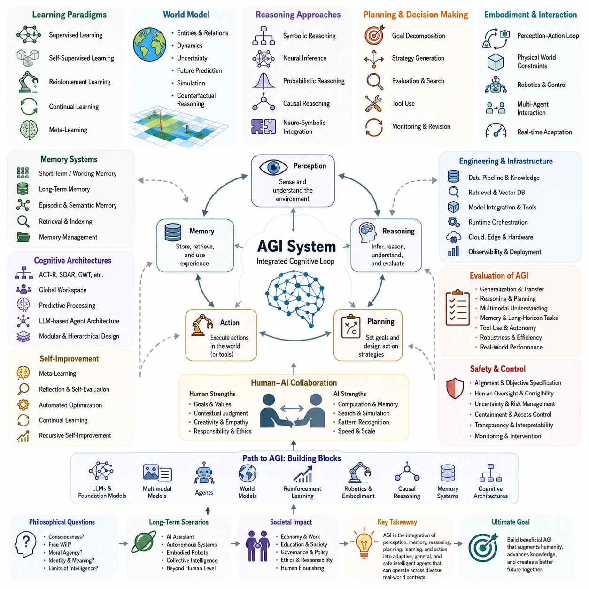
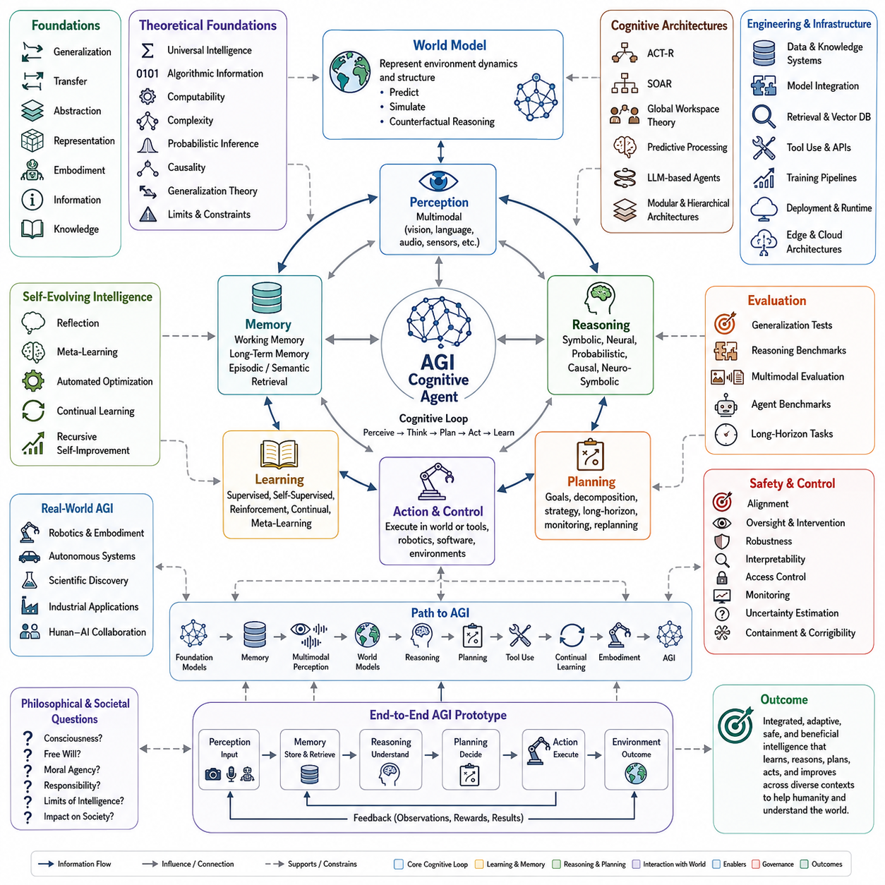
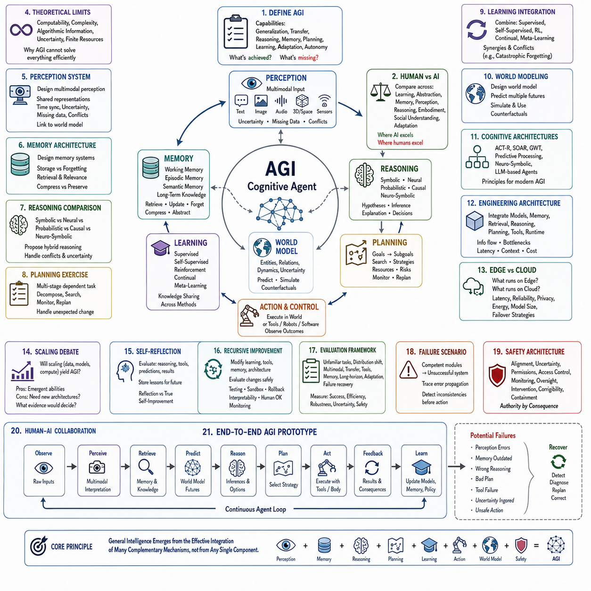
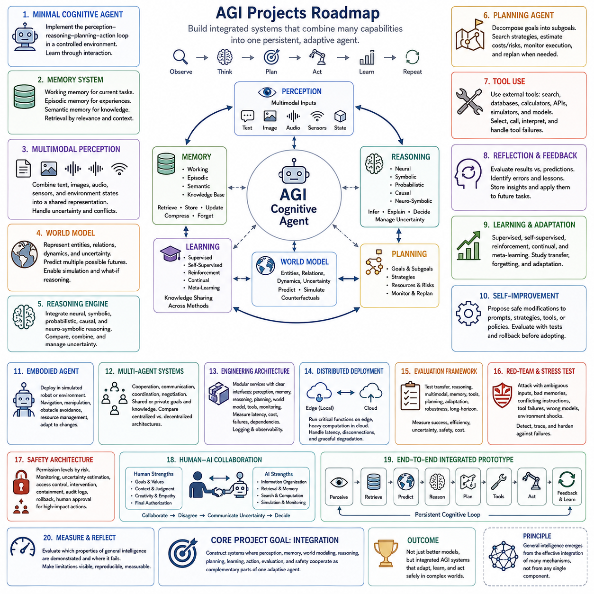

**Volume 47. Artificial General Intelligence**

# Chapter 12. Summary and Exercises

## 12.00. Key Takeaways

{width="7.268055555555556in" height="7.268055555555556in"}

인공일반지능(Artificial General Intelligence, AGI)은 하나의 알고리즘(algorithm), 모델(model), 또는 벤치마크(benchmark) 성과로 이해해서는 안 되며, 다양한 환경과 과제에서 인식(perception), 학습(learning), 추론(reasoning), 기억(memory), 계획(planning), 행동(action), 적응(adaptation)을 통합적으로 수행하는 능력으로 이해해야 한다. 따라서 핵심 과제는 시스템 수준 지능(system-level intelligence)을 구현하는 것이며, 개별 능력들은 서로 일관되게 협력하면서도 학습 과정에서 명시적으로 경험하지 못한 상황을 처리할 수 있을 만큼 유연해야 한다.

일반화(generalization)는 협소한 능력(narrow competence)과 일반지능(general intelligence)을 구분하는 핵심적인 특성 가운데 하나이다. AGI 시스템은 고정된 데이터 분포(data distribution)나 특정 행동에 의존하는 대신, 과제와 도메인(domain), 모달리티(modality), 환경을 넘어 지식을 전이(transfer)할 수 있어야 한다. 효과적인 일반화를 위해서는 유용한 표현(representation), 추상화(abstraction), 조합적 지식(compositional knowledge), 인과적 이해(causal understanding), 그리고 관찰된 데이터의 본질적 구조와 우연한 상관관계를 구분하는 메커니즘(mechanism)이 필요하다.

지능(intelligence)은 또한 인식(perception), 내부 표현(internal representation), 추론(reasoning), 계획(planning), 행동(action)의 지속적인 상호작용에 의존한다. 인식은 원시 관측(raw observation)을 의미 있는 상태 표현(state representation)으로 변환하고, 추론은 그로부터 함의를 도출하고 대안을 평가한다. 계획은 목표를 가능한 행동 순서로 변환하며, 제어(control)는 피드백(feedback)에 대응하면서 행동을 실행한다. AGI는 이러한 기능들이 독립적으로 작동하는 것이 아니라 서로 연결된 인지 루프(cognitive loop)를 통해 조정될 때 나타난다.

기억(memory)은 이러한 인지 루프(cognitive loop)에 연속성을 제공한다. 단기 기억(short-term memory)과 작업 기억(working memory)은 즉각적인 추론에 필요한 정보를 유지하고, 장기 기억(long-term memory)은 지식, 경험, 절차, 학습된 관계를 보존한다. 검색 메커니즘(retrieval mechanism)은 필요할 때 관련 정보를 사용할 수 있도록 한다. 유능한 일반 에이전트(general agent)는 무엇을 기억하고 무엇을 잊을 것인지, 기억을 어떻게 조직할 것인지, 과거 경험을 활용하면서도 미래 행동을 지나치게 제한하지 않는 방법을 결정할 수 있어야 한다.

AGI에서 학습(learning)은 전통적인 지도학습(supervised learning)을 넘어선다. 자기지도학습(self-supervised learning)은 방대한 비라벨 경험에서 구조를 발견할 수 있으며, 강화학습(reinforcement learning)은 행동과 그 결과를 연결한다. 지속학습(continual learning)은 배포 이후에도 적응할 수 있도록 하고, 메타학습(meta-learning)은 보다 효율적으로 학습하는 방법 자체를 발전시킨다. 이러한 학습 패러다임(paradigm)은 상호 보완적이며, 일반지능은 필요한 지식과 환경, 피드백, 적응 방식에 따라 이들을 결합할 수 있는 구조를 요구한다.

월드 모델(world model)은 인식(perception)과 지능적 행동(intelligent action)을 연결하는 중요한 다리를 제공한다. 에이전트(agent)는 개체(entity), 관계(relationship), 동역학(dynamics), 불확실성(uncertainty), 가능한 미래 상태에 대한 내부 표현을 유지함으로써 실제로 행동하기 전에 결과를 추론할 수 있다. 이러한 모델은 예측(prediction), 시뮬레이션(simulation), 계획(planning), 반사실적 추론(counterfactual reasoning), 탐색(exploration)을 지원한다. 특히 체화형 AGI(embodied AGI)에서는 물리적 제약, 시간적 동역학, 다른 에이전트, 불완전한 관측을 고려해야 하므로 월드 모델링(world modeling)이 더욱 중요하다.

일반지능에서 추론(reasoning)은 하나의 기호적(symbolic) 또는 신경망 기반(neural) 메커니즘으로 축소될 수 없다. 기호적 방법(symbolic methods)은 명시적인 구조와 규칙, 조합적 조작을 제공하고, 신경망 기반 접근(neural approaches)은 강력한 표현학습(representation learning)과 패턴 기반 추론(pattern-based inference)을 제공한다. 확률적(probabilistic) 및 인과적(causal) 방법은 불확실성 관리와 개입 결과에 대한 설명을 제공한다. 따라서 신경기호형(neuro-symbolic) 및 하이브리드 아키텍처(hybrid architecture)는 학습된 표현과 구조화되고 제어 가능한 추론을 결합하는 중요한 방향이다.

계획(planning)은 지능을 수동적인 예측(passive prediction)에서 목표지향적 행동(goal-directed behavior)으로 전환한다. 자율 에이전트(autonomous agent)는 복잡한 목표를 분해하고, 중간 목표를 식별하며, 대안 전략을 비교하고, 비용과 위험을 추정하고, 도구(tool)를 사용하며, 실행 상태를 감시하고, 가정이 실패하면 계획을 수정할 수 있어야 한다. 장기 과제(long-horizon task)는 계획과 기억이 함께 작동해야 하는 이유를 보여준다. 초기 결정이 훨씬 이후의 기회와 제약에 영향을 줄 수 있기 때문에 지속적인 상태 추적과 평가가 필요하다.

체화(embodiment)는 지능이 수동적인 데이터 처리만이 아니라 환경과의 상호작용을 통해 발달할 수 있음을 강조한다. 물리적 또는 시뮬레이션 에이전트(simulated agent)는 자신의 행동으로 발생한 결과를 관찰하고 인식, 행동, 환경 동역학 사이의 관계를 학습한다. 따라서 로보틱스(robotics)는 AGI를 검증하는 중요한 시험 환경을 제공한다. 실제 로봇 환경에서는 불확실성, 부분 관측(partial observability), 실시간 제약(real-time constraint), 안전 요구사항, 물리적 인과관계(physical causality), 지속적으로 변화하는 조건을 동시에 다루어야 하기 때문이다.

인지 아키텍처(cognitive architecture)는 서로 분리된 능력들을 통합하기 위한 조직 원리를 제공한다. ACT-R과 SOAR 같은 고전적 아키텍처는 기억, 목표, 규칙, 인지 과정이 어떻게 조정될 수 있는지를 보여주며, 글로벌 작업공간(global workspace)과 예측처리(predictive processing)는 정보 통합에 대한 다른 관점을 제공한다. 현대의 대규모 언어 모델 기반 에이전트(LLM-based agent)와 멀티모달 에이전트(multimodal agent)는 학습된 표현, 외부 도구, 검색 시스템, 계획 모듈, 유연한 에이전트 루프(agent loop)를 통해 이러한 개념을 확장한다.

AGI 엔지니어링(engineering AGI)은 충분히 큰 모델을 선택하는 것보다 훨씬 많은 것을 요구한다. 데이터 파이프라인(data pipeline), 지식 시스템(knowledge system), 메모리 인프라(memory infrastructure), 검색(retrieval), 모델 통합(model integration), 도구 인터페이스(tool interface), 런타임 오케스트레이션(runtime orchestration), 관측가능성(observability), 하드웨어 자원, 배포 아키텍처(deployment architecture)가 모두 실질적인 지능 성능에 영향을 준다. 엣지(edge)와 클라우드(cloud)는 상호 보완적으로 사용될 수 있으며, 지연시간에 민감한 인식과 제어는 로컬에서, 고비용 추론과 학습, 시뮬레이션, 지식 서비스는 대규모 분산 인프라에서 수행할 수 있다.

스케일링(scaling)은 현대 AI의 성능을 크게 향상시켰지만, 규모 자체가 일반지능의 달성을 의미하지는 않는다. 더 많은 파라미터(parameter), 데이터, 계산 자원은 표현, 추론, 창발적 능력(emergent capability)을 향상시킬 수 있지만, 신뢰성(reliability), 인과적 이해, 장기 자율성(long-horizon autonomy), 지속적인 적응, 현실에 기반한 월드 모델링, 강건한 일반화(robust generalization)에는 여전히 한계가 존재한다. 따라서 AGI로의 발전에는 지속적인 스케일링과 함께 아키텍처 및 알고리즘 수준의 돌파구가 필요할 수 있다.

자기개선(self-improvement)은 일반지능에 또 다른 차원을 제공한다. 메타학습(meta-learning), 자기성찰(reflection), 자동 최적화(automated optimization), 지속학습(continual learning), 자기평가(self-evaluation)는 시스템이 시간이 지나면서 자신의 전략과 내부 프로세스를 개선하도록 할 수 있다. 재귀적 자기개선(recursive self-improvement)은 개선된 시스템이 다시 더 나은 개선을 만들어낼 능력을 높이는 훨씬 강력한 개념이다. 이러한 메커니즘은 큰 가능성을 제공하지만 동시에 검증(verification), 안정성(stability), 정렬(alignment), 제어(control)를 더욱 중요하게 만든다.

따라서 AGI 평가(evaluation)는 개별 벤치마크 점수를 넘어야 한다. 신뢰할 수 있는 평가 프레임워크(evaluation framework)는 전이(transfer), 적응(adaptation), 추론, 멀티모달 이해(multimodal understanding), 기억, 계획, 도구 사용, 자율성, 강건성(robustness), 효율성, 장기 과제 수행능력을 함께 평가해야 한다. 또한 암기된 능력이 실제 일반화처럼 보일 수 있으므로 낯선 상황과 분포 변화(distribution shift)도 시험해야 한다. 궁극적으로 실제 환경에서의 성능은 능력(capability)뿐만 아니라 신뢰할 수 있는 행동(dependable behavior)을 요구한다.

안전(safety)과 제어(control)는 지능 시스템을 완성한 뒤 추가할 수 있는 외부 기능이 아니다. 이는 아키텍처, 학습, 배포, 모니터링(monitoring), 적응 과정 전체에서 고려되어야 한다. 자율성이 증가하면 목표 명세(objective specification), 의도하지 않은 전략, 불확실성, 인간 감독(human oversight), 교정 가능성(corrigibility), 도구 접근권한, 영향력이 큰 행동의 통제와 같은 문제가 발생한다. 따라서 더 강력한 시스템일수록 검증, 격리(containment), 투명성(transparency), 개입(intervention)을 위한 더욱 강력한 메커니즘이 필요하다.

인간-AI 협업(human--AI collaboration)은 협소한 자동화와 무제한 자율성 사이의 실용적인 발전 경로를 제공한다. 인간은 목표, 가치, 맥락적 판단(contextual judgment), 책임, 사회적 이해를 제공하고, AI 시스템은 계산, 기억, 탐색, 시뮬레이션, 패턴 인식, 빠른 분석 능력을 제공한다. 효과적인 협업을 위해서는 권한(authority)과 능력(capability)을 적절하게 배분해야 한다. 목표는 단순히 인간의 활동을 대체하는 것이 아니라 인간과 기계의 강점이 서로 보완되는 시스템을 설계하는 것이다.

현재의 AI에서 AGI로 향하는 경로가 하나의 보편적으로 인정되는 돌파구나 일정에 의존할 가능성은 낮다. 대규모 언어 모델(large language model), 멀티모달 파운데이션 모델(multimodal foundation model), 에이전트(agent), 월드 모델(world model), 강화학습(reinforcement learning), 로보틱스(robotics), 인과적 추론(causal reasoning), 메모리 시스템(memory system), 인지 아키텍처(cognitive architecture)는 각각 문제의 서로 다른 부분을 해결한다. 연구의 핵심은 이들을 일관되고 적응적이며 계산적으로 실용적이고 안전한 하나의 시스템으로 통합하는 방법을 이해하는 것이다.

종단간 AGI 프로토타입(end-to-end AGI prototype)은 이러한 통합 문제를 구체적으로 보여준다. 인식(perception)은 관측을 사용 가능한 표현으로 변환하고, 기억(memory)은 관련 맥락을 보존하며, 추론(reasoning)은 현재 상황을 해석하고, 계획(planning)은 행동을 결정하며, 에이전트 루프(agent loop)는 실행과 피드백을 조정한다. 통합 과정에서는 표현 불일치, 지연시간(latency), 상충하는 목표, 메모리 오염(memory contamination), 연쇄 오류(cascading error), 도구 실패, 추론과 행동 사이의 불안정한 피드백처럼 개별 모듈에서는 드러나지 않는 문제가 나타난다.

따라서 AGI는 머신러닝(machine learning), 인지과학(cognitive science), 신경과학 기반 아이디어(neuroscience-inspired ideas), 로보틱스(robotics), 제어(control), 정보이론(information theory), 인과성(causality), 소프트웨어 엔지니어링(software engineering), 철학(philosophy)을 연결하는 진화하는 시스템 학문(evolving systems discipline)으로 이해해야 한다. 어떤 하나의 학문도 일반지능을 완전하게 설명하지 못하며, 이들을 통합함으로써 지능적 행동을 어떻게 구성할 수 있는지뿐만 아니라 계산, 표현, 물리적 체화, 불확실성, 복잡한 환경과의 상호작용에서 어떤 한계가 발생하는지도 이해할 수 있다.

AGI를 둘러싼 철학적 질문은 그 공학적 결과와 분리할 수 없다. 지능(intelligence)이 자동적으로 의식(consciousness), 주관적 경험(subjective experience), 자유의지(free will), 도덕적 행위주체성(moral agency), 인간과 유사한 인지(human-like cognition)를 의미하는 것은 아니다. 첨단 시스템을 논의할 때 이러한 개념들을 신중하게 구분해야 한다. 동시에 점점 더 자율적인 에이전트는 책임, 권리, 통제, 인간 정체성(human identity), 경제적 조직, 미래 사회에서 지능형 기계가 차지할 역할에 대한 실질적인 질문을 제기한다.

장기 시나리오(long-term scenario)는 인간이 통제하는 고성능 보조 시스템에서부터 자율 과학 시스템(autonomous scientific system), 체화된 범용 로봇(embodied general-purpose robot), 집단 기계지능(collective machine intelligence), 그리고 여러 영역에서 인간의 능력을 넘어설 가능성이 있는 지능에 이르기까지 다양하다. 이러한 결과 가운데 어느 것도 필연적인 것으로 간주해서는 안 된다. 그 가능성과 영향은 기술 발전, 경제적 인센티브(economic incentive), 거버넌스(governance), 안전 연구, 배포 방식, 사회적 적응에 따라 달라진다. 따라서 미래 예측은 잘못된 정밀성(false precision)이 아니라 시나리오와 불확실성을 중심으로 표현되어야 한다.

가장 중요한 핵심은 AGI가 단순히 "더 큰 AI(larger AI)"가 아니라는 점이다. AGI는 특화된 패턴 해결 시스템(specialized pattern-solving system)에서 벗어나 변화하는 맥락 속에서 지식, 경험, 추론, 학습, 계획, 행동을 통합할 수 있는 에이전트로의 전환을 의미한다. 이러한 전환을 달성하려면 능력(capability)과 아키텍처(architecture) 모두의 발전이 필요하며, 엄격한 평가와 안전 역시 함께 발전해야 한다. 궁극적으로 AGI를 이해한다는 것은 여러 형태의 지능이 어떻게 하나의 일관되고 적응적인 시스템(coherent adaptive system)으로 통합될 수 있는지를 이해하는 것이다.

## 12.01. Concept Map

{width="7.268055555555556in" height="7.268055555555556in"}

인공일반지능(Artificial General Intelligence, AGI)의 개념도(concept map)는 지능을 개별적인 모델 능력이 아니라 통합된 적응형 시스템(integrated adaptive system)으로 이해하는 것에서 시작한다. 중심에는 인식(perception), 기억(memory), 추론(reasoning), 계획(planning), 학습(learning), 행동(action)을 지속적으로 연결하는 인지 에이전트(cognitive agent)가 존재한다. 이러한 기능들은 관측이 내부 표현을 변화시키고, 내부 표현이 의사결정을 이끌며, 행동이 다시 새로운 관측과 경험을 만들어내는 폐쇄형 상호작용 루프(closed interaction loop)를 형성한다.

기초 계층(foundational layer)은 AGI를 일반화(generalization), 전이(transfer), 추상화(abstraction), 표현(representation), 체화(embodiment), 월드 모델링(world modeling), 정보(information), 지식(knowledge)과 연결한다. 일반화는 이전에 경험하지 않은 사례까지 능력을 확장하며, 전이는 한 맥락에서 학습한 지식을 다른 맥락에서 활용할 수 있게 한다. 추상화는 경험을 재사용 가능한 개념으로 압축하고, 표현은 객체, 사건, 목표, 행동 사이의 관계를 내부적으로 조작할 수 있는 구조를 제공한다.

이론적 분기(theoretical branch)는 일반지능을 학습과 의사결정에 관한 형식적 모델(formal model)과 연결한다. 보편지능 척도(universal intelligence measure), 알고리즘 정보(algorithmic information), 계산가능성(computability), 복잡도(complexity), 확률적 추론(probabilistic inference), 인과성(causality), 일반화 이론(generalization theory)은 지능 시스템이 무엇을 학습하고 수행할 수 있는지에 대한 서로 다른 측면을 설명한다. 이러한 이론은 또한 지능이 계산, 정보, 불확실성, 이용 가능한 경험, 환경 복잡성이라는 제약 아래 작동한다는 근본적 한계를 보여준다.

인식(perception)은 에이전트(agent)와 환경(environment)을 연결하는 주요 접점을 형성한다. 멀티모달 인식(multimodal perception)은 언어, 시각, 음향, 공간 정보, 센서 측정값과 기타 관측을 공유되거나 상호 조정된 표현으로 결합할 수 있다. 따라서 인식은 단순한 인식(recognition)에 그치지 않는다. 인식은 기억, 추론, 예측, 계획에 필요한 상태 정보를 생성하는 동시에 변화하는 외부 세계에 대한 에이전트의 해석을 지속적으로 갱신한다.

기억(memory)은 현재의 인지와 과거 경험을 연결한다. 작업 기억(working memory)은 현재의 추론과 계획에 필요한 정보를 유지하고, 장기 기억(long-term memory)은 장기간에 걸쳐 지식과 경험을 보존한다. 일화 정보(episodic information)는 사건과 상호작용을 기록하는 반면, 의미 정보(semantic information)는 보다 일반적인 지식을 표현한다. 검색(retrieval)은 현재의 맥락, 문제 또는 목표에 따라 관련 정보를 선택함으로써 이러한 기억 구조를 인지 루프(cognitive loop)와 연결한다.

추론(reasoning)은 저장되거나 인식된 정보를 결론, 설명, 가설, 가능한 의사결정으로 변환한다. 기호적 추론(symbolic reasoning)은 명시적인 규칙과 구조화된 조작을 제공하고, 신경망 기반 추론(neural reasoning)은 학습된 표현과 유연한 패턴 추론을 제공하며, 확률적 추론(probabilistic reasoning)은 불확실성을 다룬다. 인과적 추론(causal reasoning)은 개입과 결과에 대한 모델을 추가한다. 신경기호적 접근(neuro-symbolic approach)은 이러한 강점들을 보다 일반적인 추론 아키텍처 안에서 결합하려 한다.

계획(planning)은 추론을 목적지향적 행동(purposeful action)과 연결한다. 목표(goal)는 원하는 미래 조건을 정의하며, 계획기(planner)는 목표에 도달하기 위해 필요한 중간 상태, 행동, 자원, 제약조건, 대안 전략을 식별한다. 단기 계획(short-term planning)은 즉각적인 조건에 직접 대응할 수 있지만, 장기 계획(long-horizon planning)은 여러 의사결정에 걸쳐 목표와 의존성을 유지해야 한다. 실행에서 발생한 피드백은 다시 계획기로 전달되어 예측이나 가정이 실패했을 때 모니터링, 재계획(replanning), 수정을 가능하게 한다.

행동과 제어(action and control)는 인식-인지-행동 루프(perception--cognition--action loop)를 완성한다. 의사결정은 궁극적으로 소프트웨어 환경, 외부 도구, 다른 에이전트, 시뮬레이션 세계 또는 물리 시스템에 영향을 주는 동작으로 변환되어야 한다. 체화지능(embodied intelligence)에서 제어는 동역학, 불확실성, 시간, 안전, 물리적 제약을 고려해야 한다. 그 결과 발생한 환경 변화는 새로운 관측을 생성하고, 시스템은 예상된 결과와 실제 결과를 비교하여 내부 모델을 갱신할 수 있다.

학습(learning)은 하나의 모듈에만 위치하는 것이 아니라 전체 인지 루프를 둘러싼다. 지도학습(supervised learning)은 라벨이 지정된 사례에서 매핑 관계를 추출하고, 자기지도학습(self-supervised learning)은 라벨이 없는 경험에서 구조를 발견하며, 강화학습(reinforcement learning)은 상호작용과 결과를 통해 행동을 개선한다. 지속학습(continual learning)은 초기 학습 이후에도 적응을 가능하게 하고, 메타학습(meta-learning)은 미래의 학습을 더욱 빠르게 수행하는 메커니즘을 발전시킨다. 이들은 함께 축적된 경험을 통해 지능 자체가 변화할 수 있도록 한다.

월드 모델(world model)은 환경이 어떻게 작동하는지에 대한 표현을 통해 인식, 기억, 추론, 학습, 계획을 연결한다. 월드 모델은 객체, 에이전트, 공간적 관계, 시간적 동역학, 불확실성, 가능한 미래 상태를 표현할 수 있다. 예측(prediction)은 다음에 발생할 가능성이 있는 상태를 추정하고, 시뮬레이션(simulation)은 대안적인 궤적을 탐색하며, 반사실적 추론(counterfactual reasoning)은 다른 행동을 선택했을 때 발생할 수 있는 결과를 검토한다. 따라서 계획은 실제 행동을 실행하기 전에 내부적으로 여러 가능성을 평가할 수 있다.

인지 아키텍처(cognitive architecture)는 이러한 메커니즘들을 일관된 시스템으로 조직한다. ACT-R과 SOAR 같은 고전적 접근은 구조화된 인지 과정을 강조하며, 글로벌 작업공간 이론(Global Workspace Theory)은 선택적인 정보 통합과 전역적 전달을 통해 지능을 설명한다. 예측처리(predictive processing)는 지속적인 예측과 오류 수정을 강조한다. 현대의 대규모 언어 모델 기반 에이전트(LLM-based agent)는 파운데이션 모델(foundation model)을 기억, 검색, 도구, 계획기, 외부 지식, 에이전트 제어 루프와 통합함으로써 이러한 아키텍처 공간을 확장한다.

엔지니어링(engineering)은 AGI 개념도의 또 다른 주요 분기를 구성한다. 데이터 및 지식 시스템은 정보를 공급하고, 모델 통합(model integration)은 전문화된 능력들을 연결하며, 검색은 외부 맥락을 제공하고, 도구 사용 인터페이스(tool-use interface)는 에이전트가 수행할 수 있는 작업 범위를 확장한다. 학습 파이프라인(training pipeline)은 기반 모델을 개발하고, 배포 및 런타임 시스템(deployment and runtime system)은 실제 동작 중 이들을 조정한다. 엣지(edge)와 클라우드(cloud) 아키텍처는 지연시간, 대역폭, 개인정보보호, 신뢰성, 자원 요구사항에 따라 계산을 분산한다.

자기진화 지능(self-evolving intelligence)은 일반적인 학습을 넘어 자신의 행동을 평가하고 수정할 수 있는 시스템으로 확장된다. 자기성찰(reflection)은 에이전트가 이전의 추론이나 행동을 검토할 수 있게 하고, 메타학습(meta-learning)은 적응 전략을 개선하며, 자동 최적화(automated optimization)는 더 나은 구성이나 절차를 탐색할 수 있다. 지속학습은 시간에 따른 적응을 유지한다. 재귀적 자기개선(recursive self-improvement)은 시스템의 개선이 이후의 추가적인 개선을 만들어내는 능력 자체를 향상시키는 더 강력한 가능성을 의미한다.

평가(evaluation)는 모든 능력을 측정 가능한 증거와 연결한다. 일반화 테스트(generalization test)는 익숙하지 않은 과제로의 전이를 평가하고, 추론 벤치마크(reasoning benchmark)는 문제해결 능력을 측정하며, 멀티모달 평가(multimodal evaluation)는 서로 다른 정보 유형의 통합을 검증한다. 에이전트 벤치마크(agent benchmark)는 상호작용과 도구 사용을 평가하고, 장기 과제(long-horizon task)는 기억, 계획, 지속성, 오류 복구 능력을 시험한다. AGI는 하나의 기술이 아니라 다차원적인 능력의 조합이므로 단일 점수만으로 충분히 평가할 수 없다.

안전과 제어(safety and control)는 능력 개발을 둘러싸는 병렬 구조를 형성한다. 정렬(alignment)은 시스템의 목표를 인간이 의도한 목표와 연결하고, 감독(oversight)은 관찰과 개입을 위한 메커니즘을 제공한다. 강건성(robustness)은 예상하지 못한 조건에서도 행동을 안정적으로 유지하도록 하고, 해석가능성(interpretability)은 내부 의사결정에 대한 이해를 향상시킨다. 시스템의 자율성, 도구 접근권한, 현실 세계에 대한 영향력이 증가할수록 접근 제어(access control), 모니터링, 불확실성 추정, 격리(containment), 교정 가능성(corrigibility)이 더욱 중요해진다.

현실 세계 AGI(real-world AGI)는 추상적인 지능을 로보틱스(robotics), 자율 시스템(autonomous system), 과학적 발견(scientific discovery), 산업 응용(industrial application), 인간-AI 협업(human--AI collaboration)과 연결한다. 로보틱스는 물리적 체화를 제공하고, 자율 시스템은 불확실성 속에서 지속적인 의사결정을 요구한다. 과학적 응용은 가설 생성, 추론, 실험, 발견을 강조한다. 산업 시스템은 신뢰성과 운영상의 제약을 추가하며, 협업은 기계의 능력과 인간의 판단, 가치, 책임, 맥락적 이해를 결합한다.

AGI로 향하는 경로(path to AGI)는 오늘날의 파운데이션 모델(foundation model)을 점점 더 강력한 에이전트, 지속적 기억(persistent memory), 멀티모달 인식, 월드 모델, 추론, 계획, 도구 사용, 지속학습, 체화와 연결한다. 계산 자원과 데이터의 스케일링(scaling)은 여러 개별 요소의 성능을 강화하지만, 이들을 효과적으로 연결하기 위해서는 아키텍처 혁신(architectural innovation)이 필요할 수 있다. 따라서 발전은 개별 능력의 수직적 향상과 서로 분리되어 있던 인지 메커니즘 사이의 수평적 통합을 동시에 포함하는 과정으로 이해해야 한다.

종단간 AGI 프로토타입(end-to-end AGI prototype)은 이러한 개념도를 실행 가능한 아키텍처(executable architecture)로 표현한다. 인식은 관측을 제공하고, 기억은 관련 맥락을 보존하며, 추론은 정보를 해석하고, 계획은 전략을 선택하며, 에이전트 루프(agent loop)는 도구와 행동을 조정한다. 이후 통합 과정은 행동 결과를 다시 기억과 학습으로 피드백한다. 이러한 구조는 AGI를 단순히 입력을 출력으로 변환하는 모델이 아니라 지속적으로 작동하는 시스템(continuously operating system)으로 접근할 수 있음을 보여준다.

철학적·사회적 질문(philosophical and societal questions)은 더 높은 수준의 지능이 기술적 성능을 넘어서는 결과를 만들어내기 때문에 개념도의 외곽 경계를 구성한다. 지능은 의식(consciousness), 자유의지(free will), 주관적 경험(subjective experience), 도덕적 행위주체성(moral agency)과 구별되어야 하지만, 점점 더 자율적인 시스템은 여전히 책임과 통제에 관한 문제를 제기한다. 이러한 시스템의 배포는 노동, 과학, 교육, 경제, 거버넌스, 안보, 문화, 인간과 지능형 기계 사이의 관계에 영향을 미칠 수 있다.

따라서 전체 개념도는 하나의 원리로 수렴한다. 바로 AGI가 통합(integration)을 통해 형성된다는 것이다. 기억이 없는 인식은 연속성을 갖지 못하고, 추론이 없는 기억은 경험을 효과적으로 활용할 수 없으며, 계획이 없는 추론은 장기 행동을 조직할 수 없고, 행동이 없는 계획은 세계에 영향을 미칠 수 없다. 학습은 이 모든 과정을 개선하고, 월드 모델은 예측을 통해 이들을 연결하며, 안전은 전체 시스템의 작동을 제약하고 조정한다. 일반지능(general intelligence)은 어느 하나의 구성요소가 아니라 이 모든 요소가 조정되어 작동하는 전체 시스템(coordinated whole)에서 출현한다.

## 12.02. Exercises

{width="7.268055555555556in" height="7.268055555555556in"}

먼저 인공일반지능(Artificial General Intelligence, AGI)에 대한 자신만의 조작적 정의(operational definition)를 구성해 보라. 인공지능 시스템을 협소지능(narrow intelligence)이 아니라 일반지능(general intelligence)으로 합리적으로 간주하기 위해 어떤 능력이 반드시 갖추어져야 하는지 설명하라. 일반화(generalization), 전이(transfer), 추론(reasoning), 기억(memory), 계획(planning), 학습(learning), 적응(adaptation), 자율성(autonomy)을 고려하고, 이러한 특성 중 현대 AI가 이미 부분적으로 보여주는 것과 여전히 주요 연구 과제로 남아 있는 것을 구분하라.

인간지능(human intelligence)과 현재의 인공지능(artificial intelligence)을 어느 한쪽도 단일하고 균일한 능력으로 간주하지 않으면서 비교해 보라. 학습 효율성(learning efficiency), 추상화(abstraction), 기억, 인식(perception), 추론, 체화(embodiment), 사회적 이해(social understanding), 적응 측면에서 차이를 분석하라. 기계가 이미 인간보다 뛰어난 상황과 인간이 여전히 훨씬 높은 유연성을 보이는 상황을 검토하고, 개별 과제에서 우수한 성능을 보이는 것이 반드시 일반지능을 의미하지 않는 이유를 설명하라.

AGI의 요구조건으로서 일반화(generalization)와 전이(transfer)를 분석해 보라. 여러 환경에서 학습된 에이전트(agent)가 대규모 재학습(retraining) 없이 상당히 다른 환경에서 작동해야 한다고 가정하라. 어떤 지식이 전이되어야 하고, 어떤 표현(representation)이 계속 유용할 수 있으며, 어떤 정보를 새롭게 학습해야 하는지 설명하라. 추상화, 조합성(compositionality), 인과 구조(causal structure), 사전 경험(prior experience)이 새로운 데이터의 필요량을 어떻게 줄일 수 있는지 고려하라.

계산가능성(computability), 복잡도(complexity), 알고리즘 정보(algorithmic information), 불확실성(uncertainty), 유한한 계산 자원(finite computational resources)과 같은 개념을 사용하여 일반지능의 이론적 한계를 검토하라. 매우 강력한 AGI라 하더라도 가능한 모든 문제를 효율적으로 해결할 수 없는 이유를 논의하라. 제한된 계산(bounded computation)이 지능의 실질적인 의미를 어떻게 변화시키는지, 그리고 자원 할당, 근사(approximation), 휴리스틱(heuristics), 선택적 주의(selective attention)가 지능적 행동의 근본적인 구성요소가 될 수 있는 이유를 고려하라.

멀티모달 AGI 에이전트(multimodal AGI agent)를 위한 개념적 인식 시스템(conceptual perception system)을 설계해 보라. 시스템이 언어, 이미지, 음향, 공간 정보, 연속적인 센서 관측을 입력받는다고 가정한다. 각 정보원에서 중요한 정보를 보존하면서 모달리티별 표현(modality-specific representation)을 공유된 내부 상태(shared internal state)로 어떻게 결합할 수 있는지 설명하라. 시간 동기화(temporal synchronization), 불확실성, 누락된 관측, 상충하는 증거, 인식과 월드 모델(world model)의 관계를 고려하라.

작업 기억(working memory), 일화 기억(episodic memory), 의미 기억(semantic memory), 장기 지식 저장소(long-term knowledge storage)를 포함하는 메모리 아키텍처(memory architecture)를 설계해 보라. 각 하위 시스템이 어떤 정보를 보존해야 하는지, 기억을 어떻게 검색해야 하는지, 관련성을 어떻게 판단해야 하는지 설명하라. 무제한 저장과 선택적 망각(selective forgetting)의 결과를 분석하고, 지능형 에이전트가 모든 경험을 보존해야 하는지 아니면 반복되는 경험을 보다 일반적인 지식과 재사용 가능한 추상화로 압축해야 하는지 고려하라.

기호적(symbolic), 신경망 기반(neural), 확률적(probabilistic), 인과적(causal), 신경기호적(neuro-symbolic) 추론 접근법을 동일한 복잡한 문제에 적용하여 비교해 보라. 각 접근법이 어떤 유형의 지식을 효과적으로 표현하고 어느 부분에서 어려움을 겪는지 판단하라. 이후 서로 다른 추론 메커니즘이 협력하는 하이브리드 추론 아키텍처(hybrid reasoning architecture)를 제안하라. 모듈 사이의 충돌을 어떻게 탐지할 수 있는지, 신뢰도(confidence)나 불확실성이 최종 의사결정에 어떻게 영향을 미칠 수 있는지 설명하라.

최종 목표를 달성하기 전에 서로 의존하는 여러 단계가 필요한 계획 문제(planning problem)를 설계해 보라. AGI 에이전트가 목표를 하위 목표(subgoal)로 분해하고, 대안 전략을 탐색하며, 위험과 자원을 추정하고, 실행 과정을 모니터링하는 방법을 설명하라. 실행 도중 예상하지 못한 환경 변화를 발생시킨 후, 에이전트가 불일치(discrepancy)를 탐지하고 자신의 믿음(belief)을 갱신하며 불필요하게 처음부터 다시 시작하지 않고 수정된 계획을 생성하는 방법을 설명하라.

지도학습(supervised learning), 자기지도학습(self-supervised learning), 강화학습(reinforcement learning), 지속학습(continual learning), 메타학습(meta-learning)이 하나의 AGI 아키텍처 안에서 어떻게 공존할 수 있는지 분석하라. 하나의 최선의 패러다임을 선택하기보다는 서로 다른 정보와 피드백 유형에 어떤 학습 방식이 적합한지 판단하라. 한 학습 과정에서 획득한 지식이 다른 학습 과정을 어떻게 향상시킬 수 있는지 설명하고, 치명적 망각(catastrophic forgetting)이나 불안정한 행동 적응과 같은 잠재적인 충돌을 식별하라.

동적 환경(dynamic environment)에서 작동하는 체화형 에이전트(embodied agent)를 위한 개념적 월드 모델(world model)을 구성해 보라. 표현해야 하는 개체(entity), 속성(property), 공간적 관계, 시간적 동역학(temporal dynamics), 불확실성, 에이전트 행동을 식별하라. 시스템이 하나의 결정론적 결과가 아니라 여러 개의 가능한 미래를 예측하는 방법을 설명하라. 이후 시뮬레이션(simulation)과 반사실적 추론(counterfactual reasoning)이 실제 행동을 실행하기 전에 대안 행동을 평가하는 데 어떻게 활용될 수 있는지 설명하라.

ACT-R, SOAR, 글로벌 작업공간 이론(Global Workspace Theory), 예측처리(predictive processing), 신경기호 시스템(neuro-symbolic system), 현대의 대규모 언어 모델 기반 에이전트(LLM-based agent) 아키텍처를 개념적 수준에서 비교해 보라. 각각이 정보, 기억, 추론, 목표, 행동을 어떻게 조직하는지에 초점을 맞추고, 파운데이션 모델(foundation model) 이전에 개발된 아키텍처라 하더라도 현대 AGI 엔지니어링에 여전히 유용한 아이디어를 식별하라. 이러한 원리 가운데 어떤 것들을 현대의 통합 인지 아키텍처(integrated cognitive architecture)에 포함할 수 있는지 제안하라.

파운데이션 모델(foundation model), 멀티모달 인식(multimodal perception), 기억, 검색(retrieval), 추론, 계획, 외부 도구(external tool), 에이전트 런타임(agent runtime)을 통합하는 AGI 시스템의 상위 수준 엔지니어링 아키텍처(high-level engineering architecture)를 설계해 보라. 구성요소 사이에서 교환되는 정보를 설명하고 잠재적인 병목지점(bottleneck)을 식별하라. 지연시간(latency), 컨텍스트 제한(context limitation), 메모리 일관성, 모델 간 불일치, 도구 실패, 계산 비용, 관측가능성(observability), 학습 인프라와 런타임 인프라의 차이를 고려하라.

체화형 AGI 시스템(embodied AGI system)을 위한 엣지(edge)와 클라우드(cloud) 계산의 트레이드오프(tradeoff)를 검토하라. 어떤 기능을 물리적 에이전트 가까이에 유지해야 하고 어떤 기능을 원격 계산 자원을 이용해 수행할 수 있는지 판단하라. 인식 지연시간, 실시간 제어, 네트워크 장애, 개인정보보호, 에너지 소비, 모델 크기, 분산 지식(distributed knowledge), 계산 요구량을 고려하고, 연결성이 불안정해지거나 클라우드 자원을 일시적으로 사용할 수 없을 때 아키텍처가 어떻게 동작해야 하는지 설명하라.

모델, 데이터셋(dataset), 계산 자원의 지속적인 스케일링(scaling)이 결국 AGI를 만들어낼 것이라는 주장을 평가하라. 이러한 가능성을 지지하는 논거와 새로운 아키텍처 또는 학습 패러다임이 추가로 필요하다는 논거를 각각 제시하라. 창발적 능력(emergent abilities), 추론 신뢰성, 월드 모델링, 인과적 이해, 지속학습, 체화, 장기 자율성(long-horizon autonomy)을 고려하고, 어느 입장을 실질적으로 강화할 수 있는 증거가 무엇인지 설명하라.

자율 에이전트(autonomous agent)를 위한 자기성찰 메커니즘(self-reflection mechanism)을 설계해 보라. 과제를 완료한 후 에이전트가 자신의 추론, 의사결정, 도구 사용, 예측, 최종 결과를 평가하도록 한다. 어떤 증거를 검토해야 하고 유용한 교훈을 미래 과제를 위해 어떻게 저장할 수 있는지 설명하라. 일반적인 자기성찰과 진정한 자기개선(self-improvement)을 구분하고, 자기성찰이 전략이나 내부 능력의 지속적인 변화를 만들어내기 위해 어떤 추가적인 메커니즘이 필요한지 설명하라.

재귀적 자기개선(recursive self-improvement)을 단순한 모델 성능 증가가 아니라 시스템 문제(systems problem)로 분석하라. 자신의 학습 절차, 도구, 메모리 구성 또는 소프트웨어 아키텍처의 일부를 수정할 수 있는 시스템을 고려하라. 제안된 변경사항을 실제 배포하기 전에 평가하기 위해 필요한 메커니즘을 식별하라. 회귀 테스트(regression testing), 샌드박싱(sandboxing), 롤백(rollback), 해석가능성(interpretability), 인간 승인(human authorization), 능력 모니터링(capability monitoring)이 점점 자율적으로 이루어지는 개선의 위험을 어떻게 감소시킬 수 있는지 논의하라.

벤치마크 답안을 단순히 암기하는 것만으로 통과할 수 없는 AGI 평가 프레임워크(evaluation framework)를 설계해 보라. 익숙하지 않은 과제, 분포 변화(distribution shift), 멀티모달 문제, 전이, 도구 사용, 기억, 장기 계획, 적응, 실패 복구를 포함하라. 여러 차원에 걸쳐 성능을 측정하는 방법과 종합 점수(aggregate score)가 중요한 약점을 숨길 수 있는 이유를 설명하라. 단순한 과제 성공률뿐만 아니라 효율성, 강건성(robustness), 불확실성 인식(uncertainty awareness), 안전도 함께 포함하라.

개별적으로는 유능한 AGI 모듈들이 전체적으로는 실패하는 시스템을 만들어내는 실패 시나리오(failure scenario)를 구성해 보라. 예를 들어 인식 모듈이 환경을 정확히 인식하지만 기억이 오래된 정보를 검색하고, 추론은 그럴듯한 결론을 형성하며, 계획 모듈이 부적절한 행동을 선택할 수 있다. 오류가 인지 루프(cognitive loop)를 통해 어떻게 전파되는지 추적하고, 이러한 불일치가 중대한 행동으로 이어지기 전에 탐지할 수 있는 모니터링 메커니즘(monitoring mechanism)을 제안하라.

점점 더 자율적으로 작동하는 에이전트를 위한 안전 아키텍처(safety architecture)를 설계해 보라. 목표 명세(objective specification), 정렬(alignment), 불확실성 추정, 도구 권한(tool permission), 접근 제어(access control), 모니터링, 인간 감독(human oversight), 개입(intervention), 교정 가능성(corrigibility), 격리(containment)를 고려하라. 행동이 초래할 수 있는 잠재적인 결과의 심각도에 따라 시스템의 권한이 어떻게 변화해야 하는지 설명하고, 일반적인 조건에서 우수하게 작동하는 시스템이라도 드물고 낯설거나 영향력이 큰 상황에서는 독립적인 안전장치가 필요한 이유를 분석하라.

인간이나 현재의 AI 시스템 어느 한쪽만으로는 완벽하게 수행하기 어려운 복잡한 과제를 선택하여 인간-AI 협업(human--AI collaboration)을 분석하라. 인간의 가치와 맥락적 판단, 기계의 탐색, 기억, 계산, 시뮬레이션처럼 상호 보완적인 강점에 따라 책임을 분배하라. 의견 충돌을 어떻게 처리하고 불확실성을 어떻게 전달해야 하는지 설명하라. 인간이 최종 의사결정권자(final decision maker)로 남아야 하는 경우와 자동화된 실행(automated execution)이 적절한 경우를 함께 고려하라.

마지막으로 인식(perception), 기억(memory), 추론(reasoning), 계획(planning), 학습(learning), 행동(action), 월드 모델(world model), 안전 메커니즘(safety mechanism)을 하나의 연속적인 에이전트 루프(continuous agent loop) 안에 결합한 종단간 개념적 AGI 프로토타입(end-to-end conceptual AGI prototype)을 설계해 보라. 최초 관측에서 해석, 검색, 예측, 의사결정, 실행, 피드백, 학습에 이르기까지 정보의 흐름을 추적하고, 실패가 발생할 수 있는 위치와 시스템이 이를 복구하는 방법을 식별하라. 이 연습을 통해 이 책의 핵심 원칙을 평가하라. 일반지능(general intelligence)은 하나의 지배적인 구성요소가 아니라 서로 보완적인 여러 메커니즘의 효과적인 통합에 의존한다.

## 12.03. Projects [w/Code]

{width="7.268055555555556in" height="7.268055555555556in"}

이 절의 프로젝트(project)는 인공일반지능(Artificial General Intelligence, AGI)의 이론적·아키텍처적 원리를 통합된 실제 작동 시스템으로 전환하는 것을 목표로 한다. 하나의 벤치마크(benchmark)를 위해 하나의 모델만 최적화하는 대신, 각 프로젝트는 인식(perception), 기억(memory), 추론(reasoning), 계획(planning), 학습(learning), 도구 사용(tool use), 행동(action)과 같은 여러 능력을 결합해야 한다. 핵심은 개별적으로 유용한 구성요소들이 하나의 지속적인 에이전트(persistent agent) 내부에서 함께 작동할 때 지능이 어떻게 변화하는지를 이해하는 것이다.

적절한 시작 프로젝트는 완전한 인식-추론-계획-행동 루프(perception--reasoning--planning--action loop)를 구현하는 최소 인지 에이전트(minimal cognitive agent)이다. 시스템은 통제된 환경에서 관측을 입력받고 내부 상태를 구성하며, 목표를 결정하고 행동을 선택한 다음 그로 인한 변화를 관찰한다. 단순한 모델을 사용하더라도 이 프로젝트는 지능이 고립된 입력-출력 예측이 아니라 에이전트와 환경 사이의 반복적인 상호작용에 의존한다는 AGI의 핵심 원리를 보여준다.

이 최소 에이전트에는 지속적 기억(persistent memory)을 추가하여 확장할 수 있다. 작업 기억(working memory)은 현재 과제 수행에 필요한 정보를 유지하고, 장기 저장소(long-term storage)는 여러 세션에 걸쳐 유용한 지식을 보존해야 한다. 일화 기억(episodic memory)은 이전 상호작용과 결과를 기록하고, 의미 기억(semantic memory)은 일반화된 지식을 유지할 수 있다. 검색(retrieval)은 현재 상황에 적합한 정보를 선택하도록 구성하여 기억의 관련성, 망각(forgetting), 압축(compression), 잘못된 검색의 영향을 실험할 수 있다.

멀티모달 인식 프로젝트(multimodal perception project)는 여러 형태의 관측을 에이전트 아키텍처(agent architecture)에 도입할 수 있다. 텍스트, 이미지, 음향, 시뮬레이션 센서 측정값 또는 구조화된 환경 상태를 각각 인코딩한 후 공유 표현(shared representation)으로 결합할 수 있다. 목표는 단순한 멀티모달 분류(multimodal classification)가 아니라 이후의 추론과 계획을 지원할 수 있는 일관된 상태를 구성하는 것이다. 상충되거나 불완전하고 지연되며 불확실한 관측 역시 시험해야 한다.

월드 모델 프로젝트(world-model project)는 이러한 인식 시스템을 상태 추정(state estimation)에서 예측(prediction)으로 확장할 수 있다. 에이전트는 개체(entity), 관계(relationship), 행동, 환경 동역학(environmental dynamics), 불확실성에 대한 표현을 유지하고 환경이 어떻게 변화할지를 추정해야 한다. 하나의 미래만 예측하는 대신 여러 개의 가능한 궤적(trajectory)을 생성할 수 있으며, 행동하기 전에 이러한 미래를 비교함으로써 표현학습, 예측, 시뮬레이션, 의사결정을 실질적으로 연결할 수 있다.

추론 프로젝트(reasoning project)는 하나 이상의 추론 메커니즘(inference mechanism)을 통합해야 한다. 신경망 모델(neural model)은 비정형 정보를 해석하고, 명시적인 규칙이나 구조화된 표현은 제약조건을 적용하며 결정론적 추론을 수행할 수 있다. 확률적 메커니즘(probabilistic mechanism)은 불확실성을 표현하고, 인과 구조(causal structure)는 개입과 결과에 관한 질문을 지원한다. 프로젝트에서는 각 메커니즘이 언제 일치하거나 충돌하는지, 그리고 불확실성을 숨기지 않으면서 결론을 선택하거나 결합하는 방법을 검토해야 한다.

계획 에이전트(planning agent)는 여러 개의 상호 의존적인 행동이 필요한 목표를 받아들이도록 이러한 추론 계층을 확장할 수 있다. 계획기(planner)는 목표를 분해하고 후보 전략을 생성하며, 비용과 위험을 추정하고, 행동을 선택하고, 실행을 모니터링하며, 조건이 변경되면 재계획(replanning)해야 한다. 시험 과정에서는 의도적으로 예상하지 못한 사건을 발생시켜야 한다. 중요한 결과는 최초 계획의 성공 여부가 아니라 에이전트가 실패를 인식하고 전체 목표를 잃지 않은 상태에서 적응할 수 있는지 여부이다.

도구 사용(tool use)은 일반 에이전트가 외부 시스템을 통해 자신의 능력을 확장하는 경우가 많기 때문에 또 하나의 중요한 프로젝트 영역을 제공한다. 도구 사용 에이전트(tool-enabled agent)는 검색 기능, 데이터베이스(database), 계산기, 소프트웨어 인터페이스, 시뮬레이터(simulator), 전문 모델에 접근할 수 있다. 에이전트는 도구가 필요한 시점을 판단하고 적절한 도구를 선택하며, 유효한 요청을 생성하고, 반환된 결과를 해석하여 추론에 반영해야 한다. 도구 오류와 서비스 사용 불가능 상태 역시 정상적인 운영 조건으로 취급해야 한다.

자기성찰 프로젝트(reflection project)는 각 과제가 완료된 이후 평가 단계를 추가할 수 있다. 에이전트는 자신이 예측한 결과와 실제 관측 결과를 비교하고, 잘못된 가정, 비효율적인 행동, 실패한 도구 호출(tool call), 유용한 전략을 식별해야 한다. 이후 이러한 교훈을 기억에 저장하여 미래의 과제에서 검색할 수 있다. 유사한 과제를 반복함으로써 자기성찰이 측정 가능한 성능 향상을 만들어내는지, 아니면 이후 행동을 변화시키지 않는 설명만 생성하는지를 검토할 수 있다.

지속학습(continual learning)은 고정된 데이터셋으로 한 번 학습하는 대신 에이전트를 연속적인 환경이나 과제 집합에 노출시켜 연구할 수 있다. 시스템은 기존 능력을 유지하면서 새로운 능력을 습득해야 한다. 실험을 통해 전이(transfer), 간섭(interference), 치명적 망각(catastrophic forgetting), 적응 속도(adaptation speed)를 측정할 수 있다. 이후 재현(replay), 정규화(regularization), 모듈형 구성요소(modular component), 메모리 기반 학습, 선택적 파라미터 갱신을 장기적인 능력 유지 전략으로 비교할 수 있다.

자기개선 프로젝트(self-improvement project)는 시스템이 프롬프트(prompt), 검색 전략, 계획 절차, 도구 선택 정책(tool-selection policy), 기타 설정 가능한 구성요소에 대한 통제된 변경을 제안할 수 있도록 함으로써 자기성찰을 확장할 수 있다. 제안된 변경사항은 에이전트가 생성했다는 이유만으로 승인해서는 안 된다. 별도의 평가 과정에서 회귀 테스트(regression test), 안전 제약조건, 성능 지표, 롤백 메커니즘(rollback mechanism)을 사용하여 수정된 시스템과 기준 시스템(baseline system)을 비교한 이후에만 변경사항을 지속적으로 적용해야 한다.

체화형 AGI 프로젝트(embodied AGI project)는 해당 아키텍처를 시뮬레이션 로봇(simulated robot)이나 기타 상호작용 가능한 물리 환경에 배치할 수 있다. 인식은 현재 상태를 추정하고, 월드 모델은 환경 동역학을 예측하며, 추론은 목표와 제약조건을 해석하고, 계획은 행동을 생성하며, 제어(control)는 이를 실행한다. 피드백(feedback)은 전체 루프를 완성한다. 시뮬레이션을 활용하면 완전한 실제 로봇 플랫폼 없이도 내비게이션(navigation), 조작(manipulation), 장애물 회피, 자원 관리, 예상하지 못한 환경 변화 등을 실험할 수 있다.

다중 에이전트 확장(multi-agent extension)은 여러 개의 전문화되거나 일반적인 에이전트 사이의 협력을 통해 나타나는 지능을 연구할 수 있다. 각각의 에이전트는 독립적인 관측, 기억, 목표, 능력을 유지하면서 선택된 정보를 서로 통신할 수 있다. 프로젝트에서는 과제 할당(task allocation), 공유 계획(shared planning), 협상(negotiation), 분산 지식(distributed knowledge), 상충하는 목표, 조정 실패(coordination failure)를 검토할 수 있다. 중앙집중형과 분산형 아키텍처를 비교하면 통신 비용과 불완전한 정보가 집단 행동에 미치는 영향을 확인할 수 있다.

엔지니어링 중심 프로젝트(engineering-focused project)는 AGI 아키텍처를 하나의 단일 프로그램(monolithic program)이 아니라 모듈형 서비스(modular service)로 구현해야 한다. 인식, 기억, 추론, 계획, 월드 모델링, 도구, 모니터링은 명확한 인터페이스(interface)를 제공하고 구조화된 상태 정보를 교환할 수 있다. 이를 통해 지연시간(latency), 계산 비용, 실패, 의존성, 정보 흐름을 측정할 수 있다. 로깅(logging)과 관측가능성(observability)은 시스템이 특정 행동을 선택한 이유와 오류가 발생한 위치를 개발자가 재구성할 수 있도록 해야 한다.

분산 배포 프로젝트(distributed deployment project)는 아키텍처를 엣지(edge)와 클라우드(cloud) 자원으로 분할할 수 있다. 시간에 민감한 인식, 안전 모니터링, 제어는 로컬에서 작동하고, 계산량이 많은 추론, 검색, 시뮬레이션, 학습은 원격 자원을 사용할 수 있다. 네트워크 지연과 연결 단절은 의도적으로 시험해야 한다. 클라우드 통신이 실패할 때 전체 시스템이 사용할 수 없게 되는 대신 필수적인 로컬 기능을 유지하면서 단계적으로 성능을 저하시키는 우아한 성능 저하(graceful degradation)를 구현해야 한다.

평가(evaluation) 자체도 단순한 개발의 마지막 단계가 아니라 하나의 프로젝트가 되어야 한다. 벤치마크 모음(benchmark suite)은 전이, 추론, 멀티모달 이해, 기억, 도구 사용, 계획, 적응, 강건성(robustness), 장기 행동(long-horizon behavior)을 시험할 수 있다. 단순한 암기를 방지하도록 과제에 익숙하지 않은 변형을 포함해야 한다. 성공률뿐만 아니라 효율성, 불확실성 보정(uncertainty calibration), 복구 행동, 자원 소비, 안전을 함께 측정하여 에이전트 능력을 다차원적으로 평가해야 한다.

레드팀 프로젝트(red-team project)는 통합된 에이전트에서 발생할 수 있는 실패를 체계적으로 탐색할 수 있다. 모호한 관측, 잘못된 검색 기억, 상충하는 지시, 사용할 수 없는 도구, 부정확한 월드 모델 예측, 예상하지 못한 환경 변화, 숨겨진 결과를 가진 목표 등을 시험에 포함할 수 있다. 목적은 국소적인 오류가 모듈 사이에서 어떻게 전파되는지를 추적하는 것이다. 이후 교차검증(cross-checking), 신뢰도 임계값(confidence threshold), 독립 검증, 대체 행동(fallback behavior), 인간 개입 요청 메커니즘을 도입할 수 있다.

안전(safety)은 능력 개발과 병행되는 아키텍처 프로젝트로 구현할 수 있다. 시스템은 행동이 초래할 수 있는 잠재적인 결과에 따라 서로 다른 권한 수준(permission level)을 부여할 수 있다. 영향이 작은 행동은 자동으로 실행할 수 있지만, 불확실하거나 중대한 결과를 초래할 수 있는 행동은 추가 검증이나 인간 승인을 요구해야 한다. 접근 제어(access control), 모니터링, 불확실성 추정, 개입(intervention), 격리(containment), 감사 로그(audit log), 롤백 메커니즘을 인지 능력을 조정하는 동일한 런타임(runtime)에 통합할 수 있다.

인간-AI 협업(human--AI collaboration)은 시스템이 인간의 복잡하고 장기간에 걸친 목표 수행을 지원하는 프로젝트를 통해 연구할 수 있다. AI는 정보를 조직하고, 지식을 검색하며, 대안을 생성하고, 결과를 시뮬레이션하고, 프로젝트 기억(project memory)을 유지하며, 진행 상황을 모니터링할 수 있다. 인간은 목표, 맥락적 판단(contextual judgment), 가치, 중요한 결정에 대한 최종 승인을 제공한다. 프로젝트에서는 단순히 자동화 수준이 증가했는지가 아니라 이러한 협력이 실제 결과를 개선하는지를 측정해야 한다.

최종 프로젝트(final project)는 이 책에서 개발한 주요 구성요소들을 하나의 종단간 AGI 프로토타입(end-to-end AGI prototype)으로 통합해야 한다. 관측은 인식을 통해 입력되고, 기억에서 관련 경험을 검색하며, 월드 모델은 가능한 미래를 예측하고, 추론은 대안을 해석하며, 계획은 전략을 선택하고, 도구는 이용 가능한 능력을 확장하며, 행동은 환경을 변화시킨다. 그 결과는 다시 피드백으로 돌아와 지속적인 인지 루프(persistent cognitive loop) 안에서 기억, 모델, 정책(policy), 미래의 의사결정을 갱신한다.

완성된 프로토타입은 그것이 완전한 AGI라고 주장하는 방식으로 평가해서는 안 되며, 일반지능의 어떤 특성을 보여주고 어떤 부분에서 실패하는지를 분석하는 방식으로 평가해야 한다. 아키텍처는 시스템의 한계를 명확하게 드러내고 재현 가능하며 측정할 수 있도록 설계되어야 한다. 따라서 최종적인 프로젝트 목표는 통합(integration)이다. 즉, 인식, 기억, 월드 모델링, 추론, 계획, 학습, 행동, 평가, 안전이 하나의 적응형 에이전트(adaptive agent)를 구성하는 요소로서 서로 협력하는 시스템을 구축하는 것이다.
